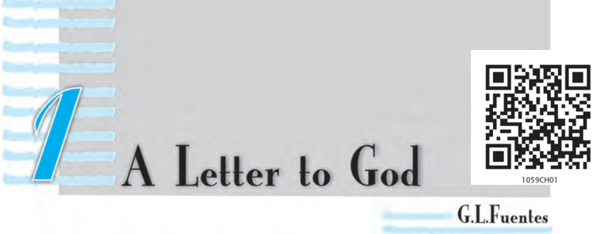
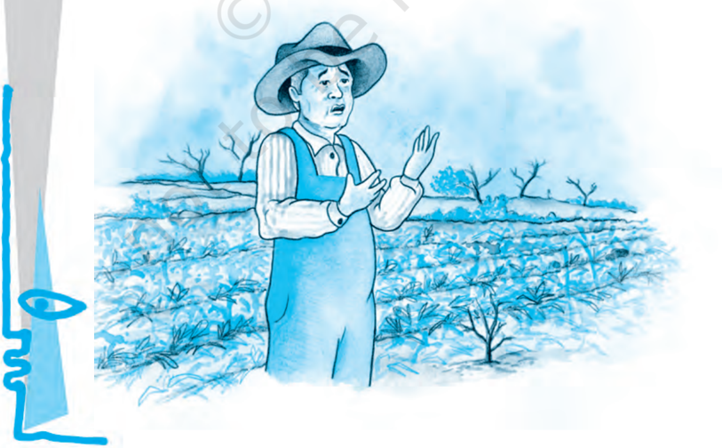
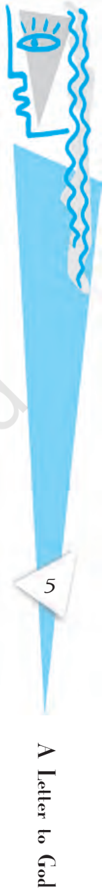
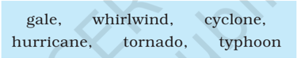
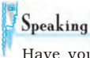

# PAGE 1

## BEFORE YOU READ

They say faith can move mountains. But what should we put our faith in? This is the question this story delicately poses.

Lencho is a farmer who writes a letter to God when his crops are ruined, asking for a hundred pesos. Does Lencho's letter reach God? Does God send him the money? Think what your answers to these questions would be, and guess how the story continues, before you begin to read it.

## Activity

1. One of the cheapest ways to send money to someone is through the post office. Have you ever sent or received money in this way?  Here's what you have to do.  (As you read the instructions, discuss with your teacher in class the meanings of these words: counter , counter clerk, appropriate, acknowledgement, counterfoil, record. Consult a dictionary if necessary. Are there words corresponding to these English words in your languages?)

# PAGE 2

2. Fill out the Money Order form given below using the clues that follow the form.

# PAGE 3

- Think about who you will send the money to, and how much. You might want to send money for a magazine subscription, or to a relative or a friend.
- Or you may fill out the form with yourself as sender and your partner as receiver.  Use a part of your pocket money, and submit the form at the nearest post office to see how it's done. See how your partner enjoys getting money by post!
- Notice that the form has three parts - the Money Order form, the part for official use and the Acknowledgement. What would you write in the 'Space for Communication'?

Now complete the following statements.

- (i) In addition to the sender, the form has to be signed by the
- (ii) The 'Acknowledgement' section of the form is sent back by the  post  office  to  the after  the signs it.
- (iii) The  'Space  for  Communication'  section  is  used  for
- (iv) The  form  has  six  sections.  The  sender  needs  to  fill out sections  and  the  receiver

THE house - the only one in the entire valley - sat on  the  crest of  a  low  hill.  From  this  height  one could see the river and the field of ripe corn dotted with  the  flowers  that  always  promised  a  good harvest.  The  only  thing  the  earth  needed  was  a downpour or at  least  a  shower.  Throughout  the morning Lencho - who knew his fields intimately - had done nothing else but see the sky towards the  north-east.

'Now we're really going to get some water, woman.' The woman who was preparing supper, replied, 'Yes,  God  willing'.  The  older  boys  were  working  in the field,  while  the  smaller  ones  were  playing  near the house until the woman called to them all, 'Come for  dinner'.  It  was  during  the  meal  that,  just  as crest top of a hill

3

# PAGE 4

Lencho had predicted, big drops of rain began to fall.  In  the  north-east  huge  mountains  of  clouds could be seen approaching. The air was fresh and sweet. The man went out for no other reason than to have the pleasure of feeling the rain on his body, and when he returned he exclaimed, ''These aren't raindrops falling from the sky, they are new coins. The big drops are ten cent pieces and the little ones are  fives.''

With a satisfied expression he regarded the field of ripe corn with its flowers, draped in a curtain of rain.  But  suddenly  a  strong  wind  began  to  blow and along with the rain very large hailstones began to  fall.  These  truly  did  resemble  new  silver  coins. The boys, exposing themselves to the rain, ran out to  collect  the  frozen  pearls.

''It's really getting bad now,'' exclaimed the man. 'I  hope  it  passes  quickly.'  It  did  not  pass  quickly. For  an  hour  the  hail  rained  on  the  house,  the garden,  the  hillside,  the  cornfield,  on  the  whole valley.  The  field  was  white,  as  if  covered  with  salt.

Not a leaf remained on the trees. The corn was totally  destroyed.  The  flowers  were  gone  from  the plants. Lencho's soul was filled with sadness. When the storm had passed, he stood in the middle of the field and said to his sons, 'A plague of locusts would draped covered (with cloth)

locusts

insects which fly in big swarms (groups) and destroy crops

# PAGE 5

have left more than this. The hail has left nothing. This year we will have no corn.''

That night was a sorrowful one.

'All our work, for nothing.'

''There's no one who can help us.'

'We'll all go hungry this year.'

## Oral Comprehension Check

1. What did Lencho hope for?
2. Why did Lencho say the raindrops were like 'new coins'?
3. How did the rain change? What happened to Lencho's fields?
4. What were Lencho's feelings when the hail stopped?

But in the hearts of all who lived in that solitary house in the middle of the valley, there was a single hope: help from God.

'Don't be so upset, even though this seems like a total loss. Remember, no one dies of hunger.'

'That's what they say: no one dies of hunger.'

All  through  the  night,  Lencho  thought  only  of his  one  hope:  the  help  of  God,  whose  eyes,  as  he had been instructed, see everything, even what is deep in  one's  conscience.  Lencho  was  an  ox  of  a man, working like an animal in the fields, but still he  knew  how  to  write.  The  following  Sunday,  at daybreak,  he  began  to  write  a  letter  which  he himself would carry to town and place in the mail. It was nothing less than a letter to God.

'God,' he wrote, 'if you don't help me, my family and I  will  go  hungry  this  year.  I  need  a  hundred pesos in  order  to  sow  my  field  again  and  to  live until  the  crop  comes,  because  the  hailstorm....'

He wrote 'To God' on the envelope, put the letter inside and, still troubled, went to town. At the post office, he placed a stamp on the letter and dropped it  into  the  mailbox.

One of the employees, who was a postman and also  helped  at  the  post  office,  went  to  his  boss laughing heartily and showed him the letter to God. Never  in  his  career  as  a  postman  had  he  known that  address.  The  postmaster  -  a  fat,  amiable

## conscience

an inner sense of right and wrong

|                     | A Letter   |
|---------------------|------------|
| peso                | to         |
| currency of several |            |
| Latin American      | God        |

## amiable

friendly and pleasant

# PAGE 6

fellow  -  also  broke  out  laughing,  but  almost immediately  he  turned  serious  and,  tapping  the letter on his desk, commented, 'What faith! I wish I had  the  faith  of  the  man  who  wrote  this  letter. Starting up a correspondence with God!'

So, in order not to shake the writer's faith in God, the  postmaster  came up with an idea: answer the letter.  But  when he opened it, it was evident that to answer it he needed something more than goodwill, ink  and  paper.  But  he  stuck  to  his  resolution:  he asked for money from his employees, he himself gave part  of  his  salary,  and  several  friends  of  his  were obliged to give something 'for an act of charity'.

It was impossible for him to gather together the hundred pesos, so he was able to send the farmer only a little more than half. He put the money in an envelope addressed to Lencho and with it a letter containing only a single word as a signature: God.

## Oral Comprehension Check

1. Who or what did Lencho have faith in? What did he do?
2. Who read the letter?
3. What did the postmaster do then?

The following Sunday Lencho came a bit earlier than  usual  to  ask  if  there  was  a  letter  for  him. It  was  the  postman  himself  who  handed  the  letter to  him  while  the  postmaster,  experiencing  the contentment of  a  man  who has  performed a good deed, looked on from his office.

Lencho  showed  not  the  slightest  surprise  on seeing  the  money;  such  was  his  confidence  -  but he became angry when he counted the money. God could not have made a mistake, nor could he have denied Lencho what he had requested.

Immediately, Lencho went up to the window to ask for paper and ink. On the public writing-table, he started to write, with much wrinkling of his brow, caused by the effort he had to make to express his ideas. When he finished, he went to the window to buy a stamp which he licked and then affixed to contentment satisfaction

# PAGE 7

the  envelope  with  a  blow  of  his  fist.  The  moment the letter fell into the mailbox the postmaster went to open it. It said: 'God: Of the money that I asked for,  only  seventy  pesos  reached  me.  Send  me  the rest, since I need it very much. But don't send it to me  through  the  mail  because  the  post  office employees are a bunch of crooks. Lencho.'

## Oral Comprehension Check

1. Was Lencho surprised to find a letter for him with money in it?
2. What made him angry?
1. Who does Lencho have complete faith in? Which sentences in the story tell you this?
2. Why does the postmaster send money to Lencho? Why does he sign the letter  'God'?
3. Did Lencho try to find out who had sent the money to him? Why/Why not?
4. Who does Lencho think has taken the rest of the money? What is the irony in the situation? (Remember that the irony of a situation is an unexpected aspect  of  it.  An  ironic  situation  is  strange  or  amusing  because  it  is  the opposite of what is expected.)

7

# PAGE 8

5. Are there people like Lencho in the real world? What kind of a person would you say he is? You may select appropriate words from the box to answer the question.

greedy naive stupid ungrateful selfish comical unquestioning

6. There are two kinds of conflict in the story:  between humans and nature, and between humans themselves. How are these conflicts illustrated?
- I. Look at the following sentence from the story.

Suddenly a strong wind began to blow and along with the rain very large hailstones  began  to  fall.

'Hailstones'  are  small  balls  of  ice  that  fall  like  rain.  A  storm  in  which hailstones fall is a 'hailstorm'. You know that a storm is bad weather with strong  winds,  rain,  thunder  and  lightning.

There are different  names  in  different  parts  of  the  world  for  storms, depending on their nature. Can you match the names in the box with their descriptions below, and fill in the blanks? You may use a dictionary to help you.

1. A violent tropical storm in which strong winds move in a circle: \_\_ \_\_ c \_\_ \_\_ \_\_ \_\_
2. An extremely strong wind : \_\_ a \_\_ \_\_
3. A violent tropical storm with very strong winds : \_\_ \_\_ p \_\_ \_\_ \_\_ \_\_
4. A violent storm whose centre is a cloud in the shape of a funnel: \_\_ \_\_ \_\_ n \_\_ \_\_ \_\_
5. A violent storm with very strong winds, especially in the western Atlantic Ocean: \_\_ \_\_ r \_\_ \_\_ \_\_ \_\_ \_\_ \_\_
6. A  very  strong  wind  that  moves  very  fast  in  a  spinning  movement  and causes a lot of damage: \_\_ \_\_ \_\_ \_\_ l \_\_ \_\_ \_\_ \_\_
- II. Notice how the word 'hope' is used in these sentences from the story:
8. (a) I  hope it (the hailstorm) passes quickly.
9. (b) There was a single hope: help from God.

In the first example, 'hope' is a verb which means you wish for something to happen. In the second example it is a noun meaning a chance for something to  happen.

# PAGE 9

## Match the sentences in Column A with the meanings of 'hope' in Column B.

A

| 1. Will you get the subjects you want to study in college? I hope so. 2. I hope you don't mind my saying this, but I don't like the way you are arguing. 3. This discovery will give new hope to HIV/AIDS sufferers. 4. We were hoping against hope that the judges would not notice our mistakes. 5. I called early in the hope of speaking to her before she went to school. 6. Just when everybody had given up hope , the fishermen came back, seven days after the cyclone.   | - a feeling that something good will probably happen - thinking that this would happen (It may or may not have happened.) - stopped believing that this good thing would happen - wanting something to happen (and thinking it quite possible) - showing concern that what you say should not offend or disturb the other person: a way of being polite - wishing for something to happen, although this is very unlikely   |
|------------------------------------------------------------------------------------------------------------------------------------------------------------------------------------------------------------------------------------------------------------------------------------------------------------------------------------------------------------------------------------------------------------------------------------------------------------------------------------|-----------------------------------------------------------------------------------------------------------------------------------------------------------------------------------------------------------------------------------------------------------------------------------------------------------------------------------------------------------------------------------------------------------------------------|

## III. Relative  Clauses

Look at these sentences

- (a) All morning Lencho - who knew his fields intimately - looked at the  sky.
- (b) The woman, who was preparing supper , replied, 'Yes, God willing.''

The italicised parts of the sentences give us more information about Lencho and the woman. We call them relative clauses . Notice that they begin with a relative pronoun who . Other common relative pronouns are whom , whose , and which .

The relative  clauses  in  (a)  and  (b)  above  are  called non-defining ,  because we  already  know  the  identity  of  the  person  they  describe.  Lencho  is  a particular person, and there is a particular woman he speaks to. We don't need the information in the relative clause to pick these people out from a larger  set.

A  non-defining  relative  clause  usually  has  a  comma  in  front  of  it  and  a comma after it (some writers use a dash (-) instead, as in the story). If the relative clause comes at the end, we just put a full stop.

## Join the sentences given below using who , whom , whose , which ,  as suggested.

1. I often go to Mumbai. Mumbai is the commercial capital of India. ( which )
2. My mother is  going  to  host  a  TV  show  on  cooking.  She  cooks  very well.  ( who )

B

# PAGE 10

3. These sportspersons are going to meet the President. Their performance has been excellent. ( whose )
4. Lencho prayed to God. His eyes see into our minds. ( whose )
5. This man cheated me. I trusted him. ( whom )

Sometimes the relative pronoun in a relative clause remains 'hidden'. For example, look at the first sentence of the story:

- (a) The house - the only one in the entire valley - sat on the crest of a low hill.

We can rewrite this sentence as:

- (b) The house which was the  only one in the entire valley - sat on the crest of a low hill.
- In (a), the relative pronoun which and the verb was are not present.

## IV. Using  Negatives  for  Emphasis

We know that sentences with words such as no,  not or nothing show  the absence of something, or contradict something. For example:

- (a) This year we will have no corn. (Corn will be absent)
- (b) The hail has left nothing. (Absence of a crop)
- (c) These  aren't  raindrops  falling  from  the  sky,  they  are  new  coins. (Contradicts the common idea of what the drops of water falling from the sky are)

But sometims negative words are used just to emphasise an idea. Look at these  sentences  from  the  story:

- (d) Lencho…had done nothing else but see  the  sky  towards  the  northeast. (He had done only this)
- (e) The man went out for no other reason than to  have  the  pleasure of feeling the rain on his body. (He had only this reason)
- (f) Lencho  showed not  the  slightest  surprise on  seeing  the  money. (He showed no surprise at all)

Now look back at example (c). Notice that the contradiction in fact serves to emphasise the value or usefulness of the rain to the farmer.

Find  sentences  in  the  story  with  negative  words,  which  express  the following  ideas  emphatically.

1. The trees lost all their leaves.

2. The letter was addressed to God himself.

3. The postman saw this address for the first time in his career.

# PAGE 11

## V. Metaphors

The word metaphor comes from a Greek word meaning 'transfer'. Metaphors compare two things or ideas: a quality or feature of one thing is transferred to  another thing. Some common metaphors are

- the leg of the table: The leg supports our body. So the object that supports a table is described as a leg.
- the heart of the city: The heart is an important organ in the centre of our body. So this word is used to describe the central area of a city.

In pairs, find metaphors from the story to complete the table below. Try to say what qualities are being compared. One has been done for you.

| Object     | Metaphor                 | Quality or Feature Compared                                                   |
|------------|--------------------------|-------------------------------------------------------------------------------|
| Cloud      | Huge mountains of clouds | The mass or 'hugeness' of mountains                                           |
| Raindrops  |                          |                                                                               |
| Hailstones |                          |                                                                               |
| Locusts    |                          |                                                                               |
|            |                          | An epidemic (a disease) that spreads very rapidly and leaves many people dead |
|            | An ox of a man           |                                                                               |

Have  you  ever  been  in  great  difficulty,  and  felt  that  only  a  miracle  could help  you?  How  was  your  problem  solved?  Speak  about  this  in  class  with your  teacher.

# PAGE 12

Listen to the letter  (given  under  'In  This  Lesson')  read  out  by  your  teacher/on the audio tape. As you listen fill in the table given below.

| The writer apologises (says sorry) because   |
|----------------------------------------------|
| The writer has sent this to the reader       |
| The writer sent it in the month of           |
| The reason for not writing earlier           |
| Sarah goes to                                |
| Who is writing to whom?                      |
| Where and when were they last together?      |

Lencho suffered first due to drought and then by floods. Our country is also facing such situations in the recent years. There is flood and there is drought. There is a need to save water through water harvesting. Design a poster for your area on how to save water during summer and when it is available in excess.

| WHAT WE HAVE DONE                                                                                                                                                              |
|--------------------------------------------------------------------------------------------------------------------------------------------------------------------------------|
| • Introduced students to the story that they are going to read.                                                                                                                |
| • Related a thought-provoking story about the nature of belief.                                                                                                                |
| • Helped students, through an interesting activity, to understand something that happens in the story - how to send money using a money order.                                 |
| • Guided them through the reading activity by providing periodic comprehension checks as they read, and checked for holistic understanding at the end of the reading activity. |
| • Provided interesting exercises to strengthen students' grasp of the specific vocabulary found in the story, and also introduced them to related vocabulary.                  |

# PAGE 13

# PAGE 14

## Dust  of  Sno Dust  of  Sno Dust  of  Sno Dust  of  Sno Dust  of  Snow w w w w

The way a crow Shook down on me The dust of snow From a hemlock tree

Has given my heart A change of mood And saved some part Of a day I had rued.

ROBERT FROST

hemlock :  A  poisonous plant (tree) with small white flowers rued :  held  in  regret

This poem presents a moment that seems simple, but has a larger significance. [Compare this  other  quotation  from  Robert  Frost:  'Always,  always  a  larger significance...  A  little  thing  touches  a  larger  thing.')

1. What is a 'dust of snow'? What does the poet say has changed his mood? How has the poet's mood changed?
2. How does Frost present nature in this poem? The following questions may help you to think of an answer.
3. (i) What are the birds that are usually named in poems? Do you think a crow is  often  mentioned  in  poems?  What  images  come  to  your  mind when you think of a crow?
4. (ii) Again,  what  is  'a  hemlock  tree'?    Why  doesn't  the  poet  write  about  a more 'beautiful' tree such as a maple, or an oak, or a pine?
5. (iii) What do the 'crow' and 'hemlock' represent - joy or sorrow? What does the dust of snow that the crow shakes off a hemlock tree stand for?
3. Have  there  been  times  when  you  felt  depressed  or  hopeless?  Have  you experienced a similar moment that changed your mood that day?

# PAGE 15

## Fire  and  Ice Fire  and  Ice Fire  and  Ice Fire  and  Ice Fire  and  Ice

Some say the world will end in fire Some say in ice. From what I've tasted of desire I  hold with those who favour fire.

But if it had to perish twice, I think I know enough of hate To say that for destruction ice Is  also  great And would suffice.

perish

:  die

suffice

:  be  sufficient

1. There are many ideas about how the world will 'end'. Do you think the world will end some day? Have you ever thought what would happen if the sun got so hot that it 'burst', or grew colder and colder?
2. For Frost, what do 'fire' and 'ice' stand for? Here are some ideas:
3. What is the rhyme scheme of the poem? How does it help in bringing out the contrasting ideas in the poem?

| greed         | avarice   | cruelty      | lust     |
|---------------|-----------|--------------|----------|
| conflict      | fury      | intolerance  | rigidity |
| insensitivity | coldness  | indifference | hatred   |

ROBERT FROST