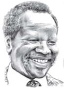
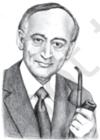
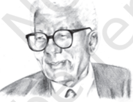
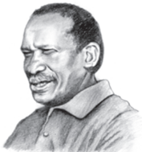
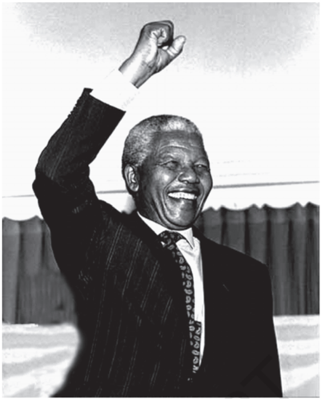
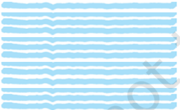

# PAGE 1

## BEFORE YOU READ

- 'Apartheid' is a political system that separates people according to their race. Can you say which of the three countries named below had such a political system until very recently?
- (i)    United States of America (ii)    South Africa (iii)    Australia
- Have you heard of Nelson Mandela? Mandela, and his African National Congress, spent a lifetime fighting against apartheid. Mandela had to spend thirty years in prison. Finally, democratic elections were held in South Africa in 1994, and Mandela became the first black President of a new nation.

In this extract from his autobiography, Long Walk to Freedom , Mandela speaks about a historic occasion, 'the inauguration'. Can you guess what the occasion might be? Check your guess with this news item (from the BBC) of 10 May 1994.

## Mandela Becomes South Africa's First Black President

Nelson  Mandela  has  become  South  Africa's  first  Black President after more than three centuries of White rule. Mr Mandela's African National Congress (ANC) party won 252 of the 400 seats in the first democratic elections of South Africa's history.

The inauguration ceremony took place in the Union Buildings  amphitheatre  in  Pretoria  today,  attended  by politicians  and  dignitaries  from  more  than  140  countries around the world. 'Never, never again will this beautiful land experience the oppression of one by another, ' said Nelson Mandela in his address.

… Jubilant scenes on the streets of Pretoria followed the ceremony with blacks, whites and coloureds celebrating together... More than 100,000 South African men, women and children of all races sang and danced with joy.

# PAGE 2

## Activity

In Column A are some expressions you will find in the text. Make a guess and match each expression with an appropriate meaning from Column B.

A

- (i) A rainbow gathering of different colours and nations
- (ii) The seat of white supremacy
- (iii) Be overwhelmed with a sense of history
- (iv) Resilience that defies the imagination
- (v) A glimmer of humanity
- (vi) A twilight existence

B

- -A great ability (almost unimaginable) to remain unchanged by suffering (not losing hope, goodness or courage)
- -A half-secret life, like a life lived in the fading light between sunset and darkness
- -A sign of human feeling (goodness, kindness, pity, justice, etc.)
- -A beautiful coming together of various peoples, like the colours in a rainbow
- -The centre of racial superiority
- -Feel deeply emotional, remembering and understanding all the past events that have led up to the moment

TENTH  May  dawned  bright  and  clear.  For  the  past few  days  I  had  been  pleasantly  besieged  by dignitaries  and  world  leaders  who  were  coming  to pay  their  respects  before  the  inauguration.  The inauguration would be the largest gathering ever of international  leaders  on  South  African  soil.

The  ceremonies  took  place  in  the  lovely sandstone  amphitheatre formed  by  the  Union Buildings  in  Pretoria.  For  decades  this  had  been the  seat  of  white  supremacy,  and  now  it  was  the site of a rainbow gathering of different colours and nations for  the  installation  of  South  Africa's  first democratic,  non-racial  government.

On that lovely autumn day I was accompanied by my daughter Zenani. On the podium, Mr de Klerk was first sworn in as second deputy president. Then

(to be) besieged by to be surrounded closely by

## amphitheatre

a building without a roof, with many rows of seats rising in steps (typical of ancient Greece and Rome)

# PAGE 3

Thabo Mbeki was sworn in as first deputy president. When it was my turn, I pledged to obey and uphold the  Constitution  and  to  devote  myself  to  the  wellbeing  of  the  Republic  and  its  people.  To  the assembled guests and the watching world, I said:

Today, all of us do, by our presence here... confer glory and hope to newborn liberty. Out of the experience of an extraordinary human disaster that lasted too long, must be born a society  of  which  all  humanity  will be proud.

We, who were outlaws not so long ago, have today been given the rare privilege to be host to the nations of the  world  on  our  own  soil.  We  thank  all  of  our distinguished international guests for having come to take possession with the people of our country of what is, after all, a common victory for justice, for peace, for human dignity.

We have, at last, achieved our political emancipation. We pledge ourselves to liberate all our people from the continuing bondage of poverty, deprivation, suffering, gender and other discrimination.

Never, never, and never again shall it be that this beautiful land will again experience the oppression of one by another.

The sun shall never set on so glorious a human achievement.

Let freedom reign. God bless Africa!

## Oral Comprehension Check

1. Where did the ceremonies take place? Can you name any public buildings in India that are made of sandstone?
2. Can you say how 10 May is an 'autumn day' in South Africa?

confer (a  formal word) here, give

## We, who were outlaws

because of its policy of apartheid, many countries had earlier broken off diplomatic relations with South Africa

## emancipation

freedom from restriction

## deprivation

state  of  not  having one's rightful benefits

## discrimination

being treated differently or unfavourably

# PAGE 4

3. At the beginning of his speech, Mandela mentions 'an extraordinary human disaster'. What does he mean by this? What is the 'glorious … human achievement' he speaks of at the end?
4. What does Mandela thank the international leaders for?
5. What ideals does he set out for the future of South Africa?

A  few  moments  later  we  all  lifted  our  eyes  in awe as a spectacular array of South African jets, helicopters  and  troop  carriers  roared  in  perfect formation over the Union Buildings. It was not only a  display  of  pinpoint  precision  and  military  force, but  a  demonstration  of  the  military's  loyalty  to democracy,  to  a  new  government  that  had  been freely  and  fairly  elected.  Only  moments  before,  the highest generals of the South African defence force and police, their chests bedecked with ribbons and medals from days gone by, saluted me and pledged their  loyalty.  I  was not  unmindful of the fact  that not  so  many  years  before  they  would  not  have saluted but arrested me. Finally a chevron of Impala jets left a smoke trail of the black, red, green, blue and gold of the new South African flag.

The day was symbolised for me by the playing of our two national anthems, and the vision of whites singing 'Nkosi  Sikelel  -iAfrika' and blacks singing 'Die Stem', the old anthem of the Republic. Although that day neither group knew the lyrics of the anthem they  once  despised,  they  would  soon  know  the words by heart.

On  the  day  of  the  inauguration,  I  was overwhelmed with  a  sense  of  history.  In  the  first decade of the twentieth century, a few years after the bitter Anglo-Boer war and before my own birth, the  white-skinned peoples of South Africa patched up their differences and erected a system of racial domination against the dark-skinned peoples of their own land. The structure they created formed the basis  of  one  of  the  harshest,  most  inhumane, societies  the  world  has  ever  known.  Now,  in  the last  decade  of  the  twentieth  century,  and  my  own eighth  decade  as  a  man,  that  system  had  been spectacular array an impressive display (colourful and attractive)

not  unmindful  of conscious of; aware of chevron a pattern in the shape of a V

despised had a very low opinion of

19

Nelson Mandela: Long W alk to Freedom

# PAGE 5

20

overturned  forever  and  replaced  by  one  that recognised the rights  and  freedoms  of  all  peoples, regardless of the colour of their skin.

That  day  had  come  about  through  the unimaginable sacrifices of thousands of my people, people  whose  suffering  and  courage  can  never  be counted or repaid. I felt  that  day,  as  I  have  on  so many other days, that I was simply the sum of all those African patriots who had gone before me. That long  and  noble  line  ended  and  now  began  again with me. I was pained that I was not able to thank them and that they were not able to see what their sacrifices  had  wrought.

The policy of apartheid created a deep and lasting wound in my country and my people. All of us will spend many years, if  not  generations,  recovering from  that  profound hurt.  But  the  decades  of oppression and brutality had another, unintended, effect,  and  that  was  that  it  produced  the  Oliver Tambos, the Walter Sisulus, the Chief Luthulis, the Yusuf  Dadoos,  the  Bram  Fischers,  the  Robert Sobukwes of our time* - men of such extraordinary

Oliver Tambo

Yusuf Dadoo

Walter Sisulu

Bram Fischer

Chief Luthuli

Robert Sobukwe

* These are some prominent names in the struggle against apartheid. (For the use of the definite article with proper nouns, see exercise II on page 25)

wrought (old fashioned, formal word) done, achieved profound deep and strong

# PAGE 6

courage, wisdom and generosity that their like may never  be  known  again.  Perhaps  it  requires  such depths  of  oppression  to  create  such  heights  of character.  My  country  is  rich  in  the  minerals  and gems that lie  beneath  its  soil,  but  I  have  always known that its greatest wealth is its  people,  finer and truer than the purest diamonds.

It  is  from  these  comrades in the struggle that I learned the meaning of courage. Time and again, I have seen men and women risk and give their lives for  an  idea.  I  have  seen  men  stand  up  to  attacks and torture without breaking, showing a strength and resilience that defies the imagination. I learned that  courage  was  not  the  absence  of  fear,  but  the triumph over it. The brave man is not he who does not feel afraid, but he who conquers that fear.

No one is born hating another person because of the  colour  of  his  skin,  or  his  background,  or  his religion.  People  must  learn  to  hate,  and  if  they  can learn  to  hate,  they  can  be  taught  to  love,  for  love comes more naturally to the human heart than its opposite. Even in the grimmest times in prison, when my comrades and I were pushed to our limits , I would see  a  glimmer  of  humanity  in  one  of  the  guards, perhaps just  for  a  second,  but  it  was  enough  to reassure me and keep me going. Man's goodness is a flame that can be hidden but never extinguished.

## Oral Comprehension Check

1. What do the military generals do? How has their attitude changed, and why?
2. Why were two national anthems sung?
3. How does Mandela describe the systems of government in his country (i)  in  the  first  decade, and (ii) in the final decade, of the twentieth century?
4. What does courage mean to Mandela?
5. Which does he think is natural, to love or to hate?

In  life,  every  man  has  twin  obligations  obligations to his family, to his parents, to his wife and children; and he has an obligation to his people, his community, his country. In a civil and humane

resilience

the ability to deal with any kind of hardship and recover from its effects

## pushed to our limits

pushed to the last point in our ability to bear pain

# PAGE 7

society, each man is able to fulfil those obligations according to his own inclinations and abilities. But in  a  country  like  South  Africa,  it  was  almost impossible for a man of my birth and colour to fulfil both of those obligations. In South Africa, a man of colour who attempted to live as a human being was punished and isolated. In South Africa, a man who tried  to  fulfil  his  duty  to  his  people  was  inevitably ripped from his family and his home and was forced to  live  a  life  apart,  a  twilight  existence  of  secrecy and rebellion. I did not in the beginning choose to place my people above my family, but in attempting to  serve  my  people,  I  found  that  I  was  prevented from fulfilling my obligations as a son, a brother, a father and a husband.

I was not born with a hunger to be free. I was born free  -  free  in  every  way  that  I  could  know.  Free  to run in the fields near my mother's hut, free to swim in the clear stream that ran through my village, free to  roast  mealies  under the stars and ride the broad backs of slow-moving bulls. As long as I obeyed my father and abided by the customs of my tribe, I was not troubled by the laws of man or God.

It was only when I began to learn that my boyhood freedom  was  an  illusion,  when  I  discovered  as  a young man that my freedom had already been taken from me, that I began to hunger for it. At first, as a student,  I  wanted  freedom  only  for  myself,  the transitory freedoms of being able to stay out at night, read what I pleased and go where I chose. Later, as a  young  man  in  Johannesburg,  I  yearned  for  the basic  and  honourable  freedoms  of  achieving  my potential,  of  earning  my  keep,  of  marrying  and having a family - the freedom not to be obstructed in  a  lawful  life.

But then I slowly saw that not only was I not free,  but  my  brothers  and  sisters  were  not  free.  I saw  that  it  was  not  just  my  freedom  that  was curtailed, but the freedom of everyone who looked like I did. That is when I joined the African National Congress, and that is when the hunger for my own freedom became the greater hunger for the freedom

## inclinations

natural tendencies of behaviour inevitably unavoidably

something that appears to be real illusion but is not

transitory not permanent

curtailed reduced

# PAGE 8

of my people. It was this desire for the freedom of my people to live their lives with dignity and selfrespect that animated my life, that transformed a frightened young man into a bold one, that drove a law-abiding  attorney  to  become  a  criminal,  that turned a family-loving husband into a man without a home, that forced a life-loving man to live like a monk. I  am  no  more  virtuous  or  self-sacrificing than  the  next  man,  but  I  found  that  I  could  not even  enjoy  the  poor  and  limited  freedoms  I  was allowed  when  I  knew  my  people  were  not  free. Freedom is  indivisible;  the  chains  on  anyone  of my people  were  the  chains  on  all  of  them,  the chains on all of my people were the chains on me.

I  knew that the oppressor must be liberated just as surely as the oppressed. A man who takes away another man's freedom is a prisoner of hatred; he is locked  behind  the  bars  of  prejudice and narrowmindedness. I am not truly free if I am taking away someone else's freedom, just as surely as I am not free when my freedom is taken from me. The oppressed and the oppressor alike are robbed of their humanity.

prejudice a strong dislike without any good reason

23

Nelson Mandela: Long W alk to Freedom

# PAGE 9

24

## Oral Comprehension Check

1. What 'twin obligations' does Mandela mention?
2. What did being free mean to Mandela as a boy, and as a student? How does he contrast these 'transitory freedoms' with 'the basic and honourable freedoms'?
3. Does Mandela think the oppressor is free? Why/Why not?
1. Why did such a large number of international leaders attend the inauguration? What did it signify the triumph of?
2. What does Mandela mean when he says he is 'simply the sum of all those African patriots' who had gone before him?
3. Would you agree that the 'depths of oppression' create 'heights of character'? How does Mandela illustrate this? Can you add your own examples to this argument?
4. How  did  Mandela's  understanding  of  freedom  change  with  age  and experience?
5. How did Mandela's 'hunger for freedom' change his life?
- I. There are nouns in the text ( formation , government )  which are formed from the  corresponding  verbs  ( form, govern )  by  suffixing  -( at ) ion or ment .  There may be a change in the spelling of some verb - noun pairs: such as rebel , rebellion ; constitute , constitution .
1. Make a list of such pairs of nouns and verbs in the text.

| Noun         | Verb       |
|--------------|------------|
| rebellion    | rebel      |
| constitution | constitute |

# PAGE 10

## 2. Read the paragraph below. Fill in the blanks with the noun forms of the  verbs  in  brackets.

Martin  Luther  King's (contribute)  to  our  history  as  an outstanding leader began when he came to the (assist)  of Rosa Parks, a seamstress who refused to give up her seat on a bus to a white  passenger.  In  those  days  American  Blacks  were  confined  to positions of second class citizenship by restrictive laws and customs. To break these laws would mean (subjugate)  and (humiliate)  by  the  police  and  the  legal  system.  Beatings, (imprison)  and  sometimes  death  awaited  those  who  defied  the  System. Martin Luther King's tactics of protest involved non-violent (resist)  to  racial  injustice.

## II. Using the Definite Article with Names

You know that the definite article 'the'  is  not  normally  used  before  proper nouns. Nor do proper nouns usually occur in the plural. (We do not say: * The Nelson Mandela ,  or  * Nelson Mandelas .)  But  now look at this sentence from the text:

… the decades of oppression and brutality … produced the Oliver Tambos, the Walter Sisulus, … of our time.

Used in this  way  with the and/or in the plural,  a  proper  noun  carries  a special  meaning. For example, what do you think the names above mean? Choose the right answer.

- (a) for example Oliver Tambo, Walter Sisulu, …
- (b) many other men like Oliver  Tambo,  Walter  Sisulu  …/ many men of their type or kind, whose names may not be as well known.

Did you choose option (b)? Then you have the right answer!

Here are some more examples of 'the' used with proper names. Try to say what these sentences mean. (You may consult a dictionary if you wish. Look at the entry for 'the'.)

1. Mr Singh regularly invites the Amitabh Bachchans and the Shah Rukh Khans to his parties.
2. Many people think that Madhuri Dixit is the Madhubala of our times.
3. History  is  not  only  the  story  of  the  Alexanders,  the  Napoleons  and  the Hitlers, but of ordinary people as well.

# PAGE 11

26

## III. Idiomatic  Expressions

Match the italicised  phrases  in  Column  A  with  the  phrase  nearest  in meaning in Column B. ( Hint : First look for the sentence in the text in which the phrase in Column A occurs.)

A

B

|   1. | (i) (ii) (iii) I was not unmindful of the fact                  | had not forgotten; was aware of the fact was not careful about the fact forgot or was not aware of the fact                      |
|------|-----------------------------------------------------------------|----------------------------------------------------------------------------------------------------------------------------------|
|    2 | (i) (ii) (iii) when my comrades and I were pushed to our limits | pushed by the guards to the wall took more than our share of beatings felt that we could not endure the suffering any longer     |
|    3 | (i) (ii) to reassure me and keep me going                       | make me go on walking help me continue to live in hope in this very difficult situation (iii) make me remain without complaining |
|    4 | the basic and honourable freedoms of… earning my keep ,…        | (i) earning enough money to live on (ii) keeping what I earned (iii) getting a good salary                                       |

In  groups,  discuss  the  issues  suggested  in  the  box  below.  Then  prepare  a speech  of  about  two  minutes  on  the  following  topic.  (First  make  notes  for your  speech  in  writing.)

True  liberty  is  freedom  from  poverty,  deprivation  and  all  forms  of discrimination.

- causes of poverty and means of overcoming it
- discrimination based on gender, religion, class, etc.
- constitutionally  guaranteed  human  rights

## I. Looking at Contrasts

Nelson Mandela's writing is marked by balance :  many  sentences  have  two parts  in  balance.

Use the following phrases to complete the sentences given below.

- (i) they can be taught to love.

- (ii) I was born free.

- (iii) but the triumph over it.

- (iv) but he who conquers that fear.

- (v) to create such heights of character.

1. It  requires such depths of oppression

2. Courage was not the absence of fear

3. The brave man is not he who does not feel afraid

4. If people can learn to hate

5. I was not born with a hunger to be free.

- II. This  text  repeatedly  contrasts  the  past  with  the  present  or  the  future.  We can use coordinated clauses to contrast two views, for emphasis or effect. Given below are sentences carrying one part of the contrast. Find in the text the second part of the contrast, and complete each item. Identify the words which signal the contrast. This has been done for you in the first item.

1. For decades the Union Buildings had been the seat of white supremacy, and now ...

2. Only moments before, the highest generals of the South African defence force and police ... saluted me and pledged their loyalty. ... not so many years before they would not have saluted

3. Although that day neither group knew the lyrics of the anthem ..., they would soon

4. My country is rich in the minerals and gems that lie beneath its soil,

5. The Air Show was not only a  display of pinpoint precision and military force, but

6. It  was  this  desire  for  the  freedom  of  my  people  ...  that  transformed into  a  bold  one,  that  drove to  become  a criminal, that turned into a man without a home.

## III. Expressing Your Opinion

Do you think there is colour prejudice in  our  own  country?  Discuss  this with  your  friend  and  write  a  paragraph  of  about  100  to  150  words  about

# PAGE 12

# PAGE 13

this.  You  have  the  option  of  making  your  paragraph  a  humorous  one. (Read the short verse given below.)

When you were born you were pink

When you grew up you became white

When you are in the sun you are red

When you are sick you are yellow

When you are angry you are purple

When you are shocked you are grey

And you have the cheek to call me 'coloured'.

## WHAT WE HAVE DONE

Shared Nelson Mandela's moving description of his inauguration as South Africa's first black President, and his thoughts on freedom.

## WHAT YOU CAN DO

Divide your class into three groups and give each group one of the following topics to research: (i) black  Americans, and their fight against discrimination, (ii) women, and their fight for equality, (iii) the Vietnamese, and their fight for independence.

Choose a student from each group to present a short summary of each topic to the class.

## Homophones

Can you find  the  words  below  that  are  spelt similarly,  and  sometimes  even  pronounced similarly, but have very different meanings? Check their pronunciation and meaning in a dictionary.

- The bandage was wound around the wound.
- The soldier decided to desert his dessert in the desert.

# PAGE 14

## A T A T A T A T A Tiger in the Zoo iger  in  the  Zoo iger  in  the  Zoo iger  in  the  Zoo iger  in  the  Zoo

This poem contrasts a tiger in the zoo with the tiger in its natural habitat. The poem moves from the zoo to the jungle, and back again to the zoo. Read the poem silently once, and say which stanzas speak about the tiger in the zoo, and which ones speak about the tiger in the jungle.

He stalks in his vivid stripes The few steps of his cage, On pads of velvet quiet, In his quiet rage.

He should be lurking in shadow, Sliding  through  long  grass Near the water hole Where plump deer pass.

He should be snarling around houses At the jungle's edge, Baring his white fangs, his claws, Terrorising  the  village!

But he's locked in a concrete cell, His  strength  behind  bars, Stalking the length of his cage, Ignoring  visitors.

He hears the last voice at night, The patrolling  cars, And stares with his brilliant eyes At  the  brilliant  stars.

LESLIE NORRIS

# PAGE 15

snarls:

makes an angry, warning sound

1. Read the poem again, and work in pairs or groups to do the following tasks.
2. (i) Find the words that describe the movements and actions of the tiger in the cage and in the wild. Arrange them in two columns.
3. (ii) Find the words that describe the two places, and arrange them in two columns.

Now try to share ideas about how the poet uses words and images to contrast the  two  situations.

2. Notice the use of a word repeated in lines such as these:
2. (i) On pads of velvet quiet, In his quiet rage.
3. (ii) And stares with his brilliant eyes At  the  brilliant  stars.

What do you think is the effect of this repetition?

3. Read the following two poems - one about a tiger and the other about a panther.  Then  discuss:

Are zoos necessary for the protection or conservation of some species of animals? Are they useful for educating the public? Are there alternatives to zoos?

## The Tiger

The tiger behind the bars of his cage growls,

The tiger behind the bars of his cage snarls,

The tiger behind the bars of his cage roars.

Then he thinks.

It would be nice not to be behind bars all

The time

Because they spoil my view

I wish I were wild, not on show.

But if I were wild, hunters might shoot me,

But if I were wild, food might poison me,

But if I were wild, water might drown me.

Then he stops thinking

And...

The tiger behind the bars of his cage growls,

The tiger behind the bars of his cage snarls,

The tiger behind the bars of his cage roars.

PETER NIBLETT

# PAGE 16

## The Panther

His vision, from the constantly passing bars, has grown so weary that it cannot hold anything else. It seems to him there are a thousand bars; and behind the bars, no world.

As he paces in cramped circles, over and over, the movement of his powerful soft strides is  like  a  ritual  dance around a centre in  which a mighty will stands paralysed.

Only at times, the curtain of the pupils lifts,  quietly.  An  image enters in, rushes down through the tensed, arrested muscles, plunges into the heart and is gone.

## RAINER MARIA RILKE

4. Take a point of view for or against zoos, or even consider both points of view and write a couple of paragraphs or speak about this topic for a couple of minutes in class.

The Greater Cats

The greater cats with golden eyes Stare  out  between  the  bars. Deserts are there, and different skies, And night with different stars.

VICTORIA SACKVILLE-WEST

31