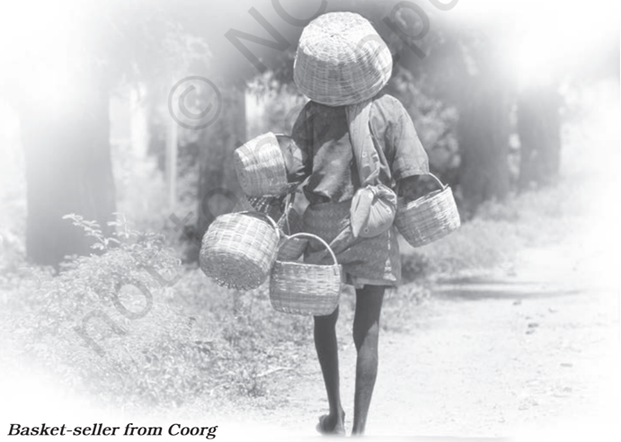

# PAGE 1

## B EFORE YOU R EAD

## Activity

Discuss in class

1. What images - of people and of places - come to your mind, when you think of our country?
2. What parts of India have you lived in, or visited? Can you name some popular tourist destinations?
3. You may know that apart from the British, the Dutch and the French, the Portuguese have also played a part in the history of our country. Can you say which parts of India show French and Portuguese influences?
4. Can you say which parts of India grow  (i) tea,  (ii) coffee?

This is a pen-portrait of a traditional Goan village baker who still has an important place in his society.

O UR elders  are  often  heard  reminiscing  nostalgically about those good old Portuguese days, the Portuguese and their famous loaves of bread. Those eaters of loaves might have vanished but the makers are still there. We still  have  amongst  us  the  mixers,  the  moulders and those who bake the loaves. Those age-old, timetested  furnaces  still  exist.  The  fire  in  the  furnaces has not yet been extinguished. The thud and jingle of reminiscing nostalgically thinking fondly of the past

# PAGE 2

the traditional baker's bamboo, heralding his  arrival in  the  morning,  can  still  be  heard  in  some  places. Maybe the father is not alive but the son still carries on the family profession. These bakers are, even today, known as pader in Goa.

During our childhood in Goa, the baker used to be  our  friend,  companion  and  guide.  He  used  to come at least twice a day. Once, when he set out in the morning on his selling round, and then again, when he returned after emptying his huge basket. The jingling  thud  of  his  bamboo  woke  us  up  from sleep and we ran to meet and greet him. Why was it so? Was it for the love of the loaf? Not at all. The loaves  were  bought  by  some  Paskine  or  Bastine, the maid-servant of the house! What we longed for were those bread-bangles which we chose carefully. Sometimes it was sweet bread of special make.

The baker made his musical entry on the scene with the 'jhang, jhang' sound of his specially made bamboo staff. One hand supported the basket on his head and the other banged the bamboo on the ground. He would greet the lady of the house with 'Good morning' and then place his basket on the vertical  bamboo.  We  kids  would  be  pushed  aside with a mild rebuke and the loaves would be delivered to the servant. But we would not give up. We would climb  a  bench  or  the  parapet  and  peep  into  the basket,  somehow.  I  can  still  recall  the  typical fragrance of those loaves. Loaves for the elders and the bangles for the children. Then we did not even care  to  brush  our  teeth  or  wash  our  mouths properly. And why should we? Who would take the trouble  of  plucking  the  mango-leaf  for  the toothbrush? And why was it necessary at all? The tiger  never  brushed  his  teeth.  Hot  tea  could  wash and clean up everything so nicely, after all!

## Oral Comprehension Check

1. What are the elders in Goa nostalgic about?
2. Is bread-making still popular in Goa? How do you know?
3. What is the baker called?
4. When would the baker come everyday? Why did the children run to meet him?

heralding announcing

## rebuke

an expression of disapproval; a scolding fragrance scent

# PAGE 3

Marriage gifts are meaningless without the sweet bread known as the bol ,  just  as  a  party  or  a  feast loses  its  charm  without  bread.  Not  enough  can  be said  to  show  how  important  a  baker  can  be  for  a village.  The  lady  of  the  house  must  prepare sandwiches  on  the  occasion  of  her  daughter's engagement. Cakes and bolinhas are  a  must  for Christmas  as  well  as  other  festivals.  Thus,  the presence  of  the  baker's  furnace  in  the  village  is absolutely  essential.

The baker or bread-seller  of  those  days  had  a peculiar dress known as the kabai . It was a singlepiece long frock reaching down to the knees. In our childhood  we  saw  bakers  wearing  a  shirt  and trousers  which  were  shorter  than  full-length  ones and  longer  than  half  pants.  Even  today,  anyone who wears a half  pant  which  reaches  just  below the  knees  invites  the  comment  that  he  is  dressed like  a pader !

The baker usually collected his bills at the end of the month. Monthly accounts used to be recorded on  some  wall  in  pencil.  Baking  was  indeed  a profitable profession in the old days. The baker and his  family  never  starved.  He,  his  family  and  his servants always looked happy and prosperous. Their plump physique was an open testimony to this. Even today  any  person  with  a  jackfruit-like  physical appearance is easily compared to a baker.

## Oral Comprehension Check

1. Match the following. What is a must (i) as marriage gifts? (ii) for a party or a feast? (iii) for a daughter's engagement? (iv) for Christmas?

plump physique pleasantly fat body open testimony public statement about a character or quality

- -cakes and bolinhas
- -sweet bread called bol
- -bread
- -sandwiches
2. What did the bakers wear: (i) in the Portuguese days? (ii) when the author was young?
3. Who invites the comment - 'he is dressed like a pader'? Why?
4. Where were the monthly accounts of the baker recorded?
5. What does a 'jackfruit  -like appearance' mean?

# PAGE 4

66

1. Which of these statements are correct?
2. (i) The pader was an important person in the village in old times.
3. (ii) Paders still  exist  in  Goan villages.
4. (iii) The paders went away with the Portuguese.
5. (iv) The paders continue to wear a single-piece long frock.
6. (v) Bread and cakes were an integral part of Goan life in the old days.
7. (vi) Traditional  bread-baking  is  still  a  very  profitable  business.
8. (vii) Paders and their families starve in the present times.
2. Is bread an important part of Goan life? How do you know this?
3. Tick the right answer. What is the tone of the author when he says the following?
11. (i) The thud and the jingle of the traditional baker's bamboo can still be heard in some places. (nostalgic, hopeful, sad)
12. (ii) Maybe the father  is  not  alive  but  the  son  still  carries  on  the  family profession.  (nostalgic,  hopeful,  sad)
13. (iii) I  still  recall  the  typical  fragrance  of  those  loaves.  (nostalgic,  hopeful, naughty)
14. (iv) The tiger  never  brushed  his  teeth.  Hot  tea  could  wash  and  clean  up everything  so  nicely,  after  all.  (naughty,  angry,  funny)
15. (v) Cakes and bolinhas are a must for Christmas as well as other festivals. (sad,  hopeful,  matter-of-fact)
16. (vi) The baker and his family never starved. They always looked happy and prosperous. (matter-of-fact,  hopeful,  sad)
- I. In  this  extract,  the  author  talks  about  traditional  bread-baking  during  his childhood days. Complete the following table with the help of the clues on the left.  Then write a paragraph about the author's childhood days.

| Clues                        | Author's childhood days   |
|------------------------------|---------------------------|
| the way bread was baked      |                           |
| the way the pader sold bread |                           |
| what the pader wore          |                           |
| when the pader was paid      |                           |
| how the pader looked         |                           |

# PAGE 5

- II. 1. Compare the piece from the text (on the left below) with the other piece on Goan bakers (on the right). What makes the two texts so different? Are the facts the same? Do both writers give you a picture of the baker?

Our  elders  are  often  heard reminiscing  nostalgically  about those  good  old  Portuguese  days, the Portuguese and their famous loaves  of  bread.  Those  eaters  of loaves  might  have  vanished  but the makers are still there.  We still have amongst us the mixers, the moulders and those who bake the loaves. Those age-old, time-tested furnaces still exist. The fire in the furnaces  had  not  yet  been extinguished.  The  thud  and  the jingle  of  the  traditional  baker's bamboo, heralding his arrival in the  morning,  can  still  be  heard in  some places.

May be the father is not alive but  the  son  still  carries  on  the family  profession.

2. Now find a travel brochure about a place you have visited. Look at the description in the brochure. Then write your own account, adding details from  your  own  experience,  to  give  the  reader  a  picture  of  the  place, rather  than  an  impersonal, factual  description.
1. In groups, collect information on how bakeries bake bread now and how the process has changed over time.
2. There are a number of craft-based professions which are dying out. Pick one of the crafts below. Make a group presentation to the class about the skills required,  and  the  possible  reasons  for  the  decline  of  the  craft.  Can  you think of ways to revive these crafts?
4. (i) Pottery
5. (ii) Batik  work
6. (iii) Dhurri (rug) weaving
7. (iv) Embroidery
8. (v) Carpentry
9. (vi) Bamboo weaving
10. (vii) Making jute products
11. (viii) Handloom

After Goa's liberation, people used to  say  nostalgically  that  the Portuguese bread vanished with the paders .  But  the paders have managed to survive because they have perfected the art of door-todoor delivery service. The paders pick up the knowledge of breadmaking  from  traditions  in  the family. The leavened, oven-baked bread is a gift of the Portuguese to India.

[ Adapted  from  Nandakumar Kamat's ' The Unsung Lives of Goan Paders ']

# PAGE 6

## II

## Coorg

Coorg is coffee country, famous for its rainforests and spices.

M IDWAY between  Mysore  and  the  coastal  town  of Mangalore sits  a  piece  of  heaven  that  must  have drifted from the kingdom of god. This land of rolling hills  is  inhabited  by  a  proud  race  of  martial men, beautiful  women and wild creatures.

Coorg,  or  Kodagu,  the  smallest  district  of Karnataka, is home to evergreen rainforests, spices and coffee plantations.  Evergreen rainforests cover thirty per cent of this district. During the monsoons, it  pours  enough  to  keep  many  visitors  away.  The season  of  joy  commences  from  September  and continues till  March.  The  weather  is  perfect,  with

some showers thrown in for good  measure.  The  air breathes  of  invigorating coffee.  Coffee  estates  and colonial  bungalows  stand tucked under tree canopies in  prime corners.

The fiercely independent people of Coorg are possibly of Greek or Arabic descent. As one story goes, a part of Alexander's  army  moved south along the coast and settled  here  when  return became impractical. These people married amongst the locals  and  their  culture  is apparent  in  the  martial traditions,  marriage  and religious  rites,  which  are distinct  from  the  Hindu mainstream. The theory of Arab origin  draws  support from  the  long,  black  coat

## drifted  from

## martial

been carried along gently by air having to do with war

## canopies

prime here, best roof-like coverings that form shelters

mainstream a tradition which

most people follow

# PAGE 7

with an embroidered waist-belt worn by the Kodavus. Known as kuppia, it  resembles  the kuffia worn by the Arabs and the Kurds.

Coorgi homes have a tradition of hospitality, and they  are  more  than  willing  to  recount  numerous tales  of  valour  related  to  their  sons  and  fathers. The Coorg Regiment is one of the most decorated in the  Indian  Army,  and  the  first  Chief  of  the  Indian Army, General Cariappa, was a Coorgi. Even now, Kodavus are the only people in India permitted to carry  firearms  without  a  licence.

The river, Kaveri, obtains its water from the hills and forests of Coorg.  Mahaseer - a large freshwater fish - abound in these waters. Kingfishers dive for their  catch,  while  squirrels  and  langurs  drop partially eaten fruit for the mischief of enjoying the splash  and  the  ripple  effect  in  the  clear  water. Elephants enjoy being bathed and scrubbed in the river  by  their  mahouts.

The most laidback individuals  become converts to the life of high-energy adventure with river rafting, canoeing,  rappelling,  rock  climbing  and  mountain stories of  courage and bravery, usually in war

## tales  of  valour

## most decorated

## laidback

having received the maximum number of awards for bravery in war relaxed; not in a hurry

travelling in a river in a raft ( a floating platform made by tying planks together)

## rafting

## canoeing

## rappelling

travelling in a river in a canoe (a large, narrow boat)

going down a cliff by sliding down a rope

# PAGE 8

biking.  Numerous walking trails in  this  region  are a  favourite  with  trekkers.

Birds, bees and butterflies are there to give you company. Macaques, Malabar squirrels, langurs and slender loris keep a watchful eye from the tree canopy. I do, however, prefer to step aside for wild elephants.

The  climb  to  the  Brahmagiri  hills  brings  you into a panoramic view of the entire misty landscape of Coorg. A walk across the rope bridge leads to the sixty-four-acre  island  of  Nisargadhama.  Running into  Buddhist  monks  from  India's  largest  Tibetan settlement,  at  nearby  Bylakuppe,  is  a  bonus.  The monks, in red, ochre and yellow robes, are amongst the  many  surprises  that  wait  to  be  discovered  by visitors  searching  for  the  heart  and  soul  of  India, right here in Coorg.

## FACT  FILE

## How to Reach

Madikeri, the district headquarters, is the only gateway to Coorg. The misty hills,  lush  forests  and  coffee  plantations  will  cast  a  spell  on  you.  Find  a resort, coffee estate or stay in a home for a truly Coorgi experience.

By Air: The nearest airports are Mangalore (135 km) and Bangalore (260 km). There are flights to Mangalore from Mumbai, and to Bangalore from Ahmedabad, Chennai, Delhi, Goa, Hyderabad, Kochi, Kolkata, Mumbai and Pune.

By Rail: The nearest railheads are at Mysore, Mangalore and Hassan.

By Road: There are two routes to Coorg from Bangalore. Both are almost the same distance (around 250-260 km). The route via Mysore is the most frequented  one.  The  other  route  is  via  Neelamangal,  Kunigal, Chanrayanapatna.

1. Where is Coorg?
2. What is the story about the Kodavu people's descent?
3. What are some of the things you now know about
4. (i) the people of Coorg?
5. (ii) the main crop of Coorg?
6. (iii) the sports it offers to tourists?

trails paths created by walking

panoramic view a view of a wide area of land

# PAGE 9

- (iv) the animals you are likely to see in Coorg?
- (v) its distance from Bangalore, and how to get there?
4. Here are six  sentences  with  some  words  in  italics.  Find  phrases  from  the text  that  have  the  same  meaning.  (Look  in  the  paragraphs  indicated)
- (i) During monsoons it rains so heavily that tourists do not visit Coorg . (para 2)
- (ii) Some people say that Alexander's  army  moved  south  along  the  coast and settled there. (para 3)
- (iii) The Coorg people are always ready to tell stories of their sons' and fathers' valour.  (para  4)
- (iv) Even people who normally lead an easy and slow life get smitten by the high-energy adventure sports of Coorg. (para 6)
- (v) The  theory  of  the  Arab  origin is  supported  by the  long  coat  with embroidered waist-belt they wear. (para 3)
- (vi) Macaques, Malabar squirrels observe you carefully from the tree canopy. (para  7)

## Collocations

Certain  words  'go  together'.  Such  'word  friends'  are  called collocations .  The collocation of a word is 'the company it keeps'.

For example, look at the paired sentences and phrases below. Which is a common collocation, and which one is odd? Strike out the odd sentence or phrase.

- (a) · 'How old are you?'
- 'How young are you?'
1. Here are some nouns from the text.

culture monks surprise experience weather tradition

Work with a partner and discuss which of the nouns can collocate with which of the adjectives given below. The first one has been done for you.

unique terrible unforgettable serious ancient wide sudden

- (i) culture:

unique culture,  ancient  culture

- (ii) monks:

- (iii) surprise:

- (iv) experience:

- (v) weather:

- (vi) tradition:

- (b) · a  pleasant  person
- a  pleasant  pillow

# PAGE 10

72

2. Complete the following phrases from the text. For each phrase, can you find at least one other word that would fit into the blank?

- (i) tales of

- (ii)

- coastal

- (iii)

- a piece of

- (iv)

- evergreen

- (v) plantations

- (vi) bridge

(vii) wild

You may add your own examples to this list.

## III Tea from Assam

Pranjol, a youngster from Assam, is Rajvir's classmate at school in Delhi. Pranjol's father is the manager of a tea-garden in Upper Assam and Pranjol has invited Rajvir to visit his home during the summer vacation.

' C HAI -GARAM ...  garam-chai ,'  a  vendor  called  out  in    a high-pitched voice.

He came up to their window and asked, 'Chai, sa'ab?' 'Give us two cups,' Pranjol said.

They  sipped  the  steaming  hot  liquid.  Almost everyone in their compartment was drinking tea too.

'Do you know that over eighty crore  cups of tea are drunk every day throughout the world?' Rajvir said.

'Whew!' exclaimed Pranjol.  'Tea  really  is  very popular.'

The train pulled out of the station. Pranjol buried his nose in his detective book again. Rajvir too was an ardent fan of detective stories, but at the moment he was keener on looking at the beautiful scenery.

It  was  green,  green  everywhere. Rajvir had never seen so much greenery before. Then the soft green paddy fields gave way to tea bushes.

It  was  a  magnificent  view.  Against  the  backdrop of densely wooded hills a sea of tea bushes stretched as  far  as  the  eye  could  see.  Dwarfing  the  tiny  tea plants were tall sturdy shade-trees and amidst the orderly rows of bushes busily moved doll-like figures.

# PAGE 11

In  the  distance  was  an  ugly  building  with  smoke billowing out of tall  chimneys.

'Hey,  a  tea  garden!'  Rajvir  cried  excitedly.

Pranjol, who had been born and brought up on a  plantation,  didn't  share  Rajvir's  excitement.

'Oh, this is tea country now,' he said. 'Assam has the largest concentration of plantations in the world. You will see enough gardens to last you a lifetime!'

'I  have  been reading as much as I could about tea,'  Rajvir  said.  'No  one  really  knows  who discovered tea but there are many legends.'

'What legends?'

'Well, there's the one about the Chinese emperor who always boiled  water  before  drinking  it.  One day a few leaves of the twigs burning under the pot fell  into the water giving it a delicious flavour. It is said  they  were  tea  leaves.'

'Tell  me  another!'  scoffed  Pranjol.

'We have an Indian legend too. Bodhidharma, an ancient Buddhist ascetic, cut off his eyelids because he  felt  sleepy  during  meditations.  Ten  tea  plants grew out of the eyelids. The leaves of these plants when put in hot water and drunk banished sleep.

'Tea  was  first  drunk  in  China,'  Rajvir  added, 'as  far  back  as  2700  B.C.!  In  fact  words  such  as tea, 'chai' and 'chini' are from Chinese. Tea came to Europe only in the sixteenth century and was drunk more as medicine than as beverage.'

The train  clattered  into  Mariani  junction.  The boys collected  their  luggage  and  pushed  their  way to  the  crowded platform.

Pranjol's  parents  were  waiting  for  them.

Soon they were driving towards Dhekiabari, the tea-garden managed by Pranjol's father.

An hour later the car veered sharply off the main road.  They  crossed  a  cattle-bridge  and  entered Dhekiabari Tea Estate.

On both sides of the gravel-road were acre upon acre  of  tea  bushes,  all  neatly  pruned  to  the  same height. Groups of tea-pluckers, with bamboo baskets on  their  backs,  wearing  plastic  aprons,  were plucking the newly sprouted leaves.

# PAGE 12

Pranjol's  father  slowed  down  to  allow  a  tractor, pulling  a  trailer-load  of  tea  leaves,  to  pass.

'This  is  the  second-flush  or  sprouting  period, isn't it, Mr Barua?' Rajvir asked. 'It lasts from May to July and yields the best tea.'

'You seem to have done your homework before coming,' Pranjol's  father  said  in  surprise.

'Yes, Mr Barua,' Rajvir admitted. 'But I hope to learn much more while I'm here.'

- I. 1. Look at these words: upkeep, downpour, undergo, dropout, walk-in. They are built up from a verb ( keep, pour, go, drop, walk )  and an adverb or a particle ( up, down, under, out, in ).

Use these words appropriately in the sentences below. You may consult a  dictionary.

- (i) A  heavy has  been  forecast  due  to  low  pressure  in  the Bay of Bengal.
- (ii) Rakesh will major surgery tomorrow morning.
- (iii) My brother is responsible for the of our family property.
- (iv) The rate  for  this  accountancy course is very high.
- (v) She went to the Enterprise Company to attend a interview.
2. Now fill in the blanks in the sentences given below by combining the verb given in brackets with one of the words from the box as appropriate.
- (i) The Army attempted unsuccessfully to the  Government. (throw)
- (ii) Scientists are on the brink of a major in cancer research. (break)
- (iii) The State Government plans to build a for  Bhubaneswar to speed up traffic on the main highway. (pass)
- (iv) Gautama's on life changed when he realised that the world is full of sorrow. (look)
- (v) Rakesh seemed unusually after  the  game.  (cast)

# PAGE 13

- II. Notice how these ing and ed adjectives are used.
2. (a) Chess is an interesting game.
3. (b) Going trekking in the Himalayas this summer is an exciting idea.
4. (c) Are all your school books this boring ?

I am very interested in chess.

We are very excited about the trek.

He was bored as he had no friends  there.

The ing adjectives  show  the qualities that  chess,  trekking,  or  these  books have:  they cause interest,  excitement,  or  boredom  in  you.  The  ed /-en adjectives  show  your  mental  state,  or  your  physical  state:  how  you  feel  in response to ideas, events or things.

1. Think  of  suitable  -ing  or  -ed  adjectives  to  answer  the  following questions. You may also use words from those given above.

How would you describe

- (i)
- a good detective serial on television?
- (ii) a  debate  on  your  favourite  topic  'Homework  Should  Be  Banned'?
- (iii) how  you  feel  when  you  stay  indoors  due  to  incessant  rain?
- (iv) how you feel when you open a present?
- (v) how  you  feel  when  you  watch  your  favourite  programme  on television?
- (vi) the  look  on  your  mother's  face  as  you  waited  in  a  queue?
- (vii) how  you  feel  when  tracking  a  tiger  in  a  tiger  reserve  forest?

(viii)

the  story  you  have  recently  read,  or  a  film  you  have  seen?

2. Now use the adjectives in the exercise above, as appropriate, to write a paragraph about Coorg.
1. Read the following passage about tea.

India and tea are so intertwined together that life without the brew is unimaginable. Tea entered our life only in the mid-nineteenth century when the British started  plantations  in  Assam  and  Darjeeling!  In  the beginning though, Indians shunned the drink as they thought it was a poison  that  led  to  umpteen  diseases.  Ironically,  tea  colonised  Britain where  it  became  a  part  of  their  social  diary  and  also  led  to  the establishment  of  numerous  tea  houses.

75

# PAGE 14

Today, scientific research across the world has attempted to establish the  beneficial  qualities  of  tea  -  a  fact  the  Japanese  and  the  Chinese knew anyway from ancient times, attributing to it numerous medicinal properties.

[ Source : 'History: Tea Anytime' by Ranjit Biswas from

Literary Review, The Hindu , 1 October 2006]

Collect  information  about  tea,  e.g.  its  evolution  as  a  drink,  its  beneficial qualities.  You  can  consult  an  encyclopedia  or  visit  Internet  websites.  Then form groups of five and play the following roles: Imagine a meeting of a tea planter,  a  sales  agent,  a  tea  lover  (consumer),  a  physician  and  a  tea-shop owner.  Each  person  in  the  group  has  to  put  forward  his/her  views  about tea. You may use the following words and phrases.

- I feel ...
- I disagree with you ...
- I would like you to know ...
- It is my feeling ...
- May I know why you ...
- It is important to know ...
- I think that tea ...
- I agree with ...
- I suggest ...
- I am afraid ...
2. You are the sales executive of a famous tea company and you have been asked to draft an advertisement for the product. Draft the advertisement using the information you collected for the role play. You can draw pictures or add photographs and make your advertisement colourful.

## W HAT W E H AVE D ONE

## W HAT Y OU C AN D O

Given a picture of three different regions of India, giving an idea of how varied and charming and beautiful our country is.

Get your students to arrange an exhibition of photographs of different places in India - good sources are travel articles in Sunday newspapers, or in travel magazines, or in brochures available at travel agents. Ask students to bring in two or three pictures each, accompanied by a short, neatly hand-written write-up on the place shown in the pictures. Arrange them on your classroom walls. Let the students study them. They can then discuss, and later vote on the place they would most like to see.

# PAGE 15

## The Trees

Can there be a forest without trees? Where are the trees in this poem, and where do they go?

The trees inside are moving out into the forest, the forest that was empty all these days where no bird could sit no insect hide no sun bury its feet in shadow the forest that was empty all these nights will be full of trees by morning.

All night the roots work to  disengage  themselves  from  the  cracks in  the  veranda  floor. The leaves strain toward the glass small  twigs  stiff  with  exertion long-cramped boughs shuffling under the roof like  newly  discharged  patients half-dazed,  moving to  the  clinic  doors.

I  sit  inside, doors open to the veranda writing  long  letters in  which  I  scarcely  mention  the  departure of the forest from the house. The night is fresh, the whole moon shines in a sky still open the smell of leaves and lichen still  reaches  like  a  voice  into  the  rooms.

# PAGE 16

to  disengage  themselves

:  to  separate  themselves

strain

: make efforts to move

bough :

branch

shuffling :

moving repeatedly from one position to another

lichen : crusty patches or bushy growth on tree trunks/bare ground  formed by association  of  fungus  and  alga.

1. (i) Find, in the first stanza, three things that cannot happen in a treeless forest.
2. (ii) What picture do these words create in your mind: '… sun bury its feet in shadow…'? What could the poet mean by the sun's 'feet'?
2. (i) Where are the trees in the poem? What do their roots, their leaves, and their twigs do?
4. (ii) What does the poet compare their branches to?
3. (i) How does the poet describe the moon: (a) at the beginning of the third stanza, and (b) at its end? What causes this change?
6. (ii) What happens to the house when the trees move out of it?
7. (iii) Why do you think the poet does not mention 'the departure of the forest from  the  house'  in  her  letters?  (Could  it  be  that  we  are  often  silent about important happenings that are so unexpected that they embarrass us? Think about this again when you answer the next set of questions.)

My head is full of whispers which tomorrow will be silent. Listen.  The  glass  is  breaking. The trees are stumbling forward into the night. Winds rush to meet them. The moon is broken like a mirror, its  pieces  flash  now in the crown of  the  tallest  oak.

## A DRIENNE R ICH

Adrienne Rich was born in Baltimore, Maryland, U.S.A. in 1929. She is the author of nearly twenty volumes of poetry, and has been called a feminist and a radical poet.

# PAGE 17

4. Now that you have read the poem in detail, we can begin to ask what the poem might mean. Here are two suggestions. Can you think of others?
2. (i) Does the poem present a conflict between man and nature? Compare it with A  Tiger  in  the  Zoo. Is  the  poet  suggesting  that  plants  and  trees, used for  'interior  decoration'  in  cities  while  forests  are  cut  down,  are 'imprisoned', and need to 'break out'?
3. (ii) On the other hand, Adrienne Rich has been known to use trees as a metaphor for human beings; this is a recurrent image in her poetry. What new meanings emerge from the poem if you take its trees to be symbolic of this  particular  meaning?
5. You may read the poem 'On Killing a Tree' by Gieve Patel ( Beehive - Textbook in English for Class IX, NCERT). Compare and contrast it with the poem you have just  read.

## Homophones

- The dump was so full that it had to refuse more refuse.

Can you find  the  words  below  that  are  spelt similarly,  and  sometimes  even  pronounced similarly, but have very different meanings? Check their pronunciation and meaning in a dictionary.

- When shot at, the dove dove into the bushes.
- The insurance was invalid for the invalid.

