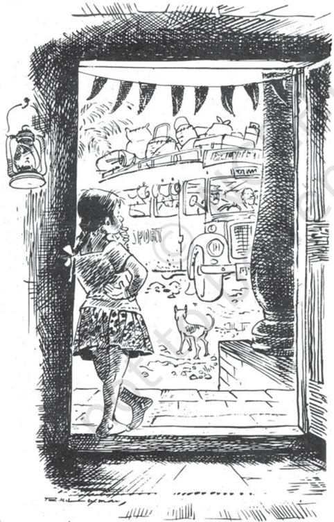
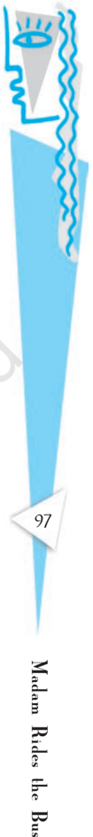
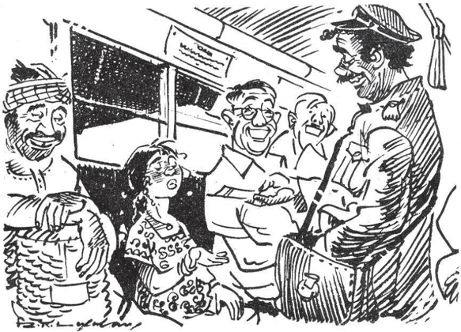
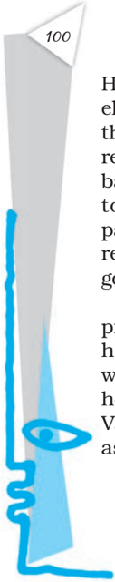
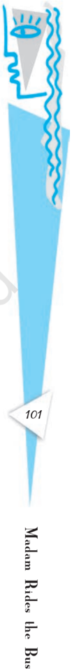
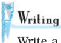

# PAGE 1

## B EFORE Y OU R EAD

In this sensitive story, an eight-year old girl's first bus journey into the world outside her village is also her induction into the mystery of life and death. She sees the gap between our knowing that there is death, and our understanding of it.

## Activity

1. Look at the words and phrases given below. Then put a tick against the ones you think you will find in the text.

- \_\_\_ a set of passengers

\_\_\_ get on the bus

- \_\_\_ get off the bus

\_\_\_ platform

- \_\_\_ Tickets, please

- \_\_\_ a roar and a rattle

- \_\_\_ a row of seats

- \_\_\_ slowing down to a crawl

- \_\_\_ blowing a whistle

2.

You must have travelled by bus more than once. What can you see from a fast-moving bus? Given below are some suggestions. Speak briefly about some of these scenes, or about other such scenes that you have seen; or write a sentence or two about them.

rivers a crowd

green fields

hills

roadside shops

market places

railway tracks

moving trains

vehicles on the road

trees

clothes in shops

animals

# PAGE 2

T HERE was a girl named Valliammai who was called Valli  for  short.  She  was  eight  years  old  and  very curious  about  things.  Her  favourite  pastime  was standing  in  the  front  doorway  of  her  house, watching what was happening in the street outside. There  were  no  playmates  of  her  own  age  on  her street, and this was about all she had to do.

But for Valli, standing at the front door was every bit as enjoyable as any of the elaborate games other children played. Watching the street gave her many new unusual experiences.

# PAGE 3

The most fascinating  thing  of  all  was  the  bus that  travelled  between  her  village  and  the  nearest town. It passed through her street each hour, once going to the town and once coming back. The sight of  the  bus,  filled  each  time  with  a  new  set  of passengers, was a source of unending joy for Valli.

Day  after  day  she  watched  the  bus,  and gradually  a  tiny  wish  crept  into  her  head  and grew there: she wanted to ride on that bus, even if  just  once.  This  wish  became  stronger  and stronger,  until  it  was  an  overwhelming  desire. Valli  would  stare  wistfully at  the  people  who  got on  or  off  the  bus  when  it  stopped  at  the  street corner.  Their  faces  would  kindle in  her  longings, dreams, and hopes. If one of her friends happened to ride the bus and tried to describe the sights of the town to her, Valli would be too jealous to listen and  would  shout,  in  English:  'Proud!  proud!' Neither she nor her friends really understood the meaning of the word, but they used it often as a slang  expression  of  disapproval.

Over  many  days  and  months  Valli  listened carefully  to  conversations  between  her  neighbours and people who regularly used the bus, and she also asked a few discreet questions here and there. This way she picked up various small details about the bus journey. The town was six miles from her village. The fare was thirty paise one way - 'which is almost nothing at all,' she heard one well-dressed man say, but  to  Valli,  who  scarcely  saw  that  much  money from one month to the next, it seemed a fortune. The trip to the town took forty-five minutes. On reaching town,  if  she  stayed  in  her  seat  and  paid  another thirty  paise,  she  could  return  home  on  the  same bus. This meant that she could take the one-o'clock afternoon bus, reach the town at one forty-five, and be back home by about two forty-five...

On and on went her thoughts as she calculated and recalculated,  planned  and  replanned.

wistfully longingly set alight (a fire), here, feelings

## kindle

a slang expression informal words, often used within a close group discreet  questions careful questions

# PAGE 4

## Oral Comprehension Check

1. What was Valli's favourite pastime?
2. What was a source of unending joy for Valli? What was her strongest desire?
3. What did Valli find out about the bus journey? How did she find out these  details?
4. What do you think Valli was planning to do?

## II

Well,  one  fine  spring  day  the  afternoon  bus  was just on the point of leaving the village and turning into the main highway when a small voice was heard shouting: 'Stop the bus! Stop the bus!' And a tiny hand was raised commandingly.

The  bus  slowed  down  to  a  crawl,  and  the conductor,  sticking  his  head  out  the  door,  said, 'Hurry then! Tell whoever it is to come quickly.'

'It's me,' shouted Valli. 'I'm the one who has to get on.'

By  now  the  bus  had  come  to  a  stop,  and  the conductor said, 'Oh, really! You don't say so!'

'Yes,  I  simply  have  to  go  to  town,'  said  Valli, still  standing  outside  the  bus,  'and  here's  my money.' She showed him some coins.

'Okay, okay, but first you must get on the bus,' said the conductor, and he stretched out a hand to help her up.

'Never mind,' she said, 'I can get on by myself. You don't have to help me.'

The conductor was a jolly sort, fond of joking. 'Oh, please don't be angry with me, my fine madam,' he said.  'Here,  have  a  seat  right  up  there  in  front. Everybody move aside please - make way for madam.'

It  was  the  slack  time of  day,  and  there  were only six or seven passengers on the bus. They were all looking at Valli and laughing with the conductor. Valli  was  overcome  with  shyness.  Avoiding everyone's  eyes,  she  walked  quickly  to  an  empty seat and sat down.

slack  time a time when there is not much work

# PAGE 5

'May  we  start  now,  madam?'  the  conductor asked, smiling. Then he blew his whistle twice, and the bus moved forward with a roar.

It was a new bus, its outside painted a gleaming white  with  some  green  stripes  along  the  sides. Inside, the overhead bars shone like silver. Directly in front of Valli, above the windshield, there was a beautiful clock. The seats were soft and luxurious.

Valli  devoured  everything  with  her  eyes.  But when she  started to look outside,  she  found  her view cut off by a canvas blind that covered the lower part  of  her  window.  So  she  stood  up  on  the  seat and peered over the blind.

The bus was now going along the bank of a canal. The road was very narrow. On one side there was the  canal  and,  beyond  it,  palm  trees,  grassland, distant mountains, and the blue, blue sky. On the other  side  was  a  deep  ditch  and  then  acres  and acres  of  green  fields  -  green,  green,  green,  as  far as the eye could see.

Oh, it was all so wonderful!

Suddenly she was startled by a voice. 'Listen, child,' said the voice, 'you shouldn't stand like that. Sit  down.'

# PAGE 6

Sitting down, she looked to see who had spoken. It  was  an  elderly  man  who  had  honestly  been concerned  for  her,  but  she  was  annoyed  by his  attention.

'There's  nobody  here  who's  a  child,'  she  said haughtily.  'I've  paid  my  thirty  paise  like  everyone else.'

The conductor chimed in. 'Oh, sir, but this is a very  grown-up  madam.  Do  you  think  a  mere  girl could  pay  her  own  fare  and  travel  to  the  city all  alone?'

Valli shot an angry glance at the conductor and said,  'I  am  not  a  madam.  Please  remember  that. And you've not yet given me my ticket.'

'I'll  remember,'  the  conductor  said,  mimicking her tone. Everyone laughed, and gradually Valli too joined  in  the  laughter.

The conductor punched a ticket and handed it to her. 'Just sit back and make yourself comfortable. Why should you stand when you've paid for a seat?'

'Because  I  want  to,'  she  answered,  standing up again.

'But if you stand on the seat, you may fall and hurt  yourself  when  the  bus  makes  a  sharp  turn or  hits  a  bump.  That's  why  we  want  you  to  sit down, child.'

'I'm  not  a  child,  I  tell  you,'  she  said  irritably. 'I'm eight years old.'

'Of  course,  of  course.  How  stupid  of  me!  Eight years - my!'

The bus stopped, some new passengers got on, and the  conductor  got  busy  for  a  time.  Afraid  of losing  her  seat,  Valli  finally  sat  down.

An elderly woman came and sat beside her. 'Are you  all  alone,  dear?'  she  asked  Valli  as  the  bus started  again.

Valli found the woman absolutely repulsive - such big  holes  she  had  in  her  ear  lobes,  and  such  ugly earrings in them! And she could smell the betel nut the woman was chewing and see the betel juice that was threatening to spill over her lips at any moment.

haughtily proudly mimicking copying

repulsive causing strong dislike

# PAGE 7

Ugh! - who could be sociable with such a person? 'Yes, I'm travelling alone,' she answered curtly. 'And I've got a ticket too.'

'Yes,  she's  on  her  way  to  town,'  said  the conductor. 'With a thirty-paise  ticket.'

'Oh,  why  don't  you  mind  your  own  business,' said  Valli.  But  she  laughed  all  the  same,  and  the conductor laughed too.

But the old woman went on with her drivel. 'Is it  proper  for  such  a  young  person  to  travel  alone? Do you know exactly where you're going in town? What's the street? What's the house number?'

'You needn't bother about me. I can take care of myself,'  Valli  said,  turning  her  face  towards  the window and staring out.

## Oral Comprehension Check

1. Why does the conductor call Valli 'madam'?
2. Why does Valli stand up on the seat? What does she see now?
3. What does Valli tell the elderly man when he calls her a child?
4. Why didn't Valli want to make friends with the elderly woman?

## III

Her  first  journey  -  what  careful,  painstaking, elaborate plans she had had to make for it! She had thriftily saved whatever stray coins came her way, resisting every temptation to buy peppermints, toys, balloons, and the like, and finally she had saved a total  of  sixty  paise.  How  difficult  it  had  been, particularly that day at the village fair, but she had resolutely  stifled a  strong  desire  to  ride  the  merrygo-round, even though she had the money.

After  she  had  enough  money  saved,  her  next problem was how to slip out of the house without her  mother's  knowledge.  But  she  managed  this without too much difficulty. Every day after lunch her mother would nap from about one to four or so. Valli  always  used  these  hours  for  her  'excursions' as she stood looking from the doorway of her house

curtly showing displeasure drivel silly nonsense

thriftily spend money carefully

## resolutely  stifled

suppressed/ controlled with determination

# PAGE 8

or  sometimes  even  ventured  out into  the  village; today, these same hours could be used for her first excursion outside the village.

The  bus  rolled  on  now  cutting  across  a  bare landscape,  now  rushing  through  a  tiny  hamlet  or past  an  odd  wayside  shop.  Sometimes  the  bus seemed on the point of gobbling up another vehicle that  was  coming  towards  them  or  a  pedestrian crossing  the  road.  But  lo!  somehow  it  passed  on smoothly, leaving all obstacles safely behind. Trees came running towards them but then stopped as the  bus  reached  them  and  simply  stood  there helpless for a moment by the side of the road before rushing away in the other direction.

Suddenly Valli  clapped  her  hands  with  glee.  A young cow, tail  high  in  the  air,  was  running  very fast,  right  in  the  middle  of  the  road,  right  in  front of the bus. The bus slowed to a crawl, and the driver sounded his horn loudly again and again. But the more he honked, the more frightened the animal became and the faster it galloped - always right in front of the bus.

ventured out went cautiously, courageously

# PAGE 9

Somehow this was very funny to Valli. She laughed and laughed until there were tears in her eyes.

'Hey, lady, haven't you laughed enough?' called, the conductor. 'Better save some for tomorrow.'

At last the cow moved off the road. And soon the bus came to a railroad crossing. A speck of a train could be seen in the distance, growing bigger and bigger  as  it  drew  near.  Then  it  rushed  past  the crossing  gate  with  a  tremendous  roar  and  rattle, shaking the bus. Then the bus went on and passed the  train  station.  From  there  it  traversed  a  busy, well-laid-out  shopping  street  and,  turning,  entered a  wider  thoroughfare.  Such  big,  bright-looking shops! What glittering displays of clothes and other merchandise! Such big crowds!

Struck dumb with wonder, Valli gaped at everything. Then  the  bus  stopped  and  everyone  got  off except  Valli.

'Hey, lady,' said the conductor, 'aren't you ready to  get  off?  This  is  as  far  as  your  thirty  paise takes you.'

'No,'  Valli  said,  'I'm  going  back  on  this  same bus.' She took another thirty paise from her pocket and handed the coins to the conductor.

'Why, is something the matter?'

'No, nothing's the matter. I just felt like having a bus ride, that's all.'

'Don't  you  want  to  have  a  look  at  the  sights, now that you're here?'

'All by myself? Oh, I'd be much too afraid.'

Greatly  amused  by  the  girl's  way  of  speaking, the conductor said, 'But you weren't afraid to come in the bus.'

'Nothing  to  be  afraid  of  about  that,'  she answered.

'Well,  then,  why  not  go  to  that  stall  over  there and have something to drink? Nothing to be afraid of  about  that  either."

'Oh, no, I couldn't do that.'

'Well, then, let me bring you a cold drink.'

thoroughfare a busy public road merchandise things for sale

# PAGE 10

'No,  I  don't  have  enough  money.  Just  give  me my ticket,  that's  all.'

'It'll be my treat and not cost you anything.'

'No, no,' she said firmly, 'please, no.'

The conductor shrugged, and they waited until it was time for the bus to begin the return journey. Again there weren't many passengers.

## Oral Comprehension Check

1. How did Valli save up money for her first journey? Was it easy for her?
2. What did Valli see on her way that made her laugh?
3. Why didn't she get off the bus at the bus station?
4. Why didn't Valli want to go to the stall and have a drink? What does this tell you about her?

## IV

'Won't  your  mother  be  looking  for  you?'  the conductor asked when he gave the girl her ticket.

'No, no one will be looking for me,' she said.

The bus started, and again there were the same wonderful sights.

Valli  wasn't  bored  in  the  slightest  and  greeted everything with the same excitement she'd felt the first time. But suddenly she saw a young cow lying dead by the roadside, just where it had been struck by  some fast-moving vehicle.

'Isn't that the same cow that ran in front of the bus on our trip to town?' she asked the conductor.

The conductor nodded, and she was overcome with  sadness.  What  had  been  a  lovable,  beautiful creature  just  a  little  while  ago  had  now  suddenly lost its charm and its life and looked so horrible, so frightening as it lay there, legs spreadeagled, a fixed stare  in  its  lifeless  eyes,  blood  all  over...

The bus moved on. The memory of the dead cow haunted her, dampening her enthusiasm. She no longer wanted to look out the window.

She sat thus,  glued  to  her  seat,  until  the  bus reached her village at three forty. She stood up and spreadeagled spread out

## haunted

returned repeatedly to her mind; was impossible to forget

103

Madam Rides the Bus

# PAGE 11

stretched herself. Then she turned to the conductor and said, 'Well, sir, 1 hope to see you again.'

'Okay,  madam,'  he  answered  her,  smiling. 'Whenever you feel like a bus ride, come and join us. And don't forget to bring your fare.'

She laughed and jumped down from the bus. Then away she went, running straight for home.

When she entered  her  house  she  found  her mother awake and talking to one of Valli's  aunts, the  one  from  South  Street.  This  aunt  was  a  real chatterbox,  never  closing  her  mouth  once  she started  talking.

'And where have you been?' said her aunt when Valli came in. She spoke very casually, not expecting a  reply.  So  Valli  just  smiled,  and  her  mother  and aunt went on with their conversation.

'Yes,  you're  right,'  her  mother  said.  'So  many things in our midst and in the world outside. How can we possibly know about everything? And even when we do know about something, we often can't understand it completely, can we?'

'Oh,  yes!'  breathed  Valli.

'What?' asked her mother. 'What's that you say?'

'Oh,'  said  Valli,  'I  was  just  agreeing  with  what you  said  about  things  happening  without  our knowledge.'

'Just a chit of a girl, she is,' said her aunt, 'and yet look how she pokes her nose into our conversation, just as though she were a grown lady.'

Valli  smiled  to  herself.  She  didn't  want  them  to understand her smile. But, then, there wasn't much chance of that, was there?

[Translated from the Tamil by K. S. Sundaram Illustrated by R. K. Laxman]

pokes her nose takes an interest in something that doesn't concern her

# PAGE 12

1. What was Valli's deepest desire?  Find the words and phrases in the story that tell you this.
2. How did Valli plan her bus ride? What did she find out about the bus, and how did she save up the fare?
3. What kind of a person is Valli? To answer this question, pick out the following sentences from the text and fill in the blanks. The words you fill in are the clues to your answer.
4. (i) 'Stop the bus! Stop the bus!' And a tiny hand was raised .
5. (ii) 'Yes,  I go  to  town,'  said  Valli,  still  standing  outside  the bus.
6. (iii) 'There's  nobody  here ,'  she  said  haughtily.  'I've  paid  my thirty  paise  like  everyone  else.'
7. (iv) 'Never mind,' she said, 'I can . You don't have to help me. 'I'm not a child, I tell you,' she said, .
8. (v) 'You needn't bother about me. I ,'  Valli  said,  turning  her face toward the window and staring out.
9. (vi) Then  she  turned  to  the  conductor  and  said,  'Well,  sir,  I  hope .'
4. Why does the conductor refer to Valli as 'madam'?
5. Find the lines in the text which tell you that Valli was enjoying her ride on the  bus.
6. Why does Valli refuse to look out of the window on her way back?
7. What does Valli mean when she says, 'I was just agreeing with what you said  about  things  happening  without  our  knowledge.'
8. The  author  describes  the  things  that  Valli  sees  from  an  eight-year-old's point of view. Can you find evidence from the text for this statement?

This story has a lot of people talking in it. The conductor jokes and laughs with Valli,  some  passengers  try  to  show  their  concern  for  her,  and  her  mother  and her  aunt  spend  time  chatting.

Read  the  conversations  carefully.  Then  think  of  similar  people,  or  similar situations that you have experienced. Mimic a person or persons who spoke to you, saying what they said, along with your replies.

105

# PAGE 13

106

Write a page - about three paragraphs - on one of the following topics.

1. Have you ever planned something entirely on your own, without taking grownups into your confidence? What did you plan, and how? Did you carry out your plan?
2. Have you made a journey that was unforgettable in some way? What made it memorable?
3. Are you concerned about traffic and road safety? What are your concerns? How would you make road travel safer and more enjoyable?

## W HAT W E H AVE D ONE

Related the story of Valli's first bus ride.

## W HAT Y OU C AN D O

2. You can also ask the students do the following.
1. The students should be given two or three days to collect old (used) tickets from their friends, relatives and acquaintances: they could be bus tickets, train tickets, plane tickets, cinema tickets, tickets to cultural events, etc.  By the time they finish the lesson they should be able to get a good collection in place. Get them to make a collage using as many as possible of the tickets collected, on a sheet of poster paper. This can then form the basis for many interesting activities: classification according to type of tickets (for what?) or price (how much?), etc; the most desirable tickets, the tickets no one wants, etc. - let students think of more ways to classify them. Get students to write a paragraph with the collage as base, and their imagination as guide.
3. (i) In the story Valli has to save money and  make plans to be able to ride the bus.  In pairs, discuss how you spent your pocket money last month.  Did you spend it on yourself, or on someone dear to you?
4. (ii) Valli's enthusiasm is dampened and the memory of the dead cow haunts her. In groups, discuss an incident which may have troubled or discouraged you.

# PAGE 14

## The Tale of Custard the Dragon

This poem is written in the style of a ballad - a song or poem that tells a story. You must be familiar with ballads that narrate tales of courage or heroism. This poem is a humorous ballad close to a parody.

Read it aloud, paying attention to the rhythm.

Belinda lived  in  a  little  white  house, With a little black kitten and a little grey mouse, And a little yellow dog and a little red wagon, And a realio, trulio, little  pet  dragon.

Now the name of the little black kitten was Ink, And the little grey mouse, she called him Blink, And the little yellow dog was sharp as Mustard, But the dragon was a coward, and she called him Custard.

Custard the dragon had big sharp teeth, And spikes on top of him and scales underneath, Mouth like a fireplace, chimney for a nose, And realio, trulio daggers on his toes.

Belinda was as brave as a barrel full of bears, And Ink and Blink chased lions down the stairs, Mustard was as brave as a tiger in a rage, But Custard cried for a nice safe cage.

# PAGE 15

Belinda tickled  him,  she  tickled  him  unmerciful, Ink,  Blink  and  Mustard,  they  rudely  called  him  Percival, They all sat laughing in the little red wagon At  the  realio,  trulio,  cowardly  dragon.

Belinda giggled till she shook the house, And Blink said Weeck! which is giggling for a mouse, Ink and Mustard rudely asked his age, When Custard cried for a nice safe cage.

Suddenly, suddenly they heard a nasty sound, And Mustard growled, and they all looked around. Meowch! cried Ink, and ooh! cried Belinda, For there was a pirate, climbing in the winda.

Pistol in his left hand, pistol in his right, And he held in his teeth a cutlass bright, His beard was black, one leg was wood; It  was clear that the pirate meant no good.

Belinda paled, and she cried Help! Help! But Mustard fled with a terrified yelp, Ink trickled down to the bottom of the household, And little  mouse  Blink  strategically  mouseholed.

But up jumped Custard, snorting like an engine, Clashed his tail like irons in a dungeon, With a clatter and a clank and a jangling squirm, He went at the pirate like a robin at a worm.

The pirate gaped at Belinda's dragon, And gulped some grog from his pocket flagon, He fired two bullets, but they didn't hit, And Custard gobbled him, every bit.

# PAGE 16

Belinda embraced him, Mustard licked him, No one mourned for his pirate victim. Ink and Blink in glee did gyrate Around the dragon that ate the pirate.

But presently up spoke little dog Mustard, I'd have been twice as brave if I hadn't been flustered. And up spoke Ink and up spoke Blink, We'd have been three times as brave, we think, And Custard said, I quite agree That everybody is braver than me.

Belinda still  lives  in  her  little  white  house, With her little black kitten and her little grey mouse, And her little yellow dog and her little red wagon, And her realio, trulio little  pet  dragon.

Belinda is as brave as a barrel full of bears, And Ink and Blink chase lions down the stairs, Mustard is as brave as a tiger in a rage, But Custard keeps crying for a nice safe cage.

O GDEN N ASH

Ogden Nash wrote over four hundred pieces of comic verse. The best of his work was published in 14 volumes between 1931 and 1972. His work is perhaps best described in this poetic tribute by Anthony Burgess:

And didn't care much about breaking the poetic laws of the Medes and the Persians.

...he brought a new kind of sound to our literary diversions.

He uses lines, sometimes of considerable length that are colloquial and prosy.

This  bringing  together  of  the  informal  and  the  formal  is  what  his genius chiefly loves.

And at the end presents you with a rhyme...

I am trying to imitate him here, but he is probably quite inimitable.

109

# PAGE 17

110

grog

:  a  drink  typically drunk by sailors

gyrate

:  to  move  around in circles

1. Who are the characters in this poem? List them with their pet names.
2. Why did Custard cry for a nice safe cage?  Why is the dragon called 'cowardly dragon'?
3. 'Belinda tickled him, she tickled him unmerciful...' Why?
4. The  poet  has  employed  many  poetic  devices  in  the  poem.  For  example: 'Clashed  his  tail  like  iron  in  a  dungeon'  -  the  poetic  device  here  is  a simile.  Can  you,  with  your  partner,  list  some  more  such  poetic  devices used in the poem?
5. Read stanza three again to know how the poet describes the appearance of the  dragon.
6. Can you find out the rhyme scheme of two or three stanzas of the poem?
7. Writers use words to give us a picture or image without actually saying what they mean. Can you trace some images used in the poem?
8. Do you find The Tale of Custard the Dragon to be a serious or a light-hearted poem? Give reasons to support your answer.
9. This  poem,  in  ballad  form,  tells  a  story.    Have  you  come  across  any  such modern song or lyric that tells a story? If you know one, tell it to the class. Collect such songs as a project.

Have fun writing your ballad. Gather information (choose/decide an idea/theme), organise your materials under characters and story and then write. Revise and edit your ballad to make it entertaining. Use the following guidelines to write your ballad.

- Purpose of writing the ballad: to entertain and interest
- To whom I am writing: decide for whom you are writing
- How should I structure features?:
- -Tell  a  simple  narrative
- -A few major characters
- -A strong rhythm and rhyme
- -May have a refrain (single or two line(s) repeated often)
- -Divide  into  verses