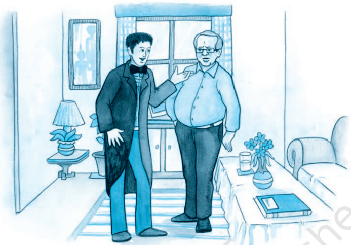

# PAGE 1

## B EFORE Y OU R EAD

## Activity

1. The word 'proposal' has several meanings. Can you guess what sort of proposal the play is about?
2. (i) a suggestion, plan or scheme for doing something
3. (ii) an offer for a possible plan or action
4. (iii) the act of asking someone's hand in marriage

## A Russian Wedding

Do you know anything about a Russian marriage ceremony? Read this article about a Russian wedding.

Preparations for a  Russian Wedding: A Russian wedding is very simple. The planning only includes arranging for rings, brides' dress, cars, and a reception. Earlier, the bride's family paid for the reception, but now-a-days brides' and grooms' families usually share expenses. A Russian wedding lasts for two days; some weddings last as long as a week, and the occasion becomes something to remember for years. The necessary part of the wedding ceremony is a wedding procession of several cars. The best friends of the groom/ bride meet before the wedding a few times, make posters, write  speeches  and  organise  contests.  When  the  groom arrives to fetch the bride for the registration, he has to fight to  get  her!  Russians  usually  live  in  apartments  in  tall buildings, and the groom has to climb several stairs to reach his bride. But at each landing he must answer a question to  be  allowed  to  go  up.  The  bride's  friends  ask  difficult questions  (sometimes  about  the  bride,  sometimes  just difficult riddles), and the groom must answer with the help of his friends. For example, he may be shown a few photos of baby girls and he must say which one his bride is. If he guesses wrong, he must pay cash to move ahead. After the

# PAGE 2

marriage registration, the newly-married couple leaves the guests for a tour of the city sights. After two or three hours of the city tour the couple arrives at the reception. The couple sits at a specially arranged table with their family, friends and invited guests. The reception starts with toasts to the couple. A wedding toast is a custom where a close friend or relative of the groom or the bride says a few words to wish the couple, then everyone raises their glass of wine, and drink it up at the same moment. The groom is then asked to kiss the bride. After a few toasts, people start eating and drinking, and generally have fun. After some time, the bride gets 'stolen'! She disappears, and when the groom starts looking for her, he is asked to pay a fee. Usually it is his friends  who  'steal'  the  bride.  Then  there  are  the  bride's friends - they steal the bride's shoe. The groom must pay money for the shoe too. The guests enjoy watching these tussles, and continue partying.

2. Do you think Indian and Russian weddings have any customs in common? With the help of a partner, fill in the table below.

## Wedding Ceremonies in Russia and India

| Customssimilar to Indian ones   | Customsdifferentfrom Indian ones   |
|---------------------------------|------------------------------------|

''The Proposal'' (originally titled ''A Marriage Proposal'') is a oneact play, a farce, by the Russian short story writer and dramatist Anton Chekhov.  It was written in 1888-89.

The play is about the tendency of wealthy families to seek ties with other wealthy families, to increase their estates by encouraging marriages that make good economic sense. Ivan Lomov, a long time wealthy neighbour of Stepan Chubukov, also wealthy, comes to seek the hand of Chubukov's twenty-five-year-old daughter, Natalya. All three are quarrelsome people, and they quarrel over petty issues. The proposal is in danger of being forgotten amidst all this quarrelling. But economic good sense ensures that the proposal is made, after all - although the quarrelling perhaps continues!

# PAGE 3

122

## Characters

S TEPAN S TEPANOVITCH C HUBUKOV :

a landowner

N ATALYA S TEPANOVNA :

his daughter, twenty-five years old

I VAN V ASSILEVITCH L OMOV :

a neighbour of Chubukov, a large and hearty, but very suspicious, landowner

A drawing-room in Chubukov's house.

Lomov enters, wearing a dress-jacket and white gloves. Chubukov rises to meet him.

C HUBUKOV :

My dear fellow,  whom do I see!  Ivan  Vassilevitch!  I  am extremely  glad!  [ Squeezes  his  hand ]  Now  this  is  a surprise, my darling... How are you?

L OMOV :

Thank you. And how may you be getting on?

C HUBUKOV :

We just  get  along  somehow,  my  angel,  thanks  to  your prayers, and so on. Sit down, please do... Now, you know, you shouldn't forget all about your neighbours, my darling. My dear fellow,  why  are  you  so  formal  in  your  get-up! Evening  dress,  gloves,  and  so  on.  Can  you  be  going anywhere, my treasure?

L OMOV :

No.  I've  come  only  to  see  you,  honoured  Stepan Stepanovitch.

C HUBUKOV :

Then why are you in evening dress, my precious? As if you're paying a New Year's Eve visit!

L OMOV :

Well, you see, it's like this. [ Takes his arm ] I've come to you, honoured Stepan Stepanovitch, to trouble you with a request. Not once or twice have I already had the privilege of applying to you for help, and you have always, so to speak... I must ask your pardon, I am getting excited. I shall drink some water, honoured Stepan Stepanovitch.

[ Drinks .]

C HUBUKOV :

[ aside ] He's come to borrow money. Shan't give him any! [ aloud ]  What is it, my beauty?

L OMOV :

You  see,  Honoured  Stepanitch...  I  beg  pardon  Stepan Honouritch...  I  mean,  I'm  awfully  excited,  as  you  will please notice... In short, you alone can help me, though I don't  deserve  it,  of  course...  and  haven't  any  right  to count on your assistance...

C HUBUKOV :

Oh, don't go round and round it, darling! Spit it out! Well?

L OMOV :

One moment... this very minute. The fact is I've come to ask  the  hand  of  your  daughter,  Natalya  Stepanovna, in  marriage.

# PAGE 4

C HUBUKOV :

[ joyfully ]  By  Jove!  Ivan  Vassilevitch!  Say  it  again  -  I didn't  hear  it  all!

L OMOV :

I have the honour to ask...

C HUBUKOV :

[ interrupting ]  My  dear  fellow...  I'm  so  glad,  and  so  on... Yes, indeed, and all that sort of thing. [ Embraces and kisses Lomov ] I've been hoping for it for a long time. It's been my continual desire. [ Sheds a tear ] And I've always loved you, my angel, as if you were my own son. May God give you both - His help and His love and so on, and so much hope... What am I behaving in this idiotic way for? I'm off my balance with joy, absolutely off my balance! Oh, with all my soul... I'll go and call Natasha, and all that.

L OMOV :

[ greatly  moved ]  Honoured  Stepan  Stepanovitch,  do  you think I may count on her consent?

C HUBUKOV :

Why, of course, my darling, and... as if she won't consent! She's in love; egad, she's like a lovesick cat, and so on. Shan't be long! [ Exit. ]

L OMOV :

It's  cold...  I'm  trembling  all  over,  just  as  if  I'd  got  an examination before me. The great thing is, I must have my mind made up. If  I  give  myself  time  to  think,  to hesitate,  to  talk  a  lot,  to  look  for  an  ideal,  or  for  real love, then I'll never get married. Brr... It's cold! Natalya

# PAGE 5

Stepanovna is an excellent housekeeper, not bad-looking, well-educated. What more do I want? But I'm getting a noise  in  my  ears  from  excitement.  [ Drinks ]  And  it's impossible  for  me  not  to  marry.  In  the  first  place,  I'm already 35 - a critical age, so to speak. In the second place,  I  ought  to  lead  a  quiet  and  regular  life.  I  suffer from  palpitations,  I'm  excitable  and  always  getting awfully upset; at this very moment my lips are trembling, and there's a twitch in my right eyebrow. But the very worst of all is the way I sleep.  I no sooner get into bed and begin to go off, when suddenly something in my left side  gives  a  pull,  and  I  can  feel  it  in  my  shoulder  and head... I jump up like a lunatic, walk about a bit and lie down again, but as soon as I begin to get  off  to  sleep there's another pull! And this may happen twenty times... [ Natalya Stepanovna comes in .]

124

N ATLYA :

Well,  there!  It's  you,  and  papa  said,  'Go;  there's  a merchant  come  for  his  goods.'  How  do  you  do,  Ivan Vassilevitch?

L OMOV :

How do you do, honoured Natalya Stepanovna?

N ATALYA :

You must excuse my apron and neglige .  We're  shelling peas for  drying.  Why  haven't  you  been  here  for  such  a long time? Sit down... [ They seat themselves. ]  Won't you have some lunch?

L OMOV :

No, thank you, I've had some already.

N ATALYA :

Then  smoke.  Here  are  the  matches.  The  weather  is splendid now, but yesterday it was so wet that the workmen didn't  do  anything  all  day.  How  much  hay  have  you stacked? Just think, I felt  greedy  and  had  a  whole  field cut,  and  now I'm not at all pleased about it because I'm afraid my hay may rot. I ought to have waited a bit. But what's this? Why, you're in evening dress! Well, I never! Are you going to a ball or what? Though I must say you look better... Tell me, why are you got up like that?

L OMOV

:

[ excited ]  You  see,  honoured  Natalya  Stepanovna...  the fact is, I've made up my mind to ask you to hear me out... Of  course  you'll  be  surprised  and  perhaps  even  angry, but a...  [ aside ]  It's  awfully  cold!

N ATALYA :

What's the matter? [ pause ]  Well?

L OMOV :

I  shall  try  to  be  brief.  You  must  know, honoured Natalya Stepanovna, that I have long, since my childhood, in fact,

# PAGE 6

had the privilege  of  knowing  your  family.  My  late  aunt and her husband, from whom, as you know, I inherited my land, always had the greatest respect for your father and your late mother. The Lomovs and the Chubukovs have always had the most friendly, and I might almost say the most affectionate, regard for each other. And, as you know, my land is a near neighbour of yours. You will remember that my Oxen Meadows touch your birchwoods.

N ATALYA :

Excuse my interrupting you. You say, 'my Oxen Meadows'. But are they yours?

L OMOV :

Yes,  mine.

N ATALYA :

What are you talking about? Oxen Meadows are ours, not yours!

L OMOV :

No,  mine,  honoured  Natalya  Stepanovna.

N ATALYA :

Well,  I  never  knew  that  before.  How  do  you  make  that out?

L OMOV :

How? I'm speaking of those  Oxen  Meadows  which  are wedged  in  between  your  birchwoods  and  the  Burnt Marsh.

N ATALYA :

Yes,  yes...  they're  ours.

L OMOV :

No,  you're  mistaken,  honoured  Natalya  Stepanovna, they're  mine.

N ATALYA :

Just  think,  Ivan  Vassilevitch!  How  long  have  they  been yours?

L OMOV :

How long? As long as I can remember.

N ATALYA :

Really, you won't get me to believe that!

L OMOV :

But you can see from the documents, honoured Natalya Stepanovna.  Oxen  Meadows,  it's  true,  were  once  the subject  of  dispute,  but  now  everybody  knows  that  they are  mine.  There's  nothing  to  argue  about.  You  see  my aunt's grandmother gave the free use of these Meadows in perpetuity to the peasants of your father's grandfather, in return for which they were to make bricks for her. The peasants belonging to your father's grandfather had the free use of the Meadows for forty years, and had got into the  habit  of  regarding  them  as  their  own,  when  it happened that...

N ATALYA

: No,  it  isn't  at  all  like  that!  Both  grandfather  and  greatgrandfather reckoned that their land extended to Burnt Marsh - which means that Oxen Meadows were ours. I don't see what there is to argue about. It's simply silly!

125

# PAGE 7

First Flight

126

L OMOV :

I'll  show  you  the  documents,  Natalya  Stepanovna!

N ATALYA :

No,  you're  simply  joking,  or  making  fun  of  me.  What  a surprise!  We've  had  the  land  for  nearly  three  hundred years,  and  then  we're  suddenly  told  that  it  isn't  ours! Ivan Vassilevitch, I can hardly believe my own ears. These Meadows aren't worth much to me. They only come to five dessiatins, and are worth perhaps 300 roubles, but I can't  stand  unfairness.  Say  what  you  will,  I  can't  stand unfairness.

L OMOV : Hear me out, I implore you! The peasants of your father's grandfather,  as  I  have  already  had  the  honour  of explaining  to  you,  used  to  bake  bricks  for  my  aunt's grandmother.  Now  my  aunt's  grandmother,  wishing  to make them a pleasant...

N ATALYA :

I  can't  make  head  or  tail  of  all  this  about  aunts  and grandfathers and grandmothers. The Meadows are ours, that's  all.

L OMOV :

Mine.

N ATALYA :

Ours! You can go on proving it for two days on end, you can  go  and  put  on  fifteen  dress  jackets,  but  I  tell  you they're  ours,  ours,  ours!  I  don't  want  anything  of  yours and I don't want to give anything of mine. So there!

L OMOV :

Natalya Stepanovna, I don't want the Meadows, but I am acting  on  principle.  If  you  like,  I'll  make  you  a  present of  them.

N ATALYA :

I can make you a present of them myself, because they're mine!  Your  behaviour,  Ivan  Vassilevitch,  is  strange,  to say the least! Up to this we have always thought of you as a good neighbour, a friend; last year we lent you our threshing-machine, although on that account we had to put off our own threshing till November, but you behave to  us  as  if  we  were  gypsies.  Giving  me  my  own  land, indeed!  No,  really,  that's  not  at  all  neighbourly!  In  my opinion, it's even impudent, if you want to know.

L OMOV

:

Then you make out that I'm a landgrabber? Madam, never in my life have I grabbed anybody else's land and I shan't allow anybody to accuse me of having done so. [ Quickly steps to the carafe and drinks more water ] Oxen Meadows are  mine!

N ATALYA :

It's  not  true, they're ours!

N ATALYA :

It's  not  true, they're ours!

L OMOV :

Mine!

# PAGE 8

N ATALYA :

It's  not  true!  I'll  prove  it!  I'll  send  my  mowers out to the

Meadows this very day!

L OMOV :

What?

N ATALYA :

My mowers will be there this very day!

L OMOV :

I'll  give it to them in the neck!

N ATALYA :

You dare!

L OMOV :

[ Clutches  at  his  heart ] Oxen Meadows are mine! You understand? Mine!

N ATALYA :

Please don't shout! You can shout yourself hoarse in your own house but here I must ask you to restrain yourself!

L OMOV :

If  it  wasn't,  madam,  for  this  awful,  excruciating palpitation,  if  my  whole  inside  wasn't  upset,  I'd  talk  to you in a different way! [ Yells ]  Oxen Meadows are mine!

N ATALYA :

Ours!

L OMOV :

Mine!

N ATALYA :

Ours!

L OMOV :

Mine!

[ Enter Chubukov ]

C HUBUKOV :

What's the matter? What are you shouting for?

N ATALYA :

Papa,  please  tell  this  gentleman  who  owns  Oxen Meadows, we or he?

C HUBUKOV :

[ to Lomov ]  Darling, the Meadows are ours!

127

# PAGE 9

128

L OMOV : But, please, Stepan Stepanovitch, how can they be yours? Do be a reasonable man! My aunt's grandmother gave the  Meadows  for  the  temporary  and  free  use  of  your grandfather's  peasants.  The  peasants  used  the  land  for forty  years  and  got  accustomed  to  it  as  if  it  was  their own, when it happened that...

C HUBUKOV : you haven't seen the plan.

Excuse me, my precious. You forget just this, that  the peasants  didn't  pay  your  grandmother  and  all  that, because the Meadows were in dispute, and so on. And now everybody knows that they're ours. It  means that

L OMOV :

I'll  prove to you that they're mine!

C HUBUKOV :

You won't prove it, my darling -

L OMOV :

I  shall

C HUBUKOV :

Dear one, why yell like  that?  You  won't  prove  anything just by yelling. I don't want anything of yours, and don't intend  to  give  up  what  I  have.  Why  should  I?  And  you know, my beloved, that if you propose to go on arguing about it,  I'd  much  sooner  give  up  the  Meadows  to  the peasants than to you. There!

L OMOV :

I don't understand! How have you the right to give away somebody else's property?

C HUBUKOV :

You may take it that I know whether I have the right or not. Because, young man, I'm not used to being spoken to  in  that  tone  of  voice,  and  so  on.  I,  young  man,  am twice  your  age,  and  ask  you  to  speak  to  me  without agitating  yourself,  and  all  that.

L OMOV :

No, you just think I'm a fool and want to have me on! You call my land yours, and then you want me to talk to you calmly  and  politely!  Good  neighbours  don't  behave  like that, Stepan Stepanovitch! You're not a neighbour, you're a  grabber!

C HUBUKOV :

What's that? What did you say?

N ATALYA :

Papa, send the mowers out to the Meadows at once!

C HUBUKOV :

What did you say, sir?

N ATALYA :

Oxen Meadows are ours, and I shan't give them up, shan't give them up, shan't give them up!

L OMOV :

We'll see! I'll have the matter taken to court, and then I'll show you!

C HUBUKOV :

To court? You can take it to court, and all that! You can! I know you; you're just on the look-out for a chance to go

to  court,  and  all  that.  You  pettifogger!  All  your  people were like that! All of them!

L OMOV :

Never mind about my people! The Lomovs have all been honourable people, and not one has ever been tried for embezzlement, like your grandfather!

C HUBUKOV :

You Lomovs have had lunacy in your family, all of you!

N ATALYA :

All,  all,  all!

C HUBUKOV :

Your grandfather was a drunkard, and your younger aunt, Nastasya Mihailovna,  ran  away  with  an  architect,  and so on...

L OMOV :

And your mother was hump-backed. [ Clutches at his heart ] Something pulling in my side... My head.... Help! Water!

C HUBUKOV :

Your father was a guzzling gambler!

N ATALYA :

And there haven't been many backbiters to equal your aunt!

C HUBUKOV :

My left foot has gone to sleep... You're an intriguer....Oh, my heart!  And  it's  an  open  secret  that  before  the  last elections you bri... I can see stars... Where's my hat?

N ATALYA :

It's  low!  It's  dishonest!  It's  mean!

C HUBUKOV :

And you're just a malicious, doublefaced intriguer! Yes!

L OMOV :

Here's my hat. My heart! Which way? Where's the door? Oh I think I'm dying! My foot's quite numb...

[ Goes to the door .]

C HUBUKOV :

[ following him ] And don't set foot in my house again!

N ATALYA :

Take it to court! We'll see!

[ Lomov staggers out. ]

C HUBUKOV :

Devil  take  him!

[ Walks about in excitement .]

N ATALYA :

What  a  rascal!  What  trust  can  one  have  in  one's neighbours after  that!

C HUBUKOV :

The villain!  The  scarecrow!

N ATALYA :

The monster! First he takes our land and then he has

the impudence to abuse us.

C HUBUKOV :

And  that  blind  hen,  yes,  that  turnip-ghost  has  the confounded cheek to make a proposal, and so on! What? A proposal!

N ATALYA :

What proposal?

C HUBUKOV :

Why, he came here to propose to you.

N ATALYA :

To propose? To me? Why didn't you tell me so before?

C HUBUKOV :

So he dresses up in evening clothes. The stuffed sausage!

The wizen-faced frump!

# PAGE 10

129

# PAGE 11

130

N ATALYA :

To propose to me? Ah! [ Falls into an easy-chair and wails ] Bring him back! Back! Ah! Bring him here.

C HUBUKOV :

Bring whom here?

N ATALYA :

Quick, quick! I'm ill!  Fetch  him! [ Hysterics .]

C HUBUKOV :

What's that? What's the matter with you? [ Clutches at his head ]  Oh, unhappy man that I am! I'll shoot myself! I'll  hang myself! We've done for her!

N ATALYA :

I'm dying! Fetch him!

C HUBUKOV :

Tfoo! At once. Don't yell! [ Runs out. A pause .]

N ATALYA :

[ Natalya Stepanovna wails .] What have they done to me? Fetch him back! Fetch him! [ A pause. Chubukov runs in .]

C HUBUKOV :

He's coming, and so on, devil take him! Ouf! Talk to him yourself; I don't want to...

N ATALYA :

[ wails ]  Fetch  him!

C HUBUKOV :

[ yells ]  He's coming, I tell you. Oh, what a burden, Lord, to be the father of a grown-up daughter! I'll cut my throat I will,  indeed!  We  cursed  him,  abused  him,  drove  him  out; and it's all you... you!

N ATALYA :

No, it was you!

C HUBUKOV :

I  tell  you  it's  not  my  fault.  [ Lomov appears at the door ] Now you talk to him yourself. [ Exit .]

L OMOV :

[ Lomov enters, exhausted. ] My heart's palpitating awfully. My foot's  gone  to  sleep.  There's  something  that  keeps pulling  in  my  side....

N ATALYA :

Forgive us, Ivan Vassilevitch, we were all a little heated.

I  remember now: Oxen Meadows... really are yours.

L OMOV :

My heart's beating awfully. My Meadows... My eyebrows are  both  twitching....

N ATALYA :

The Meadows are yours, yes, yours. Do sit down. [ They sit ]  We were wrong.

L OMOV :

I did it on principle. My land is worth little to me, but the principle...

N ATALYA :

Yes, the principle, just so. Now let's talk of something else.

L OMOV :

The more so as I have evidence. My aunt's grandmother gave the land to your father's grandfather's peasants...

N ATALYA :

Yes,  yes,  let  that  pass.  [ aside ]  I  wish  I  knew  how  to  get him started. [ aloud ] Are you going to start shooting soon?

L OMOV :

I'm  thinking  of  having  a  go  at  the  blackcock,  honoured Natalya  Stepanovna,  after  the  harvest.  Oh,  have  you heard? Just think, what a misfortune I've had! My dog Guess, who you know, has gone lame.

N ATALYA :

What a pity! Why?

L OMOV :

I  don't  know. Must have got his leg twisted or bitten by some other dog. [sighs] My very best dog, to say nothing of the expense. I gave Mironov 125 roubles for him.

N ATALYA :

It  was  too  much,  Ivan  Vassilevitch.

L OMOV :

I  think it was very cheap. He's a first-rate dog.

N ATALYA :

Papa gave 85 roubles for his Squeezer, and Squeezer is heaps better than Guess!

L OMOV :

Squeezer  better  than  Guess?  What  an  idea!  [ laughs ] Squeezer better than Guess!

N ATALYA :

Of  course  he's  better!  Of  course,  Squeezer  is  young,  he may develop a bit, but on points and pedigree he's better than anything that even Volchanetsky has got.

L OMOV

: Excuse me, Natalya Stepanovna, but you forget that he is  overshot,  and an overshot always means the dog is a bad hunter!

N ATALYA :

Overshot, is he? The first time I hear it!

L OMOV :

I assure you that his lower jaw is shorter than the upper.

N ATALYA :

Have you measured?

L OMOV :

Yes. He's all right at following, of course, but if you want to get hold of anything...

N ATALYA :

In the first place, our Squeezer is a thoroughbred animal, the  son  of  Harness  and  Chisels  while  there's  no  getting at the pedigree of your dog at all. He's old and as ugly as a  worn-out  cab-horse.

L OMOV : He is  old,  but  I  wouldn't  take  five  Squeezers  for  him. Why, how can you? Guess is a dog; as for Squeezer, well, it's  too  funny  to  argue.  Anybody  you  like  has  a  dog  as good as Squeezer... you may find them under every bush almost.  Twenty-five  roubles  would  be  a  handsome  price to pay for him.

N ATALYA : There's some demon of contradition in you today, Ivan Vassilevitch.  First  you  pretend  that  the  Meadows  are yours; now, that Guess is better than Squeezer. I don't like  people  who  don't  say  what  they  mean,  because you  know  perfectly  well  that  Squeezer  is  a  hundred times  better  than  your  silly  Guess.  Why  do  you  want to say he isn't?

# PAGE 12

131

# PAGE 13

132

L OMOV :

I  see,  Natalya  Stepanovna,  that  you  consider  me  either blind or a fool. You must realise that Squeezer is overshot!

N ATALYA :

It's  not true.

L OMOV :

He is!

N ATALYA :

It's  not  true!

L OMOV :

Why shout madam?

N ATALYA :

Why talk rot? It's  awful!  It's  time  your  Guess  was  shot, and you compare him with Squeezer!

L OMOV :

Excuse me, I cannot continue this discussion, my heart is  palpitating.

N ATALYA :

I've noticed that those hunters argue most who know least.

L OMOV :

Madam, please be silent.  My  heart  is  going  to  pieces. [ shouts ] Shut up!

N ATALYA :

I  shan't shut up until you acknowledge that Squeezer is a hundred times better than your Guess!

L OMOV :

A hundred times worse! Be hanged to your Squeezer! His head...  eyes...  shoulder...

N ATALYA :

There's no need to hang your silly Guess; he's half-dead already!

L OMOV :

[ weeps ]  Shut  up!  My  heart's  bursting!

N ATALYA :

I shan't shut up.

[ Enter Chubukov .]

C HUBUKOV :

What's the matter now?

N ATALYA :

Papa, tell us truly, which is the better dog, our Squeezer or his Guess.

L OMOV :

Stepan Stepanovitch, I  implore  you  to  tell  me  just  one thing: is your Squeezer overshot or not? Yes or no?

C HUBUKOV :

And suppose he is? What does it matter? He's the best dog in the district for all that, and so on.

L OMOV :

But isn't my Guess better? Really, now?

C HUBUKOV :

Don't  excite  yourself,  my  precious  one.  Allow  me.  Your Guess certainly has his good points. He's purebred, firm on his feet,  has  well-sprung  ribs,  and  all  that.  But,  my dear man, if you want to know the truth, that dog has two defects: he's old and he's short in the muzzle.

L OMOV :

Excuse  me,  my  heart...  Let's  take  the  facts.  You  will remember that on the Marusinsky hunt my Guess ran neck-and-neck with the Count's dog, while your Squeezer was left a whole verst behind.

C HUBUKOV :

He got  left  behind  because  the  Count's  whipper-in  hit him with his whip.

L OMOV :

And with good reason. The dogs are running after a fox, when Squeezer goes and starts worrying a sheep!

C HUBUKOV :

It's  not  true!  My  dear  fellow,  I'm  very  liable  to  lose  my temper, and so, just because of that, let's stop arguing. You  started  because  everybody  is  always  jealous  of everybody else's dogs. Yes, we're all like that! You too, sir, aren't blameless! You no sooner begin with this, that and the other, and all that...  I  remember everything!

L OMOV :

I  remember too!

C HUBUKOV :

[ teasing him ] I remember, too! What do you remember?

L OMOV :

My heart... my foot's gone to sleep. I can't...

N ATALYA :

[ teasing ]  My  heart!  What  sort  of  a  hunter  are  you?  You ought to go and lie on the kitchen oven and catch black beetles, not go after foxes! My heart!

C HUBUKOV

:

Yes really,  what  sort  of  a  hunter  are  you,  anyway?  You ought to sit at home with your palpitations, and not go tracking animals. You could go hunting, but you only go to argue with people and interfere with their dogs and so on.  Let's  change  the  subject  in  case  I  lose  my  temper. You're not a hunter at all, anyway!

L OMOV :

And are you a hunter? You only go hunting to get in with the  Count  and  to  intrigue.  Oh,  my  heart!  You're  an intriguer!

C HUBUKOV :

What? I am an intriguer? [ shouts ] Shut up!

L OMOV :

Intriguer!

C HUBUKOV :

Boy! Pup!

L OMOV :

Old rat!  Jesuit!

C HUBUKOV :

Shut up or I'll shoot you like a partridge! You fool!

L OMOV :

Everybody knows that - oh, my heart! - your late wife used to beat you...  My  feet...  temples...  sparks...  I  fall, I  fall!

C HUBUKOV :

And you're under the slipper of your house-keeper!

L OMOV :

There, there, there... my heart's burst! My shoulders come off! Where is my shoulder? I die. [ Falls into an armchair ] A doctor!

C HUBUKOV :

Boy! Milksop! Fool! I'm sick! [ Drinks water ]  Sick!

N ATALYA :

What sort of a hunter are you? You can't even sit on a horse! [ To her father ]  Papa, what's the matter with him? Papa! Look, Papa! [ screams ] Ivan Vassilevitch! He's dead!

C HUBUKOV

:

I'm sick! I can't breathe! Air!

# PAGE 14

133

# PAGE 15

134

N ATALYA :

He's  dead.  [ Pulls  Lomov's sleeve ]  Ivan  Vassilevitch!  Ivan Vassilevitch! What have you done to me? He's dead. [ Falls into an armchair ] A doctor, a doctor! [ Hysterics .]

C HUBUKOV :

Oh! What is it? What's the matter?

N ATALYA :

[ wails ]  He's  dead...  dead!

C HUBUKOV :

Who's dead? [ Looks at Lomov ]  So he is! My word! Water! A doctor! [ Lifts  a  tumbler to Lomov's mouth ]  Drink this! No,  he  doesn't  drink.  It  means  he's  dead,  and  all  that. I'm  the  most  unhappy  of  men!  Why  don't  I  put  a  bullet into  my  brain?  Why  haven't  I  cut  my  throat  yet?  What am I waiting for? Give me a knife! Give me a pistol! [ Lomov moves ] He seems to be coming round. Drink some water! That's  right.

L OMOV :

I  see  stars...  mist...  where  am I?

C HUBUKOV :

Hurry up and get married and - well, to the devil with you!  She's  willing!  [ He  puts  Lomov's hand  into  his daughter's ]  She's  willing  and  all  that.  I  give  you  my blessing and so on. Only leave me in peace!

L OMOV :

[ getting up ] Eh? What? To whom?

C HUBUKOV :

She's willing! Well? Kiss and be damned to you!

N ATALYA :

[ wails ]  He's  alive...  Yes,  yes,  I'm  willing.

C HUBUKOV :

Kiss  each  other!

L OMOV :

Eh? Kiss whom? [ They kiss ]  Very  nice,  too.  Excuse  me, what's it all about? Oh, now I understand ... my heart... stars... I'm happy. Natalya Stepanovna... [ Kisses her hand ] My foot's gone to sleep.

N ATALYA :

I... I'm happy too...

C HUBUKOV :

What a weight off my shoulders, ouf!

N ATALYA :

But,  still  you  will  admit  now  that  Guess  is  worse  than Squeezer.

L OMOV :

Better!

N ATALYA :

Worse!

C HUBUKOV :

Well,  that's  a  way  to  start  your  family  bliss!  Have  some champagne!

L OMOV :

He's  better!

N ATALYA :

Worse! Worse! Worse!

C HUBUKOV :

[ trying to shout her down ] Champagne! Champagne!

C URTAIN

# PAGE 16

1. What does Chubukov at first suspect that Lomov has come for? Is he sincere when he later says 'And I've always loved you, my angel, as if you were my own son'? Find reasons for your answer from the play.
2. Chubukov says of  Natalya:  '...  as  if  she  won't  consent!  She's  in  love; egad,  she's  like  a  lovesick  cat…'  Would  you  agree?  Find  reasons  for your  answer.
3. (i) Find all  the  words  and  expressions  in  the  play  that  the  characters use  to  speak  about  each  other,  and  the  accusations  and  insults they  hurl  at  each  other.  (For  example,  Lomov  in  the  end  calls Chubukov an intriguer;  but  earlier,  Chubukov  has  himself  called Lomov a 'malicious, doublefaced intriguer.' Again, Lomov begins by describing  Natalya  as  'an  excellent  housekeeper,  not  bad-looking, well-educated.')
4. (ii) Then think of five  adjectives  or  adjectival  expressions  of  your  own  to describe  each  character  in  the  play.
5. (iii) Can you now imagine what these characters will quarrel about next?
- I. 1. This  play  has  been  translated  into  English  from  the  Russian  original. Are there any expressions or ways of speaking that strike you as more Russian than English? For example, would an adult man be addressed by an older man as my darling or my treasure in an English play?

Read through the play carefully, and find expressions that you think are  not  used  in  contemporary  English,  and  contrast  these  with idiomatic modern English expressions that also occur in the play.

2. Look up the following words in a dictionary and find out how to pronounce them. Pay attention to how many syllables there are in each word, and find out which syllable is stressed, or said more forcefully.
3. Look up the following phrases in a dictionary to find out their meaning, and then use each in a sentence of your own.
3. (i) You may take it that
4. (ii) He seems to be coming round
5. (iii) My foot's gone to sleep

| palpitations   | interfere    | implore   | thoroughbred   |
|----------------|--------------|-----------|----------------|
| pedigree       | principle    | evidence  | misfortune     |
| malicious      | embezzlement | architect | neighbours     |
| accustomed     | temporary    | behaviour | documents      |

# PAGE 17

## II. Reported  Speech

A  sentence  in  reported  speech  consists  of  two  parts:  a reporting  clause , which contains the reporting  verb ,  and  the reported  clause .  Look  at  the following  sentences.

- (a) 'I went to visit my grandma last week,' said Mamta.
- (b) Mamta said that she had gone to visit her grandma the previous week.

In sentence (a), we have Mamta's exact words. This is an example of direct speech . In  sentence  (b),  someone  is  reporting  what  Mamta  said.  This  is called indirect speech or reported speech .  A  sentence in reported speech is made up of two parts - a reporting clause and a reported clause .

In sentence (b), Mamta said is the reporting clause containing the reporting verb said .  The other clause that she had gone to visit her grandma last week - is the reported clause .

Notice that in sentence (b) we put the reporting clause first. This is done to show that we are not speaking directly, but reporting someone else's words. The tense of the verb also changes; past tense ( went )  becomes past perfect ( had gone ).

Here are some pairs of sentences in direct and reported speech. Read them carefully, and do the task that follows:

1. (i) L OMOV : Honoured Stepan Stepanovitch, do you think I may count on her consent? (Direct Speech)
2. (ii) Lomov asked Stepan Stepanovitch respectfully if he thought he might count on her consent. (Reported Speech)
2. (i) L OMOV : I'm getting a noise in my ears from excitement. (Direct Speech)
4. (ii) Lomov said that he was getting a noise in his ears from excitement. (Reported  Speech)
3. (i) N ATALYA : Why haven't you been here for such a long time? (Direct Speech)
6. (ii) Natalya Stepanovna asked why he hadn't been there for such a long time.  (Reported  Speech)
4. (i) C HUBUKOV : What's the matter? (Direct Speech)
8. (ii) Chubukov asked him what the matter was. (Reported Speech)
5. (i) N ATALYA : My mowers will be there this very day! (Direct Speech)
10. (ii) Natalya Stepanovna declared that her mowers would be there that very  day.  (Reported  Speech)

You must have noticed that when we report someone's exact words, we have to make some changes in the sentence structure. In the following sentences fill in the blanks to list the changes that have occurred in the above pairs of sentences. One has been done for you.

1. To  report  a  question,  we  use  the  reporting  verb (as  in Sentence Set 1). asked

2. To report a statement, we use the reporting verb .

3. The adverb of place here changes to .

4. When the verb in direct speech is in the present tense, the verb in reported speech is in the tense (as in Sentence Set 3).

5. If the verb in direct speech is in the present continuous tense, the verb in  reported  speech  changes  to tense.  For  example, changes to was getting .

6. When the sentence in direct speech contains a word denoting respect, we add the adverb in the reporting clause (as in Sentence Set 1).

7. The pronouns I , me , our and mine , which are used in the first person in direct speech, change according to the subject or object of the reporting verb such as , , or in reported  speech.

# PAGE 18

- III. Here  is  an  excerpt  from  an  article  from  the Times  of  India dated 27 August 2006. Rewrite it, changing the sentences in direct speech into  reported  speech.  Leave  the  other  sentences  unchanged.

'Why do you want to know my age? If people know I am so old, I won't get work!' laughs 90-year-old A. K. Hangal, one of Hindi cinema's most famous character actors. For his age, he is rather energetic. 'What's the secret?' we ask. 'My intake of everything is in small quantities. And I walk a lot,' he replies. 'I joined the industry when people retire. I was in my 40s. So I  don't  miss  being  called  a  star.  I  am  still  respected  and  given  work, when actors of my age are living in poverty and without work. I don't have  any  complaints,'  he  says,  adding,  'but  yes,  I  have  always  been underpaid.' Recipient  of  the  Padma  Bhushan,  Hangal  never  hankered after  money  or  materialistic  gains.  'No  doubt  I  am  content  today,  but money is important. I was a fool not to understand the value of money earlier,'  he  regrets.

1. Anger Management : As adults, one important thing to learn is how to manage our temper. Some of us tend to get angry quickly, while others remain calm. Can you think of three ill effects that result from anger? Note them down. Suggest ways to avoid losing your temper in such situations. Are there any benefits  from  anger?
2. In pairs, prepare a script based on the given excerpt from The Home and the World by  Rabindranath  Tagore.  You  may  write  five  exchanges  between  the characters  with  other  directions  such  as  movements  on  stage  and  way  of speaking,  etc.

# PAGE 19

One afternoon, when I happened to be specially busy, word came to my office room that Bimala had sent for me. I was startled.

'Who did you say had sent for me?' I asked the messenger.

- 'The Rani Mother'.

'The Bara Rani ?'

'No, sir, the Chota Rani Mother.'

The Chota Rani ! It seemed a century since I had been sent for by her. I  kept  them  all  waiting  there,  and  went  off  into  the  inner  apartments. When I stepped into our room I had another shock of surprise to find Bimala there with a distinct suggestion of being dressed up. The room, which from persistent  neglect,  had  latterly  acquired  an  air  of  having grown  absent-minded,  had  regained  something  of  its  old  order  this afternoon. I stood there silently, looking enquiringly at Bimala.

She flushed a little and the fingers of her right hand toyed for a time with the bangles on her left arm. Then she abruptly broke the silence. 'Look here! Is it right that ours should be the only market in all Bengal which allows foreign goods?'

- 'What, then, would be the right thing to do?' I asked.
- 'Order them to be cleared out!'

'But the goods are not mine.'

- 'Is not the market yours?'
- 'It is much more theirs who use it for trade.'
- 'Let them trade in Indian goods, then.'
- 'Nothing would please me better. But suppose they do not?'
- 'Nonsense! How dare they be so insolent? Are you not…'

'I am very busy this afternoon and cannot stop to argue it out. But I must refuse to tyrannise.'

'It  would  not  be  tyranny  for  selfish  gain,  but  for  the  sake  of  the country.'

'To  tyrannise  for  the  country  is  to  tyrannise  over  the  country.  But that I am afraid you will never understand.' With this I came away.

3. In  groups, discuss the qualities one should look for in a marriage partner. You might consider the following points.
- Personal qualities
3. -Appearance or looks
4. -Attitudes  and  beliefs
5. -Sense of humour
- Value system
7. -Compassion and kindness
8. -Tolerance,  ambition
9. -Attitude to money and wealth
- Education and professional background
4. Are  there  parts  of  the  play  that  remind  you  of  film  scenes  from  romantic comedies?  Discuss  this  in  groups,  and  recount  to  the  rest  of  the  class episodes similar to those in the play.

# PAGE 20

# PAGE 21

## CONSTITUTION OF INDIA

Part III (Articles 12 - 35)

(Subject to certain conditions, some exceptions and reasonable restrictions)

guarantees these

## Fundamental Rights

## Right to Equality

- before law and equal protection of laws;
- irrespective of religion, race, caste, sex or place of birth;
- of opportunity in public employment;
- by abolition of untouchability and titles.

## Right to Freedom

- of expression, assembly, association, movement, residence and profession;
- of certain protections in respect of conviction for offences;
- of protection of life and personal liberty;
- of free and compulsory education for children between the age of six and fourteen years;
- of protection against arrest and detention in certain cases.

## Right against Exploitation

- for prohibition of traffic in human beings and forced labour;
- for prohibition of employment of children in hazardous jobs.

## Right to Freedom of Religion

- freedom of conscience and free profession, practice and propagation of religion;
- freedom to manage religious affairs;
- freedom as to payment of taxes for promotion of any particular religion;
- freedom as to attendance at religious instruction or religious worship in educational institutions wholly maintained by the State.

## Cultural and Educational Rights

- for protection of interests of minorities to conserve their language, script and culture;
- for minorities to establish and administer educational institutions of their choice.

## Right to Constitutional Remedies

- by issuance of directions or orders or writs by the Supreme Court and High Courts for enforcement of these Fundamental Rights.

