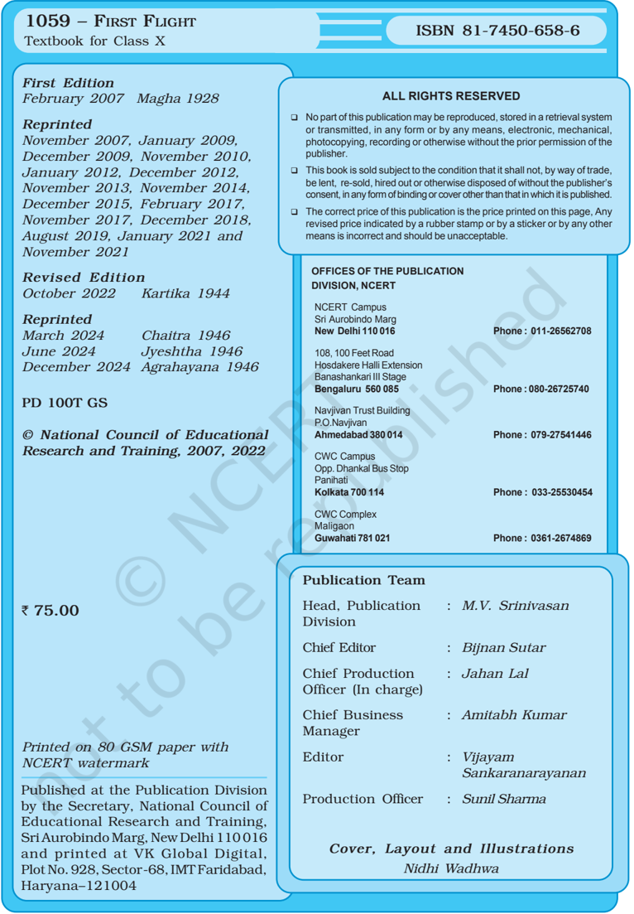

# PAGE 1

Head, Publication : Division

M.V. Srinivasan

Chief Editor :

Bijnan Sutar

Chief  Production : Officer  (In charge)

Jahan Lal

Chief  Business : Manager

Amitabh Kumar

Editor :

Vijayam Sankaranarayanan

Production  Officer :

Sunil Sharma

# PAGE 2

# PAGE 3

## Foreword

T HE National  Curriculum  Framework  (NCF),  2005, recommends that children's life at school must be linked to  their  life  outside  the  school.  This  principle  marks a departure  from  the  legacy  of  bookish  learning  which continues to shape our system and causes a gap between the  school,  home  and  community.  The  syllabi  and textbooks developed on the basis of NCF signify an attempt to  implement  this  basic  idea.  They  also  attempt  to discourage rote learning and the maintenance of sharp boundaries between different subject areas. We hope these measures will take us significantly further in the direction of a child-centered system of education outlined in the National Policy of Education (1986).

The success of this effort depends on the steps that school  principals  and  teachers  will  take  to  encourage children to reflect on their own learning and to pursue imaginative activities and questions. We must recognise that, given space, time and freedom, children generate new knowledge by engaging with the information passed on to them by adults. Treating the prescribed textbook as the sole basis of examination is one of the key reasons why other  resources  and  sites  of  learning  are  ignored. Inculcating creativity and initiative is possible if we perceive and treat  children  as  participants  in  learning,  not  as receivers of a fixed body of knowledge.

These  aims  imply  considerable  change  in  school routines and mode of functioning. Flexibility in the daily time-table is as necessary as rigour in implementing the annual calendar so that the required number of teaching days are actually devoted to teaching. The methods used for teaching and evaluation will also determine how effective this textbook proves for making children's life at school a happy experience,  rather  than  a  source  of  stress  or boredom. Syllabus designers have tried to address the problem  of  curricular  burden  by  restructuring  and reorienting knowledge at different stages with greater

# PAGE 4

consideration for child psychology and the time available for  teaching.  The  textbook  attempts  to  enhance  this endeavour  by  giving  higher  priority  and  space  to opportunities  for  contemplation  and  wondering, discussion  in  small  groups,  and  activities  requiring hands-on experience.

The National Council of Educational Research and Training (NCERT) appreciates the hard work done by the textbook development committee responsible for this book. We wish to thank the Chairperson of the advisory group in  languages,  Professor  Namwar Singh, and the Chief Advisor for this book, Professor R. Amritavalli, for guiding the work of this committee. Several teachers contributed to the development of this textbook; we are grateful to their principals for making this possible. We are indebted to the institutions  and  organisations  which  have  generously permitted us to draw upon their resources, materials and personnel. We are especially grateful to the members of the  National  Monitoring  Committee,  appointed  by  the Department  of  Secondary  and  Higher  Education, Ministry  of  Human  Resource  Development  under  the Chairpersonship  of  Professor  Mrinal  Miri  and Professor  G.P.  Deshpande  for  their  valuable  time and  contribution.  As  an  organisation  committed  to systemic  reform  and  continuous  improvement  in  the quality of its products, NCERT welcomes comments and suggestions which will enable us to undertake further revision and refinements.

New Delhi 20 November 2006

Director National Council of Educational Research and Training

# PAGE 5

## R ATIONALISATION OF C ONTENT IN THE T EXTBOOKS

In view of the COVID-19 pandemic, it is imperative to reduce  content  load  on  students.  The  National Education Policy 2020, also emphasises reducing the content  load  and  providing  opportunities  for experiential  learning  with  creative  mindset.  In  this background, the NCERT has undertaken the exercise to rationalise the textbooks across all classes. Learning Outcomes already developed by the NCERT across classes  have  been  taken  into  consideration  in  this exercise.

## Contents of the textbooks have been rationalised in view of the following:

- Content based on genres of literature  in  the textbooks  and  supplementary  readers  at different stages of school education
- Content that is meant for achieving Learning Outcomes for developing language proficiency and is accessible at different stages
- For  reducing  the  curriculum  load  and examination  stress  in  view  of  the  previling condition of the Pandemic
- Content, which is easily accessible to students without much interventions from teachers and can be learned by children through self-learning or  peer-learning
- Content,  which  is  irrelevant  in  the  present context

This present edition, is a reformatted version after carrying out the changes given above.

# PAGE 6

## To the Teacher

First Flight, a textbook in English for Class X, is based on the new syllabus in English which was prepared as a follow-up to the National Curriculum Framework, 2005.  The  English  curriculum  lays  emphasis  on providing a variety of rich, comprehensible inputs to learners to enable their engagement in learning; and on  recognising  the  multilinguality  of  everyday experience in India. This textbook aims at helping the learner to read for meaning in context, thus providing a  bank  of  language  to  serve  as  a  base  for communication in English.

- This book presents you with texts in a variety of genres, including the diary, the formal address, the travelogue, and the play, on literary, cultural and sociological themes that touch upon aspects of life relevant to adolescents. Questions and ideas about the individual and society, the understanding and management of one's emotions, and of one's place in a larger time and space, are here presented both by such voices from contemporary history as Nelson Mandela and Anne Frank, and in fiction from India and abroad, chosen for their enduring value. There are units that present glimpses of our country, and depict our relationship with the natural world.
- The units in the book have been loosely structured in the following way. An introductory section, Before You Read , gives information or activates knowledge about the text to be read, and suggests some warmup activities. Let children participate in these to the fullest extent; where necessary or possible, add some activities of your own.
- An innovation made in consultation with teachers is a while-reading activity,  the Oral Comprehension Check , which aims at a quick, ongoing check that learners are indeed following the text up to that point, so that they can progress meaningfully to the parts of the text that

# PAGE 7

follow. Let learners briefly share their understanding by orally answering the questions in this section.

Reflection, expression of individual opinion and deeper understanding of the text can occur later, when the text has been read and understood in its totality, in the section Thinking about the Text . The questions in the latter section are designed to enable the learner to move from factual understanding to critical thinking.

- Thinking about Language provides exercises or tasks that follow naturally from the contexts suggested by a particular unit, for enrichment of vocabulary and other language skills. Exploit them well and also create your own activities. Exercises for the communicative skills of listening,  speaking,  and  writing  have  been  given  in contexts that support group or pair activity. A variety of writing tasks have been aimed at.
- While dealing with poems, let children understand and enjoy the theme and the language by reading a poem with close attention, more than once, silently or along with the teacher or a partner. Where some information has been provided about the poet or the background to the poem, this should not stand in the way of the learner accessing the poem directly, and attempting to make sense of it.

How do we read poetry? Here is what one teacher says.

All  poetry  requires  patience.  Be  patient  with  the  text; read carefully for nuance and inference. Know what the words mean. Look up words that are unfamiliar - look up words that are familiar but you cannot specify. Pay attention  to  words  or  phrases  that  resonate  with  other things you know and try to identify the connection. Be patient and read slowly, and you will be amply rewarded.

- Each unit includes some guidelines for your assistance, under the head In This Lesson ,  organised under two subsections What We Have Done , and What You Can Do . The first subsection summarises the theme of the unit, and/or its activities.  The  second  suggests  interesting possibilities for you to go beyond the text, using the text as a springboard for a variety of language activities appropriate to your particular group of learners. Suggested here, for example, are group activities for speaking or making a ticket collage, as well as dictation. As you follow these suggestions and take these activities forward along your own lines, you will be able to enrich your students' learning.

# PAGE 8

## Textbook Development Committee

## C HAIRPERSON , A DVISORY G ROUP IN L ANGUAGES

Professor Namwar Singh, formerly Chairman , School of Languages, Jawaharlal Nehru University, New Delhi

## C HIEF A DVISOR

R. Amritavalli, Professor , Central Institute of English and Foreign Languages (CIEFL), Hyderabad

## C HIEF C OORDINATOR

Ram Janma Sharma, Professor and Head , Department of Languages, NCERT, New Delhi

## M EMBERS

Kalyani Samantray, Reader , SBW College, Cuttack

Kirti Kapur, Lecturer, Department of Languages, NCERT, New Delhi

Lakshmi Rawat, TGT , BRD Sarvodaya Kanya Vidyalaya, Prasad Nagar, Karol Bagh, New Delhi

Nasiruddin Khan, Reader ,  Department  of  Languages NCERT, New Delhi

Padmini Baruah, Reader , Department of ELT, Guwahati University, Guwahati

Sadhana  Agarwal, TGT ,  SKV  Dayanand  School, Daryaganj, Delhi

Sadhana Parashar, Education Officer (ELT),  CBSE, Community Centre, Preet Vihar, Delhi

Sandhya Sahoo, Reader, Regional Institute of Education (NCERT), Bhubaneswar

Shruti Sircar, Lecturer, Centre for ESL Studies, CIEFL, Hyberabad

## M EMBER -COORDINATOR

R.  Meganathan, Lecturer ,  Department  of  Languages, NCERT, New Delhi

# PAGE 9

## Acknowledgements

T HE National Council of Educational Research and Training is grateful  to  Professor  M.L. Tickoo,  formerly  of  the  CIEFL, Hyderabad and the Regional Language Centre, Singapore; Professor Jayasheelan formerly of the CIEFL, Hyderabad; and Professor Rajiv Krishnan of the CIEFL, Hyderabad, for their valuable suggestions and advice in the development of this book.

We thank Dr Shyamla Kumaradoss for developing the teacher's guidelines for each unit so as to maximise learning.

For permission to reproduce copyright material in this book, NCERT would like to thank the following: Sahitya Akademi for 'A Baker from Goa' by Lucio Rodrigues from Modern Indian Literature: An Anthology ,  (V olume Three - Plays and Prose); Media Transasia India Limited, New Delhi, for 'Coorg' and the accompanying photographs by Lokesh Abrol; Little Brown and Company, London, for the extract 'Nelson Mandela: Long Walk to Freedom' from Long Walk to Freedom: The Autobiography of Nelson Mandela; National Book Trust, India,  New  Delhi,  for  'Madam  Rides  the  Bus'  by Vallikannan and for 'Tea from Assam' from Story of Tea by Arup Kumar Dutta; R. K. Laxman for the illustrations in 'Madam Rides the Bus'; Macmillan Publishing Company, New York, for 'The Ball Poem' by John Berryman and for 'Fire and Ice' and 'Dust of Snow' by Robert Frost from the Anthology of American Literature II : Realism to the Present (Third Edition); Puffin Books, London, for 'From the Diary of Anne Frank', an extract from The Diary of a Young Girl' ; Longmans for the extract, 'Mijbil the Otter' from Ring of Bright Water; Random House, New York, for the poem 'The Panther' by Rainer Maria Rilke,  edited  and  translated  by  Stephen  Mitchell;  Amitai Etzioni, George Washington University, for the text 'Good Grief'; Holt, Rinehard and Winston Inc., New York, for the text 'The Sermon at Benares' by Betty Renshaw.

Special  thanks  are  also  due  to  the  Publication Department, NCERT, for their support. NCERT gratefully acknowledges the contributions made by Neena Chandra, Copy  Editor; Mohammed Harun and Arvind Sharma, DTP Operators; Parash Ram, Incharge, Computer Resource Centre, NCERT; and Mathew John, Proof Reader .

# PAGE 10

R

K

## Contents

|    | Foreword                                                         | iii   |
|----|------------------------------------------------------------------|-------|
|    | Rationalisation of Content in the Textbooks                      | v     |
|    | To the Teacher                                                   | vii   |
| 1. | A Letter to God                                                  | 1     |
|    | Dust of Snow R OBERT F ROST                                      | 14    |
|    | Fire and Ice                                                     | 15    |
|    | R OBERT F ROST                                                   |       |
| 2. | Nelson Mandela:Long Walk to Freedom N ELSON R OLIHLAHLA M ANDELA | 16    |
|    | A Tiger in the Zoo L ESLIE N ORRIS                               | 29    |
| 3. | Two Stories about Flying I. His First Flight L IAM O' F LAHERTY  | 32    |
|    | II. Black Aeroplane F REDERICK F ORSYTH How to Tell Wild Animals | 43    |
|    | The Ball Poem J OHN B ERRYMAN                                    | 46    |
| 4. | From the Diary of Anne Frank A NNE F RANK                        | 48    |
|    | Amanda! OBIN LEIN                                                | 61    |

# PAGE 11

| 5.   | Glimpses of India I. A Baker from Goa      | 63    |
|------|--------------------------------------------|-------|
| 6.   | The Trees A DRIENNE R ICH Mijbil the Otter | 77    |
|      | G AVIN M AXWELL Fog C ARL S ANDBURG        | 80 93 |
|      | Madam Rides the Bus V ALLIKKANNAN The      | 94    |
| 7.   | Tale of Custard the Dragon O GDEN N ASH    | 107   |
| 8.   | The Sermon at Benares                      | 111   |
|      | For Anne Gregory W ILLIAM B UTLER Y EATS   | 118   |
|      | The Proposal                               |       |
| 9.   | A NTON C HEKOV                             | 120   |