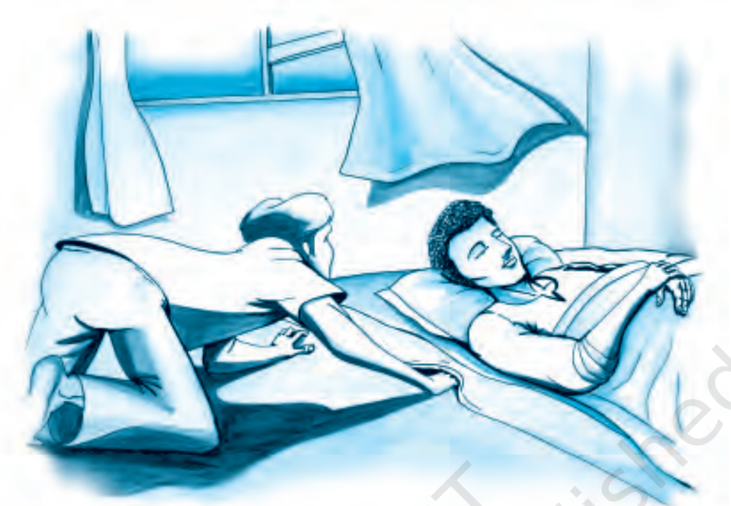

# PAGE 1

## READ AND FIND OUT

- Who does 'I' refer to in this story?
- What is he 'a fairly successful hand' at?
- What does he get from Anil in return for his work?

I  WAS  still  a  thief  when  I  met  Anil.  And  though  only  15,  I  was  an experienced and fairly successful hand.

Anil  was  watching  a  wrestling  match  when  I  approached  him.  He was about 25 - a tall, lean fellow - and he looked easy-going, kind and simple enough for my purpose. I hadn't had much luck of late and thought I might be able to get into the young man's confidence.

'You look a bit of a wrestler yourself,' I said. A little flattery helps in  making  friends.

'So do you,' he replied, which put me off for a moment because at that time I was rather thin.

'Well,' I said modestly, 'I do wrestle a bit.'

- 'What's your name?'

'Hari Singh,' I lied. I took a new name every month. That kept me ahead of the police and my former employers.

After  this  introduction,  Anil  talked  about  the  well-oiled  wrestlers who were grunting,  lifting  and  throwing  each  other  about.  I  didn't have much to say. Anil walked away. I followed casually.

'Hello  again,'  he  said.

I gave him my most appealing smile. 'I want to work for you,' I said. 'But I can't pay you.'

# PAGE 2

I thought that over for a minute. Perhaps I had misjudged my man. I asked, 'Can you feed me?'

'Can you cook?'

'I can cook,' I lied again.

'If you can cook, then may be I can feed you.'

He took me to his room over the Jumna Sweet Shop and told me I could  sleep  on  the  balcony.  But  the  meal  I  cooked  that  night  must have been terrible because Anil gave it to a stray dog and told me to be off. But I just hung around, smiling in my most appealing way, and he couldn't  help  laughing.

Later,  he  patted  me  on  the  head  and  said  never  mind,  he'd  teach me to cook. He also taught me to write my name and said he would soon teach me to write whole sentences and to add numbers. I was grateful.  I  knew  that  once  I  could  write  like  an  educated  man  there would be no limit to what I could achieve.

It was quite pleasant working for Anil. I made the tea in the morning and then would take my time buying the day's supplies, usually making a profit of about a rupee a day. I think he knew I made a little money this way but he did not seem to mind.

The Thief's Story

# PAGE 3

Anil made money by fits and starts. He would borrow one week, lend the  next.  He  kept  worrying  about  his  next  cheque,  but  as  soon  as  it arrived he would go out and celebrate. It seems he wrote for magazines a queer way to make a living!

One evening he came home with a small bundle of notes, saying he had just sold a book to a publisher. At night, I saw him tuck the money under the mattress.

I  had  been  working  for  Anil  for  almost  a  month  and,  apart  from cheating on the shopping, had not done anything in my line of work. I had every opportunity for doing so. Anil had given me a key to the door, and I could come and go as I pleased. He was the most trusting person I had ever met.

And that is  why  it  was  so  difficult  to  rob  him.  It's  easy  to  rob  a greedy man, because he can afford to be robbed; but it's difficult to rob a careless man - sometimes he doesn't even notice he's been robbed and that takes all the pleasure out of the work.

Well, it's time I did some real work, I told myself; I'm out of practice. And if I don't take the money, he'll only waste it on his friends. After all, he doesn't even pay me.

## READ AND FIND OUT

- How does the thief think Anil will react to the theft?
- What does he say about the different reactions of people when they are  robbed?
- Does Anil realise that he has been robbed?

Anil was asleep. A beam of moonlight stepped over the balcony and fell on the bed. I sat up on the floor, considering the situation. If I took the money, I could catch the 10.30 Express to Lucknow. Slipping out of the  blanket,  I  crept  up  to  the  bed.  Anil  was  sleeping  peacefully.  His face was clear and unlined; even I had more marks on my face, though mine were mostly scars.

My hand slid under the mattress, searching for the notes. When I found them, I drew them out without a sound. Anil sighed in his sleep and turned on his side, towards me. I was startled and quickly crawled out of the room.

When I was on the road, I began to run. I had the notes at my waist, held there by the string of my pyjamas. I slowed down to a walk and counted the notes: 600 rupees in fifties!  I  could  live  like  an  oil-rich Arab for a week or two.

Footprints without Feet

# PAGE 4

When I reached the station I did not stop at the ticket office (I had never bought a ticket in my life) but dashed straight to the platform. The Lucknow Express was just moving out. The train had still to pick up speed and I should have been able to jump into one of the carriages, but  I  hesitated  -  for  some  reason  I  can't  explain  -  and  I  lost  the chance to get away.

When the train had gone, I found myself standing alone on the deserted  platform.  I  had  no  idea  where  to  spend  the  night.  I  had  no friends,  believing  that  friends  were  more  trouble  than  help.  And  I  did not want to make anyone curious by staying at one of the small hotels near the station. The only person I knew really well was the man I had robbed. Leaving the station, I walked slowly through the bazaar.

In  my  short  career  as  a  thief,  I  had  made  a  study  of  men's  faces when they had lost their goods. The greedy man showed fear; the rich man showed anger; the poor man showed acceptance. But I knew that Anil's  face,  when  he  discovered the theft, would show only a touch of sadness. Not for the loss of money, but for the loss of trust.

I  found myself in the maidan and sat down on a bench. The night was chilly - it was early November - and a light drizzle added to my discomfort.  Soon  it  was  raining  quite  heavily.  My  shirt  and  pyjamas stuck to my skin, and a cold wind blew the rain across my face.

The Thief's Story 11

# PAGE 5

I  went back to the bazaar and sat down in the shelter of the clock tower. The clock showed midnight. I felt for the notes. They were damp from the rain.

Anil's money. In the morning he would probably have given me two or three rupees to go to the cinema, but now I had it all. I couldn't cook his meals, run to the bazaar or learn to write whole sentences any more.

I  had  forgotten  about  them  in  the  excitement  of  the  theft.  Whole sentences, I knew, could one day bring me more than a few hundred rupees. It was a simple matter to steal - and sometimes just as simple to be caught. But to be a really big man, a clever and respected man, was something else. I  should go back to Anil, I told myself, if only to learn to read and write.

I  hurried  back  to  the  room  feeling  very  nervous,  for  it  is  much easier  to  steal  something  than  to  return  it  undetected.  I  opened  the door  quietly,  then  stood  in  the  doorway,  in  clouded  moonlight.  Anil was still asleep. I crept to the head of the bed, and my hand came up with  the  notes.  I  felt  his  breath  on  my  hand.  I  remained  still  for  a minute. Then my hand found the edge of the mattress, and slipped under it with the notes.

I  awoke  late  next  morning  to  find  that  Anil  had  already  made  the tea.  He  stretched  out  his  hand  towards  me.  There  was  a  fifty-rupee note between his fingers. My heart sank. I thought I had been discovered.

'I  made some money yesterday,' he explained. 'Now you'll be paid regularly.'

My spirits rose. But when I took the note, I saw it was still wet from the  night's  rain.

'Today we'll  start  writing  sentences,'  he  said.

He knew. But neither his lips nor his eyes showed anything. I smiled at Anil in my most appealing way. And the smile came by itself, without any effort.

RUSKIN BOND

## GLOSSARY

flattery:

insincere  praise

modestly:

without boasting; in a humble way

grunting:

making  low  guttural  sounds

appealing:

attractive

unlined:

(here) showing no sign of worry or anxiety

12

Footprints without Feet

# PAGE 6

## Think/.notdefabout/.notdefit

1. What are Hari Singh's  reactions  to  the  prospect  of  receiving  an education? Do they change over time? ( Hint : Compare, for example, the thought: 'I knew that once I could write like an educated man there  would  be  no  limit  to  what  I  could  achieve'  with  these  later thoughts: 'Whole sentences, I knew, could one day bring me more than a few hundred rupees. It was a simple matter to steal - and sometimes just as simple to be caught. But to be a really big man, a  clever  and  respected  man,  was  something  else.')  What  makes him return to Anil?
2. Why does not Anil hand the thief over to the police? Do you think most people would have done so? In what ways is Anil different from such employers?

## Talk/.notdefabout/.notdefit

1. Do you think people like  Anil  and  Hari  Singh  are  found  only  in fiction, or are there such people in real life?
2. Do  you  think  it  a  significant  detail  in  the  story  that  Anil  is  a struggling writer? Does this explain his behaviour in any way?
3. Have you met anyone like Hari Singh?  Can you think and imagine the circumstances that can turn a fifteen-year-old boy into a thief?
4. Where is the story set? (You can get clues from the names of the persons and places mentioned in it.) Which language or languages are  spoken  in  these  places?  Do  you  think  the  characters  in  the story spoke to each other in English?

## Suggested/.notdefreading

- 'He Said It with Arsenic' by Ruskin Bond
- 'Vanka'  by  Anton  Chekhov
- 'A  Scandal in Bohemia' by Arthur Conan Doyle

