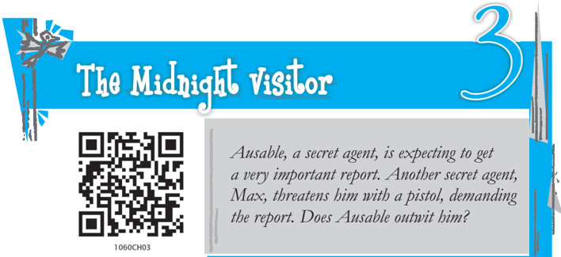
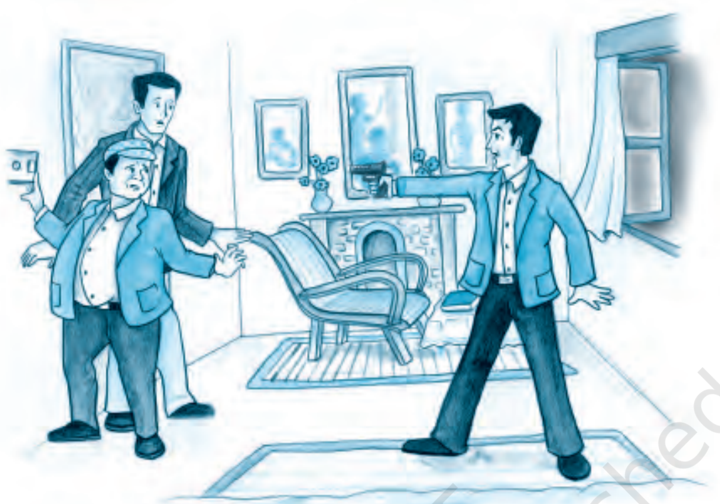
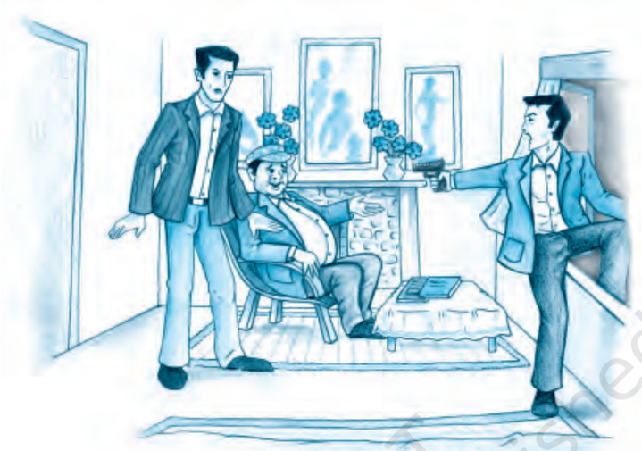

# PAGE 1

## READ AND FIND OUT

- How is Ausable different from other secret agents?
- Who is Fowler and what is his first authentic thrill of  the  day?

AUSABLE did not fit any description of a secret agent Fowler had ever read.  Following  him  down  the  musty  corridor  of  the  gloomy  French hotel  where  Ausable  had  a  room,  Fowler  felt  let  down.  It  was  a small room, on the sixth and top floor, and scarcely a setting for a romantic  adventure.

Ausable was, for one thing, fat. Very fat.  And  then  there  was  his accent. Though he spoke French and German passably, he had never altogether lost the American accent he had brought to Paris from Boston twenty years ago.

'You  are  disappointed,'  Ausable  said  wheezily  over  his  shoulder. 'You were told that I was a secret agent, a spy, dealing in espionage and danger. You wished to meet me because you are a writer, young and romantic. You envisioned mysterious figures in the night, the crack of pistols, drugs in the wine.'

'Instead,  you  have  spent  a  dull  evening  in  a  French  music  hall with  a  sloppy  fat  man  who,  instead  of  having  messages  slipped  into his  hand  by  dark-eyed  beauties,  gets  only  a  prosaic  telephone  call making an appointment in his room. You have been bored!' The fat man chuckled to himself as he unlocked the door of his room and stood aside to let his frustrated guest enter.

'You are disillusioned,' Ausable told him. 'But take cheer, my young friend.  Presently  you  will  see  a  paper,  a  quite  important  paper  for

# PAGE 2

which several  men  and  women have risked their  lives,  come  to  me. Some day soon that paper may well affect the course of history. In that thought is drama, is there not?'

As he spoke, Ausable closed the door behind him. Then he switched on the light.

And as the light came on, Fowler had his first authentic thrill of the day. For halfway across the room, a small automatic pistol in his hand, stood a man.

Ausable blinked a few times.

'Max,' he wheezed, 'you gave me quite a start. I thought you were in Berlin. What are you doing here in my room?'

## READ AND FIND OUT

- How has Max got in?
- How does Ausable say he got in?

Max was slender, a little less than tall, with  features  that suggested slightly the crafty, pointed countenance of a fox. There was about him aside from the gun - nothing especially menacing.

'The  report,'  he  murmured.  'The  report  that  is  being  brought  to you tonight concerning some new missiles. I thought I would take it from you. It will be safer in my hands than in yours.'

The Midnight Visitor

# PAGE 3

Ausable moved to an armchair and sat down heavily. 'I'm going to raise the devil with the management this time, and you can bet on it,' he said grimly. 'This is the second time in a month that somebody has got  into  my  room  through  that  nuisance  of  a  balcony!'  Fowler's  eyes went to  the  single  window  of  the  room.  It  was  an  ordinary  window, against which now the night was pressing blackly.

'Balcony?' Max said, with a rising inflection. 'No, a passkey. I did not  know  about  the  balcony.  It  might  have  saved  me  some  trouble had I known.'

'It's not my balcony,' Ausable said with extreme irritation. 'It belongs to the next apartment.' He glanced explanatorily at Fowler. 'You see,' he said, 'this room used to be part of a large unit, and the next room through that door there - used to be the living room. It had the balcony, which extends under my window  now. You  can  get  onto  it  from  the empty room two doors down - and somebody did, last month. The management promised to block it off. But they haven't.'

Max glanced at Fowler, who was standing stiffly not far  from Ausable, and waved the gun with a commanding gesture. 'Please sit down,' he said. 'We have a wait of half an hour, I think.'

'Thirty-one minutes,' Ausable said moodily. 'The appointment was for twelve-thirty. I wish I knew how you learned about the report, Max.'

The little spy smiled evilly. 'And we wish we knew how your people got the report. But no harm has been done. I will get it back tonight. What is that? Who is at the door?'

Fowler jumped at the sudden knocking at the door. Ausable just smiled.  'That  will  be  the  police,'  he  said.  'I  thought  that  such  an important  paper  as  the  one  we  are  waiting  for  should  have  a  little extra protection. I told them to check on me to make sure everything was all  right.'

Max bit his lip nervously. The knocking was repeated.

'What will you do now, Max?' Ausable asked. 'If I do not answer the door,  they  will  enter  anyway.  The  door  is  unlocked.  And  they  will  not hesitate  to  shoot.'

Max's face was black with anger as he backed swiftly towards the window. He swung a leg over the sill. 'Send them away!' he warned. 'I will  wait  on  the  balcony.  Send  them  away  or  I'll  shoot  and  take  my chances!'

The knocking at the door became louder and a voice was raised.

'Mr Ausable! Mr Ausable!'

16

Footprints without Feet

# PAGE 4

Keeping his body twisted so that his gun still covered the fat man and his guest, the man at the window grasped the frame with his free hand to support himself. Then he swung his other leg up and over the window-sill.

The doorknob turned. Swiftly Max pushed with his left hand to free himself from the sill and drop to the balcony. And then, as he dropped, he screamed once, shrilly.

The door opened and a waiter stood there with a tray, a bottle and two glasses. 'Here is the drink you ordered for when you returned,' he said, and set the tray on the table, deftly uncorked the bottle, and left the room.

White-faced,  Fowler  stared  after  him.  'But...'  he  stammered,  'the police...'

'There were no police.' Ausable sighed. 'Only Henry, whom I was expecting.'

'But won't that man out on the balcony…?' Fowler began.

'No,'  said  Ausable,  'he  won't  return.  You  see,  my  young  friend, there is no balcony.'

ROBERT ARTHUR

The Midnight Visitor

# PAGE 5

## GLOSSARY

romantic:

imaginative;  having  a  fantastic  view  of  reality

passably:

just  well  enough;  tolerably  well

espionage:

spying

sloppy:

(here)  carelessly  dressed

prosaic:

ordinary

chuckled:

laughed  quietly,  without  opening  his  mouth

wheezed:

spoke  breathing  noisily  and  heavily

missiles:

weapons directed by remote control or automatically

shrilly:

piercingly; in a high pitch

## Think/.notdefabout/.notdefit

1. 'Ausable did not fit  any  description  of  a  secret  agent  Fowler  had ever read.' What do secret agents in books and films look like, in your opinion? Discuss in groups or in class some stories or movies featuring  spies,  detectives  and  secret  agents,  and  compare  their appearance with that of Ausable in this story. (You may mention characters from fiction in languages other than English. In English fiction you may have come across Sherlock Holmes, Hercule Poirot, or  Miss  Marple.  Have  you  watched  any  movies  featuring  James Bond?)
2. How does Ausable manage to make Max believe that there is a balcony attached to his room? Look back at his detailed description of it. What makes it a convincing story?
3. Looking back at the story, when do you think Ausable thought up his plan for getting rid of Max? Do you think he had worked out his plan in detail right from the beginning? Or did he make up a plan taking  advantage of  events  as  they  happened?

## Talk/.notdefabout/.notdefit

1. In this story, Ausable shows great 'presence of mind,' or the ability to think quickly, and act calmly and wisely, in a situation of danger and surprise. Give examples from your own experience, or narrate a story, which shows someone's presence of mind.
2. Discuss  what  you  would  do  in  the  situations  described  below. Remember that presence of mind comes out of a state of mental preparedness.  If  you  have  thought  about  possible  problems  or

18

Footprints without Feet

# PAGE 6

dangers, and about how to act in such situations, you have a better chance of dealing with such situations if they do arise.

- A small fire starts in your kitchen.
- A child starts to choke on a piece of food.
- An electrical appliance starts to hiss and gives out sparks.
- A bicycle knocks down a pedestrian.
- It  rains  continuously for more than twenty-four hours.
- A member of your family does not return home at the usual or expected time.

You may suggest other such situations.

- 'After Twenty Years' by O. Henry
- 'The Stolen Bacillus' by H.G. Wells
- 'The Face on the Wall' by E.V. Lucas

The Midnight Visitor

19

