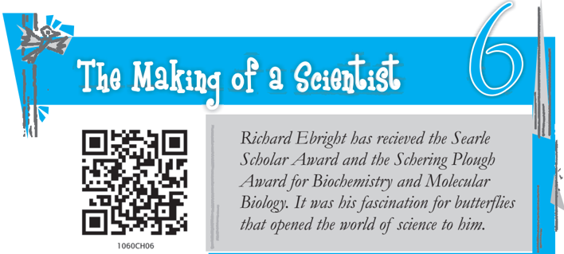
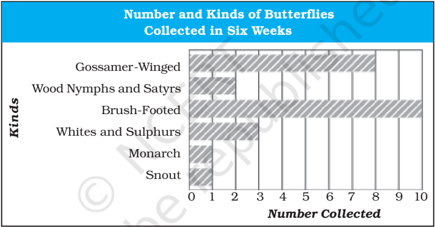

# PAGE 1

## READ AND FIND OUT

- How did a book become a turning point in Richard Ebright's life?
- How did his mother help him?

AT the age of twenty-two, a former 'scout of the year' excited the scientific world with a new theory on how cells work. Richard H. Ebright and his college room-mate explained the theory in an article in the Proceedings of the National Academy of Science.

It  was  the  first  time  this  important  scientific  journal  had  ever published the work of college students. In sports, that would be like making the big leagues at the age of fifteen  and  hitting  a  home  run your first  time  at  bat * .  For  Richard  Ebright,  it  was  the  first  in  a  long string  of  achievements  in  science  and  other  fields.  And  it  all  started with  butterflies.

An only  child,  Ebright  grew  up  north  of  Reading,  Pennsylvania. 'There  wasn't  much  I  could  do  there,'  he  said.  'I  certainly  couldn't play football or baseball with a team of one. But there was one thing I could do - collect things.'

So  he  did,  and  did  he  ever!  Beginning  in  kindergarten,  Ebright collected  butterflies  with  the  same  determination  that  has  marked  all his    activities.  He  also  collected  rocks,  fossils,  and  coins.  He  became an eager astronomer, too, sometimes star-gazing all night.

* A home run in the game of baseball is when the batter scores a run after running safely around all bases and back to the home plate without stopping. A ball hit out of the playing field is also called a home run. Getting a paper published at the age of fifteen in a scientific journal is here compared to scoring a home run while batting for the first time.

# PAGE 2

From the first he had a driving curiosity along with a bright mind. He also  had  a  mother  who  encouraged  his  interest  in  learning.  She took  him  on  trips,  bought  him  telescopes,  microscopes,  cameras, mounting materials,  and  other  equipment  and  helped  him  in  many other  ways.

'I  was  his  only  companion  until  he  started  school,'  his  mother said.  'After  that  I  would  bring  home  friends  for  him.  But  at  night  we just did things together. Richie was my whole life after his father died when Richie was in third grade.'

She and her son spent almost every evening at the dining room table.  'If  he  didn't  have  things  to  do,  I  found  work  for  him  -  not physical  work,  but  learning  things,'  his  mother  said.  'He  liked  it. He wanted to learn.'

And learn he did.  He  earned  top  grades  in  school.  'On  everyday things he was just like every other kid,' his mother said.

By the time he was in the second grade, Ebright had collected all twentyfive species of butterflies found around his hometown. (See following box.)

| Species and Sub-species of Butterflies Collected in Six Weeks in Reading, Pennsylvania                                                                                                   | Species and Sub-species of Butterflies Collected in Six Weeks in Reading, Pennsylvania                                                                        | Species and Sub-species of Butterflies Collected in Six Weeks in Reading, Pennsylvania                                                                                                        |
|------------------------------------------------------------------------------------------------------------------------------------------------------------------------------------------|---------------------------------------------------------------------------------------------------------------------------------------------------------------|-----------------------------------------------------------------------------------------------------------------------------------------------------------------------------------------------|
| Gossamer-Winged Butterflies • white M hairstreak • acadian hairstreak • bronze copper • bog copper • purplish copper • eastern-tailed blue • melissa blue • silvery blue Snout Butterfly | Wood Nymphs and Satyrs • eyed brown • woodnymph(grayling) Monarchs • monarch or milkweed Whites and Sulphurs • olympia • cloudless sulphur • European cabbage | Brush-footed Butterflies • variegated fritillary • Harris's checkerspot • pearl crescent • mourning cloak • painted lady • buckeye • viceroy • white admiral • red-spotted purple • hackberry |

'That probably would have been the end of my butterfly collecting,' he  said.  'But  then  my  mother  got  me  a  children's  book  called The Travels of Monarch X.' That book, which told how monarch butterflies migrate to Central America, opened the world of science to the eager young collector.

The Making of a Scientist

33

# PAGE 3

At the end of the book, readers were invited to help study butterfly migrations.  They  were  asked  to  tag  butterflies  for  research  by  Dr Frederick  A. Urquhart of the University of Toronto, Canada. Ebright's mother wrote to Dr  Urquhart, and soon Ebright was attaching light adhesive tags to the wings of monarchs. Anyone who found a tagged butterfly was asked to send the tag to Dr Urquhart.

The butterfly  collecting  season  around  Reading  lasts  six  weeks  in late  summer. (See graph below.) If you're going to chase them one by one,  you  won't  catch  very  many.  So  the  next  step  for  Ebright  was  to raise a flock of butterflies. He would catch a female monarch, take her eggs, and raise them in his basement through their life cycle, from egg to caterpillar to pupa to adult butterfly. Then he would tag the butterflies' wings and let them go. For several years his basement was home to thousands of monarchs in different stages of development.

'Eventually I began to lose interest in tagging butterflies. It's tedious and there's not much feedback,' Ebright said. 'In all the time I did it,' he laughed, 'only two butterflies I had tagged were recaptured - and they were not more than seventy-five miles from where I lived.'

## READ AND FIND OUT

- What lesson does Ebright learn when he does not win anything at a   science fair?
- What experiments and projects does he then undertake?
- What are the qualities that go into the making of a scientist?

# PAGE 4

Then in the  seventh  grade  he  got  a  hint  of  what  real  science  is when he entered a county science fair - and lost. 'It was really a sad feeling to sit there and not get anything while everybody else had won something,' Ebright said. His entry was slides of frog tissues,  which he showed under a microscope. He realised the winners had tried to do real experiments, not simply make a neat display.

Already  the  competitive  spirit  that  drives  Richard  Ebright  was appearing. 'I knew that for the next year's fair I would have to do a real experiment,' he said. 'The subject I knew most about was the insect work I'd been doing in the past several years.'

So he wrote to Dr Urquhart for ideas, and back came a stack of suggestions  for  experiments.  Those  kept  Ebright  busy  all  through high  school  and  led  to  prize  projects  in  county  and  international science  fairs.

For  his  eighth  grade  project,  Ebright  tried  to  find  the  cause  of  a viral disease that kills nearly all monarch caterpillars every few years. Ebright  thought  the  disease  might  be  carried  by  a  beetle.  He  tried raising  caterpillars  in  the  presence  of  beetles.  'I  didn't  get  any  real results,'  he  said.  'But  I  went  ahead  and  showed  that  I  had  tried  the experiment. This time I won.'

The next year his science fair  project  was  testing  the  theory  that viceroy  butterflies  copy  monarchs.  The  theory  was  that  viceroys  look like  monarchs because monarchs don't taste good to birds. Viceroys, on the other hand, do taste good to birds. So the more they look like monarchs, the less likely they are to become a bird's dinner.

Ebright's  project  was  to  see whether, in fact,  birds  would  eat monarchs.  He  found  that  a starling  would  not  eat  ordinary bird  food.  It would eat  all  the monarchs it  could  get.  (Ebright said later research by other people showed that viceroys probably do copy  the  monarch.)  This  project was  placed  first  in  the  zoology division  and  third  overall  in  the county science fair.

The Making of a Scientist

# PAGE 5

In his second year in high school, Richard Ebright began the research that led to his discovery of an unknown insect hormone. lndirectly, it also led to his new theory on the life of cells.

The question he tried to answer was simple: What is the purpose of the twelve tiny gold spots on a monarch pupa?

'Everyone assumed the spots were just ornamental,' Ebright said. 'But Dr Urquhart didn't believe it.'

To find the answer, Ebright and another excellent science student first had to build a device that showed that the spots were producing a hormone necessary for the butterfly's full development.

This project won Ebright first place in the county fair and entry into  the  International  Science  and  Engineering  Fair.  There  he  won third  place  for  zoology.  He  also  got  a  chance  to  work  during  the summer at  the  entomology  laboratory  of  the  Walter  Reed  Army

Institute  of  Research.

As a high school junior, Richard Ebright continued his advanced experiments  on  the  monarch  pupa.  That  year  his  project  won  first place  at  the  International  Science  Fair  and  gave  him  another  chance to work in the army laboratory during the summer.

In  his  senior  year,  he  went  a  step  further.  He  grew  cells  from  a monarch's wing in a culture and showed that the cells would divide and develop into  normal  butterfly  wing  scales  only  if  they  were  fed the  hormone  from  the  gold  spots.  That  project  won  first  place  for zoology at the International Fair. He spent the summer after graduation doing further work at the army laboratory and at the laboratory of the U.S.  Department  of  Agriculture.

The  following  summer,  after  his  freshman  year  at  Harvard University,  Ebright  went  back  to  the  laboratory  of  the  Department  of Agriculture  and  did  more  work  on  the  hormone  from  the  gold  spots. Using  the  laboratory's  sophisticated  instruments,  he  was  able  to identify  the  hormone's  chemical  structure.

A year-and-a-half later, during his junior year, Ebright got the idea for his new theory about cell life. It came while he was looking at X-ray photos of the chemical structure of a hormone.

When he saw those photos, Ebright didn't shout, 'Eureka!' or even, 'I've  got  it!'  But  he  believed  that,  along  with  his  findings  about  insect hormones, the photos gave him the answer to one of biology's puzzles: how the cell can 'read' the blueprint of its DNA. DNA is the substance in  the  nucleus  of  a  cell  that  controls  heredity.  It  determines  the  form and function of the cell. Thus DNA is the blueprint for life.

Footprints without Feet

# PAGE 6

Ebright and his college room-mate, James R. Wong, worked all that night  drawing  pictures  and  constructing  plastic  models  of  molecules to show how it could happen. Together they later wrote the paper that explained the theory.

Surprising no one who knew him, Richard Ebright graduated from Harvard with highest honours, second in his class of 1,510. Ebright went on to become a graduate student researcher at Harvard Medical School. There he began doing experiments to test his theory.

If  the  theory  proves  correct,  it  will  be  a  big  step  towards understanding the processes of life. It might also lead to new ideas for preventing some types of cancer and other diseases. All of this is possible because of Ebright's scientific curiosity. His high school research into the purpose of the spots on a monarch pupa eventually led him to his theory about cell life.

Richard Ebright has been interested in science since he first began collecting butterflies - but not so deeply that he hasn't time for other interests. Ebright also became a champion debater and public speaker and a good canoeist and all-around outdoors-person. He is also an expert  photographer,  particularly  of  nature  and  scientific  exhibits.

In  high  school  Richard  Ebright  was  a  straight-A  student.  Because learning was easy, he turned a lot of his energy towards the Debating and Model United Nations clubs. He also found someone to admire Richard A.  Weiherer,  his  social  studies  teacher  and  adviser  to  both clubs. 'Mr Weiherer was the perfect person for me then. He opened my mind to new ideas,' Ebright said.

'Richard  would  always  give  that  extra  effort,'  Mr  Weiherer  said. 'What pleased me was, here was this person who put in three or four hours at night  doing  debate  research  besides  doing  all  his  research with  butterflies  and  his  other  interests.

'Richard  was  competitive,'  Mr  Weiherer  continued,  'but  not  in  a bad sense.'  He  explained,  'Richard  wasn't  interested  in  winning  for winning's  sake  or  winning  to  get  a  prize.  Rather,  he  was  winning because he wanted to do the best job he could. For the right reasons, he wants to be the best.'

And that  is  one  of  the  ingredients  in  the  making  of  a  scientist. Start  with  a  first-rate  mind,  add  curiosity,  and  mix  in  the  will  to  win for  the  right  reasons.  Ebright  has  these  qualities.  From  the  time  the book, The Travels of Monarch X, opened  the  world  of  science  to  him, Richard Ebright has never lost his scientific curiosity.

ROBERT W. PETERSON

The Making of a Scientist

37

# PAGE 7

## GLOSSARY

leagues: groups  of  sports  clubs  or  teams  playing  matches  among themselves

county: region

starling: common European bird (with black, brown-spotted plumage) which nests near buildings and is a good mimic

entomology:

the  study of insects

eureka:

a cry of triumph at a discovery (originally attributed to Archimedes)

canoeist:

a person who paddles a canoe, a light boat

## Think/.notdefabout/.notdefit

1. How can one become a scientist, an economist, a historian... ? Does it simply involve reading many books on the subject? Does it involve observing,  thinking  and  doing  experiments?
2. You must have read about cells and DNA in your science books. Discuss Richard Ebright's work in the light of what you have studied. If  you get an opportunity to work like Richard Ebright on projects and experiments, which field would you like to work on and why?

## Talk/.notdefabout/.notdefit

1. Children  everywhere  wonder  about  the  world  around  them. The  questions  they  ask  are  the  beginning  of  scientific  inquiry. Given below are some questions that children in India have asked Professor  Yash  Pal  and  Dr  Rahul  Pal  as  reported  in  their  book, Discovered Questions (NCERT, 2006).
2. (i) What is DNA fingerprinting? What are its uses?
3. (ii) How do honeybees identify their own honeycombs?
4. (iii) Why does rain fall in drops?

Can you answer these questions? You will find Professor Yash Pal's and Dr Rahul Pal's answers (as given in Discovered Questions ) on page 75.

2. You also  must  have  wondered  about  certain  things  around  you. Share these questions with your class, and try and answer them.
- 'Journey by Night' by Norah Burke
- Children Who Made It Big by Thangamani
- School Days by Tom Brown

## Footprints without Feet 38

