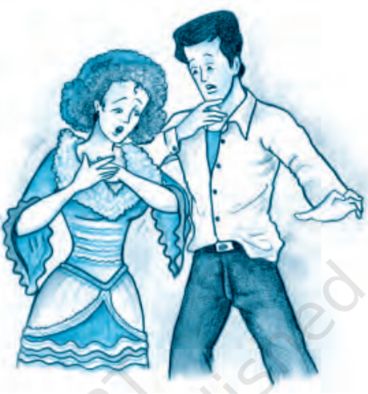

# PAGE 1

## READ AND FIND OUT

- What kind of a person is Mme Loisel - why is she always unhappy?
- What kind of a person is her husband?

SHE  was  one  of  those  pretty,  young  ladies,  born  as  if  through  an error of destiny, into a family of clerks. She had no dowry, no hopes, no  means  of  becoming  known,  loved,  and  married  by  a  man  either rich  or  distinguished;  and  she  allowed  herself  to  marry  a  petty clerk  in  the  office  of  the  Board  of  Education.  She  was  simple,  but she  was  unhappy.

She  suffered  incessantly,  feeling  herself  born  for  all  delicacies and luxuries.  She  suffered  from  the  poverty  of  her  apartment,  the shabby  walls  and  the  worn  chairs.  All  these  things  tortured  and angered  her.

When she seated herself  for  dinner  opposite  her  husband  who uncovered the tureen with a delighted air, saying, 'Oh! the good potpie! I know nothing better than that…,' she would think of elegant dinners, of shining silver; she thought of the exquisite food served in marvellous dishes. She had neither frocks nor jewels, nothing. And she loved only those  things.

She had a rich friend, a schoolmate at the convent, who she did not like to visit - she suffered so much when she returned. She wept for whole days from despair and disappointment.

One evening her husband returned elated bearing in his hand a large  envelope.

'Here,' he said, 'here is something for you.'

# PAGE 2

She  quickly  drew  out  a  printed  card  on  which  were  inscribed these  words:

The  Minister  of  Public  Instruction The  Minister  of  Public  Instruction a n d a n d Madame  George  Ramponneau Madame  George  Ramponneau ask  t h e   h o n o u r   o f   M .   a n d   M m e   L o i s e l ' s   c o m p a n y .   M o n d a y ask  t h e   h o n o u r   o f   M .   a n d   M m e   L o i s e l ' s   c o m p a n y .   M o n d a y evening,  January  18,  at  the  Minister's  residence. evening,  January  18,  at  the  Minister's  residence.

Instead  of  being  delighted,  as  her  husband  had  hoped,  she  threw the  invitation  spitefully  upon  the  table  murmuring,  'What  do  you suppose I want with that?'

'But,  my  dearie,  I  thought it  would make you happy. You never  go  out,  and  this  is  an occasion,  and  a  fine  one! Everybody wishes one, and it is  very  select;  not  many  are given to employees. You will see the  whole  official  world  there.'

She looked at him with an irritated  eye  and  declared impatiently,  'What  do  you suppose I have to wear to such a thing as that?'

He had not thought of that; he stammered, 'Why, the dress you  wear  when  we  go  to  the theatre. It seems very pretty to me…' He was silent, stupefied,  in  dismay,  at  the  sight  of  his  wife weeping. He stammered, 'What is the matter? What is the matter?'

By a violent effort,  she  had  controlled  her  vexation  and  responded in  a  calm  voice,  wiping  her  moist  cheeks,  'Nothing.  Only  I  have  no dress  and  consequently  I  cannot  go  to  this  affair.  Give  your  card  to some colleague whose wife is better fitted out than I.'

He was grieved,  but  answered,  'Let  us  see,  Matilda.  How  much would a suitable costume cost, something that would serve for other occasions,  something very simple?'

She reflected  for  some  seconds  thinking  of  a  sum  that  she  could ask for without bringing with it an immediate refusal and a frightened exclamation from the economical clerk. Finally she said, in a hesitating

Footprints without Feet

# PAGE 3

voice,  'I  cannot  tell  exactly,  but  it  seems  to  me  that  four  hundred francs ought to cover it.'

He turned a little pale, for he had saved just this sum to buy a gun that  he  might  be  able  to  join  some  hunting  parties  the  next  summer, with  some friends  who  went  to  shoot  larks  on  Sunday.  Nevertheless, he answered, 'Very well. I will give you four hundred francs. But try to have a pretty dress.'

## READ AND FIND OUT

- What fresh problem now disturbs Mme Loisel?
- How is the problem solved?

The  day  of  the  ball  approached  and  Mme  Loisel  seemed  sad, disturbed,  anxious.  Nevertheless,  her  dress  was  nearly  ready.  Her husband said to her one evening, 'What is the matter with you? You have acted strangely for two or three days.'

And she responded, 'I am vexed not to have a jewel, nothing to adorn myself with. I shall have such a poverty-stricken look. I would prefer not to go to this party.'

He replied,  'You  can  wear  some  natural  flowers.  In  this  season they look very chic.'

She was not convinced. 'No', she replied, 'there is  nothing  more humiliating than to have a shabby air in the midst of rich women.'

Then her husband cried out, 'How stupid we are! Go and find your friend Mme Forestier and ask her to lend you her jewels.'

She uttered a cry of joy. 'It is true!' she said. 'I had not thought of that.'

The next day she took herself to her friend's house and related her story  of  distress.  Mme  Forestier  went  to  her  closet,  took  out  a  large jewel-case, brought it, opened it, and said, 'Choose, my dear.'

She saw at first  some  bracelets,  then  a  collar  of  pearls,  then  a Venetian cross of gold and jewels of admirable workmanship. She tried the jewels before the glass, hesitated, but could neither decide to take them nor leave them. Then she asked, 'Have you nothing more?'

'Why, yes. Look for yourself. I do not know what will please you.'

Suddenly she discovered, in a black satin box, a superb necklace of diamonds. Her hands trembled as she took it out.  She placed it about her  throat  against  her  dress,  and  was  ecstatic.  Then  she  asked,  in  a hesitating voice, full of anxiety, 'Could you lend me this? Only this?'

'Why, yes, certainly.'

The Necklace

# PAGE 4

She fell  upon  the  neck  of  her  friend,  embraced  her  with  passion, then went away with her treasure.

The day of the ball arrived.  Mme Loisel was a great success. She was the prettiest of all - elegant, gracious, smiling and full of joy. All the men noticed her, asked her name, and wanted to be presented.

She danced with enthusiasm, intoxicated with pleasure, thinking of  nothing  but  all  this  admiration,  this  victory  so  complete  and  sweet to  her  heart.

She went home towards four o'clock in the morning. Her husband had been half asleep in one of the little  salons  since  midnight,  with three other gentlemen whose wives were enjoying themselves very much.

He threw around her shoulders the modest wraps they had carried whose poverty clashed with the elegance of the ball costume. She wished to hurry away in order not to be noticed by the other women who were wrapping themselves in rich furs.

Loisel detained her, 'Wait,' said he. 'I am going to call a cab.'

But she would not listen and descended the steps rapidly. When they were in the street, they found no carriage; and they began to seek for one, hailing the coachmen whom they saw at a distance.

They walked along toward the river, hopeless and shivering. Finally they found one of those old carriages that one sees in Paris after nightfall.

It took them as far as their door and they went wearily up to their apartment. It  was  all  over  for  her.  And  on  his  part,  he  remembered that he would have to be at the office by ten o'clock.

She removed the wraps from her shoulders before the glass, for a final  view  of  herself  in  her  glory.  Suddenly  she  uttered  a  cry.  Her necklace was not around her neck.

## READ AND FIND OUT

- What do M. and Mme Loisel do next?
- How do they replace the necklace?

Loisel  already  half  undressed,  asked,  'What  is  the  matter?'

She turned towards him excitedly. 'I have - I have - I no longer have Mme Forestier's necklace.'

He arose in dismay, 'What! How is that? It is not possible.'

And they looked in the folds of the dress, in the folds of the cloak, in the pockets, everywhere. They could not find it.

He asked, 'You are sure you still had it when we left the Minister's house?'

Footprints without Feet

# PAGE 5

'Yes, I felt it as we came out.'

'But if you had lost it in the street, we should have heard it fall. It must be in the cab.'

'Yes, it is possible. Did you take the number?'

'No.  And  you,  did  you notice  what  it  was?'

'No.'

They looked at each other utterly  cast  down.  Finally Loisel  dressed  himself  again.

'I am going,' he said, 'over the  track  where  we  went  on foot, to see if I can find it.'

And he went. She remained in  her  evening  gown,  not having the force to go to bed.

Toward  seven  o'clock  her

husband returned. He had  found nothing.

He  went  to  the  police  and  to  the  cab  offices,  and  put  an advertisement in the newspapers, offering a reward.

She waited all day in a state of bewilderment before this frightful disaster.  Loisel  returned  in  the  evening,  his  face  pale;  he  had discovered  nothing.

He said, 'Write to your friend that you have broken the clasp of the necklace and that you will have it repaired. That will give us time.'

She wrote as he dictated.

At the end of a week, they had lost all hope. And Loisel, older by five years,  declared,  'We  must  replace  this  jewel.'

In  a  shop  of  the  Palais-Royal,  they  found  a  chaplet  of  diamonds, which seemed to them exactly like the one they had lost. It was valued at forty thousand francs. They could get it for thirty-six thousand.

Loisel  possessed eighteen thousand francs, which his father had left him. He borrowed the rest. He made ruinous promises, took money from usurers and the whole race of lenders. Then he went to get the new necklace, depositing on the merchant's counter thirty-six thousand francs.

When Mme Loisel took back the jewels to Mme Forestier, the latter said  to  her  in  a  frigid  tone,  'You  should  have  returned  them  to  me sooner, for I might have needed them.'

The Necklace

# PAGE 6

Mme Forestier did not open the jewel-box as Mme Loisel feared she would. What would she think if she should perceive the substitution? What should she say? Would she take her for a robber?

Mme Loisel now knew the horrible life of  necessity.  She  did  her part,  however,  completely,  heroically.  It  was  necessary  to  pay  this frightful debt. She would pay it. They sent away the maid, they changed their lodgings; they rented some rooms in an attic.

She learned the odious work of a kitchen. She washed the dishes. She washed the soiled linen, their clothes and dishcloths, which she hung on the line to dry; she took down the refuse to the street each morning and brought up the water, stopping at each landing to catch her breath. And, clothed like a woman of the people, she went to the grocer's, the butcher's and the fruiterer's, with her basket on her arm, shopping, haggling to the last sou of her miserable money.

The husband worked evenings, putting the books of some merchants in order, and nights he often did copying at five sous a page. And this life lasted for ten years. At the end of ten years, they had restored all.

Mme Loisel seemed old now. She had become a strong, hard woman, the  crude  woman of the poor household. Her hair badly dressed, her skirts awry, her hands red, she spoke in a loud tone, and washed the floors  with  large  pails  of  water.  But  sometimes,  when  her  husband was at the office, she would seat herself before the window and think of  that  evening  party  of  former  times,  of  that  ball  where  she  was  so beautiful  and  so  flattered.

How would it have been if  she  had  not  lost  the  necklace?  Who knows? How singular is life,  and  how  full  of  changes!  How  small  a thing will ruin or save one!

One Sunday as she was taking a walk in the Champs-Elysees to rid herself of the cares of the week, she suddenly perceived a woman walking  with  a  child.  It  was  Mme  Forestier,  still  young,  still  pretty, still  attractive.  Mme  Loisel  was  affected.  Should  she  speak  to  her? Yes,  certainly.  And  now  that  she  had  paid,  she  would  tell  her  all. Why not?

She approached her. 'Good morning, Jeanne.'

Her  friend  did  not  recognise  her  and  was  astonished  to  be  so familiarly addressed by this common personage. She stammered, 'But, Madame - I do not know - you must be mistaken-'

'No, I am Matilda Loisel.'

Her friend  uttered  a  cry  of  astonishment,  'Oh!  my  poor  Matilda! How you have changed!'

Footprints without Feet

# PAGE 7

'Yes, I have had some hard days since I saw you; and some miserable ones - and all because of you ...'

'Because of me? How is that?'

'You recall the diamond necklace that you loaned me to wear to the Minister's  ball?'

'Yes,  very  well.'

'Well, I lost it.'

'How is that, since you returned it to me?'

'I  returned  another  to  you  exactly  like  it.  And  it  has  taken  us  ten years to pay for it. You can understand that it was not easy for us who have nothing. But it is finished and I am decently content.'

Mme Forestier stopped short. She said, 'You say that you bought a diamond necklace to replace mine?'

'Yes. You did not perceive it then? They were just alike.'

And she smiled with  proud  and  simple  joy.  Mme  Forestier  was touched and took both her hands as she replied, 'Oh! My poor Matilda! Mine were false. They were not worth over five hundred francs!'

GUY DE MAUPASSANT

The Necklace

# PAGE 8

## GLOSSARY

incessantly:

continuously

tureen:

covered dish from which soup is served at the table

M.:

abbreviation for 'Monsieur' (form of address for a man in French)

Mme:

abbreviation for 'Madame' (form of address for a woman in French)

vexation:

state  of  being  distressed

ruinous:

disastrous

usurers: money-lenders,  especially  those  who  lend  money  on  a  high rate  of  interest

sou:

a former French coin of low value

awry:

not in the correct position or shape; twisted

## Think/.notdefabout/.notdefit

1. The course of the Loisels' life changed due to the necklace. Comment.
2. What was the cause of Matilda's ruin? How could she have avoided it?
3. What would have happened to Matilda if she had confessed to her friend  that  she  had  lost  her  necklace?
4. If  you  were  caught  in  a  situation  like  this,  how  would  you  have dealt with it?

## Talk/.notdefabout/.notdefit

1. The characters in this story speak in English. Do you think this is their language? What clues are there in the story about the language its  characters  must  be  speaking  in?
2. Honesty is the best policy.
3. We should be content with what life gives us.

## Suggested/.notdefreading

- 'The Dowry' by Guy de Maupassant
- 'A Cup of Tea' by Katherine Mansfield
- 'The Bet' by Anton Chekov

