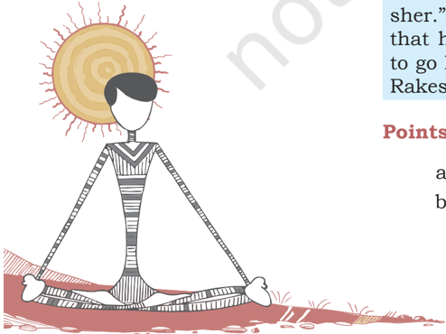
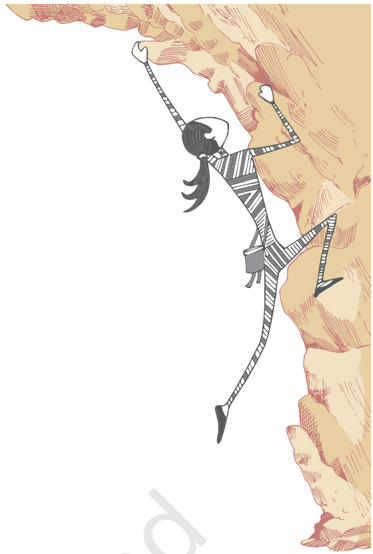
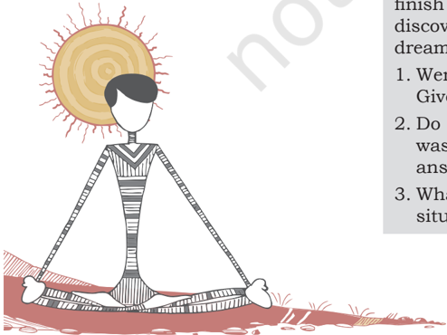
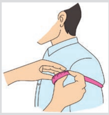

# PAGE 1

You have learnt in previous classes that growth is a natural phenomenon. 'Growth' is a characteristic of all living beings. The  period  of  growth  and  development  from  childhood  to adulthood is a period full of joy and challenges is known as 'adolescence'. This chapter deals with key aspects and issues related to the period of adolescence.

## GrowinG up durinG Adolescence

Life cycle begins at birth. It is generally divided into seven functional stages of development of life as shown in Table 1.

Table 1: Biological changes in human life cycle-names, duration and characteristics

| Biological stages of human life   | Duration              | Characteristics of growth and development                                                  |
|-----------------------------------|-----------------------|--------------------------------------------------------------------------------------------|
| Prenatal                          | 280 days of pregnancy | Development of foetus in mother's womb till delivery of fully formed fetus.                |
| Neonatal                          | Birth to 28 days      | Rapidgrowthanddevelopment such as smiling, recognising mother, etc.                        |
| Infancy                           | 28 days to 1 year     | Speedy growth in size and height, beginning of milk tooth, trying to stand and take steps. |
| Childhood                         | 1 to 10 years         | Rapid to moderate growth depending on nutrition. Permanent molar teeth eruption.           |

# PAGE 2

24

| Adolescence   | 10 to 19 years     | Rapid physical, mental, emotional and social changes.       |
|---------------|--------------------|-------------------------------------------------------------|
| Adulthood     | 20 years onwards   | Maturation, reproductive period of life.                    |
| Old age       | 60 years and above | Slow weakening of body functions, organs and organ systems. |

Note: Adolescence  is  a  crucial  period  in  the  life  cycle  of human beings.

## understAndinG Adolescence

The period of adolescence begins with the onset of puberty, during  which  certain  hormones  gets  activated.  It  is  an increase in secretion of sex hormones (testosterone in males, estrogen and progesterone in females). Puberty merges into adolescence  at  around  10  years  of  age,  and  adolescence generally  lasts  till  19  years  of  age.  You  may  recall  the discussion on adolescence in the chapters of your Class VIII textbook of science and the Class IX textbook of Health and Physical Education.

During this phase, significant physical and psychological changes take place. However, as you have already learnt in your  previous  classes,  the  timing  of  these  changes  varies with every individual.

## Unique features of adolescence

The two unique features of adolescence are -

- (i)  The  spurt  in  physical  growth,  when  a  physical appearance of an individual gradually becomes different.  This  is  due  to  the  rapid  acceleration  in growth  of  skeletal  tissue  (bones  and  cartilage)  and muscular and glandular tissue. For examples, breasts begin to develop in girls due to the release of estrogen hormone.  Changes  in  voice  are  quite  noticeable among boys.
- (ii)  It is a time period between the onset of puberty and adulthood.

## Growth spurt in adolescents

As you would have experienced yourself, the changes during adolescence occur speedily and alter the body size and shape of adolescents. Suddenly the child seems to have grown up into a young adult. This is called growth spurt and is shown through the following flow chart.

# PAGE 3

## chAnGes in Body size And structure

Under  the  influence  of  growth  hormone,  the  body  size increases. Sex hormones stimulate growth and maturity of gonads (reproductive organs).  In  males,  testes  grow  in  size  and start producing sperms. In females, the eggs or ova present in the ovary since birth begins to mature.  Sex organs also increase in size. Thus, there is an overall growth in body size. As sexual maturity progresses during adolescence, hormones act  on  growth  centers  of  bones  which  are  responsible  for increase in length of bones. The long bones, the vertebrae and limbs grow and the adolescent gains height. The limbs become stronger. The heart, lungs and other internal organs also  grow  to  match  the  increase  in  body  size.  The  muscle mass undergoes a spurt at adolescence. Eventually, growth rate slows down and then stops. Generally, at the age of 14 to 18 years of age, adult height is already reached. The peak of growth of muscle mass is also typically around the age of 14 to 16 years. In the females, the pelvis region undergoes a growth spurt and becomes wider.

## secondAry sexuAl chArActeristics

In earlier classes, you have learnt about secondary sexual characteristics. As a result of physical changes, secondary sexual  characteristics  begin  to  develop  in  both  girls  and boys.  Some characteristics are related to girls; some to boys and some are common for both. You may understand this development better by conducting Activity 3.1.

## Activity 3.1

Identify the secondary sexual characteristics of adolescence during 10 to 19 years in the given table. Fill the following table by putting a tick mark (  ) at appropriate place in each column.

# PAGE 4

26

| Changes                               | Girls (1)   | Boys (2)   | Both (3)   | Don't know (4)   |
|---------------------------------------|-------------|------------|------------|------------------|
| 1. Increase in height and weight      |             |            |            |                  |
| 2. Menstruation                       |             |            |            |                  |
| 3. Change in voice                    |             |            |            |                  |
| 4. Growth of hair on private parts    |             |            |            |                  |
| 5. Widening of shoulders              |             |            |            |                  |
| 6. Broadening of hips                 |             |            |            |                  |
| 7. Development of breasts             |             |            |            |                  |
| 8. Sweat and oil glands become active |             |            |            |                  |

## wet dreAms

Wet dreams are a normal and natural physiological process which  starts  during  adolescence  among  boys.  It  usually occurs  during  sleep.  Wet  dreams  is  a  discharge  of  semen (seminal fluid) containing sperms. Many adolescent boys are usually not aware of this phenomenon and get worried when they face this situation first time.

Semen is the fluid formed by glands associated with male reproductive system. Semen carries mature sperms formed in the testes.

Read  the  following  case  studies  which  confirm  the uniqueness  of  every  individual  with  regard  to  time  of occurrence of changes during adolescence.

## CASE 1: My father calls me 'Sher'

Rakesh and Dibang, students of Class IX, are walking home together from school. Rakesh begins to tease Dibang, saying that he speaks in a girl's voice. He also laughs at the fact that Dibang has got no hair on his upper lip. 'Look at me,' Rakesh says, 'I am a real man. My voice is strong and my face is manly - I have so much facial hair. My father calls me sher.' Dibang wonders what is wrong with him. He recalls that his mother still calls him 'my sweet boy'. He decides to go home and ask his mother why he is so different from Rakesh and whether something is wrong with him.

## Points for Discussion

- a)  What do you think Dibang felt with Rakesh's remarks?
- b) Do  you  think  that  there  is  something  wrong  with Dibang? Why?

# PAGE 5

- c)  What should Dibang's mother tell him?
- d) Do  you  think  it  is  important  to  prepare  children regarding the  changes likely to occur in them? Why?

## CASE 2: Each one is unique

Pooja, Sujatha, Abida and Radha are good friends. All of them  are  13  years  old  and  love  to  spend  time  with  one another. They have so much to talk about, a new film, a new dress, home work, the boys in the class and just about everything.

Yesterday,  Radha  seemed  uncomfortable.  She  was having her periods and was concerned about staining her uniform. Last month, Sujatha's family had organised a big celebration in her honour as she had started her periods. Pooja recalled that three months ago, Abida had started her periods in school and had to borrow a sanitary napkin from her older cousin. Except Pooja, all her friends have started their periods. Is there something wrong with her?

## Points for Discussion

- a)  What do you think Pooja felt when she realised that she is the only one who had not started her periods?
- b) Do you think there is something wrong with Pooja?
- c)  If Pooja came to you for advice, what would you tell her as a peer?
- d) Do  you  think  it  is  important  to  prepare  children regarding the changes likely to occur in them? Why?

## CASE 3: Puberty in boys

Suresh  heard  from  someone  that  wet  dream  (nocturnal emission) causes weakness. When Naresh who is Suresh's best  friend  first  experienced  wet  dream,  he  confided  in Suresh.  Suresh  encouraged  Naresh  to  visit  the  nearest Health Centre to have a discussion about wet dream with the doctor.

## Points for Discussion

- a)  Do you think something is wrong with Naresh?
- b) According  to  you,  the  advice  given  by  Suresh  is correct or not?
- c)  What are the myths associated with wet dream?
- d) What advice was given by the doctor to Naresh?
- Adolescence  is  a  period  of  physical  and  emotional changes  which  are  triggered  by  a  set  of  hormones. These changes are part of growing up.
- These  changes  occur  at  different  times  for  different individuals.

# PAGE 6

28

- You should not compare your physical changes with others - the pace at which changes take place differ from person to person.
- It is natural to feel awkward or conscious of the changes that occur but try to support each other by accepting these as part of a natural process and don't let these decrease your self-confidence.
- If you have any doubts or concerns about changes that are  occurring  to  you  reach  out  to  a  trusted  adult  or you can talk to a counsellor in the adolescent friendly Health Clinic near where you live.
- Many young boys due to feeling of shame visit quacks and waste lot of time and money. It is best to visit the doctor or the health centre. One can discuss the myths related to growing up with a trusted person (teacher, parents, friends).
- There is a myth that wet dream causes weakness among the males because semen is lost from the body. However it is not so, semen and sperms are continuously made in  the  testes  and  semen  lost  during  wet  dream  gets replaced very soon.

## menstruAtion

The first menstruation is termed as menarche. In India, age of menarche is 12-13 years but may vary from individual to individual. Menstruation generally stops between the age of 45 and 55 years and is termed as menopause. Menopausal age varies in different individuals. Age of menarche has decreased due to various lifestyle changes. Menstruation hygiene and cleanliness is very important. Points to remember -

- Regular bath and washing self properly are important for avoiding infections, especially during menstruation.
- Change undergarment regularly (at least once a day) and avoid synthetic cloth.
- During menstruation, cloth, cloth pads or napkins should be changed after every four to six hours to avoid infection.
- One can also use sanitary napkins to manage menstrual hygiene. Many girls and women also make sanitary napkins at home with old cloth and cotton. If one makes a sanitary napkin at home, use only clean, soft cotton cloth. Do not use old cloth that may have any metal or plastic parts in it like glitter, gota or hooks and buttons. This may hurt or cause infection.
- If  a  cloth  is  used  again  as  pad,  it  should  be  washed thoroughly with soap and dried in sun before next use as sunlight is an excellent disinfectant. Do not use dirty or damp cloth as it causes infections.

# PAGE 7

- Child With Special Need (CWSN) should be shown the process of maintaining hygiene or explained in detail if necessary.
- Sanitary pads should be wrapped in paper and disposed in trash bins or buried deep in a pit. Some schools have Incinerators  which  offer  another  safe  way  to  dispose sanitary pads. There should be no shame attached in the process of disposing sanitary pads.

Government  is  supporting schemes  for promoting  menstrual hygiene among adolescent girls (10-19 years). Sanitary napkins  are  made  available  in  schools  or  by  ASHAs  at  a subsidised rate.

## psychosociAl chAnGes durinG Adolescence

Psychosocial  changes  mean  changes  in  thoughts,  mood, attractions and friendships. The word 'social' is associated with the word 'society'. As adolescence sets in, a boy or girl becomes psychologically aware of self and society. As a result, the adolescents build their own image and personality. This gives confidence to the adolescent to move in the society.

Adolescence is a transitional phase between childhood and adulthood.  During  this  transitional  period  the  adolescents get  confused  regarding  their  emerging  role  in  the  family and  society  at  large.  The  physical  changes  in  adolescents are  accompanied by psychosocial changes. Adolescents get attracted  towards  opposite  sex  or  become  part  of  a  peer group. Such changes tend to make them more dependent on the peer group in neighborhood, among classmates, etc. This often  creates  stressful  relationships  with  parents,  teachers and elders. Sometimes these developments may make them insecure  about  future.  Adolescents  who  become  aware  of these changes, overcome this phase comfortably.

The  social  changes  are  reflected  in  the  behavior  of adolescents with peers and parents. They differ from parents on  many  issues  and  develop  the  confidence  to  express their  own  opinion  emphatically  if  parents  are  friendly  and understanding.    Adolescents  are  more  friendly  with  their peer  group.  However  belonging  to  a  vulnerable  age  group, adolescents  may  feel  pressurised  under  the  influence  of peers.    Everyone  feels  the  need  to  have  friends  but  during adolescence  the  need  for  friendship  is  more  pronounced. The friendship may be with a peer or relative of one's own age and someone of own sex or the other sex. It is, therefore, important  for  them  to  identify  with  whom  they  can  share their  ideas  and  identify  'safety  net'  in  friends,  parents  and teachers.

29

Some psychological changes that occur in an adolescent are mentioned here.  Write  one  or  two sentences regarding them from your own experience. You may quote incidents involving  others  of  your age.

- Developing  a  sense  of identity.
- Distancing from parents.
- Closeness with peers.
- Curiosity for gaining knowledge.
- Experimentation

# PAGE 8

30

## Adolescent or teenAGe preGnAncy

An  adolescent  is  capable  of  reproduction.  However,  the reproductive maturity is reached only when a teenager is fully developed physically and physiologically. In India, because of early marriage, there are large number of adolescents or teenage  pregnancies.  If  pregnancy  occurs  before  reaching complete  reproductive  maturity,  girls  may  risk  their  own health and that of the fetus (developing embryo).

Risks  involved  in  adolescent  pregnancy  are  mentioned below -

- An  adolescent  mother  is  not  mentally  prepared  for motherhood.
- An adolescent mother is likely to be anemic.
- An adolescent mother is more prone towards maternal death while giving birth.
- Infant death are more among teenage mothers.
- There is likelihood of developing complications during giving birth.
- The baby born from teenage mother requires greater care which the teenage mother may not be able to give.
- The reproductive tract may be damaged during childbirth.
- Early pregnancy and motherhood delays development of education and career of adolescent mother.
- There may be economic problems and also problems due  to  psychological  immaturity  of  the  adolescent mother. This may hamper proper care of the infant.

Activity 3.3

Read the case study given below. Think and answer the questions that follow.

Rahul's  grandmother  and  Sangeeta's  grandmother  were  great friends. When Rahul grew up, his grandmother would often ask him to drop Sangeeta at her home. As a result Rahul and Sangeeta developed a liking for each other. When Sangeeta turned sixteen, the grandmothers insisted that Rahul and Sangeeta be married off as they were developing a relationship and that people would talk  about  it.  Rahul  was  in  college  and  Sangeeta  had  yet  to finish school when they got married. After six months Sangeeta discovered that she was pregnant. Sangeeta was sad as she had dreams of pursuing higher studies and a career.

1. Were Rahul and Sangeeta right in agreeing to get married? Give reasons for your answer.
2. Do you think the adverse consequence of teenage marriage was greater on Sangeeta than on Rahul? Give reasons for your answer.
3. What would you have done, if you were in Rahul or Sangeeta's situation?

# PAGE 9

## VitAl stAtistics And Functions oF the Body

As you grow in years, you grow in size with increased length and circumference of body parts till you are a full-fledged adult  of  age  19.  While  you  must  maintain  hygiene  of  all external  parts,  the  internal  organs  also  have  to  function normally. You know that certain vital functions of the body for enjoying good health are maintenance of blood pressure, pulse  rate,  respiratory  rate,  etc.  Some  ways  of  assessing the  vital  functions  and  statistics  of  human  beings  are given below.

## Blood pressure (BP) and its measurement

Pressure exerted by  blood  on  the wall of the arteries is called blood pressure. When the heart contracts, blood surges through aorta, BP is highest (Systolic Pressure) pressure

Fig. 3.1: Checking blood pressure

of blood on the arterial wall recorded when ventricles relax is lowest (Diastolic Pressure).

Fig. 3.3: Sphygmomanometer

The pressure wave along the arteries with each heartbeat can be felt at the pulse. Blood pressure is measured by the instrument called 'Sphygmomanometer'. Diastolic and Systolic pressure is measured and in a normal healthy young adult it is 110/75, which means 110 mm  Hg  systolic  and 75  mm  Hg  diastolic. Sphygmomanometer consists  of  cuff  with an inflatable bladder which is wrapped around a person's upper arm and a rubber bulb inflates the bladder. An attached device indicates the blood pressure. There is now a digital device  which  is  also  used  for  measuring  the  BP.  BP  increases with age to about 130/90mm Hg. Abnormally high BP is called hypertension.

Biceps  is the muscle  of mid arm.

Place  the  beginning  of  the tapes  in  the  middle  of  the biceps (midway between shoulder  and  elbow  joint) take the reading and record it. When you do this  in  a  group,  record  the circumference of all the students  of  the  group  and observe the variation.

Fig. 3.2: Measuring mid-arm circumference

31

# PAGE 10

32

## Activity 3.5

## Measuring height

- Take  your  own  height at intervals as you grow.  You  have  learnt that your height at age  19  is  almost  the maximum  height  that you shall attain. Do this  with  your  friends and try to figure out the reasons  for  variations. You need only an inch tape for this.
- Go  to  a  clinic  or  any medical practitioner and  see the  working of the Sphygmomanometer.  Collect  data from persons where BP is checked. Analyse the  variations  and  the reasons.

## Activity 3.6

At the exit gate of Nehru Place Metro Station in New Delhi, there is a provision  for  measuring height and weight and also  to  calculate  BMI  for 10 rupees. Find out where else measurement of BMI is available. Do you have this in your school?

- My Height =
- My Weight =
- My BMI=

Normal, Overweight, obese. Tick whichever is relevant

## Calculate your Body Mass Index (BMI)

BMI  can  be  calculated  by  adopting  the  following  formula. Divide your weight by square of your height.

$$B M = \frac { \text {weight} \left ( k g \right ) } { \text {height} \left ( m \right ) ^ { 2 } }$$

- If you measured your weight in kg then measure height in meters.
- Normal BMI Range = 18 to 25.
- Overweight = more than 25 and less then 29.
- Obese = more than 30.

## Examination of conjunction

The conjunction  is  a  transparent  membrane  over  the  eye. A smooth shiny moist conjunction is normal. If red or thick or covered by a secretion or foreign body, it requires immediate medical attention or consultation of a eye doctor.

## Tongue examination

Nutritional deficiencies, infections, dysfunction of nerves or even cancer can be detected by examining the tongue.

Some  key  characteristic  features  of  a  tongue  in  normal condition can be noted by physical examination. These are -

- (i)  Colour: Pink red on both upper and lower surface. On lower surface blood vessels may be seen.
- (ii)  Texture: Rough on upper surface due to presence of papillae  or  taste  buds.  Hair,  farrows  or  ulceration indicates dysfunction.
- (iii)  Size: If not swollen, tongue will fit comfortably inside the  mouth.  The  tongue  can  be  examined  by  the following steps -
-  Make tip of tongue touch roof of mouth to inspect ventral surface.
-  When protruded out, colour and texture can be noted for any deviation.
-  Use  gauze  to  hold  protruded  tongue  (wearing gloves) between tongue and index figure and fill the fender areas.

## Examining nail bed

Nail bed also needs direct physical examination. Nail plate surface  discolouration,  abnormal  cuticle,  nail  fold  or  nail shape require inspection. Loss of nails and lesions around nails, need medical attention.

# PAGE 11

## Pharmacology and its impact on the body

Pharmacology deals with biological effects of drugs. Drugs are chemical substances used for healing, curing diseases, slowing them or preventing diseases.

## Effects

Therapeutic desired actions for cure are -

- Stimulating or inhibited cell function
- Blocking biochemical of tissues
- Anti histamicric  (anti allergic)
- Laxative (reasoning constipation)

## Unwanted effects

Side effects are -

- Dry mouth or dangerous effects on tissues
- Damage  or  toxicity  or  excessive  bleeding    are  some effects of drugs used as medicine

## Prevention

Never buy medicines over the counter (OTC) without Doctor's prescription with dosage and instruction written.

- Unusual responses are reasons for harmful effects of drugs
- Medication error or overdose

# PAGE 12

34

## Assessment

## I.  Fill in the Blanks

1.  Childhood is \_\_\_\_\_\_\_\_\_\_\_\_\_\_\_\_\_\_\_\_\_\_\_\_\_\_\_\_.

2.  Adolescence is \_\_\_\_\_\_\_\_\_\_\_\_\_\_\_\_\_\_\_\_\_\_\_\_\_\_.

3.  Five changes occuring in boys and girls during adolescence are \_\_\_\_\_\_\_\_\_\_\_\_, \_\_\_\_\_\_\_\_\_\_\_, \_\_\_\_\_\_\_\_\_\_\_\_\_\_, \_\_\_\_\_\_\_\_\_\_\_\_\_ and \_\_\_\_\_\_\_\_\_\_\_\_.

## II.  Choose the Correct Option

1.  Proper hygiene should be practised during adolescence.

(Yes/No/Don't know)

2.  Wet dream is a normal phenomenon. (Yes/No/Don't know)
3.  Government  is  supporting  schemes  for  promoting  menstrual hygiene among adolescent girls. (Yes/No/Don't know)
4.  The adolescents begin to be extremely conscious of their physical appearance  once  secondary  sexual  characteristics  begin  to develop. (Yes/No/Don't know)
5.  The adolescents begin to develop a strong sense of identity due to increased mental development. (Yes/No/Don't know)
6.  Early pregnancy may end in damaged reproductive tract in girls. (Yes/No/Don't know)
7.  Physical growth spurt during adolescence is embarrassing. (Yes/No/Don't know)
8.  Change of voice in boys is a sign of adolescence. (Yes/No/Don't know)

## III. Answer the following Questions

1.  What are the health and educational implications of adolescent pregnancy?
2.  Write down the process of the -
3. (i)  mid-arm circumference.
4. (ii)  measurement of height.
5. (iii)  body mass index.
6. (iv)  tongue examination.
7. (v)  examination the nail beds.
3.  Write a short note on pharmacology.