# PAGE 1

You might have participated in different games and sports.  There  are  two  broad  categories  of  competitions which  are  played  as  individual  games  and  team  games. Team  games  are  represented  by  more  than  two  players. The example of team games are Football, Cricket, Hockey, Basketball,  Volleyball,  etc.  Individual  games  are  played with different events like, singles events, doubles or mixed events.

There are  many  individual  sports,  for  example,  Badminton, Table Tennis, Tennis, Swimming, Judo, Wrestling, etc. Track and field is also an individual sport which we will discuss in this chapter. We shall discuss various aspects of track and field, such as, history, rules and regulations, classification of track and field events.

## Track and Field

Track and field events are comprised with running events and  field  events.  All  running  events  are  held  in  the  track and  categorised  as  short  distance,  middle  distance  and long distance running, race walk, hurdles and steeplechase events.

Field  events  are  categorised  as,  throwing  and  jumping events. There are 'combined events' which includes decathlon for  men  and  heptathlon  for  women.  Decathlon  which  is organised  for  men  includes  10  events  and  Heptathlon  for women includes 7 events. The events are described below with the help of Table 4.1.

## Activity 4.1

- Enlist the events of Decathlon for men.
- List  out  the  events  of Heptathlon for women.

# PAGE 2

Table 4.1: Track and Field Events

| Track (Running Events)                                                                                                                                                                                  | Field Events                                                                                         | Field Events                                                                                                                                                                                                                                                                                          |
|---------------------------------------------------------------------------------------------------------------------------------------------------------------------------------------------------------|------------------------------------------------------------------------------------------------------|-------------------------------------------------------------------------------------------------------------------------------------------------------------------------------------------------------------------------------------------------------------------------------------------------------|
|                                                                                                                                                                                                         | Throwing                                                                                             | Jumping                                                                                                                                                                                                                                                                                               |
| (a) Short Distance Running Events 100 meter, 200 meter, 400 meter, 110 meter, Hurdles (men) 100 meter Hurdles for women 400 meter Hurdles                                                               | • Javelin Throw • Discus Throw • Shot Put • Hammer Throw                                             | • High Jump • Long Jump • Triple Jump (Hop-step-jump) • Pole Vault                                                                                                                                                                                                                                    |
| (b) Middle Distance Running Events 800 meter, 1500 meter (c) Long Distance Running Events 5000 meter, 10,000 meter 3000 meter Steeple Chase (m), 20 km walking, 50 km walking and Marathon (42.195 km). | Relay Events (a) 4 × 100 mtr (men & women) (b) 4 × 400 mtr (men & women) (c) 4 × 400 mtr (mix relay) | Combined Events (a) Decathlon (Men) (consist 10 events) 100 m, Shot put, High Jump, Long Jump, 400 m. 110 m. Hurdle, Discuss Throw, Pole Vault, Javelin Throw, and 1500 m. (b) Heptathlon (Women) (consist 10 events) 100 m. Hurdle, High Jump, Shot Put, 200 m. Long Jump, Javelin Throw, and 800 m. |

## Activity 4.2

- Find out why Marathon is 42.195 km?
- Collect information about different Marathon and their distance.

36

## History

Track and field events are among the oldest of all sporting competitions.  Running,  jumping  and  throwing  have  been universal forms of human physical activities since the human beings exist. The first recorded example of organised track and  field  events  is  found  in  the  Ancient  Olympic  Games held in 776 BC. The starting of the modern Olympic Games at  Greece  in  1896  was  marked  as  new  era  for  track  and field  events  which  was  initiated  by  Pierre-de-Coubertin. Until the early 1920s, only males were participating in the track and field  events.  Introduction  of  five  track  and  field  events for women in the athletics was started during 1928 Summer Olympics. Gradually more women's events were introduced as time progressed. However, it was only towards the second half of the twentieth century that the men's and women's track and field events were given equal status. Furthermore, major track and field  events  for  disabled  athletes  were  first  introduced at the 1960 Summer Para Olympics. From 1990's onwards, track and field events became increasingly more professional.

# PAGE 3

The World Athletics Federations (WAF) was formed and 200 nations became its member. Olympic Games are organised after every four years.

Fig. 4.1: 1896 Olympic Panathnaic Stadium track

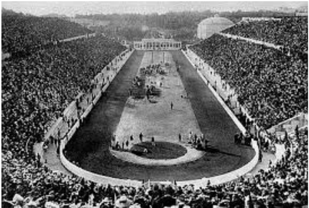

## Track evenTs

Track  events  are  running  events  on  a  track  for  specified distances.

- Find out the colours of Olympic rings.
- What does it symbolise?
- Discuss for whom Para Olympic meant for and how many events?

These include (i) Sprints (100m, 200m, 400m), (ii) Middle Distance (800m, 1500m), (iii) Long Distance (3000m, 3000m, Steeplechase, 5000m, 10,000m), (iv) Relays (4×100m, 4×400m), and (v) Hurdles (110/100m, 400m).

## Do You Know?

The IAAF World Championships in Athletics became a fully professional competition from 1997.

Finish line for all events

Fig. 4.2: Starting position of various events in 400 meter track

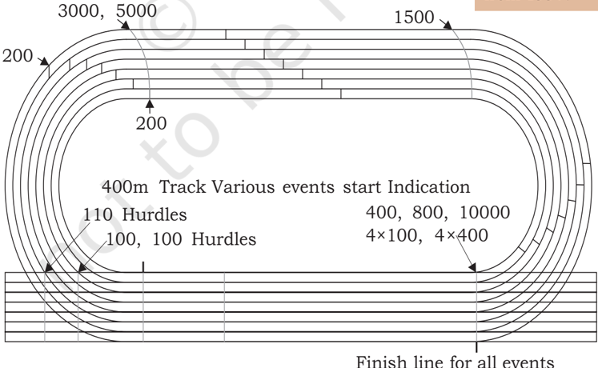

37

# PAGE 4

38

## Sprints

Sprinting  is  the  name  given  to  short  distance  running  in which the runner tries to maintain maximum speed for the whole  race.  These  include  track  events  covering  distances

Fig. 4.3: Sprint running

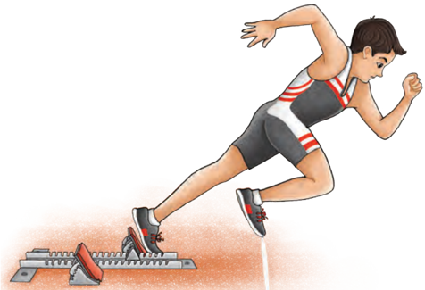

## Activity 4.4

Tell the name of different starts in sprint events.

of  100  meters,  200  meters,  400  meters, 4×100 meters relay, 4×400 meters relay,  and  hurdle  races  of  100  meters for women, 110 meters for men and 400 meters for both men and women. At the professional level, sprinters begin the race by assuming a crouching position on the starting blocks. Then they lean their body forward and gradually move into an upright  position  as  the  race  progresses and momentum is gained. Athlete remain in  the  same  lane  on  the  running  track throughout  the  sprinting  distance.  The man or woman who runs fastest and takes minimum time over 100m, wins the race.

The winner is often named 'the fastest man/woman in the competition'. Some sprint events start in lanes, to cover the same distance for each runner.

## Middle distance

Fig. 4.4: Middle distance running

The  middle  distance  races  are  of  800  meters  and  1500 meters. Runners start the race from a standing start position in the lanes along a curved starting line or in staggered lanes. However the distance is same for each runner. After hearing the starter's pistol, they head forward in the designated lane or move towards the innermost track to follow the shortest route to the finish. Athletes rely more on speed endurance and

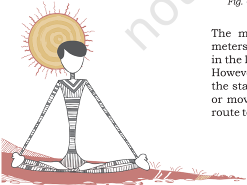

# PAGE 5

pacing than just pure speed. Middle-distance races require different  skills  and  tactics  to  win  the  sprints  competition. These  races  require  that  the  athletes  maintain  a  plateau pace,  (i.e.  the  maintenance  of  speed  at  which  the  runner is  running) that allows for a final spurt of speed, whereas sprint races need to be run at top speed for the entire length of the race.

## Long distance

There are four common long distance running events in track and field. These are 3000 meters, 5000 meters and 10,000 meters and 3000 meters steeplechase. Long distance track races have much in common with middle distance races. However, in these races,  pacing,  endurance, and race tactics play an important role in performance. In these events, runners need to balance their energy to win the race.

Fig. 4.5: Long distance running

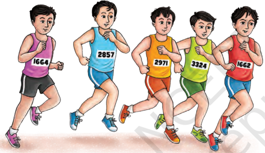

## Relays

Relay  races  are  the  only  track  events  in  which  a  team  of runners directly compete against other teams. Common relay races are the 4×100 meter and the 4×400 meter. The exchange of  baton  takes  place  within  a  specified area  of  the  track  called  baton  exchange zone.  Teams  may  be  disqualified  if  the team fails to complete the baton exchange within an area of 20 meters, the team is considered  as  disqualified.  A  team  may also  be  disqualified  if  its  runners  have deliberately  created  hurdle  for  the  other competitors.  The  4×100  meter  event  is run strictly within the same lane on the track. It means that the team collectively runs  one  complete  circuit  of  the  track. Teams in a 4×400 meter event remain in

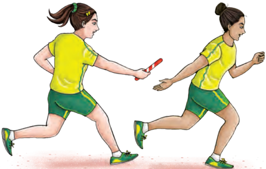

Fig. 4.6: Relay race

## Activity 4.5

What are important points in  relays?  Practice  relay baton exchange technique amongst your friends.

# PAGE 6

## Activity 4.6

There are 28 hurdle jumps and 7 water jumps in 3000 meters steeplechase event.

their own lane until the runner of the second leg passes the first bend, at which point runners can leave their lanes and head  towards  the  inner-most  part  of  the  circuit.  For  the second and third baton change-overs, team mates must align themselves  in  respect  of  their  team  position.  The  leading team takes the inner lanes while team mates of the slower teams must await the baton on outer lanes.

## Hurdles

Fig. 4.7: Hurdles race

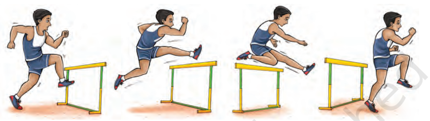

Fig. 4.8: Dimensions of hurdle

In  this  race,  hurdles  are  placed  at  fixed  intervals  along  the track.  The  runners  have  to  run  over  them  on  their  way  to finish the line. Typical hurdle races are the 100m and 400m for women and 110m and 400m for men. Timing, footwork, and techniques are key in winning the hurdle events. Athlete needs

# PAGE 7

to run fast. The key factor to win in the hurdles race is to cross the hurdles without slowing down.

## Dimensions: Standard heights of the hurdles

| Distance    | Men     | Under 20 Men   | Under 18 Boys   | Under 20 Women   | Under 18 Girls   |
|-------------|---------|----------------|-----------------|------------------|------------------|
| 110 m/100 m | 1.067 m | 0.991 m        | 0.914 m         | 0.838 m          | 0.762 m          |
| 400 m       | 0.914 m | 0.914 m        | 0.838 m         | 0.762 m          | 0.762 m          |

## Men under 20 and boys under 18

| Distance of Race   | Distance from start line to first hurdle   | Distance between hurdles   | Distance from last hurdle to finish line   |
|--------------------|--------------------------------------------|----------------------------|--------------------------------------------|
| 110 m              | 13.72 m                                    | 9.14 m                     | 14.02 m                                    |
| 400 m              | 45.00 m                                    | 35.00 m                    | 40.00 m                                    |

Women under 20 and girls under 18

| Distance of Race   | Distance from start line to first hurdle   | Distance between hurdles   | Distance from last hurdle to finish line   |
|--------------------|--------------------------------------------|----------------------------|--------------------------------------------|
| 100 m              | 13.00 m                                    | 8.50 m                     | 10.50 m                                    |
| 400 m              | 45.00 m                                    | 35.00 m                    | 40.00 m                                    |

## Rules of track events

The rules of track events, as observed in most international athletics competitions, are formulated by the International Association  of  Athletics  Federation  (IAAF).  Key  rules  of track events relate to three phases - starting, running and finishing.

## Starting

- The start of a race is marked 5  cm  wide  by  a white  line.  In  all races, that are not run  in  lanes,  the start line must be curved, so that all the athletes run the same distance upto the finish.
- Starting blocks shall be used for all races up to and including 400 meter (including the first lap of the 4x100 and 4x400) and shall not be used for any other race. No part of the starting block overlaps the start line or extend into another lane.

Fig. 4.9: Starting position for a sprint race

Activity 4.7

The details  stated  above  aim at  making  us  understand about  the  different  types of running. Identify the different distances in each of the following -

| Sprints         | (1) (2)   |
|-----------------|-----------|
| Middle Distance | (1) (2)   |
| Long Distance   | (1) (2)   |
| Hurdles         | (1)       |

41

# PAGE 8

42

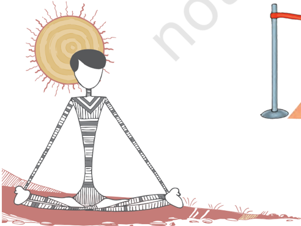

- In  most  international  competitions,  the  command  of the starter is 'on your marks' and 'set' for crouch start and 'on your mark' for standing start.
- Any sprinter with a false start is considered disqualified.
- Athletes are not permitted to run inside the inner curve of the track. They have to run in their designated lanes only.

## Running

- In all races that are run in lanes, athletes have keep themselves  their  allocated  lanes  from  start  to  finish. This also applies to any portion of a race run in lanes.
- If  an  athlete  leaves  the  track  or  steps  on  the  line demarking the track, this will be considered disqualified.
- An athlete, after voluntarily leaving the track shall not be allowed to continue in race.
- Any athlete found intentionally obstructing the path of another runner is also disqualified from the race.
- There are races that start in lanes and then at a 'break line', the competitors merge. Examples of this are the 800 meters and 4x400 relay race.

## Finishing

- The finish of a race is marked by a white line 5 cm wide. Competitors are placed in the order in which any part of  their  torso  (as  distinguished  from  the  head,  neck, arms, legs, hands or feet) reaches the vertical plane of the nearer edge of the finish line.
- The  measurement  of  time  shall  be  taken  from  the flash or the smoke of the gun to the finishing touch, which shall be recorded in 1/100th of a second if taken manually. Fully automatic timing (FAT) is required for high level meets.

Fig. 4.10: Finishing position for a sprint race

# PAGE 9

## Field evenTs

Field events constitute of events that are participated by men and women outside the track. These include jumping events (Long Jump, Triple Jump, High Jump and Pole Vault) and throwing events (Shot Put, Discus Throw, Javelin Throw and Hammer Throw).

## Jumping events

The jumping events comprise Long Jump, Triple Jump, High Jump and Pole Vault.

1. Long jump: The long jump is one of the oldest field events.  The  take-off  has  to  be  made  from  a  20  cm wide  board  one  meter  away  from  a  pit.    Athletes sprint along a length of track to a take off board and a sandpit. If any part of the runner's foot goes past the takeoff board, the jumper is considered for a foul and does not receive score for that round. Distance is measured from the end of the takeoff board to the nearest mark made by the jumper on the pit.  Best eight  competitors  have  a  maximum  of  six  rounds. Professional long jumpers typically have strong acceleration and sprinting abilities. However, athletes must also have a consistent stride to allow them to take off near the board while still maintaining their maximum speed.
2. Triple jump: Similar to the long jump, the triple jump takes  place  on  a  field  heading  towards  a  sandpit. This  event  is  termed  as  the  'hop-step  and  jump.' The event begins like a long jump, with competitor dashing down the runway and leaping from a takeoff board they first hop then take a step and then jump into  the  pit.  The  event  is  scored  identically  to  the long jump.

Fig. 4.11: Long jump

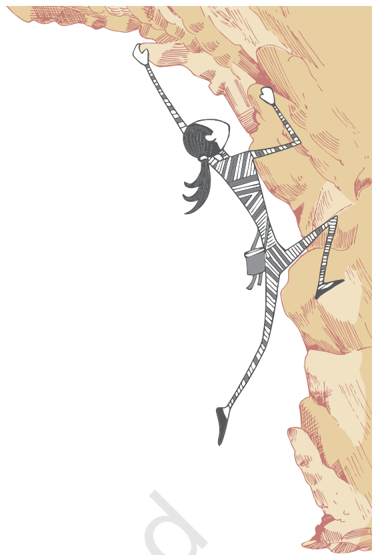

# PAGE 10

Hop phase

## Activity 4.8

Practice and measure separately hop step and jump

## Activity 4.9

In case of tie in high jump practice how to break it.

Step phase

Fig. 4.12: Triple jump

3. High jump: In high jump event, competitors combined speed,  to  generate  lift,  with  jumping  technique. Jumpers  may  approach  the  bar  from  either-side, and  land  on  a  large,  generally  inflated  cushion.  In between, they must  clear the 4-meter-long bar without  knocking  it  off  its  supports.  The  bar  will originally be set at a low height, at which competitors may choose to jump, or pass to another height. The bar  is  raised  to  a  predetermined  height  after  each round. Each competitor who either clears or passes a  height  advances  to  the  next  round.    They  are ranked according to the height they clear. An athlete is allowed a maximum of three trials of each height. Competitors are eliminated after missing (failing) three consecutive  jumps  in  a  particular  height.  Athletes have a short run up and then take off from near one foot to jump over a horizontal bar and fall back onto a  cushioned  landing  area.  Jumping  technique  has played a significant part in the history of the event. The modern technique of high jump as shown in the figure is known as 'Fosbury Flop'.
4. Pole vault: Each vaulter sprints down the runway with a fiberglass or carbon fiber pole and plants the pole into the vaulting box. This box is specifically made of

Fig. 4.13: High jump

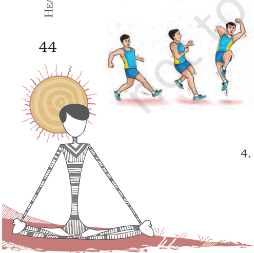

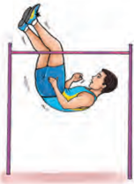

Jump phase

# PAGE 11

fiberglass or carbon fiber.  The atheletes then push themselves over the crossbar and land onto the mattress.

Fig. 4.14: Pole vault

The rules require that athletes do not move their hands along the pole.  As per technique, they begin clearing the bar with their feet first in a position so that the stomach faces the bar. As with high jumping, vaulters may touch the bar, as long as it doesn't fall. Round-by-round scoring rules are the same as for the high jump.

## Throwing events

There  are  four  major  throwing  events:  Shot  Put  (putting the  shot),  Discus,  Javelin  and  Hammer  Throw.  These  are detailed below.

Fig. 4.15: Shot Put

1. Shot Put: In putting the shot event the athletes put a metal ball through the air for maximum distance. For male athletes, the metal ball weights 7.26 kg and for female athletes the weight is 4 kg. The athlete must stay in a circle of 2.135 m (7 ft) diameter until the shot has landed after throw. The put must be made from the shoulder with one arm only, and the shot must not be brought behind the shoulder. In shot put the athlete holds the shot close to their neck in one hand. Then they move in straight line or spin around for gaining

# PAGE 12

## Activity 4.10

What  is the weight of discuss for men and women?

## Activity 4.11

- What  are  the  lengths of Javelin for men and women?
- What  are  the  weights of Javelin for men and women?
- momentum and finally putting the shot in a pushing manner in the direction of the purified landing area.
2. Discus: In the discus event the athlete stands inside a throwing circle of 2.5 mt (8'-2½') diameter. As per technique he/she turns around one and a half times and throws the disc as far as he or she can.  The disc is a round plate made of wood and metal and weighs 2 Kg for men and 1 Kg for women.  When throwing the discus, the athlete must remain in circle. The feet of the athlete cannot leave this area before the discus lands.    Even  afterwards  the  athlete  must  leave  the circle from rear half of the circle.  Otherwise it is a fault and the throw will not be counted. The athlete will spin around to gain momentum, speed and then releases the disc in the proper direction. The athlete that throws it furthest from the front part of the circle (and within the legal area) wins the event.

# PAGE 13

The javelin must be thrown in a specific way for it to be a legal throw. The athlete has to hold the javelin by its grip, throw the javelin overhand and cannot turn the back to the  target  when  throwing.  When  throwing  the  javelin, the athlete runs down a runway to gain momentum and then must throw the javelin prior to crossing a line. The athlete cannot go over the line until the javelin lands. To avoid foul, the athlete must have a really good balance at the end of the throw. The athlete must leave the runway from behind the extended lines of the throwing arc.

Fig. 4.18: Hammer throw

4. Hammer Throw: The hammer throw doesn't actually involve  throwing  a  hammer  like  you  would  think. In  this  throwing  event  the  athletes  throw  a  heavy ball (7.265 Kg for men and 4 Kg for women) that is attached to a handle with a long (4 feet) wire.  Like the discus and the shot put, the athlete must stay in a circle until the hammer lands. They spin several times to  gain  momentum  prior  to  releasing  the  hammer. Balance is important due to the force generated by having the heavy ball at the end of the long wire.

## Rules for field events

In general, most field events allow an athlete to take their attempt  individually,  under  the  same  conditions  as  the other athletes. Each attempt is measured to determine who achieved the longest distance or maximum height.

- Horizontal jumps (long jump and triple jump) must be initiated from behind a line. In the case of throws, that line is an arc or inside a circle. Crossing the line while initiating the attempt will invalidate the attempt. It will be considered as a foul.

# PAGE 14

48

## Activity 4.12

| The details aim at making us understand that the athletes participate in different types of jumping and throwing events. Identify-   | The details aim at making us understand that the athletes participate in different types of jumping and throwing events. Identify-   |
|--------------------------------------------------------------------------------------------------------------------------------------|--------------------------------------------------------------------------------------------------------------------------------------|
| Horizontal Jump                                                                                                                      | (1) (2)                                                                                                                              |
| Vertical Jump                                                                                                                        | (1) (2)                                                                                                                              |
| Throws                                                                                                                               | (1)                                                                                                                                  |
|                                                                                                                                      | (2)                                                                                                                                  |
|                                                                                                                                      | (3)                                                                                                                                  |

- All  landings  must  occur  inside  the  area  called  safe. For the jumps, it is a sand filled pit, for throws it is a defined sector.
- A throw landing on the line, on the edge of sector, is a foul.
- Assuming a proper attempt, officials will then measure the distance from the closest landing point back to the line.
- Whenever  a  record  (or  potential  record)  occurs,  that measurement is taken (again) using a steel tape and observed  by  at  least  three  officials  (plus  usually  the meet referee).
- The leading 8 competitors in jumps (Long Jump and Triple  Jump  only)  and  throws  will  get  three  more attempts  in  addition  to  the  3  attempts  they  already have taken.
- In vertical jumps (High Jump and Pole Vault), set the bar at a particular height.
- The competitor must clear the bar without knocking it off the stands that are holding the bar (flat).
- Three  failures  in  a  row  will  end  the  competitor's participation in the event.
- The competitor has the option to PASS their attempt.
- A pass could be used to save energy and avoid taking a jump. However, that would not improve their position in the standings.
- After all competitors have cleared, passed or failed their attempts at a height, the bar height will be raised.
- The height of the bar raised is predetermined before the competition.  Though  when  one  competitor  remains, that competitor may choose their own selected height for  the  remaining  attempts.  A  record  is  kept  of  each attempt by each competitor.
- After all competitors have taken their attempts, the one who jumps the highest height is the winner. The bar does not shift to a lower height except to break a tie for first place or a qualifying position. If those critical positions  are  still  tied  after  applying  the  tiebreakers, all tied competitors will take a fourth jump at the last height.
- If  they still miss, the bar will go down one increment where they will again jump. This process will continue until the tie is broken.

# PAGE 15

## Activity 4.13

Given below the names of various events in one column. You have to identify the category of events each of these belongs to. Tick off in the appropriate column before the sports event. The category of one is marked as an example.

| Changes                      | Categories of Sports Events   | Categories of Sports Events   | Categories of Sports Events   |
|------------------------------|-------------------------------|-------------------------------|-------------------------------|
|                              | Running                       | Jumping                       | Throwing                      |
| Pole Vault                   |                               |                               |                               |
| Middle and Long Distance Run |                               |                               |                               |
| Long and High Jump           |                               |                               |                               |
| Shot Put                     |                               |                               |                               |
| Hurdle Race                  |                               |                               |                               |
| Javelin                      |                               |                               |                               |
| Sprints                      |                               |                               |                               |
| Triple Jump                  |                               |                               |                               |
| Discus                       |                               |                               |                               |
| Relays                       |                               |                               |                               |
| Hammer                       |                               |                               |                               |

## Some Athletic World Records: Men (As on 01.06.2019)

|   Sr No. | Events      | Time/ distance   | Men                | Country       | Date         |
|----------|-------------|------------------|--------------------|---------------|--------------|
|        1 | 100 m       | 9.58 sec         | Usain Bolt         | Jamaica       | 16 Aug. 2009 |
|        2 | 200 m       | 19.19 sec        | Usain Bolt         | Jamaica       | 20 Aug. 2009 |
|        3 | 400 m       | 43.03 sec        | Wayde Van Niekerk  | RSA           | 14 Aug. 2016 |
|        4 | 800 m       | 1:40.91          | David Rudisha      | Ken           | 9 Aug. 2012  |
|        5 | 1500 m      | 3:26:00          | Hicham El Guerrouj | Morocco       | 14 July 1998 |
|        6 | Long Jump   | 8.95 m           | Mike Powel         | USA           | 30 Aug. 1991 |
|        7 | Triple Jump | 18.29 m          | Jonathan Edwards   | Great Britain | 7 Aug. 1995  |
|        8 | Shot Put    | 23.12 m          | Randa Bornes       | U.S.A.        | 20 May 1990  |

# PAGE 16

50

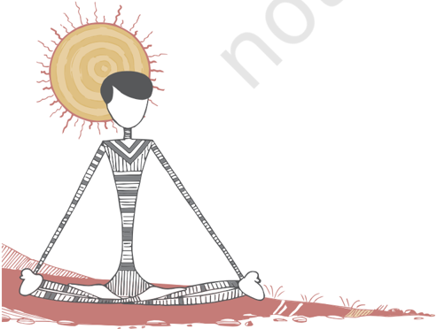

Some Athletic World Records: Women (As on 01.06.2019)

|   Sr No. | Events      | Time/ distance   | Women                   | Country         | Date         |
|----------|-------------|------------------|-------------------------|-----------------|--------------|
|        1 | 100 m       | 10.49 sec        | Florance Griffith Joyne | U.S.A.          | 16 Jul. 1988 |
|        2 | 200 m       | 21.34 sec        | Florance Griffith Joyne | U.S.A.          | 20 Sep. 1988 |
|        3 | 400 m       | 47.60 sec        | Manta Koch              | Germany         | 06 Oct. 1985 |
|        4 | 800 m       | 1:53.28          | Jarmila Kratochvilova   | Czechosl ovakia | 26 Jul. 1983 |
|        5 | 1500 m      | 3:50:07          | Genzebe Dibaba          | Ethiopic        | 17 Jul. 2015 |
|        6 | Long Jump   | 7.52 m           | Galina Chistyakoya      | Soviet Union    | 11 Jun. 1988 |
|        7 | Triple Jump | 15.50 m          | Inessa Kravets          | Ukraine         | 10 Aug. 1995 |
|        8 | Shot Put    | 22.63 m          | Natalya Lisouskaya      | Soviet Union    | 17 Jun. 1987 |

# PAGE 17

## assessmenT

## I.  Answer the following Questions

1.  What are track and field events? Which of these also belong to the category of team sports?
2.  What are the main track rules?
3.  Describe the major rules that are observed in long jump.
4.  Describe the special features of triple jump and high jump.
5.  Discuss the specific rules for shot put and discus throw.
6.  How do you break a tie in high jump?
7.  How is high jump executed?
8.  Describe various relay races.
9.  In which events does the athlete take standing position to start the race?
10.  How do these track and field events help an individual performance?

## II.  Fill in the Blanks

1.  The standard track is of \_\_\_\_\_\_\_\_\_\_\_\_\_\_\_\_\_ meter.

2.  The hurdles event common for men and women is \_\_\_\_\_\_\_\_\_\_\_\_\_\_\_\_\_.

3.  The Diameter of discus circle is \_\_\_\_\_\_\_\_\_\_\_\_\_\_\_\_\_.

4.  The  baton  exchange  area  in  relay  event  is  \_\_\_\_\_\_\_\_\_\_\_\_\_\_\_\_\_ meter.

## III. State whether True or False

1.  Modern Olympic Games started at Greece in 1896.
2.  The weight of discus for men is 1 kg.
3.  The  official  women  javelin  size  is  2.2  to  2.3  meters  long  and weighs 600 grams.