# PAGE 1

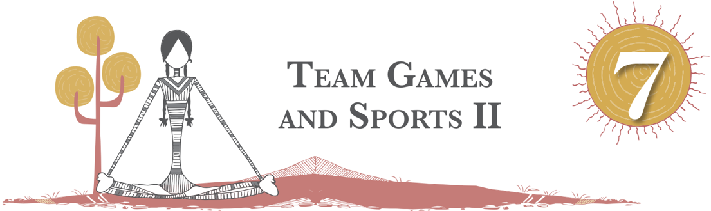

In  the  previous  chapter,  we  have  discussed  team  games like  Football,  Hockey,  Basketball,  Cricket  and  Volleyball. This  chapter  includes  Kabaddi,  Kho-Kho  and  Combative sports like Judo and Wrestling.

## Kabaddi

Kabaddi is an indigenous game which is popular in India. It is a simple and inexpensive game and does not require a big playing area or any equipment. This game is popular in the villages and small towns in India. It is played throughout Asia with minor modifications. Kabaddi is quite new to the other parts of the world. It was known by various names in different parts of India. For example, Chedugudu or Gudugudu in Southern parts of India, Ha-du-du (Men), Chu-kitkit  (Women) in Eastern India, Hu-tu-tu in Maharashtra in western India and Kabaddi in Northern India. It is a game of attack and defense. The two teams occupy opposite halves of a field and take turn in sending a 'Raider' into the other half. In order to win points, members of the opposite team are tagged and the raider tries to return to half, holding the breath and chanting, 'Kabaddi, Kabaddi, Kabaddi'.

Fig. 7.1: Children playing kabaddi

# PAGE 2

112

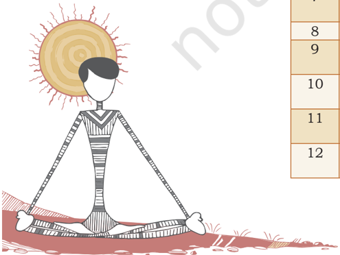

## Do You Know?

- Pro Kabaddi League was established in 2014.
- Women Kabaddi Challenge was first played in 2016.
- 2019 Kabaddi World Cup was held in April 2019 at Malaysia. It is the largest World Cup in the history of kabaddi consisting of 32 men's team and 24 female's teams.

## History

According to some historians Kabaddi might have developed during  prehistoric  times  when  human  beings  were  forced to  defend  themselves  from  sudden  attacks  from  ferocious beasts.  There  is  also  another  school  of  thought,  in  India, which believes that this game is a version of Chakravyuha, used in Mahabharata. The game was demonstrated for the first  time  at  the  international  level  during  1936  in  Berlin Olympics by Hanuman Vyayam Pracharak Mandal , Amravati, Maharashtra. The game was introduced in the Indian Olympic Games at Calcutta in 1938.

In  1950,  the  All  India  Kabaddi  Federation  came  into existence and compiled standard rules. The Amateur Kabaddi Federation  of  India  (AKFI)  was  founded  in  1973.  After formation of the AKFI, the first men's nationals were held in Madras (Chennai), while the women's were held in Calcutta (Kolkata) in 1955. The Asian Kabaddi Federation (AKF) was founded  in  1978.  AKF  is  affiliated  to  Olympic  Council  of Asia.  The  parent  body  designated  to  regulate  the  game  at the  international  level  is  International  Kabaddi  Federation (IKF). The Kabaddi World Cup was first played in 2004, then in 2007 and 2010. So far India is the unbeaten champion in  Kabaddi  World  Cup.  Iran  is  the  next  most  successful nation being runners-up twice. Pakistan was the runners-up in 2010.

## Rules

## Kabaddi field measurements

|   S. No | Field measurements                                         | Men             | Women           |
|---------|------------------------------------------------------------|-----------------|-----------------|
|       1 | Side lines (AB, CD, EF & GH)                               | 13 meter        | 12 meter        |
|       2 | End Line (AD, BC)                                          | 10 meter        | 8 meter         |
|       3 | Lobby (AE, BF, DG, CH)                                     | 1 meter         | 1 meter         |
|       4 | Baulk Line (from Mid line) (LN, KM, LR, KQ)                | 3.75 meter      | 3 meter         |
|       5 | Baulk Line (RQ, MN)                                        | 8 meter         | 6 meter         |
|       6 | Mid-line (IJ)                                              | 10 meter        | 8 meter         |
|       7 | Bonus Line (TS, PO) from Baulk Line (RT, QS, MO, NP)       | 1 meter         | 1 meter         |
|       8 | Bonus Line (MN, ST)                                        | 8 meter         | 6 meter         |
|       9 | Sitting Block (2 meters away from End lines)               | 8×1 meter       | 6×1 meter       |
|      10 | Court (each half of the playfield divided by the mid line) | 6.5×8 meter     | 6×6 meter       |
|      11 | Space surrounding the play field                           | 4 meter         | 4 meter         |
|      12 | Duration of the match                                      | 20-5-20 Minutes | 15-5-15 Minutes |

# PAGE 3

End Line

Fig. 7.2: Specifications of Kabaddi court

## Court

The Kabaddi court measures 13×10 meters for men and 12×8 meters for women with a line dividing it into identical halves denoting actual playing area of the two teams. Traditionally the game is played outdoors and the entire court is dug at least 1 foot deep. The mud is removed and filled with sand from the river or beach. This ensures that the player is not seriously  injured  if  he  falls  or  is  dragged  by  opponents. However, now synthetic Kabaddi fields are used for comfort and to reduce injuries. Tournaments like the Indian Kabaddi league have emerged as crowd pullers in urban areas.

## Team

Each team shall consist of minimum 10 and maximum 12 players. Seven players shall take the ground at a time and the remaining players are the substitutes.

## Duration of the match

The duration of the match is divided into two halves of 20 minutes  each.  In  case  of  men  and  junior  boys  there  is  a 5 minutes interval and in case of women, junior girls, subjunior boys and girls two halves of 15 minutes with 5 minutes interval.  The  teams  shall  change  court  after  interval.  The number of players for each team at the start of the second half shall remain the same as it was at the end of first half. The last raid of each half of the match shall be allowed to be completed  even  after  completion  of  the  scheduled  time  as mentioned above.

# PAGE 4

114

## System of scoring

One point score will be given to each team for every opponent who is deemed out. And if your team, makes all the players of your opponent team out, your team is entitled to get 2 points as a bonus. This is known as Lona.

## Time out

- Each team shall be allowed to take two time outs of 30 seconds in each half. Such time out shall be called for by the Captain, Coach or any playing member of the team with the permission of the Referee. The time out duration shall be added to match time.
- During time out, the team shall not leave the ground. Any  violation  of  this  will  result  in  the  award  of  a technical point to the opponent team.
- Official  time  out  shall  be  called  for  by  the  Referee or  Umpire  in  the  event  of  any  injury  to  the  player, interruption  by  outsiders,  re-marking  of  the  ground or any such unforeseen circumstances. Such time out will be added to the match time.

## Substitution

- Five  reserve  players  can  be  substituted  with  the permission of the referee during time out or interval.
- Substituted players can be re-substituted.
- If  any  player  is  suspended  or  disqualified  from  the match,  no  substitution  is  allowed  for  that  particular player. The team will play with less number of players.
- No substitution is allowed during the official time out.
- Substitution is not allowed for players who are deemed out.

## Bonus point

- One point  shall  be  awarded  to  the  raider  when  they cross  the  bonus  line.  If  the  raider  after  crossing  the bonus line, (is caught) the opponent team will also be awarded one point.
- The  bonus  line  will  be  applicable  when  there  are  a minimum of 6 players in the court; the bonus point shall  be  awarded  by  the  referee  after  completion  of such  a  raid  by  showing  thumb  upward  towards  the side which score.
- If  the  raider  while  crossing the bonus line is caught, then  a  point  will  be  awarded  to  the  defending  team. No bonus point shall be given to the attacking team.
- If  the  raider,  after  crossing  the  bonus  line,  puts  out one or more antis, they will get the number of points

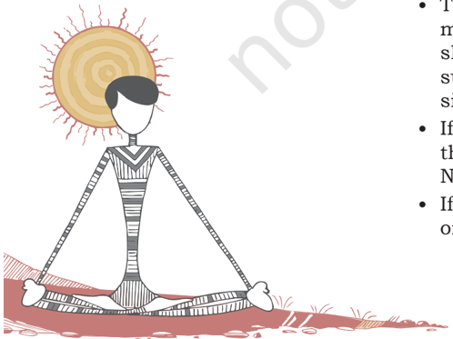

# PAGE 5

scored in addition to the bonus point for crossing the bonus line.

- The raider has to cross the bonus line to score the bonus point before touching the antis or before he is caught by the antis. The raider will not be awarded bonus points if they cross the bonus line after a touch or struggle.
- There shall be no revival for bonus points.
- If player is suspended temporarily or disqualified from the match, then the team will play with less number of players. Such players shall be counted while awarding bonus point.

## Result

The team which scores the highest number of points at the end of the match shall be declared the winner.

## Precautions

- Players should have clipped nails and no ornaments of any sort shall be allowed.
- All  players  must  have  distinct  numbers  on  their T-shirts of at least 4 inches thickness in front and 6 inches thickness at the back. Dress code is followed compulsorily by both the teams during competitions.
- Application of oils or any other soft substances to the body shall not be allowed.
- Shoes are compulsory in case the match is played on the mat surface.

## Fundamental skills

## Skills

The skills used by the raider in kabaddi are called offensive skills. The skills used by the antis are called defensive skills. During a raid, the raider has to make maximum use of his limbs to come in contact or touch the opponents in order to score points. This is accomplished through leg touches, such as, toe touch, foot touch, squat leg, thrust, kicks, etc., with lower limbs and through hand touches with upper limbs.

Offensive skills

- a)  Touch:  Touch  is  a  fundamental  and  the  easiest skill,  which  every  raider  applies  in  one  or  the other forms. There are different kinds of touches such as -
2. (i)  Hand touch: (a) running hand touch (b) stooping hand touch (c) turning hand-touch (d) hopping hand touch (e) fake and touch
3. (ii)  Toe  touch:  This  offensive  skill  is  used  by almost every raider. A raider can execute this

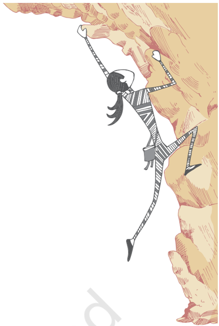

# PAGE 6

116

- skill even from a considerable distance from the  anties.  During  the  course  of  a  raid,  the raider will move in different angles, according to the positions and moves of the opponents. At the same time, in order to apply this skill, the raider requires to extend his leg towards the opponent suddenly.
- (iii)  Foot  touch:  The  modern  toe  touch  is  a moderate  form  of  foot-touch.  The  major difference  between  these  two  skills  is  that in foot-touch, the raider tries to touch the opponents with complete foot whereas in toe touch, toe is used to touch the opponents. This  skill  helps  the  raider  to  cover  more area  in  the  opponent's  court  and  has  an advantage over toe touch.
- b)  Mule kick: It is very useful in critical situations. Mule kick is a thrust or blow in the air, by the raider, with leg, to touch an anti. There are various types of kicks, such as -
- i.  Back kick: Kicking the anti who comes behind the raider during the course of raid is known as back kick. The different forms of back kick are:  (i)  running  back  kick  (ii)  standing  back kick (iii) fake and kick (iv) taking a turn and back kick.
- ii. Side kick: Raiders who raid from second to second and attack the central zone will find this skill the most suitable. The method and principle of kick are the same as in the case of  back  kick.  The  only  difference  between the  two  is  that  the  area  to  be  covered  is sideward.
- iii.  Curve kick is also called a mule kick as the leg lifted to kick at the anties takes a curve from back to the side. This type of kick will enable the raider to cover more area with the attacking leg. At the same time it enables the raider to change his direction.

## Defensive skills

- a)  Ankle  hold:  This  is  a  counter  skill  used  by defensive  players  against  leg  thrusts  and  foot touches during an attack or raid. A team, which has mastery over ankle hold, can plan different strategies and tactics in various situations, such as,  (a)  lifting  up  (b)  pulling  back  (c)  changing direction of the raider.

# PAGE 7

- b)  Thigh  hold:  This  skill  is  a  good  defensive  skill. Every  team  uses  this  technique  as  a  planned and surprise tactic. For example: (a) Taking one step forward and hold - Taking one step forward means holding the raider's thigh on wrong step or rear leg (b) thigh hold from behind.
- c)  Waist hold or trunk hold: Waist hold is a skill used by a defender to catch the raider from behind.
- d)  Wrist hold: Wrist hold is also a defensive skill and used occasionally only when a situation presents itself. This hold is rarely used now a days.
- e)  Blocking:  It  is  a  defensive  skill  used  by  covers and  corners.  Blocking  is  an  act  of  creating  a wall  of  obstruction  in  the  path  of  the  raider  to prevent the movement. The aim of blocking is not just  to  obstruct  the  path,  but  also  to  catch the raider.

## Tactics

Tactics means exploiting a given situation to one's advantage. This is also done to create a situation to suit one's purpose. The raider may increase or decrease the tempo of the game depending on the situation. In order to do this the player may adopt a passive raid or an aggressive raid by creating a situation for a struggle. Sometimes the raider may pass time in the last few minutes of the game, especially when the team is leading and the opponents are playing an aggressive game. Keeping in view the game situation, different tactics adopted by the raider.

## Retreat

Unless the raider returns to home court safely after the raid, the  raid  cannot  be  treated  as  successful.  This  is  called  a retreat. The raider has to pre-plan the path of retreat before starting the raid. While retreating to home court, the raider should keep the following points in view -

- The raider does not give room for pursuit.
- The  raider  regains  their  defensive  position  quickly before the opponent team's raider begins the raid.
- While returning to home court, the raider must pass only through the midline.

## Raid

Raid  is  the  offence  part  of  the  game.  The  main  feature  of the game is raiding on the opponent's court, alternatively by both the team players. The defence is done with teamwork while only one player makes an attack.

# PAGE 8

118

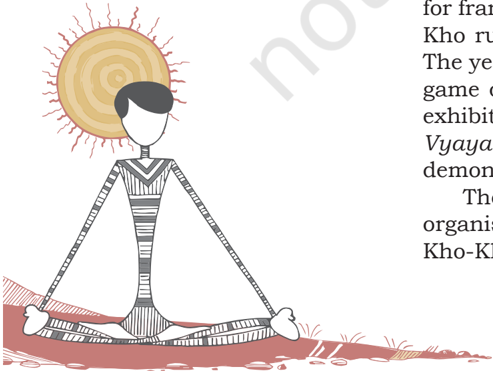

## Cant

'Cant' is holding of breath by the raider during the attack and chanting the word kabaddi, kabaddi, respectively, in one single expiration.

## Kho-Kho

Kho-Kho is one of the most popular traditional team sport in India. It is the simplest form of chasing and touching a person. It  is  an  inexpensive  and  enjoyable  sport  that  demands  physical fitness and a set of skills. Dodging, feigning and bursts of controlled speed make this game quite thrilling. To catch by pursuit is to chase, rather than just run - is the main skill of Kho-Kho. This game is played in two innings by two teams on a rectangular court. One team becomes the chasers and the other the runners. In the game, the chaser pursues the runners and touches them and puts them out. Each team has  to  chase  and  defend  for  9  minutes  twice  in  a  match.

Fig. 7.3: Player playing kho-kho

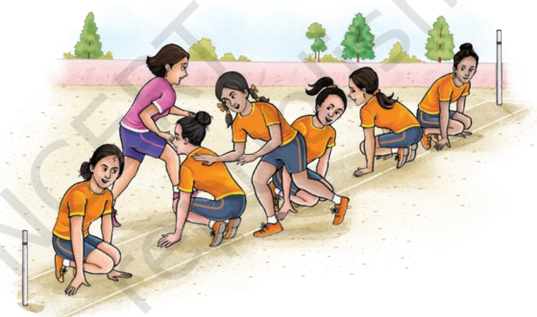

## History

In the ancient era, a version of the Kho-Kho game was played on 'raths' or chariots in Maharashtra, and this was known as Rathera. The Kho-Kho rules were first framed in the early 1900's. A committee was formed at Puna Gymkhana in 1914 for framing the Kho-Kho rules and the first ever book of KhoKho rules was published from Baroda Gymkhana in 1924. The year 1936 was the year of the golden opportunity for the game of Kho-Kho when Berlin Olympic Games featured an exhibition of Kho-Kho in the main stadium. The Hanuman Vyayam  Prasarak  Mandal of  Amravati  was  the  proud demonstrators in that exhibition.

The  first  ever  All  India  Kho-Kho  Championships  were organised  at  Vijaywada  in  1959-60  under  the  auspices  of Kho-Kho Federation of India. In 1969-70 the junior age group

# PAGE 9

competitions were organised in Hyderabad. Competitions for women's junior-group, girls under 16, were held in 1974 at Dewas when two more sub-junior groups for  boys under 14 and for Girls under 12 also commenced. In the tournament best sub-junior boys were awarded Bharat Award and best sub-junior girls Veer Bala Award. In 1987, a demonstration was  held  in  South  Asian  Games  and  Asian  Kho-Kho Federation came into existence with three countries as its members.  The  Indian  Olympic  Association  had  included Kho-Kho as a discipline in the South Asian Games which was held at New Delhi in 2013.

## Playfield

A Kho-Kho playground (or pitch) is rectangular. It is 27 meters in length and 16 meters in width. There are two rectangles at the end.

Fig. 7.4: Specifications of kho-kho ground

One side of the rectangle is 16 meters and the other side is 1.50 meters. In the middle of these two rectangles, there are  two  wooden  poles.  The  central  lane  is  24  m  long  and covers an area of 35 cm × 30 cm. There are eight cross lanes which lie across the small squares from pole to pole and right angles to the central lane is divided equally into two parts of 7.85 m each by the central lane. At the end of the central lane, two poles are fixed. These are 120 to 125 cm above the ground and their circumference is not less than 30 cm and not more than 40 cm. These poles are made of wood which are smooth all over. The poles are fixed firmly in the free zone tangent to the pole-line.

119

# PAGE 10

120

## Rules

- The team consists of 12 players, but only 9 players take the field for a contest.
- A match consists of two innings. An inning consists of chasing and running turns of 9 minutes each.
- Then, one team sits in the middle of the court, in a row, with adjacent members facing opposite directions.
- The chasers can only run in one direction and cannot cut across the sitters unlike the dodgers who can run randomly and in between the sitters.
- They  have  to  run  round  the  entire  row  to  reach  the other side.
- The other option is to pass the chasing job to another sitter whose back is facing the chaser as the chaser is running.
- In this option, the chaser touches the sitter he wants, usually nearest to the target and shouts 'kho' to signify the change of guard.
- The objective is to tag all the opponents in the shortest time possible.
- The team that takes the shortest time to tag maximum number of opponents in the field wins.

## Fundamental skills

## Offensive skills

1. Giving kho to side: To chase a defender
2. (i)  Two steps kho (proximity and distal step)
3. (ii)  Advance  kho:  Running  ahead  of  defender  and dropping kho.
4. (iii)  Deceptive  kho:  To  deceive  defender  by  different body movements.
2. Pole  turning:  To  turn  the  pole  in  continuation  of attack
6. (i)  Pole turning from 8th square (from sitting position).
7. (ii)  4 up turn: Turning pole by taking four steps.
8. (iii)  5 up turn: Turning pole by taking five steps.
9. (iv)  Running pole turning: Pole turning without giving Kho.
3. Covering on cross lane: To cover the defender on cross lane.
11. (i)  Quadruped
12. (ii)  Biped
13. (iii)  Rush Through
14. (iv)  Combination

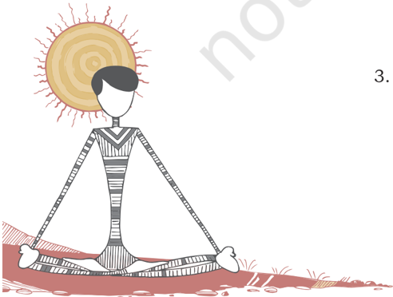

# PAGE 11

4. Pole  dive:  Taking  support  of  pole  and  touching  the defender.
2. (i)  Running pole dive
3. (ii)  Pole dive from 8th square (Sitting)
4. (iii)  Judgment kho and pole dive
5. (iv)  Running flat dive
6. (v)  Steady dive
7. (vi)  Side dive
5. Tapping
9. (i)  Shoulder tap: Touching the shoulder of defender.
10. (ii)  Heel tap: Touching the heel of defender.

## Defensive skills

1. Chain game: Defender takes entry behind the sitting chaser  and  runs  in  a  zig-zag  path  by  making  the attacker give kho from behind.
2. (i)  Six Single up
3. (ii)  Two five six up
4. (iii)  Two three six up
5. (iv)  Three four five six up
6. (v)  One four five six up
7. (vi)  One four seven one
2. Ring game: Defender runs in the shape of a ring (oval shape) by making use of four squares. In front ring defender  faces  the  attacker.  In  back  ring  defender shows his back and plays ring game.
9. (i)  Short ring - Defender stands close to the centre lane.
10. (ii)  Medium  ring  -  Defender  stands  almost  half  the way from the centre lane.
11. (iii)  Long ring - Defender stands away from the central lane but.
3. Combination of chain and ring game
4. Dodging: To deceive the attacker, different body dodge is used. Shoulder dodge, Foot dodge, combining both skills of defence, 3-ring defence.
5. Avoiding the pole: The defender stands between last square and pole without reaching pole.

## Palti

By showing his back, the defender deceives the attacker and turns in the opposite direction to the direction in which he was running.

# PAGE 12

122

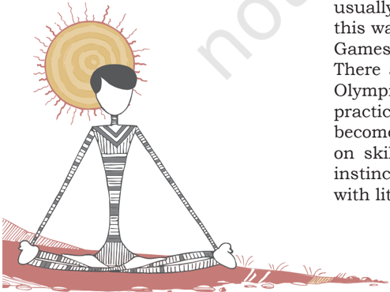

## Judo

Fig. 7.5: Player playing Judo

## History

The  history  of  judo  starts  with  Japanese  jujutsu.  It  was created by Professor Jigoro Kano and he believed that the techniques could be practiced as a competitive sport if the more dangerous techniques were omitted. By 1910 Judo was a  recognised  sport  that  could  be  safely  engaged  in  and  in 1911 it was adopted as a part of Japan's educational system. In  the  same  year,  the  Kodokan  Judo  Instructors'  Training Department,  Kodokan  Black  Belt  Association  and  Japan Athletic Association were formed. World War II saw a different development of Judo. Instead of being used for sport,  Judo  was being taught as a combat skill. Those selected for commando and special services training often achieved a high standard of expertise. When Japan hosted the 1964 Olympics, Judo was given its first opportunity as an event. Of the 16 medals awarded for Judo, Japan won three gold medals, and one silver medal. Judo was no longer a Japanese sport but had developed to become an international sport.

There have been two main developments in Judo over the years.  The  first  was  the  introduction  of  weight  categories. Earlier everyone fought everyone else, with the result that, if two players were equally matched in skill, the bigger man usually  won.  Initially  there  were  three  categories,  and  later this was made into five. Inclusion of the sport in the Olympic Games  in  1964  helped  to  hasten  this  important  reform. There are different styles of Judo. With its inclusion in the Olympics,  there  has  been  a  shift  towards  a  contest  style practice.  In  clubs  where  this  style  is  taught,  the  practice becomes largely a continuous contest. Other schools stress on  skills.  They  favour  repetitive  movements  to  make  them instinctive  and  the  development  of  speed  through  practice with little resistance.

Judo  is  a  popular  martial  art,  combative  and Olympic  sport.  In  the  term  judo,  'ju'  means 'gentle' and 'do' means 'the way or path'. Judo  was  developed  in  Japan  in  the  late  19th century  by  using  the  principles  of  balance  and leverage adapted from jujutsu. Its most prominent feature  is  its  competitive  element,  where  the objective  is  to  either  throw  or  putdown  one's opponent to the ground, immobilise or otherwise subdue one's opponent with a grappling maneuver, or force an opponent to submit by joint locking or by executing a stranglehold or choke. Strikes and thrusts by hands and feet as well as self-defense are a part of judo. Many are trained in Judo either for participation in competition or self-defense.

# PAGE 13

## Rules

## Officials

There are three officials who preside over a judo match. There is one referee who walks around inside the contest area and conducts the match. There are two judges who sit diagonally across the mat from one another, each in a corner. The two judges assist the referee and indicate when the contestant goes  outside  of  the  contest  area.  The  referee  is  in  charge of awarding points and accessing penalties and uses hand gestures to signal his decision. However, if a judge disagrees with a call, then the three officials take a vote and the decision is decided by a majority vote. In addition to the Judge and Referees  there  are  also  scorekeepers  and  timers.  There  is usually a scoreboard, which displays points and penalties and it can either be electronic or manual. Medical personnel are also on hand in the event of injury to a contestant.

## Contestants

The two contestants, who are known as Judokas, compete for 5 minutes for men and 4 minutes for women. One contestant wears white uniform and the other a blue uniform.

## Uniforms

The judokas wear loose-fitting judo uniforms called judogi, consisting of pants, a jacket and a belt. Judogi is made up of loose-fitting pants, a jacket and a belt that is tied around the  waist.  The  jacket  and  pants  are  made  of  cotton.  They are either blue or white and they are made so a rival should be able to get a grip on either one of them so as to be able to make a judo throw. One judoka will wear white the other blue. The belt is three meters long and it is wrapped around the waist twice. The color of the belt signifies the rank the combatant has reached.

## Competition area

The entire competition area in judo is 46 to 53 feet square (14  to  16  meters).  This  area  is  made  up  of  foam  mats commonly  referred  to  as  tatami  mats  and  the  individual mats are 6.5 feet by 3.281 feet wide (2 meters long, a 1-meter wide). Inside the competition area is a contest area, which is 8-10 meters square. This contest area (shiaijo) is green in color, that would be 29.5 feet square (9-meters) and it will have a 3.281 foot (1-meter) red boundary around it. This is the danger zone and it alerts the competitor(s) (judoka) that they  are  about  to  go  out  of  bounds.  The  area  outside  the danger zone is the safety zone. This zone is three meters wide and it is the out-of-bounds area.

# PAGE 14

## Activity 7.1

What  is  the  proficiency given  in  India?  Make  a list.

e.g.:  Yellow  belt  or  Black belt.

In the middle of the contest area are two pieces of tape, one blue and one white 13.1 feet apart (4-meters). These two pieces of tape mark the place where the judoka will stand when they begin and end each bout.

## Contest

A  random  draw,  in  the  same  weight  category,  is  used  to determine which contestants will be fighting each other. In the Olympic Games there are two pools, and each pool has its own single-elimination tournament. The two pool winners will compete for the gold medal, with the loser of this contest winning the silver medal. In each pool, the competitors who lose to a pool winner are then entered into a repechage round which is also a single-elimination tournament. The winners of the repechage pools will be the winners of the bronze medals.

To win the contest a Judoka must score an Ippon a score that equals 10 points by using successful Judo techniques. If  neither  of  the  Judokas  is  able  to  score  an  Ippon  or  10 points by the end of the match, the winner will be the Judoka who has scored the most points. In the event of a tie, for the first  time  at  the  2004  Olympic Games, the 'Golden Score' rule  was  used.  If  there  is  no  winner  after  the  five-minute period  has  ended,  the  referee  announces  the  beginning  of 'Golden Score'. This will extend the match for an extra fiveminute period and the contestant who scores the first point is declared the winner of the match.

## Judo penalties

Two types of penalties may be awarded. One is shido and another  is  hansoku.  After  two  shido  are  given,  the  third shido becomes hansoku-make and the victory is given to the opponent. This is an indirect hansoku-make and does not result in expulsion from the tournament.

## Wrestling

Considered as one of the most ancient and oldest sport in the world, wrestling has also been equally popular in India. It is a form of combat sport involving grappling type techniques such  as  clinch,  fighting,  throws,  take  downs,  joint  locks and  other  grappling  holds.  A  wrestling  bout  is  a  physical competition,  between  two  (occasionally  more)  competitors or  partners,  who attempt to gain and maintain a superior position. There are a wide range of styles with varying rules, such as, traditional, historic and modern styles. Wrestling techniques have been incorporated into other martial arts as well as military hand-to-hand combat systems.

# PAGE 15

Fig. 7.6: Bout in wrestling

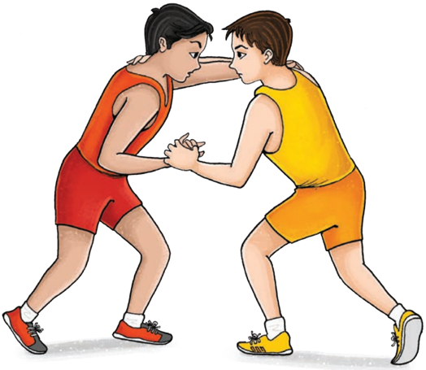

## History

Wrestling has been a part of human society since ancient times. In India also it received regular patronage from the Emperors and Kings. Wrestling in India then was popularly known as Malla Yuddha .  In  famous  Indian  epic,  Mahabharata, Bhima was considered  to  be  a  great  wrestler  of  that  time and some of the other great wrestlers included Jarasandha, Duryodhana,  and  Karna.  Another  Indian  epic, Ramayana also  mentions  about  wrestling  and  Hanuman  is  described as one of the great wrestlers of that time. Wrestling in India continued to increase its popularity during modern days. Even during the British rule, wrestling in India got encouraging support,  as  the  British  rulers  included  the  game  into  the military  practice.  In  fact,  India  was  considered  among  the top 10 countries in wrestling till the 1960s. India also hosted the  World  Wrestling  Championship  at  New  Delhi  in  1967.

The term Kushti , which means wrestling, denotes both a local form of the art as well as a more global combat. Kushti is composed of three primary dimensions: dao , pench ,  and paintra (moves,  counter-moves,  and  stance).  There  may be  similarities  between  the daos known  as multani , dhobi pat ,  and kalajangh and  the  corresponding  freestyle  moves known as arm drag, front hip throw, and fireman carry. But what  is  significantly  different  about  wrestling  in  India  is that wrestlers mostly wrestle in mud pits, engage in bouts that last for half an hour or more. At other times and under other circumstances Indian wrestlers follow clearly defined international guidelines, rules, and regulations.

## Do You Know?

In  2008,  Sushil  Kumar brought 2nd Bronze Medal for India at Beijing Olympic Games. This feat was repeated at 2012 Olympics games by Sushil Kumar (Silver Medal) and Yogeshwar  Dutt  Bronze Medal. The first medal was won  by  K.D.  Jadhav  in 1952 at Helsinki Games. Geeta Phogat became the  first  Indian  woman wrestler to represent the country at 2012 London  Olympic  Games.

125

# PAGE 16

126

Worldwide wrestling entered a new era with the acknowledgement of Female Wrestling as an Olympic discipline in the Athens Games in 2004.

## Measurement of the wrestling mat

Fig. 7.7: Specifications of wrestling play area

| Terms                                | Dimensions           |
|--------------------------------------|----------------------|
| Dimensions of the mat                | 9 meters in a circle |
| Empty space on the border of the mat | 1 metre              |
| Height of the platform               | 1.10 metre           |
| Colour of marks on the mat           | Red of Blue          |
| Thickness of the mat                 | 10 cm                |
| Protection area                      | 1.2 to 1.5 m width   |

## Rules and regulations

1. There are two Olympic styles of wrestling, Freestyle and Greco-Roman. With one key exception, the rules of the two styles are identical:
- In  Greco-Roman,  a  wrestler  may  not  attack his opponent's legs, nor use his own legs to trip, lift or execute other moves.
- In freestyle, both the arms and legs may be used  to  execute  holds  or  to  defend  against attack.
2. The wrestler must be at least 17 years old, and must be sponsored by the national federation, to compete at the World Championships or Olympic Games.

# PAGE 17

3. The weight divisions: There are eight weight divisions in men's international wrestling and six for women. Athletes  are  weighed-in  prior  to  the  competition, and must be at the weight level or below in order to participate in the competition.
4.  New weight categories for wrestling (for 2018-19) -

Under-14 Boys and Girls

| Freestyle (Boys)   | Freestyle (Girls)   |
|--------------------|---------------------|
| 35 kg              | 30 kg               |
| 38 kg              | 33 kg               |
| 41 kg              | 36 kg               |
| 44 kg              | 39 kg               |
| 48 kg              | 42 kg               |
| 52 kg              | 46 kg               |
| 57 kg              | 50 kg               |
| 62 kg              | 54 kg               |
| 68 kg              | 58 kg               |
| 75 kg              | 62 kg               |

Under-17 Boys and Girls

| Freestyle and Greco-Roman (Boys)   | Freestyle (Girls)   |
|------------------------------------|---------------------|
| 41-45 kg                           | 36-40 kg            |
| 48 kg                              | 43 kg               |
| 51 kg                              | 46 kg               |
| 55 kg                              | 49 kg               |
| 60 kg                              | 53 kg               |
| 65 kg                              | 57 kg               |
| 71 kg                              | 61 kg               |
| 80 kg                              | 65 kg               |
| 92 kg                              | 69 kg               |
| 110 kg                             | 73 kg               |

Under-19 Boys and Girls

| Freestyle   | Freestyle (Girls)   | Greco-Roman (Boys)   |
|-------------|---------------------|----------------------|
| 57 kg       | 50 kg               | 55 kg                |
| 61 kg       | 53 kg               | 60 kg                |
| 65 kg       | 55 kg               | 63 kg                |
| 70 kg       | 57 kg               | 67 kg                |
| 74 kg       | 59 kg               | 72 kg                |
| 79 kg       | 62 kg               | 77 kg                |
| 86 kg       | 65 kg               | 82 kg                |

# PAGE 18

128

| 92 kg   | 68 kg   | 87 kg   |
|---------|---------|---------|
| 97 kg   | 72 kg   | 97 kg   |
| 125 kg  | 76 kg   | 130 kg  |

5. The officials: There  are three officials for every international wrestling match, a referee (on the mat) plus a chairperson and a judge. There cannot be two officials  from  the  same  nation  officiating  the  same match,  nor  may  an  official  officiate  a  match  where an athlete from his/her nation is participating. The officials award points on a majority vote. At least two of the three officials must agree on technical points and falls.
6. The coach: The coach may remain at the foot of the platform or at least two meters from the edge of the mat during the competition.
7. The uniform: Wrestlers must wear a one-piece singlet, in the color assigned to them (red or blue), wrestling shoes and carry a handkerchief. The wrestling singlet must  be  of  a  type  approved  by  the  international wrestling federation. Referees must wear a white shirt or pullover, pants and shoes.
4. o  The  competition  rules:  You  have  already  gone through these rules in Class IX, Chapter 10 Team Games .

## Scoring rules and terms

- Takedown occurs when a man takes opponent to the mat from a standing position. This is worth one point, but can be worth more if the opponent is brought down onto his back.
- Exposure  is  turning  an  opponent's  shoulders  to  the mat. Once the line of the back area breaks a 90-degree angle, points are scored. This can occur both from the feet and on the mat. A wrestler who holds his opponent in  a  danger  position  for  five  seconds  will  receive  one extra point.
- Reversal is, when the man underneath completely re -verses  his  position  and  comes  to  the  top  position  in control, he has scored a reversal, worth one point.
- Escape is when an athlete works to come out from the bottom position (after being under dominant control) and gets to their feet, facing the rival. The athlete has then scored an escape, worth one point.
- Duration of the bout U-15 cadets and veterans - The duration of a bout will be of two periods of 02 minutes with a 30 second break.

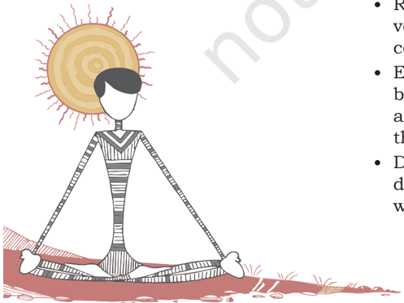

# PAGE 19

- Junior and seniors - The duration of a bout will be two periods of 3 minutes each with a 30 second break.

For  all  the  competitions,  the  timing  displayed  on  the scoreboards will start from 6 to 1 minute (from 4 to 0 minute for U-15, cadets and veterans).

## Scoring

| Points   | Terms                                                                                                                                                                                                                                                                                                                                                                   |
|----------|-------------------------------------------------------------------------------------------------------------------------------------------------------------------------------------------------------------------------------------------------------------------------------------------------------------------------------------------------------------------------|
| 1 point  | Holding of opponent on the ground                                                                                                                                                                                                                                                                                                                                       |
| 2 points | Placing the opponent in danger                                                                                                                                                                                                                                                                                                                                          |
| 3 points | Bringing the opponent into immediate danger position                                                                                                                                                                                                                                                                                                                    |
| 4 points | Exceeding a throw of great height losing contact of the other opponent from the ground.                                                                                                                                                                                                                                                                                 |
| 5 points | All grand amplitude throws executed in a standing position which bring the defending wrestler to a direct and immediate danger position. The hold executed by a wrestler in the Parterre position who completely lifts his opponent off the ground with the execution of a high amplitude throw which project the opponent into a direct and immediate danger position. |
| Fall     | Bring two shoulders of the opponent on the ground.                                                                                                                                                                                                                                                                                                                      |

## Types of Victories

| A bout may be won                                                                 | by fall by injury by a disqualification                                       |
|-----------------------------------------------------------------------------------|-------------------------------------------------------------------------------|
| A bout may be won                                                                 | by points (by having at least 1 point more after addition of the two periods) |
| In case of tie by points, the winner will be declared by successively considering | The highest value of holds.                                                   |
| In case of tie by points, the winner will be declared by successively considering | The least amount of cautions.                                                 |
| In case of tie by points, the winner will be declared by successively considering | The last technical point/points scored.                                       |

# PAGE 20

130

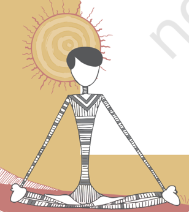

## Kabaddi

## I.  Answer the following Questions

1.  List the landmarks in the history of Kabaddi in India.
2.  What is the system of scoring in Kabaddi?
3.  What are the rules regarding substitutions?
4.  What is a bonus point?
5.  What is the Golden Raid rule?

## II.  Fill in the Blanks

1.  The Kabaddi court measures \_\_\_\_\_\_\_\_\_\_\_\_\_ meters with a dividing line in between making it into identical halves.

2.  Each  team  consists  of  minimum  \_\_\_\_\_\_\_\_\_\_\_\_\_  and  maximum \_\_\_\_\_\_\_\_\_\_\_\_\_  players,  but  only  \_\_\_\_\_\_\_\_\_\_\_\_\_  players  take  the ground at a time.

3.  The duration of the match is two halves of \_\_\_\_\_\_\_\_\_\_\_\_\_ minutes with  \_\_\_\_\_\_\_\_\_\_\_\_\_  minutes  interval  in  case  of  men  and  junior boys  and  of  \_\_\_\_\_\_\_\_\_\_\_\_\_  minutes  with  \_\_\_\_\_\_\_\_\_\_\_\_\_  minutes interval in the case of women and junior girls.

4.  Each team shall be allowed to take \_\_\_\_\_\_\_\_\_\_\_\_\_ 'time outs' of \_\_\_\_\_\_\_\_\_\_\_\_\_ seconds each in each half.

## Kho-Kho

## I.  Fill in the Blanks

1.  In Kho-Kho, one team becomes the \_\_\_\_\_\_\_\_\_\_\_\_\_ and the other the \_\_\_\_\_\_\_\_\_\_\_\_\_ or runners.
2.  Many historians say that Kho-Kho is actually a modified form of ' \_\_\_\_\_\_\_\_\_\_\_\_\_ '.
3.  The  first  ever  book  of  Kho-Kho  rules  was  published  from Gymkhana Baroda, in \_\_\_\_\_\_\_\_\_\_\_\_\_ .
4.  The year 1936 got the golden opportunity for the game of KhoKho when \_\_\_\_\_\_\_\_\_\_\_\_\_ featured an exhibition of Kho-Kho in the main stadium.
5.  The first ever All India Kho-Kho Championships were organised at  \_\_\_\_\_\_\_\_\_\_\_\_\_ in 1959-60 under the auspices of  \_\_\_\_\_\_\_\_\_\_\_\_\_ of India.
6.  The  Indian  Olympic  Association  has  included  kho-kho  as  a discipline  in  the  next  \_\_\_\_\_\_\_\_\_\_\_\_\_  Games  to  be  held  in  New Delhi in \_\_\_\_\_\_\_\_\_\_\_\_\_ .

## assessment

# PAGE 21

## II.  State whether True or False

1.  In Kho-Kho, each team consists of 15 players, but only 12 players take the field for a contest
2.  A match consists of 4 innings. An innings consists of chasing and running turns of 9 minutes each.
3.  The chasers can only run in one direction and cannot cut across the  sitters  unlike  the  dodgers  who  can  run  randomly  and  in between the sitters.
4.  The  equipment  used  in  Kho-Kho  are  posts,  two  watches,  and score board.
5.  A Kho-Kho playground (or pitch) is rectangular. It is 29 meters in length and 16 meters in width.
6.  One  side  of  the  rectangle  is  20  meter  and  the  other  side  is  9 meters.
7.  At the end of the innings there is an interval of 5 minutes and an interval of 2 minutes, in between the turns.

## Judo

## I.  Answer the following Questions

1.  Briefly list the typical characteristics of Judo?
2.  Why should we learn Judo?
3.  How has Judo developed in India?

## II.  Fill in the Blanks

1.  There is one \_\_\_\_\_\_\_\_\_\_\_\_\_ who walks around inside the contest area  and  conducts  the  match  and  there  are  \_\_\_\_\_\_\_\_\_\_\_\_\_ judges who sit diagonally across the mat from one another, each in a corner.

2.  Contestants,  who  are  known  as  \_\_\_\_\_\_\_\_\_\_\_\_\_,  compete  for \_\_\_\_\_\_\_\_\_\_\_\_\_ minutes for men and \_\_\_\_\_\_\_\_\_\_\_\_\_ minutes for women.

3.  The judoka wears loose-fitting judo uniforms called \_\_\_\_\_\_\_\_\_\_\_\_\_ because \_\_\_\_\_\_\_\_\_\_\_\_\_ .

4.  The  entire  competition  area  in  judo  is  \_\_\_\_\_\_\_\_\_\_\_\_\_  to \_\_\_\_\_\_\_\_\_\_\_\_\_ square feet (14 to 16 meters).

5.  In the middle of the contest area are two pieces of tape, one \_\_\_\_\_\_\_\_\_\_\_\_\_ and one \_\_\_\_\_\_\_\_\_\_\_\_\_ .

6.  To  win  the  contest  a  Judoka  must  score  an  \_\_\_\_\_\_\_\_\_\_\_\_\_ a  score  that  equals  10  points  by  using  successful  Judo techniques.

7.  Penalty points can also be awarded against a Judoka. These penalties are: \_\_\_\_\_\_\_\_\_\_\_\_\_, \_\_\_\_\_\_\_\_\_\_\_\_\_ and \_\_\_\_\_\_\_\_\_\_\_\_\_ .

# PAGE 22

## Wrestling

## I.  Answer the following Questions

1.  List the landmarks in the history of wrestling in India?
2.  List and describe the scoring rules and terms of wrestling.

## II.  Fill in the Blanks

1.  It is a form of combat sports involving grappling type techniques such as \_\_\_\_\_\_\_\_\_\_\_\_\_, \_\_\_\_\_\_\_\_\_\_\_\_\_, \_\_\_\_\_\_\_\_\_\_\_\_\_, \_\_\_\_\_\_\_\_\_\_\_\_\_, \_\_\_\_\_\_\_\_\_\_\_\_\_ and other grappling holds.

2.  In Greco-Roman, a wrestler may not attack his/her opponent's \_\_\_\_\_\_\_\_\_\_\_\_\_, nor use his/her own \_\_\_\_\_\_\_\_\_\_\_\_\_ to trip, lift or execute other moves.

3.  In  freestyle,  both  the  \_\_\_\_\_\_\_\_\_\_\_\_\_  and  \_\_\_\_\_\_\_\_\_\_\_\_\_  may  be used to execute holds or to defend against attack.

4.  International wrestling is contested on a mat, with a \_\_\_\_\_\_\_\_\_\_\_\_\_ meter circular competition area.

5.  There are three officials for every international wrestling match, a \_\_\_\_\_\_\_\_\_\_\_\_\_ (on the mat) plus a \_\_\_\_\_\_\_\_\_\_\_\_\_ and a \_\_\_\_\_\_\_\_\_\_\_\_\_

6.  If a wrestler scores \_\_\_\_\_\_\_\_\_\_\_\_\_ points more than his opponent at any time, the round is stopped.

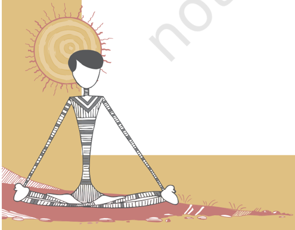