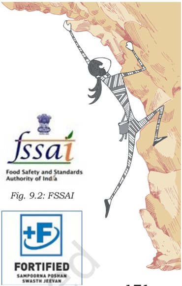

# PAGE 1

Food  is  a  basic  human  need.  It  is  consumed  to  provide nourishment to the body. To achieve optimal level of fitness certain  dietary  considerations  are  required.  Mostly  food  is consumed for its taste or appearance; however, both nutritive value and quality of food need attention. Food quality, food adulteration,  food  spoilage  and  impact  of  indiscriminate use of pesticide and radiation on human health have been discussed in this lesson.

## Dietary Planning

Dietary  planning  is  an  important  step  in  proper  food selection  and  preparation  of  meal  to  stay  healthy  and  fit. Dietary  planning  is  a  process  of  developing  meal  plans for adequate nutrition within the available resources. Nutritional requirement and food choices vary with regard to their age, sex, activity level and physiological condition. Food is planned accordingly to make it enjoyable, satisfying and healthy. Planning is a scientific method of saving energy, time and money. It makes the tasks of  procuring raw material, preparing meals and ensuring food quality simpler. It adds variety the meals and reduces wastage.

You have studied the five food groups in Class IX. Revise these and for reference keep these handy.

## Factors aFFecting the Planning

Everybody needs a balanced diet irrespective of age but certain factors  influence  the  food  choices.  Consider  the  following factors  while  planning  meal  for  good  health  and  fitness.

## Age

Body's need for food and nutrients varies greatly with age. An infant needs only mother's milk initially but needs extra

## Activity 9.1

- Plan  a  meal  (lunch  or dinner) including some food from each food group.
- Record  your  one  day diet. Analyse each food preparation according to the food group. How could you improve your diet for the missing nutrients?

# PAGE 2

166

food and nutrients with growing age. Adolescents grow at a fast  pace  and  are  active,  so  they  need  extra  nourishment. But  their  food  preferences  are  often  influenced  by  friends and media rather than nutritional requirement. They need guidance  in  this  regard.  Nutritious  food  preparations  can be planned in the form they enjoy, like spinach paratha or spinach, carrot and potato soup instead of spinach vegetable. Elders  often  have  difficulty  in  chewing,  swallowing  and digestion; they need soft and easily digestible foods, such as, well cooked vegetables, idli etc.

## Gender

Nutritional requirements vary with gender. Till the age of 10 years nutritional requirements are same, thereafter both grow at different pace and their body composition is also different. Mostly men are taller and heavier than women. They are more muscular while women have more fat cells. Thus, their body types are different leading to different nutrient requirements. Females need more iron (hemoglobin) due to blood loss during menstruation. Lack of iron often puts them at high risk of iron  deficiency  or  anemia.  Whole  grains,  seasonal  fruits, green leafy vegetables and dairy products are healthy for both genders. Food preferences may also vary with gender.

## Physical activity

Energy and nutrient requirements vary with physical activity. Sitting jobs like reading, computer work, etc., need less energy and heavy duty tasks like cycling, carrying heavy load, sports, etc., need more energy. Intensity and duration of activity also affect the requirements, e.g., a person cycling normally needs lesser energy than a person participating in a  race,  need  nutrients,  like  vitamin  B,  in  accordance  with energy requirement. In general energy from fried foods, extra butter or ghee needs to be avoided. Food preparations from whole foods, nuts, oilseeds, dairy foods, egg, and fish can fulfill the requirement for energy and other nutrients.

## Physiological state

Physiological conditions like infancy, childhood, adolescence, pregnancy,  lactation  impose  high  demands  of  food  and nutrients  due  to  higher  rate  of  growth  and  development. For example, a healthy sedentary woman needs 1900 kcal/day while the same woman, if pregnant, will need 2200 kcal. Similarly an adult man needs 0.8 g protein/Kg body  weight/day.  The  same  person  if  an  athlete  requires 2.0g  protein/Kg  body  weight/day.  Foods  like laddoo (rich in calories) are quite suitable for highly active and growing persons while those with sedentary life  style  should  avoid them to  prevent  becoming  overweight.  Careful  selection  is

# PAGE 3

helpful to prevent malnutrition and illnesses. Physiological state also affects the food preferences.

## Economic considerations

Some foods are expensive while others are cheap but both may provide similar nutritional benefits, e.g., cashew nuts are expensive, groundnuts are cheap and both are good sources of fat, protein, vitamins and minerals. Seasonal, local, fresh foods are cheaper and more nutritious. The cost of a food item also varies from one place to another. Purchasing from whole sale markets, haats, etc., is economical. Homemade food is cheaper.

## Time and skill

The number and types of dishes served in a meal depend on the availability of time, ingredients, equipment and skills of  the  person  who  cooks.  Lack  of  these  may  influence  the quality of the meal. Hence, it is necessary to plan in such a way that nutritional quality is maintained. Preplanning and time management skills are useful in preparing nutritious meal  in  lesser  time.  All  members  of  the  family,  including children, need to be engaged in food preparation activities in an appropriate manner.

## Region, religion and culture

Eating  habits  are  often  linked  with  the  foods  produced  in the localily, e.g., people living in coastal areas eat more fish or  coconut  is  popular  in  Kerala.  When  the  same  food  is consumed over a period of time it becomes cultural practice. Religion  also  influences  the  food  habits  e.g.,  the  Jain community does not eat onion, garlic, eggs, fish, meat, etc., However,  mobility,  technology  and  various  modern  factors are  lessening  such  impacts.  Certain  foods  are  associated with festivals like, gujia in Holi.

## Food preferences of individuals

Food  preferences  vary  from  person  to  person  and  strongly affect planning of meals, e.g., a vegetarian cannot eat meat and a non-vegetarian will not get satisfaction with only vegetarian dishes. People from south India will get satisfaction with idli sambhar instead of dal roti. Occasional change is accepted but dissatisfaction resulted from less preferred food over a long period of time may lead to under-eating,  malnutrition and health problems.

## Sensory appeal

How food  satisfies  the  sensory  organs,  e.g.,  tongue,  nose, eyes,  ear,  constitute  sensory  appeal.  Good  looking  and aromatic  food  appeals  and  attracts  everybody.  Appearance,

167

# PAGE 4

168

Fig. 9.1: Taste

## Activity 9.2

- Ramesh plans to make chapatti, dal, spinach vegetable, raita and a sweet for himself and his wife; while Mahima consumes missi roti, mint chutney and buttermilk as she has go to work as a labor in an industry. Compare and evaluate their meals.
- Name five food items you started eating after seeing the advertisements. Explain good and bad features about each of them. What feature in the advertisement attracted you the most?

taste,  flavor,  texture,  temperature,  also  play  a  crucial  role in food acceptance. For example, papad has to be crisp and bread  soft;  ice  cream  chilled  and  soup  hot.  This  has  to  be given due consideration.

## Related concepts

Taste is a sensation perceived in the mouth and throat. There are four tastes, i.e., sweet, salt, bitter, sour. The fifth taste is referred to as umami which is similar to the taste of monosodium glutamate (MSG).

Ayurveda  describes  six  tastes  namely,  sweet,  salt,  bitter, sour, pungent and astringent which can easily be linked with the tastes of sugar, salt, neem, lemon, chilli and amla respectively.

Flavour  is  sensed  by  both  nose  and  tongue  together.  It includes  both  aroma  and  taste.  Lemon  has  lemony  flavor  and sour taste. Specific compounds when present in a certain food give them distinct flavor and can also be modified by processing.

## Satiety value

Satiety value implies a sense of pleasure and satisfaction that a  person  gets  from  eating  food.  While  planning  meals,  it  is important to take care that it keeps one satisfied for sufficient time and does not lead to hunger pangs soon. This in turn will affect the working capacity, efficiency and health of a person.

## Media and advertisement

Many persons, particularly children, choose food tempted by advertisements. Further they choose a certain food because it is available on discount or as a free gift. Such practice is common with some processed, packaged and ready to eat foods. These items may initially attract, appear cheap but on regular use they may turn out to be costly, less nutritious and unhealthy. Hence it is necessary to see nutrition facts on the label  of  the  packing  to  make  healthy  food  choices. Using  the  same  concept  to  advertise  nutritious  foods  will encourage people to choose and consume healthy diets.

## Accessibility and transport

Foods  available  nearby  are  usually  selected.  It  commonly happens with people living in remote areas, elders, handicaps and persons not having requisite transport facilities. Famines, droughts, heavy rainfall, cyclones and road blockages further limit the food supply. Big bazaars , home delivery system and online  purchase  have  improved  the  access  to  food.  Local haats are organised which are also good sources of cheap and fresh food items.

## Dietary consiDerations For sPortsPersons

In Class IX you have studied the dietary considerations for different life stages of humans for their health and wellbeing. The diets of sportpersons should be managed to help them

# PAGE 5

exhibit  their  best  performance  and  maintain  endurance. They are constantly indulged in intense physical exercises, training, matches and competitions and other sports-related activities. Hence their energy and nutritional requirements are also very high.  Besides age, gender, body composition, types  of  sports,  intensity  and  duration  of  the  event,  the environmental  factors  also  greatly  affect  their  nutritional requirements. Adequate nutrition is of utmost importance for their health, physical fitness, endurance, peak performance and  prevention  of  dehydration,  injury  and  infection.  The right kind of food given at the right time in right proportion is of paramount importance for sportpersons to prolong their sporting life.

## Carbohydrates

Carbohydrates are major sources of energy for sportpersons. For general fitness, 3-5 g carbohydrate per Kg body weight per day is sufficient. For intensive sport like football, gymnastic, weight lifting, 5-10 g carbohydrate per Kg body weight per day may be required. Body stores of carbohydrate (glycogen) must  be  sufficient  before  and  during  exercise.  Glycogen stores  determine  the  stamina  and  performance.  For  one hour  of  exercise,  no  extra  intake  except  water  is  needed. Carbohydrate requirement increases with increasing duration of workout. Timing of carbohydrates intake is vital.  Intake of high carbohydrate, easily digestible food, 2-4 hours before training  and  event  are  advisable  for  quick  energy  release and  replenishment  in  the  body.  Food  preparations  having potato  (baked),  bread,  rice,  semolina  (suji),  and  banana along with liquid food are suggested. Excessive consumption of  carbohydrates  may  lead  to  weight  gain,  cause  digestive discomfort,  muscle  stiffness,  diarrhea,  lethargy,  etc.,  and eventually hamper the performance.

## Protein

Depending upon the  intensity  of  the  sport,  protein  requirement can range from 1.2 -2.0g per kg body weight per day. Sufficient intake  of  carbohydrates  ensures  that  protein  is  used  for building and repairing of muscles and tissues; for formation of  hormones,  enzymes,  antibodies  and  neurotransmitters; preventing  damage;  and  not  for  giving  energy.  For  better utilisation  of  protein,  consume  carbohydrate  and  protein food sources in appropriate proportion, preferably 3:1 or 4:1 for better performance in endurance events.

Foods  like  egg,  whey  protein,  soy  and  milk  (casein), low  fat  dairy  products,  grains,  nuts,  seeds  and  beans provide  good  quality  protein.  Readymade  protein  powders should be avoided or taken under expert supervision only. Low protein intake makes sportpersons susceptible to fatigue,

- Make a diet plan for your team participating in football in Meghalaya, giving suitable justifications.
- Your physical education teacher must be planning events for sports day. Note down the diets he or she suggests to you. Relate all in terms of food groups and give your suggestions in terms of suitability to the game you are playing.

169

# PAGE 6

170

lethargy,  muscle  weakness,  injuries  and  infection.  At  the same time high protein intake particularly from animal foods or protein powders or supplements may cause unnecessary weight gain, calcium excretion in urine and adverse effect on bones, liver and kidney functions. Consumption of more protein  is  advisable  after  the  event,  during  rest  period  for repair and recovery of the body.

## Fat

Fat is not considered a good source of energy during exercise and  competition.  It  is  metabolised  very  slowly,  thus,  is better  for  slow  and  long  duration  events  like  marathon. Fats like butter, cream, cow's ghee or coconut oil are good for synthesis of hormone necessary to maintain stamina in sport. Nuts, seeds, low fat dairy products are good choices as they also provide other nutrients and antioxidants. Foods rich in omega-3 fatty acids like flax seeds, fish oil, salmon, consumed in the right amount, enhance strength and vigour in the body and accelerate performance. However, high intake of fat eventually leads to overweight, obesity and associated health problems which hamper performance significantly.

## Vitamins and minerals

Vitamins and minerals are crucial in sport because energy utilisation  in  the  body  is  largely  associated  with  them, particularly some group B vitamins and magnesium. Folate, calcium,  zinc,  iron  are  other  crucial  micronutrients  which get  depleted  faster  during  long  exercises.  Vitamin  C  plays an important role in collagen synthesis and absorption and utilisation of iron in the body. Vitamin B6 helps in protein utilisation. Vitamin A, E and C are important to prevent cell damage and act as antioxidants which are needed to reduce stress and improve stamina and immunity. Adequate intake of these supports the performance and recovery from injury in  sport.  Colorful  fruits  and  vegetables,  dairy  products, seeds, nuts and whole grains taken in sufficient amount can provide the needed vitamins and minerals.

## Water and fluids

Water and fluids maintain the hydration level and electrolyte balance in the body and are crucial in sports. Dehydration can  be  serious  and  can  lead  to  heat  exhaustion,  profuse sweating, muscle cramps, vertigo (fainting), vomiting, constipation,  excessive  fatigue  and  disturbance  in  vision and coordination. It can hamper the performance and reduce endurance significantly. Drinking 2-2.5 liters of water may be adequate but up to 5-6 liters a day in hot weather and intense exercises may be needed. Sometimes just potable water is not  sufficient  addition  of  glucose  and  salt  is  also  needed.

# PAGE 7

Cool but not cold water is better absorbed and maintains the  body  temperature.  Safe  drinking  water  and  beverages like coconut water, fruit juices, thin shakes and sugarcane juice  are  good  choices  to  maintain  energy  and  hydration levels. Recommendations are available for required amounts of water and fluid intake before, during and just after the event.

Sports Authority of India along with some other reputed institutions has  suggested  the  nutritional guidelines for different sport. Find out about them.

## FooD Quality

Nutritious food too, if contaminated or adulterated is not safe for consumption as it may cause infection or disease. Hence the causes of food spoilage, and the ways to improve the food quality need to be understood.

Food quality is the criteria by which a person accepts or rejects any food item. It is crucial at every stage of food handling  from  farm  to  table.  Good  quality  food  brings health and well-being and poor quality can cause illness and rejection of food in the market as well. Quality of food is often judged in terms of microbiological load and alterations in physical parameters and chemical composition of food. Food quality risks include food adulteration. In order to protect the health of the people every government enforces certain laws and regulations. In India it is the responsibility of Food Safety and Standards Authority of India (FSSAI) to ensure safety and quality food.

Food  Safety  and  Standards  Authority  of  India  (FSSAI) is a  statuary  body  under  Food  Safety  and  Standards  Act  2006. It  now  encompasses previously employed eight acts in the interest of food operators and consumers. It ensures the availability of wholesome food that is safe for consumption. Amendment and up-gradation are done from time to time. FSSAI code is given to each food item which you can see on various food products.

Physical examination of food is done on the basis of size, shape, color, texture and visual appeal. The food should be free from dirt, cracks or any foreign material; contamination by bacteria, mould, virus, yeast; and infestation by insects, pests, rats, mice, flies and cockroaches which lead to food spoilage and make the food unfit for human consumption. Food quality can seriously be influenced by factors like heat (temperature); air (oxygen, humidity) or moisture content of food, type of food itself and its composition, treatment given  to  food  during  processing,  handling  and  storage. Food  quality  is  favorably  altered  by  techniques  of  food preservation.  It  is  also  possible  to  enhance  nutritional quality of food by fortification.

Fig. 9.3: Fortified

Fig. 9.4: Agmark of India

## Activity 9.4

- Visit to nearby market, select any 10 food items  and  report  food quality  based  on  the check points above.
- Collect 10 packaged foods  and  record  five points reflecting the food quality in each.
- If  you  have  found  low quality food then what you would do?

171

# PAGE 8

172

It is necessary to observe the quality marks, like FSSAI, AGMARK  and  ISI,  on  the  food  articles  while  selection  to ensure quality.

When food quality is modified intentionally, it is called food adulteration. Over ripening or excessive microbial load causes food spoilage. All these aspects are discussed briefly in the following section.

## Check points to ensure food quality

- Check for cuts, bruises, foul smell, discoloration and wrinkles  on  fruits  and  vegetables  before  purchase, handling and consumption.
- Check for any foreign material or adulterant in food.
- Check for seal of the packet or lid of the container or bulging of container.
- Read label for safety, permitted color, preservatives, in -gredients, specific information, direction of use, FSSAI code, manufacturing and expiry or 'best before' date.
- Avoid buying loose food items particularly flours, oil, spice powders, etc.
- Be watchful for harmful chemicals and colors used to give  product  a  certain  look,  e.g.,  acid  washed  ginger and colored sweets.

## Food spoilage

Food  spoilage  indicates  that  the  food  is  unfit  for  human consumption. It is a serious threat to food quality and can be fatal. It is mainly caused by microorganisms, over activity of  some  enzymes  and  insects,  pests  and  rodents.  High moisture content, temperature and nutrient composition of food affects the growth of causative factors and accelerate food  spoilage.  The  knowledge  of  approximate  shelf  life  of different  foods  helps  in  reducing  spoilage.  The  duration  of time during which the food item remains fit for consumption at  room  temperature  is  called  shelf  life  which  determines perishability. Thus, foods are -

1. Perishable which  remain  fresh  and  edible  for  few hours to 1-2 days only, e.g., milk, meat, green leafy vegetables.

Fig. 9.5: ISI

## Activity 9.5

- Collect five perishable food items and leave them at room temperature. Also store the same five food items in the refrigerator. Record the changes in food items kept in both places and assess them in terms of food quality.
- Write five semiperishable and five non-perishable food items you regularly use in your diet.
- Government of India has developed five booklets on food safety. Search on the portal (www.snfportal. in) and record 10 points to prevent food spoilage which can be followed in day-to-day life.
2. Semi-perishable which remain fresh and edible for about  a  week  (5-7  days)  e.g.,  some  vegetables  and fruits.
3. Non-perishable which  remain  fresh  and  edible  for more than a month, e.g., grains, sugar, oil, pulses.

Food is precious and is not available in unlimited quantity. So food should not be wasted rather protected from spoilage. Proper storage of food decreases food spoilage and various

# PAGE 9

treatments can also be given for this, food preservation is one of them.

## Food preservation

Food preservation is the process of treating and handling food to stop or slow down spoilage and extend shelf life of food. It works on the principles of reducing the moisture content, preventing the growth of micro organisms causing spoilage and controlling enzymatic activity. The techniques are -

1. Heat  treatment: Application  of    heat  helps  in  preserving food by destroying the harmful microorganisms. For example,  Pasteurisation  of  milk  and  sterilisation  of bottles.
2. Refrigeration  and  freezing: Low  temperature  limit the  enzymatic  and  microbial  activities  keeping  the food safe for longer duration.
3. Drying or dehydration: This technique is based on reducing or removing the moisture content of food as microbes cannot grow in the absence of water.
4. Addition of preservatives: Preservatives are natural or  chemical  ingredients  which  selectively  control the growth of microorganisms and enzymes in food and restrict spoilage. Jams and jellies are preserved by  sugar  and  pickles  by  salt,  spices  and  oil.  Acid medium also restrict the growth of bacteria. Chemical preservatives like sodium benzoate or Potassium Meta bisulphite (KMS) are used in ketchups and squashes. Preservatives  are  used  in  very  small  quantity.  Use above the prescribed limit is harmful and punishable under law.
5. Preservation by Radiation: Radiations are emissions of intense energy capable of penetrating tissues. When food is exposed to specific form of radiation (gamma rays from Cobalt 60) under controlled conditions it increases their shelf life and is referred as irradiated food. Items like fruits, potatoes, onions, spices, herbs and some ready-to-eat foods can be preserved in this way. But this technique is not suitable for milk and milk products. The safety of irradiated foods is under debate.  Consumers  can  choose  or  avoid  irradiated foods by identifying its symbol on the label. This mark has  been  approved  by  Food  safety  and  Standards Regulations Authority of India (2015).

## Food adulteration

Food  adulteration  is  an  unhealthy  and  illegal  practice  of adding  the  low  grade  ingredient(s)  in  the  original  food  or

173

- Choose three preserved foods prepared at your home and another three from the market. Identify the method of food preservation in each and the preservative used, if any. Classify the preservative as natural or chemical.
- Identify one preservative for each: lemon pickle, guava jelly, frozen peas, pineapple squash and bread.

# PAGE 10

174

deleting the vital component. It is usually done intentionally to  increase  the  profits.  It  makes  the  food  unsafe  to  eat; degrades the food quality and is injurious to health.

Under  Food  Safety  Standards  Act  (2006)  adulterated food is now termed as substandard food, unsafe food or food containing extraneous matter. The helpline where an individual can lodge complaint is - http://nationalconsumerhelpline.in/foodSafety.aspx The  following  criteria  designate  any  food  as  adulterated or  unsafe  and  the  person  responsible  for  any  of  these  is punishable under law -

1. The article itself, or its package thereof, is composed, whether wholly or in part, of poisonous or deleterious substances.
2. The article consists of, wholly or in part, any filthy, putrid, rotten, decomposed or diseased animal substance or vegetable substance.
3. The article contains of unhygienic processing or the presence of any harmful substance in that article.
4. It  contains  substitution  of  any  inferior  or  cheaper substance whether wholly or in part.
5. It contains addition of a substance directly or as an ingredient which is not permitted.
6. There is abstraction, wholly or in part, of any of its constituents.
7. The article is colored, flavored or coated, powdered or polished, so as to damage or conceal the article or to make it appear better or of greater value than it really is.
8. There is presence of any coloring matter or preservatives  other  than  that  specified  in  respect thereof or in quantity more than prescribed.
9. The article has been infected or infested with worms, weevils, or insects.
9. The article is prepared, packed or kept under insanitary conditions.
11. The  article  is  misbranded  or  sub-standard  or  food containing extraneous matter.
12. The article contain pesticides and other contaminants in excess of quantities specified by regulations.

The  following  tests  for  common  adulterants  can  be performed by students themselves (Table 9.1).

# PAGE 11

Table 9.1 Methods for detection of common adulterants in food

| Food Product      | Adulterant      | Method for detecting the Adulterant                                                                                                                                                                                                    |
|-------------------|-----------------|----------------------------------------------------------------------------------------------------------------------------------------------------------------------------------------------------------------------------------------|
| Milk              | Water           | Put a drop of milk on a polished vertical surface. The drop of pure milk either stops or flows slowly leaving a white trail behind it. Onthe other hand, milk adulterated with water flows immediately without leaving a mark.         |
| Milk              | Starch          | Add 2-3 drops of tincture iodine. Formation of blue color indicates the presence of starch.                                                                                                                                            |
| Milk              | Urea            | Take 5 ml milk sample in a test tube. Add 5 ml Para-dimethyl Amino Benzaldehyde reagent. Appearance of distinct yellow color indicates presence of added urea whereas formation of slight yellow color indicates natural urea in milk. |
| Mustard Seeds     | Argemone Seeds  | Argemone seeds have rough surface and are tinier in size and black in color. Mustard seeds on pressing are yellow inside, while argemone seeds are white.                                                                              |
| Sugar             | Chalk           | Dissolve sugar in a glass of water, chalk will settle down at the bottom.                                                                                                                                                              |
| Silver Foil       | Aluminium Foil  | On ignition genuine silver foil burns away completely leaving glistening white spherical ball of the same mass while aluminum foil is reduced to ashes of black grey color.                                                            |
| Honey             | Sugar solution  | A cotton wick dipped in pure honey burns when ignited with a match stick. If adulterated, presence of water will not allow the honey to burn and if it does, it will produce a crackling sound.                                        |
| Coffee            | Chicory         | Gently sprinkle the coffee powder on the surface of water in a glass. The coffee floats over the water but chicory begins to sink within a few seconds.                                                                                |
| Tea               | Coloured Leaves | Pour water drop by drop at the heap of the tea leaves placed on a filter paper. Water will dissolve the added colour and leave streak of colour.                                                                                       |
| Tea               | Iron filings    | Move a magnet through the sample. Iron will stick to the magnet.                                                                                                                                                                       |
| Red Chilli Powder | Rodamine        | Take 2 gms sample in a test tube, add 5 ml of acetone. Immediate appearance of red color indicates presence of Rodamine.                                                                                                               |
| Red Chilli Powder | Saw dust        | Add the sample to water. The saw dust will float at the surface of water while chilli powder will settle down in bottom.                                                                                                               |

# PAGE 12

176

| Turmeric Powder                          | Artificial colour                   | Natural turmeric powder leaves a light yellow colour while settling down whereas adulterated turmeric powder will leave a strong yellow colour in water.                                                                                                                                                                                  |
|------------------------------------------|-------------------------------------|-------------------------------------------------------------------------------------------------------------------------------------------------------------------------------------------------------------------------------------------------------------------------------------------------------------------------------------------|
| Dal -arhar, huskless moong and channa    | Metanil Yellow                      | Extract the color with lukewarm water from the sample of pulses, add drops of HCl. A pink color indicates presence of metanil yellow.                                                                                                                                                                                                     |
| Green vegetables like peas, bitter gourd | Malachite Green                     | Take a cotton piece soaked in water or vegetable oil. Rub the outer green surface of the vegetable. If the cotton turns green, then it is adulterated with malachite green. Place a small portion of the peel (from the green side) on a moistened white blotting paper, green colour on paper indicates the presence of malachite green. |
| Black Pepper                             | Papaya Seeds                        | Pure black pepper settles at the bottom whereas papaya seeds float on the surface of water.                                                                                                                                                                                                                                               |
| Saffron                                  | Colored dried tendrils of maize cob | Pure saffron will not break easily. Pure saffron when dissolved in water will continue to give out colour till it remains in water.                                                                                                                                                                                                       |
| Common Salt                              | Chalk                               | Stir a spoonful of salt in water. Chalk will make the solution white and other insoluble impurities will settle down.                                                                                                                                                                                                                     |

As a part of its mandate to ensure safe food to the citizens, Food  Safety  and  Standards  Authority  of  India  (FSSAI) conducts testing  of  food  for  different  types  of  adulterants, chemical and micro-biological contaminants and other safety parameters for food. The food testing is done by FSSAI through  a  network  of  FSSAI  notified  laboratories  across the country. The food safety officers collect samples of food products for testing. A consumer can also get the samples of food tested in such labs. If the food is found unsafe after testing, the cost of the test is reimbursed to the consumer.

## Adverse effects of food adulteration on health

Adulteration  is  detrimental  to  health.  Many  a  times  food is  adulterated  in  such  a  way  that  it  looks  the  same  but soon  it  may  change  in  taste,  appearance  and  nutritional composition,  often  leading  to  harmful  effects  on  health. Consuming adulterated food can cause the symptoms like diarrhea,  vomiting,  headache,  abdominal  cramps,  fatigue, etc. Sometimes its impact may not be instantly visible but may  distort  the  functioning  of  the  immune,  digestive  and nervous  system.  It  can  also  lead  to  liver  disorder,  heart disease, paralysis, brain damage, cancer, etc. Consumption

# PAGE 13

of adulterated food by pregnant women may lead to abortion or  damage  the  brain  of  the  baby.  Children,  pregnant  and lactating women, elderly people, weak and sick persons are at higher risk of consequences of food adulteration.

## Actions to be taken against food adulteration

1. Buy food products having standard mark like FSSAI, AGMARK, etc.
2. If you suspect adulteration in any food, do not buy or consume it.
3. Make  others  aware  of  suspected  adulteration  by various  modes - personal, print media and digital media
4. Lodge a complaint to 'Prevention of Food Adulteration Department' in your city, town or district.
5. Always  preserve  grocery  bills.  These  will  be  needed in case of lodging a complaint to  a  company, manufacturer, distributer, store-keeper or shopkeeper or to consumer court under the Food Safety and Standards Act.

## Effects of pesticides on health

Pesticides are chemicals used in agriculture to protect crops in the fields, during storage and to control insects and pests in  the  surroundings,  e.g.,  mosquitoes  and  cockroaches. These  can  be  chemical  or  biological  in  nature.  Chemical pesticides have played a significant role in increasing food production,  but  unnecessary  and  excessive  use  of  these over a long period of time has adversely influenced various forms of life on earth, as well as, the quality of soil, water and environment. These have disrupted the natural balance of the ecosystem.

Pesticides  often  leave  their  residues  in  food  which  are passed on to the body. Those at higher risks are  workers handling or producing pesticides as pesticides are toxic in nature. The adverse effects of pesticide residues depend on the type and amount of the pesticide and the route (ingestion or inhalation) and duration of exposure. If pesticide is used in accordance with good agricultural practice, the residual level would be low and consumption of such foods will not be harmful. Symptoms of acute poisoning include vomiting, diarrhea, abdominal pain, dizziness and numbness. In severe cases, it may lead to difficulties in breathing, blurred vision and convulsion. Pesticides can cause damage to the brain and nervous system, liver, kidneys and are specially harmful to fetus. In India, FSSAI is responsible for setting maximum residue limits (MRLs) for the pesticides.

177

- Search any two cases of food adulteration (personal experience, news item, internet, etc.), identify adulterant and its effect on health.
- Whom can you approach when you see fungus on bread; suspect water in milk or find ice cream sold after the expiry date?
- Conduct a survey on 10 persons to assess their actions on food safety asking simple questions like whether they check sign of quality standard (FSSAI, Agmark etc.), date of expiry, ingredients, visual condition of product, package, etc., while buying. Make a report and discuss in class.

# PAGE 14

178

## Activity 9.8

- Find out one herbal formulation suitable for home gardening.
- Find out good practices of use of pesticides.

## Some preventive measures

- Young children, pregnant and lactating women, weak and sick persons are at higher risk, hence they should be specially protected.
- Use herbal or bio-pesticides.
- Wash  fruits  and  vegetables  thoroughly  under  clean running water.
- Use organic food.
- Keep  the  pesticides  in  locked  cabinets,  away  from kitchen and bathroom.
- Read  all  labels  and  warnings  carefully  before  using pesticides.

## Suggested readings

1. Nutrition  and  Hydration  guidelines  for  excellence  in sports performance. 2007 International Life Sciences Institute - India, National Institute of Nutrition and Sports Authority of India.
2. National  Institute  of  Nutrition,  Indian  Council  of Medical Research. 2011 Dietary guidelines for IndiansA manual
3. https://archive.fssai.gov.in/home/safe-foodpractices/E-BOOKLETS.html
4. https://foodsmart.fssai.gov.in/DART.pdf

# PAGE 15

## assessment

## I.  Solve this Nutrition Puzzle

## Horizontal

1.  Which nutrient is the main source of energy for sport person?
2.  This is one of the factors affecting meal planning.
3.  The practice of adding unwanted material in food.
4.  Emissions of intense energy capable of penetrating tissues.

## Vertical

1.  In India this authority certifies foods for safe consumption.
2.  Milk and meat help to build the body because these contain this nutrient.
3.  This branch of study deals with food composition and its effect on the body
4.  Which compounds are used for food crops but can be injurious to health?

## II.  Answer the following Questions

1.  'Without dietary planning it is difficult to meet the requirements of people' - discuss this statement giving suitable reasons and examples.
2.  In a group there is a male teacher, a female doctor, a 15-year-old girl playing tennis and a man aged 68 years. List the factors that will be applicable for dietary planning of this group.

# PAGE 16

3.  What  kind  of  diet  do  sportspersons  need?  Substantiate  your answer giving reasons.
4.  Write notes on
- a)  Food quality
- b)  Food preservation methods
5.  'Even the most nutritious food may not be safe to eat if adulterated' discuss the statement giving cases/examples in the light of what you know about food adulteration?
6.  Suggest a method to detect:
- a)  Metanil yellow adulteration in arhar dal
- b)  Papaya seeds adulteration in peppercorns
7.  What are the various ways of protection from harmful effects of pesticides?
8.  Which of the following is food adulteration?
- a)  Adding a preservative
- b)  Abstraction of a constituent of food article
- c)  Using a food color
- d)  Splitting of a food article in small pieces
9.  Match the following
- a)  Turmeric
- b)  Microbial load
- c)  Pesticides
- d)  Semi-perishable
20. (i)    Caution
21. (ii)  Anti inflammatory
22. (iii) Shelf life
23. (iv) Food Quality
10.  Discuss  the  classification  of  food  based  on  shelf  life.  Take  an example of a semi-perishable food and explain various methods of increasing its shelf life.

