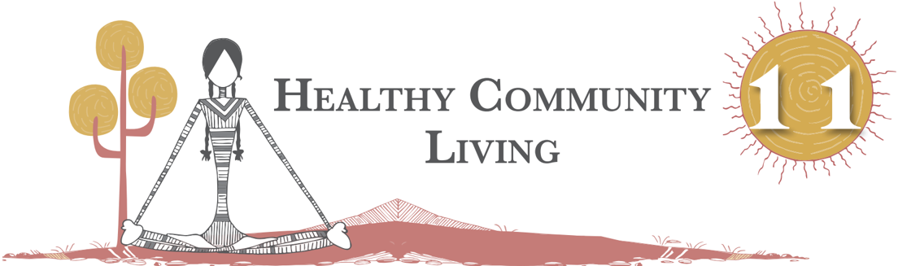
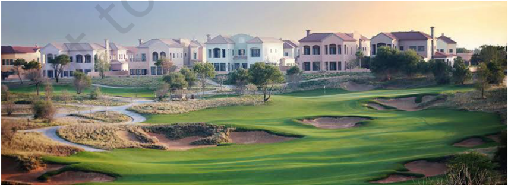
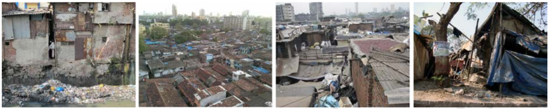
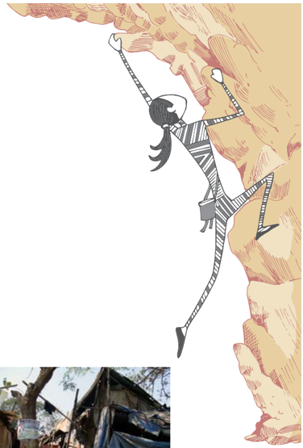
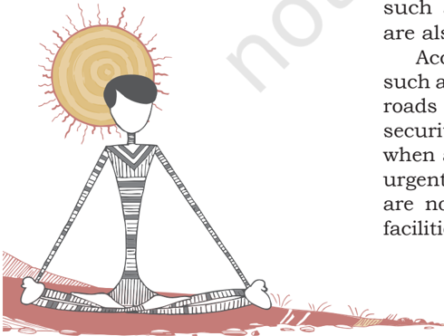
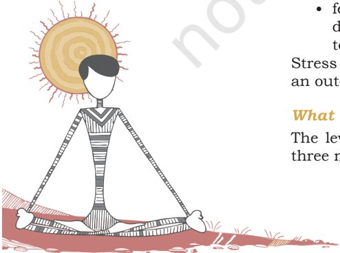
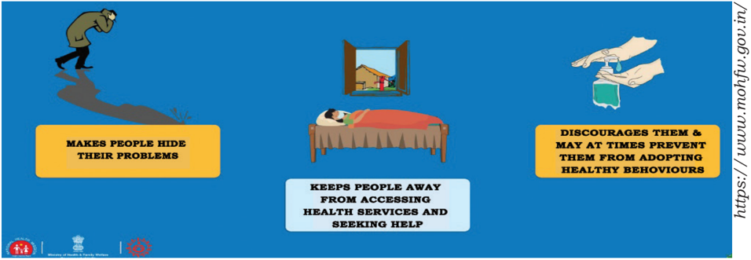
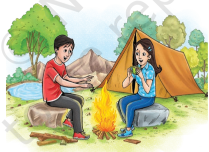
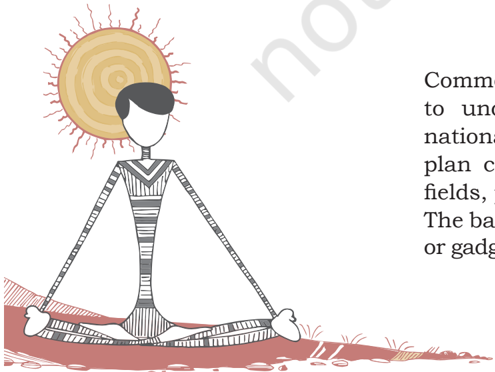
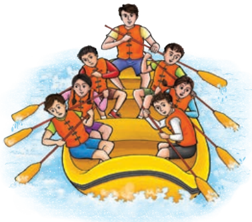

# PAGE 1

The quality of life in any community is a strong indicator of the  health  of  its  members.  Our  socio-economic  needs  are such that people depend upon each other as we cannot live in  isolation.  We  live  together  and  collectively  share  certain amenities  that  are  necessary  for  our  day-to-day  existence. In  the  previous  classes  (Class  VII  to  IX),  we  read  about  the negative  effects  of  unhygienic  or  filthy  surroundings  on  our health. Regular access to basic amenities, such as, clean water, sanitation,  garbage  disposal  facilities,  health  care  services, recreational facilities, etc., are important for prevention of  illnesses  and  diseases.  For  prevention  of  diseases  like coronavirus, maintaining of social distance is very important. In this chapter, the essential features of healthy community living including  social distancing during coronavirus will be discussed. The focus will also be on the principles of cooperative living to ensure healthy living conditions for one and all.

## HealtHy Community living

Our way of life, and the utilisation of resources, decide the quality of our personal and community life. A healthy way of living in the community is ensured not only by the optimal use of resources but also by keeping our environment clean and hygienic. Let us understand what is meant by healthy community living.

The  following  figures  show  community  life  in  three different situations -

1. A village (Fig 11.1)
2. A township in an urban area (Fig 11.2)
3. A slum in an urban area (Fig 11.3)

## A village

Mawlynnong Village in East Khasi Hills District of Meghalaya was declared as Asia's cleanest village in 2003 by Discover

# PAGE 2

194

India  Magazine.  It  is  about  75  km  away  from  Shillong, the capital of Meghalaya. Most of the houses in this village are  beautifully  decorated  with  flowers  and  plants.  As  per the  Census  of  2011,  the  total  population  of  Mawlynnong is  414. The main occupation of the villagers is agriculture, but  it  has  also  been  an  age  old  tradition  of  ensuring  that the surrounding environment is clean. In fact cleanliness is a collective effort and this practice is ingrained in the people since their childhood. The people voluntarily sweep the roads and  lanes,  water  the  plants  in  public  areas  and  clean  the drains.  A  dustbin  made  out  of  bamboo  is  found  all  along the  village.  Everyone  makes  it  a  point  that  dirt  and  waste are not thrown anywhere. All the waste from the dustbin is collected and kept in a pit, which the villagers use as manure. Trees are planted to restore and maintain nature's balance. Mawlynnong's fame as the cleanest village in Asia, is drawing a lot of domestic as well as international tourists, as a result of which tourism is also an important source of employment for the local youths. Besides, there are many interesting sights to  see  such  as  the  famous living root bridge in the nearby village of Riwai, which is a fascinating example of indigenous methods of conservation and sustainability. Local youths are available as enthusiastic and informative guides.

Fig. 11.1: Mawlynnong Village

## A township in an urban area

Fig. 11.2: A modern township

# PAGE 3

This  picture  is  of  a  modern  township  derived  from  an advertisement  in  a  national  newspaper.  Many  times, catchy slogans such as 'Get away from noise, pollution, congestion and a cramped life' are used by builders to sell their apartments. People are assured a safe and healthy environment  with  not  only  the  basic  amenities,  but also  other  features,  such  as,  shopping  arcades,  clubs, gymnasiums, gardens, clinics, food market, lots of open space, etc.

## A slum in an urban area

Fig. 11.3: A slum area

These pictures characterise life in a slum area in big cities. As you can see in the picture, people live in overcrowded houses surrounded by stagnant water which is a potential breeding ground for mosquitoes. We also find railway tracks adjacent to the houses which is dangerous for children and adults too. In addition, we find heaps of garbage scattered around the houses.

## Activity 11.2

You  may  conduct  a  survey  in  your  neighborhood  and  collect information on the following -

- Make a list of some of the basic amenities and community resources  that  are  collectively  shared  by  members  of  your community.
- Make a list of some of the community resources that are not available in your locality.
- On the basis of your observations and survey, complete the following table -

| Features appropriate or necessary for healthy community living                                                                                                          | Features not appropriate or necessary for healthy community living                                                                                                     |
|-------------------------------------------------------------------------------------------------------------------------------------------------------------------------|------------------------------------------------------------------------------------------------------------------------------------------------------------------------|
| 1. Water supply 2. .................................. 3. .................................. 4. .................................. 5. .................................. | 1. Open drains 2. .................................. 3. .................................. 4. .................................. 5. .................................. |

195

Activity 11.1

After observing the pictures, discuss the following -

- Do you think Mawlynnong Village is a successful example of healthy community living? Give reasons for your answers.
- Do you think modern townships as depicted in Fig 11.2, can offer its inhabitants a safe and healthy environment, as assured by the builders?
- The pictures shown in Fig 11.3, does not reflect signs of healthy community living. Do you agree? Give reasons for your answers.

# PAGE 4

196

These activities will enable you to understand various features of healthy community living. Through these activities, you may have observed that in a community, a group of people live in a particular local area. Secondly, they share common facilities, which differ from place to place. In some areas, people have access to facilities, such as,  water  supply,  sanitation,  garbage  disposal  facilities,  health care  services,  recreational  facilities,  community  centre,  schools, transportation, etc., but in some places people do not have access to even the most basic amenities.

A  community  is  said  to  be  healthy  when  its  members continuously work together to maintain, improve and expand the  available  natural  resources  and  avoid  their  wastage. The healthy community only be develped when its members recognise  their  roles  and  responsibilities.  They  strive  to inculcate values and attitudes of cooperation,  mutual respect, tolerance, kindness, etc. The role of Panchayati Raj, civil societies and other government institutions is also very important to promote healthy living.

## Important features of healthy community living

Maintaining cleanliness of our home and surroundings is an essential feature of healthy community living. Healthy community is one in which all residents have access to quality  education,  safe  and  healthy  homes,  adequate employment, transportation, physical activity and nutrition.  Living  in  overcrowded  and  unhygienic  places with  excessive  noise  and  pollution,  may  lead  to  various forms of illnesses, diseases and stress. For instance, lack of  adequate  space,  poor  ventilation  in  rooms  and  toxic fumes in the air, increase the risk of air borne diseases. Access to basic amenities such as regular water supply, safe  drinking  water  and  sanitation,  is  important  for healthy community living. In the previous classes (Classes VII  to  IX),  it  has  been  learnt  that  open  and  unattended garbage  dumps  are  a  potential  breeding  place  for  flies, cockroaches, insects and so on. Stagnant water and open drains breed mosquitoes, the carrier of diseases, such as, malaria, dengue and chikungunya. Water borne diseases, such  as,  cholera,  jaundice,  diarrhea  and  gastroenteritis are also resulted due to water pollution.

Access to basic amenities also includes other provisions such as electricity, hospitals, dispensaries, housing facilities, roads  and  transportation,  schools,  colleges,  employment, security, recreational facilities and so on. Imagine a situation when a member in the family falls seriously ill and requires urgent treatment. What would happen to this person if there are  no  hospitals  in  the  nearby  city,  or  no  transportation facilities to reach there?

# PAGE 5

To  ensure  these  basic  amenities,  the  role  of  the  local government or panchayats is very important. They are required to  ensure  rules  and  regulations  for  safety  measures,  cleanliness, ensure  equal  access  of  public  amenities  to  all  members, promote adoption of waste management practices, and help ecological restoration and conservation. However, we cannot depend  solely  on  the  government  to  take  the  initiative.  The quality of life in a community also depends on how the members of  the  community  work  to  improve  on  available  resources and ensure that the government provides for these facilities.

You might have seen this logo before. This is the  logo  of  the Swachh Bharat Abhiyan .  You must  have  also  seen  some  of  the  television advertisements through which the government advertises  the  importance  and  necessity  of staying  clean  and  keeping  our  environment clean. In this Clean India campaign - known popularly  as  the Swachh  Bharat  Abhiyan , the vision of a Clean and hygienic India, once seen by Mahatma Gandhi, can happen only if members  of  every  community  cooperate  and accept individual and collective responsibility of keeping themselves, their homes and their surroundings clean.

In  order  to  work  collectively,  members  of  a  community need to develop values of co-operation, kindness, respect, gratitude, joy, peace and selflessness. These attributes are important in fostering the principles of collective work and in  nurturing  healthy  social  relationships.  The  example of  Mawlynnong  village  shows  that  high  income  alone is  not  the  only  criterion  for  healthy  living.  Cooperative action, responsibility and positive values can also help in improving the quality of life, and healthy living conditions for one and all.

## Prevention of Coronavirus: soCial DistanCing anD Dealing witH stigma

## Prevention through social distancing

Social Distancing: Deliberately increasing the physical space between  people  to  avoid  spreading  illness  and  staying  at least one meter away from other person decreases chances of catching coronavirus (COVID-19).

## Social distancing: Dos

- Stay at home unless absolutely necessary.
- Keep a distance of at least one meter between yourself and another person.

197

# PAGE 6

198

## Social distancing: Don'ts

- Do  not  hold  events  where  people  have  to  gather (even if it is a corner meeting with three or four friends, or an evening chat on the chaupal).
- Do not go to crowded places like markets, shopping, melas, parties.
- Do not use public transport.

Courtesy: https://www.mohfw.gov.in/

Fig. 11.4: Social distancing dos and don'ts

## Dealing with the stigma

## What is stigma?

In any epidemic, it is common for individuals to feel stressed and worried because they fear -

- falling ill and dying.
- approaching health facilities due to fear of becoming infected while in care.
- losing  livelihoods,  not  being  able  to  work  during isolation, and of being dismissed from work.
- being socially excluded or placed in quarantine because of being associated with the disease.
- feeling powerless in protecting loved ones and fear of losing loved ones because of the virus or being separated during quarantine.
- feelings of helplessness, boredom, loneliness and depression  due  to  being  isolated  and  not  working towards caring for a dependent.

Stress is caused due to the above fears and being treated as an outcaste or blamed for spreading the disease.

## What is the reason behind the stigma?

The level of stigma associated with COVID-19 is based on three main factors -

# PAGE 7

- COVID-19 is a new disease about which many things are still being discovered.
- When something is unknown people are worried which leads to fear.
- Rumours  or  fake  news  give  wrong  information  and spreads the fear.

## Recognising the stigma

It is very important to recognise stigma and handle it. Below are four case studies related to these issues. Read these case studies and recognise the stigma.

## CASE 1

You are in the grocery shop, there are several people who are wearing a mask. You see Babulal, the store owner, going red in his face as he tries to suppress a cough.

## CASE 2

Sukhram  has  come  back  from  Pune  where  he  works  as  a taxi  driver.  They  stay  in  a  joint  family  and  you  have  taken his contact history as advised by your supervisor. You come to know that Sukhram's family members have asked him to leave the house.

## CASE 3

Beauty works in Delhi as a house maid. recently she has come back and you have been told that beauty's employers have asked her to leave as she had a cold.

## CASE 4

Surali  is  a  young  girl  of  11  years.  She  and  her  8-year-old brother  are  staying  with  an  aunt  as  their  parents  have been  asked  to  go  in  for  isolation.  Surali's  aunt  keeps  on complaining to you that the children are a big burden on the family's resources.

## What will you feel like if you were Babulal, Rani, Sukhram and Beauty?

- Babulal  has  simple  cough.  But  he  is  too  scared  to cough in front of people as he will loose the customers.
- Sukhram  needs  family  support  to  help  him  stay  in isolation.  If  everyone  takes  proper  precautions  the infection need not spread.
- Beauty has a seasonal cold but she has been asked to leave by her employers.
- Surali and her brother are two small children who need to  be  supported  and  this  kind  of  incident  can  cause mental stress even in the future. Child Protection Cell (CPC)  should  be  approached  for  appropriate  measures for helping children in difficult situations.

199

# PAGE 8

Fig. 11.5: What does stigma do?

## values anD attituDes ConDuCive for HealtHy anD CooPerative living

How to develop values and attitudes conducive for healthy and cooperative living? These values have to emanate from within a  person,  but  they  can  also  be  developed  through  various other ways. Camping can be seen as one of these ways which is extremely appropriate for students, particularly during the adolescent period.

What is camping?

200

Fig. 11.6: Camping

Youngsters might have already attended a  camp  or  may  have heard about camping activities from friends. Camping  is  an  outdoor activity,  where  familiar surroundings are left to spend a night or several nights at an outdoor site. The location of these sites varies as per the objectives of the trip,  time  of  the  year and budget available.

Common camping sites are: visits to villages or rural areas to  understand  their  pattern  of  living;  mountain  areas, national  parks,  lakes,  beaches,  forests,  etc.  One  can  also plan  camping  activities  in  a  nearby  place,  such  as,  open fields, park, or even in an open space of the school premises. The basic camping equipment include tents, cooking utensils or gadgets, sleeping bags, first aid kits, ropes, insect repellents,

# PAGE 9

etc. These requirements will vary as per the location of the camping site and objectives of the trip. However, irrespective of the location, the essence of all camping activities revolves around two main features -

- (i)  Bonding with nature
- (ii)  Importance of living in a community.

## Importance of camping

Camping  gives  students  a  good  break,  away  from  the monotony  of  the  classroom.  It  gives  an  opportunity  to learn from nature in a joyful, exciting and adventurous manner. Living in the natural environment with students from different areas, cultures, religions and backgrounds, help then to learn to work as a team in various activities. These activities differ from adventurous and challenging ones, to the most basic ones, such as, cooking, cleaning, collecting water, etc. In this process, students learn the importance of self-reliance, teamwork, co-existence, importance of natural resources and organisational skills. Camping also offers great opportunities for empowerment of the girls.

Fig. 11.7: Trekking

Fig. 11.8: Mountaineering

While  camping,  one  can  engage  in  adventure  sport, such  as,  trekking,  river  rafting,  mountaineering,  rock climbing,  repelling,  paragliding,  caving.  Adventure  sport help to develop courage, self-confidence, leadership qualities and enhance concentration powers. This is also a great form of physical exercise. However, these activities should be conducted only in the presence of qualified and professional  trainers.  Joining  the  National  Cadet  Corps (NCC),  National  Service  Scheme  (NSS)  or  Bharat  Scouts and Guides will also give you opportunities to take part in these activities.

201

Fig. 11.9: Rock climbing

# PAGE 10

## 202

## Activity 11.3

Some of the camping activities have been given in the following table. Write down the qualities which can be developed through the respective activities. You may consult other sources for your answers.

Fig. 11.10: Zipline

| Activities                                                                                                                                      | Qualities developed                           |
|-------------------------------------------------------------------------------------------------------------------------------------------------|-----------------------------------------------|
| Hiking, rock climbing, trekking, rope climbing, river rafting, etc.                                                                             | Confidence, leadership qualities, team - work |
| Nature walk                                                                                                                                     |                                               |
| Cultural activities - patriotic songs, lectures on Indian culture and heritage through dance, drama, songs, story telling, skits, quizzes, etc. |                                               |
| Campfire -story telling that emphasize on moral values based on local folk tales, history, games and songs.                                     |                                               |
| Interaction with local community members on local crafts, medicines, first aid, food, etc.                                                      |                                               |
| Yoga                                                                                                                                            |                                               |
| Voluntary services                                                                                                                              |                                               |

Fig. 11.11: River rafting

A  guided  walk  through  the  forest  helps  to  explore nature.  It  can  also  complement  much  of  the  textual  data in  your  geography  and  science  textbooks  through  direct experiences. At the same time, learn to appreciate the beauty and simplicity of nature to make all understand how much disconnected from 'Mother Earth one has become.' You realise the importance of nature and how we should take care of it. Moreover, through interaction with local communities, one learns about edible and medicinal plants, local crafts, firstaid and various other sustainable forms of living.

During the evenings all may gather around campfires which give  a  great  opportunity  for  social  bonding.  Campfires  also enable to learn about different cultures through story telling, songs, dances, skits and games. On many occasions hidden talents of individuals are brought out during these activities.

# PAGE 11

## assessment

## I.  Multiple Choice Questions

1.  Which of the following is the most important criterion for healthy community living?
- a)  Cooperative action
- b)  Kindness
- c)  Harmony
- d)  Safety measures
2.  Community participation is essential for \_\_\_\_\_\_\_\_\_\_\_\_\_\_\_\_.
- a)  ecological restoration
- b)  public hygiene and health
- c)  social harmony
- d)  All of the above

## II.  State whether True or false

- a)  Maintenance of public hygiene is the sole responsibility of the government.
- b)  Community health and individual health are closely interlinked
- c)  Camping is the only means for developing values of cooperative living
- d)  Overcrowding increases the risk to air borne diseases
- e)  Interpersonal relationships are as important as our physical environment.

## III. Answer the following Questions

1.  What  is  your  vision  of  a  healthy  community?  Give  at  least  3 examples.
2.  A camping trip has been arranged by your school. Two girls from your  community  are  not  allowed  to  go  for  the  trip.  What  are the points you would highlight to convince the parents on the importance of camping trip for girls.
3.  Arrange  a  collage  of  pictures  showing  various  activities  in  a Camping Trip.
4.  Give  two  suggestions  for  keeping  your  community  healthy, both at the individual and collective level, based on the points enumerated below.

For example,

Record your suggestions regarding cleanliness drive within the community. The first one has been done for you.

I will ensure that, I do not throw litter around.

We  will  ensure  that,  there  are  no  open  garbage  dumps  in  the community.

203

# PAGE 12

204

- a)  Record your suggestions regarding rules and regulations within the community for safety measures. I will ensure that \_\_\_\_\_\_\_\_\_\_\_\_\_\_\_\_\_\_\_\_\_\_\_\_\_\_\_\_\_\_\_\_\_\_\_\_\_\_\_\_\_\_\_\_ . We will ensure that \_\_\_\_\_\_\_\_\_\_\_\_\_\_\_\_\_\_\_\_\_\_\_\_\_\_\_\_\_\_\_\_\_\_\_\_\_\_\_\_\_\_ .

- b)  Record  your  suggestions  for  ensuring  equal  access  of  public amenities to all members. I will ensure that  \_\_\_\_\_\_\_\_\_\_\_\_\_\_\_\_\_\_\_\_\_\_\_\_\_\_\_\_\_\_\_\_\_\_\_\_\_\_\_\_\_\_\_\_ . We will ensure that  \_\_\_\_\_\_\_\_\_\_\_\_\_\_\_\_\_\_\_\_\_\_\_\_\_\_\_\_\_\_\_\_\_\_\_\_\_\_\_\_\_\_ .

- c)  Record your suggestions for adopting effective waste management practices. I will ensure that  \_\_\_\_\_\_\_\_\_\_\_\_\_\_\_\_\_\_\_\_\_\_\_\_\_\_\_\_\_\_\_\_\_\_\_\_\_\_\_\_\_\_\_\_ . We will ensure that  \_\_\_\_\_\_\_\_\_\_\_\_\_\_\_\_\_\_\_\_\_\_\_\_\_\_\_\_\_\_\_\_\_\_\_\_\_\_\_\_\_\_ .

- d)  Record your suggestions for ecological restoration and conservation within your community. I will ensure that  \_\_\_\_\_\_\_\_\_\_\_\_\_\_\_\_\_\_\_\_\_\_\_\_\_\_\_\_\_\_\_\_\_\_\_\_\_\_\_\_\_\_\_\_ . We will ensure that  \_\_\_\_\_\_\_\_\_\_\_\_\_\_\_\_\_\_\_\_\_\_\_\_\_\_\_\_\_\_\_\_\_\_\_\_\_\_\_\_\_\_ .

- e)  Record your suggestions for ensuring kindness and consideration to the aged and differently abled. I will ensure that  \_\_\_\_\_\_\_\_\_\_\_\_\_\_\_\_\_\_\_\_\_\_\_\_\_\_\_\_\_\_\_\_\_\_\_\_\_\_\_\_\_\_\_\_ . We will ensure that  \_\_\_\_\_\_\_\_\_\_\_\_\_\_\_\_\_\_\_\_\_\_\_\_\_\_\_\_\_\_\_\_\_\_\_\_\_\_\_\_\_\_ .

- f)  Record your suggestions for counseling provisions for the youth, recreational facilities, etc. I will arrange for   \_\_\_\_\_\_\_\_\_\_\_\_\_\_\_\_\_\_\_\_\_\_\_\_\_\_\_\_\_\_\_\_\_\_\_\_\_\_\_\_\_\_\_\_\_ . We will arrange for   \_\_\_\_\_\_\_\_\_\_\_\_\_\_\_\_\_\_\_\_\_\_\_\_\_\_\_\_\_\_\_\_\_\_\_\_\_\_\_\_\_\_ .

10.  Imagine that you have been asked to prepare an activity schedule for a day in a camping trip. First write down the location of the camping site and objectives of the camping trip and include other details in the following table.

Location of camping site  \_\_\_\_\_\_\_\_\_\_\_\_\_\_\_\_\_\_\_\_\_\_\_\_\_\_\_\_\_\_\_\_\_\_\_\_\_ . Objectives of the camping trip   \_\_\_\_\_\_\_\_\_\_\_\_\_\_\_\_\_\_\_\_\_\_\_\_\_\_\_\_\_\_\_\_ .

Table : Schedule for a camping trip

| Time   | Activities   | Equipment Required   | No. of participants   | No. of Teachers/ Instructors   | Expected Outcome   | Budget   |
|--------|--------------|----------------------|-----------------------|--------------------------------|--------------------|----------|