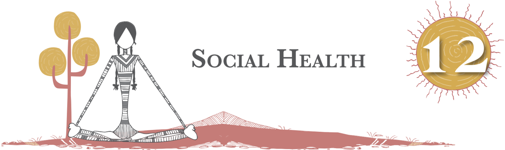
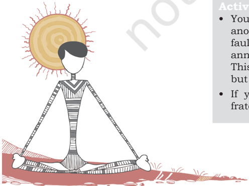
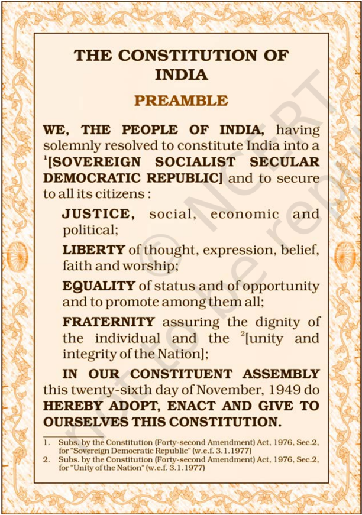
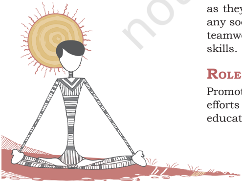
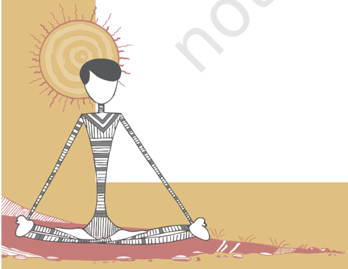

# PAGE 1

You have already learnt that, 'Health is a state of complete well-being  and  includes  physical,  mental,  emotional  and social health, Many animals show remarkable social behavior. Humans too are social animals and much of their behaviour is based on social norms laid down by the human societies since time immemorial.

Therefore,  social  health  is  a  very  important  issue  for all  human  beings  -  men-women,  young-old,  educateduneducated, rich-poor. Those children who learn to become socially healthy remain so all their lives. This chapter, will deal with the ways and means of growing up as socially healthy individuals and also helping them to clarify myths related to coronavirus.

## Myths and facts related to coronavirus

Statement: A person with coronavirus can recover fully and not be infectious any longer.

Fact: 80 per cent of the people have recovered from the disease without needing special treatment. But information on the virus treatment is still being researched.

Statement: Eating  raw  garlic,  sesame  seeds  will  protect  you against the virus.

Fact: Garlic is a healthy food that has other benefits but does not protect you against the coronavirus.

Statement: The virus can die easily once it is out of the body.

Fact: We  do  not  know  about  this  particular  virus  as  of  now. Similar  viruses  (SARS,  MERS)  survive  from  8  to  24  hours depending on types of surfaces.

Statement: You can get COVID-19 through mosquito bites Fact: The coronavirus cannot be spread through the bite of a mosquito. It is spread thorough droplets spread when an infected person sneezes or coughs.

After learning this lesson one should be able to explain what is social health, help all to remain socially healthy and spread awareness about benefits of social health.

# PAGE 2

206

## What is social health?

## Activity 12.1

Read the following conversation between an old grandfather, Mr. Das and 12-year-old grandson's friend Ravi.

Mr. Das   :

How are you Ravi and how is your grandfather?

Ravi :

I am fine but my grandfather always feels angry and unhappy. He criticises everyone all the time, so no one wants to sit and talk with him. He is boring and not as loving as you are. Why does he behave like that Dadu?

Mr. Das   : It is because he has been unwell for a long time. Your grandpa is not getting company from any one, this makes him feel lonely and isolated. In other words, he is suffering physically, as well as mentally due to his old age. He gets angry because he is unsure of himself now and annoys others by his comments. He does not think that he is acceptable in society now.

Which is why, he expresses his frustrations by being

rude to others without any reason and fault of theirs. Why don't you spend time with him? Talk to him about  your  friends,  your  day  in  school,  a  happy incident, a sad one also and you may observe the change in him within a few days.

Ravi

: Thank you, Dadu. Now I understand that if someone is sick and emotionally unhappy, he would likely be angry and alienate others.

## Answer in brief

1.  Give reasons for the loneliness of Ravi's grandfather.
2.  State situations that made Ravi think his grandfather was alienating others.
3.  Say yes or no
4. (a) Do you agree that physical, mental and social health are interrelated?
5. (b)  Living with others harmoniously requires a person to  be  socially  healthy.  State  the  reason  for  your choice.

## Activity 12.2

- You are in a tricky situation. Your best friend had a fight with another friend and you have seen that your best friend is at fault. You are asked to intervene to bring back peace. Will you announce that the cause of the fight was your best friend? This may become a source of annoyance to your best friend but if you did, that is Justice.
- If  you  help,  the  two  boys  become  friends  again,  that  is fraternity.

# PAGE 3

- Your friend Arun noticed that food was being distributed free of charge on the footpath. A boy wearing tattered dirty clothes was repeatedly being sent to the end of the queue. Arun held the boy's hand and insisted that the boy be given the food packet then and there and not at the end. Arun believed in Equality of opportunity for all.
- If  you  listen  carefully  to  others  opinions  on  a  subject  even if  they  do  not  match  yours  and  try  to  understand  others' viewpoints, you believe in liberty.

Read the preamble to the constitution of India given at the beginning of all NCERT text books. It is reprinted here for you. (photocopy of preamble of constitution).

Fig. 12.1: Preamble to the Constitution of India

207

S OCIAL HEALT H

# PAGE 4

208

Everyone is a member of a social group and everyone is  part  of  their  peer  group,  family  and  kin,  community, city,  region  and  country,  as  well  as  the  physical  and biological environment. Would you agree that the country's constitution  provides  for  Justice,  Liberty,  Equality  and Fraternity which should be adopted in life for living happily and having consideration for all others in the group? Let us understand these four terms of our constitution which are directly related to 'social health of a person or a country', and then try to define social health. In other words, if one is socially healthy, than will be able to develop interpersonal relations,  through  maintaining  equality,  fraternity  and justice.

Let us now try and define social health.

## Definition of 'social health'

Social health may be defined as the ability to form satisfying interpersonal relationships with others. One  who  is  able  to make positive relationships and acquires the ability to adapt in  different  social  situations  and  act  appropriately  as  per the situation concerned, and can be called a socially healthy person.

## Need for developing social health

Primitive humans were hunter-gatherers, who lived in small groups or clusters and spent their lives at individual levels. Around 10,000 years ago, they moved near rivers to grow their own food and began to live together. With the passage of  time,  they  started  to  live  in  a  society  and  developed  a language for interaction with each other. As 'human society' progressed, an individual became part of many social groups for example a member of a peer group, a family and kin, a class in school, a native of a region and a citizen of one's country. Social changes occur from time to time and many societies lay  down norms and values for group living. Urbanisation has brought about many changes which are different from traditional rural societies.

Social  attributes,  of  people  however,  remain  the  same as they are based on interrelationship between members of any society and necessary for accomplishing tasks requiring teamwork. School is one of the platforms for learning social skills.

## Role of vaRious institutions

Promotion of social health among children requires collective efforts  and  appropriate  skills.  All  people  in  the  field  of education have to think about this.

# PAGE 5

## Role of teacher training institutes and other organisations

School teachers need a degree, diploma or certificates from a teacher training institute. There are a number of organisation concerned  with  school  education.  The  syllabus  of  teacher training  courses  should  include  the  topics  of  important issues for children of which health should be one.

Organisations  such  as  NCERT,  SCERT,  DIET  should periodically organise workshops, publish journals and provide  inservice  training  programmes  on  health  issues including social health.

## Role of schools in promoting social health

Schools have a very significant role to play in the promotion of  health  and  safety  of  children.  They  spend  a  lot  of  time in  school  in  early  years.  School  environment  forms  ideal setting for acquiring knowledge of healthy choices of food. It is in school that they participate in physical activity through sports, games, yoga, gymnastics, exercise and gain benefits of  each.  School  helps  children  to  learn  social  skills  which assist  in  establishing  lifelong  healthy  behavior.  Children learn  team  spirit  and  training  in  rules  and  regulations  of social  wellbeing  just  as  in  the  defense  services,  which  are inbuilt in training of defense service personnel, so they work together as a team to protect our nation.

In  order  to  promote  social  health,  the  school  should have  a  positive  environment  where  children  mingle  with teachers, peer group and non-teaching staff without fear and apprehensions. Teacher have a significant role in this regard.

## Role of teachers

It is well known that teachers are the mentors and therefore, the  teacher  training  institutes  should  make  training  in leadership and mentorship a part of teacher training. Also well known saying that 'example in better than precept' Students easily  learn  to  be  socially  healthy  if  the  teacher  herself  or himself sets an example rather than lecture on social health. A good teacher ensures that students grow up into physically, mentally and socially healthy individuals. In doing this the teacher has to make efforts to ensure that students -

- (i)  eat  a  proper  diet  and  perform  regular  exercise  and physical  activity  which  are  requirements  of  good physical health.
- (ii)  inculcate  friendship  between  classmates,  indulge in  amicable  behavior  with  others  in  school  so  that students develop a helpful nature. These are necessary for mental and emotional health.

209

S OCIAL HEALT H

# PAGE 6

210

3. Teachers should train students in learning life skills like -
- a)  empathy and self awareness
- b)  effective  communication  so  that  they  develop healthy Interpersonal relationships
- c)  problem-solving and decision-making to learn to be stress free
- d)  creative and critical thinking
- e)  coping with stress and emotion.

The above are absolutely essential for developing social skills in order to be socially healthy.

Social skills help a student to have a desirable self image and self esteem and also self confidence. This makes children acquire ability to live harmoniously in the society.

## Role of technology in building social health

Technology  has  made  communication  convenient  through Mobiles,  Skype,  Facebook,  Twitter,  Instagram  and  E-mail messages.  Knowledge  about  different  media  can  help  to develop  the  skills  to  access  the  appropriate  media  for accurate  information  on  a  specific  topic  or  issues.  More so,  because  media  brings  awareness,  and  provides  access to  global  knowledge  and  learning.  But  refrain  from  using mobiles and viewing the T.V. for long periods as that tends to  be  counter-productive  and  reduce  interaction  time  with others. This makes us socially withdrawn. Although media is a source of information, all of it may not be true or reliable. It  is  advisable to seek guidenes from a trusted adult while accessing media and internet. Moreover, there is a need to understand about real and fake news or information as these affects our attitude and behavior.

## Role of students in building habits of social health

Social  health  comes  from  social  skills.  A  few  important guidelines for promoting social skills are outlined below.

- (i) Building self awareness is an important skill: Practice self-care  by  developing  habits  of  cleanliness  and hygiene, keeping away from substance abuse, engaging in physical activity and regularly consuming a balanced diet.
- (ii) Do not be blameful and judgmental: Remember when you  point  a  finger  at  others,  three  fingers  of  yours point towards you. Hence indulge in knowing yourself better.  It  helps  to  discriminate  between  a  good and a bad act of yours and helps to make friends. Empathy  and  self  awareness  go  hand  in  hand. When  you  seea  child  hitting  an  animal,  tell  that

# PAGE 7

- child that if they were hit, they would feel the same pain.  That  is  empathy  for  others  and  leads  to  self awareness.
- (iii) Learn to identify your own mistakes: There is no harm in saying sorry for a mistake and rectifying it. People will have faith in you if you did so.
- (iv) Make an effort to reconnect with old relationships and friendships: The  socially  healthy  person  makes  an effort to contact and meet old friends, to remember enjoyable periods of childhood which can be a good way to beat stress and spend leisure time.
- (v) Appreciate yourself and others: But never let your ego rule your behaviour which can sometimes drive you to lose a relationship.
- (vi) Try and be respectful, positive and supportive towards the needy, the physically and mentally challenged, the downtrodden and those belonging to faith and cultures other than yours. Lend an ear to others opinion. It teaches  tolerance.  Tolerance  and  appreciation  are virtues in socially healthy individuals.

## Role of family in inculcating social skills in young family members

The importance of family in inculcating social skills among, children is paramount. Guardians or parents are the prime teachers and caretakers who feed them healthy food and are also their play mates. They have to be aware themselves to be role model and make children appreciate as they grow. The  benefits  of  enjoying  nutritious  food  and  being  aware of  a  balanced  diet  is  of  paramount  importance.  Watching of television for longer duration is bad for students. Parents  themselves  have  to  be  cautious  in  what  they  do in  front  of  children  and  how  long  they  are  in  front  of  the TV.  However,  at  the  same  time  good  TV  programmes  are an  avenue  for  learning.  Encourage  them  to  indulge  in physical activity to build their muscles and bones. Fit body and  fitness  depends  primarily  on  proper  diet  and  healthy body  and  mind.  The  parents  and  elder  family  members need  to  guide  them  in  social  skills.  Parents  and  elders have  to  be  accessible  to  children  for  necessary  guidance. They  form a 'safety network'. They are to guide adolescents through  advice,  answer  their  queries  and  occupy  them through  activities  to  keep  them  away  from  involvement in  addictive  substances  like  tobacco,  drugs  and  alcohol which they might believe are helpful in tiding over stress. However, these substances have deleterious effects on the growing body.

211

# PAGE 8

212

## What aRe life skills?

These are -

- Empathy: Is the ability to understand another's feelings in a particular situation.
- Self Awareness: Is the recognition of one's character, strengths, areas of growth, beliefs and values.
- Effective Communication: Is having skills of communication that facilitate interaction with people in positive ways.
- Interpersonal  Relationships: Building  relationships  of friendship and goodwill with all others.
- Problem solving: Is the ability to resolve challenges.
- Decision Making: Is the quality of analyzing problem to find and act to reach an appropriate solution.
- Creative thinking: Is  the  ability  to  do  something  in  a novel manner.
- Critical  Thinking: Is  the  capacity  to  analyse  multiple perspectives and objectively evaluate the same.
- Coping with Stress and emotional distress: These refer to management and regulation of one's emotions and moments of stress.

All these life skills help to develop desirable social health and live happily in a society.

1. The  teacher  needs  to  play  an  active  role  in  discouraging her  students  from  engaging  in  socially  unhealthy practices  such  as  vindictive  attitudes,  selfishness, jealousy and culture of hatred. For this, teacher has to sacrifice time and energy. It is however, necessary for a teacher and school authorities to understand that more than finishing the syllabus and passing exams, it is the teacher's responsibility to build good human beings. Home has a large role to play but it  has  been  the  mission  of  teachers  to  contribute towards  grooming  students  into  socially  healthy adults
2. Another role of a teacher in inculcating 'social health' is to have a friendly, stress-free atmosphere in class. This  can  happen  if  students  are  engaged  in  'group activities', especially activities for 'experiential learning'.  Members  of  groups  are  reshuffled  from time  to  time  for  team  activities  so  that  students may understand that it takes all kinds of people to make the world and the socially healthy groups can live in harmony despite differing in opinions. Group activities build team spirit and remove boredom.

# PAGE 9

## iDeas foR PRomoting social health of stuDents

1. If  there  is  a  canteen,  permit  sale  of  healthy  food like fruits or fruit juices. School authorities should be aware as to what is being sold for consumption immediately  outside  school  and  permit  only  those selling  healthy  eatables  or  low  fat  and  healthy snacks.
2. Provide for safe drinking water.
3. Provide  for  examination  and  treatment  of  students with  poor  health  conditions,  bad  teeth  and  weak vision. Organise health checks for them.
4. Organise variety of co-curricular activities, and ensure participation of maximum number of students, and training them leadership as well as team spirit.
5. Organise  interclass  sport  and  games  competitions and  finally,  a  sport  day  and  prize  distribution  for encouragement.
6. Include a games period every working day in the time table.
7. Seek  and  insist  on  cooperation  of  parents  so  that even  guardians  who  have  not  learnt  social  skills and have unhealthy habits may learn through their participation. It shall be community  service by the  school  and  a  means  to  encourage  everyone  to undertake healthy living.
8. Have events for teaching and non teaching staff and allow voluntary participation in games using school equipment.
9. Have experts for teaching Yoga, Taekwondo, Judo and Karate for self-defense and utilise school premises for the same.
10. Schools  can  have  activities  involving  children  to learn to love and respect all living beings, plants and animals.
11. Encourage team games, 'House system' should be  adopted,  which  helps  children  to  interact  with students of other classes too.
12. Organise periodic slide shows or movies with valuable messages.

In  this  manner  students,  teachers,  parents  and  community will  realise  the  benefits  of  being  physically,  mentally  and socially healthy. And what a great way it will be to build a healthy nation!

213

# PAGE 10

214

## assessment

## I.  Answer the following Questions

1.  Define
- a)  Health
- b)  Mental health
- c)  Social health
2.  What do you mean by life skills? Enlist them.
3.  What are the characteristics of a socially healthy person?
4.  Suggest three ways in which social health can be promoted in children by each of the following -
- a)  School
- b)  Teachers
- c)  Family
5.  Write a short story of your choice to express life skills.
6.  What kind of society do you envisage if majority of its members are socially healthy?