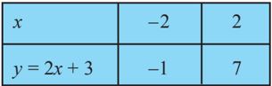
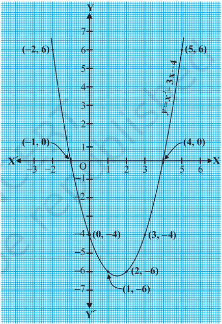
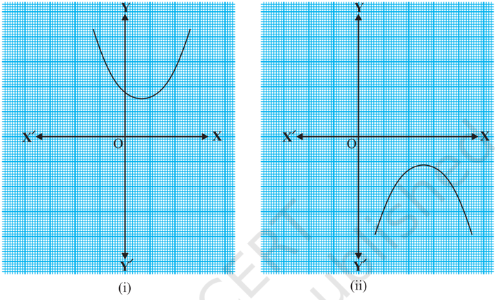
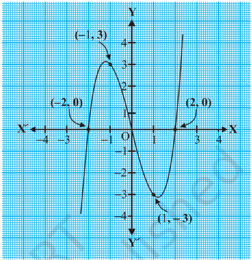
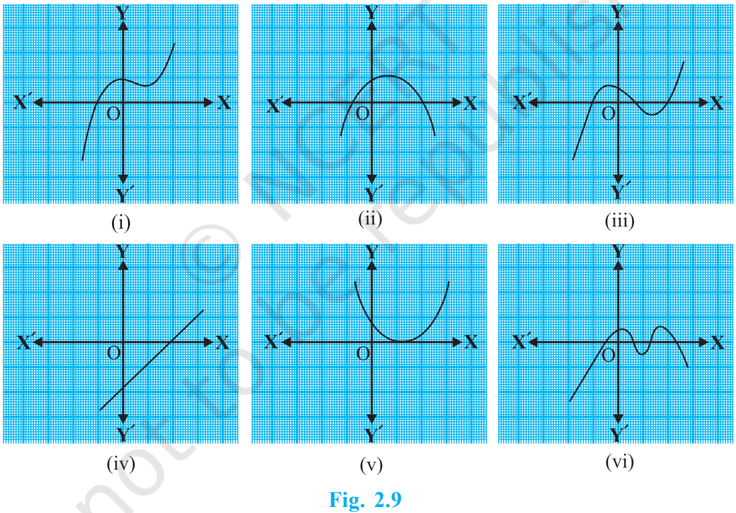
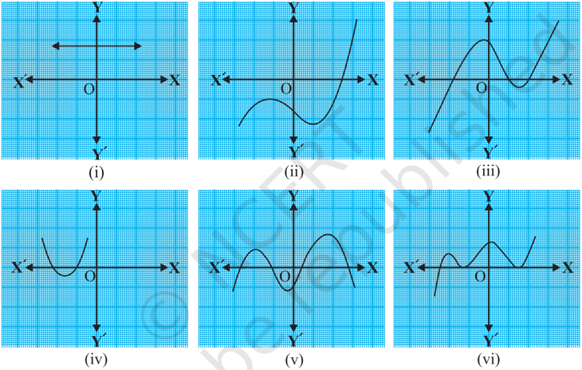

# PAGE 1

10

## 2.1 Introduction

In Class IX, you have studied polynomials in one variable and their degrees. Recall that if p ( x ) is a polynomial in x , the highest power of x in p ( x ) is called the degree of the  polynomial p ( x ).  For  example,  4 x +  2  is  a  polynomial  in  the  variable x of degree 1, 2 y 2 - 3 y + 4 is a polynomial in the variable y of degree 2, 5 x 3 - 4 x 2 + x -2

is a polynomial in the variable x of degree 3 and 7 u 6 -4 2 3 4 8 2 u u u    is a polynomial in the variable u of degree 6. Expressions like 1 1 x  , 2 x  , 2 1 2 3 x x   etc., are not polynomials.

A polynomial of degree 1 is called a linear polynomial . For example, 2 x - 3, 3 5, x  2 y  , 2 11 x  ,  3 z + 4, 2 1 3 u  , etc.,  are all linear polynomials. Polynomials such as 2 x + 5 x 2 , x 3 + 1, etc., are not linear polynomials.

A polynomial of degree 2 is called a quadratic polynomial . The name 'quadratic' has been derived from the word 'quadrate', which means 'square'. 2 2 , 2 3 5 x x  

$$y ^ { 2 } - 2 , \, ^ { u } 2 - x ^ { 2 } + \sqrt { 3 } x , \, \frac { u } { 3 } - 2 u ^ { 2 } + 5 , \sqrt { 5 } v ^ { 2 } - \frac { 2 } { 3 } v , 4 z ^ { 2 } + \frac { 1 } { 7 } \text { are some examples of }$$

quadratic polynomials (whose coefficients are real numbers). More generally, any quadratic polynomial in x is of the form ax 2 + bx + c , where a , b , c are real numbers and a  0. A polynomial of degree 3 is called a cubic polynomial . Some examples of

## POLYNOMIALS

MATHEMATICS

2

# PAGE 2

a cubic polynomial are 2 x 3 , x 3 , 3 2 , x 3 x 2 + x 3 , 3 x 3  - 2 x 2 + x - 1. In fact, the most general form of a cubic polynomial is

$$a x ^ { 3 } + b x ^ { 2 } + c x + d ,$$

where, a , b , c , d are real numbers and a  0.

Now consider the polynomial p ( x )  = x 2 -  3 x -  4.  Then,  putting x =  2  in  the polynomial, we get p (2) = 2 2 - 3 × 2 - 4 = - 6. The value '- 6', obtained by replacing x by 2 in x 2 - 3 x - 4, is the value of x 2 - 3 x - 4 at x = 2. Similarly, p (0) is the value of p ( x ) at x = 0, which is - 4.

If p ( x ) is a polynomial in x , and if k is any real number, then the value obtained by replacing x by k in p ( x ), is called the value of p ( x ) at x = k , and is denoted by p ( k ).

What is the value of p ( x ) = x 2  -3 x - 4 at x = -1? We have :

$$p ( - 1 ) = ( - 1 ) ^ { 2 } - \{ 3 \times ( - 1 ) \} - 4 = 0$$

Also, note that p (4) = 4 2 - (3  4) - 4 = 0.

As p (-1)  =  0  and p (4)  =  0,  -1  and  4  are  called  the  zeroes  of  the  quadratic polynomial x 2 -  3 x -  4.  More generally, a real number k is  said to be a zero of a polynomial p ( x ) , if p ( k ) = 0.

You have already studied in Class IX, how to find the zeroes of a linear polynomial. For example, if k is a zero of p ( x ) = 2 x + 3, then p ( k ) = 0 gives us

$$2 k + 3 = 0 , i . e . , k = - \frac { 3 } { 2 } \cdot \cdot \cdot$$

$$2 k + 3 = 0 , 1 . e . , \kappa - 2 \left ( 2 \right ) \\ \text {In general, if } k \text { is a zero of } p ( x ) \equiv a x + b , \text { then } p ( k ) = a k + b = 0 , \text { i.e., } k = \frac { - b } { a } \cdot \\$$

So, the zero of the linear polynomial ax + b is (Constant term) Coefficient of b a x    .

Thus, the zero of a linear polynomial is related to its coefficients. Does this happen in the case of other polynomials too? For example, are the zeroes of a quadratic polynomial also related to its coefficients?

In this chapter, we will try to answer these questions. We will also study the division algorithm for polynomials.

## 2.2 Geometrical Meaning of the Zeroes of a Polynomial

You know that a real number k is a zero of the polynomial p ( x ) if p ( k ) = 0. But why are the zeroes of a polynomial so important? To answer this, first we will see the geometrical representations of linear and quadratic polynomials and the geometrical meaning of their zeroes.

# PAGE 3

Consider first a linear polynomial ax + b , a  0. You have studied in Class IX that the graph of y = ax + b is a straight line. For example, the graph of y = 2 x + 3 is a straight line passing through the points (- 2, -1) and (2, 7).

| x           |   -2 |   2 |
|-------------|------|-----|
| y = 2 x + 3 |   -1 |   7 |

From Fig. 2.1, you can see that  the  graph  of y =  2 x +  3 intersects  the x - axis  mid-way between x =  -1  and x =  - 2, that  is,  at  the  point 3 , 0 2      .

  You also know that the zero of

2 x + 3 is 3 2  .  Thus, the zero of the  polynomial  2 x +  3  is  the x -coordinate of the point where the graph of y = 2 x + 3 intersects the x -axis.

Fig.  2.1

In general, for a linear polynomial ax + b , a  0, the graph of y = ax + b is a straight  line  which  intersects  the x -axis  at  exactly  one  point,  namely, , 0 b a        .

Therefore, the linear polynomial ax + b , a  0,  has  exactly one zero, namely, the x -coordinate of the point where the graph of y = ax + b intersects the x -axis.

Now, let us look for the geometrical meaning of a zero of a quadratic polynomial. Consider the quadratic  polynomial x 2 -  3 x -  4.  Let  us  see  what  the  graph*  of y = x 2 - 3 x - 4 looks like. Let us list  a few values of y = x 2 - 3 x - 4 corresponding to a few values for x as given in Table 2.1.

* Plotting of graphs of quadratic or cubic polynomials is not meant to be done by the students, nor is to be evaluated.

# PAGE 4

Table 2.1

| x                 |   - 2 |   -1 | 0   | 1   | 2   | 3   |   4 |   5 |
|-------------------|-------|------|-----|-----|-----|-----|-----|-----|
| y = x 2 - 3 x - 4 |     6 |    0 | - 4 | - 6 | - 6 | - 4 |   0 |   6 |

If we locate the points listed above on a graph paper and draw the graph, it will actually look like the one given in Fig. 2.2.

In  fact,  for  any  quadratic polynomial ax 2 + bx + c , a  0, the graph  of  the  corresponding equation y = ax 2 + bx + c has one of  the  two  shapes  either  open upwards like or open downwards like depending on whether a &gt;  0  or a &lt;  0.  (These curves are called parabolas .)

You can see from Table 2.1 that  -1  and  4  are  zeroes  of  the quadratic polynomial.  Also note from Fig. 2.2 that -1 and 4 are the x -coordinates of the points where the graph of y = x 2 - 3 x - 4 intersects  the x -axis.  Thus,  the zeroes of the quadratic polynomial x 2 -  3 x -  4  are x -coordinates of the  points  where  the  graph  of y = x 2 -  3 x -  4  intersects  the x -axis.

Fig.  2.2

This fact is true for any quadratic polynomial, i.e., the zeroes of a quadratic polynomial ax 2 + bx + c , a  0, are precisely the x -coordinates of the points where the parabola representing y = ax 2 + bx + c intersects the x -axis.

From our observation earlier about the shape of the graph of y = ax 2 + bx + c , the following three cases can happen:

# PAGE 5

Case (i) : Here, the graph cuts x -axis at two distinct points A and A  .

The x -coordinates of A and A  are the two zeroes of the quadratic polynomial ax 2 + bx + c in this case (see Fig. 2.3).

Fig.  2.3

Case (ii) : Here, the graph cuts the x -axis at exactly one point, i.e., at two coincident points. So, the two points A and A  of Case (i) coincide here to become one point A (see Fig. 2.4).

Fig.  2.4

The x -coordinate of A is the only zero for the quadratic polynomial ax 2 + bx + c in this case.

# PAGE 6

Case (iii) : Here, the graph is either completely above the x -axis or completely below the x -axis. So, it does not cut the x -axis at any point (see Fig. 2.5).

Fig.  2.5

So, the quadratic polynomial ax 2 + bx + c has no zero in this case.

So, you can see geometrically that a quadratic polynomial can have either two distinct zeroes or two equal zeroes (i.e., one zero), or no zero. This also means that a polynomial of degree 2 has atmost two zeroes.

Now, what do you expect the geometrical meaning of the zeroes of a cubic polynomial to be? Let us find out. Consider the cubic polynomial x 3 - 4 x . To see what the graph of y = x 3 - 4 x looks like, let us list a few values of y corresponding to a few values for x as shown in Table 2.2.

Table 2.2

| x             |   -2 |   -1 |   0 |   1 |   2 |
|---------------|------|------|-----|-----|-----|
| y = x 3 - 4 x |    0 |    3 |   0 |  -3 |   0 |

Locating the points of the table on a graph paper and drawing the graph, we see that the graph of y = x 3 - 4 x actually looks like the one given in Fig. 2.6.

# PAGE 7

We see from the table above that - 2, 0 and 2 are zeroes of the cubic polynomial x 3 - 4 x . Observe that  - 2,  0  and  2  are,  in  fact,  the x -coordinates  of  the  only  points where  the  graph  of y = x 3 -  4 x intersects the x -axis. Since the curve meets  the x -axis  in  only  these  3 points,  their x -coordinates are the only zeroes of the polynomial.

Let  us  take  a  few  more examples.  Consider  the  cubic polynomials x 3 and x 3 -x 2 . We draw the graphs of y = x 3  and y = x 3 -x 2 in Fig. 2.7 and Fig. 2.8 respectively.

Fig.  2.7

Fig.  2.6

Fig.  2.8

# PAGE 8

Note that 0 is the only zero of the polynomial x 3 . Also, from Fig. 2.7, you can see that 0 is the x -coordinate of the only point where the graph of y = x 3 intersects the x -axis. Similarly, since x 3 -x 2 = x 2 ( x - 1),  0 and 1 are the only zeroes of the polynomial x 3 -x 2 .  Also, from Fig. 2.8, these values are the x -coordinates of the only points where the graph of y = x 3 -x 2 intersects the x -axis.

From the examples above, we see that there are at most 3 zeroes for any cubic polynomial. In other words, any polynomial of degree 3 can have at most three zeroes. Remark : In general, given a polynomial p ( x )  of  degree n ,  the  graph of y = p ( x ) intersects the x -axis at atmost n points. Therefore, a polynomial p ( x ) of degree n has at most n zeroes.

Example 1 : Look at the graphs in Fig. 2.9 given below. Each is the graph of y = p ( x ), where p ( x ) is a polynomial. For each of the graphs, find the number of zeroes of p ( x ).

## Solution :

- (i) The number of zeroes is 1 as the graph intersects the x -axis at one point only.
- (ii) The number of zeroes is 2 as the graph intersects the x -axis at two points.
- (iii) The number of zeroes is 3. (Why?)

# PAGE 9

- (iv) The number of zeroes is 1. (Why?)
- (v) The number of zeroes is 1. (Why?)
- (vi) The number of zeroes is 4. (Why?)

## EXERCISE 2.1

1. The graphs of y = p ( x ) are given in Fig. 2.10 below, for some polynomials p ( x ). Find the number of zeroes of p ( x ), in each case.

Fig.  2.10

## 2.3 Relationship between Zeroes and Coefficients of a Polynomial

You have already seen that zero of a linear polynomial ax + b is b a  . We will now try to answer the question raised in Section 2.1 regarding the relationship between zeroes and coefficients of a quadratic polynomial. For this, let us take a quadratic polynomial, say p ( x )  =  2 x 2 -  8 x +  6.  In  Class  IX,  you  have  learnt  how  to  factorise  quadratic polynomials by splitting the middle term. So, here we need to split the middle term '- 8 x ' as a sum of two terms, whose product is 6 × 2 x 2  = 12 x 2 . So, we write

$$2 x ^ { 2 } - 8 x + 6 & = 2 x ^ { 2 } - 6 x - 2 x + 6 = 2 x ( x - 3 ) - 2 ( x - 3 ) \\ & = ( 2 x - 2 ) ( x - 3 ) = 2 ( x - 1 ) ( x - 3 )$$

# PAGE 10

So, the value of p ( x ) = 2 x 2 - 8 x + 6 is zero when x - 1 = 0 or x - 3 = 0, i.e., when 2

x = 1 or x = 3. So, the zeroes of 2 x - 8 x + 6 are 1 and 3. Observe that :

$$\text {Sum of its zeroes} \quad & = 1 + 3 = 4 = \frac { - ( - 8 ) } { 2 } = \frac { ( \text {Coefficient of } x ) } { \text {Coefficient of } x ^ { 2 } } \\ \text {Product of its zeroes} = 1 \times 3 = 3 = \frac { 6 } { 2 } = \frac { \text {Constant term} } { \text {Coefficient of } x ^ { 2 } }$$

$$2 \ C o f f i c i e n t o f x ^ { 2 }$$

Let us take one more quadratic polynomial, say, p ( x ) = 3 x 2 + 5 x -  2.  By the method of splitting the middle term,

$$3 x ^ { 2 } + 5 x - 2 & = 3 x ^ { 2 } + 6 x - x - 2 = 3 x ( x + 2 ) - 1 ( x + 2 ) \\ & = ( 3 x - 1 ) ( x + 2 )$$

Hence, the value of 3 x 2 + 5 x - 2 is zero when either 3 x - 1 = 0 or x + 2 = 0, i.e., when x = 1 3 or x = -2. So, the zeroes of 3 x 2  + 5 x - 2 are 1 3

and - 2. Observe that :

$$\text {Sum of its zeroes} \cong \frac { 1 } { 3 } + ( - 2 ) = \frac { - \sqrt { 2 } - ( \text {Coefficient of } x ) } { 3 } \\ \text {Product of its zeroes} = \frac { 1 } { 3 } \times ( - 2 ) = \frac { - 2 } { 3 } = \frac { \text {Constant term} } { \text {Coefficient of } x ^ { 2 } }$$

In general, if  * and  * are the zeroes of the quadratic polynomial p ( x ) = ax 2 + bx + c , a  0, then you know that x - and x - are the factors of p ( x ). Therefore,

$$\alpha ^ { 2 } + b x + c & = k ( x - \alpha ) \left ( x - \beta \right ) , \text { where } k \text { is a constant } \\ x & = k [ x ^ { 2 } - ( \alpha + \beta ) x + \alpha \, \beta ] \\ x & = k x ^ { 2 } - k ( \alpha + \beta ) x + k \, \alpha \, \beta$$

Comparing the coefficients of x 2 , x and constant terms on both the sides, we get

$$- \, k ( \alpha + \beta ) \, \text { and } \, c = k \alpha \beta .$$

$$a = k , b = - k ( \alpha + \beta ) \, \text { and } c = k \alpha \beta . \\ \alpha + \beta = \frac { - b } { a } \, , \\ \alpha \beta = \frac { c } { a }$$

$$a$$

*  ,  are Greek letters pronounced as 'alpha' and 'beta' respectively. We will use later one more letter '  ' pronounced as 'gamma'.

This gives

# PAGE 11

$$i . e . , \quad \text {sum of zeroes} = \alpha + \beta = - \frac { b } { a } = \frac { - ( \text {Coefficient of } x ) } { \text {Coefficient of } x ^ { 2 } } \, ,$$

$$\product \text {of zeroes} = \alpha \beta = \frac { c } { a } = \frac { \text {Constant term} } { \text {Coefficient of } x ^ { 2 } } \, .$$

Let us consider some examples.

Example 2 : Find the zeroes of the quadratic polynomial x 2 + 7 x + 10, and verify the relationship between the zeroes and the coefficients.

Solution :

We have

$$a \quad C o f f i c i e n t o f x ^ { 2 }$$

$$x ^ { 2 } + 7 x + 1 0 = ( x + 2 ) ( x + 5 )$$

So, the value of x 2 + 7 x + 10 is zero when x + 2 = 0 or x + 5 = 0, i.e., when x = - 2 or x = -5. Therefore, the zeroes of x 2 + 7 x + 10 are - 2 and - 5. Now,

$$\text {sum of zeros} = - 2 + ( - 5 ) \equiv - ( 7 ) = \frac { - ( 7 ) } { 1 } \equiv \frac { ( \text {Coefficient of } x ) } { \text {Coefficient of } x ^ { 2 } } ,$$

product of zeroes = 2 10 Constant term ( 2) ( 5) 10 1 Coefficient of x       

Example 3 : Find the zeroes of the polynomial x 2 -  3  and verify the relationship between the zeroes and the coefficients.

Solution : Recall the identity a 2 -b 2 = ( a -b )( a + b ). Using it, we can write:

$$x ^ { 2 } - 3 = \frac { x - \sqrt { 3 } } { } \left ( x - \sqrt { 3 } \right ) \left ( x + \sqrt { 3 } \right )$$

So, the value of x 2  - 3 is zero when x = 3  or x =  -3 

Therefore, the zeroes of x 2 - 3 are 3  and 3  

Now,

$$\text {sum of zeros} = \sqrt { 3 } - \sqrt { 3 } = 0 = \frac { - ( \text {Coefficient of } x ) } { \text {Coefficient of } x ^ { 2 } } ,$$

product of zeroes =    2 3 Constant term 3 3 - 3 1 Coefficient of x      

# PAGE 12

Example 4 : Find a quadratic polynomial, the sum and product of whose zeroes are -3 and 2, respectively.

Solution : Let the quadratic polynomial be ax 2 + bx + c , and its zeroes be  and  . We have

$$\alpha + \beta = - \, 3 = \frac { \dot { - } b } { a } \, ,$$

$$\alpha \beta = 2 = \frac { c } { a } \cdot$$

and

If a = 1, then b = 3 and c = 2.

So, one quadratic polynomial which fits the given conditions is x 2 + 3 x + 2.

You can check that any other quadratic polynomial that fits these conditions will be of the form k ( x 2  + 3 x + 2), where k is real.

Let us now look at cubic polynomials. Do you think a similar relation holds between the zeroes of a cubic polynomial and its coefficients?

$$L e t \, u s \, c o n s i d e r \, p ( x ) = 2 x ^ { 3 } - 5 x ^ { 2 } - 1 4 x + 8 .$$

You can check that p ( x ) = 0 for x = 4, - 2, 1 2  Since p ( x ) can have atmost three zeroes, these are the zeores of 2 x 3  - 5 x 2  - 14 x + 8. Now,

$$\text {sum of the zeroes} = 4 + ( - 2 ) + \frac { 1 } { 2 } = \frac { 5 } { 2 } = \frac { ( - 5 ) } { 2 } = \frac { ( \text {Coefficient of } x ^ { 2 } ) } { \text {Coefficient of } x ^ { 3 } } \, ,$$

product of the zeroes = 3 1 8 -Constant term 4 ( 2) 4 2 2 Coefficient of x         .

However, there is one more relationship here. Consider the sum of the products of the zeroes taken two at a time. We have

$$\{ 4 \times ( - 2 ) \} + \left \{ ( - 2 ) \times \frac { 1 } { 2 } \right \} + \left \{ \frac { 1 } { 2 } \times 4 \right \}$$

$$( - 2 ) \{ + \begin{cases} ( - 2 ) \times \frac { 1 } { 2 } \} + \left \{ \frac { 1 } { 2 } \times 4 \right \} & \\ & \quad \cdot \\ & = - 8 - 1 + 2 = - 7 = \frac { - 1 4 } { 2 } = \frac { \text {Coefficient of } x } { \text {Coefficient of } x ^ { 3 } } \, .$$

In general, it can be proved that if  ,  ,  are the zeroes of the cubic polynomial ax 3 + bx 2 + cx + d , then

$$= \frac { } { a } .$$

# PAGE 13

$$\alpha + \beta + \gamma = \frac { - b } { a } , \\ \alpha \beta + \beta \gamma + \gamma \alpha = \frac { c } { a } , \\ \alpha \beta \gamma = \frac { - d } { a } .$$

Let us consider an example.

Example 5* : Verify  that  3,  -1, 1 3  are  the  zeroes  of  the  cubic  polynomial p ( x ) = 3 x 3 - 5 x 2 - 11 x - 3, and then verify the relationship between the zeroes and the coefficients.

Solution : Comparing the given polynomial with ax 3 + bx 2 + cx + d , we get

$$\begin{array} { r l } & { \text {Solution} \colon \, & { \, } \, { \, } \, { \, } \, { \, } \, { \, } \, { \, } \, { \, } \, { \, } \, { \, } \, { \, } \, { \, } \, { \, } \, { \, } \, { \, } \, { \, } \, { \, } \, { \, } \, { \, } \, { \, } \, { \, } \, { \, } \, { \, } \, { \, } \, { \, } \, { \, } \, { \, } \, { \, } \, { \, } \, { \, } \, { \, } \, { \, } \, { \, } \, { \, } \, { \, } \, { \, } \, { \, } \, { \, } \, { \, } \, { \, } \, { \, } \, { \, } \, { \, } \, { \, } \, { \, } \, { \, } \, { \, } \, { \, } \, { \, } \, { \, } \, { \, } \, { \, } \, { \, } \, { \, } \, { \, } \, { \, } \, { \, } \, { \, } \, { \, } \, { \, } \, { \, } \, { \, } \, { \, } \, { \, } \, { \, } \, { \, } \, { \, } \, { \, } \, { \, } \, { \, } \, { \, } \, { \, } \, { \, } \, { \, } \, { \, } \, { \, } \, { \, } \, { \, } \, { \, } \, { \, } \, { \, } \, { \, } \, { \, } \, { \, } \, { \, } \, { \, } \, { \, } \, { \, } \, { \, } \, { \, } \, { \, } \, { \, } \, { \, } \, { \, } \, { \, } \, { \, } \, { \, } \, { \, } \, { \, } \, { \, } \, { \, } \, { \, } \, { \, } \, { \, } \, { \, } \, { \, } \, { \, } \, { \, } \, { \, } \, { \, } \, { \, } \, { \, } \, { \, } \, { \, } \, { \, } \, { \, } \, { \, } \, { \, } \, { \, } \, { \, } \, { \, } \, { \, } \, { \, } \, { \, } \, { \, } \, { \, } \, { \, } \, { \, } \, { \, } \, { \, } \, { \, } \, { \, } \, { \, } \, { \, } \, { \, } \, { \, } \, { \, } \, { \, } \, { \, } \, { \, } \, { \, } \, { \, } \, { \, } \, { \, } \, { \, } \, { \, } \, { \, } \, { \, } \, { \, } \, { \, } \, { \, } \, { \, } \, { \, } \, { \, } \, { \, } \, { \, } \, { \, } \, { \, } \, { \, } \, { \, } \, { \, } \, { \, } \, { \, } \, { \, } \, { \, } \, { \, } \, { \, } \, { \, } \, { \, } \, { \, } \, { \, } \, { \, } \, { \, } \, { \, } \, { \, } \, { \, } \, { \, } \, { \, } \, { \, } \, { \, } \, { \, } \, { \, } \, { \, } \, { \, } \, { \, } \, { \, } \, { \, } \, { \, } \, { \, } \, { \, } \, { \, } \, { \, } \, { \, } \, { \, } \, { \, } \, { \, } \, { \, } \, { \, } \, { \, } \, { \, } \, { \, } \, { \, } \, { \, } \, { \, } \, { \, } \, { \, } \, { \, } \, { \, } \, { \, } \, { \, } \, { \, } \, { \, } \, { \, } \, { \, } \, { \, } \, { \, } \, { \, } \, { \, } \, { \, } \, { \, } \, { \, } \, { \, } \, { \, } \, { \, } \, { \, } \, { \, } \, { \, } \, { \, } \, { \, } \, { \, } \, { \, } \, { \, } \, { \, } \, { \, } \, { \, } \, { \, } \, { \, } \, { \, } \, { \, } \, { \, } \, { \, } \, { \, } \, { \, } \, { \, } \, { \, } \, { \, } \, { \, } \, { \, } \, { \, } \, { \, } \, { \, } \, { \, } \, { \, } \, { \, } \, { \, } \, { \, } \, { \, } \, { \, } \, { \, } \, { \, } \, { \, } \, { \, } \, { \, } \, { \, } \, { \, } \, { \, } \, { \, } \, { \, } \, { \, } \, { \, } \, { \, } \, { \, } \, { \, } \, { \, } \, { \, } \, { \, } \, { \, } \, { \, } \, { \, } \, { \, } \, { \, } \, { \, } \, { \, } \, { \, } \, { \, } \, { \, } \, { \, } \, { \, } \, { \, } \, { \, } \, { \, } \, { \, } \, { \, } \, { \, } \, { \, } \, { \, } \, { \, } \, { \, } \, { \, } \, { \, } \, { \, } \, { \, } \, { \, } \, { \, } \, { \, } \, { \, } \, { \, } \, { \, } \, { \, } \, { \, } \, { \, } \, { \, } \, { \, } \, { \, } \, { \, } \, { \, } \, { \, } \, { \, } \, { \, } \, { \, } \, { \, } \, { \, } \, { \, } \, { \, } \, { \, } \, { \, } \, { \, } \, { \, } \, { \, } \, { \, } \, { \, } \, { \, } \, { \, } \, { \, } \, { \, } \, { \, } \, { \, } \, { \, } \, { \, } \, { \, } \, { \, } \, { \, } \, { \, } \, { \, } \, { \, } \, { \, } \, { \, } \, { \, } \, { \, } \, { \, } \, { \, } \, { \, } \, { \, } \, { \, } \, { \, } \, { \, } \, { \, } \, { \, } \, { \, } \, { \, } \, { \, } \, { \, } \, { \, } \, { \, } \, { \, } \, { \, } \, { \, } \, { \, } \, { \, } \, { \, } \, { \, } \, { \, } \, { \, } \, { \, } \, { \, } \, { \, } \, { \, } \, { \, } \, { \, } \, { \, } \, { \, } \, { \, } \, { \, } \, { \, } \, { \, } \, { \, } \, { \, } \, { \, } \, { \, } \, { \, } \, { \, } \, { \, } \, { \, } \, { \, } \, { \, } \, { \, } \, { \, } \, { \, } \, { \, } \, { \, } \, { \, } \, { \, } \, { \, } \, { \, } \, { \, } \, { \, } \, { \, } \, { \, } \, { \, } \, { \, } \, { \, } \, { \, } \, { \, } \, { \, } \, { \, } \, { \, } \, { \, } \, { \, } \, { \, } \, { \, } \, { \, } \, { \, } \, { \, } \, { \, } \, { \, } \, { \, } \, { \, } \, { \, } \, { \, } \, { \, } \, { \, } \, { \, } \, { \, } \, { \, } \, { \, } \, { \, } \, { \, } \, { \, } \, { \, } \, { \, } \, { \, } \, { \, } \, { \, } \, { \, } \, { \, } \, { \, } \, { \, } \, { \, } \, { \, } \, { \, } \, { \, } \, { \, } \, { \, } \, { \, } \, { \, } \, { \, } \, { \, } \, { \, } \, { \, } \, { \, } \, { \, } \, { \, } \, { \, } \, { \, } \, { \, } \, { \, } \, { \, } \, { \, } \, { \, } \, { \, } \, { \, } \, { \, } \, { \, } \, { \, } \, { \, } \, { \, } \, { \, } \, { \, } \, { \, } \, { \, } \, { \, } \, { \, } \, { \, } \, { \, } \, { \, } \, { \, } \, { \, } \, { \, } \, { \, } \, { \, } \, { \, } \, { \, } \, { \, } \, { \, } \, { \, } \, { \, } \, { \, } \, { \, } \, { \, } \, { \, } \, { \, } \, { \, } \, { \, } \, { \, } \, { \, } \, { \, } \, { \, } \, { \, } \, { \, } \, { \, } \, { \, } \, { \, } \, { \, } \, { \, } \, { \, } \, { \, } \, { \, } \, { \, } \, { \, } \, { \, } \, { \, } \, { \, } \, { \, } \, { \, } \, { \, } \, { \, } \, { \, } \, { \, } \, { \, } \, { \, } \, { \, } \, { \, } \, { \, } \, { \, } \, { \, } \, { \, } \, { \, } \, { \, } \, { \, } \, { \, } \, { \, } \, { \, } \, { \, } \, { \, } \, { \, } \, { \, } \, { \, } \, { \, } \, { \, } \, { \, } \, { \, } \, { \, } \, { \, } \, { \, } \, { \, } \, { \, } \, { \, } \, { \, } \, { \, } \, { \, } \, { \, } \, { \, } \, { \, } \, { \, } \, { \, } \, { \, } \, { \, } \, { \, } \, { \, } \, { \, } \, { \, } \, { \, } \, { \, } \, { \, } \, { \, } \, { \, } \, { \, } \, { \, } \, { \, } \, { \, } \, { \, } \, { \, } \, { \, } \, { \, } \, { \, } \, { \, } \, { \, } \, { \, } \, { \, } \, { \, } \, { \, } \, { \, } \, { \, } \, { \, } \, { \, } \, { \, } \, { \, } \, { \, } \, { \, } \, { \, } \, { \, } \, { \, } \, { \, } \, { \, } \, { \, } \, { \, } \, { \, } \, { \, } \, { \, } \, { \, } \, { \, } \, { \, } \, { \, } \, { \, } \, { \, } \, { \, } \, { \, } \, { \, } \, { \, } \, { \, } \, { \, } \, { \, } \, { \, } \, { \, } \, { \, } \, { \, } \, { \, } \, { \, } \, { \, } \, { \, } \, { \, } \, { \, } \, { \, } \, { \, } \, { \, } \, { \, } \, { \, } \, { \, } \, { \, } \, { \, } \, { \, } \, { \, } \, { \, } \, { \, } \, { \, } \, { \, } \, { \, } \, { \, } \, { \, } \, { \, } \, { \, } \, { \, } \, { \, } \, { \, } \, { \, } \, { \, } \, { \, } \, { \, } \, { \, } \, { \, } \, { \, } \, { \, } \, { \, } \, { \, } \, { \, } \, { \, } \, { \, } \, { \, } \, { \, } \, { \, } \, { \, } \, { \, } \, { \, } \, { \, } \, { \, } \, { \, } \, { \, } \, { \, } \, { \, } \, { \, } \, { \, } \, { \, } \, { \, } \, { \, } \, { \, } \, { \, } \, { \, } \, { \, } \, { \, } \, { \, } \, { \, } \, { \, } \, { \, } \, { \, } \, { \, } \, { \, } \, { \, } \, { \, } \, { \, } \, { \, } \, { \, } \, { \, } \, { \, } \, { \, } \, { \, } \, { \, } \, { \, } \, { \, } \, { \, } \, { \, } \, { \, } \, { \, } \, { \, } \, { \, } \, { \, } \, { \, } \, { \, } \, { \, } \, { \, } \, { \, } \, { \, } \, { \, } \, { \, } \, { \, } \, { \, } \, { \, } \, { \, } \, { \, } \, { \, } \, { \, } \, { \, } \, { \, } \, { \, } \, { \, } \, { \, } \, { \, } \, { \, } \, { \, } \, { \, } \, { \, } \, { \, } \, { \, } \, { \, } \, { \, } \, { \, } \, { \, } \, { \, } \, { \, } \, { \, } \, { \, } \, { \, } \, { \, } \, { \, } \, { \, } \, { \, } \, { \, } \, { \, } \, { \, } \, { \, } \, { \, } \, { \, } \, { \, } \, { \, } \, { \, } \, { \, } \, { \, } \, { \, } \, { \, } \, { \, } \, { \, } \, { \, } \, { \, } \, { \, } \, { \, } \, { \, } \, { \, } \, { \, } \, { \, } \, { \, } \, { \, } \, { \, } \, { \, } \, { \, } \, { \, } \, { \, } \, { \, } \, { \, } \, { \, } \, { \, } \, { \, } \, { \, } \, { \, } \, { \, } \, { \, } \, { \, } \, { \, } \, { \, } \, { \, } \, { \, } \, { \, } \, { \, } \, { \, } \, { \, } \, { \, } \, { \, } \, { \, } \, { \, } \, { \, } \, { \, } \, { \, } \, { \, } \, { \, } \, { \, } \, { \, } \, { \, } \, { \, } \, { \, } \, { \, } \, { \, } \, { \, } \, { \, } \, { \, } \, { \, } \, { \, } \, { \, } \, { \, } \, { \, } \, { \, } \, { \, } \, { \, } \, { \, } \, { \, } \, { \, } \, { \, } \, { \, } \, { \, } \, { \, } \, { \, } \, { \, } \, { \, } \, { \, } \, { \, } \, { \, } \, { \, } \, { \, } \, { \, } \, { \, } \, { \, } \, { \, } \, { \, } \, { \, } \, { \, } \, { \, } \, { \, } \, { \, } \, { \, } \, { \, } \, { \, } \, { \, } \, { \, } \, { \, } \, { \, } \, { \, } \, { \, } \, { \, } \, { \, } \, { \, } \, { \, } \, { \, } \, { \, } \, { \, } \, { \, } \, { \, } \, { \, } \, { \, } \, { \, } \, { \, } \, { \, } \, { \, } \, { \, } \, { \, } \, { \, } \, { \, } \, { \, } \, { \, } \, { \, } \, { \, } \, { \, } \, { \, } \, { \, } \, { \, } \, { \, } \, { \, } \, { \, } \, { \, } \, { \, } \, { \, } \, { \, } \, { \, } \, { \, } \, { \, } \, { \, } \, { \, } \, { \, } \, { \, } \, { \, } \, { \, } \, { \, } \, { \, } \, { \, } \, { \, } \, { \, } \, { \, } \, { \, } \, { \, } \, { \, } \, { \, } \, { \, } \, { \, } \, { \, } \, { \, } \, { \, } \, { \, } \, { \, } \, { \, } \, { \, } \, { \, } \, { \, } \, { \, } \, { \, } \, { \, } \, { \, } \, { \, } \, { \, } \, { \, } \, { \, } \, { \, } \, { \, } \, { \, } \, { \, } \, { \, } \, { \, } \, { \, } \, { \, } \, { \, } \, { \, } \, { \, } \, { \, } \, { \, } \, { \, } \, { \, } \, { \, } \, { \, } \, { \, } \, { \, } \, { \, } \, { \, } \, { \, } \, { \, } \, { \, } \, { \, } \, { \, } \, { \, } \, { \, } \, { \, } \, { \, } \, { \, } \, { \, } \, { \, } \, { \, } \, { \, } \, { \, } \, { \, } \, { \, } \, { \, } \, { \, } \, { \, } \, { \, } \, { \, } \, { \, } \, { \, } \, { \, } \, { \, } \, { \, } \, { \, } \, { \, } \, { \, } \, { \, } \, { \, } \, { \, } \, { \, } \, { \, } \, { \, } \, { \, } \, { \, } \, { \, } \, { \, } \, { \, } \, { \, } \, { \, } \, { \, } \, { \, } \, { \, } \, { \, } \, { \, } \, { \, } \, { \, } \, { \, } \, { \, } \, { \, } \, { \, } \, { \, } \, { \, } \, { \, } \, { \, } \, { \, } \, { \, } \, { \, } \, { \, } \, { \, } \, { \, } \, { \, } \, { \, } \, { \, } \, { \, } \, { \, } \, { \, } \, { \, } \, { \, } \, { \, } \, { \, } \, { \, } \, { \, } \, { \, } \, { \, } \, { \, } \, { \, } \, { \, } \, { \, } \, { \, } \, { \, } \, { \, } \, { \, } \, { \, } \, { \, } \, { \, } \, { \, } \, { \, } \, { \, } \, { \, } \, { \, } \, { \, } \, { \, } \, { \, } \, { \, } \, { \, } \, { \, } \, { \, } \, { \, } \, { \, } \, { \, } \, { \, } \, { \, } \, { \, } \, { \, } \, { \, } \, { \, } \, { \, } \, { \, } \, { \, } \, { \, } \, { \, } \, { \, } \, { \, } \, { \, } \, { \, } \, { \, } \, { \, } \, { \, } \, { \, } \, { \, } \, { \, } \, { \, } \, { \, } \, { \, } \, { \, } \, { \, } \, { \, } \, { \, } \, { \, } \, { \, } \, { \, } \, { \, } \, { \, } \, { \, } \, { \, } \, { \, } \, { \, } \, { \, } \, { \, } \, { \, } \, { \, } \, { \, } \, { \, } \, { \, } \, { \, } \, { \, } \, { \, } \, { \, } \, { \, } \, { \, } \, { \, } \, { \, } \, { \, } \, { \, } \, { \, } \, { \, } \, { \, } \, { \, } \, { \, } \, { \, } \, { \, } \, { \, } \, { \, } \, { \, } \, { \, } \, { \, } \, { \, } \, { \, } \, { \, } \, { \, } \, { \, } \, { \, } \, { \, } \, { \, } \, { \, } \, { \, } \, { \, } \, { \, } \, { \, } \, { \, } \, { \, } \, { \, } \, { \, } \, { \, } \, { \, } \, { \, } \, { \, } \, { \, } \, { \, } \, { \, } \, { \, } \, { \, } \, { \, } \, { \, } \, { \, } \, { \, } \, { \, } \, { \, } \, { \, } \, { \, } \, { \, } \, { \, } \, { \, } \, { \, } \, { \, } \, { \, } \, { \, } \, { \, } \, { \, } \, { \, } \, { \, }$$

Therefore, 3, -1 and 1 3  are the zeroes of 3 x 3  - 5 x 2  - 11 x - 3. So, we take  = 3,  = -1 and  = 1 3   Now,

$$Now , \quad & \times \bigcup _ { \substack { \alpha + \beta + \gamma = 3 + ( - 1 ) + \left ( - \frac { 1 } { 3 } \right ) = 2 - \frac { 1 } { 3 } = - \frac { 5 } { 3 } } } = - ( - 5 ) = \frac { - b } { a } \, , \\ & \quad \bigcirc ( \beta + \beta \gamma + \gamma \alpha \equiv 3 \times ( - 1 ) + ( - 1 ) \times \left ( \frac { 1 } { 3 } \right ) + \left ( \frac { 1 } { 3 } \right ) \times 3 \equiv 3 + \frac { 1 } { 3 } - 1 \equiv - \frac { 1 } { 3 } \equiv \frac { c } { a } \, , \\ & \quad \cdot \\ & \alpha \beta \gamma = 3 \times ( - 1 ) \times \left ( - \frac { 1 } { 3 } \right ) = 1 = \frac { - ( - 3 ) } { 3 } = \frac { - d } { a } \, . \\ & \quad \cdot \\$$

* Not from the examination point of view.

# PAGE 14

and

## EXERCISE 2.2

1. Find the zeroes of the following quadratic polynomials and verify the relationship between the zeroes and the coefficients.
2. (i) x 2 - 2 x - 8
3. (iv) 4 u 2 + 8 u
4. (ii) 4 s 2 - 4 s + 1
5. (v) t 2 - 15
6. (iii) 6 x 2 - 3 - 7 x
7. (vi) 3 x 2 -x - 4
2. Find a quadratic polynomial each with the given numbers as the sum and product of its zeroes respectively.
9. (i) 1 , 1 4 
10. (iv) 1, 1

## 2.4 Summary

In this chapter, you have studied the following points:

1. Polynomials of degrees 1, 2 and 3 are called linear, quadratic and cubic polynomials respectively.
2. A quadratic polynomial in x with real coefficients is of the form ax 2 + bx + c , where a , b , c are real numbers with a  0.
3. The zeroes of a polynomial p ( x ) are precisely the x -coordinates of the points, where the graph of y = p ( x ) intersects the x -axis.
4. A quadratic polynomial can have at most 2 zeroes and a cubic polynomial can have at most 3 zeroes.
5. If  and  are the zeroes of the quadratic polynomial ax 2 + bx + c , then

$$\alpha + \beta = - \frac { b } { a } \, , \quad \alpha \beta = \frac { c } { a } \, .$$

.

6. If  ,  ,  are the zeroes of the cubic polynomial ax 3 + bx 2 + cx + d , then

$$\dot { \alpha } + \beta + \gamma = \frac { - b } { a } \, ,$$

$$\alpha \beta + \beta \gamma + \gamma \alpha = \frac { c } { a } \, ,$$

- d a    .
- (ii) 1 2 , 3
- (v) 1 1 , 4 4 
- (iii) 0, 5
- (vi) 4, 1