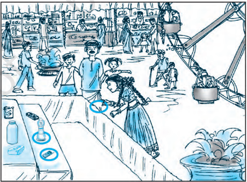
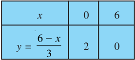
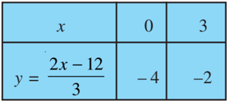
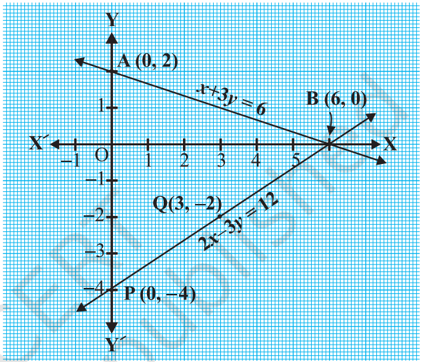
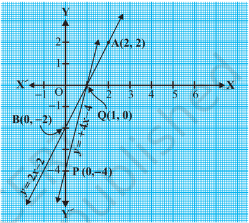

# PAGE 1

24

## PAIR OF LINEAR EQUATIONS IN TWO VARIABLES

## 3.1 Introduction

You must have come across situations like the one given below :

Akhila went to a fair in her village. She wanted to enjoy rides on the Giant Wheel and play Hoopla (a game in which you throw a ring on the items kept in a stall, and if the ring covers any object completely, you get it). The number of times she played Hoopla is half the number of rides she had on the Giant Wheel. If each ride costs ` 3, and a game of Hoopla costs ` 4, how would you find out the number of rides she had and how many times she played Hoopla, provided she spent ` 20.

May be you will try it by considering different cases. If she has one ride, is it possible? Is it possible to have two rides? And so on. Or you may use the knowledge of  Class  IX,  to  represent  such  situations  as  linear  equations  in  two  variables.

MATHEMATICS

# PAGE 2

Let us try this approach.

Denote the number of rides that Akhila had by x , and the number of times she played Hoopla by y . Now the situation can be represented by the two equations:

$$y = \frac { 1 } { 2 } x$$

$$3 x + 4 y = 2 0$$

Can we find the solutions of this pair of equations? There are several ways of finding these, which we will study in this chapter.

## 3.2 Graphical Method of Solution of a Pair of Linear Equations

A pair of linear equations which has no solution, is called an inconsistent pair of linear equations. A pair of linear equations in two variables, which has a solution, is called a consistent pair of linear equations.  A pair of linear equations which are equivalent has infinitely many distinct common solutions. Such a pair is called a dependent pair of linear equations in two variables. Note that a dependent pair of linear equations is always consistent.

We can now summarise the behaviour of lines representing a pair of linear equations in two variables and the existence of solutions as follows:

- (i) the lines may intersect in a single point. In this case, the pair of equations has a unique solution (consistent pair of equations).
- (ii) the  lines  may  be  parallel.  In  this  case,  the  equations  have  no  solution (inconsistent pair of equations).
- (iii) the lines may be coincident. In this case, the equations have infinitely many solutions [dependent (consistent) pair of equations].

Consider the following three pairs of equations.

- (i) x - 2 y = 0 and 3 x + 4 y - 20 = 0 (The lines intersect)
- (ii) 2 x + 3 y - 9 = 0 and 4 x + 6 y - 18 = 0 (The lines coincide)
- (iii) x + 2 y - 4 = 0 and 2 x + 4 y - 12 = 0 (The lines are parallel)

Let us now write down, and compare, the values of 1 1 1 2 2 2 , and a b c c a b in all the three  examples. Here, a 1 , b 1 , c 1 and a 2 , b 2 , c 2 denote  the  coefficents  of  equations given in the general form in Section 3.2.

# PAGE 3

$$a n d$$

Table 3.1

|   Sl No. | Pair of lines                      | 1 2 a a   | 1 2 b b   | 1 2 c c   | Compare the ratios          | Graphical representation   | Algebraic interpretation      |
|----------|------------------------------------|-----------|-----------|-----------|-----------------------------|----------------------------|-------------------------------|
|        1 | x - 2 y = 0 3 x + 4 y - 20 = 0     | 1 3       | 2 4 -     | 0 20 -    | 1 1 2 2 a b a b ≠           | Intersecting lines         | Exactly one solution (unique) |
|        2 | 2 x + 3 y -9=0 4 x + 6 y - 18 = 0  | 2 4       | 3 6       | 9 18 - -  | 1 1 1 2 2 2 a b c a b c = = | Coincident lines           | Infinitely many solutions     |
|        3 | x + 2 y - 4 = 0 2 x + 4 y - 12 = 0 | 1 2       | 2 4       | 4 12 - -  | 1 1 1 2 2 2 a b c a b c = ≠ | Parallel lines             | No solution                   |

From the table above, you can observe that if the lines represented by the equation

$$a _ { 1 } x + b _ { 1 } y + c _ { 1 } = 0$$

$$a _ { 1 } x + b _ { 1 } y + c _ { 1 } = 0 
 a _ { 2 } x + b _ { 2 } y + c _ { 2 } = 0 
 a _ { 2 } = ( i ) \, i n s e c t i n g , \, \text {then} \, \frac { a _ { 1 } } { a _ { 2 } } \neq \frac { b _ { 1 } } { b _ { 2 } } . 
 ( i ) \, \text {cicent, then} \, \frac { a _ { 1 } } { a _ { 2 } } = \frac { b _ { 1 } } { b _ { 2 } } = \frac { c _ { 1 } } { c _ { 2 } } . 
 ( i i ) \, \text {parallel, then} \, \frac { a _ { 1 } } { a _ { 2 } } = \frac { b _ { 1 } } { b _ { 2 } } \neq \frac { c _ { 1 } } { c _ { 2 } } . 
 \text {In fact, the converse is also true for any pair of}$$

In fact, the converse is also true for any pair of lines. You can verify them by considering some more examples by yourself.

Let us now consider some more examples to illustrate it.

Example 1 : Check graphically whether the pair of equations

$$x + 3 y = 6$$

$$2 x - 3 y = 1 2$$

is consistent. If so, solve them graphically.

Solution : Let us draw the graphs of the Equations (1) and (2). For this, we find two solutions of each of the equations, which are given in Table 3.2

# PAGE 4

Plot the points A(0, 2), B(6, 0), P(0,  -  4)  and  Q(3,  -  2)  on  graph paper, and join the points to form the lines  AB  and  PQ  as  shown  in Fig. 3.1.

We observe that there is a point B (6, 0) common to both the lines AB and PQ. So, the solution of the pair of linear equations is x = 6 and y = 0, i.e., the given pair of equations is consistent.

Table 3.2

Fig.  3.1

Example 2 : Graphically, find whether the following pair of equations has no solution, unique solution or infinitely many solutions:

$$5 x - 8 y + 1 = 0$$

$$3 x - \frac { 2 4 } { 5 } y + \frac { 3 } { 5 } = 0$$

Solution : Multiplying Equation (2) by 5 , 3 we get

$$5 x - 8 y + 1 = 0$$

But,  this is the same as Equation (1). Hence the lines represented by Equations (1) and (2) are coincident. Therefore, Equations (1) and (2) have infinitely many solutions.

Plot few points on the graph and verify it yourself.

Example 3 : Champa went to a 'Sale' to purchase some pants and skirts. When her friends asked her how many of each she had bought, she answered, 'The number of skirts is two less than twice the number of pants purchased. Also, the number of skirts is four less than four times the number of pants purchased'. Help her friends to find how many pants and skirts Champa bought.

# PAGE 5

Solution : Let us denote the number of pants by x and the number of skirts by y. Then the equations formed are :

$$y = 2 x - 2$$

$$y = 4 x - 4$$

Fig.  3.2

Plot the points and draw the lines passing through them to represent the equations, as shown in Fig. 3.2.

The two lines intersect at the point (1, 0). So, x = 1, y = 0 is the required solution of the pair of linear equations, i.e., the number of pants she purchased is 1 and she did not buy any skirt.

Verify the answer by checking whether it satisfies the conditions of the given problem.

## EXERCISE 3.1

1. Form the pair of linear equations in the following problems, and find their solutions graphically.
2. (i) 10 students of Class X took part in a Mathematics quiz. If the number of girls is 4 more than the number of boys, find the number of boys and girls who took part in the quiz.

and

Let  us  draw  the  graphs  of Equations (1) and (2) by finding two solutions for each of the equations. They are given in Table 3.3.

Table 3.3

# PAGE 6

- (ii) 5 pencils and 7 pens together cost ` 50, whereas 7 pencils and 5 pens together cost ` 46. Find the cost of one pencil and that of one pen.
2. On comparing the ratios 1 1 1 2 2 2 , and a b c a b c , find out whether the lines representing the

following pairs of linear equations intersect at a point, are parallel or coincident:

- (i) 5 x - 4 y + 8 = 0 7 x + 6 y - 9 = 0

$$\begin{matrix} ( \ddot { \mathbf i } \dot { \mathbf } ) & 6 x - 3 y + 1 0 = 0 \\ & 2 x - y + 9 = 0 \end{matrix}$$

3. On comparing the ratios 1 1 2 2 , a b a b and 1 2 c c , find out whether the following pair of linear

equations are consistent, or inconsistent.

- (i) 3 x + 2 y = 5 ; 2 x - 3 y = 7 (ii) 2 x - 3 y = 8 ; 4 x - 6 y = 9 (iii) 3 5 7 2 3 x y   ; 9 x - 10 y = 14 (iv) 5 x - 3 y = 11 ; - 10 x + 6 y = -22 (v) 4 2 8 3 x y   ; 2 x + 3 y = 12
4. Which of the following pairs  of  linear  equations  are  consistent/inconsistent?  If consistent, obtain the solution graphically:
- (i) x + y = 5, 2 x + 2 y = 10
- (ii) x -y = 8, 3 x - 3 y = 16
- (iii) 2 x + y - 6 = 0, 4 x - 2 y - 4 = 0
- (iv) 2 x - 2 y - 2 = 0, 4 x - 4 y - 5 = 0
5. Half the perimeter of a rectangular garden, whose length is 4 m more than its width, is 36 m. Find the dimensions of the garden.
6. Given the linear equation 2 x + 3 y - 8 = 0, write another linear equation in two variables such that the geometrical representation of the pair so formed is:
- (i) intersecting lines
- (iii) coincident lines
7. Draw the graphs of the equations x -y + 1 = 0 and 3 x + 2 y - 12 = 0. Determine the coordinates of the vertices of the triangle formed by these lines and the x -axis, and shade the triangular region.
- (ii) parallel lines

$$( \mathbf i ) \ 9 x + 3 y + 1 2 = 0 \\ 1 8 x + 6 y + 2 4 = 0$$

# PAGE 7

## 3.3 Algebraic Methods of Solving a Pair of Linear Equations

In the previous section, we discussed how to solve a pair of linear equations graphically. The graphical method is not convenient in cases when the point representing the solution  of  the  linear  equations  has  non-integral  coordinates  like ( ) 3, 2 7 ,

(-1.75, 3.3), 4 1 , 13 19       , etc. There is every possibility of making mistakes while reading such coordinates. Is there any alternative method of finding the solution? There are several algebraic methods, which we shall now discuss.

- 3.3.1 Substitution Method : We shall explain the method of substitution by taking some examples.

Example 4 : Solve the following pair of equations by substitution method:

$$7 x - 1 5 y = 2 \cdots$$

$$x + 2 y = 3$$

## Solution :

Step 1 : We pick either of the equations and write one variable in terms of the other. Let us consider the Equation (2) :

and write it as

$$x + 2 y = 3 \begin{matrix} y & 1 \\ x & 3 \end{matrix}$$

Step 2 : Substitute the value of x in Equation (1). We get

$$\begin{array} { c } { { 1 } \text {step} \, 2 \colon \text {substitute the value of } 6 \text { in } \text {Eqn} ( 1 ) . \text { we } } \\ { { 7 ( 3 - 2 y ) - 1 5 y = 2 } } \\ { i . e . , } & { \times } & { \text {up} - 2 y = - 1 9 } \\ { \text {Therefor, } } & { \times } & { y = \frac { 1 9 } { 2 9 } } \\ { { 9 } \text {Step} \, 3 \colon \text {Substituting this value of } y \text { in } \text {Equation } ( 3 ) , \text { with } } \end{array}$$

Step 3 : Substituting this value of y in Equation (3), we get

$$x = 3 - 2 \left ( \frac { 1 9 } { 2 9 } \right ) = \frac { 4 9 } { 2 9 } \\ \cdot 
 1 0$$

$$T h e r e f o r e , t h e s o l u t i o n i s x = \frac { 4 9 } { 2 9 } \, , y = \frac { 1 9 } { 2 9 } \, .$$

# PAGE 8

Verification : Substituting x = 49 29 and y = 19 29 , you can verify that both the Equations (1) and (2) are satisfied.

To understand the substitution method more clearly, let us consider it stepwise: Step 1 : Find the value of one variable, say y in terms of the other variable, i.e., x from either equation, whichever is convenient.

Step 2 : Substitute this value of y in the other equation, and reduce it to an equation in one variable, i.e., in terms of x , which can be solved. Sometimes, as in Examples 9 and 10 below, you can get statements with no variable. If this statement is true, you can conclude that the pair of linear equations has infinitely many solutions. If the statement is false, then the pair of linear equations is inconsistent.

Step 3 : Substitute the value of x (or y ) obtained in Step 2 in the equation used in Step 1 to obtain the value of the other variable.

Remark : We have substituted the value of one variable by expressing it in terms of the other variable to solve the pair of linear equations. That is why the method is known as the substitution  method .

Example 5 : Solve the following question-Aftab tells his daughter, 'Seven years ago, I was seven times as old as you were then. Also, three years from now, I shall be three times as old as you will be.' (Isn't this interesting?) Represent this situation algebraically and graphically by the method of substitution.

Solution : Let s and t be the ages (in years) of Aftab and his daughter, respectively. Then, the pair of linear equations that represent the situation is

$$s - 7 = 7 \, ( t - 7 ) , i . e . , s - 7 t + 4 2 = 0$$

$$s + 3 = 3 \, ( t + 3 ) , \, i . e . , \, s - 3 t = 6$$

and

Using Equation (2), we get s = 3 t + 6.

Putting this value of s in Equation (1), we get

$$( 3 t + 6 ) - 7 t + 4 2 = 0 ,$$

i.e., 4 t = 48, which gives t = 12.

Putting this value of t in Equation (2), we get

$$s = 3 \, ( 1 2 ) + 6 = 4 2$$

# PAGE 9

So, Aftab and his daughter are 42 and 12 years old, respectively.

Verify this answer by checking if it satisfies the conditions of the given problems.

Example 6 : In a shop the cost of 2 pencils and 3 erasers is ` 9 and the cost of 4 pencils and 6 erasers is ` 18. Find the cost of each pencil and each eraser.

Solution : The pair of linear equations formed were:

$$2 x + 3 y = 9$$

$$4 x + 6 y = 1 8$$

We first express the value of x in terms of y from the equation 2 x + 3 y = 9, to get

$$x = \frac { 9 - 3 y } { 2 }$$

Now we substitute this value of x in Equation (2), to get

$$\frac { 4 ( 9 - 3 y ) } { 2 } + 6 y = 1 8 \sqrt { 2 }$$

18 - 6

i.e.,

y

+ 6

y

= 18

$$i . e ,$$

This statement is true for all values of y . However, we do not get a specific value of y as a solution. Therefore, we cannot obtain a specific value of x . This situation has arisen because both the given equations are the same. Therefore, Equations (1) and (2) have infinitely many solutions. We cannot find a unique cost of a pencil and an eraser, because there are many common solutions, to the given situation.

Example 7 : Two rails are represented by the equations

x + 2 y - 4 = 0 and 2 x + 4 y - 12 = 0.  Will the rails cross each other?

Solution : The pair of linear equations formed were:

$$x + 2 y - 4 = 0$$

$$2 x + 4 y - 1 2 = 0$$

We express x in terms of y from Equation (1) to get

x

= 4 - 2

y

Now, we substitute this value of x in Equation (2) to get

$$2 ( 4 - 2 y ) + 4 y - 1 2 = 0$$

# PAGE 10

i.e., i.e.,

which is a false statement.

Therefore, the equations do not have a common solution. So, the two rails will not cross each other.

## EXERCISE 3.2

1. Solve the following pair of linear equations by the substitution method.
2. (i) x + y = 14
3. (iii) 3 x -y = 3 9 x - 3 y
4. (v) 2 3 0 x y
5. x -y = 4 3 2 (iv) 0.2 x +  0.3 y =  1.3 = 9 0.4 x +  0.5 y =  2.3   (vi) 3 5 2 2 3 x y    3 8 0 x y   13 3 2 6 x y  
2. Solve 2 x +  3 y =  11 and 2 x -  4 y =  -  24  and hence find the value of ' m '  for  which y = mx + 3.
3. Form the pair of linear equations for the following problems and find their solution by substitution  method.
8. (i) The difference between two numbers is 26 and one number is three times the other. Find them.
9. (ii) The larger of two supplementary angles exceeds the smaller by 18 degrees. Find them.
10. (iii) The coach of a cricket team buys 7 bats and 6 balls for ` 3800. Later, she buys 3 bats and 5 balls for ` 1750. Find the cost of each bat and each ball.
11. (iv) The taxi charges in a city consist of a fixed charge together with the charge for the distance covered. For a distance of 10 km, the charge paid is ` 105 and for a journey of 15 km, the charge paid is ` 155. What are the fixed charges and the charge per km? How much does a person have to pay for travelling a distance of 25 km?
12. (v) A fraction becomes 9 11 , if  2 is added to both the numerator and the denominator. If, 3 is added to both the numerator and the denominator it becomes 5 6 . Find the fraction.

$$( \mathbf i ) _ { S - t } = 3 
 \cdot \begin{matrix} s \\ \frac { S } { 3 } + \frac { t } { 2 } = 6 \end{matrix}$$

$$8 - 1 2 = 0$$

- 4 = 0

# PAGE 11

$$a n d$$

- (vi) Five years hence, the age of Jacob will be three times that of his son. Five years ago, Jacob's age was seven times that of his son. What are their present ages?

## 3.3.2 Elimination Method

Now let us consider another method of eliminating (i.e., removing) one variable. This is sometimes more convenient than the substitution method. Let us see how this method works.

Example 8 : The ratio of incomes of two persons is 9 : 7 and the ratio of their expenditures is 4 : 3. If each of them manages to save ` 2000 per month, find their monthly incomes.

Solution : Let us denote the incomes of the two person by ` 9 x and ` 7 x and their expenditures by ` 4 y and ` 3 y respectively. Then the equations formed in the situation is given by :

$$9 x - 4 y = 2 0 0 0$$

$$7 x - 3 y = 2 0 0 0$$

Step 1 : Multiply Equation (1) by 3 and Equation (2) by 4 to make the coefficients of y equal. Then we get the equations:

$$2 7 x - 1 2 y = 6 0 0 0$$

$$2 8 x - 1 2 y = 8 0 0 0 \times 1 2$$

Step 2 : Subtract Equation (3) from Equation (4) to eliminate y , because the coefficients of y are the same. So, we get

$$( 2 8 x - 2 7 x ) - ( 1 2 y - 1 2 y ) = 8 0 0 0 - 6 0 0 0$$

$$x = 2 0 0 0$$

i.e.,

Step 3 : Substituting this value of x in (1), we get

$$9 ( 2 0 0 0 ) - 4 y =$$

$$y = 2 0 0 0$$

$$i . e ,$$

So, the solution of the equations is x = 2000, y = 4000. Therefore, the monthly incomes of the persons are ` 18,000 and ` 14,000, respectively.

Verification  : 18000 :  14000  =  9  :  7. Also,  the  ratio  of  their  expenditures  = 18000 - 2000 : 14000 - 2000 = 16000 : 12000 = 4 : 3

## Remarks :

1. The method used in solving the example above is called the elimination method, because we eliminate one variable first, to get a linear equation in one variable.

# PAGE 12

In the example above, we eliminated y . We could also have eliminated x . Try doing it that way.

2. You could also have used the substitution, or graphical method, to solve this problem. Try doing so, and see which method is more convenient.
2. Let us now note down these steps in the elimination method :

Step 1 : First multiply both the equations by some suitable non-zero constants to make the coefficients of one variable (either x or y ) numerically equal.

Step 2 : Then add or subtract one equation from the other so that one variable gets eliminated. If you get an equation in one variable, go to Step 3.

If in Step 2, we obtain a true statement involving no variable, then the original pair of equations has infinitely many solutions.

If in Step 2, we obtain a false statement involving no variable, then the original pair of equations has no solution, i.e., it is inconsistent.

Step 3 : Solve the equation in one variable ( x or y ) so obtained to get its value.

Step 4 : Substitute this value of x (or y ) in either of the original equations to get the value of the other variable.

Now to illustrate it, we shall solve few more examples.

Example 9 : Use elimination method to find all possible solutions of the following pair of linear equations :

$$2 x + 3 y = 8$$

$$4 x + 6 y \equiv 7$$

## Solution :

Step  1  : Multiply  Equation  (1)  by  2  and  Equation  (2)  by  1  to  make  the coefficients of x equal. Then we get the equations as :

$$4 x + 6 y = 1 6$$

$$4 x + 6 y = 7$$

Step 2 : Subtracting Equation (4) from Equation (3),

$$( 4 x - 4 x ) + ( 6 y - 6 y ) = 1 6 - 7$$

i.e., 0 = 9, which is a false statement.

Therefore, the pair of equations has no solution.

Example 10 : The sum of a two-digit number and the number obtained by reversing the digits is 66. If the digits of the number differ by 2, find the number. How many such numbers are there?

# PAGE 13

Solution : Let the ten's and the unit's digits in the first number be x and y , respectively. So, the first number may be written as 10 x + y in the expanded form (for example, 56 = 10(5) + 6).

When the digits are reversed, x becomes the unit's digit and y becomes the ten's digit. This number, in the expanded notation is 10 y + x (for  example, when 56 is reversed, we get 65 = 10(6) + 5).

According to the given condition.

$$i _ { . } , \quad & 1 1 ( x + y ) + ( 1 0 y + x ) = 6 6 \\ i _ { . } , \quad & x + y = 6$$

We are also given that the digits differ by 2, therefore,

$$\text { either } & & x - y = 2 & & \bigcup ( 2 )$$

or

$$y - x = 2 \int ( y ) ( x )$$

If x -y = 2, then solving (1) and (2) by elimination, we get x = 4 and y = 2.

In this case, we get the number 42.

$$\text {If} y - x = 2 , \text { then solving } ( 1 ) \text { and } ( 3 ) \text { by elimination, we get } x = 2 \text { and } y = 4 .$$

In this case, we get the number 24.

Thus, there are two such numbers 42 and 24.

Verification : Here 42 + 24 = 66 and 4 - 2 = 2. Also 24 + 42 = 66 and 4 - 2 = 2.

## EXERCISE 3.3

1. Solve the following pair of linear equations by the elimination method and the substitution method :
2. (i) x + y = 5 and 2 x - 3 y = 4
3. (iii) 3 x - 5 y - 4 = 0 and 9 x = 2 y + 7

$$\begin{pmatrix} ( i ) & 3 x + 4 y = 1 0 & \text {and} & 2 x - 2 y = 2 \\ & & & \\ ( i v ) & \frac { x } { 2 } + \frac { 2 y } { 3 } = - 1 & \text {and} & x - \frac { y } { 3 } = 3 \end{pmatrix}$$

2. Form the pair of linear equations in the following problems, and find their solutions (if they exist) by the elimination method :
2. (i) If we add 1 to the numerator and subtract 1 from the denominator, a fraction reduces

to 1. It becomes 1 if we only add 1 to the denominator. What is the fraction?

- 2
- (ii) Five years ago, Nuri was thrice as old as Sonu. Ten years later, Nuri will be twice as old as Sonu. How old are Nuri and Sonu?
- (iii) The sum of the digits of a two-digit number is 9. Also, nine times this number is twice the number obtained by reversing the order of the digits. Find the number.

# PAGE 14

- (iv) Meena went to a bank to withdraw ` 2000. She asked the cashier to give her ` 50 and ` 100 notes only. Meena got 25 notes in all. Find how many notes of ` 50 and ` 100 she received.
- (v) A lending library has a fixed charge for the first three days and an additional charge for each day thereafter. Saritha paid ` 27 for a book kept for seven days, while Susy paid ` 21 for the book she kept for five days. Find the fixed charge and the charge for each extra day.

## 3.4 Summary

In this chapter, you have studied the following points:

1. A pair of linear equations in two variables can be represented, and solved, by the:
2. (i) graphical method
3. (ii) algebraic method
2. Graphical Method :

The graph of a pair of linear equations in two variables is represented by two lines.

- (i) If  the lines intersect at a point, then that point gives the unique solution of the two equations. In this case, the pair of equations is consistent .
- (ii) If the lines coincide, then there are infinitely many solutions - each point on the  line  being  a  solution.  In  this  case,  the  pair  of  equations  is dependent (consistent) .
- (iii) If the lines are parallel, then the pair of equations has no solution. In this case, the pair of equations is inconsistent .
3. Algebraic Methods : We have discussed the following methods for finding the solution(s) of a pair of linear equations :
- (i) Substitution Method
- (ii) Elimination Method
4. If a pair of linear equations is given by a 1 x + b 1 y + c 1 = 0 and a 2 x + b 2 y + c 2 = 0, then the following situations can arise :
- (i) 1 1 2 1 a b a b  : In this case, the pair of linear equations is consistent.
- (ii) 1 1 1 2 2 2 a b c a b c   : In this case, the pair of linear equations is inconsistent.
- (iii) 1 1 1 2 2 2 a b c a b c   : In this case, the pair of linear equations  is dependent and consistent.
5. There are several situations which can be mathematically represented by two equations that are not linear to start with. But we alter them so that they are reduced to a pair of linear equations.