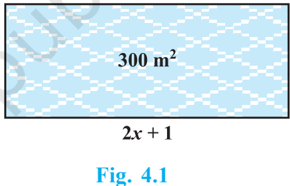

# PAGE 1

38

## QUADRATIC EQUATIONS

## 4.1 Introduction

In  Chapter 2, you have studied different types of polynomials. One type was the quadratic polynomial of the form ax 2 + bx + c , a  0. When we equate this polynomial to zero, we get a quadratic equation. Quadratic equations come up when we deal with many real-life situations. For instance, suppose a charity trust decides to build a prayer hall having a carpet area of 300 square metres with its length one metre more than twice its breadth. What should be the length and breadth of the hall? Suppose the breadth of the hall is x metres. Then, its length should be (2 x + 1) metres. We can depict this information pictorially as shown in Fig. 4.1.

<!-- formula-not-decoded -->

So, the breadth of the hall should satisfy the equation 2 x 2 + x - 300 = 0 which is a quadratic equation.

Many people believe that Babylonians were the first to solve quadratic equations. For instance, they knew how to find two positive numbers with a given positive sum and a given positive product, and this problem is equivalent to solving a quadratic equation of the form x 2 -px + q =  0.  Greek  mathematician  Euclid  developed  a geometrical approach for finding out lengths which, in our present day terminology, are solutions of quadratic equations. Solving of quadratic equations, in general form, is often credited to ancient Indian mathematicians. In fact, Brahmagupta (C.E.598-665) gave an explicit formula to solve a quadratic equation of the form ax 2 + bx = c . Later,

MATHEMATICS

4

# PAGE 2

Sridharacharya (C.E. 1025) derived a formula, now known as the quadratic formula, (as quoted by Bhaskara II) for solving a quadratic equation by the method of completing the square. An  Arab mathematician Al-Khwarizmi (about C.E. 800) also studied quadratic equations of different types. Abraham bar Hiyya Ha-Nasi, in his book 'Liber embadorum' published in Europe in C.E. 1145 gave complete solutions of different quadratic equations.

In this chapter, you will study quadratic equations, and various ways of finding their roots. You will also see some applications of quadratic equations in daily life situations.

## 4.2 Quadratic Equations

A quadratic equation in the variable x is an equation of the form ax 2 + bx + c = 0, where a , b , c are real numbers, a  0. For example, 2 x 2 + x - 300 = 0 is a quadratic equation. Similarly, 2 x 2  - 3 x + 1 = 0, 4 x - 3 x 2  + 2 = 0 and 1 x 2  + 300 = 0 are also quadratic equations.

In fact, any equation of the form p ( x ) = 0, where p ( x ) is a polynomial of degree 2, is a quadratic equation. But when we write the terms of p ( x ) in descending order of their degrees, then we get the standard form of the equation. That is, ax 2 + bx + c = 0, a  0 is called the standard form of a quadratic equation .

Quadratic equations arise in several situations in the world around us and in different fields of mathematics. Let us consider a few examples.

Example 1 : Represent the following situations mathematically:

- (i) John and Jivanti together have 45 marbles. Both of them lost 5 marbles each, and the product of the number of marbles they now have is 124. We would like to find out how many marbles they had to start with.
- (ii) A cottage industry produces a certain number of toys in a day. The cost of production of each toy (in rupees) was found to be 55 minus the number of toys produced in  a  day.  On  a  particular  day,  the  total  cost  of  production  was ` 750. We would like to find out the number of toys produced on that day.

## Solution :

- (i) Let the number of marbles John had be x .

Then the number of marbles Jivanti had = 45 x (Why?).

The number of marbles left with John, when he lost 5 marbles = x - 5

The number of marbles left with Jivanti, when she lost 5 marbles = 45 x - 5

<!-- formula-not-decoded -->

# PAGE 3

Therefore, their product = ( x - 5) (40 x )

<!-- formula-not-decoded -->

<!-- formula-not-decoded -->

<!-- formula-not-decoded -->

(Given that product = 124)

<!-- formula-not-decoded -->

i.e.,

<!-- formula-not-decoded -->

Therefore, the number of marbles John had, satisfies the quadratic equation

<!-- formula-not-decoded -->

which is the required representation of the problem mathematically.

- (ii) Let the number of toys produced on that day be x .

Therefore, the cost of production (in rupees) of each toy that day = 55 x So, the total cost of production (in rupees) that day = x (55 x )

Therefore,

<!-- formula-not-decoded -->

<!-- formula-not-decoded -->

Therefore, the number of toys produced that day satisfies the quadratic equation x 2 - 55 x + 750 = 0

which is the required representation of the problem mathematically.

Example 2 : Check whether the following are quadratic equations:

<!-- formula-not-decoded -->

## Solution :

- (i) LHS = ( x - 2) 2 + 1 = x 2 - 4 x + 4 + 1 = x 2 - 4 x + 5

Therefore, ( x - 2) 2 +   1 = 2 x - 3 can be rewritten as

<!-- formula-not-decoded -->

<!-- formula-not-decoded -->

i.e.,

It is of the form ax 2 + bx + c = 0.

Therefore, the given equation is a quadratic equation.

# PAGE 4

(ii) Since x ( x + 1) + 8 = x 2 + x + 8 and ( x + 2)( x - 2) = x 2 - 4 Therefore, x 2 + x + 8 = x 2  - 4 i.e., x + 12 = 0 It is not of the form ax 2 + bx + c = 0.

Therefore, the given equation is not a quadratic equation.

<!-- formula-not-decoded -->

So, the given equation is a quadratic equation.

<!-- formula-not-decoded -->

So, the given equation is a quadratic equation.

Remark : Be careful! In (ii) above, the given equation appears to be a quadratic equation, but it is not a quadratic equation.

In (iv) above, the given equation appears to be a cubic equation (an equation of degree 3) and not a quadratic equation. But it turns out to be a quadratic equation. As you can see, often we need to simplify the given equation before deciding whether it is quadratic or not.

## EXERCISE 4.1

- Check whether the following are quadratic equations :
- 1.
- (i) ( x + 1) 2 = 2( x - 3) (ii) x 2 - 2 x = (-2) (3 x ) (iii) ( x - 2)( x + 1) = ( x - 1)( x + 3) (iv) ( x - 3)(2 x +1) = x ( x + 5) (v) (2 x - 1)( x - 3) = ( x + 5)( x - 1) (vi) x 2 + 3 x + 1 = ( x - 2) 2 (vii) ( x + 2) 3 = 2 x ( x 2 - 1) (viii) x 3 - 4 x 2 -x + 1 = ( x - 2) 3
2. Represent the following situations in the form of quadratic equations :
- (i) The area of a rectangular plot is 528 m 2 . The length of the plot (in metres) is one more than twice its breadth. We need to find the length and breadth of the plot.

# PAGE 5

- (ii) The product of  two consecutive positive integers is 306. We need to find the integers.
- (iii) Rohan's mother is 26 years older than him. The product of their ages (in years) 3 years from now will be 360. We would like to find Rohan's present age.
- (iv) A train travels a distance of 480 km at a uniform speed. If the speed had been 8 km/h less, then it would have taken 3 hours more to cover the same distance. We need to find the speed of the train.

## 4.3 Solution of a Quadratic Equation by Factorisation

Consider the quadratic equation 2 x 2 -  3 x +  1  =  0.  If  we  replace x by  1  on  the LHS of this equation, we get (2 × 1 2 ) - (3 × 1) + 1 = 0 = RHS of the equation. We say that 1 is a root of the quadratic equation 2 x 2 - 3 x + 1 = 0. This also means that 1 is a zero of the quadratic polynomial 2 x 2 - 3 x + 1.

In  general,  a  real  number  is  called  a  root  of  the  quadratic  equation ax 2 + bx + c = 0, a  0 if a  2 + b  + c = 0. We also say that x =  is a solution of the quadratic equation , or that  satisfies the quadratic equation . Note that the zeroes of the quadratic polynomial ax 2 + bx + c and the roots of the quadratic equation ax 2 + bx + c = 0 are the same .

You have observed, in Chapter 2, that a quadratic polynomial can have at most two zeroes. So, any quadratic equation can have atmost two roots.

You have learnt in Class IX, how to factorise quadratic polynomials by splitting their middle terms. We shall use this knowledge for finding the roots of a quadratic equation. Let us see how.

Example 3 : Find the roots of the equation 2 x 2 - 5 x + 3 = 0, by factorisation.

Solution : Let us first split the middle term - 5 x as -2 x -3 x [because (-2 x ) × (-3 x ) = 6 x 2 = (2 x 2 ) × 3].

<!-- formula-not-decoded -->

<!-- formula-not-decoded -->

So, the values of x for which 2 x 2 - 5 x + 3 = 0 are the same for which (2 x - 3)( x - 1) = 0, i.e., either 2 x - 3 = 0 or x - 1 = 0.

<!-- formula-not-decoded -->

In other words, 1 and 3 2 are the roots of the equation 2 x 2 - 5 x + 3 = 0.

So, 3 2 x  and x = 1 are the solutions of the equation.

Verify that these are the roots of the given equation.

# PAGE 6

Note that we have found the roots of 2 x 2 -  5 x +  3  =  0 by  factorising 2 x 2 - 5 x + 3 into two linear factors and equating each factor to zero .

Example 4 : Find the roots of the quadratic equation 6 x 2 -x - 2 = 0. Solution : We have

<!-- formula-not-decoded -->

The roots of 6 x 2 -x - 2 = 0 are the values of x for which (3 x - 2)(2 x + 1) = 0 Therefore, 3 x - 2 = 0 or 2 x + 1 = 0, i.e.,

<!-- formula-not-decoded -->

Therefore, the roots of 6 x 2 -x - 2 = 0 are 2 1 . and -3 2

We verify the roots, by checking that 2 1 and 3 2  satisfy 6 x 2 -x - 2 = 0.

Example 5 : Find the roots of the quadratic equation 2 3 2 6 2 0 x x    .

<!-- formula-not-decoded -->

So, the roots of the equation are the values of x for which

<!-- formula-not-decoded -->

So, this root is repeated twice, one for each repeated factor 3 2 x  .

Therefore, the roots of 2 3 2 6 2 0 x x    are 2 3 , 2 3 .

# PAGE 7

Example 6 : Find the dimensions of the prayer hall discussed in Section 4.1.

Solution : In  Section  4.1,  we  found  that  if  the  breadth  of  the  hall  is x m, then x satisfies the equation 2 x 2 + x - 300 = 0. Applying the factorisation method, we write this equation as

<!-- formula-not-decoded -->

<!-- formula-not-decoded -->

<!-- formula-not-decoded -->

i.e.,

So, the roots of the given equation are x = 12 or x = - 12.5. Since x is the breadth of the hall, it cannot be negative.

Thus, the breadth of the hall is 12 m. Its length = 2 x + 1 = 25 m.

## EXERCISE 4.2

1. Find the roots of the following quadratic equations by factorisation:
2. (i) x 2 - 3 x - 10 = 0 (ii) 2 x 2 + x - 6 = 0 (iii) 2 2 7 5 2 0 x x    (iv) 2 x 2 -x + 1 8 = 0
3. (v) 100 x 2 - 20 x + 1 = 0
2. Solve the problems given in Example 1.
3. Find two numbers whose sum is 27 and product is 182.
4. Find two consecutive positive integers, sum of whose squares is 365.
5. The altitude of a right triangle is 7 cm less than its base. If the hypotenuse is 13 cm, find the other two sides.
6. A cottage industry produces a certain number of pottery articles in a day. It was observed on a particular day that the cost of production of each article (in rupees) was 3 more than twice the number of articles produced on that day. If the total cost of production on that day was ` 90, find the number of articles produced and the cost of each article.

## 4.4 Nature of Roots

The equation ax 2 + bx + c = 0 are given by

<!-- formula-not-decoded -->

<!-- formula-not-decoded -->

<!-- formula-not-decoded -->

# PAGE 8

<!-- formula-not-decoded -->

So, the roots of the equation ax 2 + bx + c = 0 are both b 

<!-- formula-not-decoded -->

Therefore, we say that the quadratic equation ax 2 + bx + c = 0 has two equal real roots in this case.

If b 2 - 4 ac &lt; 0, then there is no real number whose square is b 2 - 4 ac . Therefore, there are no real roots for the given quadratic equation in this case.

Since b 2 - 4 ac determines whether the quadratic equation ax 2 + bx + c = 0 has real roots or not, b 2 - 4 ac is called the discriminant of this quadratic equation.

So, a quadratic equation ax 2 + bx + c = 0 has

- (i) two distinct real roots, if b 2 - 4 ac &gt; 0,
- (ii) two equal real roots, if b 2  - 4 ac = 0,
- (iii) no real roots, if b 2  - 4 ac &lt; 0.

Let us consider some examples.

Example 7: Find the discriminant of the quadratic equation 2 x 2  - 4 x + 3 = 0, and hence find the nature of its roots.

Solution : The given equation is of the form ax 2 + bx + c = 0, where a = 2, b = - 4 and c = 3. Therefore, the discriminant

<!-- formula-not-decoded -->

So, the given equation has no real roots.

Example 8 : A pole has to be erected at a point on the boundary of a circular park of diameter 13 metres in such a way that the differences of its distances from two diametrically opposite fixed gates A and B on the boundary is 7 metres. Is it possible to do so? If yes, at what distances from the two gates should the pole be erected?

Solution : Let  us  first  draw  the  diagram (see Fig. 4.2).

Let P be the required location of the pole. Let the distance of the pole from the gate  B  be x m,  i.e.,  BP  = x m.  Now  the difference of the distances of the pole from the two gates = AP - BP (or, BP - AP) = 7 m. Therefore, AP = ( x + 7) m.

Fig.  4.2

# PAGE 9

Now, AB = 13m, and since AB is a diameter,

<!-- formula-not-decoded -->

So, the distance ' x ' of the pole from gate B satisfies the equation

<!-- formula-not-decoded -->

So,  it would be possible to place the pole if this equation has real roots. To see if this is so or not, let us consider its discriminant. The discriminant is

<!-- formula-not-decoded -->

So, the given quadratic equation has two real roots, and it is possible to erect the pole on the boundary of the park.

Solving the quadratic equation x 2 + 7 x - 60 = 0, by the quadratic formula, we get

<!-- formula-not-decoded -->

Therefore, x = 5 or - 12.

Since x is  the distance between the pole and the gate B, it must be positive. Therefore, x = - 12 will have to be ignored. So, x = 5.

Thus, the pole has to be erected on the boundary of the park at a distance of 5m from the gate B and 12m from the gate A.

Example 9 : Find the discriminant of the equation 3 x 2 - 2 x + 1 3 = 0 and hence find the nature of its roots. Find them, if they are real.

<!-- formula-not-decoded -->

<!-- formula-not-decoded -->

Hence, the given quadratic equation has two equal real roots.

<!-- formula-not-decoded -->

# PAGE 10

## EXERCISE 4.3

1. Find the nature of the roots of the following quadratic equations. If the real roots exist, find them:
2. (i) 2 x 2 - 3 x + 5 = 0
3. (iii) 2 x 2 - 6 x + 3 = 0
2. Find the values of k for each of the following quadratic equations, so that they have two equal roots.
5. (i) 2 x 2 + kx + 3 = 0
6. (ii) kx ( x - 2) + 6 = 0
3. Is it possible to design a rectangular mango grove whose length is twice its breadth, and the area is 800 m 2 ? If so, find its length and breadth.
4. Is the following situation possible? If so, determine their present ages. The sum of the ages of two friends is 20 years. Four years ago, the product of their ages in years was 48.
5. Is it possible to design a rectangular park of perimeter 80 m and area 400 m 2 ? If  so, find its length and breadth.

## 4.5 Summary

In this chapter, you have studied the following points:

1. A quadratic equation in the variable x is of the form ax 2 + bx + c = 0, where a , b , c are real numbers and a  0.
2. A real number  is  said  to  be a root of the quadratic equation ax 2 + bx + c =  0,  if a  2 + b  + c = 0. The zeroes of the quadratic polynomial ax 2 + bx + c and the roots of the quadratic equation ax 2 + bx + c = 0 are the same.
3. If we can factorise ax 2 + bx + c , a  0, into a product of two linear factors, then the roots of the quadratic equation ax 2 + bx + c = 0 can be found by equating each factor to zero.
4. Quadratic formula: The roots of a quadratic equation ax 2 + bx + c = 0 are given by

<!-- formula-not-decoded -->

5. A quadratic equation ax 2 + bx + c = 0 has
2. (i) two distinct real roots, if b 2 - 4 ac &gt; 0,
3. (ii) two equal roots (i.e., coincident roots), if b 2 - 4 ac = 0, and
4. (iii) no real roots, if b 2 - 4 ac &lt; 0.
5. (ii) 3 x 2 - 4 3 x + 4 = 0

# PAGE 11

48

## NOTE

MATHEMATICS