# PAGE 1

INTRODUCTION TO TRIGONOMETRY

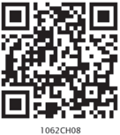

## 8 INTRODUCTION TO TRIGONOMETRY

There is  perhaps  nothing  which  so  occupies  the middle position of mathematics as trigonometry.

-  J.F.  Herbart  (1890)

Fig.  8.1

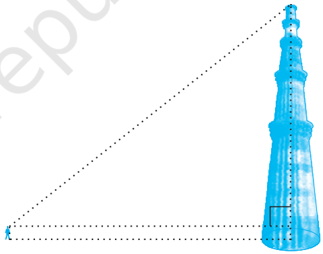

Fig.  8.2

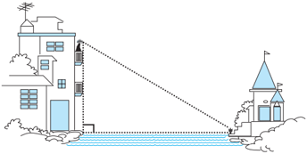

## 8.1 Introduction

You have already studied about triangles, and in particular, right triangles, in your earlier classes. Let us take some examples from our surroundings where right triangles can be imagined to be formed. For instance :

1. Suppose the students of a school are visiting Qutub Minar. Now, if a student is looking at the top of the Minar, a right triangle can be imagined to be made, as shown in Fig 8.1. Can the student find out the height of the Minar, without actually measuring it?
2.  Suppose a girl is sitting on the balcony of her house located on the bank of a river.  She is looking down at a flower pot placed on a stair of a temple situated nearby on the other bank of the river. A right triangle is imagined to be made in this situation as shown in Fig.8.2. If you  know  the  height  at  which  the person is sitting, can you find the width of the river?

113

# PAGE 2

3. Suppose a hot air balloon is flying in the  air.    A  girl  happens  to  spot  the balloon  in  the  sky  and  runs  to  her mother to tell her about it.  Her mother rushes out of the house to look at the balloon.Now when the girl had spotted the balloon intially it was at point A. When both the mother and daughter came  out  to  see  it,  it  had  already travelled to another point B. Can you find the altitude of B from the ground?

Fig.  8.3

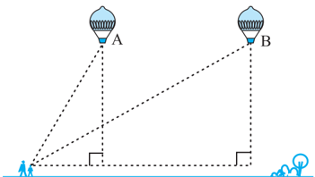

In all the situations given above, the distances or heights can be found by using some mathematical techniques, which come under a branch of mathematics called 'trigonometry'.  The  word  'trigonometry'  is  derived  from  the  Greek  words  'tri' (meaning three), 'gon' (meaning sides) and 'metron' (meaning measure). In fact, trigonometry is the study of relationships between the sides and angles of a triangle. The earliest known work on trigonometry was recorded in Egypt and Babylon. Early astronomers used it to find out the distances of the stars and planets from the Earth. Even today, most of the technologically advanced methods used in Engineering and Physical Sciences are based on trigonometrical concepts.

In this chapter, we will study some ratios of the sides of a right triangle with respect to its acute angles, called trigonometric ratios of the angle. We will restrict our discussion to acute angles only. However, these  ratios can be extended to other angles also. We will also define the trigonometric ratios for angles of measure 0° and 90°. We will calculate trigonometric ratios for some specific angles and establish some identities involving these ratios, called trigonometric identities.

## 8.2 Trigonometric Ratios

In Section 8.1, you have seen some right triangles imagined to be formed in different situations.

Let us take a right triangle ABC as shown in Fig. 8.4.

Here,  CAB (or, in brief, angle A) is an acute angle. Note the position of the side BC with respect to angle A. It faces  A. We call it the side  opposite to  angle A.  AC  is  the hypotenuse of the right triangle and the side  AB is  a  part  of  A.  So,  we  call  it  the side adjacent to  angle A.

Fig.  8.4

# PAGE 3

Note that  the  position  of  sides  change when you consider  angle  C  in  place  of A (see Fig. 8.5).

You have studied the concept of 'ratio' in your earlier classes. We now define certain ratios involving the sides of a right triangle, and call them trigonometric ratios.

The trigonometric ratios of the angle A in right triangle ABC (see Fig. 8.4) are defined as follows :

<!-- formula-not-decoded -->

<!-- formula-not-decoded -->

<!-- formula-not-decoded -->

<!-- formula-not-decoded -->

<!-- formula-not-decoded -->

<!-- formula-not-decoded -->

The ratios defined above are abbreviated as sin A, cos A, tan A, cosec A, sec A and cot A respectively. Note that the ratios cosec A, sec A and cot A are respectively, the reciprocals of the ratios sin A, cos A and tan A.

<!-- formula-not-decoded -->

So, the trigonometric ratios of an acute angle in a right triangle express the relationship between the angle and the length of its sides.

Why don't you try to define the trigonometric ratios for angle C in the right triangle? (See Fig. 8.5)

Fig.  8.5

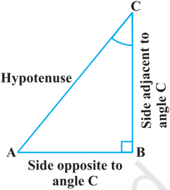

# PAGE 4

The first use of the idea of 'sine' in the way we use it today was in the work Aryabhatiyam by  Aryabhata, in A.D. 500. Aryabhata used the word ardha-jya for  the  half-chord,  which  was  shortened  to jya or jiva in  due  course.  When  the Aryabhatiyam was translated into Arabic, the word jiva was retained as it is. The word jiva was translated into sinus, which means curve, when the Arabic version was translated into Latin. Soon the word sinus , also used as sine , became common in mathematical texts throughout Europe. An English Professor of astronomy Edmund Gunter  (1581-1626),  first  used  the  abbreviated notation ' sin '.

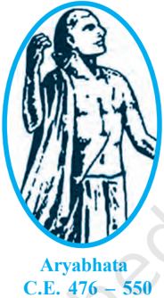

The origin of the terms 'cosine' and 'tangent' was much later. The cosine function arose from the need to compute the sine of the complementary angle. Aryabhatta called it kotijya . The name cosinus originated with Edmund Gunter. In 1674, the English Mathematician Sir Jonas Moore first used the abbreviated notation ' cos ' .

Remark : Note that the symbol sin A is used as an abbreviation for 'the sine of the angle A'. sin A is not the product of 'sin' and A. 'sin' separated from A has no meaning. Similarly, cos A is not the product of 'cos' and A. Similar interpretations follow for other trigonometric ratios also.

Now, if we take a point P on the hypotenuse AC or a point Q on AC extended, of the right triangle ABC and draw PM perpendicular to AB and QN perpendicular to AB extended (see Fig. 8.6), how will the trigonometric ratios of  A in  PAM differ from those of  A in  CAB or from those of  A in  QAN?

Fig.  8.6

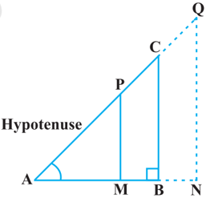

To answer this, first look at these triangles. Is  PAM similar to  CAB? From Chapter 6, recall the AA similarity criterion. Using the criterion, you will see that the triangles PAM and CAB are similar. Therefore, by the property of similar triangles, the corresponding sides of the triangles are proportional.

So, we have

<!-- formula-not-decoded -->

# PAGE 5

From this, we find

Similarly,

<!-- formula-not-decoded -->

<!-- formula-not-decoded -->

This shows that the trigonometric ratios of angle A in  PAM not differ from those of angle A in  CAB.

In the same way, you should check that the value of sin A (and also of other trigonometric ratios) remains the same in  QAN also.

From our observations, it is now clear that the values of the trigonometric ratios of an angle do not vary with the lengths of the sides of the triangle, if the  angle  remains the same.

Note : For the sake of convenience, we may write sin 2 A, cos 2 A, etc., in place of (sin A) 2 , (cos A) 2 , etc., respectively. But cosec A = (sin A) -1  sin -1 A (it is called sine inverse A). sin -1 A has a different meaning, which will be discussed in higher classes. Similar conventions hold for the other trigonometric ratios as well. Sometimes, the Greek letter  (theta) is also used to denote an angle.

We have defined six trigonometric ratios of an acute angle. If we know any one of the ratios, can we obtain the other ratios? Let us see.

If in a right triangle ABC, sin A = 1 , 3 then  this  means  that BC 1 AC 3  ,  i.e.,  the lengths of the sides BC and  AC of the triangle ABC are in the ratio 1 : 3 (see Fig. 8.7). So if BC is equal to k , then AC will be 3 k , where k is any positive number. To determine other

trigonometric ratios for the angle A, we need to find the length of the third side AB. Do you remember the Pythagoras theorem? Let us use it to determine the required length AB.

<!-- formula-not-decoded -->

<!-- formula-not-decoded -->

<!-- formula-not-decoded -->

So, we get

<!-- formula-not-decoded -->

<!-- formula-not-decoded -->

<!-- formula-not-decoded -->

Similarly, you can obtain the other trigonometric ratios of the angle A.

# PAGE 6

Remark : Since the hypotenuse is the longest side in a right triangle, the value of sin A or cos A is always less than 1 (or, in particular, equal to 1). Let us consider some examples.

Example 1 : Given  tan A  = 4 3 ,  find  the  other trigonometric ratios of the angle A.

Solution  : Let  us  first  draw  a  right  ABC (see Fig 8.8).

<!-- formula-not-decoded -->

Therefore, if BC = 4 k , then AB = 3 k , where k is a positive number.

Now, by using the Pythagoras Theorem, we have

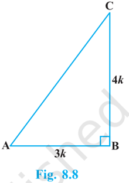

<!-- formula-not-decoded -->

Now, we can write all the trigonometric ratios using their definitions.

<!-- formula-not-decoded -->

Therefore, cot A = 1 3 1 5 , cosec A = tan A 4 sin A 4   and sec A = 1 5 cos A 3  

Example 2 : If  B  and  Q  are acute angles such that sin B = sin Q, then prove that  B =  Q.

Solution : Let us consider two right triangles  ABC  and  PQR  where sin B = sin Q (see Fig. 8.9).

We have and

# PAGE 7

<!-- formula-not-decoded -->

<!-- formula-not-decoded -->

<!-- formula-not-decoded -->

Now, using Pythagoras theorem, and

<!-- formula-not-decoded -->

<!-- formula-not-decoded -->

From (1) and (2), we have

<!-- formula-not-decoded -->

Then, by using Theorem 6.4,  ACB ~  PRQ and therefore,  B =  Q.

Example 3 : Consider  ACB, right-angled at C, in which AB = 29 units, BC = 21 units and  ABC =  (see Fig. 8.10). Determine the values of

- (i) cos 2  + sin 2  ,
- (ii) cos 2  - sin 2 

Solution : In ACB, we have



<!-- formula-not-decoded -->

<!-- formula-not-decoded -->

<!-- formula-not-decoded -->

<!-- formula-not-decoded -->

<!-- formula-not-decoded -->

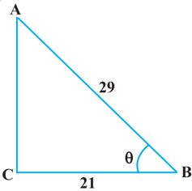

# PAGE 8

Example 4 : In a right triangle ABC, right-angled at B, if tan A = 1, then verify that

2  sin A cos A = 1.

<!-- formula-not-decoded -->

<!-- formula-not-decoded -->

Let AB = BC = k , where k is a positive number.

<!-- formula-not-decoded -->

Therefore,

So,

<!-- formula-not-decoded -->

<!-- formula-not-decoded -->

<!-- formula-not-decoded -->



Example  5  : In OPQ,  right-angled  at  P, OP = 7 cm and OQ - PQ = 1 cm (see Fig. 8.12). Determine the values of sin Q and cos Q.

Solution : In  OPQ, we have

<!-- formula-not-decoded -->

<!-- formula-not-decoded -->

<!-- formula-not-decoded -->

<!-- formula-not-decoded -->

<!-- formula-not-decoded -->

<!-- formula-not-decoded -->

<!-- formula-not-decoded -->

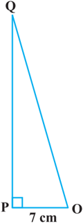

Fig.  8.12

# PAGE 9

## EXERCISE 8.1

1. In  ABC,  right-angled at B, AB = 24 cm, BC = 7 cm. Determine :
2. (i) sin A, cos A
3. (ii) sin C, cos C
2. In Fig. 8.13, find tan P - cot R.
3. If sin A = 3 , 4 calculate cos A and tan A.
4. Given 15 cot A = 8, find sin A and sec A.
5. Given sec  = 13 , 12 calculate all other trigonometric ratios.
6. If  A and  B are acute angles such that cos A = cos B, then show that  A =  B.

<!-- formula-not-decoded -->

8. If 3 cot A = 4, check whether 2 2 1 tan A 1 + tan A  = cos 2 A - sin 2 A or not.
9. In triangle ABC, right-angled at B, if tan A = 1 , 3 find the value of:
3. (i) sin A cos C + cos A sin C
4. (ii) cos A cos C - sin A sin C
10. In  PQR, right-angled at Q, PR + QR = 25 cm and PQ = 5 cm. Determine the values of sin P, cos P and tan P.
11. State whether the following are true or false. Justify your answer.
7. (i) The value of tan A is always less than 1.
8. (ii) sec A = 12 5 for some value of angle A.
9. (iii) cos A is the abbreviation used for the cosecant of angle A.
10. (iv) cot A is the product of cot and A.
11. (v) sin  = 4 3 for some angle  .

## 8.3 Trigonometric Ratios of Some Specific Angles

From geometry, you are already familiar with the construction of angles of 30°, 45°, 60° and 90°. In this section, we will find the values of the trigonometric ratios for these angles and, of course, for 0°.

# PAGE 10

## Trigonometric Ratios of 45°

In  ABC, right-angled at B, if one angle is 45°, then the other angle is also 45°, i.e.,  A =  C = 45° (see  Fig. 8.14).

<!-- formula-not-decoded -->

Now, Suppose BC = AB = a .

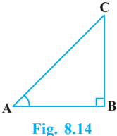

Then by Pythagoras Theorem, AC 2  = AB 2  + BC 2  = a 2 + a 2  = 2 a 2 ,

<!-- formula-not-decoded -->

Using the definitions of the trigonometric ratios, we have :

<!-- formula-not-decoded -->

<!-- formula-not-decoded -->

<!-- formula-not-decoded -->

<!-- formula-not-decoded -->

<!-- formula-not-decoded -->

## Trigonometric Ratios of 30° and 60°

Let us now calculate the trigonometric ratios of 30° and 60°. Consider an equilateral triangle ABC. Since each angle in an equilateral triangle is 60°, therefore,  A =  B =  C = 60°.

Draw the perpendicular AD from A to the side BC (see Fig. 8.15).

Now

Therefore, and

Now observe that:

 ABD is a right triangle, right-angled at D with  BAD = 30° and  ABD = 60° (see Fig. 8.15).

ABD ACD (Why?)

BAD = CAD (CPCT)

<!-- formula-not-decoded -->

# PAGE 11

As you know, for finding the trigonometric ratios, we need to know the lengths of the sides of the triangle. So, let us suppose that AB = 2 a .

Then, and

Therefore,

Now, we have :

<!-- formula-not-decoded -->

<!-- formula-not-decoded -->

Similarly,

<!-- formula-not-decoded -->

## Trigonometric Ratios of 0° and 90°

Let us see what happens to the trigonometric ratios of angle A, if it is made smaller and smaller in the right triangle ABC (see Fig. 8.16), till it becomes zero. As  A gets smaller and smaller, the length of the side BC decreases.The point C gets closer to point B, and finally when  A becomes very close to 0°, AC becomes almost the same as AB (see Fig. 8.17).

Fig.  8.17

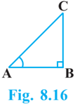

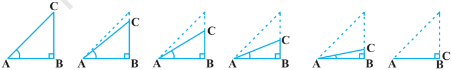

<!-- formula-not-decoded -->

# PAGE 12

When  A  is  very  close  to  0°,  BC  gets  very  close  to  0  and  so  the  value  of sin A = BC AC is very close to 0. Also, when  A is very close to 0°, AC is nearly the same as AB and so the value of cos A = AB AC is very close to 1.

This helps us to see how we can define the values of sin A and cos A when A = 0°. We define : sin 0° = 0 and cos 0° = 1.

Using these, we have :

<!-- formula-not-decoded -->

<!-- formula-not-decoded -->

Now, let us see what happens to the trigonometric ratios of  A, when it is made larger and larger in  ABC till it becomes 90°. As  A gets larger and larger,  C gets smaller and smaller. Therefore, as in the case above, the length of the side AB goes on decreasing. The point A gets closer to point B. Finally when  A is very close to 90°,  C  becomes  very  close  to  0°  and  the  side AC  almost  coincides  with  side  BC (see Fig. 8.18).

When  C is very close to 0°,  A is very close to 90°, side AC is nearly the same as side BC, and so sin A is very close to 1. Also when  A is very close to 90°,  C is very close to 0°, and the side AB is nearly zero, so cos A is very close to 0.

So, we define : sin  90°  = 1 and cos 90° = 0.

Now, why don't you find the other trigonometric ratios of 90°?

We shall now give the values of all the trigonometric ratios of 0°, 30°, 45°, 60° and 90° in Table 8.1, for ready reference.

# PAGE 13

Table 8.1

|  A     | 0°          | 30°   | 45°   | 60°   | 90°         |
|---------|-------------|-------|-------|-------|-------------|
| sinA    | 0           | 1 2   | 1 2   | 3 2   | 1           |
| cos A   | 1           | 3 2   | 1 2   | 1 2   | 0           |
| tanA    | 0           | 1 3   | 1     | 3     | Not defined |
| cosec A | Not defined | 2     | 2     | 2 3   | 1           |
| sec A   | 1           | 2 3   | 2     | 2     | Not defined |
| cotA    | Not defined | 3     | 1     | 1 3   | 0           |

Remark : From the table above you can observe that as  A increases from 0° to 90°, sin A increases from 0 to 1 and cos A decreases from 1 to 0.

Let us illustrate the use of the values in the table above through some examples.

Example  6  : In  ABC,  right-angled  at  B, AB = 5 cm and  ACB  =  30°  (see  Fig.  8.19). Determine the lengths of the sides BC and AC.

Solution : To find the length of the side BC, we will choose the trigonometric ratio involving BC and the given side AB. Since BC is the side adjacent to angle C and AB is the side opposite to angle C, therefore

<!-- formula-not-decoded -->

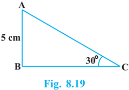

# PAGE 14

To find the length of the side AC, we consider

<!-- formula-not-decoded -->

<!-- formula-not-decoded -->

Note that alternatively we could have used Pythagoras theorem to determine the third side in the example above,

<!-- formula-not-decoded -->

Example 7 : In  PQR,  right-angled  at

Q (see Fig. 8.20), PQ = 3 cm and PR = 6 cm.

Determine  QPR and  PRQ.

Solution :

Given PQ = 3 cm and PR = 6 cm.

Therefore, or

So, and therefore,

<!-- formula-not-decoded -->

<!-- formula-not-decoded -->

<!-- formula-not-decoded -->

<!-- formula-not-decoded -->

You may note that if one of the sides and any other part (either an acute angle or any side) of a right triangle is known, the remaining sides and angles of the triangle can be determined.

<!-- formula-not-decoded -->

and B.

<!-- formula-not-decoded -->

<!-- formula-not-decoded -->

Solving (1) and (2), we get : A = 45° and B = 15°.

<!-- formula-not-decoded -->

# PAGE 15

## EXERCISE 8.2

## 1. Evaluate the following :

- (i) sin 60° cos 30° + sin 30° cos 60°

<!-- formula-not-decoded -->

- (ii) 2 tan 2 45° + cos 2 30° - sin 2 60°

<!-- formula-not-decoded -->

<!-- formula-not-decoded -->

<!-- formula-not-decoded -->

2. Choose the correct option and justify your choice :
2. (i) 2 2 tan 30 1 tan 30     (A) sin 60° (B) cos 60° (C) tan 60° (D) sin 30° (ii) 2 2 1 tan 45 1 tan 45      (A) tan 90° (B) 1 (C) sin 45° (D) 0 (iii) sin 2A = 2 sin A is true when A = (A) 0° (B) 30° (C) 45° (D) 60° (iv) 2 2 tan 30 1 tan 30     (A) cos 60° (B) sin 60° (C) tan 60° (D) sin 30°
3. If tan (A + B) = 3  and tan (A - B) = 1 3 ; 0° &lt; A + B  90°; A &gt; B, find A and B.
4. State whether the following are true or false. Justify your answer.
5. (i) sin (A + B) = sin A + sin B.
6. (ii) The value of sin  increases as  increases.
7. (iii) The value of cos  increases as  increases.
8. (iv) sin  = cos  for all values of  .
9. (v) cot A is not defined for A = 0°.

# PAGE 16

## 8.4 Trigonometric Identities

You may recall that an equation is called an identity when it is true for all values of the variables involved. Similarly, an equation involving trigonometric ratios of an angle is called a trigonometric identity, if it is true for all values of the angle(s) involved.

In this section, we will prove one trigonometric identity,  and  use  it  further  to  prove  other  useful trigonometric identities.

In  ABC, right-angled at B (see Fig. 8.21), we have:

<!-- formula-not-decoded -->

Dividing each term of (1) by AC 2 , we get

<!-- formula-not-decoded -->

<!-- formula-not-decoded -->

<!-- formula-not-decoded -->

<!-- formula-not-decoded -->

This is true for all A such that 0°  A  90°. So, this is a trigonometric identity. Let us now divide (1) by AB 2 . We get or,

i.e.,

<!-- formula-not-decoded -->

Is this equation true for A = 0°? Yes, it is. What about A = 90°? Well, tan A and sec A are not defined for A = 90°. So, (3) is true for all A such that 0°  A  90°.

Let us see what we get on dividing (1) by BC 2 . We get

<!-- formula-not-decoded -->

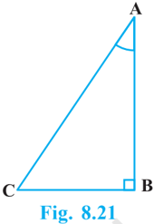

# PAGE 17

<!-- formula-not-decoded -->

Note that cosec A and cot A are not defined for A = 0°. Therefore (4) is true for all A such that 0° &lt; A  90°.

Using these identities, we can express each trigonometric ratio in terms of other trigonometric ratios, i.e., if any one of the ratios is known, we can also determine the values of other trigonometric ratios.

Let us see how we can do this using these identities. Suppose we know that

<!-- formula-not-decoded -->

<!-- formula-not-decoded -->

<!-- formula-not-decoded -->

Example 9 : Express the ratios cos A, tan A and sec A in terms of sin A.

Solution :

Since

This gives

<!-- formula-not-decoded -->

cos 2

A + sin 2

A = 1, therefore,

<!-- formula-not-decoded -->

<!-- formula-not-decoded -->

<!-- formula-not-decoded -->

Example 10 : Prove that sec A (1 - sin A)(sec A + tan A) = 1.

Solution :

<!-- formula-not-decoded -->

# PAGE 18

<!-- formula-not-decoded -->

<!-- formula-not-decoded -->

<!-- formula-not-decoded -->

<!-- formula-not-decoded -->

<!-- formula-not-decoded -->

Example 12 : Prove  that sin cos 1 1 , sin cos 1 sec tan             using  the  identity sec 2  = 1 + tan 2  .

Solution : Since we will apply the identity involving sec  and tan  ,  let  us  first convert the LHS (of the identity we need to prove) in terms of sec  and tan  by dividing numerator and denominator by cos 

<!-- formula-not-decoded -->

# PAGE 19

<!-- formula-not-decoded -->

which is the RHS of the identity, we are required to prove.

## EXERCISE 8.3

1. Express the trigonometric ratios sin A, sec A and tan A in terms of cot A.
2. Write all the other trigonometric ratios of  A in terms of sec A.
3. Choose the correct option. Justify your choice.

<!-- formula-not-decoded -->

- (D) 0 (ii) (1 + tan  + sec  ) (1 + cot  - cosec  ) = (A) 0 (B) 1 (C) 2 (D) -1 (iii) (sec A + tan A) (1 - sin A) = (A) sec A (B) sin A (C) cosec A (D) cos A (iv) 2 2 1 tan A 1 + cot A   (A) sec 2  A (B) -1 (C) cot 2  A (D) tan 2  A
4. Prove the following identities, where the angles involved are acute angles for which the expressions are defined.

<!-- formula-not-decoded -->

<!-- formula-not-decoded -->

<!-- formula-not-decoded -->

<!-- formula-not-decoded -->

[ Hint : Write the expression in terms of sin  and cos  ]

<!-- formula-not-decoded -->

- (viii) (sin A + cosec A) 2 + (cos A + sec A) 2 = 7 + tan 2 A + cot 2  A

# PAGE 20

<!-- formula-not-decoded -->

[ Hint :

<!-- formula-not-decoded -->

<!-- formula-not-decoded -->

## 8.5 Summary

In this chapter, you have studied the following points :

1. In a right triangle  ABC, right-angled at B,

<!-- formula-not-decoded -->

<!-- formula-not-decoded -->

2. 1 1 1 sin A , cosec A = ; sec A = ; tan A = tan A = sin  A cos A cot A cos A .
3. If one of the trigonometric ratios of an acute angle is known, the remaining trigonometric ratios of the angle can be easily determined.
4. The values of trigonometric ratios for angles 0°, 30°, 45°, 60° and 90°.
5. The value of sin A or cos A never exceeds 1, whereas the value of sec A (0° ≤ A &lt; 90°) or cosec A (0° &lt; A ≤ 90º) is always greater than or equal to 1.
6. sin 2 A + cos 2 A = 1, sec 2 A - tan 2 A = 1 for 0° ≤ A &lt; 90°, cosec 2 A = 1 + cot 2 A for 0° &lt; A ≤ 90º.