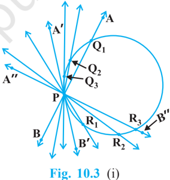
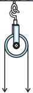
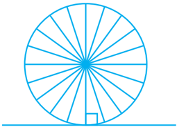
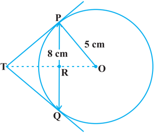

# PAGE 1

144

## 10.1 Introduction

You have studied in Class IX that a circle is a collection of all points in a plane which are at a constant distance (radius) from a fixed point (centre). You have also studied various terms related to a circle like chord, segment, sector, arc etc. Let us now examine the different situations that can arise when a circle and a line are given in a plane.

So, let us consider a circle and a line PQ. There can be three possibilities given in Fig. 10.1 below:

In Fig. 10.1 (i), the line PQ and the circle have no common point. In this case, PQ is called a non-intersecting line with respect to the circle. In Fig. 10.1 (ii), there are two common points A and B that the line PQ and the circle have. In this case, we call the line PQ a secant of the circle. In Fig. 10.1 (iii), there is only one point A which is common to the line PQ and the circle. In this case, the line is called a tangent to the circle.

MATHEMATICS

# PAGE 2

You might have seen a pulley fitted over a well which is used in taking out water from the well. Look at Fig. 10.2. Here the rope on both sides of the pulley, if considered as a ray, is like a tangent to the circle representing the pulley.

Is there any position of the line with respect to the circle other than the types given above? You can see that there cannot be any other type of position of the line with respect  to the circle. In this chapter, we will study about the existence of the tangents to a circle and also study some of their properties.

## 10.2 Tangent to a Circle

In  the  previous  section,  you  have  seen  that a  tangent* to a circle is a line that intersects  the  circle  at  only  one  point .

To understand the existence of the tangent to a circle at a point, let us perform the following activities:

Activity 1 : Take a circular wire and attach a straight wire AB at a point P of the circular wire so that it can rotate about the point P in a plane. Put the system on a table and gently rotate the wire AB about the point P to get different positions of the straight wire [see Fig. 10.3(i)].

In various positions, the wire intersects the circular wire at P and at another point Q 1 or Q 2 or Q 3 ,  etc.  In  one  position, you will see that it will intersect the circle at the point P only (see position A  B  of AB). This shows that a tangent exists at the point P of the circle. On rotating further, you can observe that in all other positions of AB, it will intersect the circle at P and at another point, say R 1 or R 2 or R 3 , etc. So, you can observe that there is only one tangent at a point of the circle .

While doing activity above, you must have observed that as the position AB moves towards the position A  B  , the common point, say Q 1 , of the line AB and the circle gradually comes nearer and nearer to the common point P . Ultimately, it coincides with the point P in the position A  B  of A  B  . Again note, what happens if 'AB' is rotated rightwards about P? The common point R 3 gradually comes nearer and nearer to P and ultimately coincides with P. So, what we see is:

The tangent to a circle is a special case of the secant, when the two end points of its  corresponding chord coincide .

*The word 'tangent' comes from the Latin word 'tangere', which means to touch and was introduced by the Danish mathematician Thomas Fineke in 1583.

Fig.  10.2

# PAGE 3

Activity 2 : On a paper, draw a circle and a secant PQ of the circle. Draw various lines parallel to the secant on both sides of it. You will find that after some steps, the length of the  chord  cut  by  the  lines  will  gradually decrease, i.e., the two points of intersection of the line and the circle are coming closer and closer  [see  Fig.  10.3(ii)].  In  one  case,  it becomes zero on one side of the secant and in another case, it becomes zero on the other side of the secant. See the positions P  Q  and P  Q  of the secant in Fig. 10.3 (ii). These are the tangents to the circle parallel to the given secant PQ. This also helps you to see that there cannot be more than two tangents parallel to a given secant.

This activity also establishes, what you must have observed, while doing Activity 1, namely, a tangent is the secant when both of the end points of the corresponding chord coincide.

The common point of the tangent and the circle is called the point of contact [the point A in Fig. 10.1 (iii)]and the tangent is said to touch the  circle at the common point.

Now look around you. Have you seen a bicycle or a cart moving? Look at its wheels. All the spokes of a wheel are along its radii. Now note the position of  the  wheel  with  respect  to  its  movement  on  the ground.  Do  you  see  any  tangent  anywhere? (See Fig. 10.4). In fact, the wheel moves along a line which is a tangent to the circle representing the wheel. Also, notice that in all positions, the radius through the point of contact with the ground appears to be at right angles to the tangent (see Fig. 10.4). We shall now prove this property of the tangent.

Fig.  10.4

Theorem 10.1 : The  tangent  at  any  point  of  a  circle  is  perpendicular  to  the radius  through  the  point  of  contact.

Proof : We are given a circle with centre O and a tangent XY to the circle at a point P. We need to prove that OP is perpendicular to XY.

# PAGE 4

Take a point Q on XY other than P and join OQ (see Fig. 10.5).

The point Q must lie outside the circle. (Why? Note that if Q lies inside the circle, XY will  become a secant and not a tangent to the circle). Therefore, OQ is longer than the radius OP of the circle. That is,

<!-- formula-not-decoded -->

Since this happens for every point on the line  XY  except  the  point  P,  OP  is  the shortest of all the distances of the point O to the points  of  XY.  So  OP  is  perpendicular  to  XY. (as shown in Theorem A1.7.)

## Remarks

1. By theorem above, we can also conclude that at any point on a circle there can be one and only one tangent.
2. The line containing the radius through the point of contact is also sometimes called the 'normal' to the circle at the point.

## EXERCISE 10.1

1. How many tangents can a circle have?
2. Fill in the blanks :
3. (i) A tangent to a circle intersects it in point (s).
4. (ii) A line intersecting a circle in two points is called a .
5. (iii) A circle can have parallel tangents at the most.
6. (iv) The common point of a tangent to a circle and the circle is called .
3. A tangent PQ at a point P of a circle of radius 5 cm meets a line through the centre O at a point Q so that OQ = 12 cm. Length PQ is :
8. (A) 12 cm
9. (B) 13 cm
10. (C) 8.5 cm
11. (D) 119  cm.
4. Draw a circle and two lines parallel to a given line such that one is a tangent and the other, a secant to the circle.

## 10.3 Number of Tangents from a Point on a Circle

To get an idea of the number of tangents from a point on a circle, let us perform the following activity:

# PAGE 5

Activity 3 : Draw a circle on a paper. Take a point P inside it. Can you draw a tangent to the circle through this point? You will find that all the lines through this point intersect the circle in two points. So, it is not possible to draw any tangent  to  a  circle  through  a  point  inside  it [see Fig. 10.6 (i)].

Next take a point P on the circle and draw tangents through this point. You have already observed that there is only one tangent to the circle at such a point [see Fig. 10.6 (ii)].

Finally, take a point P outside the circle and try to draw tangents to the circle from this point. What do you observe? You will find that you can  draw  exactly  two  tangents  to  the  circle through this point [see Fig. 10.6 (iii)].

We can summarise these facts as follows:

Case 1 : There is no tangent to a circle passing through a point lying inside the circle.

Case 2 : There is one and only one tangent to a circle passing through a point lying on the circle.

Case 3 : There are exactly two tangents to a circle through a point lying outside the circle.

In Fig. 10.6 (iii), T 1 and T 2 are the points of contact of the tangents PT 1 and  PT 2 respectively.

The length of the segment of the tangent from the external point P and the point of contact with the circle is called the length of the tangent from the point P to the circle.

Note that in Fig. 10.6 (iii), PT 1 and PT 2 are the lengths of the tangents from P to the circle. The lengths PT 1 and  PT 2 have a common property. Can you find this? Measure PT 1 and PT 2 . Are these equal? In fact, this is always so. Let us give a proof of this fact in the following theorem.

# PAGE 6

Theorem 10.2 : The lengths of tangents drawn from an external point to a circle are equal .

Proof : We are given a circle with centre O, a point P lying outside the circle and two tangents PQ, PR on the circle from P (see Fig. 10.7). We are required to prove that PQ = PR.

For this,  we  join  OP,  OQ  and  OR. Then ∠ OQP and ∠ ORP are right  angles,  because these are angles between the radii and tangents, and according to Theorem 10.1 they are right angles. Now in right triangles OQP and ORP,

Fig.  10.7

|            | OQ = OR       | (Radii of the same circle)   |
|------------|---------------|------------------------------|
|            | OP = OP       | (Common)                     |
| Therefore, | ∆ OQP ≅ ∆ ORP | (RHS)                        |
| This gives | PQ = PR       | (CPCT)                       |

## Remarks

1. The theorem can also be proved by using the Pythagoras Theorem as follows:

<!-- formula-not-decoded -->

which gives PQ = PR.

2. Note also that ∠ OPQ = ∠ OPR. Therefore, OP is the angle bisector of ∠ QPR, i.e., the centre lies on the bisector of the angle between the two tangents.

Let us take some examples.

Example 1 : Prove that in two concentric circles, the chord of the larger circle, which touches the smaller circle, is bisected at the point of contact.

Solution : We are given two concentric circles C 1 and C 2 with centre O and a chord AB of the larger circle C 1 which touches the smaller circle C 2 at the point P (see Fig. 10.8). We need to prove that AP = BP.

Let us join OP. Then, AB is a tangent to C 2 at P and OP is its radius. Therefore, by Theorem 10.1,

OP ⊥ AB

Fig.  10.8

# PAGE 7

Now AB is a chord of the circle C 1 and OP  AB. Therefore, OP is the bisector of the chord AB, as the perpendicular from the centre bisects the chord,

<!-- formula-not-decoded -->

Example 2 : Two tangents TP and TQ are drawn to a circle with centre O from an external point T. Prove that  PTQ = 2  OPQ.

Solution : We are given a circle with centre O, an external point T and two tangents TP and TQ to the circle, where P, Q are the points of contact (see Fig. 10.9). We need to prove that

<!-- formula-not-decoded -->

Fig.  10.9

<!-- formula-not-decoded -->

<!-- formula-not-decoded -->

Now, by Theorem 10.2, TP = TQ. So, TPQ is an isosceles triangle.

<!-- formula-not-decoded -->

Also, by Theorem 10.1,

 OPT = 90°

<!-- formula-not-decoded -->

<!-- formula-not-decoded -->

<!-- formula-not-decoded -->

This gives

Example 3 : PQ is a chord of length 8 cm of a circle of radius 5 cm. The tangents at P and Q intersect at a point T (see Fig. 10.10). Find the length TP.

Solution : Join  OT.  Let  it  intersect  PQ  at  the point R. Then  TPQ is isosceles and TO is the angle  bisector  of  PTQ.  So,  OT  PQ and  therefore,  OT  bisects  PQ  which  gives PR = RQ = 4 cm.

<!-- formula-not-decoded -->

Fig.  10.10

# PAGE 8

Now,

So, RPO = PTR

<!-- formula-not-decoded -->

Therefore, right triangle TRP is similar to the right triangle PRO by AA similarity.

This gives

<!-- formula-not-decoded -->

Note : TP can also be found by using the Pythagoras Theorem, as follows:

Let

<!-- formula-not-decoded -->

<!-- formula-not-decoded -->

<!-- formula-not-decoded -->

Subtracting (1) from (2), we get

<!-- formula-not-decoded -->

<!-- formula-not-decoded -->

## EXERCISE 10.2

In Q.1 to 3, choose the correct option and give justification.

1. From a point Q, the length of the tangent to a circle is 24 cm and the distance of Q from the centre is 25 cm. The radius of the circle is
2. (A) 7 cm
3. (C) 15 cm
4. (B) 12 cm
5. (D) 24.5 cm
2. In Fig. 10.11, if TP and TQ are the two tangents to a circle with centre O so that  POQ = 110°, then  PTQ is equal to
7. (A) 60°
8. (C) 80°
9. (B) 70°
10. (D) 90°
3. If tangents PA and PB from a point P to a circle with centre O are inclined to each other at angle of 80°, then  POA is equal to
12. (A) 50°
13. (C) 70°
14. (B) 60°
15. (D) 80°

Therefore, or

# PAGE 9

4. Prove that the tangents drawn at the ends of a diameter of a circle are parallel.
5. Prove that the perpendicular at the point of contact to the tangent to a circle passes through the centre.
6. The length of a tangent from a point A at distance 5 cm from the centre of the circle is 4 cm. Find the radius of the circle.
7. Two concentric circles are of radii 5 cm and 3 cm. Find the length of the chord of the larger circle which touches the smaller circle.
8. A quadrilateral ABCD is drawn to circumscribe a circle (see Fig. 10.12). Prove that

AB + CD = AD + BC

Fig.  10.12

Fig.  10.13

9. In Fig. 10.13, XY and X  Y  are two parallel tangents to a circle with centre O and another tangent AB with point of contact C intersecting XY at A and X  Y  at B. Prove that  AOB = 90°.
10. Prove that the angle between the two tangents drawn from an external point to a circle is  supplementary to the angle subtended by the line-segment joining the points of contact at the centre.
11. Prove that the parallelogram circumscribing a circle is a rhombus.
12. A triangle ABC is drawn to circumscribe a circle of radius 4 cm such that the segments BD and DC into which BC is divided by the point of contact  D  are  of  lengths  8  cm  and  6  cm respectively (see Fig. 10.14). Find the sides  AB and AC.
13. Prove that  opposite  sides  of  a  quadrilateral circumscribing a circle subtend supplementary angles at the centre of the circle.

# PAGE 10

## 10.4 Summary

In this chapter, you have studied the following points :

1. The meaning of a tangent to a circle.
2. The tangent to a circle is perpendicular to the radius through the point of contact.
3. The lengths of the two tangents from an external point to a circle are equal.