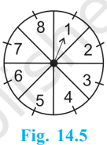
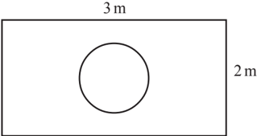

# PAGE 1

202

The theory of probabilities and the theory of errors now constitute a  formidable  body  of  great  mathematical  interest  and  of  great practical  importance.

- R.S. Woodward

## 14.1 Probability - A Theoretical Approach

Let us consider the following situation :

Suppose a coin is tossed at random .

When we speak of a coin, we assume it to be 'fair', that is, it is symmetrical so that there is no reason for it to come down more often on one side than the other. We call this property of the coin as being 'unbiased'. By the phrase 'random toss', we mean that the coin is allowed to fall freely without any bias or interference .

We know, in advance, that the coin can only land in one of two possible ways either head up or tail up (we dismiss the possibility of its 'landing' on its edge, which may be possible, for example, if it falls on sand). We can reasonably assume that each outcome, head or tail, is as likely to occur as the other . We refer to this by saying that the outcomes head and tail, are equally likely .

For another example of equally likely outcomes, suppose we throw a die once. For us, a die will always mean a fair die. What are the possible outcomes? They are 1, 2, 3, 4, 5, 6. Each number has the same possibility of showing up. So the equally likely outcomes of throwing a die are 1, 2, 3, 4, 5 and 6.

MATHEMATICS

# PAGE 2

Are the outcomes of every experiment equally likely? Let us see.

Suppose that a bag contains 4 red balls and 1 blue ball, and you draw a ball without looking into the bag. What are the outcomes? Are the outcomes - a red ball and a blue ball equally likely? Since there are 4 red balls and only one blue ball, you would agree that you are more likely to get a red ball than a blue ball. So, the outcomes (a red ball or a blue ball) are not equally likely. However, the outcome of drawing a ball of any colour from the bag is equally likely. So, all experiments do not necessarily have equally likely outcomes.

However, in this chapter, from now on, we will assume that all the experiments have equally likely outcomes.

In Class IX, we defined the experimental or empirical probability P(E) of an event E as

<!-- formula-not-decoded -->

The empirical interpretation of probability can be applied to every event associated with an experiment which can be repeated a large number of times. The requirement of  repeating  an  experiment  has  some  limitations,  as  it  may  be  very  expensive  or unfeasible in many situations. Of course, it worked well in coin tossing or die throwing experiments. But how about repeating the experiment of launching a satellite in order to compute the empirical probability of its failure during launching, or the repetition of the phenomenon of an earthquake to compute the empirical probability of a multistoreyed building getting destroyed in an earthquake?

In experiments where we are prepared to make certain assumptions, the repetition of an experiment can be avoided, as the assumptions help in directly calculating the exact (theoretical) probability. The assumption of equally likely outcomes (which is valid in many experiments, as in the two examples above, of a coin and of a die) is one such assumption that leads us to the following definition of probability of an event.

The theoretical probability (also called classical probability ) of an event E, written as P(E), is defined as

<!-- formula-not-decoded -->

where we assume that the outcomes of the experiment are equally likely .

We will briefly refer to theoretical probability as probability.

This definition of probability was given by Pierre Simon Laplace in 1795.

# PAGE 3

Probability theory had its origin in the 16th century when an Italian physician and mathematician J.Cardan wrote the first book on the subject, The Book on Games of Chance. Since its inception, the study of probability has attracted the  attention  of  great  mathematicians.  James  Bernoulli (1654  -  1705),  A.  de  Moivre  (1667  -  1754),  and Pierre Simon Laplace are among those who made significant contributions to this field. Laplace's Theorie Analytique des  ProbabilitØs, 1812, is  considered  to  be  the  greatest contribution by a single person to the theory of probability. In recent years, probability has been used extensively in many areas such as biology, economics, genetics, physics, sociology etc.

Pierre  Simon Laplace (1749 - 1827)

Let us find the probability for some of the events associated with experiments where the equally likely assumption holds.

Example 1 : Find the probability of getting a head when a coin is tossed once. Also find the probability of getting a tail.

Solution : In the experiment of tossing a coin once, the number of possible outcomes is two - Head (H) and Tail (T). Let E be the event 'getting a head'. The number of outcomes favourable to E, (i.e., of getting a head) is 1. Therefore,

<!-- formula-not-decoded -->

Similarly, if F is the event 'getting a tail', then

<!-- formula-not-decoded -->

Example 2 : A bag contains a red ball, a blue ball and a yellow ball, all the balls being of the same size. Kritika takes out a ball from the bag without looking into it. What is the probability that she takes out the

- (i) yellow ball?
- (ii) red ball?
- (iii) blue ball?

Solution : Kritika takes out a ball from the bag without looking into it. So, it is equally likely that she takes out any one of them.

# PAGE 4

Let Y be the event 'the ball taken out is yellow', B be the event 'the ball taken out is blue', and R be the event 'the ball taken out is red'.

Now, the number of possible outcomes = 3.

- (i) The number of outcomes favourable to the event Y = 1.

<!-- formula-not-decoded -->

So, 3 Similarly, (ii) P(R) = 1 3 and (iii) P(B) = 1 3 

## Remarks :

1. An event having only one outcome of the experiment is called an elementary event. In Example 1, both the events E and F are elementary events. Similarly, in Example 2, all the three events, Y , B and R are elementary events.

2. In Example 1, we note that : P(E) + P(F) = 1

In Example 2, we note that : P(Y) + P(R) + P(B) = 1

Observe that the sum of the probabilities of all the elementary events of an experiment is 1. This is true in general also.

Example 3 : Suppose we throw a die once. (i) What is the probability of getting a number greater than 4 ? (ii) What is the probability of getting a number less than or equal to 4 ?

Solution : (i) Here, let E be the event 'getting a number greater than 4'. The number of possible outcomes is six : 1, 2, 3, 4, 5 and 6, and the outcomes favourable to E are 5 and 6. Therefore, the number of outcomes favourable to E is 2. So,

<!-- formula-not-decoded -->

- (ii) Let F be the event 'getting a number less than or equal to 4'.

Number of possible outcomes = 6

Outcomes favourable to the event F are 1, 2, 3, 4.

So, the number of outcomes favourable to F is 4.

Therefore,

<!-- formula-not-decoded -->

# PAGE 5

Are the events E and F in the example above elementary events? No, they are not because the event E has 2 outcomes and the event F has 4 outcomes.

Remarks : From Example 1, we note that

<!-- formula-not-decoded -->

where E is the event 'getting a head' and F is the event 'getting a tail'.

From (i) and (ii) of Example 3, we also get

<!-- formula-not-decoded -->

where E is the event 'getting a number &gt;4' and F is the event 'getting a number  4'.

Note that getting a number not greater than 4 is same as getting a number less than or equal to 4, and vice versa.

In (1) and (2) above, is F not the same as 'not E'? Yes, it is. We denote the event 'not E' by  E .

<!-- formula-not-decoded -->

<!-- formula-not-decoded -->

<!-- formula-not-decoded -->

In general, it is true that for an event E,

<!-- formula-not-decoded -->

The event  E , representing 'not E', is called the complement of the event E. We also say that E and  E  are complementary events.

Before proceeding further, let us try to find the answers to the following questions:

- (i) What is the probability of getting a number 8 in a single throw of a die?
- (ii) What is the probability of getting a number less than 7 in a single throw of a die?

## Let us answer (i) :

We know that there are only six possible outcomes in a single throw of a die. These outcomes are 1, 2, 3, 4, 5 and 6. Since no face of the die is marked 8, so there is no outcome favourable to 8, i.e., the number of such outcomes is zero. In other words, getting 8 in a single throw of a die, is impossible .

<!-- formula-not-decoded -->

# PAGE 6

That is, the probability of an event which is impossible to occur is 0. Such an event is called an impossible event .

## Let us answer (ii) :

Since every face of a die is marked with a number less than 7, it is sure that we will  always  get  a  number  less  than  7  when  it  is  thrown  once.  So,  the  number  of favourable outcomes is the same as the number of all possible outcomes, which is 6.

Therefore,

<!-- formula-not-decoded -->

So, the probability of an event which is sure (or certain ) to occur is 1. Such an event is  called a sure event or  a certain event .

Note : From the definition of the probability P(E), we see that the numerator (number of outcomes favourable to the event E) is always less than or equal to the denominator (the number of all possible outcomes). Therefore,

<!-- formula-not-decoded -->

Now, let us take an example related to playing cards. Have you seen a deck of playing cards? It consists of 52 cards which are divided into 4 suits of 13 cards eachspades (  ), hearts (  ), diamonds (  ) and clubs (  ). Clubs and spades are of black colour, while hearts and diamonds are of red colour. The cards in each suit are ace, king, queen, jack, 10, 9, 8, 7, 6, 5, 4, 3 and 2. Kings, queens and jacks are called face cards .

Example 4 : One card is drawn from a well-shuffled deck of 52 cards. Calculate the probability that the card will

- (i) be an ace,
- (ii) not be an ace.
- (i) There are 4 aces in a deck. Let E be the event 'the card is an ace'.

Solution : Well-shuffling ensures equally likely outcomes.

The number of outcomes favourable to E = 4

The number of possible outcomes = 52 (Why ?)

Therefore,

<!-- formula-not-decoded -->

- (ii) Let F be the event 'card drawn is not an ace'.

The number of outcomes favourable to the event F = 52 - 4 = 48 (Why?)

# PAGE 7

The number of possible outcomes = 52

<!-- formula-not-decoded -->

<!-- formula-not-decoded -->

Remark : Note that F is nothing but  E . Therefore, we can also calculate P(F) as

<!-- formula-not-decoded -->

<!-- formula-not-decoded -->

Example 5 : Two players, Sangeeta and Reshma, play a tennis match. It is known that the probability of Sangeeta winning the match is 0.62. What is the probability of Reshma winning the match?

Solution : Let S and R denote the events that Sangeeta wins the match and Reshma wins the match, respectively.

The probability of Sangeeta's winning = P(S) = 0.62 (given)

The probability of Reshma's winning = P(R) = 1 - P(S)

[As the events R and S are complementary]

<!-- formula-not-decoded -->

Example 6 : Savita and Hamida are friends. What is the probability that both will have (i) different birthdays? (ii) the same birthday? (ignoring a leap year).

Solution : Out of the two friends, one girl, say, Savita's birthday can be any day of the year. Now, Hamida's birthday can also be any day of 365 days in the year.

We assume that these 365 outcomes are equally likely.

- (i) If Hamida's birthday is different from Savita's, the number of favourable outcomes for her birthday is 365 - 1 = 364

<!-- formula-not-decoded -->

- (ii) P(Savita and Hamida have the same birthday)

= 1 - P (both have different birthdays)

<!-- formula-not-decoded -->

# PAGE 8

Example 7 : There are 40 students in Class X of a school of whom 25 are girls and 15 are boys. The class teacher has to select one student as a class representative. She writes the name of each student on a separate card, the cards being identical. Then she puts cards in a bag and stirs them thoroughly. She then draws one card from the bag. What is the probability that the name written on the card is the name of (i) a girl? (ii) a  boy?

Solution : There are 40 students, and only one name card has to be chosen.

- (i) The number of all possible outcomes is 40

The number of outcomes favourable for a card with the name of a girl = 25 (Why?)

<!-- formula-not-decoded -->

- (ii) The number of outcomes favourable for a card with the name of a boy = 15 (Why?)

<!-- formula-not-decoded -->

Note : We can also determine P(Boy), by taking

<!-- formula-not-decoded -->

Example 8 : A box contains 3 blue, 2 white, and 4 red marbles. If a marble is drawn at random from the box, what is the probability that it will be

- (i) white?
- (ii) blue?

<!-- formula-not-decoded -->

Solution : Saying that a marble is drawn at random is a short way of saying that all the marbles are equally likely to be drawn. Therefore, the

<!-- formula-not-decoded -->

Let W denote the event 'the marble is white', B denote the event 'the marble is blue' and R denote the event 'marble is red'.

- (i) The number of outcomes favourable to the event W = 2

So,

Similarly,

<!-- formula-not-decoded -->

<!-- formula-not-decoded -->

Note that P(W) + P(B) + P(R) = 1.

# PAGE 9

Example 9 : Harpreet tosses two different coins simultaneously (say, one is of ` 1 and other of ` 2). What is the probability that she gets at least one head?

Solution : We write H for 'head' and T for 'tail'. When two coins are tossed simultaneously, the possible outcomes are (H, H), (H, T), (T, H), (T, T), which are all equally likely . Here (H, H) means head up on the first coin (say on ` 1) and head up on the second coin ( ` 2). Similarly (H, T) means head up on the first coin and tail up on the second coin and so on.

The outcomes favourable to the event E, 'at least one head' are (H, H), (H, T) and (T, H). (Why?)

So, the number of outcomes favourable to E is 3.

<!-- formula-not-decoded -->

<!-- formula-not-decoded -->

i.e., the probability that Harpreet gets at least one head is 3 4 

Note : You can also find P(E) as follows:

<!-- formula-not-decoded -->

Did you observe that in all the examples discussed so far, the number of possible outcomes in each experiment was finite? If not, check it now.

There are many experiments in which the outcome is any number between two given numbers, or in which the outcome is every point within a circle or rectangle, etc. Can you now count the number of all possible outcomes? As you know, this is not possible since there are infinitely many numbers between two given numbers, or there are infinitely many  points within a circle. So, the definition of (theoretical) probability which you have learnt so far cannot be applied in the present form. What is the way out? To answer this, let us consider the following example :

Example 10* : In a musical chair game, the person playing the music has been advised to stop playing the music at any time within 2 minutes after she starts playing. What is the probability that the music will stop within the first half-minute after starting?

Solution : Here the possible outcomes are all the numbers between 0 and 2. This is the portion of the number line from 0 to 2 (see Fig. 14.1).

<!-- formula-not-decoded -->

* Not from the examination point of view.

# PAGE 10

Let E be the event that 'the music is stopped within the first half-minute'.

The outcomes favourable to E are points on the number line from 0 to 1 2 .

The distance from 0 to 2 is 2, while the distance from 0 to 1 is 1

2 2 .

Since all the outcomes are equally likely, we can argue that, of the total distance of 2, the distance favourable to the event E is 1 2 .

<!-- formula-not-decoded -->

Can we now extend the idea of Example 10 for finding the probability as the ratio of the favourable area to the total area?

Example 11* : A missing helicopter is reported to have crashed somewhere in the rectangular region shown in Fig. 14.2. What is the probability that it crashed inside the lake shown in the figure?

Fig.  14.2

Solution : The helicopter is equally likely to crash anywhere in the region.

Area of the entire region where the helicopter can crash

<!-- formula-not-decoded -->

* Not from the examination point of view.

# PAGE 11

Area of the lake = (2.5 × 3) km 2 = 7.5 km 2

<!-- formula-not-decoded -->

Example 12 : A carton consists of 100 shirts of which 88 are good, 8 have minor defects and 4 have major defects. Jimmy, a trader, will only accept the shirts which are good, but Sujatha, another trader, will only reject the shirts which have major defects. One shirt is drawn at random from the carton. What is the probability that

- (i) it is acceptable to Jimmy?
- (ii) it is acceptable to Sujatha?

Solution : One shirt is drawn at random from the carton of 100 shirts. Therefore, there are 100 equally likely outcomes.

- (i) The number of outcomes favourable (i.e., acceptable) to Jimmy = 88 (Why?)

<!-- formula-not-decoded -->

- (ii) The number of outcomes favourable to Sujatha = 88 + 8 = 96 (Why?)

<!-- formula-not-decoded -->

Example 13 : Two dice, one blue and one grey, are thrown at the same time. Write down all the possible outcomes. What is the probability that the sum of the two numbers appearing on the top of the dice is

<!-- formula-not-decoded -->

Solution : When the blue die shows '1', the grey die could show any one of the numbers 1, 2, 3, 4, 5, 6. The same is true when the blue die shows '2', '3', '4', '5' or '6'. The possible outcomes of the experiment are listed in the table below; the first number in each ordered pair is the number appearing on the blue die and the second number is that on the grey die.

# PAGE 12

Fig.  14.3

|    | 1      | 2      | 3      | 4      | 5      | 6      |
|----|--------|--------|--------|--------|--------|--------|
|  1 | (1, 1) | (1, 2) | (1, 3) | (1, 4) | (1, 5) | (1, 6) |
|  2 | (2, 1) | (2, 2) | (2, 3) | (2, 4) | (2, 5) | (2, 6) |
|  3 | (3, 1) | (3, 2) | (3, 3) | (3, 4) | (3, 5) | (3, 6) |
|  4 | (4, 1) | (4, 2) | (4, 3) | (4, 4) | (4, 5) | (4, 6) |
|  5 | (5, 1) | (5, 2) | (5, 3) | (5, 4) | (5, 5) | (5, 6) |
|  6 | (6, 1) | (6, 2) | (6, 3) | (6, 4) | (6, 5) | (6, 6) |

Note that the pair (1, 4) is different from (4, 1). (Why?)

So, the number of possible outcomes = 6 × 6 = 36.

- (i) The outcomes favourable to the event 'the sum of the two numbers is 8' denoted by E, are: (2, 6), (3, 5), (4, 4), (5, 3), (6, 2) (see Fig. 14.3)

i.e., the number of outcomes favourable to E = 5.

Hence,

<!-- formula-not-decoded -->

- (ii) As you can see from Fig. 14.3, there is no outcome favourable to the event F, 'the sum of two numbers is 13'.

<!-- formula-not-decoded -->

<!-- formula-not-decoded -->

- (iii) As you can see from Fig. 14.3, all the outcomes are favourable to the event G , 'sum of two numbers ≤ 12'.

<!-- formula-not-decoded -->

<!-- formula-not-decoded -->

# PAGE 13

## EXERCISE 14.1

1. Complete the following statements:

- (i) Probability of an event E + Probability of the event 'not E' = .

- (ii) The probability of an event that cannot happen is . Such an event is called .

- (iii) The probability of an event that is certain to happen is . Such an event is called .

- (iv) The sum of the probabilities of all the elementary events of an experiment is .

- (v) The probability of an event is greater than or equal to and less than or equal to .

2. Which of the following experiments have equally likely outcomes? Explain.

- (i) A driver attempts to start a car. The car starts or does not start.

- (ii) A player attempts to shoot a basketball. She/he shoots or misses the shot.

- (iii) A trial is made to answer a true-false question. The answer is right or wrong.

- (iv) A baby is born. It is a boy or a girl.

3. Why is tossing a coin considered to be a fair way of deciding which team should get the ball at the beginning of a football game?

4. Which of the following cannot be the probability of an event?

- (A) 2 3

- (B) -1.5

- (C) 15%

- (D) 0.7

5. If P(E) = 0.05, what is the probability of 'not E'?

6. A bag contains lemon flavoured candies only. Malini takes out one candy without looking into the bag. What is the probability that she takes out

- (i) an orange flavoured candy?

- (ii) a lemon flavoured candy?

7. It is given that in a group of 3 students, the probability of 2 students not having the same birthday is 0.992. What is the probability that the 2 students have the same birthday?

8. A bag contains 3 red balls and 5 black balls. A ball is drawn at random from the bag. What is the probability that the ball drawn is (i) red ? (ii) not red?

9. A box contains 5 red marbles, 8 white marbles and 4 green marbles. One marble is taken out of the box at random. What is the probability that the marble taken out will be (i) red ? (ii) white ? (iii) not green?

# PAGE 14

10. A piggy bank contains hundred 50p coins,  fifty ` 1 coins, twenty ` 2 coins and ten ` 5 coins. If it is equally likely that one of the coins will fall out when the bank is turned upside down, what is the probability that the coin (i) will be a 50 p coin ? (ii) will not be a ` 5 coin?
11. Gopi buys  a fish from a shop for his aquarium. The shopkeeper takes out one fish at random from a tank containing 5 male fish and 8 female fish (see Fig. 14.4). What is the probability that the fish taken out is a male fish?
12. A game of chance consists of spinning an arrow which comes to rest pointing at one of the numbers 1, 2, 3, 4, 5, 6, 7, 8 (see Fig. 14.5 ), and these are equally likely outcomes. What is the probability that it will point at
4. (i) 8 ?
5. (ii) an odd number?
6. (iii) a number greater than 2?
7. (iv) a number less than 9?
13. A die is thrown once. Find the probability of getting
9. (i) a prime number;
10. (ii)
11. a number lying between 2 and 6;

Fig.  14.4

- (iii) an odd number.
14. One card is drawn from a well-shuffled deck of 52 cards. Find the probability of getting
- (i) a king of red colour
- (iv) the jack of hearts
- (ii) a face card
- (v) a spade
- (iii) a red face card
- (vi) the queen of diamonds
15. Five cards-the ten, jack, queen, king and ace of diamonds, are well-shuffled with their face downwards. One card is then picked up at random.
- (i) What is the probability that the card is the queen?
- (ii) If the queen is drawn and put aside, what is the probability that the second card picked up is (a) an ace? (b) a queen?
16. 12 defective pens are accidentally mixed with 132 good ones. It is not possible to just look at a pen and tell whether or not it is defective. One pen is taken out at random from this lot. Determine the probability that the pen taken out is a good one.
17. (i) A lot of 20 bulbs contain 4 defective ones. One bulb is drawn at random from the lot. What is the probability that this bulb is defective?
- (ii) Suppose the bulb drawn in (i) is not defective and is not replaced. Now one bulb is drawn at random from the rest. What is the probability that this bulb is not defective ?
18. A box contains 90 discs which are numbered from 1 to 90. If one disc is drawn at random from the box, find the probability that it bears (i) a two-digit number (ii) a perfect square number (iii) a number divisible by 5.

# PAGE 15

19. A child has a die whose six faces show the letters as given below:

The die is thrown once. What is the probability of getting (i) A? (ii) D?

- 20*. Suppose you drop a die at random on the rectangular region shown in Fig. 14.6. What is the probability that it will land inside the circle with diameter 1m?
21. A lot consists of 144 ball pens of which 20 are defective and the others are good. Nuri will buy a pen if it is good, but will not buy if it is defective. The shopkeeper draws one pen at random and gives it to her. What is the probability that
- (i) She will buy it ?
- (ii) She will not buy it ?
22. Refer to Example 13. (i) Complete the following table:
- (ii) A student argues that 'there are 11 possible outcomes 2, 3, 4, 5, 6, 7, 8, 9, 10, 11 and 12. Therefore, each of them has a probability 1 11 . Do you agree with this argument? Justify your answer.
23. A game consists of tossing a one rupee coin 3 times and noting its outcome each time. Hanif wins if all the tosses give the same result i.e., three heads or three tails, and loses otherwise. Calculate the probability that Hanif will lose the game.
24. A die is thrown twice. What is the probability that
- (i) 5 will not come up either time?
- (ii) 5 will come up at least once?

Fig.  14.6

| Event: 'Sumon2dice'   | 2    | 3   | 4   | 5   | 6   | 7   | 8    | 9   | 10   | 11   | 12   |
|-----------------------|------|-----|-----|-----|-----|-----|------|-----|------|------|------|
| Probability           | 1 36 |     |     |     |     |     | 5 36 |     |      |      | 1 36 |

[ Hint : Throwing a die twice and throwing two dice simultaneously are treated as the same experiment]

* Not from the examination point of view.

# PAGE 16

25. Which of the following arguments are correct and which are not correct? Give reasons for your answer.
2. (i) If two coins are tossed simultaneously there are three possible outcomes-two heads,  two  tails  or  one  of  each.  Therefore,  for  each  of  these  outcomes,  the probability is 1 3 
3. (ii) If a die is thrown, there are two possible outcomes-an odd number or an even number. Therefore, the probability of getting an odd number is 1 2 .

## 14.2 Summary

In this chapter, you have studied the following points :

1. The theoretical (classical) probability of an event E, written as P(E), is defined as

<!-- formula-not-decoded -->

where we assume that the outcomes of the experiment are equally likely.

2. The probability of a sure event (or certain event) is 1.
3. The probability of an impossible event is 0.
4. The probability of an event E is a number P(E) such that

<!-- formula-not-decoded -->

5. An event having only one outcome is called an elementary event. The sum of the probabilities of all the elementary events of an experiment is 1.
6. For any event E, P (E) + P ( E ) = 1, where  E  stands for 'not E'. E and  E  are called complementary events.

## A NOTE TO THE READER

The experimental or empirical probability of an event is based on what has actually happened while the theoretical probability of the event attempts to predict what will happen on the basis of certain assumptions. As  the  number  of  trials  in  an  experiment,  go  on i n c r e a s i n g   w e   m a y   e x p e c t   t h e   e x p e r i m e n t a l   a n d   t h e o r e t i c a l probabilities to be nearly the same.