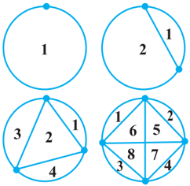
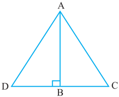
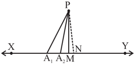

# PAGE 1

218

MATHEMATICS

## A1.1 Introduction

The ability to reason and think clearly is extremely useful in our daily life. For example, suppose a politician tells you, 'If you are interested in a clean government, then you should vote for me.' What he actually wants you to believe is that if you do not vote for him, then you may not get a clean government. Similarly, if an advertisement tells you, 'The intelligent wear XYZ shoes', what the company wants you to conclude is that if you do not wear XYZ shoes, then you are not intelligent enough. You can yourself observe that both the above statements may mislead the general public. So, if we understand  the  process  of  reasoning  correctly,  we  do  not  fall  into  such  traps unknowingly.

The correct use of reasoning is at the core of mathematics, especially in constructing proofs. In Class IX, you were introduced to the idea of proofs, and you actually proved many statements, especially in geometry. Recall that a proof is made up of several mathematical statements, each of which is logically deduced from a previous statement in the proof, or from a theorem proved earlier, or an axiom, or the hypotheses. The main tool, we use in constructing a proof, is the process of deductive reasoning.

We start the study of this chapter with a review of what a mathematical statement is. Then, we proceed to sharpen our skills in deductive reasoning using several examples. We shall also deal with the concept of negation and finding the negation of a given statement. Then, we discuss what it means to find the converse of a given statement. Finally, we review the ingredients of a proof learnt in Class IX by analysing the proofs of several theorems. Here, we also discuss the idea of proof by contradiction, which you have come across in Class IX and many other chapters of this book.

## A1.2 Mathematical Statements Revisited

Recall,  that  a  'statement'  is  a  meaningful  sentence  which  is  not  an  order,  or  an exclamation or a question.  For  example,  'Which  two  teams  are  playing  in  the

# PAGE 2

Cricket World Cup Final?' is a question, not a statement. 'Go and finish your homework' is an order, not a statement. 'What a fantastic goal!' is an exclamation, not a statement.

Remember, in general, statements can be one of the following:

-  always true
-  always false
-  ambiguous

In  Class  IX,  you  have  also  studied  that  in  mathematics, a  statement  is acceptable only if it is either always true or always false . So, ambiguous sentences are not considered as mathematical statements.

Let us review our understanding with a few examples.

Example 1 : State whether the following statements are always true, always false or ambiguous. Justify your answers.

- (i) The Sun orbits the Earth.
- (ii) Vehicles have four wheels.
- (iii) The speed of light is approximately 3 × 10 5  km/s.
- (iv) A road to Kolkata will be closed from November to March.
- (v) All humans are mortal.

## Solution :

- (i) This statement is always false, since astronomers have established that the Earth orbits the Sun.
- (ii) This statement is ambiguous, because we cannot decide if it is always true or always false. This depends on what the vehicle is - vehicles can have 2, 3, 4, 6, 10, etc., wheels.
- (iii) This statement is always true, as verified by physicists.
- (iv) This statement is ambiguous, because it is not clear which road is being referred to.
- (v) This statement is always true, since every human being has to die some time.

Example 2 : State whether the following statements are true or false, and justify your answers.

- (i) All equilateral triangles are isosceles.
- (ii) Some isosceles triangles are equilateral.
- (iii) All isosceles triangles are equilateral.
- (iv) Some rational numbers are integers.

# PAGE 3

- (v) Some rational numbers are not integers.
- (vi) Not all integers are rational.
- (vii) Between any two rational numbers there is no rational number.

## Solution :

- (i) This statement is true, because equilateral triangles have equal sides, and therefore are  isosceles.
- (ii) This statement is true, because those isosceles triangles whose base angles are 60° are equilateral.
- (iii) This statement is false. Give a counter-example for it.
- (iv) This statement is true, since rational numbers of the form , p q where p is  an integer and q = 1, are integers (for example, 3 3 1  ).
- (v) This statement is true, because rational numbers of the form , p q p , q are integers and q does not divide p , are not integers (for example, 3 2 ).
- (vi) This statement is the same as saying 'there is an integer which is not a rational number'. This is false, because all integers are rational numbers.
- (vii) This statement is false. As you know, between any two rational numbers r and s lies 2 r s  , which is a rational number.

Example 3 : If x &lt; 4, which of the following statements are true? Justify your answers.

<!-- formula-not-decoded -->

## Solution :

- (i) This statement is false, because, for example, x = 3 &lt; 4 does not satisfy 2 x &gt; 8.
- (ii) This statement is false, because, for example, x = 3.5 &lt; 4 does not satisfy 2 x &lt; 6.
- (iii) This statement is true, because it is the same as x &lt; 4.

Example 4 : Restate the following statements with appropriate conditions, so that they become true statements:

- (i) If the diagonals of a quadrilateral are equal, then it is a rectangle.
- (ii) A line joining two points on two sides of a triangle is parallel to the third side.
- (iii) p is irrational for all positive integers p .
- (iv) All quadratic equations have two real roots.
- (ii) 2 x &lt; 6

<!-- formula-not-decoded -->

# PAGE 4

## Solution :

- (i) If the diagonals of a parallelogram are equal, then it is a rectangle.
- (ii) A line joining the mid-points of two sides of a triangle is parallel to the third side.
- (iii) p is irrational for all primes p .
- (iv) All quadratic equations have at most two real roots.

Remark : There can be other ways of restating the statements above. For instance, (iii) can also be restated as ' p is irrational for all positive integers p which are not a perfect  square'.

## EXERCISE A1.1

1. State whether the following statements are always true, always false or ambiguous. Justify your answers.
2. (i) All mathematics textbooks are interesting.
3. (ii) The distance from the Earth to the Sun is approximately 1.5 × 10 8  km.
4. (iii) All human beings grow old.
5. (iv) The journey from Uttarkashi to Harsil is tiring.
6. (v) The woman saw an elephant through a pair of binoculars.
2. State whether the following statements are true or false. Justify your answers.
8. (i) All hexagons are polygons.
9. (iii) Not all even numbers are divisible by 2.
10. (v) Not all real numbers are rational.
3. Let a and b be real numbers such that ab  0. Then which of the following statements are true? Justify your answers.
12. (i) Both a and b must be zero.
13. (iii) Either a or b must be non-zero.
4. Restate the following statements with appropriate conditions, so that they become true.
15. (i) If a 2 &gt; b 2 , then a &gt; b .
16. (iii) If ( x + y ) 2 = x 2 + y 2 , then x = 0.

## A1.3 Deductive Reasoning

In Class IX, you were introduced to the idea of deductive reasoning. Here, we will work with many more examples which will illustrate how deductive reasoning is

- (ii) If x 2 = y 2 , then x = y .
- (iv) The diagonals of a quadrilateral bisect each other.
- (ii) Both a and b must be non-zero.
- (ii) Some polygons are pentagons.
- (iv) Some real numbers are irrational.

# PAGE 5

used to deduce conclusions from given statements that we assume to be true. The given statements are called 'premises' or 'hypotheses'. We begin with some examples.

Example 5 : Given that Bijapur is in the state of Karnataka, and suppose Shabana lives in Bijapur. In which state does Shabana live?

Solution : Here we have two premises:

- (i) Bijapur is in the state of Karnataka
- (ii) Shabana lives in Bijapur

From these premises, we deduce that Shabana lives in the state of Karnataka.

Example 6 : Given that all mathematics textbooks are interesting, and suppose you are reading a mathematics textbook. What can we conclude about the textbook you are reading?

Solution : Using the two premises (or hypotheses), we can deduce that you are reading an interesting textbook.

Example 7 : Given that y = - 6 x + 5, and suppose x = 3. What is y ?

Solution : Given the two hypotheses, we get y = - 6 (3) + 5 = - 13.

Example 8 : Given that ABCD is a parallelogram, and suppose AD = 5 cm, AB = 7 cm (see Fig. A1.1). What can you conclude about the lengths of DC and BC?

Solution : We are given that ABCD is a parallelogram. So, we deduce that all the properties that hold for a parallelogram hold for  ABCD. Therefore, in particular,

the property that 'the opposite sides of a parallelogram are equal to each other', holds. Since  we know AD = 5 cm, we can deduce that BC = 5 cm. Similarly, we deduce that DC = 7 cm.

Remark : In this example, we have seen how we will often need to find out and use properties hidden in a given premise.

Example 9 : Given that p is irrational for all primes p , and suppose that 19423 is a prime. What can you conclude about 19423 ?

Solution : We can conclude that 19423  is irrational.

In the examples above, you might have noticed that we do not know whether the hypotheses are true or not. We are assuming that they are true, and then applying deductive reasoning. For instance, in Example 9, we haven't checked whether 19423

# PAGE 6

is a prime or not; we assume it to be a prime for the sake of our argument.What we are trying to emphasise in this section is that given a particular statement, how we use deductive reasoning to arrive at a conclusion. What really matters here is that we use the correct process of reasoning, and this process of reasoning does not depend on the trueness or falsity of the hypotheses. However, it must also be noted that if we start with an incorrect premise (or hypothesis), we may arrive at a wrong conclusion.

## EXERCISE A1.2

1. Given that all women are mortal, and suppose that A is a woman, what can we conclude about A?
2. Given that the product of two rational numbers is rational, and suppose a and b are rationals, what can you conclude about ab ?
3. Given that the decimal expansion of irrational numbers is non-terminating, non-recurring, and 17   is  irrational,  what  can  we  conclude  about  the  decimal  expansion of 17 ?
4. Given that y = x 2 + 6 and x = - 1, what can we conclude about the value of y ?
5. Given that ABCD is a parallelogram and  B = 80°. What can you conclude about the other angles of the parallelogram?
6. Given that PQRS is a cyclic quadrilateral and also its diagonals bisect each other. What can you conclude about the quadrilateral?
7. Given that p is irrational for all primes p and also suppose that 3721 is a prime. Can you conclude that 3721  is an irrational number? Is your conclusion correct? Why or why not?

## A1.4 Conjectures, Theorems, Proofs and Mathematical Reasoning

Consider the Fig. A1.2. The first circle has one point on it, the second two points, the third three, and so on. All possible lines connecting the points are drawn in each case.

The lines  divide  the  circle  into mutually exclusive regions (having no common portion). We can count these and tabulate our results as shown :

Fig. A1.2

# PAGE 7

|   Number of points | Number of regions   |
|--------------------|---------------------|
|                  1 | 1                   |
|                  2 | 2                   |
|                  3 | 4                   |
|                  4 | 8                   |
|                  5 |                     |
|                  6 |                     |
|                  7 |                     |

Some of you might have come up with a formula predicting the number of regions given the number of points. From Class IX, you may remember that this intelligent guess is called a ' conjecture '.

Suppose your conjecture is that given ' n '  points  on  a  circle,  there  are  2 n -  1 mutually exclusive regions, created by joining the points with all possible lines. This seems an extremely sensible guess, and one can check that if n = 5, we do get 16 regions. So, having verified this formula for 5 points, are you satisfied that for any n points there are 2 n - 1  regions? If so, how would you respond, if someone asked you, how you can be sure about this for n = 25, say? To deal with such questions, you would need a proof which shows beyond doubt that this result is true, or a counterexample to show that this result fails for some ' n '. Actually, if you are patient and try it out for n = 6, you will find that there are 31 regions, and for n = 7 there are 57 regions. So, n = 6, is a counter-example to the conjecture above. This demonstrates the power of a counter-example. You may recall that in the Class IX we discussed that  to disprove a statement, it is enough to come up with a single counterexample .

You may have noticed that we insisted on a proof regarding the number of regions in spite of verifying the result for n = 1, 2, 3, 4 and 5. Let us consider a few more examples. You are familiar with the following result (given in Chapter 5):

1 + 2 + 3 + ... + n = ( 1) 2 n n  . To establish its validity, it is not enough to verify the result for n = 1, 2, 3, and so on, because there may be some ' n ' for which this result is not true (just as in the example above, the result failed for n = 6). What we need is a proof which establishes its truth beyond doubt. You shall learn a proof for the same in higher classes.

# PAGE 8

Now, consider Fig. A1.3, where PQ and PR are tangents to the circle drawn  from P.

You have proved that PQ = PR (Theorem 10.2). You were not satisfied by only drawing several such figures,  measuring  the  lengths  of  the  respective tangents, and verifying for yourselves that the result was true in each case.

Do you remember what did the proof consist of ? It consisted of a sequence of statements (called valid arguments ), each following from the earlier statements in the proof, or from previously proved (and known) results independent from the result to be proved, or from axioms, or from definitions, or from the assumptions you had made. And you concluded your proof with the statement PQ = PR, i.e., the statement you wanted to prove. This is the way any proof is constructed.

We shall now look at some examples and theorems and analyse their proofs to help us in getting a better understanding of how they are constructed.

We begin by using the so-called 'direct' or 'deductive' method of proof. In this method, we make several statements. Each is based on previous statements .  If each statement is logically correct (i.e., a valid argument), it leads to a logically correct conclusion.

Example 10 : The sum of two rational numbers is a rational number. Solution :

|   S.No. | Statements                                                                  | Analysis/Comments                                                             |
|---------|-----------------------------------------------------------------------------|-------------------------------------------------------------------------------|
|       1 | Let x and y be rational numbers.                                            | Since the result is about rationals, westart with x and y which are rational. |
|       2 | Let m x n  , n  0 and p y q  , q  0 where m , n , p and q are integers. | Apply the definition of rationals.                                            |
|       3 | So, m p mq np x y n q nq                                               | The result talks about the sum of rationals, so we look at x + y .            |

# PAGE 9

|   4. | Using the properties of integers, we see that mq + np and nq are integers.   | Using known properties of integers.        |
|------|------------------------------------------------------------------------------|--------------------------------------------|
|    5 | Since n  0 and q  0, it follows that nq  0.                               | Using known properties of integers.        |
|    6 | Therefore, mq np x y nq    is a rational number                           | Using the definition of a rational number. |

Remark : Note that, each statement in the proof above is based on a previously established fact, or definition.

Example 11 : Every prime number greater than 3 is of the form 6 k + 1 or 6 k + 5, where k is some integer.

## Solution :

|   S.No. | Statements                                                                                                                      | Analysis/Comments                                                                          |
|---------|---------------------------------------------------------------------------------------------------------------------------------|--------------------------------------------------------------------------------------------|
|       1 | Let p be a prime number greater than 3.                                                                                         | Since the result has to do with a prime number greater than 3, westart with such a number. |
|       2 | Dividing p by 6, we find that p can be of the form 6 k , 6 k + 1, 6 k + 2, 6 k + 3, 6 k + 4, or 6 k + 5, where k is an integer. | Using Euclid's division lemma.                                                             |
|       3 | But 6 k = 2(3 k ), 6 k + 2 = 2(3 k + 1), 6 k + 4 = 2(3 k + 2), and 6 k + 3 = 3(2 k + 1). So, they are not primes.               | We now analyse the remainders given that p is prime.                                       |
|       4 | So, p is forced to be of the form 6 k + 1 or 6 k + 5, for some integer k .                                                      | Wearrive at this conclusion having eliminated the other options.                           |

Remark : In the above example, we have arrived at the conclusion by eliminating different options. This method is sometimes referred to as the Proof by Exhaustion .

# PAGE 10

Theorem A1.1 (Converse of the Pythagoras Theorem) : If in a triangle the square of the  length  of  one  side  is  equal to the sum of the squares of the other two sides, then the angle opposite the first side is  a  right  angle.

Proof :

Fig. A1.4

|   S.No. | Statements                                                                                                  | Analysis                                                                                         |
|---------|-------------------------------------------------------------------------------------------------------------|--------------------------------------------------------------------------------------------------|
|       1 | Let  ABC satisfy the hypothesis AC 2 = AB 2 + BC 2 .                                                       | Since we are proving a statement about such a triangle, webegin by taking this.                  |
|       2 | Construct line BDperpendicular to AB, such that BD = BC, and join Ato D.                                    | This is the intuitive step we have talked about that we often need to take for proving theorems. |
|       3 | By construction,  ABD is a right triangle, and from the Pythagoras Theorem, we have AD 2 = AB 2 + BD 2 .   | We use the Pythagoras theorem, which is already proved.                                          |
|       4 | By construction, BD = BC. Therefore, we have AD 2 = AB 2 + BC 2 .                                           | Logical deduction.                                                                               |
|       5 | Therefore, AC 2 = AB 2 + BC 2 = AD 2 .                                                                      | Using assumption, and previous statement.                                                        |
|       6 | SinceAC andAD are positive, we have AC = AD.                                                                | Using known property of numbers.                                                                 |
|       7 | We have just shownAC = AD. Also BC = BD by construction, andAB is common. Therefore, by SSS,  ABC  ABD. | Using known theorem.                                                                             |
|       8 | Since  ABC   ABD, we get  ABC =  ABD, which is a right angle.                                         | Logical deduction, based on previously established fact.                                         |

# PAGE 11

Remark : Each of the results above has been proved by a sequence of steps, all linked together. Their order is important. Each step in the proof follows from previous steps and earlier known results. (Also see Theorem 6.9.)

## EXERCISE A1.3

In each of the following questions, we ask you to prove a statement. List all the steps in each proof, and give the reason for each step.

1. Prove that the sum of two consecutive odd numbers is divisible by 4.
2. Take two consecutive odd numbers. Find the sum of their squares, and then add 6 to the result. Prove that the new number is always divisible by 8.
3. If p  5 is a prime number, show that p 2 + 2 is divisible by 3.
4. Let x and y be rational numbers. Show that xy is a rational number.
5. If a and b are positive integers, then you know that a = bq + r , 0  r &lt; b , where q is a whole number. Prove that HCF ( a , b ) = HCF ( b , r ).
6. A line parallel to side BC of a triangle  ABC, intersects AB and  AC at D and E respectively.

[ Hint:

Use Example 11].

[ Hint :

Let HCF ( b , r ) = h . So, b = k 1 h and r = k 2 h , where k 1 and k 2 are coprime.]

<!-- formula-not-decoded -->

## A1.5 Negation of a Statement

In this section, we discuss what it means to 'negate' a statement. Before we start, we would like to introduce some notation, which will make it easy for us to understand these concepts. To start with, let us look at a statement as a single unit, and give it a name. For example, we can denote the statement 'It rained in Delhi on 1 September 2005' by p . We can also write this by

- p : It rained in Delhi on 1 September 2005.

Similarly, let us write

- q : All teachers are female.
- r : Mike's dog has a black tail.
- s : 2 + 2 = 4.
- t : Triangle ABC is equilateral.

This notation now helps us to discuss properties of statements, and also to see how we can combine them. In the beginning we will be working with what we call 'simple' statements, and will then move onto 'compound' statements.

# PAGE 12

Now consider the following table in which we make a new statement from each of the given statements.

| Original statement                         | New statement                                                  |
|--------------------------------------------|----------------------------------------------------------------|
| p : It rained in Delhi on 1 September 2005 | ~ p : It is false that it rained in Delhi on 1 September 2005. |
| q : All teachers are female.               | ~ q : It is false that all teachers are female.                |
| r : Mike's dog has a black tail.           | ~ r : It is false that Mike's dog has a black tail.            |
| s : 2 + 2 = 4.                             | ~ s : It is false that 2 + 2 = 4.                              |
| t : TriangleABCisequilateral.              | ~ t : It is false that triangle ABC is equilateral.            |

Each new statement in the table is a negation of the corresponding old statement. That is, ~ p , ~ q , ~ r , ~ s and ~ t are negations of the statements p , q , r , s and t , respectively. Here, ~ p is read as 'not p '. The statement ~ p negates the assertion that the statement p makes. Notice that in our usual talk we would simply mean ~ p as 'It did not rain in Delhi on 1 September 2005.' However, we need to be careful while doing so. You might think that one can obtain the negation of a statement by simply inserting the word 'not' in the given statement at a suitable place. While this works in the case of p , the difficulty comes when we have a statement that begins with 'all'. Consider, for example, the statement q :  All teachers are female. We said the negation of this statement is ~ q : It is false that all teachers are female. This is the same as the statement 'There are some teachers who are males.' Now let us see what happens if we simply insert 'not' in q . We obtain the statement: 'All teachers are not female', or we can obtain the statement: 'Not all teachers are female.' The first statement can confuse people. It could imply (if we lay emphasis on the word 'All') that all teachers are male! This is certainly not the negation of q . However, the second statement gives the meaning of ~ q , i.e., that there is at least one teacher who is not a female. So, be careful when writing the negation of a statement!

So, how do we decide that we have the correct negation? We use the following criterion.

Let  p  be  a  statement  and  ~p  its  negation.  Then  ~p  is  false  whenever  p  is true,  and  ~p  is  true  whenever  p  is  false.

# PAGE 13

For example, if it is true that Mike's dog has a black tail, then it is false that Mike's dog does not have a black tail. If it is false that 'Mike's dog has a black tail', then it is true that 'Mike's dog does not have a black tail'.

Similarly, the negations for the statements s and t are:

<!-- formula-not-decoded -->

t :  Triangle ABC is equilateral; negation, ~ t :  Triangle  ABC is not equilateral.

Now, what is ~(~ s )? It would be 2 + 2 = 4, which is s . And what is ~(~ t )? This would be 'the triangle ABC is equilateral', i.e., t . In fact, for any statement p , ~(~ p ) is p .

Example 12 : State the negations for the following statements:

- (i) Mike's dog does not have a black tail.
- (ii) All irrational numbers are real numbers.
- (iii) 2  is irrational.
- (iv) Some rational numbers are integers.
- (v) Not all teachers are males.
- (vi) Some horses are not brown.
- (vii) There is no real number x , such that x 2 = - 1.

## Solution :

- (i) It is false that Mike's dog does not have a black tail, i.e., Mike's dog has a black tail.
- (ii) It is false that all irrational numbers are real numbers, i.e., some (at least one) irrational numbers are not real numbers. One can also write this as, 'Not all irrational numbers are real numbers.'
- (iii) It is false that 2 is irrational, i.e., 2  is not irrational.
- (iv) It is false that some rational numbers are integers, i.e., no rational number is an integer.
- (v) It is false that not all teachers are males, i.e., all teachers are males.
- (vi) It is false that some horses are not brown, i.e., all horses are brown.
- (vii) It is false that there is no real number x , such that x 2 = - 1, i.e., there is at least one real number x , such that x 2 = - 1.

Remark : From the above discussion, you may arrive at the following Working Rule for obtaining the negation of a statement :

- (i) First write the statement with a 'not'.
- (ii) If there is any confusion, make suitable modification , specially in the statements involving 'All' or 'Some'.

# PAGE 14

## EXERCISE A1.4

1. State the negations for the following statements :
2. (i) Man is mortal.
3. (iii) This chapter has many exercises.
4. (v) Some prime numbers are odd.
5. (ii) Line l is parallel to line m .
6. (iv) All integers are rational numbers.
7. (vi) No student is lazy.
8. (vii) Some cats are not black.
9. (viii) There is no real number x , such that 1 x   .
10. (ix) 2 divides the positive integer a .
11. (x) Integers a and b are coprime.
2. In each of the following questions, there are two statements. State if the second is the negation of the first or not.
13. (i) Mumtaz is hungry. Mumtaz is not hungry.
14. (iii) All elephants are huge. One elephant is not huge.
15. (v) No man is a cow. Some men are cows.

## A1.6 Converse of a Statement

We now investigate the notion of the converse of a statement. For this, we need the notion of a 'compound' statement, that is, a statement which is a combination of one or more 'simple' statements. There are many ways of creating compound statements, but we will focus on those that are created by connecting two simple statements with the use of the words 'if' and 'then'. For example, the statement 'If it is raining, then it is difficult to go on a bicycle', is made up of two statements:

p : It is raining

- q : It is difficult to go on a bicycle.

Using our previous notation we can say: If p , then q . We can also say ' p implies q ', and denote it by p  q .

Now, supose you have the statement 'If the water tank is black, then it contains potable water.' This is of the form p  q , where the hypothesis is p (the water tank is  black)  and  the  conclusion  is q (the  tank  contains  potable  water).  Suppose  we interchange  the hypothesis and the conclusion, what do we get? We get q  p , i.e., if the water in the tank is potable, then the tank must be black. This statement is called the converse of  the statement p  q .

- (ii) Some cats are black. Some cats are brown.
- (iv) All fire engines are red.

All fire engines are not red.

# PAGE 15

In general, the converse of the statement p  q is q  p , where p and q are statements. Note that p  q and q  p are the converses of each other.

Example 13 : Write the converses of the following statements :

- (i) If Jamila is riding a bicycle, then 17 August falls on a Sunday.
- (ii) If 17 August is a Sunday, then Jamila is riding a bicycle.
- (iii) If Pauline is angry, then her face turns red.
- (iv) If a person has a degree in education, then she is allowed to teach.
- (v) If a person has a viral infection, then he runs a high temperature.
- (vi) If Ahmad is in Mumbai, then he is in India.
- (vii) If triangle ABC is equilateral, then all its interior angles are equal.
- (viii) If x is an irrational number, then the decimal expansion of x is non-terminating non-recurring.
- (ix) If x -a is a factor of the polynomial p ( x ), then p ( a ) = 0.

Solution : Each statement above is of the form p  q . So, to find the converse, we first identify p and q , and then write q  p .

- (i) p : Jamila is riding a bicycle, and q : 17 August falls on a Sunday. Therefore, the converse is: If 17 August falls on a Sunday, then Jamila is riding a bicycle.
- (ii) This is the converse of (i). Therefore, its converse is the statement given in (i) above.
- (iii) If Pauline's face turns red, then she is angry.
- (iv) If a person is allowed to teach, then she has a degree in education.
- (v) If a person runs a high temperature, then he has a viral infection.
- (vi) If Ahmad is in India, then he is in Mumbai.
- (vii) If all the interior angles of triangle ABC are equal, then it is equilateral.
- (viii) If  the  decimal expansion of x is  non-terminating non-recurring, then x is  an irrational number.
- (ix) If p ( a ) = 0, then x -a is a factor of the polynomial p ( x ).

Notice that we have simply written the converse of each of the statements above without worrying if they are true or false. For example, consider the following statement: If Ahmad is in Mumbai, then he is in India. This statement is true. Now consider the converse: If Ahmad is in India, then he is in Mumbai. This need not be true always - he could be in any other part of India.

# PAGE 16

In mathematics, especially in geometry, you will come across many situations where p  q is true, and you will have to decide if the converse, i.e., q  p , is also true.

Example 14 : State  the  converses of the following statements. In each case, also decide whether the converse is true or false.

- (i) If n is an even integer, then 2 n + 1 is an odd integer.
- (ii) If the decimal expansion of a real number is terminating, then the number is rational.
- (iii) If a transversal intersects two parallel lines, then each pair of corresponding angles is equal.
- (iv) If each pair of opposite sides of a quadrilateral is equal, then the quadrilateral is a parallelogram.
- (v) If two triangles are congruent, then their corresponding angles are equal.

## Solution :

- (i) The converse is 'If 2 n + 1 is an odd integer, then n is an even integer.' This is a false statement  (for example, 15 = 2(7) + 1, and 7 is odd).
- (ii) 'If a real number is rational, then its decimal expansion is terminating', is the converse. This is a false statement, because a rational number can also have a non-terminating recurring decimal expansion.
- (iii) The converse is 'If a transversal intersects two lines in such a way that each pair of corresponding angles are equal, then the two lines are parallel.' We have assumed, by Axiom 6.4 of your Class IX textbook, that this statement is true.
- (iv) 'If a quadrilateral is a parallelogram, then each pair of its opposite sides is equal', is the converse. This is true (Theorem 8.1, Class IX).
- (v) 'If the corresponding angles in two triangles are equal, then they are congruent', is the converse. This statement is false. We leave it to you to find suitable counterexamples.

## EXERCISE A1.5

1. Write the converses of the following statements.
2. (i) If it is hot in Tokyo, then Sharan sweats a lot.
3. (ii) If Shalini is hungry, then her stomach grumbles.
4. (iii) If Jaswant has a scholarship, then she can get a degree.
5. (iv) If a plant has flowers, then it is alive.
6. (v) If an animal is a cat, then it has a tail.

# PAGE 17

2. Write the converses of the following statements. Also, decide in each case whether the converse is true or false.
2. (i) If triangle ABC is isosceles, then its base angles are equal.
3. (ii) If an integer is odd, then its square is an odd integer.
4. (iii) If x 2 = 1, then x = 1.
5. (iv) If ABCD is a parallelogram, then AC and BD bisect each other.
6. (v) If a , b and c , are whole numbers, then a + ( b + c ) = ( a + b ) + c .
7. (vi) If x and y are two odd numbers, then x + y is an even number.
8. (vii) If vertices of a parallelogram lie on a circle, then it is a rectangle.

## A1.7 Proof by Contradiction

So far, in all our examples, we used direct arguments to establish the truth of the results. We now explore 'indirect' arguments, in particular, a very powerful tool in mathematics known as 'proof by contradiction'. We have already used this method in Chapter 1 to establish the irrationality of several numbers and also in other chapters to prove some theorems. Here, we do several more examples to illustrate the idea.

Before we proceed, let us explain what a contradiction is.  In mathematics, a contradiction occurs when we get a statement p such that p is true and ~ p , its negation, is also true. For example,

<!-- formula-not-decoded -->

q : 2 divides both ' a ' and ' b '.

If we assume that p is true and also manage to show that q is true, then we have arrived at a contradiction, because q implies that the negation of p is  true.  If  you remember, this is exactly what happened when we tried to prove that 2  is irrational (see Chapter 1).

How does proof by contradiction work? Let us see this through a specific example. Suppose we are given the following :

All women are mortal. A is a woman. Prove that A is mortal.

Even though this is a rather easy example, let us see how we can prove this by contradiction.

-  Let us assume that we want to establish the truth of a statement p (here we want to show that p : 'A is mortal' is true).

# PAGE 18

-  So, we begin by assuming that the statement is not true, that is, we assume that the negation of p is true (i.e., A is not mortal).
-  We then proceed to carry out a series of logical deductions based on the truth of the negation of p . (Since A is not mortal, we have a counter-example to the statement 'All women are mortal.' Hence, it is false that all women are mortal.)
-  If this leads to a contradiction, then the contradiction arises because of our faulty assumption that p is not true. (We have a contradiction, since we have shown that the statement 'All women are mortal' and its negation, 'Not all women are mortal' is true at the same time. This contradiction arose, because we assumed that A is not mortal.)
-  Therefore, our assumption is wrong, i.e., p has to be true. (So, A is mortal.) Let us now look at examples from mathematics.

## Example 15 : The product of a non-zero rational number and an irrational number is irrational.

## Solution :

| Statements                                                                                                                                                                                               | Analysis/Comment                                                                 |
|----------------------------------------------------------------------------------------------------------------------------------------------------------------------------------------------------------|----------------------------------------------------------------------------------|
| We will use proof by contradiction. Let r be a non- zero rational number and x be an irrational number. Let m r n  , where m , n are integers and m  0, n  0. We need to prove that rx is irrational. |                                                                                  |
| Assume rx is rational.                                                                                                                                                                                   | Here, we are assuming the negation of the statement that we need to prove.       |
| Then p rx q  , q  0, where p and q are integers.                                                                                                                                                       | This follow from the previous statement and the definition of a rational number. |
| Rearranging the equation p rx q  , q  0, and using the fact that m r n  , we get p np x rq mq   .                                                                                                   |                                                                                  |

# PAGE 19

| Since np and mq are integers and mq  0, x is a rational number.                                                 | Using properties of integers, and definition of a rational number.   |
|------------------------------------------------------------------------------------------------------------------|----------------------------------------------------------------------|
| This is a contradiction, because we have shown x to be rational, but by our hypothesis, we have x is irrational. | This is what wewerelooking for -acontradiction.                      |
| The contradiction has arisen because of the faulty assumption that rx is rational. Therefore, rx is irrational.  | Logical deduction.                                                   |

We now prove Example 11, but this time using proof by contradiction. The proof is given below:

| Statements                                                                                                                                                      | Analysis/Comment                                                                           |
|-----------------------------------------------------------------------------------------------------------------------------------------------------------------|--------------------------------------------------------------------------------------------|
| Let us assume that the statement is note true.                                                                                                                  | As we saw earlier, this is the starting point for an argument using'proofbycontradiction'. |
| So we suppose that there exists a prime number p > 3, which is not of the form 6 n + 1 or 6 n + 5, where n is a whole number.                                   | This is the negation of the statement in the result.                                       |
| Using Euclid's division lemmaondivision by 6, and using the fact that p is not of the form 6 n + 1 or 6 n + 5, we get p = 6 n or 6 n + 2 or 6 n + 3 or 6 n + 4. | Using earlier proved results.                                                              |
| Therefore, p is divisible by either 2 or 3.                                                                                                                     | Logical deduction.                                                                         |
| So, p is not a prime.                                                                                                                                           | Logical deduction.                                                                         |
| This is a contradiction, because by our hypothesis p is prime.                                                                                                  | Precisely what we want!                                                                    |
| The contradiction has arisen, because we assumed that there exists a prime number p > 3 which is not of the form 6 n + 1 or 6 n + 5.                            |                                                                                            |
| Hence, every prime number greater than 3 is of the form 6 n + 1 or 6 n + 5.                                                                                     | We reach the conclusion.                                                                   |

# PAGE 20

Remark : The example of the proof above shows you, yet again, that there can be several ways of proving a result.

Theorem A1.2 : Out of all the line segments, drawn from a point to points of a line  not  passing  through  the  point,  the  smallest  is  the  perpendicular  to  the  line.

Proof :

Fig. A1.5

| Statements                                                                                                                                                                                         | Analysis/Comment                                                                                                                                    |
|----------------------------------------------------------------------------------------------------------------------------------------------------------------------------------------------------|-----------------------------------------------------------------------------------------------------------------------------------------------------|
| Let XYbethe given line, P a point not lyingonXY and PM, PA 1 , PA 2 , . . . etc., be the line segments drawn from P to the points of the line XY, out of which PM is the smallest (see Fig. A1.5). | Since we have to prove that out of all PM, PA 1 , PA 2 , . . . etc., the smallest is perpendi- cular to XY, we start by taking these line segments. |
| Let PM be not perpendicular to XY                                                                                                                                                                  | This is the negation of the statement to be proved by contradiction.                                                                                |
| Draw a perpendicular PN on the line XY, shown by dotted lines in Fig. A1.5.                                                                                                                        | We often need constructions to prove our results.                                                                                                   |
| PN is the smallest of all the line segments PM, PA 1 , PA 2 , . . . etc., which means PN < PM.                                                                                                     | Side of right triangle is less than the hypotenuse and known property of numbers.                                                                   |
| This contradicts our hypothesis that PM is the smallest of all such line segments.                                                                                                                 | Precisely what we want!                                                                                                                             |
| Therefore, the line segment PM is perpendicular to XY.                                                                                                                                             | We reach the conclusion.                                                                                                                            |

# PAGE 21

## EXERCISE A1.6

1. Suppose a + b = c + d , and a &lt; c . Use proof by contradiction to show b  d .
2. Let r be a rational number and x be an irrational number. Use proof by contradiction to show that r + x is an irrational number.
3. Use proof by contradiction to prove that if for an integer a , a 2 is even, then so is a . [ Hint : Assume a is not even, that is, it is of the form 2 n + 1, for some integer n , and then proceed.]
4. Use proof by contradiction to prove that if for an integer a , a 2 is divisible by 3, then a is divisible by 3.
5. Use proof by contradiction to show that there is no value of n for which 6 n ends with the digit zero.
6. Prove by contradiction that two distinct lines in a plane cannot intersect in more than one point.

## A1.8 Summary

In this Appendix, you have studied the following points :

1. Different ingredients of a proof and other related concepts learnt in Class IX.
2. The negation of a statement.
3. The converse of a statement.
4. Proof by contradiction.