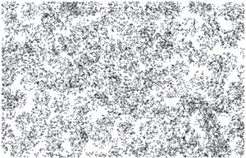

# PAGE 1

MATHEMATICAL MODELLING

239

## A2.1 Introduction

-  An adult human body contains approximately 1,50,000 km of arteries and veins that carry blood.
-  The human heart pumps 5 to 6 litres of blood in the body every 60 seconds.
-  The temperature at the surface of the Sun is about 6,000° C.

Have you ever wondered how our scientists and mathematicians could possibly have estimated these results? Did they pull out the veins and arteries from some adult dead bodies and measure them? Did they drain out the blood to arrive at these results? Did they travel to the Sun with a thermometer to get the temperature of the Sun? Surely not. Then how did they get these figures?

Well, the answer lies in mathematical modelling, which we introduced to you in Class IX. Recall that a mathematical model is a mathematical description of some real-life situation. Also, recall that mathematical modelling is the process of creating a mathematical model of a problem, and using it to analyse and solve the problem.

So, in mathematical modelling, we take a real-world problem and convert it to an equivalent mathematical problem. We then solve the mathematical problem, and interpret its solution in the situation of the real-world problem. And then, it is important to see that the solution, we have obtained, 'makes sense', which is the stage of validating the model. Some examples, where mathematical modelling is of great importance, are:

- (i) Finding the width and depth of a river at an unreachable place.
- (ii) Estimating the mass of the Earth and other planets.
- (iii) Estimating the distance between Earth and any other planet.
- (iv) Predicting the arrrival of the monsoon in a country.

# PAGE 2

- (v) Predicting the trend of the stock market.
- (vi) Estimating the volume of blood inside the body of a person.
- (vii) Predicting the population of a city after 10 years.
- (viii) Estimating the number of leaves in a tree.
- (ix) Estimating the ppm of different pollutants in the atmosphere of a city.
- (x) Estimating the effect of pollutants on the environment.
- (xi) Estimating the temperature on the Sun's surface.

In this chapter we shall revisit the process of mathematical modelling, and take examples from the world around us to illustrate this. In Section A2.2 we take you through all the stages of building a model. In Section A2.3, we discuss a variety of examples. In Section A2.4, we look at reasons for the importance of mathematical modelling.

A point to remember is that here we aim to make you aware of an important way in which mathematics helps to solve real-world problems. However, you need to know some more mathematics to really appreciate the power of mathematical modelling. In higher classes some examples giving this flavour will be found.

## A2.2 Stages in Mathematical Modelling

In Class IX, we considered some examples of the use of modelling. Did they give you an insight into the process and the steps involved in it? Let us quickly revisit the main steps in mathematical modelling.

Step 1 (Understanding the problem) : Define the real problem, and if working in a team, discuss the issues that you wish to understand. Simplify by making assumptions and ignoring certain factors so that the problem is manageable.

For example, suppose our problem is to estimate the number of fishes in a lake. It is not possible to capture each of these fishes and count them. We could possibly capture a sample and from it try and estimate the total number of fishes in the lake.

Step 2 (Mathematical description and formulation) : Describe, in mathematical terms,  the  different  aspects  of  the  problem.  Some  ways  to  describe  the  features mathematically, include:

-  define variables
-  write equations or inequalities
-  gather data and organise into tables
-  make graphs
-  calculate probabilities

# PAGE 3

For example, having taken a sample, as stated in Step 1, how do we estimate the entire population? We would have to then mark the sampled fishes, allow them to mix with the remaining ones in the lake, again draw a sample from the lake, and see how many of the previously marked ones are present in the new sample. Then, using ratio and proportion, we can come up with an estimate of the total population. For instance, let us take a sample of 20 fishes from the lake and mark them, and then release them in the same lake, so as to mix with the remaining fishes. We then take another sample (say 50), from the mixed population and see how many are marked. So, we gather our data and analyse it.

One major assumption we are making is that the marked fishes mix uniformly with the remaining fishes, and the sample we take is a good representative of the entire population.

Step 3 (Solving the mathematical problem) : The simplified mathematical problem developed in Step 2 is then solved using various mathematical techniques.

For instance, suppose in the second sample in the example in Step 2, 5 fishes are marked. So, 5 1 , , i.e., 50 10 of the population is marked. If this is typical of the whole

population, then 1 10 th of the population = 20.

So, the whole population = 20 × 10 = 200.

Step 4 (Interpreting the solution) : The solution obtained in the previous step is now looked at, in the context of the real-life situation that we had started with in Step 1.

For instance, our solution in the problem in Step 3 gives us the population of fishes as 200.

Step 5 (Validating the model) : We go back to the original situation and see if the results  of  the  mathematical  work  make  sense.  If  so,  we  use  the  model  until  new information becomes available or assumptions change.

Sometimes, because of the simplification assumptions we make, we may lose essential  aspects of the real problem while giving its mathematical description. In such cases, the solution could very often be off the mark, and not make sense in the real situation. If this happens, we reconsider the assumptions made in Step 1 and revise them to be more realistic, possibly by including some factors which were not considered earlier.

# PAGE 4

For instance, in Step 3 we had obtained an estimate of the entire population of fishes. It may  not be the actual number of fishes in the pond. We next see whether this is a good estimate of the population by repeating Steps 2 and 3 a few times, and taking the mean of the results obtained. This would give a closer estimate of the population.

Another way of visualising the process of mathematical modelling is shown in Fig. A2.1.

Fig. A2.1

Modellers look for a balance between simplification (for ease of solution) and accuracy. They hope to approximate reality closely enough to make some progress. The best outcome is to be able to predict what will happen, or estimate an outcome, with reasonable accuracy. Remember that different assumptions we use for simplifying the problem can lead to different models. So, there are no perfect models. There are good ones and yet better ones.

# PAGE 5

## EXERCISE A2.1

## 1. Consider the following situation.

A problem dating back to the early 13th century, posed by Leonardo Fibonacci asks how many rabbits you would have if you started with just two and let them reproduce. Assume that a pair of rabbits produces a pair of offspring each month and that each pair of rabbits produces their first offspring at the age of 2 months. Month by month the number of pairs of rabbits is given by the sum of the rabbits in the two preceding months, except for the 0th and the 1st months.

| Month                                    | Pairs of Rabbits                                    |
|------------------------------------------|-----------------------------------------------------|
| 0 1 2 3 4 5 6 7 8 9 10 11 12 13 14 15 16 | 1 1 2 3 5 8 13 21 34 55 89 144 233 377 610 987 1597 |

After just 16 months, you have nearly 1600 pairs of rabbits!

Clearly state the problem and the different stages of mathematical modelling in this situation.

# PAGE 6

## A2.3 Some Illustrations

Let us now consider some examples of mathematical modelling.

Example 1 (Rolling of a pair of dice) : Suppose your teacher challenges you to the following guessing game: She would throw a pair of dice. Before that you need to guess the sum of the numbers that show up on the dice. For every correct answer, you get two points and for every wrong guess you lose two points. What numbers would be the best guess?

## Solution :

Step 1 (Understanding the problem) : You need to know a few numbers which have higher chances of showing up.

Step 2 (Mathematical description) : In mathematical terms, the problem translates to finding out the probabilities of the various possible sums of numbers that the dice could show.

We can model the situation very simply by representing a roll of the dice as a random choice of one of the following thirty six pairs of numbers.

| (1, 1)   | (1, 2)   | (1, 3)   | (1, 4)   | (1, 5)   | (1, 6)   |
|----------|----------|----------|----------|----------|----------|
| (2, 1)   | (2, 2)   | (2, 3)   | (2, 4)   | (2, 5)   | (2, 6)   |
| (3, 1)   | (3, 2)   | (3, 3)   | (3, 4)   | (3, 5)   | (3, 6)   |
| (4, 1)   | (4, 2)   | (4, 3)   | (4, 4)   | (4, 5)   | (4, 6)   |
| (5, 1)   | (5, 2)   | (5, 3)   | (5, 4)   | (5, 5)   | (5, 6)   |
| (6, 1)   | (6, 2)   | (6, 3)   | (6, 4)   | (6, 5)   | (6, 6)   |

The first number in each pair represents the number showing on the first die, and the second number is the number showing on the second die.

Step 3 (Solving the mathematical problem) : Summing the numbers in each pair above, we find that possible sums are 2, 3, 4, 5, 6, 7, 8, 9, 10, 11 and 12. We have to find the probability for each of them, assuming all 36 pairs are equally likely.

We do this in the following table.

| Sum         | 2    | 3    | 4    | 5    | 6    | 7    | 8    | 9    | 10   | 11   | 12   |
|-------------|------|------|------|------|------|------|------|------|------|------|------|
| Probability | 1 36 | 2 36 | 3 36 | 4 36 | 5 36 | 6 36 | 5 36 | 4 36 | 3 36 | 2 36 | 1 36 |

Observe that the chance of getting a sum of a seven is 1/6, which is larger than the chances of getting other numbers as sums.

# PAGE 7

Step 4 (Interpreting the solution) : Since the probability of getting the sum 7 is the highest, you should repeatedly guess the number seven.

Step 5 (Validating the model) : Toss a pair of dice a large number of times and prepare  a  relative  frequency  table.  Compare  the  relative  frequencies  with  the corresponding probabilities. If these are not close, then possibly the dice are biased. Then, we could obtain data to evaluate the number towards which the bias is.

Before going to the next example, you may need some background.

Not having the money you want when you need it, is a common experience for many people. Whether it is having enough money for buying essentials for daily living, or for buying comforts, we always require money. To enable the customers with limited funds to purchase goods like scooters, refrigerators, televisions, cars, etc., a scheme known as an instalment scheme ( or plan ) is introduced by traders.

Sometimes a trader introduces an instalment scheme as a marketing strategy to allure customers to purchase these articles. Under the instalment scheme, the customer is not required to make full payment of the article at the time of buying it. She/he is allowed to pay a part of it at the time of purchase, and the rest can be paid in instalments, which could be monthly, quarterly, half-yearly, or even yearly. Of course, the buyer will have to pay more in the instalment plan, because the seller is going to charge some interest on account of the payment made at a later date (called deferred payment ).

Before we take a few examples to understand the instalment scheme, let us understand the most frequently used terms related to this concept.

The cash price of an article is the amount which a customer has to pay as full payment of the article at the time it is purchased. Cash down payment is the amount which a customer has to pay as part payment of the price of an article at the time of purchase.

Remark : If the instalment scheme is such that the remaining payment is completely made within one year of the purchase of the article, then simple interest is charged on the deferred payment.

In the past, charging interest on borrowed money was often considered evil, and, in particular, was long prohibited. One way people got around the law against paying interest was to borrow in one currency and repay in another, the interest being disguised in the exchange rate.

Let us now come to a related mathematical modelling problem.

# PAGE 8

Example 2 : Juhi wants to buy a bicycle. She goes to the market and finds that the bicycle she likes is available for ` 1800. Juhi has ` 600 with her. So, she tells the shopkeeper that she would not be able to buy it. The shopkeeper, after a bit of calculation, makes the following offer. He tells Juhi that she could take the bicycle by making a payment of ` 600 cash down and the remaining money could be made in two monthly instalments of ` 610 each. Juhi has two options one is to go for instalment scheme or to make cash payment by taking loan from a bank which is available at the rate of 10% per annum simple interest. Which option is more economical to her?

## Solution :

Step 1 (Understanding the problem) : What Juhi needs to determine is whether she should take the offer made by the shopkeeper or not. For this, she should know the two rates of interest-one charged in the instalment scheme and the other charged by the bank (i.e., 10%).

Step 2 (Mathematical description) : In order to accept or reject the scheme, she needs to determine the interest that the shopkeeper is charging in comparison to the bank. Observe that since the entire money shall be paid in less than a year, simple interest shall be charged.

We know that the cash price of the bicycle = ` 1800.

Also, the cashdown payment under the instalment scheme = ` 600.

So, the balance price that needs to be paid in the instalment scheme = ` (1800 - 600) = ` 1200.

Let r % per annum be the rate of interest charged by the shopkeeper.

Amount of each instalment = ` 610

Amount paid in instalments = ` 610 + ` 610 = ` 1220

<!-- formula-not-decoded -->

Since, Juhi kept a sum of ` 1200 for one month, therefore,

Principal for the first month = ` 1200

Principal for the second month = ` (1200 - 610) = ` 590

Balance of the second principal ` 590 + interest charged ( ` 20) = monthly instalment ( ` 610) = 2nd instalment

So, the total principal for one month = ` 1200 + ` 590 = ` 1790

<!-- formula-not-decoded -->

# PAGE 9

## Step 3 (Solving the problem) : From (1) and (2)

<!-- formula-not-decoded -->

<!-- formula-not-decoded -->

or

Step 4 (Interpreting the solution) : The rate of interest charged in the instalment scheme = 13.14 %.

The rate of interest charged by the bank = 10%

So, she should prefer to borrow the money from the bank to buy the bicycle which is more economical.

Step 5 (Validating the model) : This stage in this case is not of much importance here as the numbers are fixed. However, if the formalities for taking loan from the bank such as cost of stamp paper, etc., which make the effective interest rate more than what it is the instalment scheme, then she may change her opinion.

Remark : Interest rate modelling is still at its early stages and validation is still a problem of financial markets. In case, different interest rates are incorporated in fixing instalments, validation becomes an important problem.

## EXERCISE A2.2

In each of the problems below, show the different stages of mathematical modelling for solving the problems.

1. An ornithologist wants to estimate the number of parrots in a large field. She uses a net to catch some, and catches 32 parrots, which she rings and sets free. The following week she manages to net 40 parrots, of which 8 are ringed.
2. (i) What fraction of her second catch is ringed?
3. (ii) Find an estimate of the total number of parrots in the field.
2. Suppose the adjoining figure represents an aerial photograph of a forest with each dot representing a tree. Your purpose is to find the number of trees there are on this tract of land as part of an environmental census.

# PAGE 10

3. A T.V. can be purchased for ` 24000 cash or for ` 8000 cashdown payment and six monthly instalments of ` 2800 each. Ali goes to market to buy a T.V., and he has ` 8000 with him. He has now two options. One is to buy TV under instalment scheme or to make cash payment by taking loan from some financial society. The society charges simple interest at the rate of 18% per annum simple interest. Which option is better for Ali?

## A2.4 Why is Mathematical Modelling Important?

As we have seen in the examples, mathematical modelling is an interdisciplinary subject. Mathematicians and specialists in other fields share their knowledge and expertise to improve existing products, develop better ones, or predict the behaviour of certain products.

There are, of course, many specific reasons for the importance of modelling, but most are related in some ways to the following :

-  To gain understanding. If  we have a mathematical model which reflects the essential behaviour of a real-world system of interest, we can understand that system better through an analysis of the model. Furthermore, in the process of building the model we find out which factors are most important in the system, and how the different aspects of the system are related.
-  To predict, or forecast, or simulate. Very often, we wish to know what a realworld system will do in the future, but it is expensive, impractical or impossible to experiment directly with the system. For example, in weather prediction, to study drug efficacy in humans, finding an optimum design of a nuclear reactor, and so on.

Forecasting  is  very  important  in  many  types  of  organisations,  since predictions of future events have to be incorporated into the decision-making process. For example:

In marketing departments, reliable forecasts of demand help in planning of the sale strategies.

A school board needs to able to forecast the increase in the number of school going children in various districts so as to decide where and when to start new schools.

Most often, forecasters use the past data to predict the future. They first analyse the data in order to identify a pattern that can describe it. Then this data and pattern is extended into the future in order to prepare a forecast. This basic strategy is employed in most forecasting techniques, and is based on the assumption that the pattern that has been identified will continue in the future also.

# PAGE 11

-  To estimate. Often, we need to estimate large values. You've seen examples of the trees in a forest, fish in a lake, etc. For another example, before elections, the contesting parties want to predict the probability of their party winning the elections. In particular, they want to estimate how many people in their constituency would vote for their party. Based on their predictions, they may want to decide on the campaign strategy. Exit polls have been used widely to predict the number of seats, a party is expected to get in elections.

## EXERCISE A2.3

1. Based upon the data of the past five years, try and forecast the average percentage of marks in Mathematics that your school would obtain in the Class X board examination at the end of the year.

## A2.5 Summary

In this  Appendix, you have studied the following points :

1. A mathematical model is a mathematical description of a real-life situation. Mathematical modelling is the process of creating a mathematical model, solving it and using it to understand the real-life problem.
2. The various steps involved in modelling are : understanding the problem, formulating the mathematical model, solving it, interpreting it in the real-life situation, and, most importantly, validating the model.
3. Developed some mathematical models.
4. The importance of mathematical modelling.