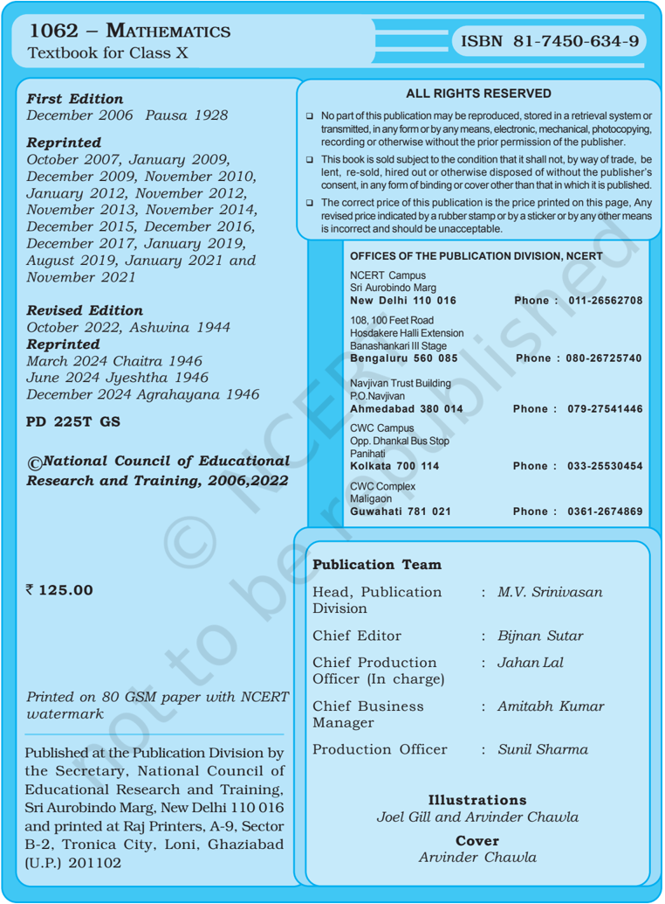

# PAGE 1

## MATHEMATICS

## Textbook for Class X

# PAGE 2

# PAGE 3

## Foreword

The National Curriculum Framework 2005, recommends that children's life at school must be linked to their life outside the school. This principle marks a departure from the legacy of bookish learning which continues to shape our system and causes a gap between the school, home and community. The syllabi and textbooks developed on the basis of NCF signify an attempt to implement this basic idea. They also attempt to discourage rote learning and the maintenance of sharp boundaries between different subject areas. We hope these measures will take us significantly further in the direction of a child-centred system of education outlined in the National Policy on Education (1986).

The success of this effort depends on the steps that school principals and teachers will  take  to  encourage  children  to  reflect  on  their  own  learning  and  to  pursue imaginative activities and questions. We must recognise that, given space, time and freedom, children generate new knowledge by engaging with the information passed on to them by adults. Treating the prescribed textbook as the sole basis of examination is one of the key reasons why other resources and sites of learning are ignored. Inculcating creativity and initiative is possible if we perceive and treat children as participants in learning, not as receivers of a fixed body of knowledge.

These aims imply considerable change in school routines and mode of functioning. Flexibility in the daily time-table is as necessary as rigour in implementing the annual calendar so that the required number of teaching days are actually devoted to teaching. The methods used for teaching and evaluation will also determine how effective this textbook proves for making children's life at school a happy experience, rather than a source of stress or boredom. Syllabus designers have tried to address the problem of curricular burden by restructuring and reorienting knowledge at different stages with greater consideration for child psychology and the time available for teaching. The textbook attempts to enhance this endeavour by giving higher priority and space to opportunities for contemplation and wondering, discussion in small groups, and activities requiring hands-on experience.

The National Council of Educational Research and Training (NCERT) appreciates the hard work done by the textbook development committee responsible for this book. We wish to thank the Chairperson of the advisory group in Science and Mathematics, Professor J.V. Narlikar and the Chief Advisors for this book, Professor P. Sinclair of IGNOU, New Delhi and Professor G.P. Dikshit (Retd.) of Lucknow University, Lucknow for guiding the work of this committee. Several teachers

# PAGE 4

contributed to the development of this textbook; we are grateful to their principals for making this possible. We are indebted to the institutions and organisations which have generously permitted us to draw upon their resources, material and personnel. We are especially grateful to the members of the National Monitoring Committee, appointed by the Department of Secondary and Higher Education, Ministry of Human Resource Development under the Chairpersonship of Professor Mrinal Miri and Professor G.P. Deshpande, for their valuable time and contribution.  As an organisation committed to systemic reform and continuous improvement in the quality of its products, NCERT welcomes comments and suggestions which will enable us to undertake further revision and refinement.

Director

National Council of Educational Research and Training

New Delhi 15  November 2006

# PAGE 5

## Rationalisation of Content in the Textbooks

In view of the COVID-19 pandemic, it is imperative to reduce content load on students. The National Education Policy 2020, also emphasises reducing the content load and providing opportunities for experiential learning with creative mindset. In this background, the NCERT has undertaken the exercise to rationalise the textbooks across all classes. Learning Outcomes already developed by the NCERT across classes have been taken into consideration in this exercise.

## Contents of the textbooks have been rationalised in view of the following:

- Overlapping with similar content included in other subject areas in the same class
- Similar content included in the lower or higher class in the same subject
- Difficulty level
- Content, which is easily accessible to students without much interventions from teachers and can be learned by children through self-learning or peer-learning
- Content, which is irrelevant in the present context

This present edition, is a reformatted version after carrying out the changes given  above.

# PAGE 6

# PAGE 7

## Preface

Through the years, from the time of the Kothari Commission, there have been several committees looking at ways of making the school curriculum meaningful and enjoyable for the learners. Based on the understanding developed over the years, a National Curriculum Framework (NCF) was finalised in 2005. As part of this exercise, a National Focus Group on Teaching of Mathematics was formed. Its report, which came in 2005, highlighted a constructivist approach to the teaching and learning of mathematics.

The essence of this approach is that children already know, and do some mathematics very naturally in their surroundings, before they even join school. The syllabus, teaching approach, textbooks etc., should build on this knowledge in a way that allows children to enjoy mathematics, and to realise that mathematics is more about a way of reasoning than about mechanically applying formulae and algorithms. The students and teachers need to perceive mathematics as something natural and linked to the world around us. While teaching mathematics, the focus should be on helping children to develop the ability to particularise and generalise, to solve and pose meaningful problems, to look for patterns and relationships, and to apply the logical thinking behind mathematical proof. And, all this in an environment that the children relate to, without overloading them.

This is the philosophy with which the mathematics syllabus from Class I to Class XII was developed, and which the textbook development committee has tried to realise in the present textbook. More specifically, while creating the textbook, the following broad guidelines have been kept in mind.

- /circle6 The matter needs to be linked to what the child has studied before, and to her  experiences.
- /circle6 The language used in the book, including that for 'word problems', must be clear, simple and unambiguous.
- /circle6 Concepts/processes should be introduced through situations from the children's environment.
- /circle6 For each concept/process give several examples and exercises, but not of the same kind. This ensures that the children use the concept/process again and again, but in varying contexts. Here 'several' should be within reason, not overloading the child.
- /circle6 Encourage the children to see, and come out with, diverse solutions to problems.

# PAGE 8

- /circle6 As far as possible, give the children motivation for results used.
- /circle6 All proofs need to be given in a non-didactic manner, allowing the learner to see the flow of reason. The focus should be on proofs where a short and clear argument reinforces mathematical thinking and reasoning.
- /circle6 Whenever possible, more than one proof is to be given.
- /circle6 Proofs and solutions need to be used as vehicles for helping the learner develop a clear and logical way of expressing her arguments.
- /circle6 All geometric constructions should be accompanied by an analysis of the construction and a proof for the steps taken to do the required construction. Accordingly, the children would be trained to do the same while doing constructions.
- /circle6 Add such small anecdotes, pictures, cartoons and historical remarks at several places which the children would find interesting.
- /circle6 Include optional exercises for the more interested learners. These would not be tested in the examinations.
- /circle6 Give answers to all exercises, and solutions/hints for those that the children may require.
- /circle6 Whenever possible, propagate constitutional values.

As you will see while studying this textbook, these points have been kept in mind by the Textbook Development Committee. The book has particularly been created with the view to giving children space to explore mathematics and develop the abilities to reason mathematically. Further, two special appendices have been given - Proofs in  Mathematics, and Mathematical Modelling. These are placed in the book for interested students to study, and are only optional reading at present. These topics may be considered for inclusion in the main syllabi in due course of time.

As in the past, this textbook is also a team effort. However, what is unusual about the team this time is that teachers from different kinds of schools have been an integral part at each stage of the development. We are also assuming that teachers will contribute continuously to the process in the classroom by formulating examples and exercises contextually suited to the children in their particular classrooms. Finally, we hope that teachers and learners would send comments for improving the textbook to the NCERT.

PARVIN SINCLAIR G.P. DIKSHIT Chief  Advisors Textbook Development Committee

# PAGE 9

## Textbook Development Committee

## CHAIRPERSON, ADVISORY GROUP IN SCIENCE AND MATHEMATICS

J.V. Narlikar, Emeritus Professor, Inter-University Centre for Astronomy &amp; Astrophysics (IUCAA), Ganeshkhind, Pune University, Pune

## CHIEF ADVISORS

P. Sinclair, Professor of Mathematics, IGNOU, New Delhi

G.P. Dikshit, Professor (Retd.), Lucknow University, Lucknow

## CHIEF COORDINATOR

Hukum Singh, Professor and Head (Retd.) , DESM, NCERT, New Delhi

## MEMBERS

Anjali Lal, PGT, DAV Public School, Sector-14, Gurgaon

A.K. Wazalwar, Professor and Head, DESM, NCERT

B.S. Upadhyaya, Professor, RIE, Mysore

Jayanti Datta, PGT, Salwan Public School, Gurgaon

Mahendra Shanker, Lecturer (S.G.) (Retd.), NCERT

Manica Aggarwal, Green Park, New Delhi

N.D. Shukla, Professor (Retd.), Lucknow University, Lucknow

Ram Avtar, Professor (Retd.) &amp; Consultant, DESM, NCERT

Rama Balaji, TGT , K.V., MEG &amp; Centre, St. John's Road, Bangalore

S. Jagdeeshan, Teacher and Member, Governing Council, Centre for Learning, Bangalore

S.K.S. Gautam, Professor (Retd.), DESM, NCERT

Vandita Kalra, Lecturer, Sarvodaya Kanya Vidyalaya, Vikaspuri District Centre, Delhi

V.A. Sujatha, TGT, Kendriya Vidyalaya No. 1, Vasco, Goa

V. Madhavi, TGT, Sanskriti School, Chankyapuri, New Delhi

## MEMBER-COORDINATOR

R.P. Maurya, Professor, DESM, NCERT, New Delhi

# PAGE 10

## Acknowledgements

The Council gratefully acknowledges the valuable contributions of the following participants of the Textbook Review Workshop:

Mala Mani, TGT, Amity  International  School,  Sector-44,  Noida;  Meera Mahadevan, TGT, Atomic Energy Central School, No. 4,  Anushakti Nagar, Mumbai; Rashmi Rana, TGT, D.A.V. Public School, Pushpanjali Enclave, Pitampura, Delhi; Mohammad Qasim, TGT, Anglo  Arabic Senior Secondary School,  Ajmeri Gate, Delhi; S.C. Rauto, TGT, Central School for Tibetans, Happy Valley, Mussoorie; Rakesh Kaushik, TGT, Sainik School, Kunjpura, Karnal;  Ashok Kumar Gupta, TGT, Jawahar Navodaya Vidyalaya, Dudhnoi, Distt. Goalpara; Sankar Misra, TGT, Demonstration Multipurpose School, RIE, Bhubaneswar; Uaday Singh, Lecturer, Department of Mathematics, B.H.U., Varanasi; B.R. Handa, Emeritus Professor , IIT, New Delhi; Monika Singh, Lecturer, Sri  Ram College (University of Delhi), Lajpat Nagar, New Delhi; G. Sri Hari Babu, TGT, Jawahar Navodaya Vidyalaya, Sirpur, Kagaz Nagar, Adilabad; Ajay Kumar Singh, TGT, Ramjas Sr. Secondary School No. 3, Chandni Chowk, Delhi; Mukesh Kumar Agrawal, TGT, S.S.A.P.G.B.S.S. School, Sector-V, Dr Ambedkar Nagar, New Delhi.

Special thanks are due to Professor Hukum Singh, Head (Retd.) , DESM, NCERT for his support during the development of this book.

The Council acknowledges the efforts of Deepak Kapoor, Incharge, Computer Station; Purnendu Kumar Barik, Copy Editor; Naresh Kumar and Nargis Islam, D.T.P. Operators; Yogita Sharma, Proof Reader .

The Contribution  of APC-Office,  administration  of  DESM,  Publication Department and Secretariat of NCERT is also duly acknowledged.

# PAGE 11

5.1

Introduction

## Contents

|    | Foreword                                     | Foreword                                                     | iii   |
|----|----------------------------------------------|--------------------------------------------------------------|-------|
|    | Rationalisation of Contents in the Textbooks | Rationalisation of Contents in the Textbooks                 | v     |
|    | Preface                                      | Preface                                                      | vii   |
| 1. | Real Numbers                                 | Real Numbers                                                 | 1     |
|    | 1.1                                          | Introduction                                                 | 1     |
|    | 1.2                                          | The Fundamental Theorem of Arithmetic                        | 2     |
|    | 1.3                                          | Revisiting Irrational Numbers                                | 6     |
|    | 1.4                                          | Summary                                                      | 9     |
| 2. | Polynomials                                  | Polynomials                                                  | 10    |
|    | 2.1                                          | Introduction                                                 | 10    |
|    | 2.2                                          | Geometrical Meaning of the Zeroes of a Polynomial            | 11    |
|    | 2.3                                          | Relationship between Zeroes and Coefficients of a Polynomial | 18    |
|    | 2.4                                          | Summary                                                      | 23    |
| 3. | Pair of Linear Equations in Two Variables    | Pair of Linear Equations in Two Variables                    | 24    |
|    | 3.1                                          | Introduction                                                 | 24    |
|    | 3.2                                          | Graphical Method of Solution of a Pair of Linear Equations   | 25    |
|    | 3.3                                          | Algebraic Methods of Solving a Pair of Linear Equations      | 30    |
|    |                                              | 3.3.1 Substitution Method                                    | 30    |
|    |                                              | 3.3.2 EliminationMethod                                      | 34    |
|    | 3.4                                          | Summary                                                      | 37    |
| 4. | Quadratic Equations                          | Quadratic Equations                                          | 38    |
|    | 4.1                                          | Introduction                                                 | 38    |
|    | 4.2                                          | Quadratic Equations                                          | 39    |
|    | 4.3                                          | Solution of a Quadratic Equation by Factorisation            | 42    |
|    | 4.4                                          | Nature of Roots                                              | 44    |
|    | 4.5                                          | Summary                                                      | 47    |
| 5. | Arithmetic Progressions                      | Arithmetic Progressions                                      | 49    |

49

# PAGE 12

|     | 5.2                               | Arithmetic Progressions                     |   51 |
|-----|-----------------------------------|---------------------------------------------|------|
|     | 5.3                               | n th Term of an AP                          |   56 |
|     | 5.4                               | Sum of First n Terms of an AP               |   63 |
|     | 5.5                               | Summary                                     |   72 |
| 6.  | Triangles                         | Triangles                                   |   73 |
|     | 6.1                               | Introduction                                |   73 |
|     | 6.2                               | Similar Figures                             |   74 |
|     | 6.3                               | Similarity of Triangles                     |   79 |
|     | 6.4                               | Criteria for Similarity of Triangles        |   85 |
|     | 6.5                               | Summary                                     |   97 |
| 7.  | Coordinate Geometry               | Coordinate Geometry                         |   99 |
|     | 7.1                               | Introduction                                |   99 |
|     | 7.2                               | Distance Formula                            |  100 |
|     | 7.3                               | Section Formula                             |  106 |
|     | 7.4                               | Summary                                     |  112 |
| 8.  | Introduction to Trigonometry      | Introduction to Trigonometry                |  113 |
|     | 8.1                               | Introduction                                |  113 |
|     | 8.2                               | Trigonometric Ratios                        |  114 |
|     | 8.3                               | Trigonometric Ratios of Some SpecificAngles |  121 |
|     | 8.4                               | Trigonometric Identities                    |  128 |
|     | 8.5                               | Summary                                     |  132 |
| 9.  | Some Applications of Trigonometry | Some Applications of Trigonometry           |  133 |
|     | 9.1                               | Heights and Distances                       |  133 |
|     | 9.2                               | Summary                                     |  143 |
| 10. | Circles                           | Circles                                     |  144 |
|     | 10.1 Introduction                 | 10.1 Introduction                           |  144 |
|     | 10.2                              | Tangent to a Circle                         |  145 |
|     | 10.3                              | Number of Tangents from a Point on a Circle |  147 |
|     | 10.4                              | Summary                                     |  153 |
| 11. | Areas Related to Circles          | Areas Related to Circles                    |  154 |
|     | 11.1                              | Areas of Sector and Segment of a Circle     |  154 |
|     | 11.2 Summary                      | 11.2 Summary                                |  160 |

# PAGE 13

## xiii

| 12.                                 | Surface Areas and Volumes                                |   161 |
|-------------------------------------|----------------------------------------------------------|-------|
| 12.1                                | Introduction                                             |   161 |
| 12.2                                | Surface Area of a Combination of Solids                  |   162 |
| 12.3                                | Volume of a Combination of Solids                        |   167 |
| 12.4                                | Summary                                                  |   170 |
| 13.                                 | Statistics                                               |   171 |
| 13.1                                | Introduction                                             |   171 |
| 13.2                                | Mean of Grouped Data                                     |   171 |
| 13.3                                | Mode of Grouped Data                                     |   183 |
| 13.4                                | Median of Grouped Data                                   |   188 |
| 13.5                                | Summary                                                  |   200 |
| 14.                                 | Probability                                              |   202 |
| 14.1                                | Probability -ATheoreticalApproach                        |   202 |
| 14.2                                | Summary                                                  |   217 |
| Appendix A1 : Proofs in Mathematics | Appendix A1 : Proofs in Mathematics                      |   218 |
| A1.1                                | Introduction                                             |   218 |
| A1.2                                | Mathematical Statements Revisited                        |   218 |
| A1.3                                | Deductive Reasoning                                      |   221 |
| A1.4                                | Conjectures, Theorems, Proofs and Mathematical Reasoning |   223 |
| A1.5                                | Negation of a Statement                                  |   228 |
| A1.6                                | Converse of a Statement                                  |   231 |
| A1.7                                | Proof by Contradiction                                   |   234 |
| A1.8                                | Summary                                                  |   238 |
| Appendix A2 : Mathematical          | Modelling                                                |   239 |
| A2.1                                | Introduction                                             |   239 |
| A2.2                                | Stages in Mathematical Modelling                         |   240 |
| A2.3                                | SomeIllustrations                                        |   244 |
| A2.4                                | Whyis Mathematical Modelling Important?                  |   248 |
| A2.5                                | Summary                                                  |   249 |
|                                     | Answers/Hints                                            |   250 |

# PAGE 14

xii

## Constitution of India

Part IV A (Article 51 A)

## Fundamental Duties

It shall be the duty of every citizen of India -

- (a) to abide by the Constitution and respect its ideals and institutions, the National Flag and the National Anthem;
- (b) to cherish and follow the noble ideals which inspired our national struggle for freedom;
- (c) to uphold and protect the sovereignty, unity and integrity of India;
- (d) to defend the country and render national service when called upon to do so;
- (e) to promote harmony and the spirit of common brotherhood amongst all the people of India transcending religious, linguistic and regional or sectional diversities; to renounce practices derogatory to the dignity of women;
- (f) to value and preserve the rich heritage of our composite culture;
- (g) to protect and improve the natural environment including forests, lakes, rivers, wildlife and to have compassion for living creatures;
- (h) to develop the scientific temper, humanism and the spirit of inquiry and reform;
- (i) to safeguard public property and to abjure violence;
- (j) to strive towards excellence in all spheres of individual and collective activity so that the nation constantly rises to higher levels of endeavour and achievement;
- *(k) who is a parent or guardian, to provide opportunities for education to his  child  or,  as  the  case  may  be,  ward  between  the  age  of  six  and fourteen years.

Note: The Article 51A containing Fundamental Duties was inserted by the Constitution (42nd Amendment) Act, 1976 (with effect from 3 January 1977).

*(k) was inserted by the Constitution (86th Amendment) Act, 2002 (with effect from 1 April 2010).