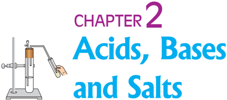
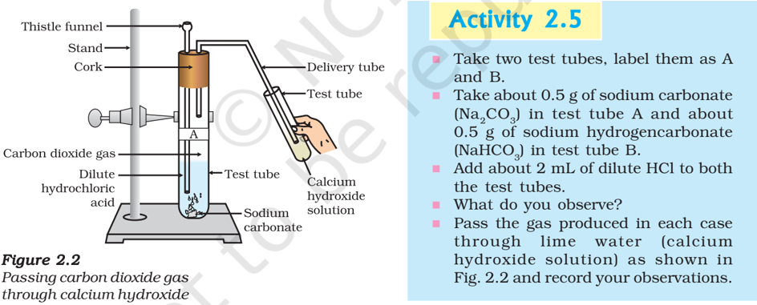
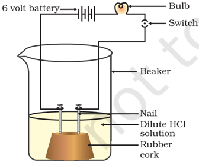
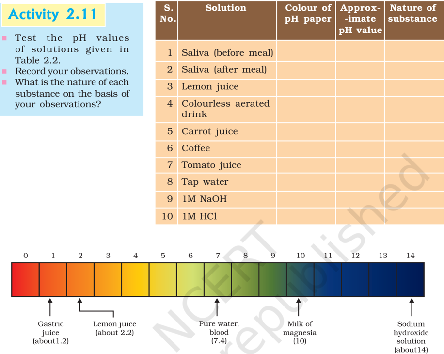
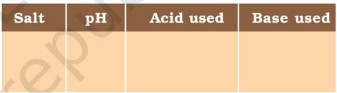
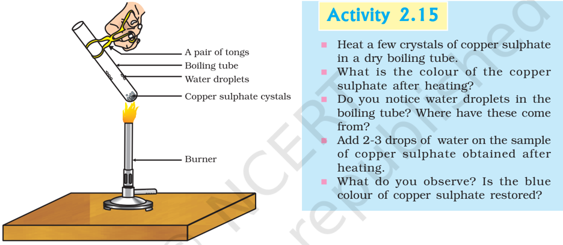

# PAGE 1



Y ou have learnt in your previous classes that the sour and bitter tastes of food are due to acids and bases, respectively, present in them. If someone in the family is suffering from a problem of acidity after overeating, which of the following would you suggest as a remedy- lemon juice, vinegar or baking soda solution?

- /square6 Which property did you think of while choosing the remedy? Surely you must have used your knowledge about the ability of acids and bases to nullify each other's effect.
- /square6 Recall how we tested sour and bitter substances without tasting them.

You already know that acids are sour in taste and change the colour of blue litmus to red, whereas, bases are bitter and change the colour of the red litmus to blue. Litmus is a natural indicator, turmeric is another such indicator. Have you noticed that a stain of curry on a white cloth becomes reddish-brown when soap, which is basic in nature, is scrubbed on it? It turns yellow again when the cloth is washed with plenty of water. You can also use synthetic indicators such as methyl orange and phenolphthalein to test for acids and bases.

In this Chapter, we will study the reactions of acids and bases, how acids and bases cancel out each other's effects and many more interesting things that we use and see in our day-to-day life.

## Do You Know?

Litmus solution is a purple dye, which is extracted from lichen, a plant belonging to the division Thallophyta, and is commonly used as an indicator. When the litmus solution is neither acidic nor basic, its colour is purple. There are many other natural materials like red cabbage leaves, turmeric, coloured petals of some flowers such as Hydrangea , Petunia and Geranium , which indicate the presence of acid or base in a solution. These are called acid-base indicators or sometimes simply indicators.


# PAGE 2

## Q U E S T I O N

1. You have been provided with three test tubes. One of them contains distilled water and the other two contain an acidic solution and a basic solution, respectively. If  you  are  given  only  red  litmus  paper,  how  will you identify the contents of each test tube?

?


## 2.1 2.1 UNDERST UNDERSTANDING THE CHEMIC ANDING THE  CHEMICAL  PROPERTIES  OF AL  PROPERTIES  OF ACIDS  AND  BASES ACIDS  AND  BASES

## 2.1.1 Acids and Bases in the Laboratory

## Activity  2.1 Activity  2.1

- /square6 Collect  the  following  solutions  from  the  science  laboratoryhydrochloric acid (HCl),  sulphuric acid (H 2 SO4 ), nitric acid (HNO 3 ), acetic  acid  (CH 3 COOH),  sodium  hydroxide  (NaOH),  calcium hydroxide  [Ca(OH) 2 ],  potassium  hydroxide  (KOH),  magnesium hydroxide [Mg(OH) 2 ],  and ammonium hydroxide (NH 4 OH).
- /square6 Put a drop of each of the above solutions on a watch-glass one by one and test with a drop of the indicators shown in Table 2.1.
- /square6 What change in colour did you observe with red litmus, blue litmus, phenolphthalein  and  methyl  orange  solutions  for  each  of  the solutions  taken?
- /square6 Tabulate your observations in Table 2.1.

## Table 2.1

| Sample solution   | Red litmus solution   | Blue litmus solution   | Phenolph- -thalein solution   | Methyl orange solution   |
|-------------------|-----------------------|------------------------|-------------------------------|--------------------------|

These indicators tell us whether a substance is acidic or basic by change in colour. There are some substances whose odour changes in acidic or basic media. These are called olfactory indicators. Let us try out some of these indicators.

## Activity  2.2 Activity  2.2

- /square6 Take some finely chopped onions in a plastic bag along with some strips of clean cloth. Tie up the bag tightly and leave overnight in the fridge. The cloth strips can now be used to test for acids and bases.
- /square6 Take two of these cloth strips and check their odour.
- /square6 Keep them on a clean surface and put a few drops of dilute HCl solution on one strip and a few drops of dilute NaOH solution on the  other.

# PAGE 3

- /square6 Rinse both cloth strips with water and again check their odour.
- /square6 Note your observations.
- /square6 Now take some dilute vanilla essence and clove oil and check their odour.
- /square6 Take some dilute HCl solution in one test tube and dilute NaOH solution  in  another.  Add  a  few  drops  of  dilute  vanilla  essence  to both test tubes and shake well. Check the odour once again and record changes in odour, if any.
- /square6 Similarly, test the change in the odour of clove oil with dilute HCl and dilute NaOH solutions and record your observations.

Which of these - vanilla, onion and clove, can be used as olfactory indicators on the basis of your observations?

Let us do some more activities to understand the chemical properties of acids and bases.

## 2.1.2 How do Acids and Bases React with Metals?

## Activity  2.3 Activity  2.3

CAUTION: This activity needs the teacher's assistance.

- /square6 Set the apparatus as shown in Fig. 2.1.
- /square6 Take about 5 mL of dilute sulphuric acid in a test tube and add a few pieces of zinc granules to it.
- /square6 What do you observe on the surface of zinc granules?
- /square6 Pass the gas being evolved through the soap solution.
- /square6 Why are bubbles  formed in the soap solution?
- /square6 Take a burning candle near a gas filled bubble.
- /square6 What do you observe?
- /square6 Repeat this  Activity  with  some  more  acids  like  HCl,  HNO 3 and CH3 COOH.
- /square6 Are the observations in all the cases the same or different?

Figure 2.1 Reaction of zinc granules with dilute sulphuric acid and testing hydrogen gas by burning


# PAGE 4

Passing carbon dioxide gas through calcium hydroxide solution

Note that the metal in the above reactions displaces hydrogen atoms from the acids as hydrogen gas and forms a compound called a salt. Thus, the reaction of a metal with an acid can be summarised as -

<!-- formula-not-decoded -->

Can you now write the equations for the reactions you have observed?

## Activity  2.4 Activity  2.4

- /square6 Place a few pieces of granulated zinc metal in a test tube.
- /square6 Add 2 mL of sodium hydroxide solution and warm the contents of the test tube.
- /square6 Repeat the rest of the steps as in Activity  2.3  and  record  your observations.

The reaction that takes place can be written as follows.

<!-- formula-not-decoded -->

You find again that hydrogen is formed in the reaction. However, such reactions are not possible with all metals.

## 2.1.3 How do Metal Carbonates and Metal Hydrogencarbonates React with Acids?



The reactions occurring in the above Activity are written as -

```
Test tube A: Na CO HCl(aq) Cl(aq) H O(l) + CO 2 3 2 2 (s) Na (g) + → + 2 2 Test tube B: NaHCO HCl(aq) Cl(aq) H O(l) + CO 3 2 2 (s) Na (g) + → +
```

On passing the carbon dioxide gas evolved through lime water,

```
Ca(OH) CO H O(l) 2 2 2 (aq) (g) CaCO s 3 + → + ( ) (Lime water) (White precipitate)
```

# PAGE 5

On passing excess carbon dioxide the following reaction takes place:

<!-- formula-not-decoded -->

(Soluble in water)

Limestone, chalk and marble are different forms of calcium carbonate. All metal carbonates and hydrogencarbonates react with acids to give a corresponding salt, carbon dioxide and water.

Thus, the reaction can be summarised as -

Metal carbonate/Metal hydrogencarbonate + Acid → Salt + Carbon dioxide + Water

## 2.1.4 How do Acids and Bases React with each other?

## Activity  2.6 Activity  2.6

- /square6 Take about 2 mL of dilute NaOH solution in a test tube and add two drops of phenolphthalein solution.
- /square6 What is the colour of the solution?
- /square6 Add dilute HCl solution to the above solution drop by drop.
- /square6 Is  there any colour change for the reaction mixture?
- /square6 Why did the colour of phenolphthalein change after the addition of an acid?
- /square6 Now add a few drops of NaOH to the above mixture.
- /square6 Does the pink colour of phenolphthalein reappear?
- /square6 Why do you think this has happened?

In the above Activity, we have observed that the effect of a base is nullified by an acid and vice-versa. The reaction taking place is written as -

<!-- formula-not-decoded -->

The reaction between an acid and a base to give a salt and water is known as a neutralisation reaction. In general, a neutralisation reaction can be written as -

Base + Acid → Salt + Water

## 2.1.5 Reaction of Metallic Oxides with Acids

## Activity  2.7 Activity  2.7

- /square6 Take a small amount of copper oxide in a beaker and add dilute hydrochloric acid slowly while stirring.
- /square6 Note the colour of the solution. What has happened to the copper oxide?

You will notice that the colour of the solution becomes blue-green and the copper oxide dissolves. The blue-green colour of the solution is due to the formation of copper(II) chloride in the reaction. The general reaction between a metal oxide and an acid can be written as -

Metal oxide + Acid → Salt + Water

# PAGE 6

Now write and balance the equation for the above reaction. Since metallic oxides react with acids to give salts and water, similar to the reaction of a base with an acid, metallic oxides are said to be basic oxides.

## 2.1.6 Reaction of a Non-metallic Oxide with Base

You saw the reaction between carbon dioxide and calcium hydroxide (lime water) in Activity 2.5. Calcium hydroxide, which is a base, reacts with carbon dioxide to produce a salt and water. Since this is similar to the reaction between a base and an acid, we can conclude that nonmetallic oxides are acidic in nature.

## Q U E S T I O N S

1. Why should curd and sour substances not be kept in brass and copper vessels?
2. Which gas  is  usually  liberated  when  an  acid  reacts  with  a  metal? Illustrate  with  an  example.  How  will  you  test  for  the  presence  of this  gas?
3. Metal  compound  A  reacts  with  dilute  hydrochloric  acid  to  produce effervescence. The gas evolved extinguishes a burning candle. Write a balanced chemical equation for the reaction if one of the compounds formed is calcium chloride.

?

## 2.2  WHA 2.2  WHAT  DO  ALL  ACIDS  AND  ALL  BASES  HA T  DO  ALL  ACIDS  AND  ALL  BASES  HAVE  IN VE  IN COMMON? COMMON?

In  Section  2.1  we  have  seen  that  all  acids  have  similar  chemical properties. What leads to this similarity in properties? We saw in Activity 2.3 that all acids generate hydrogen gas on reacting with metals, so hydrogen seems to be common to all acids. Let us perform an Activity to investigate whether all compounds containing hydrogen are acidic.

## Activity  2.8 Activity  2.8

- /square6 Take solutions of glucose, alcohol, hydrochloric  acid,  sulphuric  acid,  etc.
- /square6 Fix two nails on a cork, and place the cork in a 100 mL beaker.
- /square6 Connect the nails  to  the  two  terminals  of  a 6 volt battery through a bulb and a switch, as shown in Fig. 2.3.
- /square6 Now pour some dilute HCl in the beaker and switch on the current.
- /square6 Repeat with dilute sulphuric acid.
- /square6 What do you observe?
- /square6 Repeat  the  experiment  separately  with glucose  and  alcohol  solutions.  What  do  you observe  now?
- /square6 Does the bulb glow in all cases?

Figure 2.3 Acid  solution  in  water conducts electricity



# PAGE 7

The bulb will start glowing in the case of acids, as shown in Fig. 2.3. But you will observe that glucose and alcohol solutions do not conduct electricity. Glowing of the bulb indicates that there is a flow of electric current through the solution. The electric current is carried through the acidic solution by ions.

Acids contain H +  ion as cation and anion such as Cl -  in HCl, NO 3 -in HNO3 , SO 24 in H 2 SO 4 , CH 3 COO -  in CH 3 COOH. Since the cation present in acids is H + , this suggests that acids produce hydrogen ions, H + (aq), in solution, which are responsible for their acidic properties.

Repeat the same Activity using alkalis such as sodium hydroxide, calcium hydroxide, etc. What can you conclude from the results of this Activity?

## 2.2.1 What Happens to an Acid or a Base in a Water Solution?

Do acids produce ions only in aqueous solution? Let us test this.


This experiment suggests that hydrogen ions in HCl are produced in the presence of water. The separation of H +  ion from HCl molecules cannot occur in the absence of water.

<!-- formula-not-decoded -->

Hydrogen ions cannot exist alone, but they exist after combining with water molecules. Thus hydrogen ions must always be shown as H + (aq) or hydronium ion (H 3 O + ).

<!-- formula-not-decoded -->

We have seen that acids give H 3 O +  or H + (aq) ion in water. Let us see what happens when a base is dissolved in water.

<!-- formula-not-decoded -->

# PAGE 8

<!-- formula-not-decoded -->

Bases generate hydroxide (OH - ) ions in water. Bases which are soluble in water are called alkalis.


All bases do not dissolve in water. An alkali is a base that dissolves in water. They are soapy to touch, bitter and corrosive. Never taste or touch them as they may cause harm. Which of the bases in the Table 2.1 are alkalis?

Now as we have identified that all acids generate H + (aq) and all bases generate OH -(aq), we can view the neutralisation reaction as follows -

<!-- formula-not-decoded -->

Let us see what is involved when water is mixed with an acid or a base.

Figure 2.5


Warning sign displayed on containers containing concentrated acids and bases

## Activity  2.10 Activity  2.10

- /square6 Take 10 mL water in a beaker.
- /square6 Add a few drops of concentrated H 2 SO4 to it and swirl the beaker slowly.
- /square6 Touch the base of the beaker.
- /square6 Is  there  a  change  in  temperature?
- /square6 Is  this  an  exothermic or endothermic process?
- /square6 Repeat the above Activity  with  sodium  hydroxide  pellets and record your observations.

The process of dissolving an acid or a base in water is a highly exothermic one. Care must be taken while mixing concentrated nitric acid or sulphuric acid with water. The acid must always be added slowly to water with constant stirring. If water is added to a concentrated acid, the heat generated may cause the mixture to splash out and cause burns. The glass container may also break due to excessive local heating. Look out for the warning sign (shown in Fig. 2.5) on the can of concentrated sulphuric acid and on the bottle of sodium hydroxide pellets.

Mixing  an  acid  or  base  with  water  results  in  decrease  in  the concentration of ions (H 3 O + /OH - ) per unit volume. Such a process is called dilution and the acid or the base is said to be diluted.

# PAGE 9

## Q U E S T I O N S

1. Why do HCl, HNO 3 ,  etc.,  show  acidic  characters  in  aqueous  solutions while solutions of compounds like alcohol and glucose do not show acidic character?
2. Why does an aqueous solution of an acid conduct electricity?
3. Why does dry HCl gas not change the colour of the dry litmus paper?
4. While diluting an acid, why is it recommended that the acid should be added to water and not water to the acid?
5. How is  the  concentration  of  hydronium  ions  (H 3 O + )  affected  when  a solution of an acid is diluted?
6. How is the concentration of hydroxide ions (OH -)  affected  when excess base is dissolved in a solution of sodium hydroxide?

## 2.3  HOW  STRONG  ARE  ACID  OR  BASE  SOLUTIONS? 2.3  HOW  STRONG  ARE  ACID  OR  BASE  SOLUTIONS?

We know how acid-base indicators can be used to distinguish between an acid and a base. We have also learnt in the previous section about dilution and decrease in concentration of H +  or OH -  ions in solutions. Can we quantitatively find the amount of these ions present in a solution? Can we judge how strong a given acid or base is?

We can do this by making use of a universal indicator, which is a mixture of several indicators. The universal indicator shows different colours at different concentrations of hydrogen ions in a solution.

A scale for measuring hydrogen ion concentration in a solution, called pH scale has been developed. The p in pH stands for ' potenz '  in German, meaning power. On the pH scale we can measure pH generally from 0 (very acidic) to 14 (very alkaline). pH should be thought of simply as a number which indicates the acidic or basic nature of a solution. Higher the hydronium ion concentration, lower is the pH value.

The pH of a neutral solution is 7. Values less than 7 on the pH scale represent an acidic solution. As the pH value increases from 7 to 14, it represents an increase in OH -  ion concentration in the solution, that is, increase in the strength of alkali (Fig. 2.6). Generally paper impregnated with the universal indicator is used for measuring pH.


Figure 2.6 Variation of pH with the change in concentration of H + (aq) and OH - (aq) ions


# PAGE 10

## Table 2.2

|   S. No. | Solution                 | Colour of pH paper   | Approx- -imate pH value   | Nature of substance   |
|----------|--------------------------|----------------------|---------------------------|-----------------------|
|        1 | Saliva (before meal)     |                      |                           |                       |
|        2 | Saliva (after meal)      |                      |                           |                       |
|        3 | Lemon juice              |                      |                           |                       |
|        4 | Colourless aerated drink |                      |                           |                       |
|        5 | Carrot juice             |                      |                           |                       |
|        6 | Coffee                   |                      |                           |                       |
|        7 | Tomato juice             |                      |                           |                       |
|        8 | Tap water                |                      |                           |                       |
|        9 | 1M NaOH                  |                      |                           |                       |
|       10 | 1M HCl                   |                      |                           |                       |

Figure 2.7 pH of some common substances shown on a pH paper (colours are only a rough guide)



The strength of acids and bases depends on the number of H +  ions and OH -  ions produced, respectively. If we take hydrochloric acid and acetic acid of the same concentration, say one molar, then these produce different amounts of hydrogen ions. Acids that give rise to more H +  ions are said to be strong acids, and acids that give less H + ions are said to be weak acids. Can you now say what weak and strong bases are?

## 2.3.1  Impor 2.3.1  Importance  of  pH  in  Ever tance  of  pH  in  Everyday  Life yday  Life

## Are plants and animals pH sensitive?

Our body works within the pH range of 7.0 to 7.8. Living organisms can survive only in a narrow range of pH change. When pH of rain water is less than 5.6, it is called acid rain. When acid rain flows into the rivers, it lowers the pH of the river water. The survival of aquatic life in such rivers becomes difficult.

# PAGE 11

## Do You Know?

## Acids in other planets

The atmosphere of venus is made up of thick white and yellowish clouds of sulphuric acid. Do you think life can exist on this planet?

## What is the pH of the soil in your backyard?

Plants require a specific pH range for their healthy growth. To find out the pH required for the healthy growth of a plant, you can collect the soil from various places and check the pH in the manner described below in Activity 2.12. Also, you can note down which plants are growing in the region from which you have collected the soil.

## Activity  2.12 Activity  2.12

- /square6 Put about 2 g soil in a test tube and add 5 mL water to it.
- /square6 Shake the contents of the test tube.
- /square6 Filter the contents and collect the filtrate in a test tube.
- /square6 Check  the  pH  of  this  filtrate  with  the  help  of  universal indicator  paper.
- /square6 What can you conclude about the ideal soil pH for the growth of plants in your region?

## pH in our digestive system

It is very interesting to note that our stomach produces hydrochloric acid. It helps in the digestion of food without harming the stomach. During indigestion the stomach produces too much acid and this causes pain and irritation. To get rid of this pain, people use bases called antacids. One such remedy must have been suggested by you at the beginning of this Chapter. These antacids neutralise the excess acid. Magnesium hydroxide (Milk of magnesia), a mild base, is often used for this purpose.

## pH change as the cause of tooth decay

Tooth decay starts when the pH of the mouth is lower than 5.5. Tooth enamel, made up of calcium hydroxyapatite (a crystalline form of calcium phosphate) is the hardest substance in the body. It does not dissolve in water, but is corroded when the pH in the mouth is below 5.5. Bacteria present in the mouth produce acids by degradation of sugar and food particles remaining in the mouth after eating. The best way to prevent this is to clean the mouth after eating food. Using toothpastes, which are generally basic, for cleaning the teeth can neutralise the excess acid and prevent tooth decay.

## Self defence by animals and plants through chemical warfare

Have you ever been stung by a honey-bee? Bee-sting leaves an acid which  causes pain and irritation. Use of a mild base like baking soda on the stung area gives relief.  Stinging  hair  of  nettle  leaves  inject methanoic acid causing burning pain.

# PAGE 12

## Nature provides neutralisation options

Nettle is a herbaceous plant which grows in the wild. Its leaves have stinging hair, which cause painful stings when touched accidentally. This is due to the methanoic


acid secreted by them. A traditional remedy is rubbing the area with the leaf of the dock plant, which often grows beside the nettle in the wild. Can you guess the nature of the dock plant? So next time you know what to look out for if you accidentally touch a nettle plant while trekking. Are you aware of any other effective traditional remedies for such stings?

Table 2.3 Some naturally occurring acids

| Natural source   | Acid          | Natural source   | Acid           |
|------------------|---------------|------------------|----------------|
| Vinegar          | Acetic acid   | Sour milk (Curd) | Lactic acid    |
| Orange           | Citric acid   | Lemon            | Citric acid    |
| Tamarind         | Tartaric acid | Ant sting        | Methanoic acid |
| Tomato           | Oxalic acid   | Nettle sting     | Methanoic acid |

## Q U E S T I O N S

1. You have two solutions,  A  and  B.  The  pH  of  solution  A  is  6  and  pH  of solution  B  is  8.  Which  solution  has  more  hydrogen  ion  concentration? Which of this is acidic and which one is basic?
2. What effect does the concentration of H + (aq) ions have on the nature of the solution?
3. Do basic solutions also have H + (aq) ions? If yes, then why are these basic?
4. Under what soil condition do you think a farmer would treat the soil of his fields with quick lime (calcium oxide) or slaked lime (calcium hydroxide) or chalk  (calcium  carbonate)?

## 2.4  MORE  ABOUT  SAL 2.4  MORE  ABOUT  SALTS TS

In the previous sections we have seen the formation of salts during various reactions. Let us understand more about their preparation, properties and uses.

## 2.4.1 Family of Salts

## Activity  2.13 Activity  2.13

- /square6 Write the chemical formulae of the salts given below. Potassium  sulphate,  sodium  sulphate,  calcium  sulphate, magnesium sulphate, copper sulphate, sodium chloride, sodium nitrate,  sodium  carbonate  and  ammonium chloride.


?

# PAGE 13

- /square6 Identify  the  acids  and  bases  from  which  the  above  salts  may  be obtained.
- /square6 Salts  having  the  same  positive  or  negative  radicals  are  said  to belong to a family.  For example, NaCl and Na 2 SO4 belong to the family of sodium salts.  Similarly, NaCl and KCl belong to the family of chloride salts.  How many families can you identify among the salts  given  in  this  Activity?

## 2.4.2 pH of Salts

## Activity  2.14 Activity  2.14

- /square6 Collect  the  following  salt  samples  -  sodium  chloride,  potassium nitrate,  aluminium  chloride,  zinc  sulphate,  copper  sulphate, sodium acetate, sodium carbonate and sodium hydrogencarbonate (some other salts available can also be taken).
- /square6 Check their solubility in water (use distilled water only).
- /square6 Check the action of  these  solutions  on  litmus  and  find  the  pH using a pH paper.
- /square6 Which of the salts are acidic, basic or neutral?
- /square6 Identify the acid or base used to form the salt.
- /square6 Report your observations in Table 2.4.

Salts of a strong acid and a strong base are neutral with pH value of 7. On the other hand, salts of a strong acid and weak base are acidic with pH value less than 7 and those of a strong base and weak acid are basic in nature, with pH value more than 7.

## 2.4.3 Chemicals from Common Salt

By now you have learnt that the salt formed by the combination of hydrochloric acid and sodium hydroxide solution is called sodium chloride. This is the salt that you use in food. You must have observed in the above Activity that it is a neutral salt.

Seawater contains many salts dissolved in it. Sodium chloride is separated from these salts. Deposits of solid salt are also found in several parts of the world. These large crystals are often brown due to impurities. This is called rock salt. Beds of rock salt were formed when seas of bygone ages dried up. Rock salt is mined like coal.

Table 2.4



| Salt   | pH   | Acid used   | Base used   |
|--------|------|-------------|-------------|


You must have heard about Mahatma Gandhi's Dandi March . Did you know that sodium chloride was such an important symbol in our struggle for freedom?

# PAGE 14

## Common salt - A raw material for chemicals

The common salt thus obtained is an important raw material for various materials of daily use, such as sodium hydroxide, baking soda, washing soda, bleaching powder and many more. Let us see how one substance is used for making all these different substances.

## Sodium hydroxide

When electricity is  passed  through  an  aqueous  solution  of  sodium chloride (called brine), it decomposes to form sodium hydroxide. The process is called the chlor-alkali process because of the products formedchlor for chlorine and alkali for sodium hydroxide.

<!-- formula-not-decoded -->

Chlorine gas is given off at the anode, and hydrogen gas at the cathode. Sodium hydroxide solution is formed near the cathode. The three products produced in this process are all useful. Figure 2.8 shows the different uses of these products.

Figure 2.8 Important products from the chlor-alkali process


## Bleaching powder

You have already come to know that chlorine is produced during the electrolysis of aqueous sodium chloride (brine). This chlorine gas is used for the manufacture of bleaching powder. Bleaching powder is produced by the action of chlorine on dry slaked lime [Ca(OH) 2 ]. Bleaching powder is  represented as Ca(ClO) 2 ,  though the actual composition is quite complex.

<!-- formula-not-decoded -->

# PAGE 15

## Bleaching powder is used -

- (i) for bleaching cotton and linen in the textile industry, for bleaching wood pulp in paper factories and for bleaching washed clothes in laundry;
- (ii) as an oxidising agent in many chemical industries; and
- (iii) to make drinking water free from germs.

## Baking soda

The baking soda is commonly used in the kitchen for making tasty crispy pakoras, etc. Sometimes it is added for faster cooking. The chemical name of the compound is sodium hydrogencarbonate (NaHCO 3 ). It is produced using sodium chloride as one of the raw materials.

```
NaCl + H O + CO + NH NH Cl + NaHCO 2 2 3 4 3 → (Ammonium (Sodium chloride) hydrogencarbonate)
```

Did you check the pH of sodium hydrogencarbonate in Activity 2.14? Can you correlate why it can be used to neutralise an acid? It is a mild non-corrosive basic salt. The following reaction takes place when it is heated during cooking -

```
2NaHCO Na CO +H O+CO 3 2 3 2 2 Heat   → (Sodium (Sodium hydrogencarbonate) carbonate)
```

Sodium hydrogencarbonate has got various uses in the household.

## Uses of Baking soda

- (i) For making baking powder, which is a mixture of baking soda (sodium hydrogencarbonate) and a mild edible acid such as tartaric acid. When baking powder is heated or mixed in water, the following reaction takes place -

<!-- formula-not-decoded -->

Carbon dioxide produced during the reaction can cause bread or cake to rise making them soft and spongy.

- (ii) Sodium hydrogencarbonate is also an ingredient in antacids. Being alkaline, it neutralises excess acid in the stomach and provides relief.
- (iii) It is also used in soda-acid fire extinguishers.

## Washing soda

Another  chemical  that  can  be  obtained  from  sodium  chloride  is Na 2 CO3 .10H 2 O (washing soda). You have seen above that sodium carbonate can be obtained by heating baking soda; recrystallisation of sodium carbonate gives washing soda. It is also a basic salt.

```
Na CO H O Na CO H O Sodium carbonate 2 3 2 2 3 2 10 10 + → . ( )
```

# PAGE 16

What does 10H 2 O signify? Does it make Na 2 CO3 wet? We will address this question in the next section.

Sodium carbonate and sodium hydrogencarbonate are useful chemicals for many industrial processes as well.

## Uses of washing soda

- (i) Sodium carbonate (washing soda) is used in glass, soap and paper industries.
- (ii) It  is  used in the manufacture of sodium compounds such as borax.
- (iii) Sodium carbonate can be used as a cleaning agent for domestic purposes.
- (iv) It is used for removing permanent hardness of water.

## 2.4.4 Are the Crystals of Salts really Dry?

Figure 2.9 Removing water of crystallisation



Copper sulphate crystals which seem to be dry contain water of crystallisation. When we heat the crystals, this water is removed and the salt turns white.

If you moisten the crystals again with water, you will find that blue colour of the crystals reappears.

Water of crystallisation is the fixed number of water molecules present in one formula unit of a salt. Five water molecules are present in one formula unit of copper sulphate. Chemical formula for hydrated copper sulphate is Cu SO 4 . 5H 2 O. Now you would be able to answer the question whether the molecule of Na 2 CO3 .10H 2 O is wet.

One other salt, which possesses water of crystallisation is gypsum. It has two water molecules as water of cyrstallisation. It has the chemical formula CaSO 4 .2H 2 O. Let us look into the use of this salt.

## Plaster of Paris

On heating gypsum at 373 K, it loses water molecules and becomes calcium sulphate hemihydrate ( 4 2 1 CaSO . H O 2 ). This is called Plaster of

# PAGE 17

Paris,  the  substance  which  doctors  use  as  plaster  for  supporting fractured bones in the right position. Plaster of Paris is a white powder and on mixing with water, it changes to gypsum once again giving a hard solid mass.

<!-- formula-not-decoded -->

Note that only half a water molecule is shown to be attached as water of crystallisation. How can you get half a water molecule? It is written in this form because two formula units of CaSO 4 share one molecule of water. Plaster of Paris is used for making toys, materials for decoration and for making surfaces smooth. Try to find out why is calcium sulphate hemihydrate called 'Plaster of Paris' ?

## Q U E S T I O N S

1. What is the common name of the compound Ca(ClO) 2 ?
2. Name the substance which on treatment with chlorine yields bleaching powder.
3. Name the sodium compound which is used for softening hard water.
4. What will  happen  if  a  solution  of  sodium  hydrocarbonate  is  heated? Give the equation of the reaction involved.
5. Write  an  equation  to  show  the  reaction  between  Plaster  of  Paris  and water.

## What you have learnt

- n Acid-base indicators are dyes or mixtures of dyes which are used to indicate the presence of acids and bases.
- n Acidic nature of a substance is due to the formation of H + (aq) ions in solution. Formation of OH - (aq) ions in solution is responsible for the basic nature of a substance.
- n When an acid reacts with a metal, hydrogen gas is evolved and a corresponding salt is formed.
- n When a base reacts with a metal, along with the evolution of hydrogen gas a salt is formed which has a negative ion composed of the metal and oxygen.
- n When an acid reacts with a metal carbonate or metal hydrogencarbonate, it gives the corresponding salt, carbon dioxide gas and water.
- n Acidic and basic solutions in water conduct electricity because they produce hydrogen and hydroxide ions respectively.


# PAGE 18

- /square6 The strength of an acid or an alkali can be tested by using a scale called the pH scale (0-14) which gives the measure of hydrogen ion concentration in a solution.
- /square6 A neutral solution has a pH of exactly 7, while an acidic solution has a pH less than 7 and a basic solution a pH more than 7.
- /square6 Living beings carry out their metabolic activities within an optimal pH range.
- /square6 Mixing concentrated acids or bases with water is a highly exothermic process.
- /square6 Acids and bases neutralise each other to form corresponding salts and water.
- /square6 Water of crystallisation is the fixed number of water molecules present in one formula unit of a salt.
- /square6 Salts have various uses in everyday life and in industries.

## E X E R C I S E S

1. A solution turns red litmus blue, its pH is likely to be
2. (a) 1
3. (b) 4
4. (c) 5
5. (d) 10
2. A solution reacts with crushed egg-shells to give a gas that turns lime-water milky. The solution contains
7. (a) NaCl
8. (b) HCl
9. (c) LiCl
10. (d) KCl
3. 10 mL of a solution of NaOH is found to be completely neutralised by 8 mL of a given solution of HCl. If we take 20 mL of the same solution of NaOH, the amount HCl solution (the same solution as before) required to neutralise it will be
12. (a) 4 mL
13. (b) 8 mL
14. (c) 12 mL
15. (d) 16 mL
4. Which one of the following types of medicines is used for treating indigestion?
17. (a) Antibiotic
18. (b) Analgesic
19. (c) Antacid
20. (d) Antiseptic
5. Write  word  equations  and  then  balanced  equations  for  the  reaction  taking place when -
22. (a) dilute sulphuric acid reacts with zinc granules.
23. (b) dilute hydrochloric acid reacts with magnesium ribbon.
24. (c) dilute sulphuric acid reacts with aluminium powder.
25. (d) dilute hydrochloric acid reacts with iron filings.
6. Compounds such as alcohols and glucose also contain hydrogen but are not categorised as acids. Describe an Activity to prove it.
7. Why does distilled water not conduct electricity, whereas rain water does?

# PAGE 19

8. Why do acids not show acidic behaviour in the absence of water?
9. Five solutions A,B,C,D and E when tested with universal indicator showed pH as 4,1,11,7 and 9, respectively. Which solution is
3. (a) neutral?
4. (b) strongly alkaline?
5. (c) strongly acidic?
6. (d) weakly acidic?
7. (e) weakly alkaline?

Arrange the pH in increasing order of hydrogen-ion concentration.

10. Equal lengths of magnesium ribbons are taken in test tubes A and B. Hydrochloric acid (HCl) is added to test tube A, while acetic acid (CH 3 COOH) is added to test tube B. Amount and concentration taken for both the acids are same. In which test tube will the fizzing occur more vigorously and why?
11. Fresh milk has a pH of 6. How do you think the pH will change as it turns into curd? Explain your answer.
12. A milkman adds a very small amount of baking soda to fresh milk.
4. (a) Why does he shift the pH of the fresh milk from 6 to slightly alkaline?
5. (b) Why does this milk take a long time to set as curd?
13. Plaster of Paris should be stored in a moisture-proof container. Explain why?
14. What is a neutralisation reaction? Give two examples.
15. Give two important uses of  washing soda and baking soda.

## Group  Activity

- (I) Prepare your own indicator
- /square6 Crush beetroot in a mortar.
- /square6 Add sufficient water to obtain the extract.
- /square6 Filter the extract by the procedure learnt by you in earlier classes.
- /square6 Collect the filtrate to test the substances you may have tasted earlier.
- /square6 Arrange four test tubes in a test tube stand and label them as A,B,C and D. Pour 2 mL each of lemon juice solution, soda-water, vinegar and baking soda solution in them respectively.
- /square6 Put 2-3 drops of the beetroot extract in each test tube and note the colour change if any. Write your observation in a Table.
- /square6 You can prepare indicators by using other natural materials like extracts of red cabbage leaves, coloured petals of some flowers such as Petunia , Hydrangea and Geranium .

# PAGE 20

## (II) Preparing a soda-acid fire extinguisher

The reaction of acids with metal hydrogencarbonates is used in the fire extinguishers which produce carbon dioxide.

- /square6 Take 20 mL of sodium hydrogencarbonate (NaHCO 3 ) solution in a wash-bottle.
- /square6 Suspend an ignition tube containing dilute sulphuric acid in the wash-bottle (Fig. 2.10).
- /square6 Close the mouth of the wash-bottle.
- /square6 Tilt the wash-bottle so that the acid from the ignition tube mixes with the sodium hydrogencarbonate solution below.
- /square6 You will notice discharge coming out of the nozzle.
- /square6 Direct this discharge on a burning candle. What happens?

Figure 2.10 (a) Ignition tube containing dilute sulphuric acid suspended in a wash-bottle containing sodium hydrogencarbonate, (b) Discharge coming out of the nozzle

