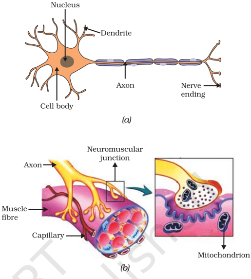
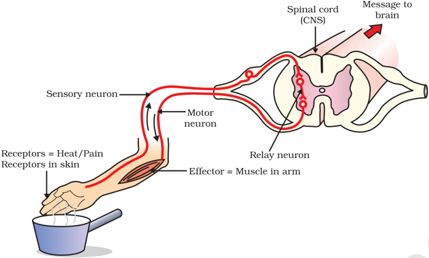
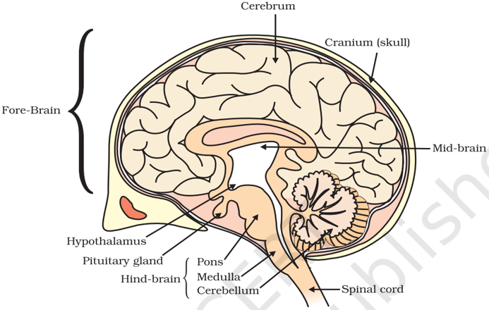

# PAGE 1

100

I n the previous chapter, we looked at life processes involved in the maintenance functions in living organisms. There, we had started with a notion we all have, that if we see something moving, it is alive. Some of these movements are in fact the result of growth, as in plants. A seed germinates and grows, and we can see that the seedling moves over the course of a few days, it pushes soil aside and comes out. But if its growth were  to  be  stopped,  these  movements  would  not  happen.  Some movements, as in many animals and some plants, are not connected with  growth.  A  cat  running,  children  playing  on  swings,  buffaloes chewing cud - these are not movements caused by growth.

Why do we associate such visible movements with life? A possible answer is that we think of movement as a response to a change in the environment of the organism. The cat may be running because it has seen a mouse.  Not only that, we also think of movement as an attempt by  living  organisms  to  use  changes  in  their  environment  to  their advantage. Plants grow out into the sunshine. Children try to get pleasure and fun out of swinging. Buffaloes chew cud to help break up tough food so as to be able to digest it better. When bright light is focussed on our eyes or when we touch a hot object, we detect the change and respond to it with movement in order to protect ourselves.

If we think a bit more about this, it becomes apparent that all this movement, in response to the environment, is carefully controlled. Each kind of a change in the environment evokes an appropriate movement in response. When we want to talk to our friends in class, we whisper, rather than shouting loudly. Clearly, the movement to be made depends on the event that is triggering it. Therefore, such controlled movement must be  connected  to  the  recognition  of  various  events  in  the environment, followed by only the correct movement in response. In other words,  living  organisms  must  use  systems  providing  control  and coordination. In keeping with the general principles of body organisation in multicellular organisms, specialised tissues are used to provide these control and coordination activities.

## 6.1 6.1 ANIMALS  -  NERVOUS  SYSTEM ANIMALS  -  NERVOUS  SYSTEM

In animals, such control and coordination are provided by nervous and muscular tissues, which we have studied in Class IX. Touching a hot

Science

# PAGE 2

object  is  an  urgent  and  dangerous situation for us. We need to detect it, and respond to it. How do we detect that we  are  touching  a  hot  object?  All information  from  our  environment  is detected by the specialised tips of some nerve cells. These receptors are usually located in our sense organs, such as the inner ear, the nose, the tongue, and so on. So gustatory receptors will detect taste while olfactory receptors will detect smell.

This  information,  acquired  at  the end of the dendritic tip of a nerve cell [Fig. 6.1 (a)], sets off a chemical reaction that creates an electrical impulse. This impulse travels from the dendrite to the cell body, and then along the axon to its end. At the end of the axon, the electrical impulse  sets  off  the  release  of  some chemicals. These chemicals cross the gap,  or  synapse,  and  start  a  similar electrical impulse in a dendrite of the next neuron. This is a general scheme of how nervous impulses travel in the body. A

Figure  6.1 (a)  Structure  of  neuron,  (b)  Neuromuscular junction

similar synapse finally allows delivery of such impulses from neurons to other cells, such as muscles cells or gland  [Fig. 6.1 (b)].

It is thus no surprise that nervous tissue is made up of an organised network of nerve cells or neurons, and is specialised for conducting information via electrical impulses from one part of the body to another.

Look at Fig. 6.1 (a) and identify the parts of a neuron (i) where information is acquired, (ii) through which information travels as an electrical impulse, and (iii) where this impulse must be converted into a chemical signal for onward transmission.

## Activity  6.1 Activity  6.1

- /square6 Put some sugar in your mouth. How does it taste?
- /square6 Block  your  nose  by  pressing  it  between  your  thumb  and  index finger. Now eat sugar again. Is there any difference in its taste?
- /square6 While eating lunch, block your nose in the same way and notice if you can fully appreciate the taste of the food you are eating.

Is there a difference in how sugar and food taste if your nose is blocked? If so, why might this be happening? Read and talk about possible explanations for these kinds of differences. Do you come across a similar situation when you have a cold?

# PAGE 3

## 6.1.1 What happens in Reflex Actions?

'Reflex' is a word we use very commonly when we talk about some sudden action in response to something in the environment. We say 'I jumped out of the way of the bus reflexly', or 'I pulled my hand back from the flame reflexly', or 'I was so hungry my mouth started watering reflexly'. What exactly do we mean? A common idea in all such examples is that we do something without thinking about it, or without feeling in control of our reactions. Yet these are situations where we are responding with some action to  changes  in  our  environment.  How  is  control  and coordination achieved in such situations?

Let us consider this further. Take one of our examples. Touching a flame is an urgent and dangerous situation for us, or in fact, for any animal! How would we respond to this? One seemingly simple way is to think consciously about the pain and the possibility of getting burnt, and therefore move our hand. An important question then is, how long will it take us to think all this? The answer depends on how we think.  If nerve impulses are sent around the way we have talked about earlier, then thinking is also likely to involve the creation of such impulses. Thinking is a complex activity, so it is bound to involve a complicated interaction of many nerve impulses from many neurons.

If this is the case, it is no surprise that the thinking tissue in our body consists of dense networks of intricately arranged neurons. It sits in the forward end of the skull, and receives signals from all over the body which it thinks about before responding to them. Obviously, in order to receive these signals, this thinking part of the brain in the skull must be connected to nerves coming from various parts of the body. Similarly, if this part of the brain is to instruct muscles to move, nerves must carry this signal back to different parts of the body. If all of this is to be done when we touch a hot object, it may take enough time for us to get burnt!

How does the design of the body solve this problem? Rather than having to think about the sensation of heat, if the nerves that detect heat were to be connected to the nerves that move muscles in a simpler way, the process of detecting the signal or the input and responding to it by an output action might be completed quickly. Such a connection is commonly called a reflex arc (Fig. 6.2). Where should such reflex arc connections be made between the input nerve and the output nerve? The best place, of course, would be at the point where they first meet each other. Nerves from all over the body meet in a bundle in the spinal cord on their way to the brain. Reflex arcs are formed in this spinal cord itself, although the information input also goes on to reach the brain.

Of course, reflex arcs have evolved in animals because the thinking process of the brain is not fast enough.  In fact many animals have very little or none of the complex neuron network needed for thinking. So it is quite likely that reflex arcs have evolved as efficient ways of functioning in the absence of true thought processes.  However, even after complex neuron networks have come into existence, reflex arcs continue to be more efficient for quick responses.

# PAGE 4

Figure  6.2  Reflex  arc

Can you now trace the sequence of events which occur when a bright light is focussed on your eyes?

## 6.1.2 Human Brain

Is reflex action the only function of the spinal cord? Obviously not, since we know that we are thinking beings. Spinal cord is made up of nerves which supply information to think about. Thinking involves more complex mechanisms and neural connections. These are concentrated in the brain, which is the main coordinating centre of the body.  The brain and spinal cord constitute the central nervous system (Fig. 6.3). They receive information from all parts of the body and integrate it.

We also think about our actions. Writing, talking, moving a chair, clapping at the end of a programme are examples of voluntary actions which are based on deciding what to do next.  So, the brain also has to send messages to muscles.  This is the second way in which the nervous system communicates with the muscles.  The communication between the central nervous system and the other parts of the body is facilitated by the peripheral nervous system consisting of cranial nerves arising from the brain and spinal nerves arising from the spinal cord. The brain thus allows us to think and take actions based on that thinking.  As you will expect, this is accomplished through a complex design, with different parts of the brain responsible for integrating different inputs and outputs. The brain has three such major parts or regions, namely the fore-brain, mid-brain and hind-brain.

The fore-brain is the main thinking part of the brain. It has regions which receive sensory impulses from various receptors. Separate areas of the fore-brain are specialised for hearing, smell, sight and so on.  There are separate areas of association where this sensory information is interpreted by putting it together with information from other receptors as well as with information that is already stored in the brain.  Based on

# PAGE 5

all this, a decision is made about how to respond and the information is passed on to the motor areas which control the movement of voluntary muscles, for example, our leg muscles.  However, certain sensations are distinct from seeing or hearing, for example, how do we know that we have eaten enough? The sensation of feeling full is because of a centre associated with  hunger, which is in a separate part of the fore-brain.

Figure  6.3  Human  brain

Study the labelled diagram of the human brain. We have seen that the different parts have specific functions. Can we find out the function of each part?

Let us look at the other use of the word 'reflex' that we have talked about in the introduction. Our mouth waters when we see food we like without our meaning to. Our hearts beat without our thinking about it. In fact, we cannot control these actions easily by thinking about them even if we wanted to. Do we have to think about or remember to breathe or digest food? So, in between the simple reflex actions like change in the size of the pupil, and the thought out actions such as moving a chair, there is another set of muscle movements over which we do not have any thinking control. Many of these involuntary actions are controlled by the mid-brain and hind-brain. All these involuntary actions including blood pressure, salivation and vomiting are controlled by the medulla in the hind-brain.

Think about activities like walking in a straight line, riding a bicycle, picking up a pencil. These are possible due to a part of the hind-brain called the cerebellum. It is responsible for precision of voluntary actions and maintaining the posture and balance of the body. Imagine what would happen if each of these events failed to take place if we were not thinking about it.

# PAGE 6

## 6.1.3 How are these Tissues protected?

A delicate organ like the brain, which is so important for a variety of activities, needs to be carefully protected. For this, the body is designed so that the brain sits inside a bony box. Inside the box, the brain is contained  in  a  fluid-filled  balloon  which  provides  further  shock absorption. If you run your hand down the middle of your back, you will  feel  a  hard,  bumpy  structure.  This  is  the  vertebral  column  or backbone which protects the spinal cord.

## 6.1.4 How does the Nervous Tissue cause Action?

So far, we have been talking about nervous tissue, and how it collects information, sends it around the body, processes information, makes decisions based on information, and conveys decisions to muscles for action. In other words, when the action or movement is to be performed, muscle tissue will do the final job. How do animal muscles move? When a nerve impulse reaches the muscle, the muscle fibre must move. How does a muscle cell move? The simplest notion of movement at the cellular level is that muscle cells will move by changing their shape so that they shorten. So the next question is, how do muscle cells change their shape? The answer must lie in the chemistry of cellular components. Muscle cells  have  special  proteins  that  change  both  their  shape  and  their arrangement in the cell in response to nervous electrical impulses. When this happens, new arrangements of these proteins give the muscle cells a  shorter  form.  Remember when we talked about muscle tissue in Class IX, there were different kinds of muscles, such as voluntary muscles and involuntary muscles. Based on what we have discussed so far, what do you think the differences between these would be?

## Q U E S T I O N S

1. What is the difference between a reflex action and walking?
2. What happens at the synapse between two neurons?
3. Which part of the brain maintains posture and equilibrium of the body?
4. How do we detect the smell of an agarbatti (incense stick)?
5. What is the role of the brain in reflex action?

## 6.2  COORDINA 6.2  COORDINATION  IN  PL TION  IN  PLANTS ANTS

Animals have a nervous system for controlling and coordinating the activities of the body. But plants have neither a nervous system nor muscles. So, how do they respond to stimuli? When we touch the leaves of a chhui-mui (the 'sensitive' or 'touch-me-not' plant of the Mimosa family), they begin to fold up and droop. When a seed germinates, the root goes down, the stem comes up into the air. What happens? Firstly, the leaves of the sensitive plant move very quickly in response to touch.

?

# PAGE 7

There is no growth involved in this movement. On the other hand, the directional movement of a seedling is caused by growth. If it is prevented from growing, it will not show any movement. So plants show two different types of movement - one dependent on growth and the other independent of growth.

## 6.2.1 Immediate Response to Stimulus

Let us think about the first kind of movement, such as that of the sensitive plant. Since no growth is involved, the plant must actually move its leaves in response to touch. But there is no nervous tissue, nor any muscle tissue. How does the plant detect the touch, and how do the leaves move in response?

Figure  6.4  The  sensitive  plant

If we think about where exactly the plant is touched, and what part of the plant actually moves, it is apparent that movement happens at a point different from the point of touch. So, information that a touch has occurred must be communicated. The plants also use electrical-chemical means to convey this information from cell to cell, but unlike in animals, there is no specialised tissue in plants for the conduction of information. Finally, again as in animals, some cells must change shape in order for movement to happen. Instead of the specialised proteins found in animal muscle cells, plant cells change shape by changing the amount of water in them, resulting in swelling or shrinking, and therefore in changing shapes (Fig. 6.4).

## 6.2.2 Movement Due to Growth

Some plants like the pea plant climb up other plants or fences by means of tendrils. These tendrils are sensitive to touch. When they come in contact with any support, the part of the tendril in contact with the object does not grow as rapidly as the part of the tendril away from the object. This causes the tendril to circle around the object and thus cling to it. More commonly, plants respond to stimuli slowly by growing in a particular direction. Because this growth is directional, it appears as if the plant is moving. Let us understand this type of movement with the help of an example.

# PAGE 8

## Activity  6.2 Activity  6.2

- /square6 Fill a conical flask with water.
- /square6 Cover the neck of the flask with a wire mesh.
- /square6 Keep  two  or  three  freshly  germinated  bean seeds on the wire mesh.
- /square6 Take a cardboard box which is open from one side.
- /square6 Keep the flask  in  the  box  in  such  a  manner that the open side of the box faces light coming from a window (Fig. 6.5).
- /square6 After  two  or  three  days,  you  will  notice  that the shoots bend towards light and roots away from light.
- /square6 Now turn the flask so that the shoots are away from light and the roots towards light. Leave it undisturbed in this condition for a few days.
- /square6 Have  the  old  parts  of  the  shoot  and  root changed direction?
- /square6 Are there differences in the direction of the new growth?
- /square6 What can we conclude from this activity?

Environmental triggers such as light, or gravity will change the directions that plant parts grow in. These directional, or tropic, movements can be either towards the stimulus, or away from it. So, in two different  kinds  of  phototropic  movement,  shoots respond  by  bending  towards  light  while  roots respond by bending away from it. How does this help the plant?

Figure  6.5 Response of the plant to the direction of light

Figure  6.6 Plant  showing  geotropism

Plants show tropism in response to other stimuli as well. The roots of  a  plant  always  grow  downwards  while  the  shoots  usually  grow upwards and away from the earth. This upward and downward growth of shoots and roots, respectively, in response to the pull of earth or gravity is, obviously, geotropism (Fig. 6.6). If 'hydro' means water and 'chemo' refers to chemicals, what would 'hydrotropism' and 'chemotropism' mean? Can we think of examples of these kinds of directional growth movements? One example of chemotropism is the growth of pollen tubes towards ovules, about which we will learn more when we examine the reproductive processes of living organisms.

Let us now once again think about how information is communicated in  the  bodies  of  multicellular  organisms.  The  movement  of  the sensitive plant in response to touch is very quick. The movement of sunflowers in response to day or night, on the other hand, is quite slow. Growth-related movement of plants will be even slower.

Even in animal bodies, there are carefully controlled directions to growth. Our arms and fingers grow in certain directions, not haphazardly. So controlled movements can be either slow or fast. If fast responses to stimuli are to be made, information transfer must happen very quickly. For this, the medium of transmission must be able to move rapidly.

# PAGE 9

Electrical  impulses  are  an  excellent  means  for  this.  But  there  are limitations to the use of electrical impulses. Firstly, they will reach only those cells that are connected by nervous tissue, not each and every cell in the animal body. Secondly, once an electrical impulse is generated in a cell and transmitted, the cell will take some time to reset its mechanisms before it can generate and transmit a new impulse. In other words, cells cannot continually create and transmit electrical impulses. It is thus no wonder that most multicellular  organisms  use  another  means  of communication between cells, namely, chemical communication.

If, instead of generating an electrical impulse, stimulated cells release a chemical compound, this compound would diffuse all around the original cell. If other cells around have the means to detect this compound using special molecules on their surfaces, then they would be able to recognise information, and even transmit it. This will be slower, of course, but it can potentially reach all cells of the body, regardless of nervous connections,  and  it  can  be  done  steadily  and  persistently.  These compounds, or hormones used by multicellular organisms for control and coordination show a great deal of diversity, as we would expect. Different plant hormones help to coordinate growth, development and responses to the environment. They are synthesised at places away from where they act and simply diffuse to the area of action.

Let us take an example that we have worked with earlier [Activity 6.2]. When growing plants detect light, a hormone called auxin, synthesised at the shoot tip, helps the cells to grow longer. When light is coming from one side of the plant, auxin diffuses towards the shady side of the shoot. This concentration of auxin stimulates the cells to grow longer on the side of the shoot which is away from light. Thus, the plant appears to bend towards light.

Another example of plant hormones are gibberellins which, like auxins, help in the growth of the stem. Cytokinins promote cell division, and it is natural then that they are present in greater concentration in areas of rapid cell division, such as in fruits and seeds. These are examples of plant hormones that help in promoting growth. But plants also need signals to stop growing. Abscisic acid is one example of a hormone which inhibits growth. Its effects include wilting of leaves.

## Q U E S T I O N S

1. What are plant hormones?
2. How is the movement of leaves of the sensitive plant different from the movement of a shoot towards light?
3. Give an example of a plant hormone that promotes growth.
4. How do auxins promote the growth of a tendril around a support?
5. Design an experiment to demonstrate hydrotropism.

?

# PAGE 10

## 6.3  HORMONES  IN  ANIMALS 6.3  HORMONES  IN  ANIMALS

How are such chemical, or hormonal, means of information transmission used in  animals?  What  do  some  animals,  for  instance  squirrels, experience when they are in a scary situation? Their bodies have to prepare for either fighting or running away. Both are very complicated activities that will use a great deal of energy in controlled ways. Many different tissue types will be used and their activities integrated together in these actions. However, the two alternate activities, fighting or running, are also quite different! So here is a situation in which some common preparations can be usefully made in the body. These preparations should ideally make it easier to do either activity in the near future. How would this be achieved?

If the body design in the squirrel relied only on electrical impulses via nerve cells, the range of tissues instructed to prepare for the coming activity would be limited. On the other hand, if a chemical signal were to be sent as well, it would reach all cells of the body and provide the wideranging changes needed. This is done in many animals, including human beings, using a hormone called adrenaline that is secreted from the adrenal glands. Look at Fig. 6.7 to locate these glands.

Adrenaline is secreted directly into the blood and carried to different parts of the body. The target organs or the specific tissues on which it acts include the heart. As a result, the heart beats faster, resulting in supply of more oxygen to our muscles. The blood to the digestive system and skin is reduced due to contraction of muscles around small arteries in these organs. This diverts the blood to our skeletal muscles. The breathing  rate  also  increases  because  of  the  contractions  of  the diaphragm and the rib muscles. All these responses together enable the animal body to be ready to deal with the situation. Such animal hormones are part of the endocrine system which constitutes a second way of control and coordination in our body.

## Activity  6.3 Activity  6.3

- /square6 Look at Fig. 6.7.
- /square6 Identify  the  endocrine  glands  mentioned  in  the  figure.
- /square6 Some of these glands have been listed in Table 6.1 and discussed in  the  text.  Consult  books  in  the  library  and  discuss  with  your teachers to find out about other glands.

Remember that plants have hormones that control their directional growth. What functions do animal hormones perform? On the face of it, we cannot imagine their role in directional growth. We have never seen an animal growing more in one direction or the other, depending on light or gravity! But if we think about it a bit more, it will become evident that, even in animal bodies, growth happens in carefully controlled places. Plants will grow leaves in many places on the plant body, for example. But we do not grow fingers on our faces. The design of the body is carefully maintained even during the growth of children.

# PAGE 11

Figure 6.7 Endocrine glands in human beings (a) male, (b) female

Let us examine some examples to understand how hormones help in coordinated growth. We have all seen salt packets which say 'iodised salt' or 'enriched with iodine'. Why is it important for us to have iodised salt in our diet? Iodine is necessary for the thyroid gland to make thyroxin hormone. Thyroxin regulates carbohydrate, protein and fat metabolism in the body so as to provide the best balance for growth. Iodine is essential for the synthesis of thyroxin. In case iodine is deficient in our diet, there is a possibility that we might suffer from goitre. One of the symptoms in this disease is a swollen neck. Can you correlate this with the position of the thyroid gland in Fig. 6.7?

Sometimes we come across people who are either very short (dwarfs) or extremely tall (giants). Have you ever wondered how this happens? Growth hormone is one of the hormones secreted by the pituitary. As its name indicates, growth hormone regulates growth and development of the body. If there is a deficiency of this hormone in childhood, it leads to dwarfism.

You must have noticed many dramatic changes in your appearance as well as that of your friends as you approached 10-12 years of age. These changes associated with puberty are because of the secretion of testosterone in males and oestrogen in females.

Do you know anyone in your family or friends who has been advised by the doctor to take less sugar in their diet because they are suffering from diabetes? As a treatment, they might be taking injections of insulin. This is a hormone which is produced by the pancreas and helps in regulating blood sugar levels. If it is not secreted in proper amounts, the sugar level in the blood rises causing many harmful effects.

## Do You Know?

Hypothalamus plays an important role in the release of many hormones. For example, when the level of growth hormone is low, the hypothalamus releases growth hormone releasing factor which stimulates the pituitary gland to release growth hormone.

# PAGE 12

If it is so important that hormones should be secreted in precise quantities, we need a mechanism through which this is done. The timing and amount of hormone released are regulated by feedback mechanisms. For example, if the sugar levels in blood rise, they are detected by the cells of the pancreas which respond by producing more insulin. As the blood sugar level falls, insulin secretion is reduced.

## Activity  6.4 Activity  6.4

- /square6 Hormones are secreted by endocrine glands and have specific functions. Complete Table 6.1 based on the hormone, the endocrine gland or the functions provided.

Table 6.1 : Some important hormones and their functions

|   S.No. | Hormone            | Endocrine Gland   | Functions                                                         |
|---------|--------------------|-------------------|-------------------------------------------------------------------|
|       1 | Growth hormone     | Pituitary gland   | Stimulates growth in all organs                                   |
|       2 |                    | Thyroid gland     | Regulates metabolism for body growth                              |
|       3 | Insulin            |                   | Regulates blood sugar level                                       |
|       4 | Testosterone       | Testes            |                                                                   |
|       5 |                    | Ovaries           | Development of female sex organs, regulates menstrual cycle, etc. |
|       6 | Adrenaline         | Adrenal gland     |                                                                   |
|       7 | Releasing hormones |                   | Stimulates pituitary gland to release hormones                    |

## Q U E S T I O N S

1. How does chemical coordination take place in animals?
2. Why is the use of iodised salt advisable?
3. How does our body respond when adrenaline is secreted into the blood?
4. Why are some patients of diabetes treated by giving injections of insulin?

## What you have learnt

- /square6 Control and coordination are the functions of the nervous system and hormones in our bodies.
- /square6 The responses of the nervous system can be classified as reflex action, voluntary action or involuntary action.
- /square6 The nervous system uses electrical impulses to transmit messages.
- /square6 The nervous system gets information from our sense organs and acts through our muscles.
- /square6 Chemical coordination is seen in both plants and animals.
- /square6 Hormones produced in one part of an organism move to another part to achieve the desired effect.
- /square6 A feedback mechanism regulates the action of the hormones.

?

# PAGE 13

## E X E R C I S E S

1. Which of the following is a plant hormone?
2. (a) Insulin
3. (b) Thyroxin
4. (c) Oestrogen
5. (d) Cytokinin.
2. The gap between two neurons is called a
7. (a) dendrite.
8. (b) synapse.
9. (c) axon.
10. (d) impulse.
3. The brain is responsible for
12. (a) thinking.
13. (b) regulating the heart beat.
14. (c) balancing the body.
15. (d) all of the above.
4. What is the function of receptors in our body? Think of situations where receptors do not work properly. What problems are likely to arise?
5. Draw the structure of a neuron and explain its function.
6. How does phototropism occur in plants?
7. Which signals will get disrupted in case of a spinal cord injury?
8. How does chemical coordination occur in plants?
9. What is the need for a system of control and coordination in an organism?
10. How are involuntary actions and reflex actions different from each other?
11. Compare and contrast nervous and hormonal mechanisms for control and coordination in animals.
12. What is the difference between the manner in which movement takes place in a sensitive plant and the movement in our legs?