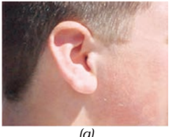
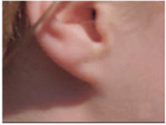
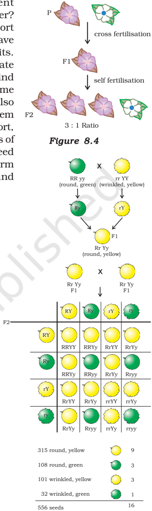
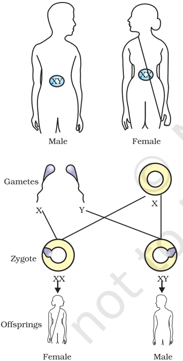

# PAGE 1

W e have seen that reproductive processes give rise to new individuals that are similar, but subtly different. We have discussed how some amount of variation is produced even during asexual reproduction. And the number of successful variations are maximised by the process of sexual reproduction. If we observe a field of sugarcane we find very little variations among the individual plants. But in a number of animals including  human beings, which reproduce sexually, quite distinct variations are visible among different individuals. In this chapter, we shall be studying the mechanism by which variations are created and inherited.

## 8.1 8.1 A ACCUMUL CCUMULA ATION  OF  V TION  OF  VARIA ARIATION TION DURING  REPRODUCTION DURING  REPRODUCTION

Figure  8.1

Creation  of  diversity  over  succeeding generations. The original organism at the top will give rise to, say, two individuals, similar in body design, but with subtle differences. Each of them, in turn, will give rise to two individuals in the next generation. Each of the four individuals in the bottom row will be different from each other. While some of these differences will be unique, others will be  inherited  from  their  respective  parents, who were different from each other.

128

Inheritance from the previous generation provides both  a  common  basic  body  design,  and  subtle changes in it, for the next generation. Now think about what would happen when this new generation, in its turn, reproduces. The second generation will have differences  that  they  inherit  from  the  first generation,  as  well  as  newly  created  differences (Fig. 8.1).

Figure 8.1 would represent the situation if a single individual reproduces, as happens in asexual reproduction. If one bacterium divides, and then the resultant  two  bacteria  divide  again,  the  four individual bacteria generated would be very similar. There would be only very minor differences between them, generated due to small inaccuracies in DNA copying. However, if sexual reproduction is involved, even greater diversity will be generated, as we will see when we discuss the rules of inheritance.

Do all these variations in a species have equal chances of surviving in the environment in which they find themselves? Obviously not. Depending on the nature of variations, different individuals would have

Science

# PAGE 2

different kinds of advantages. Bacteria that can withstand heat will survive better in a heat wave, as we have discussed earlier. Selection of variants by environmental factors forms the basis for evolutionary processes, as we will discuss in later sections.

## Q U E S T I O N S

1. If  a  trait  A  exists  in  10%  of  a  population  of  an  asexually  reproducing species and a trait B exists in 60% of the same population, which trait is  likely  to  have  arisen  earlier?
2. How does the creation of variations in a species promote survival?

## 8.2  HEREDITY 8.2  HEREDITY

The most obvious outcome of the reproductive process still remains the generation of individuals of similar design. The rules of heredity determine the process by which traits and characteristics are reliably inherited. Let us take a closer look at these rules.

## 8.2.1 Inherited Traits

What exactly do we mean by similarities and differences? We know that a child bears all the basic features of a human being. However, it does not look exactly like its parents, and human populations show a great deal of variation.

## Activity  8.1 Activity  8.1

- /square6 Observe the ears of all the students in the class. Prepare a list of students  having  free  or  attached  earlobes  and  calculate  the percentage of students having each (Fig. 8.2). Find out about the earlobes of the parents of each student in the class. Correlate the earlobe type of each student with that of their parents. Based on this evidence, suggest a possible rule for the inheritance of earlobe types.

## 8.2.2 Rules for the Inheritance of Traits --Mendel's Contributions

The rules for inheritance of such traits in human beings are related to the fact that both the father and the mother contribute practically equal amounts of genetic material to the child. This means that each trait can be influenced by both paternal and maternal DNA. Thus, for each trait there will be two versions in each child. What will, then, the trait seen in the child be? Mendel (see box) worked out the main rules of such inheritance, and it is interesting to look at some of his experiments from more than a century ago.

?

(a)

(b)

Figure  8.2 (a) Free and (b) attached earlobes. The lowest part of  the  ear,  called  the earlobe, is closely attached to the side of the head in some  of  us,  and  not i n  others.  Free  and attached earlobes are two variants found in human populations.

# PAGE 3

## Gregor Johann Mendel (1822-1884)

Mendel was educated in a monastery and went on to study science and mathematics at the University of Vienna. Failure in the examinations for a teaching certificate did not suppress his zeal for scientific quest. He went back to his monastery and started growing peas. Many others had studied the inheritance of traits in peas and other organisms earlier, but Mendel blended his knowledge of science and mathematics and was the first one to keep count of individuals exhibiting a particular trait in each generation. This helped him to arrive at the laws of inheritance.

Mendel used a number of contrasting visible characters of garden peas - round/wrinkled seeds, tall/short plants, white/violet flowers and so on.  He took pea plants with different characteristics - a tall plant and a short plant, produced progeny by crossing them, and calculated the percentages of tall or short progeny.

In the first place, there were no halfway characteristics in this firstgeneration, or F1 progeny - no 'medium-height' plants. All plants were

Figure  8.3 Inheritance of traits over two generations

tall. This meant that only one of the parental traits was seen, not some mixture of the two. So the next question  was,  were  the  tall  plants  in  the  F1 generation exactly the same as the tall plants of the parent generation? Mendelian experiments test this by getting both the parental plants and these F1 tall plants to reproduce by self-pollination. The progeny of the parental plants are, of course, all tall. However, the second-generation, or F2, progeny of the F1 tall plants are not all tall. Instead, one quarter of them are short. This indicates that both the tallness and shortness traits were inherited in the F1 plants, but only the tallness trait was expressed. This led Mendel to propose that two copies of factor (now called genes) controlling traits are present in sexually reproducing organism. These two may be identical, or may be different, depending on the parentage. A pattern of inheritance can be worked out with this assumption, as shown in Fig. 8.3.

## Activity  8.2 Activity  8.2

- /square6 In Fig. 8.3, what experiment would we do to confirm that the F2 generation  did  in  fact  have  a  1:2:1  ratio  of  TT,  Tt  and  tt  trait combinations?

In this explanation, both TT and Tt are tall plants, while only tt is a short plant. In other words, a single copy of 'T' is enough to make the plant tall, while both copies have to be 't' for the plant to be short. Traits like 'T' are called dominant traits, while those that behave like 't' are called  recessive  traits.  Work  out  which  trait  would  be  considered dominant and which one recessive in Fig. 8.4.

# PAGE 4

What happens when pea plants  showing  two  different characteristics, rather than just one, are bred with each other? What do the progeny of a tall plant with round seeds and a short plant with wrinkled-seeds look like? They are all tall and have round seeds. Tallness and round seeds are thus dominant traits. But what happens when these F1 progeny are used to generate F2 progeny by self-pollination? A Mendelian experiment will find that some F2 progeny are tall plants with round seeds, and some were short plants with wrinkled seeds.  However, there would also be some F2 progeny that showed new combinations. Some of them would be tall, but have wrinkled seeds, while others would be short, but have round seeds. You can see as to how new combinations of traits are formed in F2 offspring when factors controlling for seed shape and seed colour recombine to form zygote leading to form F2 offspring (Fig. 8.5). Thus, the tall/short trait and the round seed/wrinkled seed trait are independently inherited.

## 8.2.3 How do these Traits get Expressed?

How does the mechanism of heredity work? Cellular DNA is the information source for making proteins in the cell. A section of DNA that provides information for one protein is called the gene  for  that  protein.  How  do  proteins  control  the characteristics that we are discussing here? Let us take the example of tallness as a characteristic. We know that plants have hormones that can trigger growth. Plant height can thus depend on the amount of a particular plant hormone. The amount of the plant hormone made will depend on the efficiency of the process for making it. Consider now an enzyme that  is  important  for  this  process.  If  this  enzyme  works efficiently, a lot of hormone will be made, and the plant will be tall. If the gene for that enzyme has an alteration that makes the enzyme less efficient, the amount of hormone will be less, and the plant will be short. Thus, genes control characteristics, or traits.

If  the  interpretations of Mendelian experiments we have been discussing are correct, then both parents must be contributing equally to the DNA of the progeny during sexual reproduction. We have disscussed this issue in the previous Chapter. If both parents can help determine the trait in the progeny, both parents must be contributing a copy of the same gene. This means that each pea plant must have two sets of all genes, one inherited from each parent. For this mechanism to work, each germ cell must have only one gene set.

Figure 9.5 Independent inheritance of two

separate traits, shape and colour of seeds Figure  8.5 Independent inheritance of  two  separate  traits, shape and colour of seeds

How do germ-cells make a single set of genes from the normal two copies that all other cells in the body have? If progeny plants inherited a single whole gene set from each parent, then the experiment explained in Fig. 8.5 cannot work. This is because the two characteristics 'R' and 'y' would then be linked to each other and cannot be independently

# PAGE 5

inherited. This is explained by the fact that each gene set is present, not as a single long thread of DNA, but as separate independent pieces, each called a chromosome. Thus, each cell will have two copies of each chromosome, one each from the male and female parents. Every germcell will take one chromosome from each pair and these may be of either maternal or paternal origin. When two germ cells combine, they will restore the normal number of chromosomes in the progeny, ensuring the stability of the DNA of the species. Such a mechanism of inheritance explains the results of the Mendel experiments, and is used by all sexually reproducing organisms. But asexually reproducing organisms also follow similar rules of inheritance. Can we work out how their inheritance might work?

## 8.2.4 Sex Determination

We have discussed the idea that the two sexes participating in sexual reproduction must be somewhat different from each other for a number

Figure  8.6 Sex  determination  in human beings

of  reasons.  How  is  the  sex  of  a  newborn  individual determined? Different species use very different strategies for this. Some rely entirely on environmental cues. Thus, in some animals like a few reptiles, the temperature at which fertilised eggs are kept determines whether the animals developing in the eggs will be male or female. In other animals, such as snails, individuals can change sex, indicating that sex is not genetically determined. However, in  human beings, the sex of the individual is largely genetically determined. In other words, the genes inherited from our parents decide whether we will be boys or girls. But so far, we have assumed that similar gene sets are inherited from both parents. If that is the case, how can genetic inheritance determine sex?

The  explanation  lies  in  the  fact  that  all  human chromosomes are not paired. Most human chromosomes have a maternal and a paternal copy, and we have 22 such pairs. But one pair, called the sex chromosomes, is odd in not always being a perfect pair. Women have a perfect pair of sex chromosomes, both called X. But men have a mismatched pair in which one is a normal-sized X while the other is a short one called Y. So women are XX, while  men  are  XY.  Now,  can  we  work  out  what  the inheritance pattern of X and Y will be?

As Fig. 8.6 shows, half the children will be boys and half will be girls. All children will inherit an X chromosome from their mother regardless of whether they are boys or girls. Thus, the sex of the children will be determined by what they inherit from their father. A child who inherits an X chromosome from her father will be a girl, and one who inherits a Y chromosome from him will be a boy.

# PAGE 6

## Q U E S T I O N S

1. How do Mendel's experiments show that traits  may  be  dominant  or recessive?
2. How  do  Mendel's  experiments  show  that  traits  are  inherited independently?
3. A  man with blood group A marries a woman with blood group O and their daughter has blood group O. Is this information enough to tell you which of the traits - blood group A or O - is dominant? Why or why not?
4. How is the sex of the child determined in human beings?

## What you have learnt

- /square6 Variations arising during the process of reproduction can be inherited.
- /square6 These variations may lead to increased survival of the individuals.
- /square6 Sexually reproducing individuals have two copies of genes for the same trait. If the copies are not identical, the trait that gets expressed is called the dominant trait and the other is called the recessive trait.
- /square6 Traits in one individual may be inherited separately, giving rise to new combinations of traits in the offspring of sexual reproduction.
- /square6 Sex is determined by different factors in various species. In human beings, the sex of the child depends on whether the paternal chromosome is X (for girls) or Y (for boys).

## E X E R C I S E S

1. A Mendelian experiment consisted of breeding tall pea plants bearing violet flowers with short pea plants bearing white flowers. The progeny all bore violet flowers, but almost half of them were short. This suggests that the genetic make-up of the tall parent can be depicted as
2. (a) TTWW
3. (b) TTww
4. (c) TtWW
5. (d) TtWw
2. A study found that children with light-coloured eyes are likely to have parents with light-coloured eyes. On this basis, can we say anything about whether the light eye colour trait is dominant or recessive? Why or why not?
3. Outline a project which aims to find the dominant coat colour in dogs.
4. How is the equal genetic contribution of male and female parents ensured in the progeny?

?