# PAGE 1

134

W e see a variety of objects in the world around us. However, we are unable to see anything in a dark room. On lighting up the room, things become visible. What makes things visible? During the day, the sunlight helps us to see objects. An object reflects light that falls on it. This reflected light, when received by our eyes, enables us to see things. We are able to see through a transparent medium as light is transmitted through it.  There  are  a  number  of  common  wonderful  phenomena associated with light such as image formation by mirrors, the twinkling of stars, the beautiful colours of a rainbow, bending of light by a medium and so on.  A study of the properties of light helps us to explore them.

By observing the common optical phenomena around us, we may conclude that light seems to travel in straight lines. The fact that a small source of light casts a sharp shadow of an opaque object points to this straight-line path of light, usually indicated as a ray of light.

If an opaque object on the path of light becomes very small , light has a tendency to bend around it and not walk in a straight line - an effect known as the diffraction of light. Then the straight-line treatment of optics using rays fails. To explain phenomena such as diffraction, light is thought of as a wave, the details of which you will study in higher classes. Again, at the beginning of the 20 th  century, it became known that the wave theory of light often becomes inadequate for treatment of the interaction of light with matter, and light often behaves somewhat like a stream of particles . This confusion about the true nature of light continued for some years till a modern quantum theory of light emerged in which light is neither a 'wave' nor a 'particle' the new theory reconciles the particle properties of light with the wave nature.

In this Chapter, we shall study the phenomena of reflection and refraction of light using the straight-line propagation of light. These basic concepts will help us in the study of some of the optical phenomena in nature. We shall try to understand in this Chapter the reflection of light by spherical mirrors and refraction of light and their application in real life situations.

## 9.1  REFLECTION  OF  LIGHT 9.1  REFLECTION  OF  LIGHT

A highly polished surface, such as a mirror, reflects most of the light falling on it. You are already familiar with the laws of reflection of light.

Science

# PAGE 2

Let us recall these laws -

- (i) The angle of incidence is equal to the angle of reflection, and
- (ii) The incident ray, the normal to the mirror at the point of incidence and the reflected ray, all lie in the same plane.

These laws of reflection are applicable to all types of reflecting surfaces including spherical surfaces. You are familiar with the formation of image by a plane mirror. What are the properties of the image? Image formed by a plane mirror is always virtual and erect.  The size of the image is equal to that of the object.  The image formed is as far behind the mirror as the object is in front of it.  Further, the image is laterally inverted. How would the images be when the reflecting surfaces are curved? Let us explore.

## Activity  9.1 Activity  9.1

- /square6 Take a large  shining  spoon.  Try  to  view  your  face  in  its  curved surface.
- /square6 Do you get the image?  Is it smaller or larger?
- /square6 Move the spoon slowly away from your face. Observe the image. How does it change?
- /square6 Reverse the spoon and repeat the Activity.  How does the image look like now?
- /square6 Compare the characteristics of the image on the two surfaces.

The curved surface of a shining spoon could be considered as a curved mirror.  The most commonly used type of curved mirror is the spherical mirror.  The reflecting surface of such mirrors can be considered to form a part of the surface of a sphere.  Such mirrors, whose reflecting surfaces are spherical, are called spherical mirrors.  We shall now study about spherical mirrors in some detail.

## 9.2  SPHERIC 9.2  SPHERICAL  MIRRORS AL  MIRRORS

The reflecting surface of a spherical mirror may be curved inwards or outwards.  A spherical mirror, whose reflecting surface is curved inwards, that is, faces towards the centre of the sphere, is called a concave mirror. A spherical mirror whose reflecting surface is curved outwards, is called a convex mirror. The schematic representation of these mirrors is shown in Fig. 9.1. You may note in these diagrams that the back of the mirror is shaded.

You may now understand that the surface of the spoon curved inwards can be approximated to a concave mirror and the surface of the spoon bulged outwards can be approximated to a convex mirror.

Before we move further on spherical mirrors, we need to recognise and understand the meaning of a few terms. These terms are commonly used in discussions about spherical mirrors. The centre of the reflecting surface of a spherical mirror is a point called the pole.  It lies on the surface of the mirror.  The pole is usually represented by the letter P.

(a) Concave mirror

(b) Convex mirror

Figure  9.1 Schematic representation of spherical mirrors; the shaded side is non-reflecting.

# PAGE 3

The reflecting surface of a spherical mirror forms a part of a sphere. This sphere has a centre. This point is called the centre of curvature of the spherical mirror. It is represented by the letter C. Please note that the centre of curvature is not a part of the mirror. It lies outside its reflecting surface. The centre of curvature of a concave mirror lies in front of it. However, it lies behind the mirror in case of a convex mirror. You may note this in Fig.9.2 (a) and (b). The radius of the sphere of which the reflecting surface of a spherical mirror forms a part, is called the radius of curvature of the mirror. It is represented by the letter R . You may note that the distance PC is equal to the radius of curvature. Imagine a straight line passing through the pole and the centre of curvature of a spherical mirror. This line is called the principal axis. Remember that principal axis is normal to the mirror at its pole. Let us understand an important term related to mirrors, through an Activity.

## Activity  9.2 Activity  9.2

CAUTION: Do not look at the Sun directly or even into a mirror reflecting sunlight. It may damage your eyes.

- /square6 Hold a concave mirror in your hand and direct its reflecting surface towards the Sun.
- /square6 Direct the light reflected by the mirror on to a sheet of paper held close to the mirror.
- /square6 Move the sheet of paper back and forth gradually until you find on the paper sheet a bright, sharp spot of light.
- /square6 Hold  the  mirror  and  the  paper  in  the  same  position  for  a  few minutes. What do you observe? Why?

The paper at first begins to burn producing smoke. Eventually it may even catch fire. Why does it burn? The light from the Sun is converged at a point, as a sharp, bright spot by the mirror. In fact, this spot of light

Figure  9.2 (a) Concave mirror (b) Convex mirror

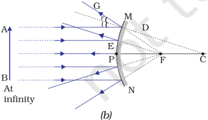

is the image of the Sun on the sheet of paper. This point is the focus of the concave mirror. The heat produced due to the concentration of sunlight ignites the paper. The distance of this image from the position of the mirror gives the approximate value of focal length of the mirror.

Let us try to understand this observation with the help of a ray diagram.

Observe Fig.9.2 (a) closely. A number of rays parallel to the principal axis are falling on a concave mirror. Observe the reflected rays. They are all meeting/intersecting at a point on the principal axis of the mirror.  This point is called the principal focus of the concave mirror. Similarly, observe Fig. 9.2 (b). How are the rays parallel to the principal axis, reflected by a convex mirror? The reflected rays appear to come from a point on the principal axis. This point is called the principal focus of the convex mirror. The principal focus is represented by the letter F. The distance between the pole and the principal focus of a spherical mirror is called the focal length. It is represented by the letter f .

# PAGE 4

The reflecting surface of a spherical mirror is by-and-large spherical. The surface, then, has a circular outline. The diameter of the reflecting surface of spherical mirror is called its aperture. In Fig.9.2, distance MN represents the aperture. We shall consider in our discussion only such spherical mirrors whose aperture is much smaller than its radius of curvature.

Is there a relationship between the radius of curvature R, and focal length f, of a spherical mirror? For spherical mirrors of small apertures, the radius of curvature is found to be equal to twice the focal length. We put this as R = 2f .  This implies that the principal focus of a spherical mirror lies midway between the pole and centre of curvature.

## 9.2.1  Image Formation by Spherical Mirrors

You have studied about the image formation by plane mirrors. You also know the nature, position and relative size of the images formed by them. How about the images formed by spherical mirrors? How can we locate the image formed by a concave mirror for different positions of the object? Are the images real or virtual? Are they enlarged, diminished or have the same size? We shall explore this with an Activity.

## Activity  9.3 Activity  9.3

You have already learnt a way of determining the focal length of a concave mirror. In Activity 9.2, you have seen that the sharp bright spot of light you got on the paper is, in fact, the image of the Sun. It was a tiny, real, inverted image. You got the approximate focal length of  the  concave mirror by measuring the distance of the image from the  mirror.

- /square6 Take a concave mirror.  Find out its approximate focal length in the way described above. Note down the value of focal length. (You can also find  it  out  by  obtaining  image  of  a  distant  object  on  a sheet of paper.)
- /square6 Mark a line on a Table with a chalk.  Place the concave mirror on a stand.  Place the stand over the line such that its pole lies over the  line.
- /square6 Draw with a chalk two more lines parallel to  the  previous  line such that the distance between any two successive lines is equal to the focal length of the mirror. These lines will now correspond to the positions of the points P, F and C, respectively. Remember -For a spherical mirror of small aperture, the principal focus F lies mid-way between the pole P and the centre of curvature C .
- /square6 Keep a bright object, say a burning candle, at a position far beyond C.  Place a paper screen and move it in front of the mirror till you obtain a sharp bright image of the candle flame on it.
- /square6 Observe the image carefully.  Note down its nature, position and relative size with respect to the object size.
- /square6 Repeat  the  activity  by  placing  the  candle  -  (a)  just  beyond  C, (b) at C, (c) between F and C, (d) at F, and (e) between P and F.
- /square6 In  one  of  the  cases,  you  may  not  get  the  image  on  the  screen. Identify the position of the object in such a case. Then, look for its virtual image in the mirror itself.
- /square6 Note down and tabulate your observations.

# PAGE 5

You will see in the above Activity that the nature, position and size of the image formed by a concave mirror depends on the position of the object in relation to points P, F and C. The image formed is real for some positions of the object. It is found to be a virtual image for a certain other position. The image is either magnified, reduced or has the same size, depending on the position of the object. A summary of these observations is given for your reference in Table 9.1.

Table 9.1 Image formation by a concave mirror for different positions of the object

| Position of the object   | Position of the image   | Size of the image              | Nature of the image       |
|--------------------------|-------------------------|--------------------------------|---------------------------|
| At infinity              | At the focus F          | Highly diminished, point-sized | Real and inverted         |
| Beyond C                 | Between F and C         | Diminished                     | Real and inverted         |
| At C                     | At C                    | Same size                      | Real and inverted         |
| Between C and F          | Beyond C                | Enlarged                       | Real and inverted         |
| At F                     | At infinity             | Image would not be formed      | Image would not be formed |
| Between P and F          | Behind the mirror       | Enlarged                       | Virtual and erect         |

## 9.2.2 Representation  of  Images  Formed  by  Spherical Mirrors Using Ray Diagrams

We can also study the formation of images by spherical mirrors by drawing ray diagrams. Consider an extended object, of finite size, placed in front of a spherical mirror. Each small portion of the extended object acts like a point source. An infinite number of rays originate from each of these points. To construct the ray diagrams, in order to locate the image of an object, an arbitrarily large number of rays emanating from a point could be considered.  However, it is more convenient to consider only two rays, for the sake of clarity of the ray diagram. These rays are so chosen that it is easy to know their directions after reflection from the mirror.

The intersection of at least two reflected rays give the position of image of the point object.  Any two of the following rays can be considered for locating the image.

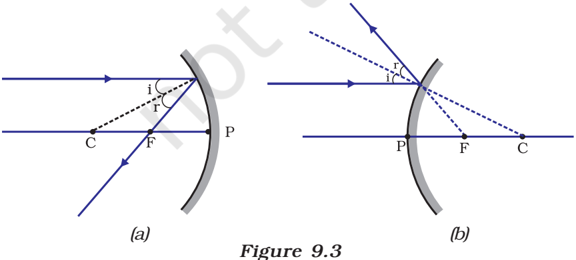

- (i) A ray parallel to the principal axis ,  after  reflection, will pass through the principal focus in case of a concave mirror or  appear  to  diverge  from the  principal  focus  in case  of  a  convex  mirror. This is illustrated in Fig.9.3 (a) and (b).

# PAGE 6

- (ii) A ray passing through the principal focus of a concave mirror  or a  ray  which  is directed towards the principal focus of a convex mirror, after reflection, will emerge  parallel  to  the principal  axis.  This  is illustrated  in  Fig.9.4  (a) and (b).
- (iii) A ray passing through the centre  of  curvature of  a concave mirror or directed in the direction of the centre of  curvature  of  a  convex mirror,  after  reflection,  is reflected  back  along  the same path. This is illustrated in Fig.9.5 (a) and (b). The light rays come back along the same path because the incident rays fall on the mirror along the normal  to  the  reflecting surface.
- (iv) A ray incident obliquely to the principal axis , towards a point P (pole of the mirror), on  the  concave  mirror [Fig.  9.6  (a)]  or  a  convex mirror  [Fig.  9.6  (b)],  is reflected  obliquely.  The incident and reflected rays follow the laws of reflection at  the  point  of  incidence (point  P),  making  equal angles with the principal axis.

Figure  9.4

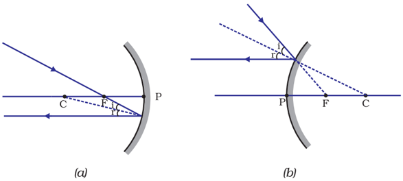

Figure  9.6

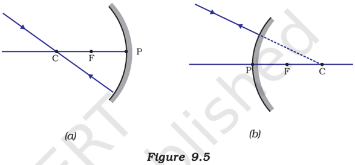

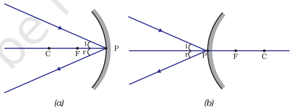

Remember that in all the above cases the laws of reflection are followed. At the point of incidence, the incident ray is reflected in such a way that the angle of reflection equals the angle of incidence.

## (a) Image formation by Concave Mirror

Figure 9.7 illustrates the ray diagrams for the formation of image by a concave mirror for various positions of the object.

# PAGE 7

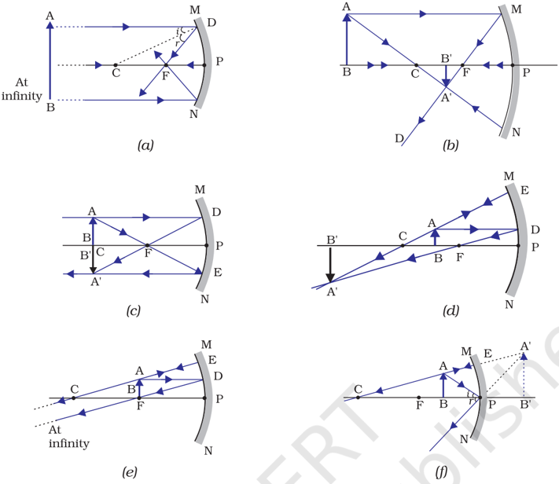

Figure 9.7 Ray diagrams for the image formation by a concave mirror

## Uses of concave mirrors

Concave mirrors are commonly used in torches, search-lights and vehicles headlights to get powerful parallel beams of light. They are often used as shaving mirrors to see a larger image of the face. The dentists use concave mirrors to see large images of the teeth of patients. Large concave mirrors are used to concentrate sunlight to produce heat in solar furnaces.

## (b) Image formation by a Convex Mirror

We studied the image formation by a concave mirror. Now we shall study the formation of image by a convex mirror.

# PAGE 8

## Activity  9.5 Activity  9.5

- /square6 Take a convex mirror.  Hold it in one hand.
- /square6 Hold a pencil in the upright position in the other hand.
- /square6 Observe the image of the pencil in the mirror. Is the image erect or inverted?  Is it diminished or enlarged?
- /square6 Move the pencil  away  from  the  mirror  slowly.  Does  the  image become smaller or larger?
- /square6 Repeat this Activity carefully.  State whether the image will move closer  to  or  farther  away  from  the  focus  as  the  object  is  moved away from the mirror?

We consider two positions of the object for studying the image formed by a convex mirror.  First is when the object is at infinity and the second position is when the object is at a finite distance from the mirror. The ray diagrams for the formation of image by a convex mirror for these two positions of the object are shown in Fig.9.8 (a) and (b), respectively.  The results are summarised in Table 9.2.

Figure 9.8 Formation of image by a convex mirror

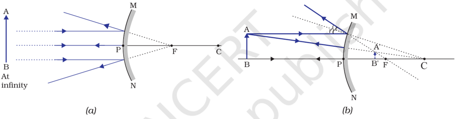

Table 9.2 Nature, position and relative size of the image formed by a convex mirror

| Position of the object                        | Position of the image              | Size of the image              | Nature of the image   |
|-----------------------------------------------|------------------------------------|--------------------------------|-----------------------|
| At infinity                                   | At the focus F, behind the mirror  | Highly diminished, point-sized | Virtual and erect     |
| Between infinity and the pole P of the mirror | Between P and F, behind the mirror | Diminished                     | Virtual and erect     |

You have so far studied the image formation by a plane mirror, a concave mirror and a convex mirror.  Which of these mirrors will give the full image of a large object? Let us explore through an Activity.

## Activity  9.6 Activity  9.6

- /square6 Observe the  image  of  a  distant  object,  say  a  distant  tree,  in  a plane  mirror.
- /square6 Could you see a full-length image?

# PAGE 9

- /square6 Try  with  plane  mirrors  of  different  sizes.  Did  you  see  the  entire object in the image?
- /square6 Repeat this Activity with a concave mirror.  Did the mirror show full length image of the object?
- /square6 Now try using a convex mirror. Did you succeed? Explain your observations  with  reason.

You can see a full-length image of a tall building/tree in a small convex mirror. One such mirror is fitted in a wall of Agra Fort facing Taj Mahal. If you visit the Agra Fort, try to observe the full image of Taj Mahal. To view distinctly, you should stand suitably at the terrace adjoining the wall.

## Uses of convex mirrors

Convex mirrors are commonly used as rear-view (wing) mirrors in vehicles. These mirrors are fitted on the sides of the vehicle, enabling the driver to see traffic behind him/her to facilitate safe driving. Convex mirrors  are  preferred  because  they  always  give  an  erect,  though diminished, image. Also, they have a wider field of view as they are curved outwards. Thus, convex mirrors enable the driver to view much larger area than would be possible with a plane mirror.

## Q U E S T I O N S

1. Define the principal focus of a concave mirror.
2. The radius of curvature of a spherical mirror is 20 cm.  What is its focal length?
3. Name a mirror that can give an erect and enlarged image of an object.
4. Why do we prefer a convex mirror as a rear-view mirror in vehicles?

?

## 9.2.3 Sign Convention for Reflection by Spherical Mirrors

While dealing with the reflection of light by spherical mirrors, we shall follow  a  set  of  sign  conventions  called  the New Cartesian  Sign Convention . In this convention, the pole (P) of the mirror is taken as the origin (Fig. 9.9).  The principal axis of the mirror is taken as the x-axis (X'X) of the coordinate system. The conventions are as follows -

- (i) The object is always placed to the left of the mirror. This implies that the light from the object falls on the mirror from the left-hand side.
- (ii) All distances parallel to the principal axis are measured from the pole of the mirror.
- (iii) All  the  distances  measured  to  the  right  of  the  origin  (along + x-axis) are taken as positive while those measured to the left of the origin (along - x-axis) are taken as negative.
- (iv) Distances measured perpendicular to and above the principal axis (along + y-axis) are taken as positive.
- (v) Distances measured perpendicular to and below the principal axis (along -y-axis) are taken as negative.

# PAGE 10

The New Cartesian Sign Convention described above is illustrated in Fig.9.9 for your reference. These sign conventions are applied to obtain the mirror formula and solve related numerical problems.

## 9.2.4  Mirror Formula and  Magnification

In a spherical mirror, the distance of the object  from  its  pole  is  called  the  object distance ( u ).    The distance of the image from the pole of the mirror is called the image distance ( v ).  You  already  know  that  the distance of the principal focus from the pole is  called  the  focal  length  ( f) .  There  is  a relationship between these three quantities given  by  the mirror  formula which  is expressed as

<!-- formula-not-decoded -->

This formula is valid in all situations for all spherical mirrors for all positions of the object. You must use the New Cartesian Sign Convention while substituting numerical values for u, v, f ,  and R in the mirror formula for solving problems.

## Magnification

Magnification produced by a spherical mirror gives the relative extent to which the image of an object is magnified with respect to the object size. It is expressed as the ratio of the height of the image to the height of the object. It is usually represented by the letter m .

If h is the height of the object and h ′ is the height of the image, then the magnification m produced by a spherical mirror is given by

<!-- formula-not-decoded -->

The magnification m is also related to the object distance ( u ) and image distance ( v ).  It can be expressed as:

<!-- formula-not-decoded -->

You may note that the height of the object is taken to be positive as the object is usually placed above the principal axis.  The height of the image should be taken as positive for virtual images.  However, it is to be taken as negative for real images. A negative sign in the value of the magnification indicates that the image is real. A positive sign in the value of the magnification indicates that the image is virtual.

Figure  9.9 The New Cartesian Sign Convention for spherical mirrors

# PAGE 11

## Example 9.1

A convex mirror used for rear-view on an automobile has a radius of curvature of 3.00 m. If a bus is located at 5.00 m from this mirror, find the position, nature and size of the image.

## Solution

Radius of curvature, R = + 3.00 m;

Object-distance,

u = - 5.00 m;

Image-distance,

$$v = ?$$

Height of the image, h ′ = ?

<!-- formula-not-decoded -->

a convex mirror is behind the mirror)

<!-- formula-not-decoded -->

<!-- formula-not-decoded -->

The image is 1.15 m at the back of the mirror.

<!-- formula-not-decoded -->

<!-- formula-not-decoded -->

The image is virtual, erect and smaller in size by a factor of 0.23.

## Example 9.2

An object, 4.0 cm in size, is placed at 25.0 cm in front of a concave mirror of focal length 15.0 cm. At what distance from the mirror should a screen be placed in order to obtain a sharp image? Find the nature and the size of the image.

## Solution

Object-size, h =  + 4.0 cm;

Object-distance, u = - 25.0 cm;

Focal length, f = -15.0 cm;

Image-distance, v = ?

Image-size, h ′ = ?

From Eq. (10.1):

<!-- formula-not-decoded -->

<!-- formula-not-decoded -->

Science

# PAGE 12

<!-- formula-not-decoded -->

The screen should be placed at 37.5 cm in front of the mirror. The image is real.

<!-- formula-not-decoded -->

<!-- formula-not-decoded -->

Height of the image, h ′ = - 6.0 cm The image is inverted and enlarged.

## Q U E S T I O N S

1. Find the focal length of a convex mirror whose radius of curvature is 32 cm.
2. A concave mirror produces three times magnified (enlarged) real image of an object placed at 10 cm in front of it. Where is the image located?

## 9.3  REFRACTION  OF  LIGHT 9.3  REFRACTION  OF  LIGHT

Light seems to travel along straight-line paths in a transparent medium. What happens when light enters from one transparent medium to another? Does it still move along a straight-line path or change its direction? We shall recall some of our day-to-day experiences.

You might have observed that the bottom of a tank or a pond containing water appears to be raised. Similarly, when a thick glass slab is placed over some printed matter, the letters appear raised when viewed through the glass slab. Why does it happen? Have you seen a pencil partly immersed in water in a glass tumbler? It appears to be displaced at the interface of air and water. You might have observed that a lemon kept in water in a glass tumbler appears to be bigger than its actual size,  when  viewed  from  the  sides.  How  can  you  account  for  such experiences?

Let us consider the case of the apparent displacement of a pencil, partly immersed in water. The light reaching you from the portion of the pencil inside water seems to come from a different direction, compared to the part above water. This makes the pencil appear to be displaced at the interface. For similar reasons, the letters appear to be raised, when seen through a glass slab placed over it.

Does a pencil appear to be displaced to the same extent, if instead of water, we use liquids like kerosene or turpentine? Will the letters appear to rise to the same height if we replace a glass slab with a transparent plastic slab? You will find that the extent of the effect is different for different pair of media. These observations indicate that light does not

?

# PAGE 13

travel in the same direction in all media. It appears that when travelling obliquely from one medium to another, the direction of propagation of light in the second medium changes. This phenomenon is known as refraction of light. Let us understand this phenomenon further by doing a few activities.

## Activity  9.7 Activity  9.7

- /square6 Place a coin at the bottom of a bucket filled with water.
- /square6 With your eye to a side above water, try to pick up the coin in one go. Did you succeed in picking up the coin?
- /square6 Repeat the Activity. Why did you not succeed in doing it in one go?
- /square6 Ask your friends to do this.  Compare your experience with theirs.

## Activity  9.8 Activity  9.8

- /square6 Place a large shallow bowl on a Table and put a coin in it.
- /square6 Move  away  slowly  from  the  bowl.    Stop  when  the  coin  just disappears from your sight.
- /square6 Ask a friend to pour water gently into the bowl without disturbing the  coin.
- /square6 Keep looking for the coin from your position. Does the coin becomes visible again from your position?  How could this happen?

The coin becomes visible again on pouring water into the bowl. The coin appears slightly raised above its actual position due to refraction of light.

## Activity  9.9 Activity  9.9

- /square6 Draw a thick straight line in ink, over a sheet of white paper placed on a Table.
- /square6 Place a glass slab over the line in such a way that one of its edges makes an angle with the line.
- /square6 Look at the portion of the line under the slab from the sides. What do you observe? Does the line under the glass slab appear to be bent at the edges?
- /square6 Next, place the glass slab such that it is normal to the line. What do you observe now? Does the part of the line under the glass slab appear bent?
- /square6 Look at the line from the top of the glass slab. Does the part of the line, beneath the slab, appear to be raised? Why does this happen?

## 9.3.1 Refraction through a Rectangular Glass Slab

To understand the phenomenon of refraction of light through a glass slab, let us do an Activity.

# PAGE 14

## Activity  9.10 Activity  9.10

- /square6 Fix a sheet of white paper on a drawing board using drawing pins.
- /square6 Place a rectangular glass slab over the sheet in the middle.
- /square6 Draw the outline of the slab with a pencil. Let us name the outline as  ABCD.
- /square6 Take four identical  pins.
- /square6 Fix two pins, say E and F, vertically such that the line joining the pins is inclined to the edge AB.
- /square6 Look for the images of the pins E and F through the opposite edge. Fix  two  other  pins,  say  G  and  H,  such  that  these  pins  and  the images of E and F lie on a straight line.
- /square6 Remove the pins and the slab.
- /square6 Join the positions of tip of the pins E and F and produce the line up to AB. Let EF meet AB at O.  Similarly, join the positions of tip of  the  pins  G  and H and produce it up to the edge CD.  Let HG meet CD at O ′ .
- /square6 Join O and O ′ .  Also produce EF up to P, as shown by a dotted line in Fig. 9.10.

In this Activity, you will note, the light ray has changed its direction at points O and O ′ . Note that both the points O and O ′ lie on surfaces separating two transparent media. Draw a perpendicular NN' to AB at O and another perpendicular MM ′ to CD at O ′ . The light ray at point O has entered from a rarer medium to a denser medium, that is, from air to glass. Note that the light ray has bent towards the normal. At O ′ , the light ray has entered from glass  to  air,  that  is,  from  a  denser medium to a rarer medium.  The light here has bent away from the normal. Compare the angle of incidence with the angle of refraction at both refracting surfaces AB and CD.

In  Fig.  9.10,  a  ray  EO  is  obliquely incident on surface AB, called incident ray. OO ′ is  the  refracted  ray  and  O ′ H  is  the emergent ray. You may observe that the emergent ray is parallel to the direction of the incident ray. Why does it happen so? The extent of bending of the ray of light at the opposite parallel faces AB (air-glass interface) and CD (glass-air interface) of the rectangular glass slab is equal and opposite. This is why the ray emerges parallel to the incident ray. However, the light ray is shifted sideward slightly. What happens when a light ray is incident  normally  to  the  interface  of  two media? Try and find out.

Figure  9.10 Refraction of light through a rectangular glass slab

Now you are familiar with the refraction of light. Refraction is due to change in the speed of light as it enters from one transparent medium to another.  Experiments show that refraction of light occurs according to certain laws.

# PAGE 15

The following are the laws of refraction of light.

- (i) The incident ray, the refracted ray and the normal to the interface of two transparent media at the point of incidence, all lie in the same plane.
- (ii) The ratio of sine of angle of incidence to the sine of angle of refraction is a constant, for the light of a given colour and for the given pair of media. This law is also known as Snell's law of refraction. (This is true for angle 0 &lt; i &lt; 90 o )

If i is the angle of incidence and r is the angle of refraction, then,

<!-- formula-not-decoded -->

This constant value is called the refractive index of the second medium with respect to the first.  Let us study about refractive index in some detail.

## 9.3.2 The Refractive Index

You have already studied that a ray of light that travels obliquely from one transparent medium into another will change its direction in the second medium. The extent of the change in direction that takes place in a given pair of media may be expressed in terms of the refractive index, the 'constant' appearing on the right-hand side of Eq.(9.4).

The refractive index can be linked to an important physical quantity, the relative speed of propagation of light in different media. It turns out that light propagates with different speeds in different media. Light travels fastest in vacuum with speed of 3×10 8  m s -1 .  In air, the speed of light is only marginally less, compared to that in vacuum. It reduces considerably in glass or water. The value of the refractive index for a given pair of media depends upon the speed of light in the two media, as given below.

Consider a ray of light travelling from medium 1 into medium 2, as shown in Fig.9.11.  Let v 1 be the speed of light in medium 1 and v 2 be the speed of light in medium 2.  The refractive index of medium 2 with respect to medium 1 is given by the ratio of the speed of light in medium 1 and the speed of light in medium 2. This is usually represented by the symbol n 21 . This can be expressed in an equation form as

<!-- formula-not-decoded -->

By the same argument, the refractive index of medium 1 with respect to medium 2 is represented as n 12 . It is given by

<!-- formula-not-decoded -->

If medium 1 is vacuum or air, then the refractive index of medium 2 is considered with respect to vacuum.  This is called the absolute refractive index of the medium.  It is simply represented as n 2 . If c is the speed of

Figure  9.11

# PAGE 16

light in air and v is the speed of light in the medium, then, the refractive index of the medium n m is given by

<!-- formula-not-decoded -->

The absolute refractive index of a medium is simply called its refractive index. The refractive index of several media is given in Table 9.3. From the Table you can know that the refractive index of water, n w = 1.33. This means that the ratio of the speed of light in air and the speed of light in water is equal to 1.33.  Similarly, the refractive index of crown glass, n g =1.52. Such data are helpful in many places.  However, you need not memorise the data.

Table 9.3 Absolute refractive index of some material media

| Material medium   | Refractive index   | Material medium   | Refractive index   |
|-------------------|--------------------|-------------------|--------------------|
| Air               | 1.0003             | Canada Balsam     | 1.53               |
| Ice               | 1.31               |                   |                    |
| Water             | 1.33               | Rock salt         | 1.54               |
| Alcohol           | 1.36               |                   |                    |
| Kerosene          | 1.44               | Carbon disulphide | 1.63               |
| Fused quartz      | 1.46               | Dense             | 1.65               |
| Turpentine oil    | 1.47               | Ruby              | 1.71               |
| Benzene           | 1.50               |                   |                    |
|                   |                    | Sapphire          | 1.77               |
| Crown             |                    |                   |                    |
| glass             | 1.52               |                   |                    |
|                   |                    | Diamond           | 2.42               |

Note from Table 9.3 that an optically denser medium may not possess greater mass density. For example, kerosene having higher refractive index, is optically denser than water, although its mass density is less than water.

The ability of a medium to refract light is also expressed in terms of its optical density. Optical density has a definite connotation.  It is not the same as mass density. We have been using the terms 'rarer medium' and 'denser medium' in this Chapter. It actually means  'optically rarer medium' and 'optically denser medium', respectively. When can we say that a medium is optically denser than the other? In comparing two media, the one with the larger refractive index is optically denser medium than the other.  The other medium of lower refractive index is optically rarer.  The speed of light is higher in a rarer medium than a denser medium. Thus, a ray of light travelling from a rarer medium to a denser medium slows down and bends  towards the normal. When it travels from a denser medium to a rarer medium, it speeds up and bends away from the normal.

# PAGE 17

## Q U E S T I O N S

1. A ray of light travelling in air enters obliquely into water. Does the light ray bend towards the normal or away from the normal? Why?
2. Light enters from air to glass having refractive index 1.50. What is the speed of light in the glass? The speed of light in vacuum is 3 × 10 8  m s -1 .
3. Find out,  from  Table  9.3,  the  medium  having  highest  optical  density. Also find the medium with lowest optical density.
4. You are given kerosene, turpentine and water. In which of these does the light travel fastest? Use the information given in Table 9.3.
5. The refractive  index  of  diamond  is  2.42.  What  is  the  meaning  of  this statement?

## 9.3.3 Refraction by Spherical Lenses

You might have seen watchmakers using a small magnifying glass to see tiny parts. Have you ever touched the surface of a magnifying glass with your hand? Is it plane surface or curved? Is it thicker in the middle or at the edges? The glasses used in spectacles and that by a watchmaker are examples of lenses. What is a lens? How does it bend light rays? We shall discuss these in this section.

A transparent material bound by two surfaces, of which one or both

Figure  9.12 (a) Converging action of a convex lens, (b) diverging action of a concave lens

surfaces are spherical, forms a lens. This means that a lens is bound by at least one spherical surface. In such lenses, the other surface would be  plane.    A  lens  may  have  two  spherical surfaces, bulging outwards. Such a lens is called a double convex lens. It is simply called a convex lens. It is thicker at the middle as compared to the edges. Convex lens converges light rays as shown in Fig. 9.12 (a). Hence convex lenses are also called converging lenses.  Similarly, a double concave  lens  is  bounded  by  two  spherical surfaces, curved inwards.  It is thicker at the edges than at the middle. Such lenses diverge light rays as shown in Fig. 9.12 (b). Such lenses are also called diverging lenses. A double concave lens is simply called a concave lens.

A lens, either a convex lens or a concave lens, has two spherical surfaces. Each of these surfaces forms a part of a sphere. The centres of these spheres are called centres of curvature of the lens. The centre of  curvature  of  a  lens  is  usually represented by the letter C.  Since there are two centres of curvature, we may represent them as C 1 and C 2 . An imaginary straight line passing through the two centres of curvature of a lens is called its principal axis. The central point of a lens is its optical centre. It is

?

# PAGE 18

usually represented by the letter O. A ray of light through the optical centre of a lens passes without suffering any deviation. The effective diameter of the circular outline of a spherical lens is called its aperture. We shall confine our discussion in this Chapter to such lenses whose aperture is much less than its radius of curvature and the two centres of curvatures are equidistant from the optical centre O. Such lenses are called thin lenses with small apertures. What happens when parallel rays of light are incident on a lens?  Let us do an Activity to understand this.

## Activity  9.11 Activity  9.11

CAUTION : Do not look at the Sun directly or through a lens while doing this Activity or otherwise. You may damage your eyes if you do so.

- /square6 Hold a convex lens in your hand. Direct it towards the Sun.
- /square6 Focus the light from the Sun on a sheet of paper. Obtain a sharp bright image of the Sun.
- /square6 Hold the paper and the lens in the same position for a while.  Keep observing the paper. What happened? Why? Recall your experience in Activity 9.2.

The paper begins to burn producing smoke. It may even catch fire after a while.  Why does this happen? The light from the Sun constitutes parallel rays of light.  These rays were converged by the lens at the sharp bright spot formed on the paper.  In fact, the bright spot you got on the paper is a real image of the Sun. The concentration of the sunlight at a point generated heat.  This caused the paper to burn.

Now, we shall consider rays of light parallel to the principal axis of a lens.  What happens when you pass such rays of light through a lens? This is illustrated for a convex lens in Fig.9.12 (a) and for a concave lens in Fig.9.12 (b).

Observe Fig.9.12 (a) carefully. Several rays of light parallel to the principal axis are falling on a convex lens. These rays, after refraction from the lens, are converging to a point on the principal axis. This point on the principal axis is called the principal focus of the lens. Let us see now the action of a concave lens.

Observe Fig.9.12 (b) carefully. Several rays of light parallel to the principal axis are falling on a concave lens. These rays, after refraction from the lens, are appearing to diverge from a point on the principal axis. This point on the principal axis is called the principal focus of the concave lens.

If you pass parallel rays from the opposite surface of the lens, you get another principal focus on the opposite side. Letter F is usually used to represent principal focus. However, a lens has two principal foci.  They are represented by F 1 and F 2 . The distance of the principal focus from the optical centre of a lens is called its focal length. The letter f is  used to represent the focal length. How can you find the focal length of a convex lens? Recall the Activity 9.11. In this Activity, the distance between the position of the lens and the position of the image of the Sun gives the approximate focal length of the lens.

# PAGE 19

## 9.3.4 Image Formation by Lenses

Lenses form images by refracting light. How do lenses form images? What is their nature? Let us study this for a convex lens first.

## Activity  9.12 Activity  9.12

- n Take a convex lens.  Find its approximate focal length in a way described in Activity 9.11.
- n Draw five parallel straight lines, using chalk, on a long Table such that  the  distance  between  the  successive  lines  is  equal  to  the focal length of the lens.
- n Place the lens on a lens stand.  Place it on the central line such that the optical centre of the lens lies just over the line.
- n The two lines on either side of the lens correspond to F and 2F of the lens respectively.  Mark them with appropriate letters such as 2F 1 , F 1 , F 2 and 2F 2 , respectively.
- n Place a burning candle, far beyond 2F 1 to  the left. Obtain a clear sharp image on a screen on the opposite side of the lens.
- n Note down the nature, position and relative size of the image.
- n Repeat this Activity by placing object just behind 2F 1 , between F 1 and 2F 1 at  F 1 ,  between  F 1 and  O.  Note  down  and  tabulate  your observations.

The nature, position and relative size of the image formed by convex lens for various positions of the object is summarised in Table 9.4.

Table  9.4 Nature, position and relative size of the image formed by a convex lens for various positions of the object

| Position of the object                 | Position of the image                      | Relative size of the image     | Nature of the image       |
|----------------------------------------|--------------------------------------------|--------------------------------|---------------------------|
| At infinity                            | At focus F 2                               | Highly diminished, point-sized | Real and inverted         |
| Beyond 2F 1                            | Between F 2 and 2F 2                       | Diminished                     | Real and inverted         |
| At 2F 1                                | At 2F 2                                    | Same size                      | Real and inverted         |
| Between F 1 and 2F 1                   | Beyond 2F 2                                | Enlarged                       | Real and inverted         |
| At focus F 1                           | At infinity                                | Image would not be formed      | Image would not be formed |
| Between focus F 1 and optical centre O | On the same side of the lens as the object | Enlarged                       | Virtual and erect         |

Let us now do an Activity to study the nature, position and relative size of the image formed by a concave lens.

# PAGE 20

## Activity  9.13 Activity  9.13

- n Take a concave lens. Place it on a lens stand.
- n Place a burning candle on one side of the lens.
- n Look through the lens from the other side and observe the image. Try  to  get  the  image  on  a  screen,  if  possible.  If  not,  observe  the image directly  through  the  lens.
- n Note down the nature, relative size and approximate position of the  image.
- n Move the candle away from the lens.  Note the change in the size of  the  image.  What  happens  to  the  size  of  the  image  when  the candle is placed too far away from the lens.

The summary of the above Activity is given in Table 9.5 below.

Table 9.5 Nature, position and relative size of the image formed by a concave lens for various positions of the object

| Position of the object                            | Position of the image                  | Relative size of the image     | Nature of the image   |
|---------------------------------------------------|----------------------------------------|--------------------------------|-----------------------|
| At infinity                                       | At focus F 1                           | Highly diminished, point-sized | Virtual and erect     |
| Between infinity and optical centre O of the lens | Between focus F 1 and optical centre O | Diminished                     | Virtual and erect     |

What conclusion can you draw from this Activity? A concave lens will always give a virtual, erect and diminished image, irrespective of the position of the object.

## 9.3.5 Image Formation in Lenses Using Ray Diagrams

We can represent image formation by lenses using ray diagrams. Ray diagrams will also help us to study the nature, position and relative size of the image formed by lenses. For drawing ray diagrams in lenses, alike of spherical mirrors, we consider any two of the following rays -

- (i) A ray of light from the object, parallel to the principal axis, after refraction from a convex lens, passes through the principal focus on the other side of the lens, as shown in Fig. 9.13 (a). In case of a concave lens,

the ray appears to diverge from the  principal focus  located on  the  same side of the lens, as  shown  in Fig. 9.13 (b).

Figure  9.13

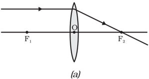

# PAGE 21

Figure  9.14

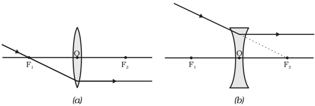

Figure  9.15

- (ii) A  ray  of  light  passing through  a  principal focus,  after  refraction from a convex lens, will emerge parallel  to  the principal  axis.  This  is shown in Fig. 9.14 (a). A ray of light appearing to meet  at  the  principal focus of a concave lens, after  refraction,  will emerge parallel  to  the principal  axis.  This  is shown in Fig.9.14 (b).

(iii)

- A  ray  of  light  passing through  the  optical centre  of  a  lens  will emerge  without  any deviation. This is illustrated in Fig.9.15(a) and Fig.9.15 (b).

The ray diagrams for the image formation in a convex lens for a few positions  of  the  object  are  shown  in  Fig.  9.16.  The  ray  diagrams representing the image formation in a concave lens for various positions of the object are shown in Fig. 9.17.

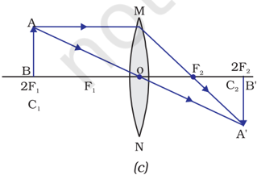

Science

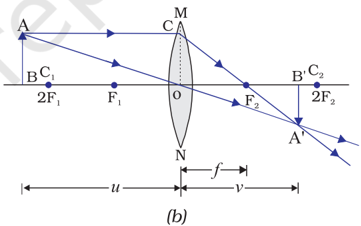

# PAGE 22

Figure 9.16 The position, size and the nature of the image formed by a convex lens for various positions of the object

Figure 9.17 Nature, position and relative size of the image formed by a concave lens

## 9.3.6 Sign Convention for Spherical Lenses

For lenses, we follow sign convention, similar to the one used for spherical mirrors.  We  apply  the  rules  for  signs  of  distances,  except  that  all measurements are taken from the optical centre of the lens. According to the convention, the focal length of a convex lens is positive and that of a concave lens is negative. You must take care to apply appropriate signs for the values of u , v , f , object height h and image height h ′ .

## 9.3.7 Lens Formula and Magnification

As we have a formula for spherical mirrors, we also have formula for spherical lenses. This formula gives the relationship between objectdistance ( u ),  image-distance ( v ) and the focal length ( f ).   The lens formula is expressed as

<!-- formula-not-decoded -->

The lens formula given above is general and is valid in all situations for any spherical lens. Take proper care of the signs of different quantities, while putting numerical values for solving problems relating to lenses.

# PAGE 23

## Magnification

The magnification produced by a lens, similar to that for spherical mirrors, is defined as the ratio of the height of the image and the height of the object. Magnification is represented by the letter m . If h is the height of the object and h ′ is the height of the image given by a lens, then the magnification produced by the lens is given by,

<!-- formula-not-decoded -->

Magnification produced by a lens is also related to the object-distance u, and the image-distance v . This relationship is given by

<!-- formula-not-decoded -->

## Example 9.3

A concave lens has focal length of 15 cm. At what distance should the object from the lens be placed so that it forms an image at 10 cm from the lens? Also, find the magnification produced by the lens.

## Solution

A concave lens always forms a virtual, erect image on the same side of the object.

Image-distance v

Focal length f

Object-distance u = ?

<!-- formula-not-decoded -->

<!-- formula-not-decoded -->

<!-- formula-not-decoded -->

Thus, the object-distance is 30 cm.

Magnification m = v/u

<!-- formula-not-decoded -->

The positive sign shows that the image is erect and virtual. The image is one-third of the size of the object.

## Example 9.4

A 2.0 cm tall object is placed perpendicular to the principal axis of a convex lens of focal length 10 cm. The distance of the object from the lens is 15 cm. Find the nature, position and size of the image. Also find its magnification.

# PAGE 24

## Solution

Height of the object h = + 2.0 cm;

Focal length f

= + 10 cm;

object-distance u

= -15 cm;

Image-distance

v = ?

Height of the image h ′ = ?

<!-- formula-not-decoded -->

<!-- formula-not-decoded -->

<!-- formula-not-decoded -->

<!-- formula-not-decoded -->

The positive sign of v shows that the image is formed at a distance of 30 cm on the other side of the optical centre.  The image is real and inverted.

<!-- formula-not-decoded -->

<!-- formula-not-decoded -->

The negative signs of m and h ′ show that the image is inverted and real. It is formed below the principal axis. Thus, a real, inverted image, 4 cm tall, is formed at a distance of 30 cm on the other side of the lens. The image is two times enlarged.

## 9.3.8 Power of a Lens

You have already learnt that the ability of a lens to converge or diverge light rays depends on its focal length. For example, a convex lens of short focal length bends the light rays through large angles, by focussing them closer to the optical centre. Similarly, concave lens of very short focal length causes higher divergence than the one with longer focal length. The degree of convergence or divergence of light rays achieved by a lens is expressed in terms of its power. The power of a lens is defined as the reciprocal of its focal length. It is represented by the letter P .  The power P of a lens of focal length f is given by

<!-- formula-not-decoded -->

# PAGE 25

The SI unit of power of a lens is 'dioptre'. It is denoted by the letter D. If f is expressed in metres, then, power is expressed in dioptres. Thus, 1 dioptre is the power of a lens whose focal length is 1 metre. 1D = 1m -1 . You may note that the power of a convex lens is positive and that of a concave lens is negative.

Opticians prescribe corrective lenses indicating their powers.  Let us say the lens prescribed has power equal to + 2.0 D.  This means the lens prescribed is convex.  The focal length of the lens is + 0.50 m. Similarly, a lens of power - 2.5 D has a focal length of - 0.40 m.  The lens is concave.

Many optical instruments consist of a number of lenses. They are combined to increase the magnification and sharpness of the image. The net power ( P ) of the lenses placed in contact is given by the algebraic sum of the individual powers P 1 , P 2 , P 3 , …   as P = P 1 + P 2 + P 3 + …

The use of powers, instead of focal lengths, for lenses is quite convenient for opticians. During eye-testing, an optician puts several different combinations of corrective lenses of known power, in contact, inside the testing spectacles' frame. The optician calculates the power of the lens required by simple algebraic addition. For example, a combination of two lenses of power  + 2.0 D and + 0.25 D is equivalent to a single lens of power + 2.25 D. The simple additive property of the powers of lenses can be used to design lens systems to minimise certain defects in images produced by a single lens.  Such a lens system, consisting of several lenses, in contact, is commonly used in the design of lenses of camera, microscopes and telescopes.

## Q U E S T I O N S

1. Define 1 dioptre of power of a lens.
2. A convex lens forms a real and inverted image of a needle at a distance of 50 cm from it.  Where is the needle placed in front of the convex lens if the image is equal to the size of the object? Also, find the power of the lens.
3. Find the power of a concave lens of focal length 2 m.

## What you have learnt

- /square6 Light seems to travel in straight lines.
- /square6 Mirrors and lenses form images of objects. Images can be either real or virtual, depending on the position of the object.
- /square6 The reflecting surfaces, of all types, obey the laws of reflection. The refracting surfaces obey the laws of refraction.
- /square6 New Cartesian Sign Conventions are followed for spherical mirrors and lenses.

?

# PAGE 26

- /square6 Mirror formula, 1 1 1 + = v u f , gives the relationship between the object-distance ( u ), image-distance ( v ), and focal length ( f) of a spherical mirror.
- /square6 The focal length of a spherical mirror is equal to half its radius of curvature.
- /square6 The magnification produced by a spherical mirror is the ratio of the height of the image to the height of the object.
- /square6 A light ray travelling obliquely from a denser medium to a rarer medium bends away from the normal. A light ray bends towards the normal when it travels obliquely from a rarer to a denser medium.
- /square6 Light travels in vacuum with an enormous speed of 3×10 8  m s -1 .  The speed of light is different in different media.
- /square6 The refractive index of a transparent medium is the ratio of the speed of light in vacuum to that in the medium.
- /square6 In case of a rectangular glass slab, the refraction takes place at both air-glass interface and glass-air interface. The emergent ray is parallel to the direction of incident ray.
- /square6 Lens formula, 1 1 1 -= v u f , gives the relationship between the object-distance ( u ),
- image-distance ( v ), and the focal length ( f ) of a spherical lens.
- /square6 Power of a lens is the reciprocal of its focal length. The SI unit of power of a lens is dioptre .

## E X E R C I S E S

1. Which one of the following materials cannot be used to make a lens?
2. (a) Water
3. (b) Glass
4. (c) Plastic (d) Clay
2. The image formed by a concave mirror is observed to be virtual, erect and larger than the object. Where should be the position of the object?
6. (a) Between the principal focus and the centre of curvature
7. (b) At the centre of curvature
8. (c) Beyond the centre of curvature
9. (d) Between the pole of the mirror and its principal focus.
3. Where should an object be placed in front of a convex lens to get a real image of the size of the object?
11. (a) At the principal focus of the lens
12. (b) At twice the focal length
13. (c) At infinity
14. (d) Between the optical centre of the lens and its principal focus.
4. A spherical mirror and a thin spherical lens have each a focal length of -15 cm. The mirror and the lens are likely to be
16. (a) both concave.
17. (b) both convex.

# PAGE 27

- (c) the mirror is concave and the lens is convex.
- (d) the mirror is convex, but the lens is concave.
5. No matter how far you stand from a mirror, your image appears erect.  The mirror is likely to be
- (a) only plane.
- (b) only concave.
- (c) only convex.
- (d) either plane or convex.
6. Which of the following lenses would you prefer to use while reading small letters found in a dictionary?
- (a) A convex lens of focal length 50 cm.
- (b) A concave lens of focal length 50 cm.
- (c) A convex lens of focal length 5 cm.
- (d) A concave lens of focal length 5 cm.
7. We wish to obtain an erect image of an object, using a concave mirror of focal length 15 cm. What should be the range of distance of the object from the mirror? What is the nature of the image?  Is the image larger or smaller than the object? Draw a ray diagram to show the image formation in this case.
8. Name the type of mirror used in the following situations.
- (a) Headlights of a car.
- (b) Side/rear-view mirror of a vehicle.
- (c) Solar furnace.

Support your answer with reason.

9. One-half of a convex lens is covered with a black paper.  Will this lens produce a complete image of the object?  Verify your answer experimentally.  Explain your observations.
10. An object 5 cm in length is held 25 cm away from a converging lens of focal length 10 cm.  Draw the ray diagram and find the position, size and the nature of the image formed.
11. A concave lens of focal length 15 cm forms an image 10 cm from the lens.  How far is the object placed from the lens? Draw the ray diagram.
12. An object is placed at a distance of 10 cm from a convex mirror of focal length 15 cm. Find the position and nature of the image.
13. The magnification produced by a plane mirror is +1. What does this mean?
14. An object 5.0 cm in length is placed at a distance of 20 cm in front of a convex mirror of radius of curvature 30 cm.  Find the position of the image, its nature and size.
15. An object of size 7.0 cm is placed at 27 cm in front of a concave mirror of focal length 18 cm. At what distance from the mirror should a screen be placed, so that a sharp focussed image can be obtained? Find the size and the nature of the image.
16. Find the focal length of a lens of power - 2.0 D. What type of lens is this?
17. A doctor has prescribed a corrective lens of power +1.5 D.  Find the focal length of the lens.  Is the prescribed lens diverging or converging?