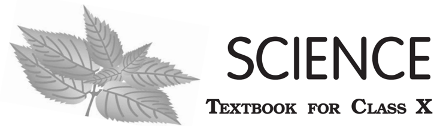

# PAGE 1

# PAGE 2

## 1064  -  SCIENCE

Textbook for Class X

## First Edition

December 2006 Agrahayana 1928

## Reprinted

November 2007, January 2009, December 2009, November 2010, January 2012, November 2012, October 2013, December 2014, December 2015, February 2017, January 2018, January 2019, August 2019, January 2021 and November 2021

## Revised  Edition

October 2022, Kartika 1944

## Reprinted

March 2024 Chaitra 1946 June 2024 Jyeshtha 1946 December 2024 Pausha 1946

## PD 100T  BS

## © National Council of Educational Research  and  Training,  2006,  2022

` 160.00

## Printed on 80 GSM paper with NCERT watermark

Published at the Publication Division by the Secretary, National Council of Educational Research and Training, Sri Aurobindo Marg, New Delhi 110 016 and printed at Pankaj  Printing  Press,  D-28,  Industrial Area,  Site-A,  Mathura  (U.P.)

## ISBN  81-7450-636-5

## ALL RIGHTS RESERVED

- /boxshadowdwn No part of this publication may be reproduced, stored in a retrieval system or transmitted, in any form or by any means, electronic, mechanical, photocopying, recording or otherwise without the prior permission of the publisher.
- /boxshadowdwn This book is sold subject to the condition that it shall not, by way of trade,  be lent, re-sold, hired out or otherwise disposed of without the publisher's consent, in any form of binding or cover other than that in which it is published.
- /boxshadowdwn The correct price of this publication is the price printed on this page, Any revised price indicated by a rubber stamp or by a sticker or by any other means is incorrect and should be unacceptable.

## OFFICES OF THE PUBLICATION DIVISION, NCERT

| NCERT Campus Sri Aurobindo Marg New Delhi 110 016                                  | Phone : 011-26562708   |
|------------------------------------------------------------------------------------|------------------------|
| 108,100FeetRoad Hosdakere Halli Extension Banashankari III Stage Bengaluru 560 085 | Phone : 080-26725740   |
| Navjivan Trust Building P.O.Navjivan Ahmedabad 380 014                             | Phone : 079-27541446   |
| CWC Campus Opp.DhankalBusStop Panihati Kolkata 700 114                             | Phone : 033-25530454   |
| CWCComplex Maligaon Guwahati 781 021                                               | Phone : 0361-2674869   |

## Publication  Team

Head, Publication : Division

M.V. Srinivasan

Chief Editor :

Bijnan Sutar

Chief Production : Officer (In charge)

Jahan Lal

Chief Business :

Amitabh Kumar

Manager

Assistant  Production : Officer

Deepak Kumar

## Cover,  Layout  and  Illustrations

Digital Expressions

# PAGE 3

## F O R E W O R D

The National Curriculum Framework, (NCF), 2005, recommends that children's life at school must be linked to their life outside the school. This principle marks a departure from the legacy of bookish learning which continues to shape our system and causes a gap between the school, home and community. The syllabi and textbooks developed on the basis of NCF signify an attempt to implement this basic idea. They also attempt to discourage rote learning and the maintenance of sharp boundaries between different subject areas. We hope these measures will take us significantly further in the direction of a child-centred system of education outlined in the National Policy on Education (1986).

The success of this effort depends on the steps that school principals and teachers will take to encourage children to reflect on their own learning and to pursue imaginative activities and questions. We must recognise that, given space, time and freedom, children generate new knowledge by engaging with the information passed on to them by adults. Treating the prescribed textbook as the sole basis of examination is one of the key reasons why other resources and sites of learning are ignored. Inculcating creativity and initiative is possible if we perceive and treat children as participants in learning, not as receivers of a fixed body of knowledge.

These aims imply considerable change in school routines and mode of functioning. Flexibility in the daily time-table is as necessary as rigour in implementing the annual calendar so that the required number of teaching days are actually devoted to teaching. The methods used for teaching and evaluation will also determine how effective this textbook proves for making children's life at school a happy experience, rather than a source of stress or boredom. Syllabus designers have tried to address the problem of curricular burden by restructuring and reorienting knowledge at different stages with greater consideration for child psychology and the time available for teaching. The textbook attempts to enhance this endeavour by giving higher priority and space to opportunities for contemplation and wondering, discussion in small groups, and activities requiring hands-on experience.

The National Council of Educational Research and Training (NCERT) appreciates the hard work done by the textbook development team responsible for this book. We wish to thank the Chairman of the advisory group in science and mathematics, Professor J.V. Narlikar and the Chief Advisor for this book, Professor Rupamanjari Ghosh, School of Physical Sciences, Jawaharlal Nehru University, New Delhi, for guiding the work of this committee. Several teachers contributed to the development of this textbook; we are grateful to them and their principals for making this possible. We are indebted to the institutions and organisations which have generously permitted us to draw upon their resources, material and personnel. We are especially grateful to the members of

# PAGE 4

the National Monitoring Committee, appointed by the Department of Secondary and Higher Education, Ministry of Human Resource Development under the Chairmanship of Professor Mrinal Miri and Professor G.P. Deshpande, for their valuable time and contribution.  As  an  organisation  committed  to  systemic  reform  and  continuous improvement in the quality of its products, NCERT welcomes comments and suggestions which will enable us to undertake further revision and refinement.

New Delhi 20 November 2006

Director National Council of Educational Research and Training

# PAGE 5

## RATIONALISATION OF CONTENT IN THE TEXTBOOK

In  view  of  the  COVID-19  pandemic,  it  is  imperative  to  reduce  content  load on students. The National Education Policy 2020, also emphasises reducing the  content  load  and  providing  opportunities  for  experiential  learning  with creative  mindset.  In  this  background,  the  NCERT  has  undertaken  the exercise  to  rationalise  the  textbooks  across  all  classes.  Learning  Outcomes already  developed  by  the  NCERT  across  classes  have  been  taken  into consideration  in  this  exercise.

## Contents of the textbooks have been rationalised in view of the following:

- Overlapping with similar content included in other subject areas in the same class
- Similar content included in the lower or higher class in the same subject
- Difficulty  level
- Content,  which  is  easily  accessible  to  students  without  much interventions  from  teachers  and  can  be  learned  by  children  through self-learning  or  peer-learning
- Content,  which  is  irrelevant  in  the  present  context

## This present edition, is a reformatted version after carrying out the changes given above.

# PAGE 6

## P R E F A C E

This textbook of Science for Class X is a continuation of our attempt in the Class IX Science  textbook  to  comply  with  the  guidelines  of  the  National  Curriculum Framework-2005. We had to work within a limited time frame and also had our own constraints coming in the way of this radical change. The revised and re-structured syllabus for Class X covers selected topics in the broad themes of - Materials, The World of the Living, How Things Work, Natural Phenomena and Natural Resources. We have interpreted the syllabus to present a coherent coverage of scientific concepts related to our daily life on the select topics. It is an integrated approach to science at this level, with no sharp divisions into disciplines such as Physics, Chemistry, Biology and Environmental Science.

There has been a conscious attempt to address the relevant social concerns in this science textbook wherever possible - the concerns for people with special needs, the issues of gender discrimination, energy and environment have found their natural place in this book. Students have been encouraged to get into the debates on some of the management concerns (for sustainable development, for example) so that they can arrive at their own decisions after a scientific analysis of all the facts.

This book has some features which are meant to enhance its effectiveness. The theme of each chapter has been introduced with examples from daily life, and if possible, by a relevant activity that the students have to perform. The entire approach of the book  is, in fact, activity-based, i.e., the students are required to construct knowledge themselves from these activities. The emphasis is not on definitions and technical terms, but on the concepts involved. Special care has been taken so that the rigour of science is not lost while simplifying the language. Difficult and challenging ideas, which are not to be covered at this stage, have often been placed as extra material in the boxes in light orange. The excitement of doing science comes from pursuing the unknown - the students would have the opportunity to think and explore somewhat beyond the syllabus and may feel the urge to continue their scientific expedition at higher levels. All such box items, including brief biography of scientists, are, of course, non-evaluative.

Solved examples are provided, wherever felt necessary, to clarify a concept. The in-text questions after a main section are for the students to check their understanding of the topic. At the end of each chapter, there is a quick review of the important points covered in the chapter. We have introduced some multiple choice questions in the exercises. There are problems of different difficulty levels answers to the multiplechoice questions and numericals, and hints for the difficult questions are included at the end of the book.

# PAGE 7

This book has been made possible because of the active participation of many people. I wish to thank Professor Krishna Kumar, Director, NCERT, Prof. G. Ravindra, Joint Director, NCERT, and Professor Hukum Singh, Head, Department of Education in Science and Mathematics, NCERT, specially for their keen interest in the development of the book and for all the administrative support. I wish to put on record my sincere appreciation for Dr Anjni Koul, the member-coordinator of the textbook development committee, for her extraordinary commitment and efficiency. It has been a real pleasure working with my textbook development team and the review committee. The chosen editorial team worked extremely hard, on tight deadlines, to bring the book close to the shape that we dreamt of. Fruitful discussions with some members of the MHRD Monitoring Committee helped in providing the final touches to the book. I do not have the words to acknowledge the professional and personal inputs I received from some of my close friends during the preparation of this book. We warmly welcome comments and suggestions for improvement from our readers.

RUPAMANJARI GHOSH Professor of Physics School of Physical Sciences Jawaharlal Nehru University New Delhi

# PAGE 8

## TEXTBOOK DEVELOPMENT COMMITTEE

## CHAIRMAN, ADVISORY GROUP FOR TEXTBOOKS IN SCIENCE AND MATHEMATICS

J.V.  Narlikar, Emeritus  Professor, Inter-University  Centre  for  Astronomy  and Astrophysics (IUCAA), Ganeshkhind, Pune University, Pune

## CHIEF ADVISOR

Rupamanjari Ghosh, Professor ,  School  of  Physical  Sciences,  Jawaharlal  Nehru University, New Delhi

## MEMBERS

Alka Mehrotra, Reader , DESM, NCERT, New Delhi

Animesh K. Mohapatra, Reader, Regional Institute of Education, Ajmer

B.B. Swain, Professor (Retd.), Department of Physics, Utkal University, Orissa

B.K. Sharma, Professor , DESM, NCERT, New Delhi

B.K. Tripathi, Reader , DESM, NCERT, New Delhi

Brahm Parkash, Professor , DESM, NCERT, New Delhi

Charu Maini, PGT , Salwan Public School, Gurgaon, Haryana

Dinesh Kumar, Reader , DESM, NCERT, New Delhi

Gagan Gupta, Reader , DESM, NCERT, New Delhi

H.L. Satheesh, TGT , DM School, Regional Institute of Education, Mysore

Ishwant Kaur, PGT , DM School, Regional Institute of Education, Bhopal

J.D. Arora, Reader, Hindu College, Moradabad, Uttar Pradesh

Meenambika Menon, TGT , Cambridge School, Noida, Uttar Pradesh

Puran Chand, Professor and Jt. Director (Retd.), Central Institute of Educational Technology NCERT, New Delhi

Reeta Sharma, Reader , Regional Institute of Education, Bhopal

R.P. Singh, Lecturer , Rajkiya Pratibha Vikas Vidyalaya, Kishan Ganj, Delhi

Satyajit Rath, Scientist , National Institute of Immunology, JNU Campus, New Delhi

S.K. Dash, Reader , Regional Institute of Education, Bhubaneswar

Sunita Ramrakhiani, PGT , Ahlcon Public School, Delhi

Uma Sudhir, Eklavya, Indore, Madhya Pradesh

Vandana Saxena, TGT , Kendriya Vidyalaya-4, Kandhar Lines, Delhi Cantt., New Delhi

Vinod Kumar, Reader , Hans Raj College, Delhi University, Delhi

## MEMBER-COORDINATOR

Anjni Koul, Lecturer , DESM, NCERT, New Delhi

(ix)

# PAGE 9

## A C K N O W L E D G E M E N T S

The National Council of Educational Research and Training (NCERT), besides expressing its gratefulness towards the members of the Textbook Development Committee for their contribution in the development of the Science Textbook for Class X, also acknowledges the contribution of the following members for reviewing, editing, refining, and finalisation of the manuscript of the book. Kanhiya Lal, Principal (Retd.), Directorate of Education, NCT, Delhi; Ranveer Singh, Lecturer , Sarvodaya Bal Vidyalaya, Timarpur, Delhi; Bharat Poorey, Professor (Retd.), Govt. Post Graduate College, Indore; Gagandeep Bajaj, Lecturer , S.P.M. College, Delhi University, Delhi; Ravinder Kaur, TGT , Kendriya Vidyalaya, Rohini, Delhi; Renu Puri, TGT , N.C. Jindal Public School, New Delhi; Sarita Kumar, Reader , Acharya Narendra Dev College, Delhi University, Delhi; Shashi Prabha, Lecturer , DESM, NCERT, Delhi; Rashmi Sharma, Lecturer, NERIE, Shillong; Sushma Jaireth, Reader ,  DWS, NCERT, New Delhi; Y.P. Purang, Addl. Director of Education (Retd.), NCT, Delhi; Neeta Agarwal, TGT , D.L.D.A.V. Model School, Pitampura, Delhi; Roma Anand, TGT , D.L.D.A.V., Pitampura, Delhi;  Veer Pal Singh, Reader , DEME, NCERT, New Delhi and S.L. Varte, Lecturer, DESM, NCERT, New Delhi.

The Council also acknowledges the valuable contribution of Sunita Farkya ( Professor , DESM), Pushplata Verma ( Assistant Professor , DESM), K.C. Tripathi ( Professor , DEL) and Jatindra Mohan Misra ( Professor , DEL) in updating Chapter 16 titled "Sustainable Management of Natural Resources", and also in the review of this textbook.

The contribution of  R.S. Sindhu, Professor (Retd.), DESM; V.P. Srivastava, Professor (Retd.), DESM; R.K. Parashar, Rachna Garg ( Professors , DESM); V.V. Anand, Professor (Retd.), RIE Mysore; S.V. Sharma ( Professor ,  RIE Mysore); V.P. Singh ( Professor ,  RIE Ajmer); R. Joshi, Associate Professor (Retd.), DESM; C.V. Shimray, Ruchi Verma ( Associate Professors , DESM); Ram Babu Pareek ( Associate Professor , RIE Ajmer); A.K. Srivastava, Rejaul Karim Barbhuiya, Pramila Tanwar ( Assistant Professors , DESM); R.R. Koireng ( Assistant Professor , DCS); V. Tangpu ( Assistant Professor , RIE Mysore) and Akhileshwar Mishra ( Head Master , DMS, RIE Bhubaneswar), in the review of this textbook in 2017-18 are acknowledged.

Special thanks are due to Hukum Singh, Professor and Former Head , DESM, NCERT, New Delhi, for providing all academic and administrative support.

The Council also gratefully acknowledges the support provided by the APC Office of DESM, administrative staff of DESM; Deepak Kapoor, Incharge, Computer Station, DESM; Saima  and  Arvind  Sharma, DTP  Operators and  Rajesh  Handa, Illustrator ; Mohd. Qamar Tabrez and Musarrat Parveen, Copy Editors ; Seema Yadav, Proof Reader . The efforts of the Publication Department, NCERT are also highly appreciated.

(x)

# PAGE 10

## CONTENTS

| Foreword                                    | Foreword                                    | iii     |
|---------------------------------------------|---------------------------------------------|---------|
| Rationalisation of Content in the Textbooks | Rationalisation of Content in the Textbooks | v       |
| Preface                                     | Preface                                     | vii     |
| Chapter 1                                   | Chemical Reactions and Equations            | 1       |
| Chapter 2                                   | Acids, Bases and Salts                      | 17      |
| Chapter 3                                   | Metals and Non-metals                       | 37      |
| Chapter 4                                   | Carbon and its Compounds                    | 58      |
| Chapter 5                                   | Life Processes                              | 79      |
| Chapter 6                                   | Control and Coordination                    | 100     |
| Chapter 7                                   | How do Organisms Reproduce?                 | 113     |
| Chapter 8                                   | Heredity                                    | 128     |
| Chapter 9                                   | Light - Reflection and Refraction           | 134     |
| Chapter 10                                  | The Human Eye and the Colourful World       | 161     |
| Chapter 11                                  | Electricity                                 | 171     |
| Chapter 12                                  | Magnetic Effects of Electric Current        | 195     |
| Chapter 13                                  | Our Environment                             | 208     |
|                                             | Answers                                     | 218-219 |

(xi)

# PAGE 11

(xii)