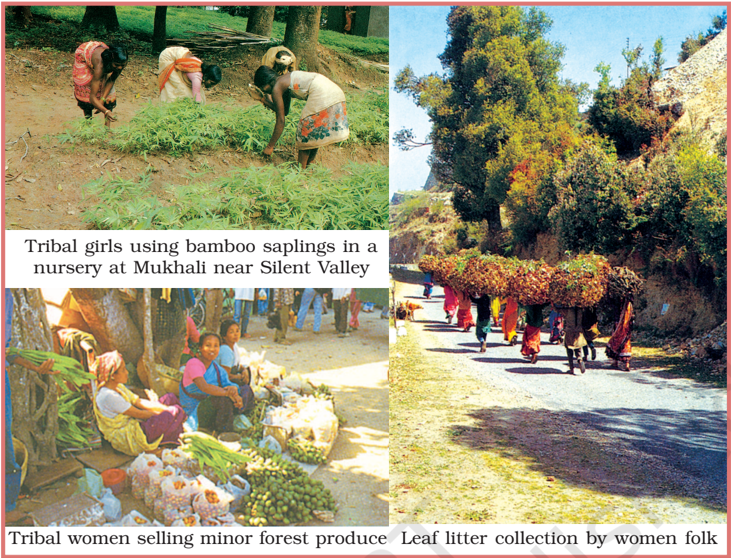
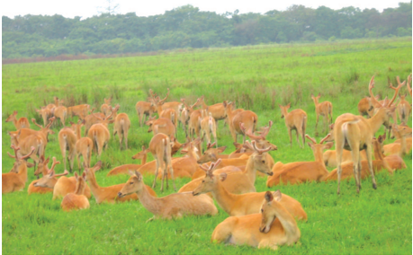

# PAGE 1

Narak! My Lord, you are the creator of music in the world of Lepchas

Oh Narak! My Lord, let me dedicate myself to you

Let  me  gather  your  music  from  the springs, the rivers, the mountains, the forests, the insects and the animals

Let me gather your music from the sweet breeze and offer it to you

Lepcha folk song

We share this planet with millions of other living beings, starting from micro-organisms and  bacteria,  lichens  to  banyan  trees, elephants  and  blue  whales.  This  entire habitat  that  we  live  in  has  immense biodiversity.  We  humans  along  with  all living  organisms  form  a  complex  web  of ecological system in which we are only a part  and  very  much  dependent  on  this system for our own existence. For example, the plants, animals and micro-organisms re-create the quality of the air we breathe, the  water  we  drink  and  the  soil  that produces  our  food  without  which  we cannot survive. Forests play a key role in the ecological system as these are also the primary producers on which all other living beings depend.

Biodiversity  or  Biological  Diversity is immensely rich in wildlife  and  cultivated species,  diverse  in  form  and  function  but closely  integrated  in  a  system  through multiple network of interdependencies.

## Flora and Fauna in India

If you look around, you will be able to find that there are some animals and plants which are  unique  in  your  area.  In  fact,  India  is one of the world's richest countries in terms of its vast array of biological diversity. This is possibly twice or thrice the number yet to be discovered. You have already studied in  detail  about  the  extent  and  variety  of forest and wildlife resources in India. You may  have  realised  the  importance  of these  resources  in  our  daily  life.  These diverse  flora  and  fauna  are  so  well integrated  in  our  daily  life  that  we  take these  for  granted.  But,  lately,  they  are under great stress mainy due to insensitivity to our environment.

Find  out  stories  prevalent  in  your  region which are about the harmonious relationship between human beings and nature.

## Conservation of Forest and Wildlife in India

Conservation  in  the  background  of  rapid decline in wildlife population and forestry has become essential.  But  why  do  we  need  to conserve our forests and wildlife? Conservation preserves the ecological diversity and our life support systems - water, air and soil. It also preserves the genetic diversity of plants and animals for better growth of species and breeding. For example, in agriculture, we are still  dependent  on  traditional  crop varieties. Fisheries too are heavily dependent on the maintenance of aquatic biodiversity.

In the 1960s and 1970s, conservationists demanded a national  wildlife  protection programme. The Indian Wildlife (Protection)

# PAGE 2

Fig. 2.1

Act was implemented in 1972, with various provisions  for  protecting  habitats.  An  allIndia  list  of  protected  species  was  also published. The thrust of the programme was towards protecting the remaining population of  certain  endangered  species  by  banning hunting,  giving  legal  protection  to  their habitats,  and  restricting  trade  in  wildlife. Subsequently,  central  and  many  state governments established national parks and wildlife  sanctuaries  about  which  you  have already studied. The central government also announced several projects  for  protecting specific  animals,  which  were  gravely threatened,  including  the  tiger,  the  onehorned  rhinoceros,  the  Kashmir  stag  or hangul ,  three  types  of  crocodiles  -  fresh water crocodile, saltwater crocodile and the Gharial ,  the  Asiatic  lion,  and  others.  Most recently,  the  Indian  elephant,  black  buck (chinkara),  the  great  Indian  bustard ( godawan ) and the snow leopard, etc. have been  given  full  or  partial  legal  protection against hunting and trade throughout India.

CONTEMPORARY  INDIA - II

## Project Tiger

Tiger is one of the key wildlife species in the  faunal  web.  In  1973,  the  authorities realised  that  the  tiger  population  had dwindled  to  1,827  from  an  estimated 55,000 at the turn of the century. The major threats to tiger population are numerous, such  as  poaching  for  trade,  shrinking habitat,  depletion  of  prey  base  species, growing human population, etc. The trade of tiger skins and the use of their bones in traditional  medicines,  especially  in  the Asian countries left the tiger population on the  verge  of  extinction.  Since  India  and Nepal provide habitat to about two-thirds of  the  surviving  tiger  population  in  the world,  these  two  nations  became  prime targets for poaching and illegal trading.

'Project  Tiger',  one  of  the  wellpublicised wildlife campaigns in the world, was launched in 1973. Tiger conservation has been viewed not only as an effort to save  an  endangered  species,  but  with

# PAGE 3

Fig. 2.2: Rhino and deer in Kaziranga National Park

equal  importance  as  a  means  of preserving biotypes of sizeable magnitude. Corbett  National  Park  in  Uttarakhand, Sunderbans National Park in West Bengal, Bandhavgarh  National  Park  in  Madhya Pradesh,  Sariska  Wildlife  Sanctuary  in Rajasthan, Manas Tiger Reserve in Assam and  Periyar  Tiger  Reserve  in  Kerala  are some of the tiger reserves of India.

The conservation projects are now focusing on biodiversity  rather  than  on  a  few  of  its components. There is now a more intensive search for different conservation measures. Increasingly, even insects are beginning to find a  place  in  conservation  planning.  In  the notification  under  Wildlife  Act  of  1980  and 1986,  several  hundred  butterflies,  moths, beetles, and one dragonfly have been added to the list of protected species. In 1991, for the first time plants were also added to the list, starting with six species.

Collect  more information on the wildlife sanctuaries and national parks of India and cite their locations on the map of India.

Types  and  Distribution  of  Forest  and Wildlife Resources

Even if we want to conserve our vast forest and wildlife  resources,  it  is  rather  difficult  to manage, control and regulate them. In India, much of its forest and wildlife resources are either owned or managed by the government through  the  Forest  Department  or  other government departments. These are classified under the following categories.

- (i) Reserved Forests: More than half of the total  forest  land  has  been  declared reserved  forests .  Reserved  forests  are regarded as the most valuable as far as the conservation of forest and wildlife resources are concerned.
- (ii) Protected Forests: Almost one-third of the total  forest  area  is  protected  forest,  as declared by the Forest Department. This forest land are protected from any further depletion.
- (iii) Unclassed  Forests: These  are  other forests  and  wastelands  belonging  to both government and private individuals and communities.

Reserved and protected forests are also referred  to  as  permanent  forest  estates maintained  for  the  purpose  of  producing timber  and  other  forest  produce,  and  for protective reasons. Madhya Pradesh has the largest  area  under  permanent  forests, constituting 75 per cent of its total forest area. Jammu and Kashmir,  Andhra  Pradesh, Uttarakhand,  Kerala,  Tamil  Nadu,  West Bengal,  and  Maharashtra  have  large percentages of reserved forests of its total forest area  whereas  Bihar,  Haryana,  Punjab, Himachal Pradesh, Odisha and Rajasthan have a bulk of it under protected forests. All North-

FOREST  AND  WILDLIFE  RESOURCES

# PAGE 4

eastern states and parts of Gujarat have a very high percentage of their forests as unclassed forests managed by local communities.

## Community and Conservation

Conservation strategies are not new in our country. We often ignore that in India, forests are  also  home  to  some  of  the  traditional communities. In some areas of India, local communities are struggling to conserve these habitats  along  with  government  officials, recognising  that  only  this  will  secure  their own long-term livelihood.  In  Sariska  Tiger Reserve,  Rajasthan,  villagers  have  fought against mining by citing the Wildlife Protection Act. In many areas, villagers themselves are protecting  habitats  and  explicitly  rejecting government involvement. The inhabitants of five villages in the Alwar district of Rajasthan have declared 1,200 hectares of forest as the Bhairodev Dakav 'Sonchuri', declaring their

CONTEMPORARY  INDIA - II

own set of rules and regulations which do not allow hunting, and are protecting the wildlife against any outside encroachments.

The  famous Chipko movement  in  the Himalayas has not only successfully resisted deforestation  in  several  areas  but  has  also shown that community afforestation with indigenous  species  can  be  enormously successful. Attempts to revive the traditional conservation  methods  or  developing  new methods  of  ecological  farming  are  now widespread. Farmers and citizen's groups like the Beej  Bachao  Andolan in  Tehri  and Navdanya have shown that adequate levels of diversified crop production without the use of synthetic  chemicals  are  possible  and economically viable.

In  India  joint  forest  management  (JFM) programme furnishes a good example for involving local communities in the management and restoration of degraded

# PAGE 5

## Sacred groves - a wealth of diverse and rare species

Nature worship is an age old tribal belief based on the premise that all creations of nature have to be protected. Such beliefs have preserved several virgin forests in pristine form called Sacred Groves (the forests of God and Goddesses). These patches of forest  or  parts  of  large  forests  have  been  left untouched by the local people and any interference with them is banned.

Certain societies revere a particular tree which they have preserved from time immemorial. The Mundas and the Santhal of Chota Nagpur region worship mahua ( Bassia latifolia )  and  kadamba ( Anthocaphalus cadamba )  trees, and the tribals of Odisha and Bihar worship the tamarind ( Tamarindus indica )  and mango ( Mangifera indica )  trees during weddings. To many of us, peepal and banyan trees are considered sacred.

Indian society comprises several cultures, each with its own set of traditional methods of conserving nature and its creations. Sacred qualities are often ascribed to springs, mountain peaks, plants and animals which are closely protected. You will find troops  of  macaques  and  langurs  around  many temples. They are fed daily and treated as a part of temple devotees. In and around Bishnoi villages in Rajasthan, herds of blackbuck, (chinkara), nilgai and peacocks can be seen as an integral part of the community and nobody harms them.

forests. The programme has been in formal existence since 1988 when the state of Odisha passed the first resolution for joint forest management. JFM depends on the formation of local (village) institutions that undertake protection activities mostly on degraded forest land managed by the forest department. In return, the members of these  communities  are  entitled  to intermediary  benefits  like  non-timber forest produces and share in the timber harvested by 'successful protection'.

The clear lesson from the dynamics of both  environmental  destruction  and reconstruction  in  India  is  that  local communities  everywhere  have  to  be involved in some kind of natural resource management. But there is still a long way to go before local communities are at the centre-stage in decision-making. Accept only  those  economic  or  developmental activities,  that  are  people  centric, environment-friendly and economically rewarding.

Write a short essay on any practices which  you  may  have  observed  and practised  in  your  everyday  lives  that conserve and protect the environment around you.

'The tree is a peculiar organism of unlimited kindness and benevolence and makes no demand for its sustenance, and extends generously the products of its life activity. It affords protection to all beings, offering shade even to the axemen who destroy it'.

Gautama Buddha (487 B.C.)

FOREST  AND  WILDLIFE  RESOURCES

# PAGE 6

## EXERCISES  EXERCISES  EXERCISES  EXERCISES  EXERCISES

1. Multiple  choice  questions
2. (i) Which  of  the  following  conservation  strategies  do  not  directly  involve community participation?
3. (a) Joint  forest  management
4. (b) Beej  Bachao  Andolan
2. Match the following.
3. Answer the following questions in about 30 words.
7. (i) What is biodiversity? Why is biodiversity important for human lives?
8. (ii) How have human activities affected the depletion of flora and fauna? Explain.
4. Answer the following questions in about 120 words.
10. (i) Describe how communities have conserved and protected forests and wildlife in  India?
11. (ii) Write a note on good practices towards conserving forest and wildlife.
12. (c) Chipko Movement
13. (d) Demarcation of Wildlife  sanctuaries

| Reserved forests   | Other forests and wastelands belonging to both government and private individuals and communities.   |
|--------------------|------------------------------------------------------------------------------------------------------|
| Protected forests  | Forests are regarded as most valuable as far as the conservation of forest and wildlife resources.   |
| Unclassed forests  | Forest lands are protected from any further depletion.                                               |

