# PAGE 1

Haban comes to Guwahati with his father from a remote village.

He sees people getting  into  strange house like objects which move along the road. He also sees a 'kitchen' dragging a number of house along with it. He is amazed and asked his father 'Why don't our houses move like the one we saw in Guwahati, Ba?'

Ba replies, 'These are not houses, they are buses and trains. Unlike our houses these are not made of bricks and stones, metal like iron  and  alluminium  are  used  in  making these. They do not move on their own. They are driven by an engine which needs energy to work.'

We use different things in our daily life made from metal. Can you list a number of items used in your house made of metals. Where do these metals come from?

You have studied that the earth's crust is made up of different minerals embedded in the rocks. Various metals are extracted from these minerals after proper refinement.

Minerals are an indispensable part of our lives. Almost everything we use, from a tiny pin to a towering building or a big ship, all are made from minerals. The railway lines and the tarmac (paving) of the roads, our implements and machinery too are made from minerals. Cars, buses,  trains,  aeroplanes  are manufactured from minerals and run on power resources derived from the earth. Even the food that we eat contains minerals. In all stages of development, human beings have used minerals for their livelihood, decoration, festivities, religious and ceremonial rites.

## A bright smile from toothpaste and minerals

Toothpaste  cleans  your  teeth.  Abrasive minerals like silica,  limestone,  aluminium oxide and various phosphate minerals do the cleaning. Fluoride which is used to reduce cavities, comes from a mineral fluorite. Most toothpaste are made white with titanium oxide,  which  comes  from  minerals  called rutile, ilmenite and anatase. The sparkle in some  toothpastes comes from mica. The toothbrush and tube containing the paste are made of plastics from petroleum.  Find out where these minerals are found?

## Dig a little deeper and find out how many minerals are used to make a light bulb?

## All living things need minerals

Life processes cannot occur without minerals. Although our mineral intake represents only about 0.3 per cent of our total intake of nutrients, they are so potent and so important that without them we would not be able to utilise the other 99.7 per cent of foodstuffs.

## Dig a little deeper and collect 'Nutritional Facts' printed on food labels.

What is a mineral?

Geologists define mineral as a 'homogenous, naturally occurring substance with a definable internal structure.' Minerals are found in varied forms in nature, ranging from the hardest diamond to the softest talc. Why are they so varied?

# PAGE 2

You  have  already  learnt  about  rocks. Rocks  are  combinations  of  homogenous substances called minerals . Some rocks, for instance limestone, consist of a single mineral only, but majority of the rock consist of several minerals in varying proportions. Although, over 2000 minerals have been identified, only a few are abundantly found in most of the rocks.

A particular mineral that will be formed from  a  certain  combination  of  elements depends upon the physical and chemical conditions under which the material forms. This, in turn, results in a wide range of colours, hardness, crystal forms, lustre and density that a particular mineral possesses. Geologists use these properties to classify the minerals.

## Study of Minerals by Geographers and Geologists

Geographers study minerals as part of the earth's crust for a better understanding of landforms.  The  distribution  of  mineral resources and associated  economic activities are of interest to geographers. A geologist, however, is interested in the formation of minerals,  their  age  and  physical  and chemical composition.

However,  for  general  and  commercial purposes minerals can be classified as under.

## MODE OF OCCURRENCE OF MINERALS

## Where are these minerals found?

Minerals are usually found in 'ores'. The term ore is used to describe an accumulation of  any  mineral  mixed  with  other  elements. The mineral content of the ore must be in sufficient concentration to make its extraction commercially viable. The type of formation or structure in which they are found determines the relative ease with which mineral ores may be mined. This also determines the cost of extraction. It is, therefore, important for us to understand the main types of formations in which minerals occur.

Minerals generally occur in these forms:

- (i) In  igneous  and  metamorphic  rocks minerals  may  occur  in  the  cracks, crevices,  faults  or  joints.  The  smaller occurrences  are  called veins and  the larger are called lodes .  In  most  cases, they are formed when minerals in liquid/ molten  and  gaseous  forms  are  forced upward through  cavities  towards  the earth's surface. They cool and solidify as they rise. Major metallic minerals like tin, copper, zinc and lead etc. are obtained from veins and lodes.
- (ii) In sedimentary rocks a number of minerals occur in beds or layers . They have been formed  as  a  result  of  deposition, accumulation  and  concentration  in horizontal strata. Coal and some forms of iron ore have been concentrated as a result of  long  periods  under  great  heat  and pressure. Another group of sedimentary minerals include gypsum, potash salt and sodium salt. These are formed as a result of evaporation especially in arid regions.
- (iii) Another mode of formation involves the decomposition of surface rocks, and the removal of soluble constituents, leaving a residual  mass  of  weathered material containing  ores.  Bauxite  is formed this way.

Fig. 5.1

MINERALS  AND  ENERGY  RESOURCES

# PAGE 3

- (iv) Certain minerals may occur as alluvial deposits in sands of valley floors and the base of  hills.  These  deposits  are  called 'placer  deposits'  and  generally  contain minerals, which are not corroded by water. Gold, silver,  tin  and  platinum  are  most important among such minerals.
- (v) The ocean waters contain vast quantities of minerals, but most of these are too widely diffused  to  be  of  economic  significance. However, common salt, magnesium and bromine are largely derived from ocean waters. The ocean beds, too, are rich in manganese nodules.

Rat-Hole Mining. Do you know that most of the minerals in India are nationalised and their extraction is possible only after obtaining  due  permission  from  the government? But in most of the tribal areas of the north-east India, minerals are owned by individuals or communities. In Meghalaya, there are large deposits of coal, iron ore, limestone and dolomite etc. Coal mining in Jowai and Cherapunjee is done by family member in the form of a long narrow  tunnel,  known  as  'Rat  hole' mining. The National Green Tribunal has declared  such  activities  illegal  and recommended that  these  should  be stopped forthwith.

Dig a little deeper: What is the difference between an open pit mine, a quarry and an underground mine with shafts?

India is fortunate to have fairly rich and varied mineral resources. However, these are unevenly  distributed.  Broadly  speaking, peninsular rocks contain most of the reserves of coal, metallic minerals, mica and many other non-metallic minerals. Sedimentary rocks on the western and eastern flanks of the peninsula, in  Gujarat  and  Assam  have  most  of  the petroleum deposits. Rajasthan with the rock systems of the peninsula, has reserves of many

CONTEMPORARY  INDIA - II

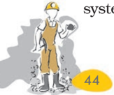

non-ferrous minerals. The vast alluvial plains of north India are almost devoid of economic minerals. These variations exist largely because of the differences in the geological structure, processes and time involved in the formation of minerals.

Let us now study the distribution of a few major minerals in India. Always remember that the concentration of mineral in the ore, the ease of extraction and closeness to the market play an important role in affecting the economic viability of a reserve. Thus, to meet the demand, a choice has to be made between a number of possible options. When this is done a mineral 'deposit' or 'reserve' turns into a mine .

## Ferrous Minerals

Ferrous minerals account for about threefourths of the total value of the production of metallic minerals. They provide a strong base for the development of metallurgical industries. India exports substantial quantities of ferrous minerals after meeting her internal demands.

## Iron  Ore

Iron ore is the basic mineral and the backbone of industrial development. India is endowed with fairly abundant resources of iron ore. India is rich in good quality iron ores. Magnetite is the finest iron ore with a very high content of iron up to 70 per cent. It has excellent magnetic qualities, especially valuable in the electrical industry. Hematite ore is the most important industrial iron ore in terms of the quantity used, but has a slightly lower iron content than magnetite. (50-60 per cent). In 2018-19 almost entire production of iron ore (97%) accrued from Odisha, Chhattisgarh, Karnataka and Jharkhand. The remaining production (3%) was from other states.

Kudre in  Kannada means horse. The highest  peak  in  the  western  ghats  of Karnataka resembles the face of a horse. The Bailadila hills look like the hump of an ox, and hence its name.

# PAGE 4

Fig. 5.2: Iron ore mine

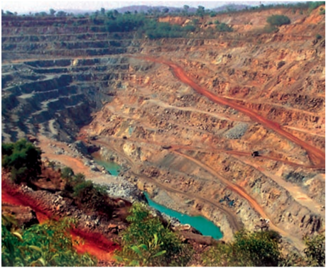

The major iron ore belts in India are:

- Odisha-Jharkhand belt :  In  Odisha  high grade hematite ore is found in Badampahar mines in the Mayurbhanj and Kendujhar districts.  In  the  adjoining  Singbhum district of Jharkhand haematite iron ore is mined in Gua and Noamundi.
- Durg-Bastar-Chandrapur  belt lies  in Chhattisgarh and Maharashtra. Very high grade hematites are found in the famous Bailadila range of hills in the Bastar district of  Chhattisgarh.  The  range  of  hills comprise of  14  deposits  of  super  high grade hematite iron ore. It has the best physical  properties  needed  for  steel making.  Iron  ore  from  these  mines  is exported to Japan and South Korea via Vishakhapatnam port.
- Ballari-Chitradurga -ChikkamagaluruTumakuru belt in  Karnataka  has  large reserves of iron ore. The Kudremukh mines located in the Western Ghats of Karnataka are a 100 per cent export unit. Kudremukh deposits are known to be one of the largest in  the  world.  The  ore  is  transported  as slurry through a pipeline to a port near Mangaluru.
- Maharashtra-Goa belt includes the state of Goa  and  Ratnagiri  district of

Maharashtra. Though, the ores are not of very high quality, yet they are efficiently exploited.  Iron  ore  is  exported  through Marmagao port.

## Manganese

Manganese is mainly used in the manufacturing of steel and ferro-manganese alloy. Nearly 10 kg of manganese is required to manufacture one tonne of steel. It is also used in  manufacturing  bleaching  powder, insecticides and paints.

Fig. 5.3: Production of Manganese showing state-wise share in per cent, 2018-19

Dig a little deeper: Superimpose the maps showing distribution of iron ore, manganese, coal and iron and steel industry. Do you see any correlation. Why?

## Non-Ferrous Minerals

India's  reserves  and  production  of  nonferrous  minerals  is  not  very  satisfactory. However,  these  minerals,  which  include copper, bauxite, lead, zinc and gold play a vital  role  in  a  number  of  metallurgical, engineering and electrical industries. Let us study  the  distribution  of  copper  and bauxite.

MINERALS  AND  ENERGY  RESOURCES

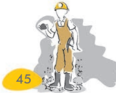

# PAGE 5

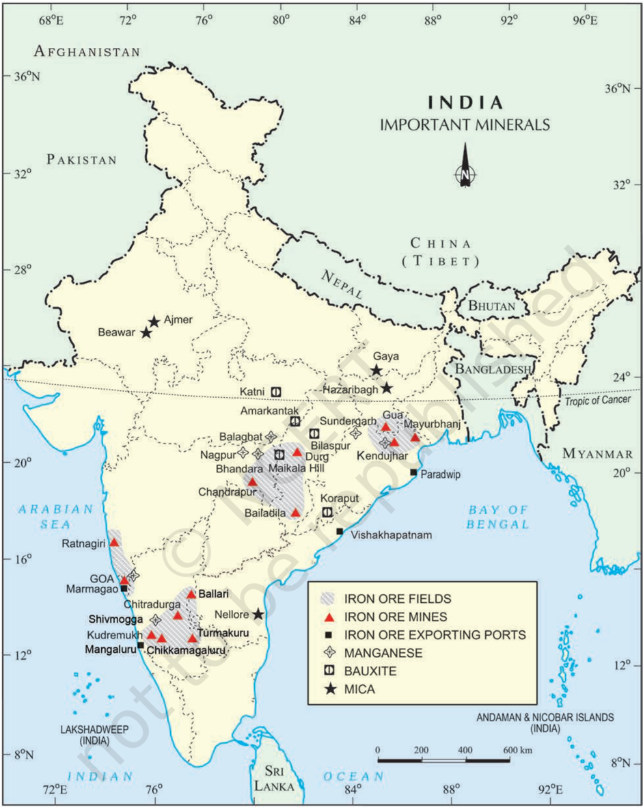

India: Distribution of Iron Ore, Manganese, Bauxite and Mica

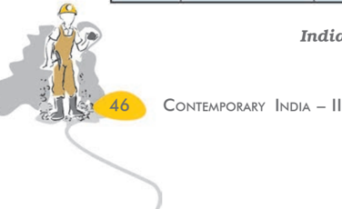

# PAGE 6

## Copper

India is critically deficient in the reserve and production of copper. Being malleable, ductile and a good conductor, copper is mainly used in electrical cables, electronics  and chemical

Fig. 5.4:  Copper mines at Malanjkhand

industries. The Balaghat mines in Madhya Pradesh,  Khetri  mines  in  Rajasthan  and Singhbhum district of Jharkhand are leading producers of copper.

## Bauxite

Though, several ores contain aluminium, it is  from  bauxite,  a clay-like  substance that  alumina  and later  aluminium  is obtained.  Bauxite deposits are formed by the decomposition of  a  wide  variety  of rocks rich in aluminium silicates.

Aluminium is an important metal because it combines the strength of metals such  as  iron,  with extreme  lightness and also with good conductivity  and great malleability .

India's  bauxite deposits are mainly found in the

Amarkantak plateau, Maikal hills and the plateau region of Bilaspur -Katni.

Fig. 5.5:  Production of Bauxite showing state-wise share in per cent, 2018-19

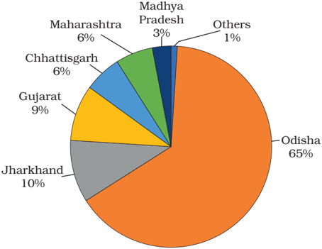

Odisha was the largest bauxite producing state  in  India  in  2018-19.  Panchpatmali deposits  in  Koraput  district  are  the  most important bauxite deposits in the state.

Fig.5.6:  Bauxite Mine

Dig a little deeper : Locate the mines of Bauxite on the physical map of India.

MINERALS  AND  ENERGY  RESOURCES

# PAGE 7

After  the  discovery  of  aluminium Emperor Napoleon III wore buttons and hooks on his clothes made of aluminium and served food to his more illustrious guests  in  aluminium  utensils  and  the less honourable ones were served in gold and silver utensils. Thirty years after this incident  aluminium  bowls  were  most common with the beggars in Paris.

## Non-Metallic Minerals

Mica is a mineral made up of a series of plates or leaves. It splits easily into thin sheets. These sheets can be so thin that a thousand can be layered into a mica sheet of a few centimeters high. Mica can be clear, black, green, red yellow or  brown.  Due  to  its  excellent  di-electric strength,  low  power  loss  factor,  insulating properties and resistance to high voltage, mica is one of the most indispensable minerals used in electric and electronic industries.

Mica deposits are found in the northern edge of the Chota Nagpur plateau. Koderma Gaya - Hazaribagh belt of Jharkhand is the leading producer.

## Rock Minerals

Limestone is found in association with rocks composed of calcium carbonates or calcium and magnesium carbonates. It is found in sedimentary  rocks  of  most  geological formations.  Limestone  is  the  basic  raw material  for  the  cement  industry  and essential for smelting iron ore in the blast furnace.

Dig a little deeper : Study the maps to explain why Chota Nagpur is a storehouse of minerals.

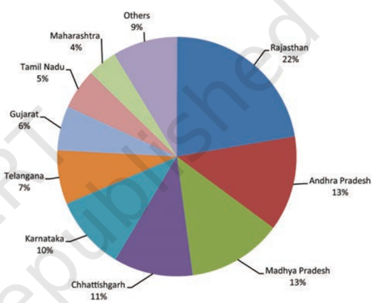

In Rajasthan, the major mica producing area  is  around  Ajmer.  Nellore  mica  belt  of Andhra Pradesh is also an important producer in the country.

Fig. 5.7: Production of Limestone showing state-wise share in per cent, 2018-19

## Hazards of Mining

Have you ever wondered about the efforts the miners make in making life comfortable for you? What are the impacts of mining on the health of the miners and the environment?

The dust and noxious fumes inhaled by miners make them vulnerable to pulmonary diseases. The risk of collapsing mine roofs, inundation  and  fires  in  coalmines  are  a constant threat to miners.

The  water  sources  in  the  region  get contaminated due to mining. Dumping of waste and slurry leads to degradation of land, soil, and increase in stream and river pollution.

CONTEMPORARY  INDIA - II

Fig. 5.8: Air pollution due to generation of dust in mining areas

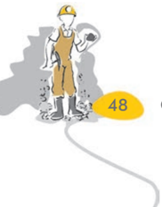

# PAGE 8

Stricter safety regulations and implementation of environmental laws are essential to prevent mining from becoming a 'killer industry'.

## CONSERVATION OF MINERALS

We all appreciate the strong dependence of industry  and  agriculture  upon  mineral deposits and the substances manufactured from  them.  The  total  volume  of  workable mineral deposits is an insignificant fraction i.e. one per cent of the earth's crust. We are rapidly consuming mineral resources that

required millions of years to be created and concentrated.  The  geological  processes  of mineral formation are so slow that the rates of  replenishment  are  infinitely  small  in comparison  to  the  present  rates  of consumption.  Mineral  resources  are, therefore,  finite  and  non-renewable.  Rich mineral deposits are our country's extremely valuable  but  short-lived  possessions. Continued  extraction  of  ores  leads  to increasing costs as mineral extraction comes from  greater  depths  along  with  decrease in quality.

MINERALS  AND  ENERGY  RESOURCES

# PAGE 9

A concerted effort has to be made in order to  use  our  mineral  resources  in  a  planned and sustainable manner. Improved technologies need to be constantly evolved to allow  use  of  low  grade  ores  at  low  costs. Recycling of metals, using scrap metals and other substitutes are steps in conserving our mineral resources for the future.

Dig a little deeper: Make a list of items where substitutes  are being used instead of minerals. Where are these substitutes obtained from?

## Energy Resources

Energy is required for all activities. It is needed to cook, to provide light and heat, to propel vehicles and to drive machinery in industries.

Energy  can  be  generated  from  fuel minerals like  coal,  petroleum,  natural  gas, uranium  and  from  electricity.  Energy resources can be classified as conventional and non-conventional sources. Conventional sources include: firewood, cattle dung cake, coal,  petroleum, natural gas and electricity (both hydel and thermal). Non-conventional sources include solar, wind, tidal, geothermal, biogas and atomic energy. Firewood and cattle dung cake are most common in rural India. According to one estimate more than 70 per cent energy requirement in rural households is met by these two ; continuation of these is increasingly  becoming  difficult  due  to decreasing forest area. Moreover, using dung cake  too  is  being  discouraged  because  it consumes most valuable manure which could be used in agriculture.

## Conventional Sources of Energy

Coal: In India, coal is the most abundantly available fossil fuel. It provides a substantial part of the nation's energy needs. It is used for  power  generation,  to  supply  energy  to industry as well as for domestic needs. India is  highly  dependent on coal for meeting its commercial energy requirements.

As  you  are  already  aware  that  coal  is formed due the compression of plant material over  millions  of  years.  Coal,  therefore,  is found in a variety of forms depending on the degrees of compression and the depth and

CONTEMPORARY  INDIA - II

Fig. 5.9 (a): A view from inside of a coal mine

Fig. 5.9 (b): A view from outside of a coal mine

time  of  burial.  Decaying  plants  in  swamps produce peat. Which has a low carbon and high  moisture  contents  and  low  heating capacity. Lignite is a low grade brown coal, which is soft with high moisture content. The principal lignite reserves are in Neyveli in Tamil Nadu  and  are  used  for  generation  of electricity.  Coal  that  has  been  buried  deep and subjected to increased temperatures is bituminous coal. It is the most popular coal in commercial use. Metallurgical coal is high grade bituminous coal which has a special value  for  smelting  iron  in  blast  furnaces. Anthracite is the highest quality hard coal.

In India coal occurs in rock series of two main geological ages, namely Gondwana, a little  over  200  million  years  in  age  and  in tertiary  deposits  which  are  only  about  55 million  years  old.  The  major  resources  of Gondwana coal, which are metallurgical coal, are located in Damodar valley (West Bengal-

# PAGE 10

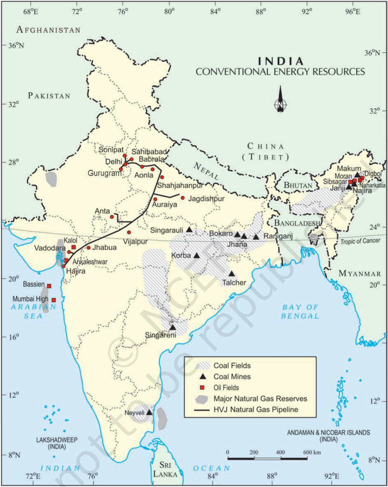

India: Distribution of Coal, Oil and Natural Gas

Collect information about cross country natural gas pipelines laid by GAIL (India) under 'One Nation One Grid'.

MINERALS  AND  ENERGY  RESOURCES

# PAGE 11

Jharkhand). Jharia, Raniganj, Bokaro are important coalfields. The Godavari, Mahanadi,  Son  and  Wardha  valleys  also contain coal deposits.

Tertiary coals occur in the north eastern states  of  Meghalaya,  Assam,  Arunachal Pradesh and Nagaland.

Remember coal is a bulky material, which loses weight on use as it is reduced to ash. Hence, heavy industries and thermal power stations are located on or near the coalfields.

## Petroleum

Petroleum or mineral oil is the next major energy source in India after coal. It provides fuel  for  heat  and  lighting,  lubricants  for machinery and raw materials for a number of manufacturing industries. Petroleum refineries act as a 'nodal industry' for synthetic textile, fertiliser and numerous chemical industries.

Most of the petroleum occurrences in India are associated with anticlines and fault traps in the rock formations of the tertiary age. In regions  of  folding,  anticlines  or  domes,  it occurs where oil is trapped in the crest of the upfold.  The  oil  bearing  layer  is  a  porous limestone or sandstone through which oil may flow.  The  oil  is  prevented  from  rising  or sinking by intervening non-porous layers.

Petroleum  is  also  found  in  fault  traps between porous and non-porous rocks. Gas, being lighter  usually occurs above the oil.

Mumbai High, Gujarat and Assam are major petroleum production areas in India. From the map locate the 3 major off shore fields  of  western  India.  Ankeleshwar  is  the most important field of Gujarat. Assam is the oldest  oil  producing  state  of  India.  Digboi, Naharkatiya  and  Moran-Hugrijan  are  the important oil fields in the state.

## Natural Gas

Natural Gas is found with petroleum deposits and is released when crude oil is brought to the surface. It can be used as a domestic and industrial fuel. It is used as fuel in power sector to generate electricity, for heating purpose in industries,  as  raw  material  in  chemical, petrochemical  and  fertilizer  industries,  as transport fuel and as cooking fuel. With the expansion of gas infrastructure and local city

CONTEMPORARY  INDIA - II

gas distribution (COD) networks, natural gas is also emerging as a preferred transport fuel (CNG) and cooking fuel (PNG) at homes. India's major gas reserves are found in the Mumbai High and allied fields  along  the  west  coast which  are  supplemented  by  finds  in  the Cambay basin. Along the East Coast, new reserves of natural gas have been discovered in the Krishna-Godavari basin.

The first 1,700 km long Hazira-VijaipurJagdishpur (HVJ) cross country gas pipeline, constructed by GAIL (India), linked Mumbai High  and  Bassein  gas  fields  with  various fertilizer, power and industrial complexes in western  and  northen  India.  This  artery provided  impetus  to  Indian  gas  market development. Overall, India's gas infrastructure has expanded over ten times from 1,700 km to 18,500 km of cross-country pipelines and is expected to soon reach over 34, 000 km as Gas  Grid  by  linking  all  gas  sources  and consuming  markets  across  the  country including North Eastern states.

## Electricity

Electricity  has  such  a  wide  range  of applications in today's world that, its percapita consumption is considered as an index of development. Electricity is generated mainly in two  ways: by running water which drives hydro turbines to generate hydro electricity; and by burning other fuels such as coal, petroleum and natural gas to drive turbines to produce thermal power. Once generated the electricity is exactly the same.

Name some river valley projects and write the names of the dams built on these rivers.

Hydro electricity is  generated  by  fast flowing water, which is a renewable resource. India has a number of multi-purpose projects like  the  Bhakra  Nangal,  Damodar  Valley corporation,  the  Kopili  Hydel  Project  etc. producing hydroelectric power.

Thermal electricity is generated by using coal, petroleum and natural gas. The thermal power stations use non-renewable fossil fuels for generating electricity.

# PAGE 12

India: Distribution of Nuclear and Thermal Power Plants

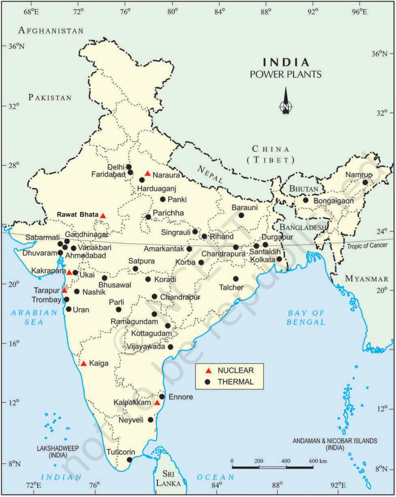

MINERALS  AND  ENERGY  RESOURCES

# PAGE 13

Collect  information  about  thermal/hydel power plants  located  in  your  state.  Show them on the map of India.

## Non-Conventional Sources of Energy

The  growing  consumption  of  energy  has resulted in the country becoming increasingly dependent on fossil fuels such as coal, oil and gas.   Rising  prices  of  oil  and  gas  and  their potential shortages have raised uncertainties about the security of energy supply in future, which in turn has serious repercussions on the growth of the national economy. Moreover, increasing  use  of  fossil  fuels  also  causes serious environmental problems. Hence, there is a pressing need to use renewable energy sources like solar energy, wind, tide, biomass and energy from waste material. These are called non-conventional energy sources.

India  is  blessed  with  an  abundance  of sunlight, water, wind and biomass. It has the largest  programmes for the development of these renewable energy resources.

## Nuclear or Atomic Energy

It is obtained by altering the structure of atoms. When such an alteration is made, much energy is released in the form of heat and this is used to generate electric power. Uranium and Thorium, which are available in Jharkhand and the Aravalli ranges of Rajasthan are used for generating  atomic  or  nuclear  power.  The Monazite  sands  of  Kerala  is  also  rich  in Thorium.

Locate the 6 nuclear power stations and find out the state in which they are located.

## Solar Energy

India is a tropical country. It has enormous possibilities  of  tapping  solar  energy. Photovoltaic  technology  converts  sunlight directly into electricity.  Solar  energy is fast becoming popular in rural and remote areas. Some  big  solar  power  plants  are  being established in different parts of India which will  minimise  the  dependence  of  rural households  on  firewood  and  dung  cakes, which in turn will contribute to environmental conservation and adequate supply of manure in agriculture.

CONTEMPORARY  INDIA - II

Fig. 5.10: Solar operated electronic milk testing equipment

Collect information about newly established solar power plants in India.

## Wind power

India has great potential of wind power. The largest wind farm cluster is located in Tamil Nadu from Nagarcoil to Madurai. Apart from these, Andhra Pradesh, Karnataka, Gujarat, Kerala, Maharashtra and Lakshadweep have important  wind  farms.  Nagarcoil  and Jaisalmer are well known for effective use of wind energy in the country.

Fig. 5.11: Wind mills - Nagarcoil

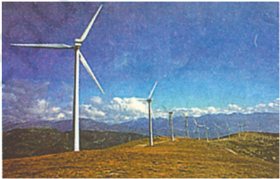

## Biogas

Shrubs, farm waste, animal and human waste are  used  to  produce  biogas  for  domestic consumption in rural areas. Decomposition of organic matter yields gas, which has higher thermal efficiency in comparison to kerosene, dung cake and charcoal. Biogas plants are set  up  at  municipal,  cooperative  and individual levels. The plants using cattle dung are known as 'Gobar gas plants' in rural India. These provide twin benefits to the farmer in the form of energy and improved quality of

# PAGE 14

manure. Biogas is by far the most efficient use of cattle dung. It improves the quality of manure and also prevents the loss of trees and manure due to burning of fuel wood and cow dung cakes.

Fig. 5.12: Biogas Plant

## Tidal Energy

Oceanic  tides  can  be  used  to  generate electricity.  Floodgate  dams  are  built  across inlets. During high tide water flows into the inlet and gets trapped when the gate is closed. After the tide falls outside the flood gate, the water retained by the floodgate flows back to the sea via a pipe that carries it through a power-generating turbine.

In India the Gulf of Khambhat, the Gulf of Kuchchh in Gujarat on the western coast and Gangetic delta in Sunderban regions of West  Bengal  provide  ideal  conditions  for utilising tidal energy.

## Geo Thermal Energy

Geo thermal energy refers to the heat and electricity produced by using the heat from the interior of the Earth. Geothermal energy exists because, the Earth grows progressively hotter  with  increasing  depth.  Where  the geothermal gradient is high, high temperatures are found at shallow depths. Groundwater in such areas absorbs heat from the rocks and becomes hot. It is so hot that when it rises to the earth's surface, it turns into steam. This steam is used to drive turbines and generate electricity.

There are several hundred hot springs in India,  which  could  be  used  to  generate electricity. Two experimental projects have been set up in India to harness geothermal energy. One is  located  in  the  Parvati  valley  near Manikaran in Himachal Pradesh and the other is located in the Puga Valley, Ladakh.

## Conservation of Energy Resources

Energy is a basic requirement for economic development.  Every sector of the national economy - agriculture, industry, transport, commercial and domestic - needs inputs of energy.  The  economic  development  plans implemented since Independence necessarily required  increasing  amounts  of  energy  to remain operational.  As a result, consumption of energy in all forms has been steadily rising all over the country.

In this background, there is an urgent need to  develop  a  sustainable  path  of  energy development. Promotion of energy conservation and increased use of renewable energy sources are the twin planks of sustainable energy.

India is presently one of the least energy efficient countries in the world. We have to adopt a cautious approach for the judicious use  of  our  limited  energy  resources.  For example, as concerned citizens we can do our bit by using public transport systems instead of individual vehicles; switching off electricity when not in use, using power-saving devices and using non-conventional sources of energy. After all, 'energy saved is energy produced'.

EXERCISES  EXERCISES  EXERCISES  EXERCISES  EXERCISES

## 1. Multiple  choice  questions.

- (i) Which one of the following minerals is formed by decomposition of rocks, leaving  a  residual  mass  of  weathered  material?

(a)

coal

- (b) bauxite
- (c) gold
- (d) zinc
- (ii) Koderma, in Jharkhand is the leading producer of which one of the following minerals?
- (a) bauxite
- (b) mica
- (c) iron ore
- (d) copper

MINERALS  AND  ENERGY  RESOURCES

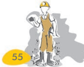

# PAGE 15

- (iii) Minerals  are  deposited  and  accumulated  in  the  stratas  of  which  of  the following  rocks?
- (a) sedimentary rocks
- (b) metamorphic rocks
- (c) igneous  rocks
- (d) none of the above
- (iv) Which one of the following minerals is contained in the Monazite sand?
- (a) oil
- (b) uranium
- (c) thorium
- (d) coal
2. Answer the following questions in about 30 words.
- (i) Distinguish between the following in not more than 30 words.
- (a) ferrous and non-ferrous minerals
- (b) conventional  and  non-conventional  sources  of  energy
- (ii) What is a mineral?
- (iii) How are minerals formed in igneous and metamorphic rocks?
- (iv) Why do we need to conserve mineral resources ?
3. Answer the following questions in about 120 words.
- (i) Describe the distribution of coal in India.
- (ii) Why do you think that solar energy has a bright future in India?

## ACTIVITY

Fill the name of the correct mineral in the crossword below:

# PAGE 16

## ACROSS

1. A ferrous mineral (9)
2. Raw material for cement industry (9)
3. Finest iron ore with magnetic properties (9)
4. Highest quality hard coal (10)
5. Aluminium is obtained from this ore (7)
6. Khetri mines are famous for this mineral (6)
7. Formed due to evaporation (6)

## DOWN

1. Found in placer deposit (4)
2. Iron ore mined in Bailadila (8)
3. Indispensable for  electrical  industry  (4)
4. Geological  Age  of  coal  found  in  north  east India (8)
5. Formed in veins and lodes (3)

MINERALS  AND  ENERGY  RESOURCES

