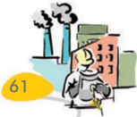
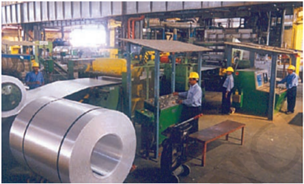
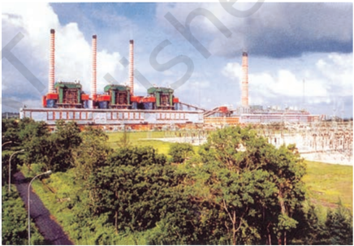

# PAGE 1

On the occassion of Diwali, Harish went to a market with his parents. They purchased shoes  and  clothes  for  him.  His  mother purchased utensils,  sugar,  tea  and  diyas (earthen lamps). Harish observed that the shops  in  the  market  were  flooded  with items for sale. He wondered how so many items  could  be  made  in  such  large quantities. His father explained that shoes, clothes,  sugar  etc.  are  manufactured  by machines in large industries, some utensils are manufactured in small industries, while items  like diyas are  made  by  individual artisans in household industry.

Do  you  have  some  ideas  about  these industries?

Production of goods in large quantities after processing  from  raw  materials  to  more valuable products is called manufacturing. Do you know that paper is manufactured from wood, sugar from sugarcane, iron and steel from iron ore and aluminium from bauxite? Do you also know that some types of clothes are manufactured from yarn which itself is an industrial product?

People employed in the secondary activities manufacture  the  primary  materials  into finished goods. The workers employed in steel factories,  car,  breweries,  textile  industries, bakeries etc. fall into this category. Some people are  employed in providing services.  In  this chapter,  we  are  mainly  concerned  with manufacturing industries which fall in the secondary sector.

The economic strength of a country is measured by the development of manufacturing industries.

58

CONTEMPORARY  INDIA - II

## IMPORTANCE OF MANUFACTURING

Manufacturing sector is considered the backbone of  development  in  general  and  economic development in particular mainly because-

- Manufacturing industries not only help in modernising agriculture, which forms the backbone of our economy, they also reduce the  heavy  dependence  of  people  on agricultural income by providing them jobs in secondary and tertiary sectors.
- Industrial development is a precondition for eradication of unemployment and poverty from  our  country.  This  was  the  main philosophy behind public sector industries and joint sector ventures in India. It was also aimed at bringing down regional disparities by  establishing  industries  in  tribal  and backward areas.
- Export  of  manufactured  goods  expands trade and commerce, and brings in much needed foreign exchange.
- Countries  that  transform  their  raw materials  into  a  wide  variety  of  finished goods  of  higher  value  are  prosperous. India's  prosperity  lies  in  increasing  and diversifying its manufacturing industries as quickly as possible.

Agriculture and industry are not exclusive of each other. They move hand in hand.  For instance,  the  agro-industries  in  India  have given a major boost to agriculture by raising its productivity. They depend on the latter for raw materials and sell their products such as irrigation  pumps,  fertilisers,  insecticides, pesticides, plastic and PVC pipes, machines and  tools,  etc.  to  the  farmers.  Thus, development  and  competitiveness  of

# PAGE 2

manufacturing  industry  has  not  only assisted  agriculturists  in  increasing  their production but also made the production processes very efficient.

In the present day world of globalisation, our industry needs to be more efficient and competitive.  Self-sufficiency  alone  is  not enough. Our manufactured goods must be at  par  in  quality  with  those  in  the international market. Only then, will we be able to compete in the international market.

## Classification of Industries

List the various manufactured products you use in your daily life such as - transistors, electric  bulbs,  vegetable  oil,  cement, glassware,  petrol,  matches,  scooters, automobiles, medicines and so on. If we classify  the  various  industries  based  on  a particular  criterion  then  we  would  be able  to  understand  their  manufacturing better.    Industries  may  be  classified  as follows:

On the basis of source of raw materials used:

- Agro based: cotton, woollen, jute, silk textile,  rubber  and  sugar,  tea,  coffee, edible oil.
- Mineral based: iron and steel, cement, aluminium, machine tools, petrochemicals.

## According to their main role:

- Basic or key industries are those which supply their products as raw materials to manufacture other goods e.g. iron and steel  and  copper  smelting,  aluminum smelting.
- Consumer industries that produce goods for  direct  use  by  consumers  -  sugar, toothpaste,  paper,  sewing  machines, fans etc.

## On the basis of capital investment:

- A small scale  industry  is  defined  with reference  to  the  maximum  investment

allowed on the assets of a unit. This limit has changed over a period of time. At present the maximum investment allowed is rupees one crore.

## On the basis of ownership:

- Public  sector,  owned  and  operated  by government agencies - BHEL, SAIL etc.
- Private  sector  industries  owned  and operated by individuals  or  a  group  of individuals  -TISCO,  Bajaj  Auto  Ltd., Dabur Industries.
- Joint sector industries which are jointly run by the state and individuals or a group of individuals. Oil India Ltd. (OIL) is jointly owned by public and private sector.
- Cooperative sector industries are owned and  operated  by  the  producers  or suppliers  of  raw  materials,  workers  or both.  They pool in the resources and share the profits or losses proportionately. Such examples  are  the  sugar  industry  in Maharashtra, the coir industry in Kerala.

Based on the bulk and weight of raw material and finished goods:

- Heavy industries such as iron and steel
- Light  industries  that  use  light  raw materials and produce light goods such as electrical goods industries.

Classify the following into two groups on the basis of bulk and weight of raw material and finished goods.

- (i) Oil
- (ii) Knitting needles
- (iii) Brassware
- (iv) Fuse wires
- (v) Watches

## Agro-based Industries

Cotton, jute, silk, woollen textiles, sugar and edible  oil,  etc.  industries  are    based  on agricultural raw materials.

MANUFACTURING  INDUSTRIES

- (vi) Sewing Machines
- (vii) Shipbuilding
- (viii) Electric Bulbs
- (ix) Paint brushes
- (x) Automobiles

# PAGE 3

Fig. 6.1: Value addition in the textile industry

Textile  Industry: The  textile  industry occupies  unique  position  in  the  Indian economy, because it contributes significantly to  industrial  production,  employment generation and foreign exchange earnings. It is the only industry in the country, which is self-reliant and complete in the value chain i.e., from raw material to the highest value added products.

Cotton Textiles: In ancient India, cotton textiles were produced with hand spinning and handloom weaving techniques. After the 18 th  century, power-looms came into use.  Our traditional industries suffered a setback during the colonial period because they could not compete with the mill-made cloth from England.

- The  first  successful  textile  mill  was established in Mumbai in 1854.
- The two world wars were fought in Europe, India was a British colony. There was a demand for cloth in U.K. hence, they gave a boost to the development of the cotton textile industry.

In  the  early  years,  the  cotton  textile industry  was  concentrated  in  the  cotton growing belt of Maharashtra and Gujarat. Availability of raw cotton, market, transport including accessible port facilities, labour, moist climate, etc. contributed towards its localisation.  This industry has close links with  agriculture  and  provides  a  living  to farmers, cotton boll pluckers and workers engaged  in  ginning,  spinning,  weaving,

CONTEMPORARY  INDIA - II

dyeing, designing, packaging, tailoring and sewing. The industry by creating demands supports many other industries, such as, chemicals and dyes, packaging materials and engineering works.

While spinning continues to be centralised in  Maharashtra,  Gujarat  and  Tamil  Nadu, weaving is  highly  decentralised  to  provide scope for incorporating traditional skills and designs  of  weaving  in  cotton,  silk,  zari, embroidery,  etc.  India  has  world  class production in spinning, but weaving supplies low quality of fabric as it cannot use much of the high quality yarn produced in the country. Weaving is done by handloom, powerloom and in mills.

The handspun khadi provides large scale employment to weavers in their homes as a cottage industry.

Why did Mahatma Gandhi lay emphasis on spinning  yarn  and  weaving  khadi?

Why is it important for our country to keep the mill sector loomage lower than power loom and handloom?

## Jute  Textiles

India is the largest producer of raw jute and jute goods and stands at second place as an exporter after Bangladesh. Most of the mills are located in West Bengal, mainly along the banks of the Hugli river, in a narrow belt.

The first jute mill was set up near Kolkata in 1855 at Rishra.  After Partition in 1947, the jute mills remained in India but three-fourth of  the  jute  producing  area  went  to Bangladesh (erstwhile East Pakistan).

# PAGE 4

India:

Distribution of cotton, woollen and silk industries

MANUFACTURING  INDUSTRIES

# PAGE 5

Factors responsible for their location in the Hugli basin are: proximity of the jute producing areas, inexpensive water transport, supported by a good network of railways, roadways and waterways  to  facilitate  movement  of  raw material  to  the  mills,  abundant  water  for processing raw jute, cheap labour from West Bengal and adjoining states of Bihar, Odisha and Uttar Pradesh. Kolkata as a large urban centre provides banking, insurance and port facilities for export of jute goods.

## Sugar  Industry

India stands second as a world producer of sugar  but  occupies  the  first  place  in  the production of gur and khandsari. The raw material used in this industry is bulky, and in haulage its sucrose content reduces. The mills are  located  in  Uttar  Pradesh,  Bihar, Maharashtra, Karnataka, Tamil Nadu, Andhra Pradesh,  Gujarat,  Punjab,  Haryana  and Madhya Pradesh. Sixty per cent mills are in Uttar  Pradesh  and  Bihar.  This  industry  is seasonal in nature so, it is ideally suited to the cooperative sector. Can you explain why this is so?

In recent years, there is a tendency for the mills to shift and concentrate in the southern and western states, especially in Maharashtra, This is because the cane produced here has a higher sucrose content. The cooler climate also ensures a longer crushing season. Moreover, the cooperatives are more successful in these states.

## Mineral-based Industries

Industries that use minerals and metals as raw materials are called mineral-based industries. Can you name some industries that would fall in this category?

## Iron  and  Steel  Industry

The iron and steel industry is the basic industry since all the other industries - heavy, medium and light, depend on it for their machinery. Steel is needed to manufacture a variety of engineering  goods,  construction  material, defence,  medical,  telephonic,  scientific equipment and a variety of  consumer goods.

Make a list of all such goods made of steel that you can think of.

Production and consumption of steel is often  regarded  as  the  index  of  a  country's development. Iron and steel is a heavy industry because  all  the  raw  materials  as  well  as finished goods are heavy and bulky entailing heavy transportation costs. Iron ore, coking coal and lime stone are required in the ratio of approximately 4 : 2 : 1. Some quantities of manganese, are also required to harden the steel. Where should the steel plants be ideally located?  Remember that the finished products also need an efficient transport network for their  distribution  to  the  markets  and consumers.

Fig. 6.2

# PAGE 6

India: Iron and Steel Plants

MANUFACTURING  INDUSTRIES

# PAGE 7

Chhotanagpur plateau region  has  the maximum concentration of iron and steel industries. It is largely, because of the relative advantages this region has for the development of this industry. These include, low cost of iron ore, high grade raw materials in proximity, cheap labour and vast growth potential in the home market.

## Aluminium Smelting

Aluminium smelting  is  the  second  most important metallurgical industry in India.  It is light, resistant to corrosion, a good conductor of heat, malleable and becomes strong when it is mixed  with  other  metals.  It  is  used  to manufacture aircraft, utensils and wires. It has gained popularity as a substitute of steel, copper, zinc and lead in a number of industries.

Fig. 6.3: Strip coasting mill at smelter of NALCO

CONTEMPORARY  INDIA - II

Aluminium smelting plants in the country are located in Odisha, West Bengal, Kerala, Uttar Pradesh, Chhattisgarh,  Maharashtra and Tamil Nadu.

Bauxite,  the  raw  material  used  in  the smelters is a very bulky, dark reddish coloured rock. The flow chart given below shows the process of manufacturing aluminium.  Regular supply of electricity and an assured source of raw material at minimum cost are the two prime factors for location of the industry.

## Chemical Industries

The Chemical industry in India is fast growing and diversifying. It comprises both large and small scale manufacturing units. Rapid growth has  been  recorded  in  both  inorganic  and organic sectors.  Inorganic chemicals include sulphuric acid (used to manufacture fertilizers, synthetic fibres, plastics, adhesives, paints, dyes stuffs), nitric acid, alkalies, soda ash (used to make glass, soaps and detergents, paper) and caustic soda.  These industries are widely spread over the country.

## Why do you think it is so?

Organic chemicals include petrochemicals, which are used for manufacturing of synthetic fibers, synthetic rubber, plastics, dye-stuffs, drugs and pharmaceuticals. Organic chemical

Fig. 6.4

Fig. 6.5

# PAGE 8

plants  are  located  near  oil  refineries  or petrochemical plants.

The chemical industry is its own largest consumer. Basic chemicals undergo processing to further produce other chemicals that are used for industrial application, agriculture or directly for consumer markets.  Make a list of the products you are aware of.

## Fertilizer  Industry

The fertilizer industry is centred around the production of nitrogenous fertilizers  (mainly urea), phosphatic fertilizers and ammonium phosphate (DAP) and complex fertilizers which have a combination of nitrogen (N), phosphate (P), and potash (K). The third, i.e. potash is entirely imported as the country does not have any reserves of commercially usable potash or potassium compounds in any form.

After  the  Green  Revolution  the  industry expanded to several other parts of the country. Gujarat, Tamil Nadu, Uttar Pradesh, Punjab and Kerala contribute towards half of the fertilizer production. Other significant producers are Andhra Pradesh, Odisha, Rajasthan, Bihar, Maharashtra, Assam, West Bengal, Goa, Delhi, Madhya Pradesh and Karnataka.

## Cement  Industry

Cement is essential for construction activity such as building houses, factories, bridges, roads, airports, dams and for other commercial establishments. This industry requires bulky and heavy raw materials like limestone, silica and gypsum. Coal and electric  power  are needed apart from rail transportation.

Where would it be economically viable to set up the cement manufacturing units?

The  industry  has  strategically  located plants in Gujarat that have suitable access to the market in the Gulf countries.

Find out where the plants are located in other States of India. Find their names.

The  first  cement  plant  was  set-up  in Chennai in 1904. After  Independence  the industry expanded.

## Automobile  Industry

Automobiles  provide  vehicle  for  quick transport of  good  services  and  passengers. Trucks, buses, cars, motor cycles, scooters, three-wheelers and multi-utility vehicles are manufactured in India at various centres. After the liberalisation, the coming in of new and contemporary models stimulated the demand for vehicles in the market, which led to the healthy  growth  of  the  industry  including passenger cars, two and three-wheelers. The industry is located around Delhi, Gurugram, Mumbai, Pune, Chennai, Kolkata, Lucknow, Indore,  Hyderabad,  Jamshedpur  and Bengaluru.

## Information Technology and Electronics  Industry

The electronics industry covers a wide range of products from transistor sets to television, telephones,  cellular  telecom,  telephone exchange,  radars,  computers  and  many other equipments required by the telecommunication industry. Bengaluru has emerged as the electronic capital of India. Other important centres for  electronic  goods  are Mumbai, Delhi, Hyderabad, Pune, Chennai, Kolkata, Lucknow and Coimbatore.   The major industry concentration is at Bengaluru, Noida, Mumbai, Chennai, Hyderabad and Pune.  A major impact of this industry has been on employment  generation.  The  continuing growth in the hardware and software is the key to the success of IT industry in India.

Fig. 6.6: Cable manufacturing facilities at HCL, Rupnarainpur (West Bengal)

MANUFACTURING  INDUSTRIES

# PAGE 9

## Industrial  Pollution  and  Environmental Degradation

Although industries contribute significantly to India's economic growth and development, the increase in pollution of land, water, air, noise and resulting degradation of environment that they  have  caused,  cannot  be  overlooked. Industries are responsible for four types of pollution: (a) Air  (b) Water (c) Land (d) Noise. The polluting industries also include thermal power plants.

Air pollution is caused by the presence of high proportion  of  undesirable  gases,  such  as sulphur dioxide and carbon monoxide. Airborne particulate materials contain both solid and liquid particles like dust, sprays mist and smoke. Smoke is emitted by chemical and paper factories,  brick  kilns,  refineries  and smelting plants, and burning of fossil fuels in big and small factories that ignore pollution norms. Toxic gas leaks can be very hazardous with long-term effects. Are you aware of the Bhopal  Gas  tragedy  that  occurred?  Air pollution  adversely  affects  human  health, animals, plants, buildings and the atmosphere as a whole.

Water pollution is  caused  by  organic  and inorganic  industrial  wastes  and  affluents discharged into rivers. The main culprits in this regard are paper, pulp, chemical, textile and dyeing,  petroleum refineries,  tanneries  and electroplating  industries  that  let  out  dyes, detergents, acids, salts and heavy metals like lead  and  mercury  pesticides,  fertilisers, synthetic chemicals with carbon, plastics and rubber, etc. into the water bodies. Fly ash, phospo- gypsum and iron and steel slags are the major solid wastes in India.

Thermal pollution of water occurs when hot water from factories and thermal plants is drained into rivers and ponds before cooling. What would be the effect on aquatic life?

Wastes from nuclear power plants, nuclear and  weapon  production  facilities  cause cancers, birth defects and miscarriages. Soil and  water  pollution  are  closely  related.

Dumping of wastes specially glass, harmful chemicals, industrial effluents, packaging, salts and garbage renders the soil useless. Rain water  percolates  to  the  soil  carrying  the pollutants to the ground and the ground water also gets contaminated.

Noise pollution not only results in irritation and  anger,  it  can  also  cause  hearing impairment, increased heart rate and blood pressure among other physiological effects. Unwanted sound is an irritant and a source of stress.  Industrial and construction activities, machinery, factory  equipment,  generators, saws and pneumatic and electric drills also make a lot of noise.

## Control of Environmental Degradation

Every litre of waste water discharged by our industry pollutes eight times the quantity of freshwater. How can the industrial pollution of fresh water be reduced? Some suggestions are-

- (i) minimising  use  water  for  processing  by reusing and recycling it in two or more successive stages
- (ii) harvesting  of  rainwater  to  meet  water requirements
- (iii) treating  hot  water  and    effluents  before releasing  them  in  rivers  and  ponds. Treatment of industrial effluents can be done in three phases
- (a) Primary treatment by mechanical means. This  involves  screening,  grinding, flocculation and sedimentation.
- (b) Secondary treatment by biological process
- (c) Tertiary  treatment  by  biological, chemical and physical processes. This involves recycling of wastewater.

Overdrawing of ground water reserves by industry where there is a threat to ground water resources also needs to be regulated legally. Particulate matter in the air can be reduced by fitting smoke stacks to factories with electrostatic precipitators, fabric filters, scrubbers and inertial separators. Smoke can be reduced by using oil or gas instead

# PAGE 10

India: Some Software Technology Parks

MANUFACTURING  INDUSTRIES

# PAGE 11

of  coal  in  factories.  Machinery  and equipment  can  be  used  and  generators should be fitted with silencers. Almost all machinery can be redesigned  to  increase energy  efficiency  and  reduce  noise.  Noise absorbing material may be used apart from personal use of earplugs and earphones.

The challenge of sustainable development requires integration of economic development with environmental concerns.

Fig. 6.7: Sewage Treatment plant under Yamuna action plan at Faridabad

## NTPC shows the way

NTPC is a major power providing corporation in  India.  It  has  ISO  certification  for  EMS (Environment Management System) 14001. The corporation has a proactive approach for preserving the natural environment and resources like water, oil and gas and fuels in places where it is setting up power plants. This has been possible through-

- (a) Optimum utilisation  of  equipment adopting  latest  techniques  and upgrading existing equipment.
- (b) Minimising  waste  generation  by maximising ash utilisation.
- (c) Providing green belts for nurturing ecological balance and addressing the question of  special  purpose  vehicles  for afforestation.
- (d) Reducing environmental pollution through ash pond management, ash water recycling  system  and  liquid  waste management.
- (e) Ecological  monitoring,  reviews  and on-line database management for all its power stations.

Fig. 6.8: Ramagundam plant

## EXERCISES  EXERCISES  EXERCISES  EXERCISES  EXERCISES

1. Multiple  choice  questions.
2. (i) Which one of the following industries uses bauxite as a raw material?
3. (a) Aluminium Smelting
4. (b) Cement
5. (c) Paper     (d) Steel
6. (ii) Which one of the following industries manufactures telephones, computer, etc.
7. (a) Steel
8. (b) Electronic
9. (c) Aluminium Smelting
10. (d) Information  Technology
2. Answer the following briefly in not more than 30 words.
12. (i) What is manufacturing?
13. (ii) What are basic industries? Give an example.

CONTEMPORARY  INDIA - II

# PAGE 12

3. Write the answers of the following questions in 120 words.
2. (i) How do industries pollute the environment?
3. (ii) Discuss  the  steps  to  be  taken  to  minimise  environmental  degradation by  industry?

## ACTIVITY

Give  one  word  for  each  of  the  following  with  regard  to  industry.    The  number  of letters  in  each  word are hinted in brackets.

- (i) Used to drive machinery

- (5) P...........................

- (ii) People who work in a factory

- (6) W..........................

- (iii) Where the product is sold

- (6) M..........................

- (iv) A person who sells goods

- (8) R...........................

- (v) Thing  produced

- (7) P...........................

- (vi) To make or produce

- (11) M..........................

- (vii) Land, Water and Air degraded

- (9) P...........................

## PROJECT WORK

Select  one  agro-based  and  one  mineral-based  industry  in  your  area.

- (i) What are the raw materials they use?
- (ii) What are  the  other  inputs  in  the  process  of  manufacturing  that  involve transportation  cost?
- (iii) Are  these  factories  following  environmental  norms?

## ACTIVITY

Solve the puzzle by following your search horizontally and vertically to find the hidden answers.

1. Textiles,  sugar,  vegetable  oil  and  plantation  industries  deriving  raw  materials from agriculture  are  called…
2. The basic raw material for sugar industry.
3. This fibre is also known  as the 'Golden Fibre'.
4. Iron-ore, coking coal, and limestone are the chief raw materials of this industry.
5. A public sector steel  plant  located  in  Chhattisgarh.

MANUFACTURING  INDUSTRIES

# PAGE 13

## ACTIVITY

Solve the puzzle by following your search horizontally and vertically to find the hidden answers.

| G   | G   | G   | P   | V   | A   | R   | A   | N   | A   | S   | I   |
|-----|-----|-----|-----|-----|-----|-----|-----|-----|-----|-----|-----|
| U   | O   | J   | I   | P   | G   | X   | K   | M   | Q   | W   | V   |
| K   | S   | U   | G   | A   | R   | C   | A   | N   | E   | E   | N   |
| O   | T   | T   | O   | N   | O   | Z   | V   | O   | P   | T   | R   |
| A   | U   | E   | L   | U   | B   | H   | I   | L   | A   | I   | U   |
| T   | K   | O   | C   | R   | A   | Q   | N   | T   | R   | L   | N   |
| E   | I   | R   | O   | N   | S   | T   | E   | E   | L   | S   | J   |
| E   | N   | A   | N   | O   | E   | P   | I   | T   | L   | R   | Y   |
| G   | A   | N   | U   | J   | D   | R   | A   | G   | D   | T   | A   |
| N   | T   | A   | R   | P   | O   | A   | P   | U   | E   | P   | Y   |
| A   | S   | N   | A   | E   | N   | J   | D   | I   | Y   | S   | K   |
| S   | M   | H   | V   | L   | I   | A   | J   | H   | S   | K   | G   |

1. Textiles,  sugar,  vegetable  oil  and  plantation  industries  deriving  raw  materials from agriculture  are  called…
2. The basic raw material for sugar industry.
3. This fibre is also known  as the 'Golden Fibre'.
4. Iron-ore, coking coal, and limestone are the chief raw materials of this industry.
5. A public sector steel  plant  located  in  Chhattisgarh.
6. Railway diesel engines are manufactured in Uttar Pradesh at this place.

