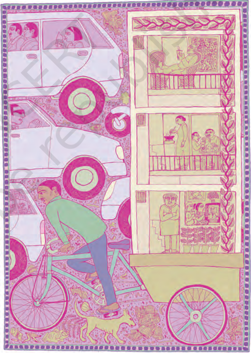
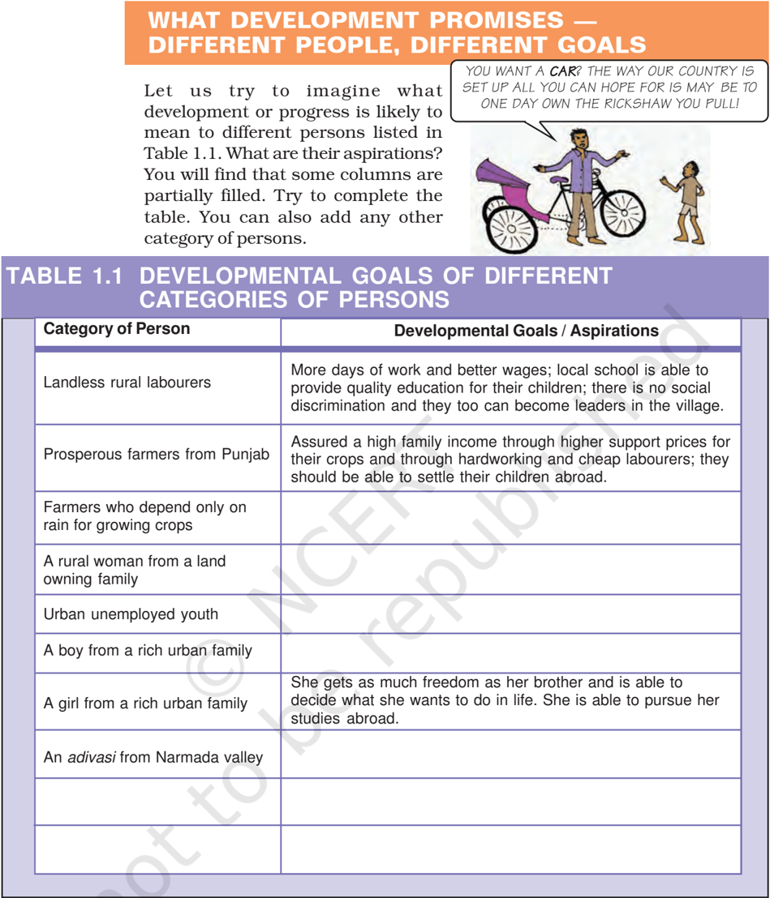
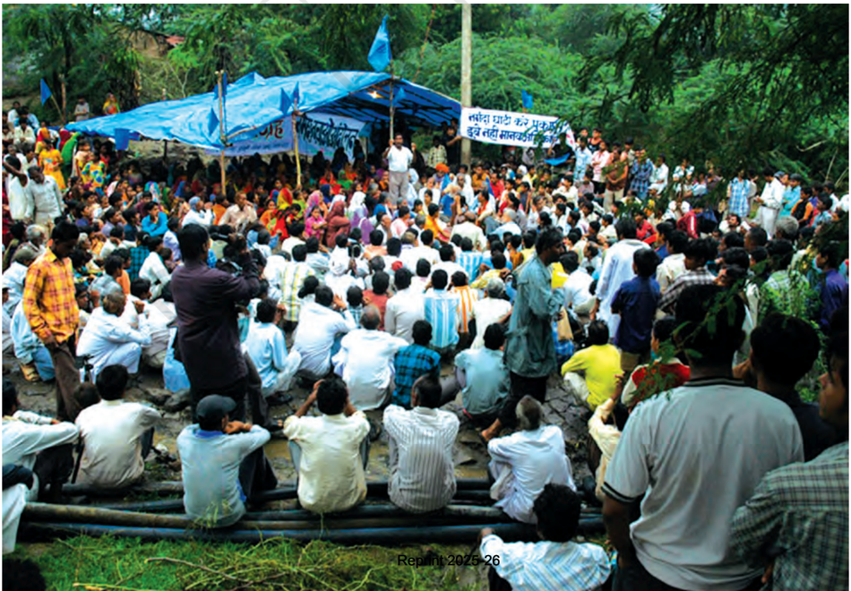
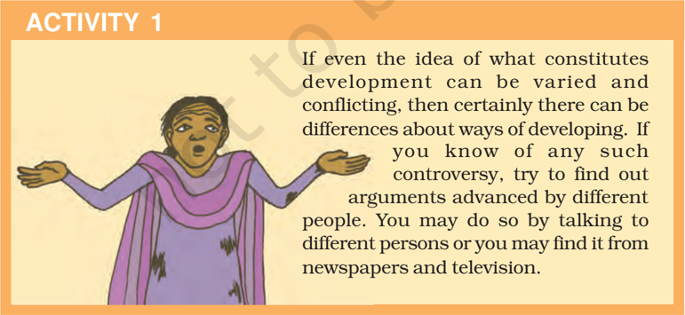
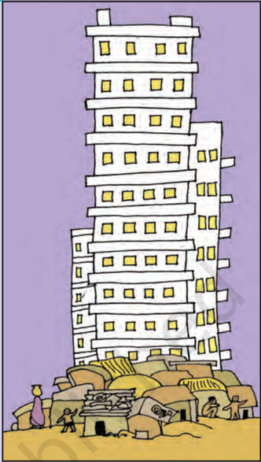
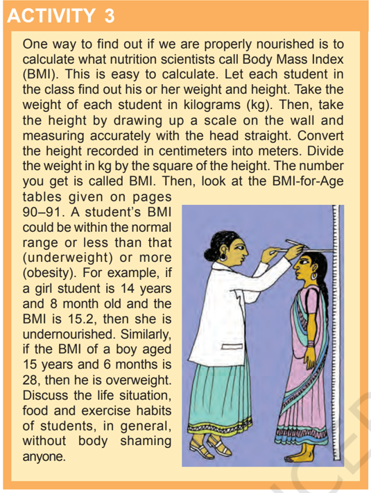
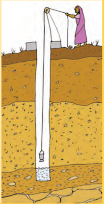
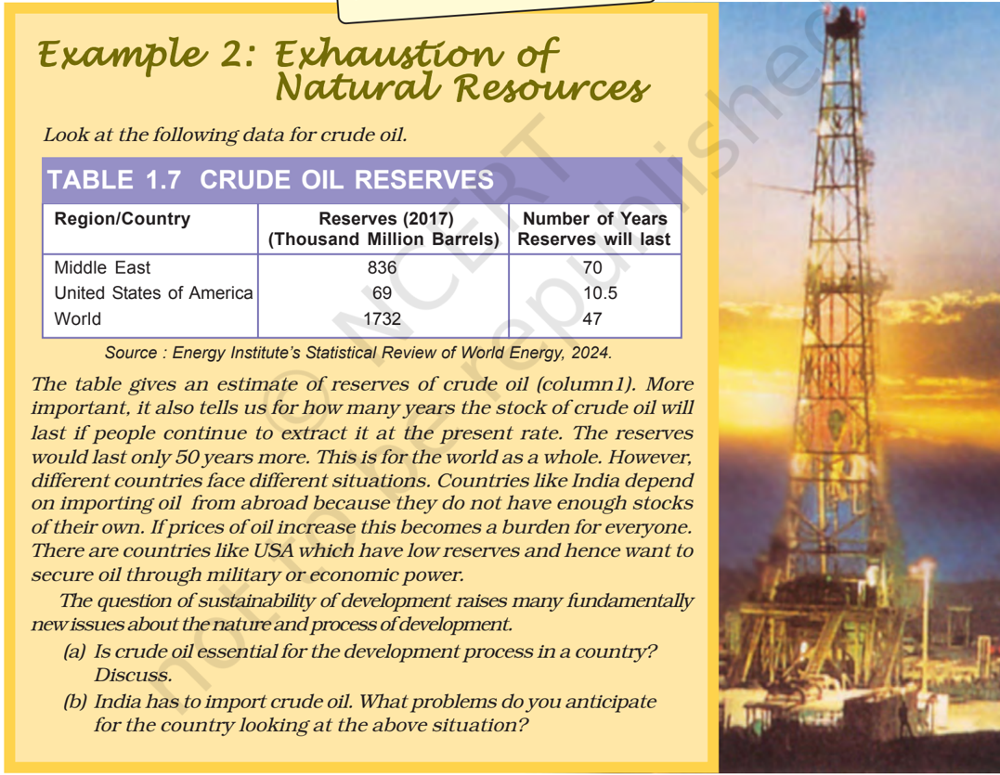

# PAGE 1

## NOTES FOR TEACHERS NOTES FOR THE TEACHER

## CHAPTER I : DEVELOPMENT

Development has many aspects. The purpose  of  this  chapter  is  to  enable students to understand this idea. They have  to  understand  that  people  have different perspectives on development and there are ways by which we can arrive at common indicators for development. To do this, we have used situations that they can respond to in an intuitive manner; we have also presented analysis that is more complex and macro in nature.

enable better understanding of the themes discussed by bringing the learners closer to their real life situations.

How  can  countries  or  states  be compared using some selected development  indicators  is  another question  that  students  would  read about  in  this  chapter.  Economic development  can  be  measured  and income  is  the  most  common  method for  measuring  development.  However, the  income  method,  though  useful, has  several  weaknesses.  Hence,  we need newer ways of looking at development using indicators of quality  of  life  and  environmental sustainability.

It  is  necessary for you to expect the students  to  respond  actively  in  the classroom and on a topic such as the above, there would be wide variation in opinion and possibility of debate. Allow students to argue their point of view. At the end of each section there are a few questions and activities. These serve two purposes:  first,  they  recap  the  ideas discussed in the section and second, they

There are certain terms used in this chapter that would require clarification Per Capita Income, Literacy Rate, Infant Mortality  Rate,  Attendance  Ratio,  Life Expectancy, Gross Enrolment Ratio, and Human Development Index. Though data pertaining  to  these  terms  are  provided, these would need further explanation. You may also need to clarify the concept of Purchasing Power Parity that is used to calculate Gross National Income per capita in Table 1.6. It is necessary to keep in mind that these terms are used as an aid to the discussion  and  not  something  to  be memorised.

## Sources for Information

The data for this chapter is taken from reports published by the Government of India  ( Economic Survey ,  Reports  of  the National  Family  Health  Survey  and Handbook of Statistics  on  the  Indian Economy), United Nations Development Programme ( Human Development Report ) and  World  Bank  ( World  Development Indicators ).  Many  of  these  reports  are published every year. It may be interesting to  look  up  these  reports  if  they  are available in your school library. If not, you may log  on  to  the  websites  of  these institutions (www.budgetindia.nic.in, www.undp.org,www.worldbank.org, www.rbi.org).

# PAGE 2

The idea of development or progress has always been with us. We have aspirations or desires about what we would like to do and how we would like to live. Similarly, we have ideas about what a country should be like. What are the essential things that we require? Can life be better for all? How should people live together? Can there be  more  equality?  Development involves  thinking  about  these questions  and  about  the  ways  in which we can work towards achieving these  goals.  This  is  a  complex task  and  in  this  chapter  we  shall make a beginning at understanding development.  You  will  learn  more about these issues in greater depth in higher classes. Also, you will find answers to many of these questions not just in economics but also in your course in history and political science. This is because the way we live today is  influenced by the past. We can't desire for change without being aware of this. In the same way, it is only through  a  democratic  political process  that  these  hopes  and possibilities  can  be  achieved  in real life.

'Without me they cannot develop... in this system I cannot develop!'

D DEVELOPMENT

3 3

# PAGE 3

| Category of Person                                | Developmental Goals / Aspirations                                                                                                                                                           |
|---------------------------------------------------|---------------------------------------------------------------------------------------------------------------------------------------------------------------------------------------------|
| Landless rural labourers                          | More days of work and better wages; local school is able to provide quality education for their children; there is no social discrimination and they too can become leaders in the village. |
| Prosperous farmers from Punjab                    | Assured a high family income through higher support prices for their crops and through hardworking and cheap labourers; they should be able to settle their children abroad.                |
| Farmers who depend only on rain for growing crops |                                                                                                                                                                                             |
| A rural woman from a land owning family           |                                                                                                                                                                                             |
| Urban unemployed youth                            |                                                                                                                                                                                             |
| A boy from a rich urban family                    |                                                                                                                                                                                             |
| A girl from a rich urban family                   | She gets as much freedom as her brother and is able to decide what she wants to do in life. She is able to pursue her studies abroad.                                                       |
| An adivasi from Narmada valley                    |                                                                                                                                                                                             |

Having filled Table 1.1, let us now examine it. Do all of these persons have the same notion of development or progress? Most likely not.  Each one of them seeks different things.

They  seek  things  that  are  most important for them, i.e., that which can fulfil their aspirations or desires. In  fact,  at  times,  two  persons  or groups of persons may seek things

U UNDERSTANDING  E ECONOMIC  D DEVELOPMENT

4 4

# PAGE 4

which are conflicting.  A girl expects as much freedom and opportunity as her brother, and that he also shares in the household work. Her brother may not like this.  Similarly, to get more electricity,  industrialists  may want  more  dams.    But  this  may submerge the land and disrupt the lives of people who are displaced - such as tribals. They might resent this and may prefer small check dams or tanks to irrigate their land.

So, two things are quite clear: one, different  persons  can  have different developmental goals and two , what may be development for one may not be development for the  other.  It  may  even  be destructive for the other.

## INCOME AND OTHER GOALS

If you go over Table 1.1 again, you will notice one common thing: what people desire are regular work, better wages, and decent price for their crops or other products that they produce. In  other  words,  they  want  more income.

Besides seeking more income, oneway or the other, people also seek things like equal treatment, freedom, security, and respect of others. They resent discrimination. All these are important goals. In fact, in some cases, these may be more important than

THOSE  PEOPLE DON'T WANT TO DEVELOP!

A demonstration meeting against raising the height of Sardar Sarovar Dam on Narmada River more income or more consumption because material goods are not all that you need to live.

Money, or material things that one can buy with it, is one factor on which our life depends. But the quality of our life  also  depends  on  non-material things mentioned above.  If it is not obvious to you, then just think of the role of your friends in your life. You may desire their friendship.  Similarly, there are many things that are not easily measured but they mean a lot to our lives. These are often ignored.

# PAGE 5

However, it will be wrong to conclude that what cannot be measured is not important.

Consider another example. If you get  a  job  in  a  far  off  place,  before accepting it you would try to consider many factors,  apart  from  income, such as facilities  for  your  family, working atmosphere, or opportunity to learn. In another case, a job may give you less pay but may offer regular employment  that  enhances  your sense  of  security.  Another  job, however, may offer high pay but no job security and also leave no time for your family.  This  will  reduce  your sense of security and freedom.

## LET'S WORK THESE OUT

1. Why do different persons have different notions of development? Which of the following explanations is more important and why?
2. (a) Because people are different.
3. (b) Because life situations of persons are different.
2. Do the following two statements mean the same? Justify your answer.
5. (a) People have different developmental goals.
6. (b) People have conflicting developmental goals.
3. Give some examples where factors other than income are important aspects of our lives.
4. Explain some of the important ideas of the above section in your own words.

## NATIONAL DEVELOPMENT

If, as we have seen above, individuals seek different goals, then their notion of national development is also likely to  be  different.  Discuss  among yourselves on what India should do for development.

Most likely,  you  would  find  that different students in the class have given different answers to the above question. In  fact,  you  might  yourself  think  of many different answers and not be too sure  of  any  of  these. It  is  very important to keep in mind that

## 6 6 UNDERSTANDING  E

different  persons  could  have different  as  well  as  conflicting notions of a country's development.

However,  can  all  the  ideas  be considered equally important? Or, if there  are  conflicts  how  does  one decide? What would be a fair and just path for all?  We also have to think whether there is a better way of doing things. Would the idea benefit a large number of people or only a small group?  National development means thinking about these questions.

## U ECONOMIC  D DEVELOPMENT

Similarly,  for  development, people look at a mix of goals . It is true that if women are engaged in paid work, their dignity in the household and society increases. However, it is also the case that if there is respect for  women  there  would  be  more sharing  of  housework  and  a greater  acceptance  of  women working outside. A safe and secure environment may allow more women to take up a variety of jobs or run a business.

Hence, the developmental goals that people have are not only about better income but also about other important things in life.

# PAGE 6

## LET'S WORK THESE OUT

## Discuss the following situations:

1. Look at the picture on the right. What should be the developmental goals for such an area?
2. Read this newspaper report and answer the questions that follow:

A  vessel  dumped  500  tonnes of  liquid  toxic  wastes  into open-air dumps in a city and in  the  surrounding  sea.  This happened  in  a  city  called Abidjan  in  Ivory  Coast,  a country  in  Africa.  The  fumes from  the  highly  toxic  waste caused nausea, skin rashes, fainting, diarrhoea etc. After a month  seven  persons  were dead,  twenty  in  hospital  and twenty  six  thousand  treated for symptoms of poisoning.

A  multinational  company dealing  in  petroleum  and metals had contracted a local company of the Ivory Coast to dispose  the  toxic  waste  from its  ship.

- (i) Who are the people who benefited and who did not?
- (ii) What should be the developmental goal for this country?
3. What can be some of the developmental goals for your village, town or locality?

D DEVELOPMENT

7 7

# PAGE 7

## HOW TO COMPARE DIFFERENT COUNTRIES OR STATES?

You might ask if development can mean different things, how come some countries  are  generally  called developed  and  others  underdeveloped?  Before we come to this, let us consider another question.

When we compare different things, they could have similarities as well as differences. Which aspects do we use to  compare  them?  Let  us  look  at students in the class itself.  How do we compare different students?  They differ in their height, health, talents and interests. The healthiest student may not be the most studious one. The most intelligent student may not be the friendliest one.  So, how do we compare students? The criterion we may use depends on the purpose of comparison.  We use different criterion to  choose a sports team, a debate team, a music team or a team to organise a picnic.  Still, if for some purpose,  we  have  to  choose  the criterion for the all-round progress of children in the class, how shall we do it?

Usually  we  take  one  or  more important  characteristics  of persons and compare them based on  these  characteristics. Of course, there can be differences about what are important characteristics that  should  form  the  basis  of comparison: friendliness and spirit of cooperation,  creativity  or  marks secured?

This is true of development too. For  comparing  countries,  their income is considered to be one of the  most  important  attributes. Countries with higher income are more developed than others with less income.  This  is  based  on  the understanding that  more  income means more of all things that human beings need.  Whatever people like, and should have, they will be able to get with greater income. So, greater income itself is considered to be one important goal.

Now,  what  is  the  income  of  a country? Intuitively, the income of the country  is  the  income  of  all  the residents of the country.  This gives us the total income of the country.

However, for comparison between countries, total income is not such an useful measure. Since, countries have different populations, comparing total income will not tell us what an average person is likely to earn. Are people in one country better off than others in a different country? Hence, we compare the average income which is the total income of the country divided by its total population. The average income is also called per capita income.

In  World  Development  Reports, brought out by the World Bank, this criterion  is  used  in  classifying countries. Countries with per capita income of US$ 63,400 per annum and above in 2023, are called high income or rich countries and those with  per  capita  income  of  about US$  2400  or  less  are  called low-income countries. India comes in the category of low middle income countries  because  its  per  capita income  in  2023  was  just  about US$ 10030 per annum. The rich countries,  excluding  countries  of Middle East and certain other small countries,  are  generally  called developed countries.

# PAGE 8

## Average Income Average Income Average Income Average Income

## While 'averages' are useful for comparison, they also hide disparities

For example, let us consider two countries, A and B.  For the sake of simplicity, we have assumed that they have only five citizens each.  Based on data given in Table 1.2, calculate the average income for both the countries.

## TABLE 1.2 COMPARISON OF TWO COUNTRIES

| Country   | Monthly incomes of citizens (in Rupees)   | Monthly incomes of citizens (in Rupees)   | Monthly incomes of citizens (in Rupees)   | Monthly incomes of citizens (in Rupees)   | Monthly incomes of citizens (in Rupees)   | Monthly incomes of citizens (in Rupees)   |
|-----------|-------------------------------------------|-------------------------------------------|-------------------------------------------|-------------------------------------------|-------------------------------------------|-------------------------------------------|
|           | I                                         | II                                        | III                                       | IV                                        | V                                         | Average                                   |
| Country A | 9500                                      | 10500                                     | 9800                                      | 10000                                     | 10200                                     |                                           |
| Country B | 500                                       | 500                                       | 500                                       | 500                                       | 48000                                     |                                           |

Will you be equally happy to live in both these countries? Are both equally developed? Perhaps some of us may like to live in country B if we are assured of being its fifth citizen but if it is a lottery that decides our  citizenship  number  then perhaps most of us will prefer to live  in  country  A.  Even  though both the countries have identical average  income,  country  A  is preferred  because  it  has  more equitable  distribution.    In  this country people are neither very rich nor extremely poor. On the other  hand  most  citizens  in country  B  are  poor  and  one person is extremely rich. Hence, while average income is useful for comparison it does not tell us how this income is distributed among people.

## LET'S WORK THESE OUT

1. Give three examples where an average is used for comparing situations.
2. Why do you think average income is an important criterion for development? Explain.
3. Besides size of per capita income, what other property of income is important in comparing two or more societies?
4. Suppose records show that the average income in a country has been increasing over a period of time. From this, can we conclude that all sections of the economy have become better? Illustrate your answer with an example.
5. From the text, find  out  the  per  capita  income  level  of  about  10-15  low-income countries as per World Development Reports.
6. Write a paragraph on your notion of what should India do, or achieve, to become a developed country.

D DEVELOPMENT D DEVELOPMENT

WE MADE THE CHAIRS AND HE TOOK THEM.

# PAGE 9

## INCOME AND OTHER CRITERIA

When we looked at individual  aspirations  and goals, we found that people not  only  think  of  better income but also have goals such as security , respect for others,  equal  treatment, freedom,  etc.  in  mind. Similarly , when we think of a nation or a region, we may , besides  average  income, think  of  other  equally important attributes.

## TABLE 1.3 PER CAPITA INCOME OF SELECT STATES

| State                | Per Capita Income for 2021-22 (in Rs)   |
|----------------------|-----------------------------------------|
| Haryana Kerala Bihar | 2,64,729 2,34,405 47,498                |

Source : Economic Survey 2020-21, P.A 29.

What could these attributes be? Let us examine this through an example. Table 1.3 gives the per capita income of  Haryana, Kerala  and Bihar. Actually, these figures are of Per Capita Net State Domestic Product at Current Prices for 2021-22. Let us ignore what this complicated term exactly means. Roughly , we can take it to be the per capita income of the state. We find that of the three, Haryana has the highest per capita income and Bihar is at the bottom. This means that, on an average, a  person  in  Haryana  earned Rs 2,64,729 in one year whereas, on an average, a person in Bihar earned only around Rs 47,500. So, if per capita income were to be used as the measure of development, Haryana will be considered the most developed and Bihar the least developed state of the three. Now, let us look at certain other data pertaining to these states given in Table 1.4.

## TABLE 1.4 SOME COMPARATIVE DATA ON HARYANA, KERALA  AND BIHAR

| State   |   Infant Mortality Rate per 1,000 live births (2020) |   Literacy Rate % 2017-18 |   Net Attendance Ratio (per 100 persons) secondary stage (aged 15-17 years) 2017-18 |
|---------|------------------------------------------------------|---------------------------|-------------------------------------------------------------------------------------|
| Haryana |                                                   28 |                        82 |                                                                                  73 |
| Kerala  |                                                    6 |                        94 |                                                                                  94 |
| Bihar   |                                                   27 |                        62 |                                                                                  69 |

Sources : Economic Survey 2023-24, National Sample Survey Organisation (Report No. 585), National  Statistical  Office,  Government  of  India;  National  Family  Health  Survey  (NFHS-5) 2019-21 IIPS, Mumbai.

Explanation of some of the terms used in this table:

Infant Mortality Rate (or IMR ) indicates the number of children that die before the age of  one year  as a proportion of 1000 live children born in that particular year.

Literacy Rate measures the proportion of literate population in the 7-and-above age group. Net Attendance Ratio is the total number of children of age group of 15-17 years attending school as a percentage of total number of children in the same age group.

# PAGE 10

What does this table show?  The first column of the table shows that in Kerala, out of 1000 children born, 6 died before completing one year of age but in Haryana the proportion of children dying within one year of birth was 28, which is nearly three times more than that of Kerala. On the other hand,  the  per  capita  income  of Haryana is more than that of Kerala as shown in Table 1.3. Just think of how dear you are to your parents, think of how every one is so happy when a child is born.  Now, try to think of parents whose children die before they even celebrate their first birthday. How painful  it  must  be  to  these parents?  Next, note the year to which this data pertains. This was during 2018.  So we are not talking of old times; it is  70 years after independence when our metro cities are full of high rise buildings and shopping malls!

## PUBLIC FACILITIES

How is it that the average person in Haryana has more income than the average person in Kerala but lags behind in these crucial areas? The reason is money in your pocket cannot buy all the goods and services that you may need to live well. So, income by itself is not a completely adequate indicator of  material  goods  and services that citizens are able to use. For example, normally , your money cannot  buy  you  a  pollution-free environment or ensure that you get unadulterated medicines, unless you can afford to shift to a community that already has all  these  things.    Money  may also not be able to protect you from infectious diseases, unless the whole of your community takes preventive steps.

The problem does not end with Infant  Mortality  Rate.  The  last column  of  table  1.4  shows  that about one-third of the children aged 15-17  years  in  Bihar  are  not attending  school  in  secondary classes. This means that if you went to school in Bihar nearly one-third of  your  class  friends  would  be missing. Those who could have been in school are not there! If this had happened to you, you would not be able to read what you are reading now .

Most babies  require  basic  healthcare

Actually for many of the important things in life the best way , also the cheapest way, is to  provide  these goods and services collectively. Just think  -  will  it  be  cheaper  to  have collective  security  for  the  whole locality or for each house to have its own security staff?  What if no one, other than you, in your village or locality is interested in studying? W ould you be able to study? Not unless your parents could afford to send you to some private school elsewhere.  So you are actually able  to  study  because  many  other children also want to study and because many people believe that  the  government should open schools and provide other facilities  so  that  all  children  have  a  chance to  study .  Even  now ,  in  many  areas, children, particularly girls, are not able to  go  to  high  school  because  the government/society has not provided adequate facilities.

D DEVELOPMENT

11

11

# PAGE 11

Kerala has a low Infant Mortality Rate  because  it  has  adequate provision  of  basic  health  and educational facilities.  Similarly , in some states, the Public Distribution

## LET'S WORK THESE OUT

1. Look at data in Tables 1.3 and 1.4. Is Haryana ahead of Kerala in literacy rate etc., as it is in terms of per capita income?
2. Think of other examples where collective provision of goods and services is cheaper than individual provision.
3. Does availability of good health and educational facilities depend only on amount of money spent by the government on these facilities? What other factors could be relevant?
4. In a study, it was found that in Tamil Nadu, 90 per cent of the people living in rural areas used a ration shop, whereas in West Bengal only 35 per cent of rural people did so. Where would people did better off and why?

## ACTIVITY 2

Study Table 1.5 carefully and fill in the blanks in the following paragraphs.  For this, you may need to make calculations based on the table.

## TABLE 1.5 EDUCATIONAL ACHIEVEMENT OF RURAL POPULATION OF UTTAR PRADESH

| Category                                                  | Male   | Female   |
|-----------------------------------------------------------|--------|----------|
| Literacy rate for rural population                        | 76%    | 54%      |
| Literacy rate for rural children in age group 10-14 years | 90%    | 87%      |
| Percentage of rural children aged 10-14 attending school  | 85%    | 82%      |

- (a) The literacy rate for all age groups, including young and old, is  \_\_\_\_\_  for rural males and  \_\_\_\_\_  for rural  females.  However,  it  is  not  just  that  these  many adults could not attend school but that there are  \_\_\_\_\_  who are currently not in school.
- (b) It is clear from the table that  \_\_\_\_\_  % of rural girls and  \_\_\_\_\_ % of rural boys are not attending school. Therefore, illiteracy among children in the age group 1014 is as high as  \_\_\_\_\_ % for rural females and  \_\_\_\_\_ % for rural males.
- (c) This high level of illiteracy among  \_\_\_\_\_\_\_\_\_\_  age group, even after more than 75 years of our independence, is most disturbing. In many other states also we are nowhere near realisation of the constitutional goal of free and compulsory education for all children up to the age of 14, which was expected to be achieved by 1960.

U UNDERSTANDING  E ECONOMIC  D DEVELOPMENT

12

12

System (PDS) functions well.  Health and nutritional status of people of such states is certainly likely to be better .

# PAGE 12

## HUMAN HUMAN   DEVELOPMENT DEVELOPMENT REPOR REPORT T

Once it is realised that even though the level of income is important, yet it is an inadequate measure of the level of development, we begin to think of other criterion. There could be a long list of such criterion but then it would not be so useful. What we need is a small number of the most important things.  Health  and  education indicators, such as the ones we used in comparison of Kerala and Haryana, are among them. Over the past decade or so, health and education indicators have come to be widely used along with  income  as  a  measure  of development. For instance, Human Development Report published by UNDP compares countries based on the educational levels of the people, their  health  status  and  per  capita income. It would be interesting to look at  certain  relevant  data  regarding India and its neighbours from Human Development Report 2023-24.

## TABLE 1.6 SOME DATA REGARDING INDIA AND ITS NEIGHBOURS FOR 2022

| Country    | Gross National Income (GNI) per capita (2017 PPP $)   |   Life Expectancy at birth |   Mean Years of Schooling of People aged 25 and above |   HDI Rank in the world (2021-22) |
|------------|-------------------------------------------------------|----------------------------|-------------------------------------------------------|-----------------------------------|
| Sri Lanka  | 11,899                                                |                       76.6 |                                                  11.2 |                                78 |
| India      | 6,951                                                 |                       67.7 |                                                   6.5 |                               134 |
| Myanmar    | 4,038                                                 |                       67.3 |                                                   6.5 |                               144 |
| Pakistan   | 5,374                                                 |                       66.4 |                                                   4.4 |                               164 |
| Nepal      | 4,026                                                 |                       70.5 |                                                   4.5 |                               146 |
| Bangladesh | 6,511                                                 |                       73.7 |                                                   7.4 |                               129 |

Source : Human Development Report, 2023-24, United Nations Development Programme, New York.

## NOTES

1. HDI stands for Human Development Index. HDI ranks in above table are out of 193 countries in all.
2. Life Expectancy at birth denotes, as the name suggests, average expected length of life of a person at the time of birth.
3. Per Capita Income is calculated in dollars for all countries so that it can be compared. It is also done in a way so that every dollar would buy the same amount of goods and services in any country.

D DEVELOPMENT

# PAGE 13

Isn't  it  surprising  that  a  small country in our neighbourhood, Sri Lanka, is much ahead of India in every respect and a big country like ours has such a low rank in the world? Table 1.6 also shows that though Nepal and Bangladesh  have  low  per  capita income than that of India, yet they are better than India in life expectancy.

Many improvements have been suggested  in  calculating  HDI  and many new components have been added to the Human Development Report but, by pre-fixing Human to Development, it has made it very clear that what is important in development is what is happening to citizens of a country.  It is people, their health, their well being, that is most important.

Do you think there are certain other  aspects  that  should  be considered  in  measuring  human development?

## SUSTAINABILITY OF DEVELOPMENT

Suppose  for  the  present  that  a particular country is quite developed. We would certainly like this level of development to go up further or at least  be  maintained  for  future generations.  This  is  obviously desirable.  However, since the second half of the twentieth century, a number of scientists have been warning that the  present  type,  and  levels,  of development are not sustainable.

LET'S UNDERSTAND WHY THIS IS SO THROUGH THE FOLLOWING EXAMPLE:

## Example 1: Groundwater in India Example 1: Groundwater in India Example 1: Groundwater in India Example 1: Groundwater in India

'Recent evidence suggests that the groundwater is under serious threat of overuse in many parts of the country. About 300 districts have reported a water level decline of over 4 metres during the past 20 years. Nearly one-third of the country is overusing their groundwater reserves. In another 25 years, 60 per cent of the country would be doing the same if the present way of using this resource continues. Groundwater overuse is particularly found in the agriculturally prosperous regions of Punjab and Western U.P., hard rock plateau areas of central and south India, some coastal areas and the rapidly growing urban settlements.'

- (a) Why groundwater is overused?
- (b) Can there be development without overuse?

U UNDERSTANDING  E ECONOMIC  D DEVELOPMENT

'We have not inherited the  world  from  our forefathers - we have borrowed  it  from  our children.'

# PAGE 14

Groundwater is an example of renewable resources. These resources are replenished by nature as in the case of crops and plants. However, even  these  resources  may  be overused. For example, in the case of groundwater, if  we  use  more  than what is being replenished by rain then we would be overusing this resource.

Non-renewable resources are those which will get exhausted after a few years of use. We have a fixed stock on earth which cannot be replenished. We do discover new resources that we did not know of earlier . New sources in this way add to the stock. However, over time, even this will get exhausted.

FOR EXAMPLE, CRUDE OIL THAT WE EXTRACT FROM THE EARTH IS A NONRENEWABLE RESOURCE. HOWEVER WE MAY FIND A SOURCE OF OIL THAT WE DID NOT KNOW OF EARLIER. EXPLORATIONS ARE BEING UNDERTAKEN ALL THE TIME.

| Region/Country           |   Reserves (2017) (Thousand Million Barrels) |   Number of Years Reserves will last |
|--------------------------|----------------------------------------------|--------------------------------------|
| Middle East              |                                          836 |                                 70   |
| United States of America |                                           69 |                                 10.5 |
| World                    |                                         1732 |                                 47   |

D DEVELOPMENT

# PAGE 15

Consequences of environmental degradation do not respect national or  state  boundaries;  this  issue  is no longer region or nation specific. Our  future  is  linked  together. Sustainability  of  development  is comparatively  a  new  area  of knowledge  in  which  scientists, economists, philosophers and other

## EXERCISES

1. Development of a country can generally be determined by
2. (i) its  per  capita  income
3. (ii) its average literacy level
4. (iii) health status of its people
5. (iv) all the above
2. Which of the following neighbouring countries has better performance in terms of human development than India?
7. (i) Bangladesh
8. (ii) Sri Lanka
9. (iii) Nepal
10. (iv) Pakistan
3. Assume there are four families in a country. The average per capita income of these families is Rs 5000. If the income of three families is Rs  4000, Rs 7000 and Rs 3000 respectively, what is the income of the fourth family?
12. (i) Rs 7500
13. (ii) Rs 3000
14. (iii) Rs 2000
15. (iv)
16. Rs 6000
4. What  is  the  main  criterion  used  by  the  World  Bank  in  classifying  different countries? What are the limitations of this criterion, if any?
5. In what respects is the criterion used by the UNDP for measuring development different from the one used by the World Bank?
6. Why do we use averages? Are there any limitations to their use? Illustrate with your own examples related to development.
7. Kerala, with lower per capita income has a better human development ranking than Haryana. Hence, per capita income is not a useful criterion at all and  should not be used to compare states. Do you agree? Discuss.
8. Find out the present sources of energy that are used by the people in India. What could be the other possibilities fifty years from now?
9. Why is the issue of sustainability important for development?

UNDERSTANDING  E

U

DEVELOPMENT

ECONOMIC  D

social  scientists  are  working together.

In  general,  the  question  of development or progress is perennial. At all times as a member of society and as individuals we need to ask where we want to go, what we wish to become and what our goals are. So the debate on development continues.

# PAGE 16

10. 'The Earth has enough resources to meet the needs of all but not enough to satisfy  the  greed  of  even  one  person'.  How  is  this  statement  relevant  to  the disscusion of development? Discuss.
11. List a few examples of environmental degradation that you may have observed around you.
12. For each of the items given in Table 1.6, find out which country is at the top and which is at the bottom.
13. The following table shows the proportion of adults (aged 15-49 years) whose BMI is  below  normal  (BMI  &lt;18.5  kg/m 2 ) in  India.  It  is  based  on  a  survey  of  various states for the year 2019-21. Look at the table and answer the following questions.
5. (i)  Compare the nutritional level of people in Kerala and Madhya Pradesh.
6. (ii) Can  you  guess  why  around  one-fifth  of  people  in  the  country  are undernourished even though it is argued that there is enough food in the country? Describe in your own words.

Source:  National  Family  Health  Survey-5, 2019-21, http://rchiips.org

| State          |   Male (%) |   Female (%) |
|----------------|------------|--------------|
| Kerala         |        8.5 |           10 |
| Karnataka      |       17   |           21 |
| Madhya Pradesh |       28   |           28 |
| All States     |       20   |           23 |

## ADDITIONAL PROJECT / ACTIVITY

Invite three different speakers to talk to you about the development of your region. Ask them all the questions that come to your mind. Discuss these ideas in groups. Each group should prepare a wall chart, giving reasons about ideas that you  agree or do not agree with.

