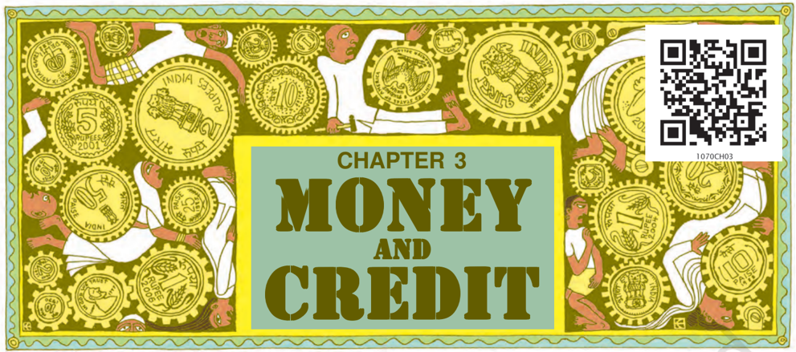
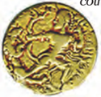
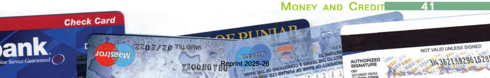
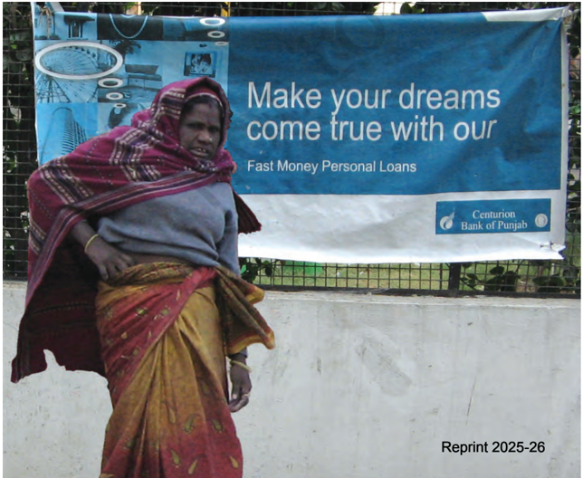
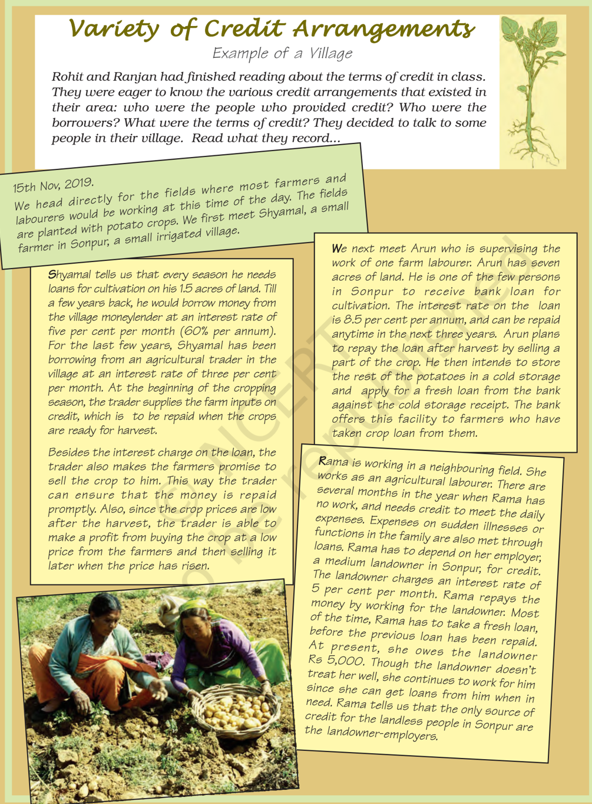
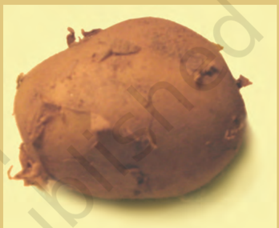
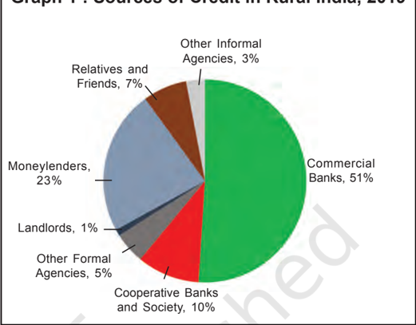
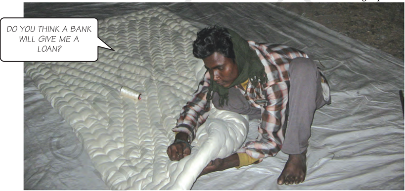

# PAGE 1

## NOTES  FOR  THE  TEACHER

## CHAPTER 3 : MONEY AND CREDIT

Money is a fascinating subject and full of curiosities.  It  is  important  to  capture  this element  for  the  students.  The  history  of money and how various forms were used at different times is an interesting story. At this stage  the  purpose  is  to  allow  students  to realise  the  social  situation  in  which  these forms were used. Modern forms of money are linked  to  the  banking  system.  This  is  the central idea of the first part of the chapter.

The  present  situation  in  India,  where newer forms of money are slowly spreading with computerisation of the banking system, offers  many  opportunities  to  students  to explore on their own. We need not get into a formal discussion of the 'functions of money' but let it come up as questions. There are certain areas that are not covered, such as 'creation of money' (money multiplier) or the backing of the modern system that may be discussed if you desire.

As you would see in the chapter , the stock of  money consists of currency held by the public and the demand deposits that they hold with the banks. This is the money that people can use as they wish and the government has to  ensure  that  the  system  works  smoothy. What would happen when the government declares that some of the currency notes used by people would be made invalid and would be replaced by new currency? In India, during November  2016,  currency  notes  in  the denomination of Rs. 500 and Rs. 1,000 were declared  invalid.  People  were  asked  to surrender these notes to the bank by a specific period and receive new Rs. 500, Rs. 2,000 or other  currency  notes.  This  is  known  as 'demonetisation'. Since then, people were also encouraged to use their bank deposits rather than cash for transactions. Hence, digital transactions started by using bank-to-bank transfer  through  the  internet  or  mobile phones, cheques, ATM cards, credit cards, and Point of Sale (POS) swipe machines at shops.  This  is  promoted  to  reduce  the requirement of cash for transactions and also control corruption. Students could be asked to  debate on the process and the impact of demonetisation. They can be guided to make a collage of the major areas where people use digital  and  cash  transactions  which  are legitimate and legal. They can also discuss the transactions which are legal and why. It is also important to intimate students that different types of plastic cards are used in place of cash transactions but not all of them money per se .

Credit is a crucial element in economic life  and  it  is,  therefore,  important  to  first understand this in a conceptual manner. What are the aspects that one looks at in any credit arrangement and how this affects people is the main focus of the second part of the chapter. The world around us offers a tremendous variety of such arrangements and  it  would  be  ideal  to  explain  these aspects  of  credit  from  situations  that  are familiar to your students. The other crucial issue  of  credit  is  its  availability  to  all, especially  the  poor,  and  on  reasonable terms. We need to emphasise that this is a right of the people and without which a large section  of  them  would  be  kept  out  of  the development  process.  There  are  many innovative  interventions,  such  as  that  of Grameen Bank, of which students may be made familiar  with  but  it  is  important  to realise  that  we  don't  have  answers  to  all questions.  We  need  to  find  new  ways  and this  is  one  of  the  social  challenges  that developing countries face.

## Sources for Information

The data on formal and informal sector credit used  in  this  chapter  is  drawn  from  the survey on rural debt by the National Sample Survey  Organisation (All  India  Debt  and Investment  Survey,  77 th   Round  2019, conducted by NSSO) now known as National Statistical Office (NSO) . The information and data  on  Grameen  Bank  is  taken  from newspaper reports and websites. In order to get the details of bank-related statistics or a particular detail of a bank, you can log on to the websites of the Reserve Bank of India (www.rbi.org) and  the  concerned banks. Data on self-help groups is provided on  the  website  of  the  National  Bank  for Agriculture  and  Rural  Development (NABARD) (www.nabard.org).

# PAGE 2

## MONEY AS A MEDIUM OF EXCHANGE

The use of money spans a very large part of our everyday life. Look around you and you would easily be able to identify several transactions involving money in any single day. Can you make a list of these? In many of these transactions, goods are being bought and sold with the use of money. In some of these transactions, services are being exchanged with money.  For some, there might not be any actual transfer of money taking place now but a promise to pay money later.

Have you ever wondered why transactions  are  made  in money? The reason is simple.

difficult  it  would  be  if  the  shoe manufacturer  had  to  directly exchange shoes for wheat without the use of money. He would have to look for a wheat growing farmer who not

only wants to sell wheat but also wants to buy the shoes in exchange. That  is,  both  parties have to agree to

I DON'T NEED SHOES. I NEED CLOTHES.

sell  and  buy  each others  commodities.

This  is  known  as double  coincidence

of  wants. What  a  person desires to sell is exactly what the other wishes to buy. In a barter system  where  goods  are  directly exchanged without the use of money, double coincidence of wants is an essential feature.

I WANT SHOES. BUT I DON'T HAVE WHEAT.

A person holding money can easily exchange it  for  any  commodity  or service that he or she might want. Thus everyone  prefers  to  receive payments  in  money  and  then exchange the money for things that they want.  Take the case of a shoe manufacturer. He wants to sell shoes in the market and buy wheat.  The shoe manufacturer will first exchange shoes  that  he  has  produced  for money, and then exchange the money for wheat. Imagine how much more

In contrast, in an economy where money is in use, money by providing the  crucial  intermediate  step eliminates  the  need  for  double coincidence of wants. It is no longer necessary for the shoe manufacturer to look for a farmer who will buy his shoes and at the same time sell him

M MONEY    AND  C CREDIT

39 39

# PAGE 3

wheat. All he has to do is find a buyer for his shoes. Once he has exchanged his shoes for money, he can purchase wheat or any other commodity in the market.  Since  money  acts  as  an intermediate in the exchange process, it is called a medium of exchange .

## LET'S WORK THESE OUT

1. How does the use of money make it easier to exchange things?
2. Can you think of some examples of goods / services being exchanged or wages being paid through barter?

## MODERN FORMS OF  MONEY

Early punchmarked coins (may be 2500 years old)

Gupta coins

Modern coin

We  have  seen  that  money  is something that can act as a medium of exchange in transactions.  Before the introduction of coins, a variety of objects  was  used  as  money.  For example, since the very early ages, Indians used  grains and cattle as money. Thereafter came the use of metallic coins - gold, silver, copper coins - a phase which continued well into the last century.

## Currency

Modern  forms  of  money  include currency - paper notes and coins. Unlike the things that were used as money earlier, modern currency is not made of precious metal such as gold, silver and copper.  And unlike grain and  cattle,  they  are  neither  of everyday use. The modern currency is without any use of its own.

Then,  why  is  it  accepted  as  a medium of exchange?  It is accepted as a medium of exchange because the currency  is  authorised  by  the government of the country.

In India, the Reserve Bank of India issues currency notes on behalf of the central  government.  As  per  Indian law, no other individual or organisation  is  allowed  to  issue currency. Moreover, the law legalises the  use  of  rupee  as  a  medium  of payment that cannot be refused in settling  transactions  in  India.  No individual in India can legally refuse a payment made in rupees. Hence, the  rupee  is  widely  accepted  as  a medium of exchange.

## Deposits with Banks

The other form in which people hold money is as deposits with banks. At a point of time, people need only some currency  for their day-to-day needs. For instance, workers who receive their salaries at the end of each month have extra cash at the beginning of the month. What do people do with this extra cash? They deposit it with the  banks  by  opening  a  bank account in their name. Banks accept the deposits and also pay an amount as interest on the deposits. In this way people's  money  is  safe  with  the banks and it earns an amount as interest.    People  also  have  the provision to withdraw the money as and when they require. Since the deposits in the bank accounts can be withdrawn  on  demand,  these deposits are called demand deposits.

# PAGE 4

Demand deposits offer another interesting facility. It is this facility which  lends  it  the  essential characteristics of money (that of a medium of exchange). You would have  heard  of  payments  being

LET US TRY AND UNDERSTAND HOW CHEQUE PAYMENTS ARE MADE AND REALISED WITH AN EXAMPLE.

made by cheques instead of cash. For payment through cheque, the payer who has an account with the bank,  makes  out  a  cheque  for  a specific  amount.  A  cheque  is  a paper instructing the bank to pay a  specific  amount  from  the person's account to the person in whose name the cheque has been issued.

Thus we see that demand deposits share the essential features of money. The facility of cheques against demand deposits makes it possible to directly settle  payments without the use of cash. Since demand deposits are accepted widely as a means of payment, along with currency, they constitute money in the modern economy.

You must remember the role that the  banks  play  here.  But  for  the banks, there would be no demand deposits  and  no  payments  by cheques against these deposits.  The modern forms of money - currency and deposits - are closely linked to the working of the modern banking system.

# PAGE 5

## LET'S WORK THESE OUT

1. M. Salim wants to withdraw Rs 20,000 in cash for making payments. How would he write a cheque to withdraw money?
2. Tick the correct answer. After the transaction between Salim and Prem,
3. (i) Salim's balance in his bank account increases, and Prem's balance increases.
4. (ii) Salim's balance in his bank account decreases and Prem's balance increases.
5. (iii) Salim's balance in his bank account increases and Prem's balance decreases.
3. Why are demand deposits considered as money?

## LOAN ACTIVITIES OF BANKS

Let  us  take  the  story  of  banks further. What do the banks do with the deposits which they accept from the public? There is an interesting mechanism at work here. Banks keep only  a  small  proportion  of  their deposits as cash with themselves.  For example, banks in India these days hold  about  5  per  cent  of  their deposits  as  cash.  This  is  kept  as provision to pay the depositors who might come to withdraw money from the bank on any given day. Since, on any particular day, only some of its many depositors come to withdraw cash, the bank is able to manage with this cash.

Banks use the major portion of the deposits to extend loans.  There is a huge demand for loans for various economic activities. W e shall read more about this in the following sections. Banks make use of the deposits to meet the loan requirements of the people.  In this way, banks mediate between those who have surplus funds (the depositors) and those who are  in  need  of  these  funds  (the borrowers). Banks charge a higher interest rate on loans than what they offer  on  deposits.  The  difference between  what  is  charged  from borrowers  and  what  is  paid  to depositors  is  their  main  source  of income.

What do you think would happen if all the depositors went to ask for their money at the same time?

U UNDERSTANDING  E ECONOMIC  D DEVELOPMENT

# PAGE 6

## TWO DIFFERENT CREDIT SITUATIONS

A large number of transactions in our day-to-day activities involve credit in some form or the other. Credit (loan) refers to an agreement in which the lender supplies the borrower with money, goods or services in return for the promise of future payment. Let us see how credit works through the following two examples.

## (1)  Festival  Season (1)  Festival  Season (1)  Festival  Season (1)  Festival  Season

It is festival season two months from now and the shoe manufacturer, Salim, has received an order from a large trader in town  for  3,000  pairs  of  shoes  to  be delivered  in  a  month  time.  To  complete production on time, Salim has to hire a few more workers for stitching  and  pasting work.  He  has  to  purchase  the  raw materials. To meet these expenses, Salim obtains loans from two sources. First, he asks the leather supplier to supply leather now and promises  to  pay  him  later. Second, he obtains loan in cash from the large  trader  as  advance  payment  for 1000 pairs of shoes with a promise to deliver the whole order by the end of the month.

At the end of the month, Salim is able to deliver the order , make a good profit, and repay the money that he had borrowed.

In this case, Salim obtains credit to meet the working capital needs of production. The credit helps him to meet the ongoing expenses of production, complete production on time, and thereby increase his earnings. Credit therefore plays a vital and positive role in this situation.

## (2)  Swapna's  Problem (2)  Swapna's  Problem (2)  Swapna's  Problem (2)  Swapna's  Problem

Swapna, a small farmer, grows groundnut on her three acres of land. She takes a loan from the moneylender to  meet the expenses of cultivation, hoping that her harvest would help repay the loan. Midway through the season the crop is hit by pests and the crop fails.  Though  Swapna  sprays    her  crops  with expensive pesticides, it makes little difference. She is unable to repay the moneylender and the debt grows over the year into a large amount. Next year, Swapna takes a fresh loan for cultivation. It is a normal crop this year. But the earnings are  not  enough  to  cover  the  old  loan.

She is caught in debt. She has to sell a part of the land to pay off the debt.

M MONEY    AND  C CREDIT

# PAGE 7

In rural areas, the main demand for credit is for crop production. Crop production  involves  considerable costs on seeds, fertilisers, pesticides, water, electricity, repair of equipment, etc. There is a minimum stretch of three to four months between the time when the farmers buy these inputs and when they sell the crop. Farmers usually  take  crop  loans  at  the beginning of the season and repay the loan after harvest. Repayment of the loan  is  crucially  dependent  on  the income from farming.

## LET'S WORK THESE OUT

1. Fill the following table.
2. Supposing Salim continues to get orders from traders. What would be his position after 6 years?
3. What are the reasons that make Swapna's situation so risky? Discuss factors - pesticides; role of moneylenders; climate.

|                           | Salim   | Swapna   |
|---------------------------|---------|----------|
| Why did they need credit? |         |          |
| What was the risk?        |         |          |
| What was the outcome?     |         |          |

## TERMS OF CREDIT

Every loan agreement specifies an interest rate which the borrower must pay  to  the  lender  along  with  the

In Swapna's case, the failure of the crop made loan repayment impossible. She had to sell part of the land to repay the loan. Credit, instead of  helping  Swapna  improve  her earnings, left her worse off. This is an example of what is commonly called debt-trap. Credit in this case pushes the borrower into a situation from which recovery is very painful.

In one situation credit helps to increase earnings and therefore the person is better off than before. In another  situation,  because  of  the crop  failure,  credit pushes the person into a  debt  trap.  To  repay her loan she has to sell a portion of her land. She  is  clearly  much worse off than before. Whether credit  would be useful or not, therefore,  depends on  the  risks  in  the situation and whether there is some support, in case of loss.

repayment  of  the  principal.  In addition,  lenders  may  demand collateral  (security)  against  loans. Collateral  is  an  asset  that  the borrower  owns  (such  as  land, building,  vehicle,  livestocks, deposits with banks) and  uses this as  a  guarantee  to  a  lender  until the loan is repaid. If the borrower fails to repay the loan, the lender has the right to sell the asset or collateral to obtain payment. Property such as land  titles,  deposits  with  banks, livestock are some common examples of collateral used for borrowing.

# PAGE 8

## A House Loan A House Loan A House Loan A House Loan

Megha has taken a loan of Rs 5 lakhs from the bank  to purchase a house. The annual interest rate on the loan is 12 per cent and the loan is to be repaid in 10 years in monthly instalments. Megha had to submit to the bank, documents showing her employment records and salary before the bank agreed to give her the loan. The bank retained as collateral the papers of the new house,  which  will  be  returned  to  Megha  only when she repays the entire loan with interest.

## Fill the following details of Megha's housing loan.

Loan amount (in Rupees)

Duration of loan

Documents required

Interest rate

Mode of repayment

Collateral

Interest  rate,  collateral  and documentation requirement, and the mode of repayment together comprise what is called the terms of credit .  The terms of credit vary substantially from one credit arrangement to another. They  may  vary  depending  on  the nature of the lender and the borrower. The next section will provide examples of  the  varying  terms  of  credit  in different credit arrangements.

## LET'S WORK THESE OUT

1. Why do lenders ask for collateral while lending?
2. Given that a large number of people in our country are poor, does it in any way affect their capacity to borrow?
3. 3.
4. Fill  in  the blanks choosing the correct option from the brackets.

While taking a loan, borrowers look for easy terms of credit. This means \_\_\_\_\_\_\_\_\_\_ (low/high) interest rate, \_\_\_\_\_\_\_\_\_\_\_\_\_\_(easy/ tough) conditions for repayment, \_\_\_\_\_\_\_\_\_\_\_(less/more) collateral and documentation requirements.

M MONEY    AND  C CREDIT

45 45

# PAGE 9

# PAGE 10

## Loans from Cooperatives Loans from Cooperatives Loans from Cooperatives Loans from Cooperatives

Besides banks, the other major source of cheap credit in  rural  areas  are  the  cooperative  societies  (or cooperatives).    Members of  a  cooperative  pool  their resources for cooperation in certain areas. There are several  types  of  cooperatives  possible  such  as farmers  cooperatives,  weavers  cooperatives, industrial  workers  cooperatives,  etc.  Krishak Cooperative functions in a village not very far away from Sonpur. It  has  2300  farmers  as  members.  It accepts  deposits  from  its  members.  With  these deposits as collateral, the Cooperative has obtained a large loan from the bank. These funds are used to provide  loans  to  members.  Once  these  loans  are repaid, another round of lending can take place.

Krishak Cooperative provides loans for the purchase of  agricultural  implements,  loans  for  cultivation and  agricultural  trade,  fishery  loans,  loans  for construction  of  houses  and  for  a  variety  of  other expenses.

## LET'S WORK THESE OUT

1. List the various sources of credit in Sonpur.
2. Underline the various uses of credit in Sonpur in the above passages.
3. Compare the terms of credit for the small farmer, the medium farmer and the landless agricultural worker in Sonpur.
4. Why will Arun have a higher income from cultivation compared to Shyamal?
5. Can everyone in Sonpur get credit at a cheap rate? Who are the people who can?
6. Tick the correct answer.
7. (i) Over the years, Rama's debt
- will  rise.
- will  decline.
- will  remain  constant.
11. (ii) Arun is one of the few people in Sonpur to take a bank loan because
- other people in the village prefer to borrow from the moneylenders.
- banks demand collateral which everyone cannot provide.
- interest rate on bank loans is same as the interest rate charged by the  traders.
7. Talk to some people to find out the credit arrangements that exist in your area. Record your conversation. Note the differences in the terms of credit across people.

## M MONEY    AND  C CREDIT

# PAGE 11

## FORMAL SECTOR CREDIT IN INDIA

We  have  seen  in  the above  examples  that people obtain loans from various  sources.  The various  types  of  loans can  be  conveniently grouped  as formal sector loans and informal sector loans . Among the former are  loans  from  banks and cooperatives.  The informal lenders include moneylenders, traders, employers, relatives and friends, etc.  In Graph 1 you can see the various sources of credit to rural

Graph 1 : Sources of Credit in Rural India, 2019

households in India. Is more credit coming from the formal sector or the informal sector?

The  Reserve  Bank  of  India supervises the functioning of formal sources of loans.  For instance, we have seen that the banks maintain a minimum cash balance out of the deposits  they  receive.  The  RBI monitors  the  banks  in  actually maintaining cash balance. Similarly, the RBI sees that the banks give loans not just to profit-making businesses and  traders  but  also  to  small cultivators, small scale industries, to small  borrowers  etc.  Periodically, banks have to submit information to the  RBI  on  how  much  they  are lending, to whom, at what interest rate, etc.

BUT WHY SHOULD A BANK WANT US TO HAVE A HIGHER INCOME?

There  is  no  organisation  which supervises  the  credit  activities  of lenders in the informal sector. They can lend at whatever interest rate they

# PAGE 12

choose. There is no one to stop them from using unfair means to get their money back.

Compared to the formal lenders, most of the informal lenders charge a much higher interest on loans. Thus, the cost to the borrower of informal loans is much higher.

Higher cost of borrowing means a larger  part  of  the  earnings  of  the borrowers is used to repay the loan. Hence, borrowers have less income left  for  themselves  (as  we  saw  for Shyamal  in  Sonpur).  In  certain cases,  the  high  interest  rate  for borrowing can mean that the amount to  be  repaid  is  greater  than  the income of the borrower. This could lead to increasing debt (as we saw for Rama in Sonpur) and debt trap. Also, people who might wish to start an enterprise by borrowing may not do so  because  of  the  high  cost  of borrowing.

For  these  reasons,  banks  and cooperative  societies  need  to  lend more. This would lead to higher incomes and many people could then borrow  cheaply  for a variety of  needs.  They  could  grow  crops, do business, set up small-scale industries etc. They could set up new industries  or  trade  in  goods. Cheap and affordable credit is crucial for the country's development.

## Formal and Informal Credit: Who gets what?

Graph 2 shows the importance of formal and informal sources of credit for people in urban areas. The people are divided into four groups, from poor to rich, as shown in the figure. Y ou can see that 54 per cent of the loans taken by poor households in the urban areas are from informal sources. Compare this with the rich urban households. What do you find? Only 17 per cent of their loans are from informal sources, while  83  per  cent  are  from  formal sources. A similar pattern is also found in rural areas. The rich households are availing  cheap  credit  from  formal lenders whereas the poor households have  to  pay  a  large  amount  for borrowing.

What does all this suggest? First, the formal sector still meets only about half of the total credit needs of the rural people. The remaining credit needs are met from informal sources.

# PAGE 13

Most loans  from  informal  lenders carry a very high interest rate and do little  to  increase  the  income  of  the borrowers. Thus, it  is  necessary that  banks  and  cooperatives increase their lending particularly in  the  rural  areas,  so  that  the dependence on informal sources of credit reduces.

Secondly, while formal sector loans  need  to  expand,  it  is  also necessary that everyone receives these loans. At present, it is the richer households who receive formal credit whereas the poor have to depend on the informal sources. It is important that the formal credit is distributed more equally so that the poor can benefit from the cheaper loans.

## LET'S WORK THESE OUT

1. What are the differences between formal and informal sources of credit?
2. Why should credit at reasonable rates be available for all?
3. Should there be a supervisor, such as the Reserve Bank of India, that looks into the loan activities of informal lenders? Why would its task be quite difficult?
4. Why do you think that the share of formal sector credit is higher for the richer households compared to the poorer households?

## SELF-HELP GROUPS FOR THE POOR

In the previous section we have seen that  poor  households  are  still dependent on informal sources of credit. Why is it so? Banks are not present  everywhere  in  rural  India. Even when they are present, getting a loan  from  a  bank  is  much  more difficult  than  taking  a  loan  from informal  sources.  As  we  saw  for Megha, bank loans require proper documents and collateral. Absence of collateral is one of the major reasons which prevents the poor from getting bank loans. Informal lenders such as moneylenders, on the other hand, know the borrowers personally and hence  are  often  willing  to  give  a loan without collateral. The borrowers can,  if  necessary,  approach  the moneylenders even without repaying

U UNDERSTANDING  E ECONOMIC  D DEVELOPMENT

A worker stitching  a  quilt

# PAGE 14

their  earlier  loans.  However,  the moneylenders charge very high rates of  interest,  keep  no  records  of  the transactions  and  harass  the  poor borrowers.

In recent years, people have tried out  some  newer  ways  of  providing loans  to  the  poor.  The  idea  is  to organise  rural  poor,  in  particular women, into small Self Help Groups (SHGs)  and  pool  (collect)  their savings.  A  typical  SHG  has  15-20 members, usually belonging to one neighbourhood, who meet and save regularly. Saving per member varies from  Rs  25  to  Rs  100  or  more, depending on the ability of the people to save. Members can take small loans from the group itself to meet their needs. The group charges interest on these loans but this is still less than what the moneylender charges. After a year or two, if the group is regular in  savings,  it  becomes  eligible  for availing loan from the bank.

Loan is sanctioned in the name of the group and is meant  to create selfemployment opportunities for  the  members.  For instance,  small  loans  are provided to the members for releasing  mortgaged land, for meeting working capital needs (e.g.  buying  seeds, fertilisers,  raw  materials like bamboo and cloth), for housing  materials,  for acquiring assets like sewing machine, handlooms, cattle, etc.

Most  of  the  important decisions  regarding  the savings and loan activities are  taken  by  the  group members. The group decides as regards the loans to be granted - the purpose, amount, interest  to  be  charged,  repayment schedule etc.  Also, it is the group which is responsible for the repayment of  the  loan.  Any  case  of  nonrepayment  of  loan  by  any  one member is followed up seriously by other members in the group. Because of this feature, banks are willing to lend  to  the  poor  women  when organised in SHGs, even though they have no collateral as such.

Thus, the SHGs help borrowers overcome  the  problem  of  lack  of collateral. They can get timely loans for  a  variety  of  purposes  and  at  a reasonable interest rate.  Moreover, SHGs are  the  building  blocks  of organisation of  the  rural  poor.  Not only does it help women to become financially  self-reliant,  the  regular meetings  of  the  group  provide  a platform  to  discuss  and  act  on  a variety of social issues such as health, nutrition, domestic violence, etc.

A  women's  self-help  group meeting in Gujarat

M MONEY    AND  C CREDIT

51 51

# PAGE 15

## Grameen Bank of Bangladesh Grameen Bank of Bangladesh Grameen Bank of Bangladesh Grameen Bank of Bangladesh

Grameen Bank of Bangladesh is one of the biggest success stories in reaching the poor to meet their  credit  needs  at  reasonable  rates. Started  in  the  1970s  as  a  small  project, Grameen Bank in 2018 had over 9  million members in  about  81,600  villages  spread across Bangladesh. Almost all of the borrowers are women and belong to poorest sections of the society. These borrowers have proved that not only are poor women reliable borrowers, but that they can start and run a variety of small income-generating activities successfully.

'If credit can be made available to the  poor  people  on  terms  and conditions that are appropriate and reasonable these millions  of  small people  with  their  millions  of  small pursuits can add up to create the biggest development wonder.'

Professor Muhammad Yunus, the founder of Grameen Bank, and recipient of 2006 Nobel Prize for Peace

## SUMMING UP

In this chapter we have looked at the modern forms of money and how they are linked with the banking system. On one side are the depositors who keep their money in the banks and on the other side are the borrowers who take loans from these banks. Economic activities require loans or credit. Credit, as we saw can have a positive impact, or  in  certain  situations  make  the borrower worse off.

Credit is available from a variety of sources. These can be either formal sources or informal sources. Terms of

## EXERCISES

1. In situations with high risks, credit might create further problems for the borrower. Explain.
2. How does money solve the problem of double coincidence of wants? Explain with an example of your own.
3. How do banks mediate between those who have surplus money and those who need money?
4. Look at a 10 rupee note. What is written on top? Can you explain this statement?
5. Why do we need to expand formal sources of credit in India?
6. What is the basic idea behind the SHGs for the poor? Explain in your own words.
7. What are the reasons why the banks might not be willing to lend to certain borrowers?

52 52 U UNDERSTANDING  E ECONOMIC  D DEVELOPMENT

credit  vary  substantially  between formal  and  informal  lenders.  At present, it is the richer households who receive credit from formal sources whereas the poor have to depend on the informal sources. It is essential that  the  total  formal  sector  credit increases so that the dependence on the more expensive informal credit becomes less. Also, the poor should get a much greater share of formal loans  from  banks,  cooperative societies  etc.  Both  these  steps  are important for development.

# PAGE 16

8. In what ways does the Reserve Bank of India supervise the functioning of banks? Why is this  necessary?
9. Analyse the role of credit for development.
10. Manav needs a loan to set up a small business. On what basis will Manav decide whether to borrow from the bank or the moneylender? Discuss.
11. In India, about 80 per cent of farmers are small farmers, who need credit for cultivation.
5. (a) Why might banks be unwilling to lend to small farmers?
6. (b) What are the other sources from which the small farmers can borrow?
7. (c) Explain with an example how the terms of credit can be unfavourable for the small farmer.
8. (d) Suggest some ways by which small farmers can get cheap credit.
12. Fill  in  the  blanks:
10. (i) Majority of the credit needs of the \_\_\_\_\_\_\_\_\_\_\_\_\_\_\_\_\_households are met from informal sources.
11. (ii) \_\_\_\_\_\_\_\_\_\_\_\_\_\_\_\_\_\_\_costs of borrowing increase the debt-burden.
12. (iii) \_\_\_\_\_\_\_\_\_\_\_\_\_\_\_\_\_\_  issues currency  notes  on  behalf  of  the  Central Government.
13. (iv) Banks  charge  a  higher  interest  rate  on  loans  than  what  they  offer  on \_\_\_\_\_\_\_\_\_\_.
14. (v) \_\_\_\_\_\_\_\_\_\_\_\_\_\_\_ is an asset that the borrower owns and uses as a guarantee until the loan is repaid to the lender.
13. Choose the most appropriate answer.
16. (i) In a SHG most of the decisions regarding savings and loan activities are taken by
17. (a) Bank.
18. (b) Members.
19. (c) Non-government organisation.
20. (ii) Formal sources of credit does not include
21. (a) Banks.
22. (b) Cooperatives.
23. (c) Employers.

## ADDITIONAL PROJECT / ACTIVITY

The following table shows people in a variety of occupations in urban areas. What are the purposes for which the following people might need loans? Fill in the column.

| Occupations                                                                                                                                                                                                            | Reason for needing a Loan   |
|------------------------------------------------------------------------------------------------------------------------------------------------------------------------------------------------------------------------|-----------------------------|
| Construction worker Graduate student who is computer literate A person employed in government service Migrant labourer in Delhi Household maid Small trader Autorickshaw driver A worker whose factory has closed down |                             |

Next, classify the people into two groups based on whom you think might get a bank loan and those who might not. What is the criterion that you have used for classification?