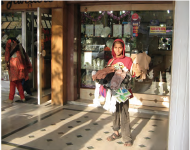
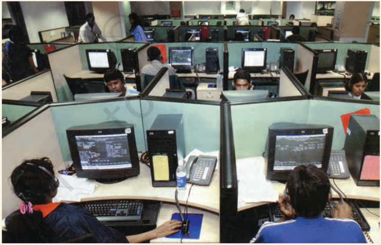
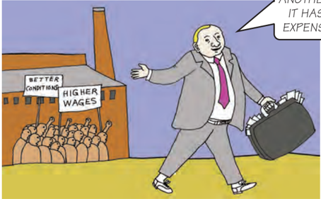
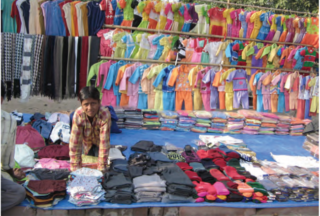
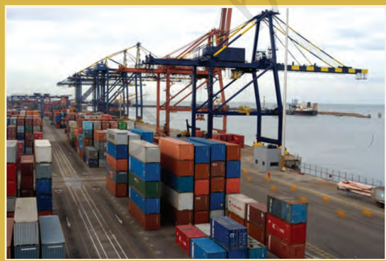
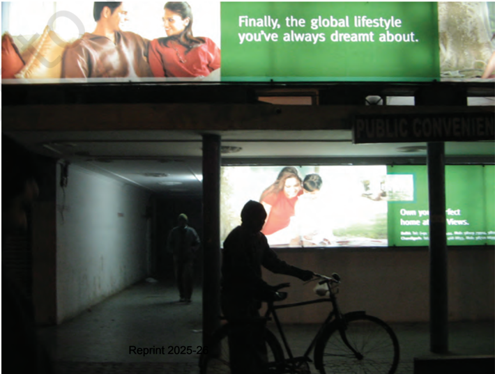

# PAGE 1

## NOTES FOR THE TEACHER NOTES FOR THE TEACHER NOTES FOR THE TEACHER NOTES FOR THE TEACHER NOTES FOR THE TEACHER

## CHAPTER 4 : GLOBALISATION AND THE INDIAN ECONOMY

Most regions of the world are getting increasingly interconnected. While this interconnectedness across  countries  has  many  dimensions  cultural, political, social and economic - this chapter looks at globalisation in a more limited sense. It defines globalisation as the integration between countries through foreign trade and foreign investments by multinational corporations (MNCs). As you will notice, the more complex issues of portfolio investment have been left out.

If we look at the past thirty years or so, we find that MNCs have been a major force in the globalisation process connecting distant regions of the world. Why are the MNCs spreading their production to other countries and what are the ways in which they are doing so? The first part of  the  chapter  discusses  this.  Rather  than relying on quantitative estimates, the rapid rise and influence of  the  MNCs  has  been  shown through a variety of examples, mainly drawn from the Indian context. Note that the examples are an aid to explain a more general point. While teaching, the emphasis should be on the ideas and examples are to be used as illustrations. You  can  also  creatively  use  comprehension passages like the one given after Section II to test and reinforce new concepts.

Integration of production and integration of markets is a key idea behind understanding the process of globalisation and its impact. This has been  dealt  with  at  length  in  this  chapter, highlighting the role of MNCs in the process.  You have to ensure that the students grasp this idea with sufficient clarity, before moving on to the next topic.

Globalisation has been facilitated by several factors. Three of these have been highlighted: rapid improvements in technology, liberalisation of trade and investment policies and, pressures from international organisations such as the WTO. Improvement in technology is a fascinating area  for  students  and  you  may,  with  a  few directions,  encourage  them  to  do  their  own explorations. While discussing liberalisation, you have to  keep  in  mind  that  the  students  are unaware  of  what  India  was  like  in  the pre-liberalisation  era.  A  role-play  could  be conceived to compare and contrast the pre and post-liberalisation era. Similarly, international negotiations  under  WTO  and  the  uneven balances in power are interesting subjects that can be covered in a discussion mode rather than as lectures.

The  final  section  covers  the  impact  of globalisation . To what extent has globalisation contributed to the development process? This section draws on the topics covered in Chapters 1 and 2 (for example, what is a fair development goal), which you can refer to. Also, examples and activities drawn from the local environment are a must while discussing this section. This might include contexts that have not been covered in the chapter, such as the impact of imports on local  farmers,  etc.  Collective  brainstorming sessions  can  be  conducted  to  analyse  such situations.

## Sources for Information

The call for a fairer globalisation has been given, among others,  by  the  International  Labour Organisation www.ilo.org. Another interesting resource is the WTO website http://www.wto.org. It gives access to the variety of agreements that are being negotiated at the WTO.  For company related information, most MNCs have their own websites.    If  you  want  to  critically  look  at the  MNCs,  one  recommended  website  is www.corporatewatch.org.uk.

# PAGE 2

As consumers in today's world, some of us have a wide choice of goods and services before us. The latest models of digital cameras, mobile phones and televisions  made  by  the  leading manufacturers of the world are within our reach. Every season, new models of automobiles can be seen on Indian roads.  Gone  are  the  days  when Ambassador and Fiat were the only cars on  Indian roads. Today, Indians are buying cars produced by nearly all the top companies in the world. A similar explosion of brands can be seen for many other goods: from shirts to televisions to processed fruit juices.

Such wide-ranging choice of goods in our markets is a relatively recent phenomenon. You wouldn't  have found such a wide variety of goods in Indian  markets  even  two  decades back. In  a  matter  of  years,  our markets have been transformed!

How do  we  understand  these rapid transformations? What are the factors that are bringing about these changes? And, how are these changes affecting  the  lives  of  the  people? We shall dwell on these questions in this chapter.

G GLOBALISATION    AND    THE  I INDIAN  E ECONOMY

55 55

# PAGE 3

## PRODUCTION ACROSS COUNTRIES

Until  the  middle  of  the  twentieth century,  production  was  largely organised within countries.    What crossed  the  boundaries  of  these countries were raw material, food stuff and finished products. Colonies such as India exported raw materials and food  stuff  and  imported  finished goods. Trade was the main channel connecting distant countries. This was before  large  companies  called multinational corporations (MNCs) emerged on the scene. A MNC is a company  that  owns  or  controls production in more than one nation. MNCs set up offices and factories for production in regions where they can get cheap labour and other resources. This  is  done  so  that  the  cost  of production is low and the MNCs can earn  greater  profits.  Consider  the following example.

## Spreading  of Production Spreading  of Production Spreading  of Production Spreading  of Production by an MNC by an MNC by an MNC by an MNC

A  large  MNC,  producing  industrial  equipment,  designs  its products in research centres in the United States, and then has the components manufactured in China. These are then shipped to Mexico and Eastern Europe where the products are assembled and the finished products are sold all over the world. Meanwhile, the company's customer care is carried out through call centres located in India.

This is a call centre in Bengaluru, equipped with telecom facilities and access to the Internet to provide information and support to customers abroad.

U UNDERSTANDING  E ECONOMIC  D DEVELOPMENT

# PAGE 4

In this example the MNC is not only selling its finished products globally, but more important, the goods and services are produced globally . As a result, production is organised in increasingly  complex  ways .    The production process is divided  into small parts and spread out across the globe. In the above example, China provides  the  advantage  of  being  a cheap  manufacturing  location. Mexico and Eastern Europe are useful for  their  closeness  to  the  markets in  the  US  and  Europe.  India  has highly  skilled  engineers  who  can understand the technical aspects of production.  It  also  has  educated English  speaking  youth  who  can provide customer care services. And all this probably can mean 50-60 per cent  cost-savings  for  the  MNC! The  advantage  of  spreading  out production across the borders to the multinationals can be truly immense.

## LET'S WORK THIS OUT

Complete the following statement to show how the production process in the garment industry  is  spread  across  countries.

The brand tag says 'Made in Thailand' but they are not Thai products. We dissect the  manufacturing  process  and  look  for  the  best  solution  at  each  step.  We  are doing it  globally.  In  making  garments,  the  company  may,  for  example,  get  cotton fibre  from  Korea,  ........

## INTERLINKING PRODUCTION ACROSS COUNTRIES

In general, MNCs set up production where it is close to the markets; where there is skilled and unskilled labour available at low costs; and where the availability  of  other  factors  of production is assured. In addition, MNCs might look for government policies that look after their interests. You will read more about the policies later in the chapter.

Having assured themselves of these conditions, MNCs set up factories and offices for production. The money that is spent to buy assets such as land, building,  machines  and  other equipment is  called investment. Investment made by MNCs is called foreign investment . Any investment is  made  with  the  hope  that  these assets will earn profits.

WE WILL SHIFT THIS FACTORY TO ANOTHER COUNTRY. IT HAS BECOME EXPENSIVE HERE!

At times, MNCs set up production jointly  with  some  of  the  local companies of these countries. The benefit to the local company of such joint  production  is  two-fold.  First, MNCs  can  provide  money  for additional investments, like buying new machines for faster production. Second, MNCs might bring with them the latest technology for production.

G GLOBALISATION    AND    THE  I INDIAN  E ECONOMY

57 57

# PAGE 5

But the most common route for MNC investments is to buy up local companies  and  then  to  expand production. MNCs with huge wealth can quite easily  do  so.  To  take  an example, Cargill Foods, a very large American  MNC,  has  bought  over smaller  Indian  companies  such  as Parakh Foods. Parakh Foods had built  a  large  marketing  network  in various parts of India, where its brand was well-reputed. Also, Parakh Foods had four oil refineries, whose control has now shifted to Cargill. Cargill is now the largest producer of edible oil in  India,  with  a  capacity  to  make  5 million pouches daily!

In  fact,  many  of  the  top  MNCs have  wealth  exceeding  the  entire budgets of the developing country governments . With such enormous wealth,  imagine  the  power  and influence of these MNCs!

There's  another  way  in  which MNCs control  production.  Large MNCs in developed countries place orders  for  production  with  small producers.  Garments,  footwear, sports  items  are  examples  of industries  where  production  is carried  out  by  a  large  number  of small producers around the world.

Women at home in Ludhiana making footballs for large MNCs

Jeans produced in developing countries being sold in USA for Rs 6500 ($145)

The  products  are  supplied  to  the MNCs, which then sell these under their  own  brand  names  to  the customers. These large MNCs have tremendous power to determine price, quality, delivery,  and  labour conditions for these distant producers.

Thus,  we  see  that  there  are  a variety of ways in which the MNCs are spreading  their  production  and interacting  with  local  producers  in various countries across the globe. By setting  up  partnerships  with  local companies,  by  using  the  local companies for supplies, by closely competing with the local companies or buying them up, MNCs are exerting a  strong  influence  on  production at  these  distant  locations.  As  a result , production in these widely dispersed  locations  is  getting interlinked.

58 58 U UNDERSTANDING  E ECONOMIC  D DEVELOPMENT

# PAGE 6

## LET'S WORK THESE OUT

Ford Motors, an American company, is one of the world's largest automobile manufacturers with production spread over 26 countries of the world. Ford Motors came to India in 1995 and spent Rs. 1700 crore to set up a large plant near Chennai. This was done in collaboration with Mahindra and Mahindra, a major Indian manufacturer of jeeps and trucks. By the year 2017, Ford Motors was selling 88,000 cars in the Indian markets, while another 1,81,000 cars were exported from India to South Africa, Mexico, Brazil and United States of America. In recent years, Ford Company stopped producing cars for selling in India but export cars and car engines on a small scale to other countries.

Read the passage on the left and answer the questions.

1. Would you say Ford Motors is a MNC? Why?
2. What is foreign investment? How much did Ford Motors invest in India?
3. By setting  up  their  production  plants  in  India,  MNCs  such  as  Ford Motors tap the advantage not only of the large markets that countries such as India provide, but also the lower costs of production. Explain the  statement.
4. Why do you think the company wants to develop India as a base for manufacturing car components for its global operations? Discuss the following factors:
5. (a) cost of labour and other resources in India
6. (b) the  presence  of  several  local  manufacturers  who  supply  autoparts to Ford Motors
7. (c) closeness to a large number of buyers in India and China
5. In what ways will the production of cars by Ford Motors in India lead to interlinking of production?
6. In what ways is a MNC different from other companies?
7. Nearly all major multinationals are American, Japanese or European, such as Nike, Coca-Cola, Pepsi, Honda, Nokia. Can you guess why?

## FOREIGN TRADE AND INTEGRATION OF MARKETS

For a long time foreign trade has been the  main  channel  connecting countries. In history you would have read  about  the  trade  routes connecting India and South Asia to markets both in the East and West and the extensive trade that took place along these routes. Also, you would remember that it was trading interests  which  attracted  various trading companies such as the East India Company to India. What then is the basic function of foreign trade?

To  put  it  simply ,  foreign  trade creates  an  opportunity  for  the producers  to  reach  beyond  the domestic markets, i.e., markets of their own countries. Producers can sell their produce not only in markets located within the country but can also compete in markets located in other countries of the world. Similarly , for the buyers, import of goods produced in another country is one way of expanding the choice  of  goods  beyond  what  is domestically produced.

G GLOBALISATION    AND    THE  I INDIAN  E ECONOMY

# PAGE 7

Let us see the effect of foreign trade through the example of Chinese toys in the Indian markets.

## Chinese Toys in India Chinese Toys in India Chinese Toys in India Chinese Toys in India

Chinese manufacturers learn of an  opportunity to export toys to India, where toys are sold at a high price. They  start exporting plastic toys to India. Buyers in India now have the option  of  choosing  between Indian and the Chinese toys. Because of the cheaper prices and new designs, Chinese toys become more popular in  the Indian markets. Within a year, 70  to  80  per  cent  of  the  toy shops  have  replaced  Indian toys  with  Chinese  toys.  Toys are now cheaper in the Indian markets than earlier.

What is happening here? As a result  of  trade,  Chinese  toys come into the Indian markets. In  the  competition  between Indian  and  Chinese  toys, Chinese  toys  prove  better. Indian buyers have a greater choice  of  toys  and  at  lower prices.  For  the  Chinese  toy makers,  this  provides  an opportunity to expand business. The opposite is true for Indian toy  makers. They face losses, as  their toys are selling much less.

# PAGE 8

In  general,  with  the  opening  of trade, goods travel from one market to  another.  Choice  of  goods  in  the markets rises. Prices of similar goods in the two markets tend to become equal.  And,  producers  in  the  two countries now closely compete against each  other  even  though  they  are separated  by  thousands  of  miles! Foreign  trade  thus  results  in connecting  the  markets  or integration of markets in  different countries.

Small traders of readymade garments facing stiff competition from both the MNC brands and imports.

## LET'S WORK THESE OUT

1. What was the main channel connecting countries in the past? How is it different now?
2. Distinguish between foreign trade and foreign investment.
3. In recent years China has been importing steel from India. Explain how the import of steel by China will affect.
4. (a) steel companies in China.
5. (b) steel companies in India.
6. (c) industries buying steel for production of other industrial goods in China.
4. How will the import of steel from India into the Chinese markets lead to integration of markets for steel in the two countries? Explain.

## WHAT IS GLOBALISATION?

In the past two to three decades, more and more MNCs have been looking for locations  around  the  world  which would be cheap for their production. Foreign investment by MNCs in these countries has been rising.  At the same time, foreign trade between countries has been rising rapidly. A large part of the foreign trade is also controlled by  MNCs.  For  instance,  the  car manufacturing plant of Ford Motors in India not only produces cars for the Indian markets, it also exports cars to  other  developing  countries  and exports car components for its many factories around the world. Likewise, activities  of  most  MNCs  involve substantial trade in goods and also services.

G GLOBALISATION    AND    THE  I INDIAN  E ECONOMY

# PAGE 9

The  result  of  greater  foreign investment and greater foreign trade has  been  greater  integration  of production  and  markets  across countries. Globalisation  is  this process  of  rapid  integration  or interconnection between countries. MNCs are playing a major role in the  globalisation  process. More and  more  goods  and  services, investments and technology are moving between countries. Most regions  of  the  world  are  in  closer

## LET'S WORK THESE OUT

1. What is the role of MNCs in the globalisation process?
2. What are the various ways in which countries can be linked?
3. 3.
4. Choose the correct option.

Globalisation,  by  connecting  countries,  shall  result  in

- (a) lesser  competition  among producers.
- (b) greater competition among producers.
- (c) no change in competition among producers.

contact with each other than a few decades back.

Besides the movements of goods, services, investments and technology, there is one more way in which the countries can be connected. This is through  the  movement  of  people between countries.  People  usually move from one country to another in search of better income, better jobs or better  education.  In  the  past  few decades, however, there has not been much increase in the movement of people  between  countries  due  to various restrictions.

## FACTORS THAT HAVE ENABLED GLOBALISATION

## Technology

Rapid improvement in technology has been one major factor that has stimulated the globalisation process. For instance, the past fifty years have seen several improvements in transportation technology. This has made much faster delivery of goods across long distances possible at lower costs.

## Containers for transport of goods

Goods are placed  in  containers that  can  be  loaded  intact  onto ships, railways, planes and trucks. Containers  have  led  to  huge reduction  in  port  handling  costs and  increased  the  speed  with which exports can reach markets. Similarly, the cost of air transport has fallen.  This has enabled much greater  volumes  of  goods  being transported by airlines.

# PAGE 10

Even more remarkable have been the developments in information and communication technology. In recent times, technology in the areas of  telecommunications, computers, Internet has been changing rapidly. Telecommunication facilities  (telegraph,  telephone  including  mobile phones, fax) are used to contact one another around the world, to access information  instantly,  and  to communicate from remote areas. This has  been  facilitated  by  satellite communication  devices.  As  you would be aware, computers have now entered almost every field of activity. You might have also ventured into the amazing world of internet, where you can obtain and share information on almost anything you want to know. Internet also allows us to send instant electronic  mail  (e-mail)  and  talk (voice-mail)  across  the  world  at negligible costs.

...BUT WHERE IS  THE ELECTRICITY?...

## Using IT in Using IT in Globalisation Globalisation

A news magazine published for London readers is to be designed and printed in Delhi. The text of the magazine is sent through Internet to the Delhi office. The designers  in  the  Delhi  office  get orders on how to design the magazine from  the  office  in  London  using telecommunication  facilities.  The designing is done on a computer. After printing, the magazines are  sent by air to London. Even the payment of money for designing and printing from a bank in London to a bank in Delhi is done instantly through the Internet (e-banking)!

## LET'S WORK THESE OUT

1. In  the  above  example,  underline  the words describing the use of technology in production.
2. How  is information technology connected with globalisation? Would globalisation  have  been  possible without expansion of IT?

G GLOBALISATION    AND    THE  I INDIAN  E ECONOMY

# PAGE 11

## Liberalisation of foreign trade and foreign investment policy

Let us return to the example of imports of Chinese toys in India. Suppose the Indian  government  puts  a  tax  on import of toys. What would happen? Those who wish to import these toys would have to pay tax on this. Because of the tax, buyers will have to pay a higher price on imported toys. Chinese toys will no longer be as cheap  in the Indian  markets  and  imports  from China  will  automatically  reduce. Indian toy-makers will prosper.

Tax on imports is an example of trade barrier .  It  is  called  a  barrier because some restriction has been set up.  Governments  can  use  trade barriers  to  increase  or  decrease (regulate) foreign trade and to decide what kinds of goods and how much of each, should come into the country.

The  Indian  government,  after Independence, had put barriers to foreign trade and foreign investment. This  was  considered  necessary  to protect  the  producers  within  the country  from foreign competition. Industries were just coming up in the 1950s and 1960s, and competition from imports at that stage would not have allowed these industries to come up.  Thus,  India  allowed  imports of  only  essential  items  such  as machinery,  fertilisers,  petroleum etc. Note that all developed countries, during the early stages of development, have given protection to domestic producers through a variety of means.

Starting around 1991, some farreaching changes in policy were made in India.  The government decided that the  time  had  come  for  Indian producers to compete with producers around  the  globe.  It  felt  that competition  would  improve  the performance of producers within the country  since  they  would  have  to improve their quality. This decision was supported by powerful international organisations.

Thus, barriers on foreign trade and foreign investment were removed to a large extent. This meant that goods could  be  imported  and  exported easily  and  also  foreign  companies could  set  up  factories  and  offices here.

Removing barriers or restrictions set by the government is what is known  as  liberalisation. With liberalisation of trade, businesses are allowed  to  make  decisions  freely about what they wish to import or export.  The  government  imposes much less restrictions than before and  is  therefore  said  to  be  more liberal.

## LET'S WORK THESE OUT

1. What do you understand by liberalisation of foreign trade?
2. Tax on imports is one type of trade barrier. The government could also place a limit on the number of goods that can be imported. This is known as quotas.  Can you explain, using  the  example  of  Chinese  toys,  how  quotas  can  be  used  as  trade  barriers? Do you think this should be used? Discuss.

# PAGE 12

## WORLD TRADE ORGANISATION

We have seen that the liberalisation of foreign trade and investment in India was supported by some very powerful international organisations. These  organisations  say  that  all barriers  to  foreign  trade  and investment  are  harmful.  There should  be  no  barriers.  Trade between countries should be 'free'. All  countries  in  the  world  should liberalise their policies.

World Trade Organisation (WTO) is one such organisation whose aim is to  liberalise  international  trade. Started  at  the  initiative  of  the developed countries, WTO establishes rules regarding international trade, and sees that these rules are obeyed. About 160 countries of the world are currently members of the WTO.

Though WTO is supposed to allow free trade for all, in practice, it is seen that  the  developed  countries  have unfairly retained trade barriers. On the other hand, WTO rules have forced the developing countries to remove trade barriers. An example of this is the  current  debate  on  trade  in agricultural products.

## Debate on Trade Practices Debate on Trade Practices Debate on Trade Practices Debate on Trade Practices

You have seen in Chapter 2, that the agriculture sector provides the bulk of  employment  and  a  significant portion  of  the  GDP  in  India. Compare  this  to  a  developed country such as the US with the share of agriculture in GDP at 1% and its share in total employment a tiny 0.5%! And yet this very small  percentage  of  people who are engaged in agriculture in the US  receive massive sums of money from the  US  government  for production and for exports to other countries. Due to this massive  money  that  they receive, US farmers can sell the farm products at abnormally  low  prices.  The surplus  farm  products  are sold in other country markets at  low  prices,  adversely affecting  farmers  in  these countries.

Developing countries are, therefore, asking the developed  country  governments,  'We  have reduced trade barriers as per WTO rules. But you have  ignored  the  rules  of  WTO  and  have continued  to  pay  your  farmers  vast  sums  of money.  You have asked our governments to stop supporting  our  farmers,  but  you  are  doing  so yourselves. Is  this  free  and  fair  trade?'

A typical cotton farm in USA consists of thousands of acres owned by a huge corporation that will sell cotton abroad at lowered prices.

G GLOBALISATION    AND    THE  I INDIAN  E ECONOMY

# PAGE 13

## LET'S WORK THESE OUT

1. Fill  in  the  blanks.

WTO was started at the initiative of \_\_\_\_\_\_\_\_\_\_countries. The aim of the WTO is to \_\_\_\_\_\_\_\_\_\_\_\_\_\_\_\_\_\_\_\_.   WTO establishes rules regarding  \_\_\_\_\_\_\_\_\_\_\_\_\_\_\_\_  for all countries, and sees that \_\_\_\_\_\_\_\_\_\_\_\_\_\_\_\_\_\_\_   In practice, trade between countries is  not  \_\_\_\_\_\_\_\_\_\_\_\_\_\_\_\_\_\_\_\_\_\_\_\_\_\_\_\_\_\_.  Developing countries like India have \_\_\_\_\_\_\_\_\_\_\_\_\_\_\_\_\_\_\_, whereas developed countries, in many cases, have continued to provide protection to their producers.

2. What do you think can be done so that trade between countries is more fair?
3. In the above example, we saw that the US government gives massive sums of money to farmers for production. At times, governments also give support  to promote production of certain types of goods, such as those which are environmentally friendly. Discuss whether these are fair or not.

## IMPACT OF GLOBALISATION IN INDIA

In the last twenty years, globalisation of  the  Indian economy has come a long way. What has been its effect on the  lives  of  people?  Let  us  look  at some of the evidence.

Globalisation and greater competition among producers - both local and foreign producers - has been of advantage to consumers, particularly the well-off sections in the urban areas. There is greater choice before  these  consumers  who  now enjoy  improved  quality  and  lower prices for several products. As a result, these  people  today,  enjoy  much higher standards of living than was possible earlier.

Among producers and workers, the impact of globalisation has not been uniform.

Firstly, MNCs have increased their investments in India over the past 20 years, which means investing in India has been beneficial for them. MNCs have been interested in industries such as cell  phones,  automobiles, electronics, soft drinks, fast food or services such as banking in urban areas. These products have a large number of well-off  buyers. In these industries and services, new jobs have been created. Also, local companies supplying raw materials, etc. to these industries have prospered.

# PAGE 14

## Steps  to  Attract  Foreign  Investment Steps  to  Attract  Foreign  Investment Steps  to  Attract  Foreign  Investment Steps  to  Attract  Foreign  Investment

In recent years, the central and state governments in India are taking special steps  to  attract  foreign  companies  to invest in India. Industrial zones, called Special  Economic  Zones  (SEZs),  are being set up. SEZs are to have world class facilities:  electricity,  water,  roads, transport,  storage,  recreational  and educational facilities. Companies who set up production units in the SEZs do not have to pay taxes for an initial period of five years.

Government  has  also  allowed flexibility in the labour laws to attract foreign  investment.  You  have  seen  in Chapter 2 that the companies in the organised sector have to obey certain rules that aim to protect the workers'

rights. In the recent years, the government has allowed companies to ignore many of these.  Instead  of  hiring  workers  on  a regular basis, companies hire workers 'flexibly' for short periods when there is intense pressure of work. This is done to reduce the cost of labour for the company. However,  still  not  satisfied,  foreign companies are demanding more flexibility in labour laws.

Secondly, several of the top Indian companies have been able to benefit from the increased competition. They have invested in newer technology and production methods and raised their production  standards.  Some  have gained from successful collaborations with foreign companies.

are  some  Indian  companies  which are  spreading  their  operations worldwide.

Moreover,  globalisation  has enabled some large Indian companies to emerge as multinationals themselves!  Tata  Motors  (automobiles),  Infosys  (IT),  Ranbaxy (medicines),  Asian  Paints  (paints), Sundaram Fasteners (nuts and bolts)

Globalisation  has  also  created new opportunities  for  companies providing services, particularly those involving  IT.  The  Indian  company producing a magazine for the London based company and call centres are some examples.  Besides, a host of services such as data entry, accounting, administrative tasks, engineering are  now  being  done  cheaply  in countries  such  as  India  and  are exported to the developed countries.

## LET'S WORK THESE OUT

1. How has competition benefited people in India?
2. Should more Indian companies emerge as MNCs? How would it benefit the people in the  country?
3. Why do governments try to attract more foreign investment?
4. In Chapter 1, we saw what may be development for one may be destructive for others. The setting of SEZs has been opposed by some people in India. Find out who are these people and why are they opposing it.

G GLOBALISATION    AND    THE  I INDIAN  E ECONOMY

# PAGE 15

## Small producers: Compete or perish

For a large number of small producers and workers  globalisation  has  posed  major challenges.

## Rising  Competition Rising  Competition Rising  Competition Rising  Competition

used  to  buy  different  components including  capacitors  in  bulk  for  the manufacture of television sets. However,  competition  from  the  MNC brands  forced  the  Indian  television companies to  move  into  assembling activities  for  MNCs.  Even  when  some of them bought capacitors, they would prefer  to  import  as  the  price  of  the imported  item  was  half  the  price charged by people like Ravi.

Ravi did not expect that he would have to  face  a  crisis  in  such  a  short  period of his life as industrialist. Ravi took a loan  from  the  bank  to  start  his  own company producing capacitors in 1992 in  Hosur,  an  industrial  town  in  Tamil Nadu. Capacitors are  used  in  many electronic  home  appliances  including tube lights, television etc.  Within three years, he  was  able  to  expand production  and  had  20  workers working under him.

His struggle to run his company started when the government removed restrictions on  imports of capacitors as per its agreement at WTO in 2001. His main clients, the television companies,

Ravi now produces less than half the capacitors that he produced in the year 2000  and  has  only  seven  workers working for him. Many of Ravi's friends in  the  same  business  in  Hyderabad and Chennai have closed their units.

Batteries,  capacitors,  plastics,  toys,  tyres,  dairy  products,  and vegetable  oil  are  some  examples  of  industries  where  the  small manufacturers have been hit hard due to competition. Several of the  units  have  shut  down  rendering  many  workers  jobless.  The small and medium industries in India employ the largest number of  workers  (11  crores)  in  the  country,  next  only  to  agriculture.

## LET'S WORK THESE OUT

1. What are the ways in which Ravi's small production unit was affected by rising competition?
2. Should producers such as Ravi stop production because their cost of production is higher compared to producers in other countries? What do you think?
3. Recent studies point out that small producers in India need three things to compete better in the market (a) better roads, power, water, raw materials, marketing and information network (b) improvements and modernisation of technology (c) timely availability of credit at reasonable interest rates.
4. l Can you explain how these three things would help Indian producers?
5. l Do you think MNCs will be interested in investing in these? Why?
6. l Do you think the government has a role in making these facilities available? Why?
7. l Can you think of any other step that the government could take? Discuss.

# PAGE 16

## Competition and Uncertain Employment

Globalisation and the pressure of competition have substantially changed the lives of workers. Faced with growing competition, most employers these days prefer to employ workers 'flexibly'. This means that workers' jobs are no longer secure.

Let us see how the workers in the garment export industry in India are having to bear this pressure of competition.

Factory workers folding garments for export. Though globalisation has created opportunities for paid work for women, the condition of employment shows that women are denied their fair share of benefits.

Large MNCs in the garment industry in Europe and America order their products from Indian exporters. These large MNCs with worldwide network look for the cheapest goods in order to maximise their profits. To get  these  large  orders,  Indian  garment exporters try hard to cut their own costs. As cost  of  raw  materials  cannot  be  reduced, exporters  try  to  cut  labour  costs.  Where earlier a factory used to employ workers on a permanent basis, now they employ workers only on a temporary basis so that they do not have to pay workers for the whole year. Workers  also  have  to  put  in  very  long working hours and work night shifts on a regular basis during the peak season. Wages are  low  and  workers  are  forced  to  work overtime to make both ends meet.

While this competition among the garment exporters has allowed the MNCs to make large profits, workers are denied their fair share of benefits brought about by globalisation.

## A  Garment Worker A  Garment Worker A  Garment Worker A  Garment Worker

35 year old Sushila has spent many years as a worker in garment export industry of Delhi. She was employed as a 'permanent worker' entitled to health  insurance,  provident  fund, overtime  at  a  double  rate,  when Sushila's factory closed in the late 1990s.  After searching for a job  for six months, she finally got a job  30 km. away from where she lives. Even after  working  in  this  factory  for several  years,  she  is  a  temporary worker and earns less than half of what  she  was  earning  earlier. Sushila  leaves  her  house  every morning, seven days a week at 7:30 a.m. and returns at 10 p.m.  A day off from work means no wage. She has none of the benefits she used to get earlier. Factories closer to her home have widely fluctuating orders and therefore pay even less.

# PAGE 17

The conditions of work and the hardships of the workers described above have become common to many industrial units and services in India. Most workers, today, are employed in the unorganised sector. Moreover, increasingly conditions  of  work  in  the  organised  sector  have  come  to  resemble  the unorganised sector. Workers in the organised sector such as Sushila no longer get the protection and benefits that they enjoyed earlier.

## LET'S WORK THESE OUT

1. In what ways has competition affected workers, Indian exporters and foreign MNCs in the garment industry?
2. What can be done by each of the following so that the workers can get a fair share of benefits brought by globalisation?
3. (a) government
4. (b) employers at the exporting factories
5. (c) MNCs
6. (d) workers.
3. One of the present debates in India is whether companies should have flexible policies for employment. Based on what you have read in the chapter, summarise the point of view of the employers and workers.

## THE STRUGGLE FOR A FAIR GLOBALISATION

The above evidence indicates that not  everyone  has  benefited  from globalisation. People with education, skill and wealth have made the best use of the new opportunities. On the other hand, there are many people who have not shared the benefits.

Since  globalisation  is  now  a reality,  the  question  is  how  to make  globalisation  more  'fair'? Fair  globalisation  would  create opportunities for all, and also ensure that the benefits of globalisation are shared better.

that  labour  laws  are  properly implemented and the workers get their  rights.  It  can  support  small producers to improve their performance till the time they become strong  enough  to  compete.  If necessary, the government can use trade and investment barriers. It can negotiate at the WTO for 'fairer rules'. It can also align with other developing countries  with  similar  interests  to fight  against  the  domination  of developed countries in the WTO.

The government can play a major role  in  making  this  possible.  Its policies must protect the interests, not only of the rich and the powerful, but all the people in the country. You have read about some of the possible steps that  the  government  can  take.  For instance, the government can ensure

In  the  past  few  years,  massive campaigns and  representation by people's organisations have influenced  important  decisions relating to trade and investments at the  WTO.  This  has  demonstrated that  people  also  can  play  an important role in the struggle for fair globalisation.

U UNDERSTANDING  E ECONOMIC  D DEVELOPMENT

# PAGE 18

A demonstration against WTO in Hong Kong, 2005

## SUMMING UP

In this chapter, we looked at the present phase of globalisation. Globalisation is the process of rapid integration of countries. This  is  happening  through greater foreign trade and foreign investment. MNCs are playing a major role in the globalisation process. More and more MNCs are looking for locations around the world that are cheap for their production.  As  a  result, production is being organised in complex ways.

Technology, particularly IT, has  played  a  big  role  in organising  production  across countries. In addition, liberalisation  of  trade  and investment  has  facilitated globalisation  by  removing barriers to trade and investment.    At  the  international  level,  WTO  has  put pressure on developing countries  to  liberalise  trade  and investment.

While  globalisation  has benefited  well-off  consumers and also producers with skill, education and wealth, many small producers and workers have suffered as a result of the rising  competition.    Fair globalisation  would  create opportunities for all, and also ensure  that  the  benefits  of globalisation are shared better.

G GLOBALISATION    AND    THE  I INDIAN  E ECONOMY

71

71

# PAGE 19

## EXERCISES

- 1 What do you understand by globalisation? Explain in your own words.
2. What were the reasons for putting barriers to foreign trade and foreign investment by the Indian government? Why did it wish to remove these barriers?
3. How would flexibility in labour laws help companies?
4. What are the various ways in which MNCs set up, control or produce in other countries?
5. Why do developed countries want developing countries to liberalise their trade and investment?  What do you think should the developing countries demand in return?
6. 'The impact of globalisation has not been uniform.' Explain this statement.
7. How has liberalisation of trade and investment policies helped the globalisation process?
8. How does foreign trade lead to integration of markets across countries? Explain with an example other than those given here.
9. Globalisation will continue in the future. Can you imagine what the world would be like twenty years from now? Give reasons for your answer.
- 10.Supposing you find two people arguing: One is saying globalisation has hurt our country's development. The other is telling, globalisation is helping India develop. How would you respond to these arguments?
- 11.Fill in the blanks.

Indian buyers have a greater choice of goods than they did two decades back. This is closely associated with the process of \_\_\_\_\_\_\_\_\_\_\_\_\_\_. Markets in India are selling goods  produced  in  many  other  countries.  This  means  there  is  increasing \_\_\_\_\_\_\_\_\_\_\_\_\_\_ with other countries. Moreover, the rising number of brands that we see in the markets might be produced by MNCs in India. MNCs are investing in India because \_\_\_\_\_\_\_\_\_\_\_\_\_ \_\_\_\_\_\_\_\_\_\_\_\_\_\_\_\_\_\_\_\_\_\_\_\_\_\_\_\_\_\_\_\_\_\_\_\_\_\_\_\_\_\_\_ .  While consumers have more choices in the market, the effect of rising \_\_\_\_\_\_\_\_\_\_\_\_\_\_\_ and \_\_\_\_\_\_\_\_\_\_\_\_\_\_has meant greater \_\_\_\_\_\_\_\_\_\_\_\_\_\_\_\_\_among the producers.

- 12.Match the following.

- (i) MNCs buy at cheap rates from small producers

- (a) Automobiles

- (ii) Quotas and taxes on imports are used to regulate trade

- (b) Garments, footwear, sports items

- (iii) Indian companies who have invested abroad

- (c) Call  centres

- (iv) IT has helped in spreading of production of services

- (d) Tata Motors, Infosys, Ranbaxy

- (v) Several MNCs have invested in setting up factories in India for production

- (e) Trade barriers

UNDERSTANDING  E

U

DEVELOPMENT

ECONOMIC  D

# PAGE 20

- 13.Choose the most appropriate option.
- (i) The past two decades of globalisation has seen rapid movements in
- (a) goods, services and people between countries.
- (b) goods, services and investments between countries.
- (c) goods, investments and people between countries.
- (ii) The most common route for investments by MNCs in countries around the world is to
- (a) set up new factories.
- (b) buy  existing  local  companies.
- (c) form partnerships with local companies.
- (iii) Globalisation has led to improvement in living conditions
- (a) of all the people
- (b) of people in the developed countries
- (c) of workers in the developing countries
- (d) none of the above

## ADDITIONAL ACTIVITY / PROJECT

- I. Take  some  branded  products  that  we  use  everyday  (soaps,  toothpaste, garments, electronic goods, etc.). Check which of these are produced by MNCs.
- II. Take any Indian industry  or  service  of  your  choice.  Collect  information  and photographs from newspapers, magazine clippings, books, television, internet, interviews with people on the following aspects of the industry.
3. (i) Various producers/companies in the industry
4. (ii) Is the product exported to other countries?
5. (iii) Are there MNCs among the producers?
6. (iv) Competition in the industry
7. (v) Conditions of work in the industry
8. (vi) Has there been any major change in the industry in the past 15 years?
9. (vii) Problems that people in the industry face.