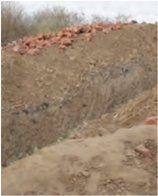
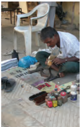

# PAGE 1

## UNDERST UNDERST UNDERST UNDERST UNDERSTANDING ANDING ANDING ANDING ANDING ECONOMIC ECONOMIC ECONOMIC ECONOMIC ECONOMIC DEVELOPMENT DEVELOPMENT DEVELOPMENT DEVELOPMENT DEVELOPMENT

SOCIAL SCIENCE TEXTBOOK FOR CLASS X

# PAGE 2

## 1070 -  U -  UNDERSTANDING  E ECONOMIC  D DEVELOPMENT

Textbook for Class X

## First  Edition

December 2006

Agrahayana 1928

## Reprinted

December 2007

Agrahayana 1929

February  2000

Magha 1930

January   2010

Magha 1931

January  2011

Magha 1932

January  2012

Magha 1933

November 2012

Kartika 1934

November 2013

Kartika 1935

January 2015

Pausa 1936

December 2015

Pausa 1937

January 2017

Pausa 1938

December 2017

Pausa 1939

February 2019

Magha 1940

October 2019

Ashwina 1941

February 2021

Phalguna 1942

November 2021

Agrahayana 1943

October  2022

Kartika  1944

January 2024

Megha 1945

March 2024

Chaitra 1946

June 2024

Jyaishtha 1946

August 2024

Shravan 1946

December 2024

Pausha 1946

## PD  250T  GS

©  National  Council  of  Educational Research  and  Training,  2006

## ` 80.00

## Printed on 80 GSM paper with NCERT watermark

Published  at  the  Publication  Division  by the  Secretary,  National  Council  of Educational  Research  and  Training, Sri  Aurobindo  Marg,  New  Delhi  110  016 and printed at VK  Global Digital, Plot  No.  928,  Sector-68,  IMT  Faridabad, Haryana-121004

## ISBN  81-7450-655-1

## ALL RIGHTS RESERVED

- q No part of this publication may be reproduced, stored in a retrieval system or transmitted, in any form or by any means, electronic, mechanical, photocopying, recording or otherwise without the prior permission of the publisher.
- q This book is sold subject to the condition that it shall not, by way of trade,  be lent, re-sold, hired out or otherwise disposed of without the publisher's consent, in any form of binding or cover other than that in which it is published.
- q The correct price of this publication is the price printed on this page, Any revised price indicated by a rubber stamp or by a sticker or by any other means is incorrect and should be unacceptable.

## OFFICES OF THE PUBLICATION DIVISION, NCERT

NCERT Campus

Sri Aurobindo Marg

New  Delhi 110 016

Phone :  011-26562708

108, 100 Feet Road Hosdakere Halli Extension Banashankari III Stage Bengaluru 560 085

Phone : 080-26725740

Navjivan Trust Building

P.O.Navjivan

Ahmedabad 380 014

Phone :  079-27541446

CWC Campus Opp. Dhankal Bus Stop Panihati

Kolkata 700 114

Phone :  033-25530454

CWC Complex Maligaon Guwahati 781 021

Phone :  0361-2674869

## Publication  Team

Head, Publication : Division

M.V. Srinivasan

Chief Editor :

Bijnan Sutar

Chief Production : Officer (In charge)

Jahan Lal

Chief Business :

Amitabh Kumar

Manager

Assistant  Editor :

R.N.  Bhardwaj

Production Officer :

Sunil Sharma

Cover,  Layout  and  Illustrations Karen Haydock

# PAGE 3

## FOREWORD

The National Curriculum Framework (NCF), 2005, recommends that children's life at school must be linked to their life outside the school. This principle marks a departure from the legacy of bookish learning, which continues to shape our system, and causes a gap between the school, home and community. The syllabi and textbooks developed on the basis of NCF signify an attempt to implement this basic idea. They also attempt to discourage rote learning and the maintenance of sharp boundaries between different subject areas. We hope these measures will take us significantly further in the direction of a childcentered system of education outlined in the National Policy on Education (1986).

The success of this effort depends on the steps that school principals and teachers will take to encourage children to reflect on their own learning and to pursue imaginative activities and questions. We must recognise that, given space, time and freedom, children generate new knowledge by engaging with the information passed on to them by adults.  Treating  the  prescribed  textbook  as  the  sole  basis  of examination is one of the key reasons why other resources and sites of learning are ignored. Inculcating creativity and initiative is possible if we perceive and treat children as participants in learning, not as receivers of a fixed body of knowledge.

These aims imply considerable change in school routines and mode of functioning. Flexibility in the daily time-table is as necessary as rigour in implementing the annual calendar so that the required number of teaching days are actually devoted to teaching. The methods used for teaching and evaluation will also determine how effective this textbook proves for making children's life at school a happy experience, rather than a source of stress or boredom. Syllabus designers have tried to address the problem of curricular burden by restructuring and reorienting knowledge at different stages with greater consideration for child psychology and the time available for teaching. The textbook attempts to enhance this endeavour by giving higher priority and space to opportunities for contemplation and wondering, discussion in small groups, and activities requiring hands-on experience.

The National  Council  of  Educational  Research  and  Training (NCERT) appreciates the hard work done by the textbook development committee responsible for this book. We wish to thank the Chairperson of the advisory committee for textbooks in Social Sciences, at the secondary level, Professor Hari Vasudevan and the Chief Advisor for this book, Professor Tapas Majumdar for guiding the work of this committee. Several teachers contributed to the development of this

# PAGE 4

textbook; we are grateful to their principals for making this possible. We are indebted to the institutions and organisations, which have generously permitted us to draw upon their resources, material and personnel. We are especially grateful to the members of the National Monitoring Committee, appointed by the Department of Secondary and Higher Education, Ministry of Human Resource Development under the Chairpersonship of Professor Mrinal Miri and Professor G.P. Deshpande,  for  their  valuable  time  and  contribution.  As  an organisation  committed  to  systemic  reform  and  continuous improvement in the quality of its products, NCERT welcomes comments and suggestions which will enable us to undertake further revision and refinement.

Director

National Council of Educational Research and Training

New Delhi 20 November 2006

(iv)

# PAGE 5

## A FEW INTRODUCTORY WORDS FOR TEACHERS

This book introduces you to a simplified view of the process of development in the Indian economy. In Economics, we usually try to look at development as a process of change in the economic life of the people, as producers or consumers of  goods  and  services.  Sometimes,  development  is  studied  mainly  as  a phenomenon that acquired significance only with the growth of the modern industrial  civilisation.  This  is  because  the  state  of  development  (or underdevelopment) of a country has often depended on outcomes of wars and conquests and on colonial exploitation of one country by another. However, in this book, we have not emphasised on the external factors. We have taken a long view of the process of development: a process that could have started before  any  external  factors  intervened  or  interrupted  it.  The  process  of development may also restart after such interruptions, and continue on independent lines after the period of subjugation ends. This has happened in the case of our own country, India.

In this book the first beginnings of development are seen in terms of the emergence of agriculture, manufacturing and services as three distinct sectors of the economy. We have also tried to look at economic development not in isolation but as part of a more general concept of human development that includes the development of health and education and other indicators that, along with income, broadly define the quality of life of a people.

In the first chapter, we will study how people actually perceive development and how it can be measured. There are various measures available for this purpose. We will look at the extent to which some of the important developmental indicators help in understanding development and how the process may affect different people differently.

Development as a process had probably started quite early in history. To begin with, perhaps no country could be distinguished as developed in the sense that we understand development. Perhaps the process would have started in most human settlements when people started living in relative peace and in more or less fixed habitations without which agriculture would not have been possible on any significant scale. Once agriculture began and developed, the extraction of other natural products, like mineral ores, probably was started. This latter process of recovering stones and other minerals is called 'quarrying'.

Humans learnt to use the non-food products like wood from trees and the minerals obtained from quarrying as raw materials for making their tools, weapons, utensils, fishing nets and so on. These were the first human-made products called 'artefacts'. Economists called the process of making the artefacts 'manufacture' as distinguished from 'agriculture (including quarrying)' that covered the gathering, cultivating or extracting of purely natural products such as fruit, rice or minerals.

The separation of productive activities between the two distinct sectors of agriculture  including  quarrying  (also  called  the  Primary  Sector)  and

(v)

# PAGE 6

Labour is the source of all wealth

manufacture (also called the Secondary Sector) was probably the first visible manifestation of economic development. This separation came about through the process of 'division of labour' as Adam Smith, regarded as the father of economics had called it. The process is briefly explained below.

At first every person, or at least members of every household, presumably, had to do everything all by themselves. Then at some point the advantage of 'division of labour' must have been felt. Humans found out with experience that production became more efficient if some people concentrated on learning how to fish, others on how to till the soil, still others on how to produce pottery, or trap or hunt animals and birds for food and so on. This was also 'development'  of  a  kind.  Then  there  emerged  specialists  who  were  not themselves producing any good at all: they were people specialising in teaching others how to do these things better. There were also doctors who healed people when they were injured or had fallen ill. Naturally division of labour between people increased the productivity of all the people and the economy grew.

The second chapter will look at the way economic activities in a modern economy can be classified and understood within the framework of primary, secondary and tertiary sectors. The discussion here is focussed on India and the changes that have occurred in the three sectors over the past decades. Besides this, it also provides two other ways of classifying economic activities - organised and unorganised, and private and public sectors. The relevance of additional ways of classification for understanding the problems and challenges of the modern Indian economy is illustrated using real life examples and case studies.

The third chapter initiates the learners into the world of money - its role in a modern economy, forms and its linkage with various institutions such as banks. Then the chapter moves on to discuss the role of banks and other institutions in providing credit to the people. Issues stressed in the discussion on credit are (a) pervasiveness of credit in economic life across a very large section of the population (b) the preponderance of informal credit in India and (c) role of credit in creating either a self-sustaining virtuous cycle of productive investment, higher income streams, higher standards of living leading to more productive investments contributing to development, or a vicious cycle of indebtedness, poverty and debt-trap leading to increased poverty. These ideas are presented through case studies.

Globalisation  is  an  important  phenomenon,  which  has  influenced development and people around the world in various ways. The fourth chapter focuses on a particular dimension of globalisation that is economic in nature - the complex organisation of production. How multinational companies facilitate globalisation through trade and investment is also explained. Some important factors and institutions that facilitate globalisation also find place in this chapter. In the end, the chapter appraises the impacts of globalisation (positive and negative) on the Indian economy.

The process of development leads to not only higher levels of production in different sectors of the economy, but has some down sides too. The examples and case studies in this chapter and elsewhere try to examine whether the benefits of development are spreading to all people (producers big and small, workers in the organised or unorganised sectors, consumers belonging to all

(vi)

# PAGE 7

income groups, men and women and so on) or are being confined to only some privileged sections.

Our final chapter presents a relevant study of how, and to what extent, we can protect the rights of citizens as consumers. During the process of rapid development and emergence of new brands and advertisement campaigns by unscrupulous producers, consumers are often at the receiving end of business malpractices. After tracing the historical root of the consumer movement and through various real-life instances, this chapter tells of different inexpensive consumer protection mechanisms evolved over the years. It also offers details of how people can now assert some of their rights at very little expense at the special  consumer courts that operate outside the existing cumbersome, expensive and time-consuming legal procedures.

## Features of this Textbook

The purpose of the book is to understand the economic life around us and also to think about what we would mean by economic development for people. There are many examples and case studies that we have used both as an aid for conceptual clarity and to relate these ideas to real life. These have  to be read and used, keeping this overall objective in view.

The chapters start with Note for the teacher . Teachers could read this page before they start teaching a chapter. It contains the details of (i) the broad approach and content of the chapter; (ii) some pointers to how the chapter could be taught; and (iii) sources for additional details relating to different topics.

There are several internal exercises in Let's work this out , given after each section in the chapters. This contains a few questions to review the section and open-ended questions and activities that can be taken up within and outside the classroom. Some of the internal exercises should be done in the discussion mode. Students can discuss these in groups and present their conclusions and the answers may be put up for debate with the entire class. This will require more time but it is essential as this allows students to explore  and  learn  from  each  other.  The  intention  is  to  allow  for  more interaction than is usually observed but there is no fixed formula for doing this. Each teacher would find his or her own ways and we would like to express our faith in their abilities to do so.

Wherever possible, we have attempted to provide the latest statistics. Not all authentic data is available for the recent years. Also, economic trends do not change in a few years. Rather worrying about the latest data, you may bring to the notice the central idea of what the concept and data related to it convey to us. Questions on the data aspects may be avoided.

We have used many reference material while preparing this book. Besides these,  many  news  clippings,  reports  from  government  and non-government organisations were also used. Some of them are mentioned in the Note for the teacher and some in Suggested Readings given at the end of this book.

It  is  important  that additional  information  and  readings be  brought into classroom discussion. This could be in the form of short surveys, interviews with people around, reference books, or newspaper clippings, etc. These should then be used for reflection and creative expression by students themselves in the form of making charts, wallpaper displays, skits, debates, etc.

(vii)

# PAGE 8

## Evaluation

While addressing the need for reforms in education, the National Curriculum Framework 2005 and the Position Paper of the National Focus Group on Examination Reforms call for a change in the way questions are asked in examinations. The questions asked in this book make a departure from an evaluation pattern that encourages rote-memorisation to one that inculcates creative thinking, imagination, reflection and hones the analytical ability of learners. Based on the examples shown here, teachers can formulate additional questions.

## Questions that test the understanding of core concepts

- (a) GDP is the total value of \_\_\_\_\_\_\_\_\_ produced during a particular year.
- (i) all goods and services
- (ii) all final goods and services
- (iii) all intermediate goods and services
- (iv) all intermediate and final goods and services
- (b) Analyse the role of credit for development.
- (c) In what ways will the production of cars by Ford Motors in India lead to interlinking of production?
- (d) How would flexibility in labour laws help companies?

## Questions to assess analytical abilities, interpretation and coherent presentation

- (a) The following table gives the GDP in Rupees (crores) by the three secors:
- (i) Calculate the share of the three sectors in GDP for 2000 and 2013.
- (ii) Show the data as a bar diagram similar to Graph 2 in the chapter 2.
- (iii) What conclusions can we draw from the bar graph?
- (b) In  India,  about  80  per  cent  of  farmers  are  small  farmers,  who  need  credit  for cultivation.
- (i) Why might banks be unwilling to lend to small farmers?
- (ii) What are the other sources from which small farmers can borrow?
- (iii) Explain with an example how the terms of credit can be unfavourable for the small farmer.
- (iv) Suggest some ways by which small farmers can get cheap credit.

|   Year | primary   | secondary   | tertiary   |
|--------|-----------|-------------|------------|
|   2000 | 12,56,000 | 10,12,000   | 18,17,000  |
|   2013 | 17,87,000 | 24,59,000   | 46,30,000  |

(viii)

# PAGE 9

## Questions to test reflective thinking

- (a) Look at the picture (high rise buildings with slums around). What should be the developmental goals for such an area?
- (b) 'The Earth has enough resources to meet the needs of all but not enough to satisfy the greed of even one person'. How is this statement relevant to the discussion of development? Discuss.
- (c) 'Tertiary  sector  is  not  playing  any  significant  role  in  the  development  of  Indian economy'. Do you agree? Give reasons in support of your answer.
- (d) People make complaints about the lack of civic amenities such as bad roads or poor water and health facilities but no one listens. Now the RTI Act gives you the power to question. Do you agree? Discuss.

## Questions that test the ability to apply concepts and ideas to real life problems / situations

- (a) What can be some of the developmental goals for your village, town or locality?
- (b) Students in a school are often classified into primary and secondary or junior and senior. What is the criterion used here? Do you think this is useful classification?
- (c) In what ways can employment be increased in urban areas?
- (d) What do you understand by disguised unemployment? Explain with an example each from the urban and rural areas.
- (e) Describe  some of your duties as consumers if you visit a shopping complex in your  locality.

It is also necessary to develop questions that require students to draw from one or more areas of the syllabus for making relevant connections between materials from different chapters. For instance, in Chapter 4 one question links to Chapter 1In chapter 1, we saw what may be development for one may be destructive for others. The setting of SEZs has been opposed by some people in India. Find out who are these people and why are they opposing it.

We hope that you along with your students would look at this textbook itself in a critical manner and send us your critique, questions, clarification, etc. to the following address. AND we could continue this discussion further.

## PROGRAMME  COORDINATOR

Economics Textbook for Class X Department of Education in Social Sciences National Council of Educational Research and Training Sri Aurobindo Marg New Delhi - 110 016.

Email: headdess@gmail.com

TEXTBOOK  DEVELOPMENT  COMMITTEE

(ix)

# PAGE 10

# PAGE 11

## TEXTBOOK DEVELOPMENT COMMITTEE

CHAIRPERSON,  ADVISORY  COMMITTEE  FOR  SOCIAL  SCIENCE  TEXTBOOKS  AT  THE SECONDARY LEVEL

Hari Vasudevan, Professor, Department of History, University of Kolkata, Kolkata.

## CHIEF ADVISOR

Tapas Majumdar, Emeritus Professor, Jawaharlal Nehru University, New Delhi

## ADVISOR

Sathish  K.  Jain, Professor, Centre  for  Economic  Studies  and  Planning, Jawaharlal Nehru University, New Delhi

## MEMBERS

Arvind Sardana, Eklavya, Institute for Educational Research and Innovative Action, Madhya Pradesh

Neeraja Rashmi, Reader, Curriculum Group, NCERT, New Delhi

Neeraja Nautiyal, TGT (Social Science), Kendriya Vidyalaya, BEG Centre, Deccan College Road, Yeravada, Pune

Rajinder Choudhury, Reader, Department of Economics, Maharishi Dayanand University, Rohtak, Haryana

Rama Gopal, Professor, Department of Economics, Annamalai University, Annamalai Nagar, Tamil Nadu

Sukanya Bose, Eklavya Fellow, New Delhi

Vijay  Shankar,  Samaj  Pragati  Sahyog,  Bagli  Block,  Dewas  District, Madhya Pradesh

## MEMBER-COORDINATOR

M.V. Srinivasan, Lecturer, DESSH, NCERT, New Delhi

# PAGE 12

## ACKNOWLEDGEMENTS

This book is an outcome of ideas, comments and suggestions from academics, practising school teachers, students, educational activists and all those concerned about education. The National Council of Educational Research and Training (NCERT) acknowledges Jean Dreze, visiting Professor, G.B.Pant Social Science Institute, Allahabad; R. Nagaraj, Professor , Indira Gandhi Institute of Development Research, Mumbai; Rammanohar Reddy, Editor, Economic and Political Weekly, and Sujana Krishnamurthy, Freelance Researcher, Mumbai; S. Krishnakumar, Sri Venkateswara College, Delhi University, Delhi; Tara Nair, Institute of Rural Management, Anand; Keshab Das, Gujarat Institute of Development Research, Ahmedabad;  George  Cheriyan,  Consumer  Unity  Trust  International, Jaipur; Nirmalya Basu, Indian Institute of Science, Bangalore and Manish Jain, Doctoral Student , Central Institute of Education, Delhi for their suggestions in enriching the book making it nearer to learners. We also thank our colleagues K.  Chandrasekar, Department of Educational Measurement and Evaluation, R. Meganathan, Department of Languages; Ashita Raveendran and Jaya Singh, Department of Education in Social Sciences and Humanities, NCERT for their feedback and suggestions.

We would like to place on record the invaluable advise of (Late) Dipak Banerjee, Professor (Retd), Presidency College, Kolkata. We could have benefitted much more of his expertise had his health permitted.

Many teachers have contributed to this book in different ways. Contributions of  Kanta  Bansal, Vice  Principal, Kendriya  Vidyalaya,  Sector  47,  Chandigarh; A. Manoharan, PGT (Economics), Kendriya Vidyalaya No.2, Military Hospital Road, Belgaum Cantonment, Belgaum, Karnataka; Renu Deshmana, TGT (Social Science), Kendriya Vidyalaya No.2, Delhi Cantonment, Gurgaon Road, Delhi; Nalini Padmanabhan, PGT (Economics), DTEA Senior Secondary School, Janakpuri, New Delhi  are  duly  acknowledged.  The  feedback  and  reflections  of  students  and teachers of Kendriya Vidyalaya, Sector 47, Chandigarh during the try out were of much value in the improvement of this book.

The  Council  expresses  its  gratitude  to  the  following  individuals  and organisations for providing us with photograph(s) and allowing us to use them from their archives and books - Jan Breman and Parthiv Shah from, Working in the  mill  no  more ,  Oxford  University  Press,  Delhi;  Centre  for  Education  and Communication, Delhi Forum and Nirantar, Delhi and Ananthi, Gujarat; Subha Lakshmi,  Delhi;  Ambuj  Soni,  Dewas,  Madhya  Pradesh;  Karen  Haydock, Chandigarh; and M.V. Srinivasan, DESSH; the Press Information Bureau, Ministry of Information and Broadcasting; Directorate of Extension, Ministry of Agriculture; Ministry of Heavy Industries and Public Enterprises, Delhi; Madras Port Trust, Chennai and Sitaram Bhartia Institute of Science &amp; Research, New Delhi.

We are indebted to The Hindu and Times of India for the news clippings used in this book .

We thank Savita Sinha, Professor and Head, Department of Education in Social Sciences and Humanities for her support.

Special thanks are due to Vandana R. Singh, Consultant Editor for going through the manuscript and suggesting relevant changes.

The Council also gratefully acknowledges the contributions of DTP Operators Gurinder Singh Rai, Ishwar Singh and Arvind Sharma; Dinesh Kumar Singh, Incharge Computer Station; Administrative Staff, DESSH; Neena Chandra, Copy Editor in bringing this book into shape. Finally, the efforts of the Publication Department, NCERT are also duly acknowledged.

# PAGE 13

## CONTENTS

| Foreword                              | iii   |
|---------------------------------------|-------|
| A few introductory words for teachers | v     |
| Chapter 1                             |       |
| DEVELOPMENT                           | 2     |
| Chapter 2                             |       |
| SECTORS OF THE INDIAN ECONOMY         | 18    |
| Chapter 3                             |       |
| MONEY AND CREDIT                      | 38    |
| Chapter 4                             |       |
| GLOBALISATION AND THE INDIAN ECONOMY  | 54    |
| Chapter 5                             |       |
| CONSUMER RIGHTS                       | 74    |
| Appendix                              | 90    |
| Suggested Readings                    | 92    |