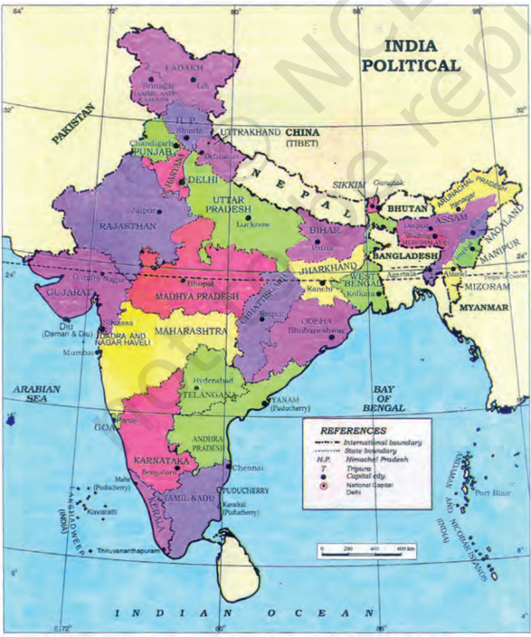
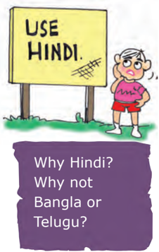
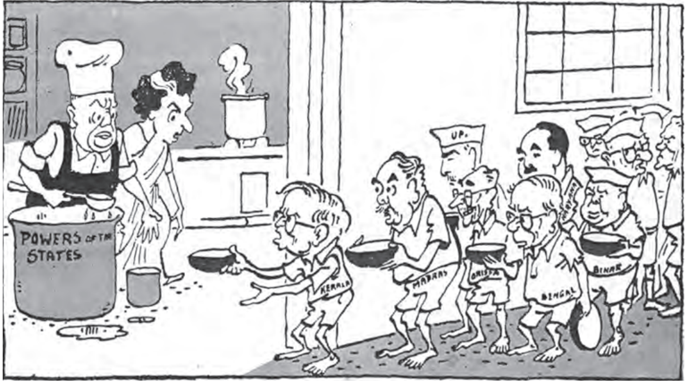
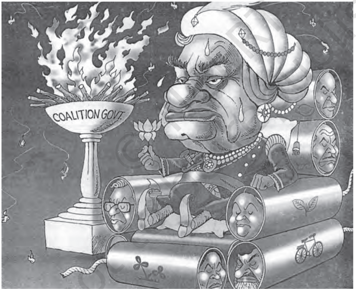
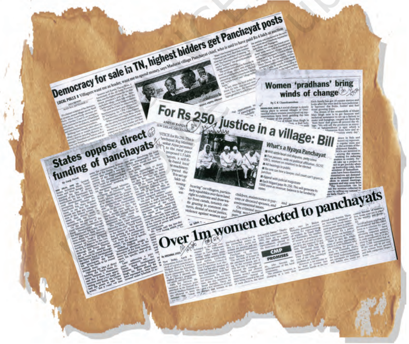

# PAGE 1

## Federalism

## Overview

In the previous chapter, we noted that vertical division of power among different levels of government is one of the major forms of power-sharing in modern democracies. In this chapter, we focus on this form of powersharing.  It  is  most  commonly  referred  to  as  federalism.  We  begin  by describing federalism in general terms. The rest of the chapter tries to understand the theory and practice of federalism in India. A discussion of the federal constitutional provisions is followed by an analysis of the policies and politics that has strengthened federalism in practice. Towards the end of the chapter, we turn to the local government, a new and third tier of Indian federalism.

# PAGE 2

I am confused. What do we call the Indian government? Is it Union, Federal or Central?

## What is federalism?

Let  us  get  back  to  the  contrast between  Belgium  and  Sri  Lanka that we saw in the last chapter. You would  recall  that  one  of  the  key changes  made  in  the  Constitution of Belgium was to reduce the power of the Central Government and  to  give  these  powers  to  the regional governments. Regional governments existed in Belgium even  earlier.  They  had  their  roles and  powers.  But  all  these  powers were  given  to  these  governments and  could  be  withdrawn  by  the Central  Government.  The  change that took place in 1993 was that the regional  governments  were  given constitutional powers that were no longer dependent on the central government. Thus, Belgium shifted from a unitary to a federal form of government.  Sri  Lanka  continues to  be,  for  all  practical  purposes,  a unitary  system  where  the  national government  has  all the powers. Tamil  leaders  want  Sri  Lanka  to become a federal system.

Federalism is a system of government in which the power is divided between a central authority and various constituent units of the country.  Usually,  a  federation  has two levels of government. One is the government for the entire country that  is  usually  responsible  for  a few  subjects  of  common  national interest.  The    others  are  governments at  the  level  of  provinces  or  states that  look  after  much  of  the  dayto-day administering of their state. Both  these  levels  of  governments enjoy  their  power  independent  of the other.

Source: Montreal and Kingston, Handbook of Federal Countries: 2002 , McGill-Queen's University Press, 2002.

Though only 25 of the world's 193 countries have federal political systems, their citizens make up 40 per cent of the world's population. Most of the large countries of the world are federations. Can you notice an exception to this rule in this map?

# PAGE 3

In this sense, federations are contrasted  with  unitary  governments. Under  the  unitary  system,  either there is only one level of government or the sub-units are subordinate to the central government. The central government can pass on orders to the provincial or the local government. But in a federal system, the central government cannot order the state government to do something. State government has powers of its own for which it is not answerable to  the  central  government.  Both these governments  are  separately answerable to the people.

Let us look at some of the key features of federalism :

- 1   There are two or more levels (or tiers) of government.
- 2   Different  tiers  of  government govern the same citizens, but each  tier  has  its  own jurisdiction in  specific  matters  of  legislation, taxation and administration.
- 3   The  jurisdictions  of  the  respective levels  or  tiers  of  government  are specified in the constitution. So the existence and authority of each tier of  government  is  constitutionally guaranteed.
- 4   The fundamental provisions of the constitution cannot be unilaterally changed by one level of government.  Such  changes  require the  consent  of  both  the  levels  of government.
- 5   Courts have the power to interpret the constitution and the  powers  of  different  levels  of government. The highest court acts  as  an  umpire  if  disputes  arise between different levels of government in the exercise of their respective powers.
- 6   Sources of revenue for each level of government are clearly specified to ensure its financial autonomy.

7   The federal system thus has dual objectives: to safeguard and promote unity  of  the  country,  while  at  the same  time  accommodate  regional diversity.  Therefore,  two  aspects are  crucial  for  the  institutions  and practice of federalism. Governments at  different  levels  should  agree  to some rules of power-sharing. They should  also  trust  that  each  would abide by its part of the agreement. An  ideal  federal  system  has  both aspects : mutual trust and agreement to live together.

The exact balance of power between  the  central  and  the  state government varies from one federation to another.  This balance depends  mainly  on  the  historical context in which the federation was formed. There are two kinds of routes through which federations have been formed. The  first route involves independent States coming together on their own to form a bigger unit, so that by pooling sovereignty and retaining identity, they can increase their security. This type of 'coming together' federations include  the USA, Switzerland and Australia. In this first category of federations, all the  constituent  States  usually  have equal power and are strong vis-à-vis the federal government.

The  second  route  is  where  a large  country  decides  to  divide  its power between the constituent States and the national government. India, Spain and Belgium are examples  of  this  kind  of 'holding together' federations. In this second category, the Central Government tends  to  be  more  powerful  vis-àvis  the  States.  Very  often  different constituent  units  of  the  federation have  unequal  powers.  Some  units are granted special powers.

If federalism works only in big countries, why did Belgium adopt it?

Jurisdiction: The area over which someone has legal authority. The area may be defined in terms of geographical boundaries or in terms of certain kinds of subjects.

# PAGE 4

Some Nepalese citizens were discussing the proposals on the adoption of federalism in their new constitution. This is what some of them said:

Khag Raj : I don't like federalism. It would lead to reservation of seats for different caste groups as in India.

Sarita :  Ours in not a very big country. We don't need federalism.

Babu Lal : I am hopeful that the Terai areas will get more autonomy if they get their own state government.

Ram Ganesh : I like federalism because it will mean that powers that were earlier enjoyed by the king will now be exercised by our elected representatives.

If you were participating in this conversation, what would be your response to each of these? Which of these reflect a wrong understanding of what federalism is? What makes India a federal country?

## What makes India a federal country?

We have earlier  seen  how  small countries like Belgium and Sri Lanka face so many problems of managing diversity. What about a vast country like India, with so many languages, religions  and  regions?  What  are the  power sharing arrangements in our country?

Let  us  begin  with  the  Constitution. India had emerged as an independent nation  after  a  painful  and  bloody partition. Soon after Independence, several princely states became a part of  the  country.  The  Constitution declared India as a Union of States. Although it did not use the word federation, the Indian Union is based on the principles of federalism.

Let  us  go  back  to  the  seven features  of  federalism  mentioned above.  We  can  see  that  all  these features  apply  to  the  provisions of  the  Indian  Constitution.  The Constitution  originally  provided for a two-tier system of government, the  Union  Government  or  what we call  the  Central  Government, representing  the  Union  of  India and the State  governments.  Later, a third tier of federalism was added in  the  form  of  Panchayats  and Municipalities. As in any federation, these  different  tiers  enjoy  separate jurisdiction.    The  Constitution clearly  provided  a  three-fold distribution  of  legislative  powers between the  Union  Government and the State Governments. Thus, it contains three lists:

-  Union List includes  subjects of  national  importance,  such  as defence  of  the  country,  foreign affairs,  banking,  communications and  currency.  They  are  included in  this  list  because  we  need  a uniform policy  on  these  matters throughout the country. The Union Government alone can make laws relating  to  the  subjects  mentioned in the Union List.
-  State  List contains  subjects of  State  and  local  importance, such  as  police,  trade,  commerce, agriculture and irrigation. The State Governments alone can make laws relating  to  the  subjects  mentioned in the State List.
-  Concurrent  List includes subjects  of  common  interest  to both  the  Union  Government  as well as the State Governments, such

Isn't that strange? Did our constitution makers not know about federalism? Or did they wish to avoid talking about it?

# PAGE 5

as  education,  forest,  trade  unions, marriage, adoption and succession. Both the Union as well as the State Governments can make laws on the subjects mentioned in this list. If  their  laws  conflict  with  each other, the law made by the Union Government will prevail.

What about subjects that do not fall  in  any  of  the  three  lists?  Or  subjects like computer software that came up after  the  constitution  was  made? According to our constitution, the Union Government has the power to legislate on these 'residuary' subjects.

We  noted  above  that  most federations  that  are  formed  by 'holding together' do not give equal power to its constituent units. Thus, all States in the Indian Union do not have identical powers. Some States enjoy  a  special  status.  States  such as  Assam,  Nagaland,  Arunachal Pradesh and Mizoram enjoy special powers under certain provisions of the  Constitution  of  India  (Article 371)  due  to  their  peculiar  social and historical circumstances. These special powers are especially enjoyed in  relation  to  the  protection  of land  rights  of  indigenous  peoples, their  culture  and  also  preferential employment in government services. Indians  who  are  not  permanent residents  of  this  State  cannot  buy land or house here. Similar special provisions exist for some other States of India as well.

There  are  some  units  of  the Indian Union which enjoy very little power. These are areas which are too small to become an independent State but which could not be merged with  any  of  the  existing  States. These  areas,  like  Chandigarh,  or Lakshadweep or the capital city of Delhi, are called Union Territories. These territories  do  not  have  the powers  of  a  State.  The  Central Government has special powers in running these areas.

This sharing of power between the Union Government and the State Governments is basic to the structure of the Constitution. It is not easy to make changes to this power sharing arrangement. The Parliament cannot on its own change this arrangement. Any change to it has to be first passed by both the Houses of Parliament with at  least  two-thirds  majority. Then it has to be ratified by the legislatures  of  at  least  half  of  the total States.

The judiciary plays an important role in overseeing the implementation of  constitutional  provisions  and procedures. In case of any dispute about the division of  powers,  the High Courts and the Supreme Court make a decision.  The  Union  and State Governments have the power to raise resources by levying taxes in order to carry on the government and the responsibilities assigned to each of them.

Listen to one national and one regional news bulletin broadcast by All India Radio daily for one week. Make a list of news items related to government policies or decisions by classifying these into the following categories:

-  News items that relate only to the Central Government,
-  News items that relate only to your or any other State Government,
-  News items about the relationship between the Central and State Governments.

If agriculture and commerce are state subjects, why do we have ministers of agriculture and commerce in the Union cabinet?

# PAGE 6

-  Pokharan, the place where India conducted its nuclear tests, lies in Rajasthan. Suppose the Government of Rajasthan was opposed to the Central Government's nuclear policy, could it prevent the Government of India from conducting the nuclear tests?
-  Suppose the Government of Sikkim plans to introduce new textbooks in its schools. But the Union Government does not like the style and content of the new textbooks. In that case, does the state government need to take permission from the Union Government before these textbooks can be launched?
-  Suppose the Chief Ministers of Andhra Pradesh, Chhattisgarh and Orissa have different policies on how their state police should respond to the naxalites. Can the Prime Minister of India intervene and pass an order that all the Chief Ministers will have to obey?

# PAGE 7

## How is federalism practised?

Constitutional  provisions  are necessary for the success of federalism but these are not sufficient. If the federal  experiment  has  succeeded in India, it is not merely because of the  clearly  laid  out  constitutional provisions.  The  real  success  of federalism in India can be attributed to the nature of democratic politics in  our  country.  This  ensured  that the  spirit  of  federalism,  respect for  diversity  and  desire  for  living together became shared ideals in our country. Let us look at some of the major ways in which this happened.

## Linguistic States

The creation  of  linguistic  States was the first and a major test for democratic politics in our country.

If  you look at the political map of India when it began its journey as a democracy in 1947 and that of 2019, you will be surprised by the extent of the changes. Many old States have vanished and many new States have been  created.  Areas,  boundaries and names of the States have been changed.

In 1947, the boundaries of several old States of India were changed in order to create new States. This was done  to  ensure  that  people  who spoke the  same  language  lived  in the  same  State.  Some  States  were created not on the basis of language but  to  recognise  differences  based on culture, ethnicity or geography. These include States like Nagaland, Uttarakhand and Jharkhand.

-  Has your village  / town  / city remained under the same State since Independence? If not, what was the name of the earlier State?
-  Can you identify names of three States in 1947 that have been changed later?
-  Identify any three States which have been carved out of  bigger States.

# PAGE 8

## Coalition government:

A government formed by the coming together of at least two political parties. Usually partners in a coalition form a political alliance and adopt a common programme.

When  the  demand  for  the formation of States on the basis of language was raised, some national leaders feared that it would lead to the  disintegration  of  the  country. The Central Government resisted linguistic  States  for  some  time. But the experience has shown that the  formation  of  linguistic  States has  actually  made  the  country more  united.  It  has  also  made administration easier.

## Language policy

A second test for Indian federation is the language policy. Our Constitution did  not  give  the  status  of  national language to any one language. Hindi was identified as the official language. But Hindi is the mother tongue of only about 40 per cent of Indians. Therefore, there were many safeguards to  protect  other  languages.  Besides Hindi, there are 22 other languages recognised as Scheduled Languages by the Constitution. A candidate in an  examination conducted for the Central Government positions may opt to take the examination in any of  these  languages.  States  too  have their own official languages. Much of  the  government  work  takes place in the official language of the concerned State.

Unlike Sri  Lanka,  the  leaders of  our  country  adopted  a  very cautious  attitude  in  spreading  the use  of  Hindi.  According  to  the Constitution,  the  use  of  English for official purposes was to stop in 1965.  However,  many non-Hindi speaking States demanded that the use of English  continue. In Tamil Nadu, this movement took a violent form.  The  Central  Government responded by agreeing to continue the use of English along with Hindi for  official  purposes.  Many  critics think that this solution favoured the English-speaking elite.  Promotion of Hindi continues to be the official policy of the Government of India. Promotion does not mean that the Central  Government can impose Hindi on States where people speak a different language. The flexibility shown by Indian political leaders helped our country avoid the kind of situation that Sri Lanka finds itself in.

## Centre-State relations

Restructuring  the  Centre-State relations is one more way in which federalism  has  been  strengthened in practice. How the constitutional arrangements  for  sharing  power work in reality depends to a large extent on how the ruling parties and leaders  follow  these  arrangements. For  a  long  time,  the  same  party ruled both at the Centre and in most of  the  States.  This  meant  that  the State Governments did not exercise their  rights  as  autonomous  federal units. As and when the ruling party at the State level was different, the parties that ruled at the Centre tried to  undermine  the  power  of  the States.    In  those  days,  the  Central Government would often misuse the Constitution to dismiss the State Governments that were controlled by rival  parties.  This  undermined the spirit of federalism.

All this changed significantly after  1990.  This  period  saw  the rise of regional political parties in many States of the country. This was also the beginning of the era of coalition  governments at  the Centre. Since no single party got a clear majority in the Lok Sabha, the major national parties had to enter into an alliance with many parties including several regional parties to form a government at the Centre.

# PAGE 9

## The States Plead for More Powers

Perils of Running a Coalition Government

Here are two cartoons showing the relationship between Centre and States. Should the State go to the Centre with a begging bowl? How can the leader of a coalition keep the partners of government satisfied?

This  led  to  a  new  culture  of power sharing and respect for the autonomy of State Governments. This  trend  was  supported  by  a major judgement of the Supreme Court that made it difficult for the

Central Government to dismiss state governments in an arbitrary manner. Thus, federal power sharing is more effective  today  than  it  was  in  the early  years  after  the  Constitution came into force.

© Ajith Ninan India Today Book of Cartoons

© Kutty Laughing with Kutty

Are you suggesting that regionalism is good for our democracy? Are you serious?

# PAGE 10

## Linguistic diversity of India

How many languages do we have in India? The answer depends on how one counts it. The latest information that we have is from the Census of India held in 2011. This census recorded more than 1300 distinct languages which people mentioned as their mother tongues. These languages were grouped together under some major languages. For example, languages like Bhojpuri, Magadhi, Bundelkhandi, Chhattisgarhi, Rajasthani and many others were grouped together under 'Hindi'. Even after this grouping, the Census found 121 major languages. Of these, 22 languages are now included in the Eighth Schedule of the Indian Constitution and are therefore called 'Scheduled Languages'. Others are called 'non-Scheduled Languages'. In terms of languages, India is perhaps the most diverse country in the world.

+

A look at the enclosed table makes it clear that no one language is the mother tongue of the majority of our population. The largest language, Hindi, is the mother tongue of only about 44 per cent Indians. If we add to that all those who knew Hindi as their second or third language, the total number was still less than 50 per cent in 2011. As for English, only 0.02 per cent Indians recorded it as their mother tongue. Another 11 per cent knew it as a second or third language.

Read this table carefully, but you need not memorise it. Just do the following:

-  Make a bar or pie chart on the basis of this information.
-  Prepare a map of linguistic diversity of India by shading the region where each of these languages is spoken on the map of India.
-  Find out about any three languages that are spoken in India but are not included in this table.

## Scheduled Languages of India

| Language   | Proportion of speakers (%)   |
|------------|------------------------------|
| Assamese   | 1.26                         |
| Bengali    | 8.03                         |
| Bodo       | 0.12                         |
| Dogri      | 0.21                         |
| Gujarati   | 4.58                         |
| Hindi      | 43.63                        |
| Kannada    | 3.61                         |
| Kashmiri   | 0.56                         |
| Konkani    | 0.19                         |
| Maithili   | 1.12                         |
| Malayalam  | 2.88                         |
| Manipuri   | 0.15                         |
| Marathi    | 6.86                         |
| Nepali     | 0.24                         |
| Odia       | 3.10                         |
| Punjabi    | 2.74                         |
| Sanskrit   | N                            |
| Santali    | 0.61                         |
| Sindhi     | 0.23                         |
| Tamil      | 5.70                         |
| Telugu     | 6.70                         |
| Urdu       | 4.19                         |

N - Stands for negligible.

Source : http://www.censusindia.gov.in

# PAGE 11

'

Read the following excerpts from an article by noted historian, Ramachandra Guha, that appeared in the Times of India on November 1, 2006:

'

Take the example of your own state or any other state that was affected by linguistic reorganisation. Write a short note for or against the argument given by the author here on the basis of that example.

# PAGE 12

## Decentralisation in India

We  noted  above  that  federal governments  have  two  or  more tiers  of  governments.  We  have so  far  discussed  the  two-tiers  of government in our country. But a  vast  country  like  India  cannot be  run  only  through  these two-tiers. States in India are as large as independent countries of Europe. In terms of population, Uttar Pradesh is  bigger  than  Russia,  Maharashtra is  about  as  big  as  Germany.  Many of  these  States  are  internally  very diverse.  There  is  thus  a  need  for power sharing within these States. Federal power sharing in India needs another tier of  government, below that of the State governments. This is the rationale for decentralisation of  power.  Thus,  resulted  a  thirdtier  of  government,  called  local government.

When power is taken away from Central and State governments and given to local government, it is called decentralisation. The basic idea behind decentralisation is that there are a large number of problems and issues which are best settled at the local level. People have better knowledge of problems in  their  localities.  They  also  have better ideas on where to spend money and  how  to  manage  things  more efficiently.  Besides,  at  the  local  level it is possible for the people to directly participate in decision making. This helps to inculcate a habit of democratic participation. Local government is the best way to realise  one  important principle of democracy, namely local self-government.

The need for decentralisation was recognised in our Constitution. Since  then,  there  have  been several  attempts  to  decentralise power to the level of villages  and towns. Panchayats in villages  and municipalities in urban areas were set  up  in  all  the  States.  But  these were directly under the control of state governments. Elections to these local  governments  were  not  held regularly.  Local  governments  did not have any powers or resources of their own. Thus, there was very little decentralisation in effective terms.

A major step towards decentralisation  was  taken  in  1992.  The Constitution was amended to make the  third-tier  of  democracy  more powerful and effective.

-  Now  it  is  constitutionally mandatory to hold regular elections to local government bodies.
-  Seats are reserved in the elected bodies  and  the  executive  heads  of these institutions for the Scheduled Castes, Scheduled Tribes and Other Backward Classes.
-  At least one-third of all positions are reserved for women.
-  An  independent  institution called the State Election Commission has  been  created  in  each  State  to conduct panchayat and municipal elections.
-  The  State  governments  are required to share some powers and revenue  with  local  government bodies. The nature of sharing varies from State to State.

Rural  local  government  is popularly  known  by  the  name panchayati  raj.  Each  village,  or  a group of villages in some States, has a gram panchayat. This is a council consisting of several ward members, often called panch, and a president or  sarpanch.  They  are  directly

# PAGE 13

elected by all the adult population living in that ward or village. It is the  decision-making  body  for  the entire village. The panchayat works under the overall supervision of the gram sabha. All the voters in the village  are  its  members.  It  has  to meet at least twice or thrice in a year to approve the annual budget of the gram panchayat and to review the performance of the gram panchayat.

The local government structure goes right up to the district level. A few gram panchayats are grouped together  to  form  what  is  usually called  a  panchayat  samiti  or  block or  mandal.  The  members  of  this representative body are elected by all the panchyat members in that area. All the panchayat samitis or mandals in  a  district  together  constitute the  zilla  (district)  parishad.  Most members of the zilla parishad are elected. Members of the Lok Sabha and MLAs of that district and some other officials of other district level bodies  are  also  its  members.  Zilla parishad chairperson is the political head of the zilla parishad.

Similarly,  local  government bodies  exist  for  urban  areas  as well.  Municipalities  are  set  up  in towns.  Big  cities  are  constituted into  municipal corporations. Both municipalities  and  municipal corporations  are  controlled by  elected  bodies  consisting  of people's representatives. Municipal chairperson is the political head of the  municipality.  In  a  municipal corporation, such an officer is called the mayor.

Prime Minister runs the country. Chief Minister runs the state. Logically, then, the chairperson of Zilla Parishad should run the district. Why does the D.M. or Collector administer the district?

What do these newspaper clippings have to say about efforts of decentralisation in India?

# PAGE 14

+

## An experiment in Brazil

A city called Porto Alegre in Brazil has carried out an extraordinary  experiment in combining decentralisation with participative democracy. The city has set up a parallel organisation operating alongside the municipal council, enabling local inhabitants to take real decisions for their city. The nearly 13 lakh people in this city get to participate in making the budget for their own city. The city is divided into many sectors or what we call wards. Each sector has a meeting, like that of the gram sabha, in which anyone living in that area can participate. There are some meetings to discuss issues that affect the entire city. Any citizen of the city can participate in those meetings. The budget of the city is discussed in these meetings. The proposals are put to the municipality that takes a final decision about it.

About 20,000 people participate in this decision making exercise every year. This method has ensured that the money cannot be spent only for the benefit of the colonies where rich people live. Buses now run to the poor colonies and builders cannot evict slum-dwellers without resettling them.

In our own country, a similar experiment has taken place in some areas in Kerala. Ordinary people have participated in making a plan for the development of their locality.

This  new  system  of  local government is the largest experiment in democracy conducted anywhere in the world. There are now about 36  lakh  elected  representatives  in the  panchayats  and  municipalities etc.,  all  over  the  country.  This number is bigger than the population of  many  countries  in  the  world. Constitutional  status  for  local government has helped to deepen democracy in our country. It has also increased  women's representation and  voice  in  our  democracy.  At the  same  time,  there  are  many difficulties.  While  elections  are held regularly and enthusiastically, gram sabhas are not held regularly. Most state  governments have not transferred significant powers to the local  governments. Nor have they given  adequate  resources.  We  are thus still a long way from realising the ideal of self-government.

Find out about the local government in the village or town you live in.

If you live in a village, find out the names of the following: your panch or ward member, your sarpanch, your panchayat samiti, the chairperson of your zilla parishad. Also find out when did the last meeting of the gram sabha take place and how many people took part in that.

If you live in urban areas, find out the name of your municipal councillor, and the municipal chairperson or mayor. Also find out about the budget of your municipal corporation, municipality and the major items on which money was spent.

# PAGE 15

1.   Locate the following States on a blank outline political map of India: Manipur, Sikkim, Chhattisgarh and Goa.
2.   Identify and shade three federal countries (other than India) on a blank outline political map of the world.
3.   Point out one feature in the practice of federalism in India that is similar to and one feature that is different from that of Belgium.
4.   What is the main difference between a federal form of government and a unitary one? Explain with an example.
5.   State any two differences between the local government before and after the Constitutional amendment in 1992.
6.   Fill in the blanks:

Since the United States is a   \_\_\_\_\_\_\_\_\_\_\_\_\_\_\_\_\_\_\_ type of federation, all the constituent States have equal powers and States are \_\_\_\_\_\_\_\_\_\_\_\_\_\_vis-à-vis the federal government. But India is a \_\_\_\_\_\_\_\_\_\_\_\_\_\_\_\_\_\_\_\_\_ type of federation and some States have more power than others. In India, the \_\_\_\_\_\_\_\_\_\_\_\_ government has more powers.

7.   Here are three reactions to the language policy followed in India. Give an argument and an example to support any of these positions. Sangeeta : The policy of accommodation has strengthened national unity.

Arman : Language-based States have divided us by making everyone conscious of their language.

Harish : This policy has only helped to consolidate the dominance of English over all other languages.

8.   The distinguishing feature of a federal government is:
2. (a) National government gives some powers to the provincial governments.
3. (b) Power is distributed among the legislature, executive and judiciary.
4. (c) Elected officials exercise supreme power in the government.
5. (d) Governmental power is divided between different levels of government.
9. A few subjects in various Lists of the Indian Constitution are given here. Group them under the Union, State and Concurrent Lists as provided in the table below.
- A.  Defence; B. Police; C. Agriculture; D. Education;
- E.  Banking; F. Forests; G. Communications; H. Trade; I. Marriages

Union List

State List

Concurrent List

# PAGE 16

## Exercises

10. Examine the following pairs that give the level of government in India and the powers of the government at that level to make laws on the subjects mentioned against each. Which of the following pairs is not correctly matched?
11. Match List I with List II and select the correct answer using the codes given below the lists:
12. Consider the following two statements.
- A. In a federation, the powers of the federal and provincial governments are clearly demarcated.
- B.  India is a federation because the powers of the Union and State Governments are specified in the Constitution and they have exclusive jurisdiction on their respective subjects.
- C.  Sri Lanka is a federation because the country is divided into provinces.
- D.  India is no longer a federation because some powers of the States have been devolved to the local government bodies.

| (a) State government              | State List       |
|-----------------------------------|------------------|
| (b) Central government            | Union List       |
| (c) Central and State governments | Concurrent List  |
| (d) Local governments             | Residuary powers |

| List I                   | List II           |
|--------------------------|-------------------|
| 1. Union of India        | A. Prime Minister |
| 2. State                 | B. Sarpanch       |
| 3. Municipal Corporation | C. Governor       |
| 4. Gram Panchayat        | D. Mayor          |

|     | 1   | 2   | 3   | 4   |
|-----|-----|-----|-----|-----|
| (a) | D   | A   | B   | C   |
| (b) | B   | C   | D   | A   |
| (c) | A   | C   | D   | B   |
| (d) | C   | D   | A   | B   |

Which of the statements given above are correct?

(a) A, B and C   (b) A, C and D   (c) A and B only   (d) B and C only