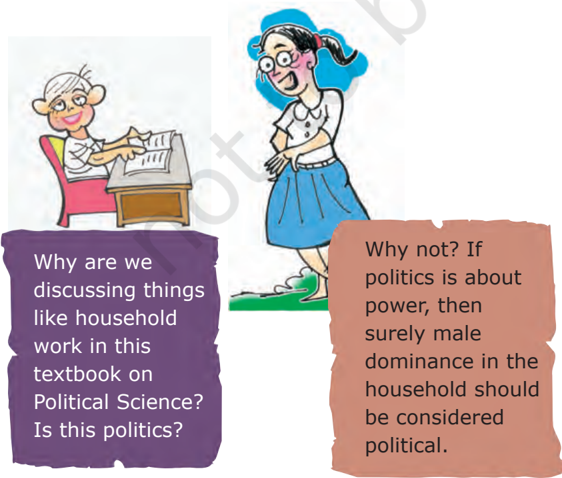
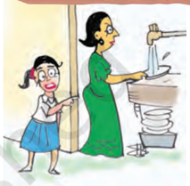
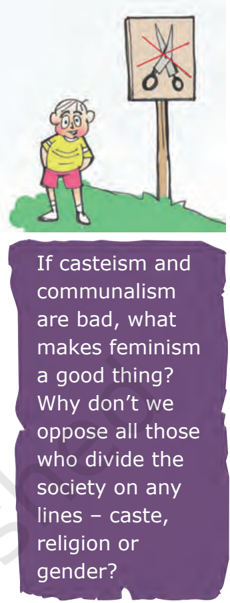
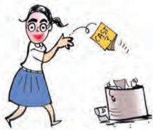
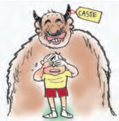

# PAGE 1

## Gender, Religion and Caste

## Overview

The existence of social diversity does not threaten democracy. Political expression of social differences is possible and sometimes quite desirable in a democratic system. In this chapter we apply these ideas to the practice of democracy in India. We look at three kinds of social differences that can take the form of social divisions and inequalities. These are social differences based on gender, religion and caste. In each case we look at the nature of this division in India and how it gets expressed in politics. We also ask whether different expressions based on these differences are healthy or otherwise in a democracy.

# PAGE 2

## Sexual division of labour:

A system in which all work inside the home is either done by the women of the family, or organised by them through the domestic helpers.

## Gender and politics

A poster from Bengal affirming women's strength.

Let us begin with gender division. This is a form of hierarchical social division  seen  everywhere,  but  is rarely  recognised  in  the  study  of politics.  The  gender  division  tends to  be  understood  as  natural  and unchangeable. However, it is not based  on  biology  but  on  social expectations and stereotypes.

© Zuban

## Public/private division

Boys and girls  are  brought  up  to believe that the main responsibility of women is housework and bringing up children. This is reflected in a sexual division of labour in most families: women do all work inside the home such as cooking, cleaning, washing clothes, tailoring, looking after children, etc., and men do all the work outside the home. It is not that men cannot do housework; they simply think that it is for women to attend to these things. When these jobs are paid for, men are ready to take up these works. Most tailors or cooks in hotels are men. Similarly, it  is  not  that  women do not work outside  their  home.  In  villages, women fetch water, collect fuel and work in the fields. In urban areas, poor  women  work  as  domestic helper in middle class homes, while middle class women work in offices. In fact, the majority of women do some sort of paid work in addition to domestic labour. But their work is  not  valued  and  does  not  get recognition.

The result  of  this  division  of labour  is  that  although  women constitute half of the humanity, their role in public life, especially politics, is minimal in most societies. Earlier, only men were allowed to participate in  public  affairs,  vote  and  contest for  public  offices.  Gradually  the gender issue was raised in politics. Women in different parts  of  the world organised  and  agitated  for equal rights. There were agitations in  different  countries  for  the extension of voting rights to women.

# PAGE 3

These  agitations  demanded enhancing  the  political  and  legal status of women and improving their educational and career opportunities. More radical women's movements aimed at equality in  personal  and family life as well. These movements are called feminist movements.

Political  expression  of  gender division  and  political  mobilisation

© Zuban on this question helped to improve women's role in public life. We now find  women working as scientists, doctors,  engineers,  lawyers, managers and college and university teachers  which  were  earlier  not considered suitable for women. In some parts of the world, for example in  Scandinavian  countries,  such  as Sweden, Norway and Finland, the

Discuss all these perceptions of an ideal woman that prevail in our society. Do you agree with any of these? If not, what is your image of an ideal woman?

Feminist: A woman or a man who believes in equal rights and opportunities for women and men.

# PAGE 4

+

Patriarchy: Literally, rule by father, this concept is used to refer to a system that values men more and gives them power over women.

participation of women in public life is very high.

In our country, women still lag much behind men despite  some improvement since Independence. Ours  is  still  a  male-dominated, patriarchal society.  Women face

A 'time use survey' was conducted in six states of our country. It shows that an average woman works every day for a little over seven and half hours while an average man works for six and a half hours. Yet the work done by men is more visible because most of their work leads to generation of income. Women also do a lot of direct income generating work, but the bulk of their work is household related. This work remains unpaid and invisible.

## Daily time use (hours: minutes)

| Activities                     | Men   | Women   |
|--------------------------------|-------|---------|
| Income generating work         | 6:00  | 2:40    |
| Household and related work     | 0:30  | 5:00    |
| Talking, Gossip                | 1:25  | 1:20    |
| No work/ Leisure               | 3:40  | 3:50    |
| Sleep, self-care, reading etc. | 12:25 | 11:10   |

Source: Government of India, Time Use Survey , 1998-99.

You can conduct a similar time use survey in your own household. Observe all the adult male and female members of your family for one week. Every day note down the number of hours each of them spends on the following activities: income generating activity (working at the office or shop or factory or field, etc.), household related activity (cooking, cleaning, washing, fetching water, looking after children or elders, etc.), reading and recreation, talking/gossiping, self-care, taking rest or sleeping. If necessary make new categories. Add up the time taken on each activity for a week and calculate the daily average for each activity for each member. Do women work more in your family as well?

disadvantage,  discrimination  and oppression in various ways:

-  The literacy rate among women is  only 54 per cent compared with 76 per cent among men. Similarly, a smaller proportion of girl students go  for  higher  studies.  When  we

# PAGE 5

look at school results, girls perform as  well  as  boys,  if  not  better  in some  places.  But  they  drop  out because parents prefer to spend their resources for their boys' education rather than spending equally on their sons and daughters.

-  No wonder the proportion of women among the highly paid and valued jobs, is still  very  small.  On an average, an Indian woman works one hour more than an average man every day. Yet much of her work is  not  paid  and  therefore,  often not valued.

Source: Census Report of 2011

-  The Equal Remuneration Act, 1976  provides  that  equal  wages should  be  paid  to  equal  work. However in  almost  all  areas  of work, from sports and cinema, to factories and fields, women are paid less than men, even when both do exactly the same work.
-  In many parts of India, parents prefer to have sons and find ways to have the girl  child  aborted  before she  is  born.  Such  sex-selective abortion led to a decline in child sex ratio  (number of girl  children  per thousand boys) in the country to merely 919. As the map shows, this

Mummy always says to outsiders: 'I don't work. I am a housewife.' But I see her working non-stop all the time. If what she does is not work, what else is work?

Can you identify your State on this map? What is the child sex ratio in it? How is it different from others with a different colour?

Identify the States which have child sex ratio below 900.

Compare this map with the poster on the next page. How do the two of them tell us about the same issue?

# PAGE 6

© Oxfam GB

ratio  has  fallen  below  850  or  even 800 in some States.

There  are  reports  of  various kinds  of  harassment,  exploitation and violence against women. Urban areas  have  become  particularly unsafe for women. They are not safe even within their own home from beating, harassment and other forms of domestic violence.

## Women's political representation

All  this  is  well  known.  Yet  issues related  to  women's  well  being  or otherwise  are  not  given  adequate attention.  This  has  led  many feminists and women's movements to the conclusion that unless women control power, their problems will not get adequate attention.  One way to ensure this is to have more women as elected representatives.

In  India,  the  proportion  of women in legislature has been very low.  For  example,  the  percentage of elected women members in Lok Sabha has touched 14.36 per cent of its  total  strength  for  the  first  time in  2019.  Their  share  in  the  state assemblies  is  less  than  5  per  cent. In  this  respect,  India  is  among  the

Could you think of some reasons why women's representation is so low in India? Do you think Americas and Europe have achieved a satisfactory level of women's representation?

# PAGE 7

bottom  group  of  nations  in  the world (see the graph below). India is  behind  the  averages  for  several developing countries of Africa and Latin America. In the government, cabinets  are  largely  all-male  even when a woman becomes the Chief Minister or the Prime Minister.

One way to solve this problem is to make it legally binding to have a fair proportion of women in the elected bodies. This is what the Panchayati Raj has done in India. One-third of seats in local government bodies -  in panchayats and municipalities - are now reserved for women. Now there are more than 10 lakh elected women representatives  in  rural  and  urban local bodies.

Women's organizations  and activists  had  been  demanding  a similar  reservation  of  at  least  onethird  of  seats  in  Lok  Sabha  and State  Assemblies  for  women.  A bill with this proposal was pending before  the  Parliament  for  many decades. In 2023, Nari shakti Vandan Adhiniyam (Womens' Reservation Act,  2023)  has  been  passed  which will  give  33  percent  reservation  of seats for women in Lok Sabha, State Legislative Assemblies and also Delhi Assembly.

Gender division is an example that  some  form  of  social  division needs to be expressed in politics. This also shows that disadvantaged groups do  benefit  when  social  divisions become a political  issue.  Do  you think that women could have made the  gains  we  noted  above  if  their unequal treatment was not raised in the political domain?

# PAGE 8

I am not religious. Why should I bother about communalism and secularism?

## Religion, communalism and politics

Let us now turn to a very different kind of social division, the division based  on  religious  differences. This  division  is  not  as  universal as  gender,  but  religious  diversity is  fairly  widespread  in  the  world today.  Many  countries  including India  have  in  their  population, followers of different religions. As we noticed in the case of Northern Ireland,  even  when  most  of  the people belong to the same religion, there  can  be  serious  differences about the way people practice that religion. Unlike gender differences, the religious differences are often expressed in the field of politics.

Consider the following:

-  Gandhiji  used  to  say  that religion  can  never  be  separated from politics.  What he meant by religion  was  not  any  particular religion  like  Hinduism  or  Islam but  moral  values  that  inform  all religions. He believed that politics must  be  guided  by  ethics  drawn from religion.
-  Human rights groups  in  our country  have  demanded  that  the Government should take special steps  to  prevent  communal  riots and protect religious minorities.
-  Women's movement has argued that family  laws of  all  religions discriminate  against  women. So  they  have  demanded  that government should change these laws to make them more equitable.

All  these  instances  involve a  relationship  between  religion and  politics.  But  they  do  not seem  very  wrong  or  dangerous. Ideas,  ideals  and  values  drawn from  different  religions  can  and perhaps  should  play  a  role  in politics.  People  should  be  able to  express  in  politics  their  needs, interests and demands as a member of  a  religious  community.  Those who hold political  power  should sometimes be able to regulate the practice of religion so as to prevent discrimination  and  oppression. These political acts are not wrong as long as they treat every religion equally.

## Communalism

The problem begins when religion is  seen  as  the  basis  of  the  nation. The example of Northern Ireland in Chapter 3 shows the dangers of such an approach to nationalism. The problem becomes more acute when  religion  is  expressed  in politics  in  exclusive  and  partisan terms,  when  one  religion  and its  followers  are  pitted  against another. This happens when beliefs of  one  religion  are  presented  as superior to those of other religions, when the demands of one religious group are formed in opposition to another  and  when  state  power  is used to establish domination of one religious group over the rest. This manner of using religion in politics is communal politics.

Communal politics  is  based on  the  idea  that  religion  is  the principal basis of social community. Communalism involves thinking

# PAGE 9

along  the  following  lines.  The followers  of  a  particular  religion must belong to  one  community. Their  fundamental  interests  are the same. Any difference that they may have is  irrelevant  or  trivial for community life. It also follows that  people  who  follow  different religions cannot belong to the same social  community. If the followers of  different  religions  have  some commonalities these are superficial and immaterial, their interests  are bound to be different and involve a  conflict.  In  its  extreme  form, communalism leads to the belief that  people  belonging  to  different religions cannot live as equal citizens within one nation. Either, one of them has to dominate the rest or they have to form different nations.

This  belief  is  fundamentally flawed.    People  of  one  religion do  not  have  the  same  interests and  aspirations  in  every  context. Everyone has several other roles, positions  and  identities.  There are  many  voices  inside  every community. All these voices have a  right  to  be  heard.  Therefore any attempt to bring all followers of one religion  together  in  context  other than religion is  bound to suppress many voices within that community.

Communalism can take various forms in politics:

-  The most common expression of  communalism  is  in  everyday beliefs.  These  routinely  involve religious  prejudices,  stereotypes  of religious communities and belief in the superiority of one's religion over other religions. This is so common
- that we often fail to notice it, even when we believe in it.
-  A communal mind often leads to a quest for political dominance of one's own religious community. For those belonging to majority community, this takes the form of majoritarian dominance.  For  those  belonging to the minority community, it can take the form of a desire to form a separate political unit.
-  Political  mobilisation  on religious  lines  is  another  frequent form of communalism. This involves the use of sacred symbols, religious leaders, emotional appeal and plain fear in order to bring the followers of  one  religion  together  in  the political arena. In electoral politics, this often involves special appeal to the interests or emotions of voters of one religion in preference to others.
-  Sometimes communalism takes its  most  ugly  form  of  communal violence,  riots  and  massacre.  India and Pakistan suffered some of the worst communal riots at the time of the Partition. The post-Independence period  has  also  seen  large  scale communal violence.

## Secular state

Communalism was and continues to  be  one  of  the  major  challenges to democracy in our country. The makers of our Constitution were aware of this challenge. That is why, they chose the model of a secular state.  This  choice  was  reflected  in several constitutional provisions that we studied last year:

-  There is no official religion for the Indian state. Unlike the status of Buddhism in Sri Lanka, that of Islam

Family laws: Those laws that deal with family related matters such as marriage, divorce, adoption, inheritance, etc. In our country, different family laws apply to followers of different religions.

# PAGE 10

in Pakistan and that of Christianity in England, our Constitution does not give a special status to any religion.

-  The Constitution provides to all  individuals  and  communities freedom to  profess,  practice  and propagate any religion,  or  not  to follow any.
-  The  Constitution  prohibits discrimination  on  grounds  of religion.
-  At the same time, the Constitution allows  the  state  to  intervene  in the  matters  of  religion  in  order  to ensure  equality  within  religious communities. For example, it bans untouchability.

Understood  in  this  sense, secularism is not just an ideology of some parties or persons. This idea constitutes  one  of  the  foundations of  our  country.  Communalism should  not  be  seen  as  a  threat  to some people in India. It threatens the very idea of India. That is why communalism needs to be combated. A secular  Constitution  like  ours is  necessary  but  not  sufficient  to combat communalism. Communal prejudices and propaganda need to be  countered  in  everyday  life  and religion- based mobilisation needs to be countered in the arena of politics.

## Caste and politics

We have seen two instances of the expression of social divisions in the arena of politics, one largely positive and the other largely negative. Let us turn to our final case, that of caste and politics, that has both positive and the negative aspects.

## Caste inequalities

Unlike gender and religion,  caste division is  special  to  India.  All  societies have some kind of social inequality and some form of division of labour. In  most  societies,  occupations  are passed  on  from  one  generation  to another. Caste system is an extreme form of this. What makes it different from other societies is that in this system,  hereditary  occupational division  was  sanctioned  by  rituals. Members of the same caste group were  supposed  to  form  a  social community that practiced the same or  similar  occupation,  married within  the  caste  group  and  did not eat with members from other caste groups.

Caste  system  was  based  on exclusion  of  and  discrimination against the 'outcaste' groups. They were  subjected  to  the  inhuman practice  of  untouchability  about which you have studied in Class IX.  That  is  why  political  leaders and  social  reformers  like  Jotiba Phule,  Gandhiji,  B.R.  Ambedkar and  Periyar  Ramaswami  Naicker advocated and worked to establish a society in which caste inequalities are absent.

Partly  due  to  their  efforts  and partly due to other socio-economic changes,  castes  and  caste  system in  modern  India  have  undergone great  changes.  With  economic d e v e l o p m e n t , l a r g e s c a l e urbanisation , growth of literacy and education, occupational mobility and the weakening of the position of landlords in the villages, the old notions  of caste  hierarchy are breaking down. Now, most of the

# PAGE 11

## Social and Religious Diversity of India

The Census of India records the religion of each and every Indian after every ten years. The person who fills the Census form visits every household and records the religion of each member of that household exactly the way each person describes it. If someone says she has 'no religion' or that he is an 'atheist', this is exactly how it is recorded. Thus we have reliable information on the proportion of different religious communities in the country and how it has changed over the years. The pie chart below presents the  population  proportion  of  six  major  religious  communities  in  the  country.  Since Independence, the total population of each community has increased substantially but their proportion in the country's population has not changed much. In percentage terms, the population of the Hindus, Jains and Christians has declined marginally since 1961. The proportion of Muslim, Sikh and Buddhist population has increased slightly. There is a common but mistaken impression that the proportion of the Muslims in the country's population is going to overtake other religious communities. Expert estimates done for the Prime Minister's High Level Committee (popularly known as Sachar Committee) show that the proportion of the Muslims is expected to go up a little, by about 3 to 4 per cent, in the next 50 years. It proves that in overall terms, the population balance of different religious communities is not likely to change in a big way.

The same is true of the major caste groups. The Census of India counts two social groups:  the  Scheduled  Castes  and  the  Scheduled  Tribes.  Both  these  broad  groups include hundreds of castes or tribes whose names are listed in an official Schedule. Hence the prefix 'Scheduled' in their name. The Scheduled Castes, commonly known as Dalits , include those that were previously regarded as 'outcaste' in the Hindu social order and were subjected to exclusion and untouchability. The Scheduled Tribes, often referred to as Adivasis , include those communities that led a secluded life usually in hills and forests and did not interact much with the rest of society. In 2011, the Scheduled

Castes were 16.6 per cent and the Scheduled Tribes were 8.6 per cent of the country's population.

The Census does not yet count the Other Backward Classes, the group we discussed in Class IX. Hence there are  some  differences  about  their proportion in the country's population. The  National  Sample  Survey  of 2004-05 estimates their population to be around 41 per cent. Thus the SC, ST and the OBC together account for about two-thirds of the country's population and about three-fourths of the Hindu population.

Source: Census of India, 2011

# PAGE 12

I don't care what my caste is. Why are we discussing all this in the textbook? Are we not promoting casteism by talking about caste?

Urbanisation: Shift of population from rural areas to urban areas.

Occupational mobility: Shift from one occupation to another, usually when a new generation takes up occupations other than those practiced by their ancestors. Caste hierarchy: A ladder-like formation in which all the caste groups are placed from the 'highest' to the 'lowest' castes.

Now you don't like it! Didn't you tell me that wherever there is domination, we should discuss it in Political Science? Will caste disappear if we keep mum about it?

times,  in  urban  areas  it  does  not matter much who is walking along next to us on a street or eating at the next table in a restaurant. The Constitution of India prohibited any caste-based  discrimination  and  laid the foundations of policies to reverse the injustices of the caste system. If a  person  who  lived  a  century  ago were to return to India, she would be  greatly  surprised  at  the  change that has come about in the country.

Yet  caste  has  not  disappeared from  contemporary  India.  Some of  the  older  aspects  of  caste  have persisted.  Even  now  most  people marry within their  own  caste  or tribe. Untouchability has not ended completely, despite  constitutional prohibition.  Effects  of  centuries of  advantages  and  disadvantages continue to be felt today. The caste groups that had access to education under the old system have done very well in acquiring modern education as well. Those groups that did not have  access  to  education  or  were prohibited from acquiring it have naturally lagged behind. That is why there  is  a  disproportionately  large presence  of  'upper  caste'  among the  urban  middle  classes  in  our country.  Caste  continues  to  be closely  linked  to  economic  status. (See Plus Box on Page 41.)

## Caste in politics

As  in  the  case  of  communalism, casteism  is  rooted  in  the  belief that caste is the sole basis of social community. According to this way of  thinking,  people  belonging  to the  same caste  belong  to  a  natural social  community  and  have  the same interests  which  they  do  not share  with  anyone  from  another caste.  As  we  saw  in  the  case  of communalism, such a belief is not borne out by our experience. Caste is one aspect of our experience but it is not the only relevant or the most important aspect.

Caste  can  take  various  forms in politics:

-  When parties choose candidates in elections, they keep in mind the caste composition of the electorate and  nominate  candidates  from different  castes  so  as  to  muster necessary support to win elections. When governments are  formed, political parties usually take care that representatives of different castes and tribes find a place in it.
-  Political  parties  and  candidates in  elections  make  appeals  to  caste sentiment to muster support. Some political parties are known to favour some castes  and  are  seen  as  their representatives.
-  Universal  adult  franchise  and the principle of one-person-one-vote

# PAGE 13

## Caste inequality today

Caste is an important source of economic inequality because it regulates access to resources of various kinds.  For example, in the past, the so-called 'untouchable' castes were denied the right to own land, while only the so-called 'twice born' castes had the right to education.  Although this kind of explicit and formalised inequality based on caste is now outlawed, the effects of centuries of accumulated advantages and disadvantages continue to be felt.  Moreover, new kinds of inequalities have also developed.

The relationship between caste and economic status has certainly changed a lot.  Today, it is possible to find very rich and very poor people in every caste, whether 'low' or 'high'.  This was not true even twenty or thirty years ago - it was very rare indeed to find rich people among the 'lowest' castes. However, as this evidence from the National Sample Survey shows, caste continues to be very strongly linked to economic status in many important ways:

-  The average economic status (measured by criteria like monthly consumption expenditure) of caste groups still follows the old hierarchy the 'upper' castes are best off, the Dalits and Adivasis are worst off, and the backward classes are in between.
-  Although every caste has some poor members, the proportion living in extreme poverty (below the official 'poverty line') is much higher for the lowest castes and much lower for the upper castes, with the backward classes once again in between.
-  Although every caste has some members who are rich, the upper castes are heavily over-represented among the rich while the lower castes are severely under-represented.

## Percentage of population living below the poverty line, 1999---2000

| Caste and Community groups   |   Rural |   Urban |
|------------------------------|---------|---------|
| Scheduled Tribes             |    45.8 |    35.6 |
| Scheduled Castes             |    35.9 |    38.3 |
| Other Backward Classes       |    27   |    29.5 |
| Muslim Upper Castes          |    26.8 |    34.2 |
| Hindu Upper Castes           |    11.7 |     9.9 |
| Christian Upper Castes       |     9.6 |     5.4 |
| Sikh Upper Castes            |     0   |     4.9 |
| Other Upper Castes           |    16   |     2.7 |
| All Groups                   |    27   |    23.4 |

Note: 'Upper Caste' here means those who are not from SC, ST, or OBC. Below the poverty line means those who spent ` 327 or less per person per month in rural and ` 454 or less per person per month in urban areas.

Source: National Sample Survey Organisation (NSSO), Government of India, 55th Round , 1999-2000

# PAGE 14

compelled political leaders to gear up to the task of mobilising and securing political support. It also brought new consciousness among the people of castes that were hitherto treated as inferior and low.

The focus on caste in  politics can sometimes give an impression that elections are all about caste and nothing else. That is far from true. Just consider these:

-  No parliamentary constituency in the country has a clear majority of  one  single  caste.  So,  every candidate and party needs to win the confidence of more than one caste and community to win elections.
-  No party wins the votes of all the voters of a caste or community. When people say that a caste is a 'vote bank' of one party, it usually means that a  large  proportion  of

Do you think that political leaders are right to treat people belonging to a caste as 'vote banks'?

the voters from that caste vote for that party.

-  Many political parties may put up candidates from the same caste (if that caste is believed to dominate the  electorate  in  a  particular constituency).  Some  voters  have more than one candidate from their caste  while  many  voters  have  no candidate from their caste.
-  The ruling party and the sitting MP or MLA frequently lose elections in  our  country.  That  could  not have  happened  if  all  castes  and communities were frozen in their political preferences.

Clearly,  while  caste  matters  in electoral politics, so do many other factors.  The  voters  have  strong attachment to political parties which is  often  stronger  than  their  attachment to their caste or community. People within the same caste or community have different  interests  depending on their economic condition. Rich and poor or men and women from the  same  caste  often  vote  very differently.  People's  assessment  of the performance of the government and  the  popularity  rating  of  the leaders matter and are often decisive in elections.

## Politics in caste

We have so far looked at what caste does to politics. But it does not mean that there is only a one-way relation between caste and politics. Politics too influences the caste system and caste  identities  by  bringing  them into the political arena. Thus, it is not politics that gets caste-ridden, it

# PAGE 15

is the caste that gets politicised. This takes several forms:

-  Each caste group tries to become bigger  by  incorporating  within  it neighbouring castes  or  sub-castes which were earlier excluded from it.
-  Various caste groups are required to enter into a coalition with other castes or communities and thus enter into a dialogue and negotiation.
-  New  kinds  of  caste  groups have come up in the political arena like  'backward'  and  'forward' caste groups.

Thus,  caste  plays  different kinds of roles in politics.  In  some situations,  expression  of  caste differences  in  politics  gives  many disadvantaged  communities  the space  to  demand  their  share  of power. In this sense, caste politics has helped people from Dalits and OBC castes to gain better access to decision  making.  Several  political and non-political organisations have been demanding and agitating for an  end  to  discrimination  against particular  castes,  for  more  dignity and more access to land, resources and opportunities.

At  the  same  time,  exclusive attention  to  caste  can  produce negative  results  as  well.  As  in  the case  of  religion,  politics  based  on caste  identity  alone  is  not  very healthy  in  a  democracy.  It  can divert attention from other pressing issues  like  poverty,  development and corruption. In some cases, caste division leads to tensions, conflict and even violence.

# PAGE 16

1. Mention different aspects of life in which women are discriminated or disadvantaged in India.
2.   State different forms of communal politics with one example each.
3. State how caste inequalities are still continuing in India.
4.   State two reasons to say that caste alone cannot determine election results in India.
5.   What is the status of women's representation in India's legislative bodies?
6.   Mention any two constitutional provisions that make India a secular state.
7.   When we speak of gender divisions, we usually refer to:
8. (a) Biological difference between men and women
9. (b) Unequal roles assigned by the society to men and women
10. (c) Unequal child sex ratio
11. (d) Absence of voting rights for women in democracies
8.   In India seats are reserved for women in
13. (a) Lok Sabha
14. (b) State legislative assemblies
15. (c) Cabinets
16. (d) Panchayati Raj bodies
9. Consider the following statements on the meaning of communal politics. Communal politics is based on the belief that:
- A. One religion is superior to that of others.
- B. People belonging to different religions can live together happily as equal citizens.
- C.  Followers of a particular religion constitute one community.
- D.  State power cannot be used to establish the domination of one religious group over others.

Which of the statements are correct?

## (a) A, B, C, and D    (b) A, B, and D   (c) A and C   (d) B and D

10. Which among the following statements about India's Constitution is wrong? It
2. (a) prohibits discrimination on grounds of religion.
3. (b) gives official status to one religion.
4. (c) provides to all individuals freedom to profess any religion.
5. (d) ensures equality of citizens within religious communities.
11. Social divisions based on \_\_\_\_\_\_\_\_\_ are peculiar to India.

# PAGE 17

12. Match List I with List II and select the correct answer using the codes given below the Lists:

|    | List I                                                                      | List II        |
|----|-----------------------------------------------------------------------------|----------------|
|  1 | A person who believes in equal rights and opportunities for women and men   | A. Communalist |
|  2 | A person who says that religion is the principal basis of community         | B. Feminist    |
|  3 | A person who thinks that caste is the principal basis of community          | C. Secularist  |
|  4 | A person who does not discriminate others on the basis of religious beliefs | D. Castiest    |

|     | 1   | 2   | 3   | 4   |
|-----|-----|-----|-----|-----|
| (a) | B   | C   | A   | D   |
| (b) | B   | A   | D   | C   |
| (c) | D   | C   | A   | B   |
| (d) | C   | A   | B   | D   |

