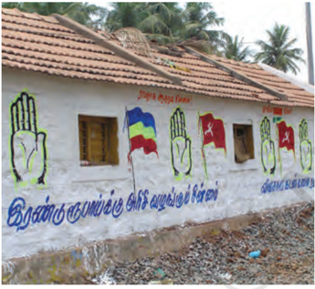
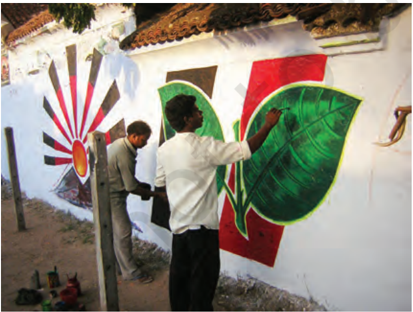
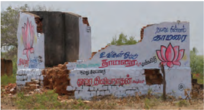
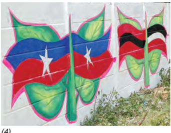
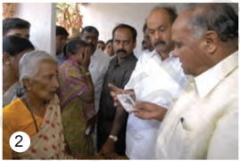
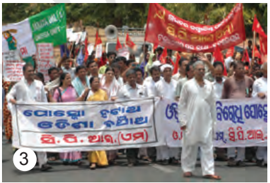
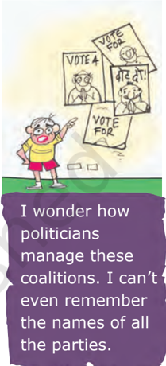
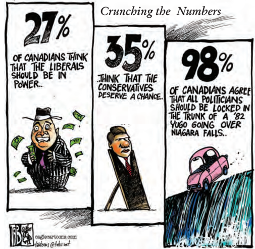
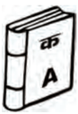
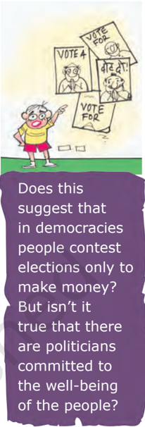

# PAGE 1

s

D

## Political Parties

## Overview

In this tour of democracy, we have come across political parties several times. In Class IX, we noticed the role of political parties in the rise of democracies, in the formation of constitutional designs, in electoral politics and in the making and working of governments. In this textbook, we have glanced at political parties as vehicles of federal sharing of political power and as negotiators of social divisions in the arena of democratic politics. Before concluding this tour, let us take a close look at the nature and working of political parties, especially in our country. We begin by asking two common questions: Why do we need parties? How many parties are good for a democracy? In the light of these, we introduce the national and regional political parties in today's India and then look at what is wrong with political parties and what can be done about it.

# PAGE 2

© (1) M Govarthan (2) A Muralidharan (3) M Moorthy (4) T Singaravelou, The Hindu

## Why do we need political parties?

Political  parties  are  easily  one  of the  most  visible  institutions  in  a democracy.  For  most  ordinary citizens,  democracy  is  equal  to political  parties.  If  you  travel  to remote parts  of  our  country  and speak to the less educated citizens, you could come across people who may not know anything about our Constitution or about the nature of our  government.  But  chances  are that  they  would  know  something about our political parties.  At  the same time, this visibility  does  not mean popularity. Most people tend

(1)

to be very critical of political parties. They tend to blame parties for all that is wrong with our democracy and our political life.  Parties  have become identified with social and political divisions.

Therefore, it is natural to ask  -  do we need political parties at all? About hundred years ago, there were few countries  of  the  world  that  had any political party. Now there are few that do not have parties. Why did  political  parties  become  so omnipresent in democracies all over the world? Let us first answer what political  parties  are  and  what  they do, before we say why we need them.

## Meaning

A  political  party  is  a  group  of people who come together to contest elections  and  hold  power  in  the government. They agree on some policies  and  programmes  for  the society with a view to promote the collective good. Since there can be different views on what is good for

(2)

Election Commission has officially banned wall writing by parties during election times. Most political parties argue that was the cheapest way for their campaign. These election times used to create amazing graffiti on the walls. Here are some examples from Tamil Nadu.

(3)

(4)

So, you agree with me. Parties are partial, partisan and lead to partitions. Parties do nothing but divide people. That is their real function!

# PAGE 3

© RK Laxman Brushing up the years

Partisan: A person who is strongly committed to a party, group or faction. Partisanship is marked by a tendency to take a side and inability to take a balanced view on an issue.

all,  parties  try  to  persuade  people why their policies are better than others.  They  seek  to  implement these  policies  by  winning  popular support through elections.

Thus, parties reflect fundamental political divisions in a society. Parties are about a part of the society and thus,  involve partisanship .  Thus, a party is known by which part it stands for, which policies it supports and whose interests it upholds. A political party has three components:

-  the leaders,
-  the active members and
-  the followers

## Functions

What does  a  political  party  do? Basically,  political parties fill political offices and exercise political power. Parties do so by performing a series of functions:

1   Parties contest elections . In most democracies,  elections  are  fought mainly among the candidates put up by political parties. Parties select their  candidates  in  different  ways. In some countries, such as the USA, members and supporters of a party choose its  candidates.  Now  more and more countries are following this  method.  In  other  countries like India, top party leaders choose candidates for contesting elections.

2   Parties  put  forward  different policies  and  programmes and  the voters choose from them. Each of us may have different opinions and views on what policies are suitable for the society. But no government can  handle  such  a  large  variety of  views.  In  a  democracy,  a  large number of similar opinions have to  be  grouped  together  to  provide a  direction  in  which  policies  can be formulated by the governments. This is what the parties do. A party reduces a vast multitude of opinions into a few basic positions which it

# PAGE 4

supports. A government is expected to base its policies on the line taken by the ruling party .

3   Parties  play  a  decisive  role in making laws for  a  country. Formally,  laws  are  debated  and passed in the legislature.  But  since most of the members belong to a party,  they  go  by  the  direction  of the party leadership, irrespective of their personal opinions.

- 4   Parties form and run governments . As we noted last year, the big policy decisions  are  taken  by  political executive that comes from the political  parties.  Parties  recruit leaders,  train  them  and  then make them ministers  to  run  the government in the way they want.

5   Those  parties  that  lose  in  the elections play the role of opposition to the parties in power, by voicing different  views  and  criticising government  for  its  failures  or wrong policies. Opposition parties also  mobilise  opposition  to  the government.

- 6   Parties shape  public  opinion . They raise  and  highlight  issues. Parties have lakhs of members and activists spread all over the country. Many of the pressure groups are the extensions of political parties among different sections of society. Parties sometimes also launch movements for  the  resolution  of  problems faced by people. Often opinions in the  society  crystallise  on  the  lines parties take.

7   Parties  provide  people access to  government machinery and welfare  schemes implemented by governments. For an ordinary citizen it  is  easy to approach a local party leader than a government officer.

That is why, they feel close to parties even when they do not fully trust them.  Parties have to be responsive to  people's  needs  and  demands. Otherwise people can reject those parties in the next elections.

## Necessity

This  list  of  functions  in  a  sense answers the question asked above: we need political  parties  because they  perform  all  these  functions. But we still need to ask why modern democracies cannot exist without political parties.  We can understand the necessity of political parties by imagining a situation without parties. Every  candidate  in  the  elections will  be  independent.  So  no  one will be able to make any promises to  the  people  about  any  major policy  changes.  The  government may be formed, but its utility will remain  ever  uncertain.  Elected representatives will be accountable to their constituency for what they do in the locality. But no one will be responsible for how the country will be run.

We can also think about it by looking  at  the  non-party  based elections to the panchayat in many states. Although, the parties do not contest  formally,  it  is  generally noticed that the village gets split into more than one faction, each of which puts up a 'panel' of its candidates. This is exactly what the party does. That is the reason we find political parties in almost all countries of the world, whether these countries are big or small, old or new, developed or developing.

The rise  of  political  parties  is directly  linked  to  the  emergence of  representative  democracies.

Okay, granted that we can't live without political parties. But tell me on what grounds do people support a political party?

Ruling Party : Political party that runs government.

# PAGE 5

As  we  have  seen,  large  societies need  representative  democracy. As  societies  became  large  and complex, they also needed some agency  to  gather  different  views on  various  issues  and  to  present these  to  the  government.  They needed some ways, to bring various representatives  together  so  that  a responsible  government  could  be formed. They needed a mechanism to support or restrain the government, make policies,  justify  or  oppose them. Political parties fulfill  these needs  that  every  representative government has. We can say that parties are a necessary condition for a democracy.

Categorise these photographs by the functions of political parties they illustrate. Find one photograph or news clipping from your own area for each of the functions listed above.

© (1) C V Subrahmanyan (2) K Gopinathan (3) A Chakrabarty, The Hindu

- 1 :  Activists of BJP Mahila Morcha demonstrate against hike in prices of onions and LPG in Visakhapatnam.
- 2 :  Minister distributes ` One lakh cheque to the families of hooch victims at their houses.
- 3 :  Activists of CPI (M), CPI, OGP and JD (S) take out a rally in Bhubaneswar to protest against POSCO, the Korean steel company for being permitted by the State Government to export iron ore from Orissa to feed steel plants in China and Korea.

## How many parties should we have?

In a democracy any group of citizens is free to form a political party.  In this  formal  sense,  there  are  a  large number of political parties in each country.  More  than  750  parties are  registered  with  the  Election Commission of India. But not all these parties are serious contenders in  the  elections.  Usually  only  a handful of parties are effectively in the race to win elections and form the government. So the question is: how many major or effective parties are good for a democracy?

In  some  countries,  only  one party is allowed to control and run the  government.  These  are  called one-party  systems.  In  Class  IX, we noted that in China, only the Communist Party is  allowed  to

# PAGE 6

rule.  Although,  legally  speaking, people  are  free  to  form  political parties, it does not happen because the electoral system does not permit free  competition  for  power.  We cannot consider one-party system as a good option because this is not a democratic option. Any democratic system must allow at least two parties to compete in elections and provide a fair chance for the competing parties to come to power.

In some countries, power usually changes between two main parties. Several other parties may exist, contest elections and win a few seats in the national legislatures. But only the two main parties have a serious chance of winning majority of seats to form government. Such a party system is called  two-party  system. The United States of America and the United Kingdom are examples of two-party system.

If  several  parties  compete  for power, and more than two parties have a reasonable chance of coming to power either on their own strength or in alliance with others, we call it a multiparty system. Thus in India, we have a multiparty system. In this system, the government is formed by various parties coming together in a

coalition. When several parties in a multi-party system join hands for the purpose of contesting elections and winning power, it is called an alliance or a front. For example, in India there were three such major alliances in 2004 parliamentary elections- the National Democratic Alliance, the United Progressive Alliance and the Left Front. The multiparty system often appears very messy and leads to  political  instability.  At  the  same time,  this  system  allows  a  variety of  interests  and  opinions  to  enjoy political representation.

So,  which  of  these  is  better? Perhaps the best answer to this very common question is that this is not a  very good question. Party system is  not  something  any  country  can choose. It evolves over a long time, depending on the nature of society, its  social  and  regional  divisions,  its history of politics and its system of elections.  These cannot be changed very quickly. Each country develops a party system that is conditioned by its special circumstances. For example, if India has evolved a multiparty system, it  is  because the social and geographical diversity in such a large country is not easily absorbed by two or even three parties. No system is ideal for all countries and all situations.

Let us apply what we have learnt about party systems to the various states within India. Here are three major types of party systems that exist at the State level. Can you find the names of at least two States for each of these types?

-  Two-party system
-  Multiparty system with two alliances
-  Multiparty system

# PAGE 7

## Popular in political parties participation

It is often said that political parties are facing a crisis because they are very unpopular and the citizens are indifferent to political parties. The available evidence shows that this belief is only partly true for India. The evidence, based on a series of large sample surveys conducted over several decades, shows that:

-  Political parties do not enjoy much trust among the people in South Asia. The proportion of those who say their trust in political parties is 'not much' or 'not at all' is more than those who have 'some' or 'great' trust.
-  The same is true of most other democracies as well. Political parties are one of the least trusted institutions all over the world.
-  Yet the level of participation in the activities of political parties was fairly high. The proportion of those who said they were members of some political party was higher in India than many advanced countries like Canada, Japan, Spain and South Korea.
-  Over the last three decades, the proportion of those who

report to be members of political parties in India has gone up steadily.

-  The proportion of those who say they feel 'close to a political party' has also gone up in India in this period.

Source: SDSA Team, State of Democracy in South Asia, Delhi: Oxford University Press, 2007

# PAGE 8

© Tab The Calgary Sun , Cagle Cartoons Inc.

Does the cartoon refl  ect the data graphics shown on the previous page?

## National parties

Democracies that follow a federal system all  over  the  world  tend  to have two kinds of political parties: parties that are present in only one of the federal units and parties that are present in several or all units of the federation. This is the case in India as well. There are some country-wide parties,  which  are  called  'national parties'.  These  parties  have  their units  in  various  states.  But  by  and large, all these units follow the same policies,  programmes and strategy that is decided at the national level.

Every  party  in  the  country has  to  register  with  the  Election Commission. While the Commission treats  all  parties  equally,  it  offers some special facilities  to  large  and established  parties.    These  parties are  given  a  unique  symbol -  only the offi  cial candidates of that party can use that election symbol. Parties that get this privilege and some other special facilities are 'recognised' by the  Election  Commission for this purpose. That is why these parties are  called,  'recognised  political parties'. The Election Commission has  laid  down  detailed  criteria  of the  proportion  of  votes  and  seats that  a  party  must  get  in  order  to be a recognised party. A party that secures  at  least  six  per  cent  of  the total  votes  in  an  election  to  the Legislative Assembly of a State and wins at least two seats is recognised as a State party. A party that secures at least six per cent of the total votes in Lok Sabha elections or Assembly elections in four States and wins at least four seats in the Lok Sabha is recognised as a national party.

According to this classifi  cation, there  are  six  recognized  national parties  in  the  country  as  per notification  of  the  Election Commission of India issued in 2023.

For more details about registration and recognition of political parties by the Election Commission of India, visit  https:/ / eci.gov.in

# PAGE 9

Aam  Aadmi  Party ( AAP): Formed  on 26  November  2012, f o l l o w i n g   the  2011 anti-corruption  movement.  The party  was  founded  on  the  idea  of accountability, clean administration, transparency and good governance. In the year after its formation, AAP emerged as the second largest party in  the  Delhi  Legislative  Assembly election.  It  formed  a  government with the support of Indian National Congress  (INC).  It  also  emerged as the third front in the politics of Gujarat after 2022 Gujarat Legislative Assembly election. Presently, AAP formed governments in Punjab and Delhi. In the Lok Sabha election held in 2019, it secured one seat in the Lok

Sabha.

Bahujan  Samaj P a r t y ( B S P ) :

Formed  in  1984 under  the  leadership  of  Kanshi Ram. Seeks to represent and secure power for the bahujan samaj which includes  the dalits , adivasis ,  OBCs and  religious  minorities.  Draws inspiration  from  the  ideas  and teachings of Sahu Maharaj, Mahatma Phule, Periyar Ramaswami Naicker and Babasaheb Ambedkar. Stands for the cause of securing the interests and welfare of the dalits and oppressed people. It  has  its  main  base  in  the state of Uttar Pradesh and substantial presence in neighbouring states like Madhya Pradesh,  Chhattisgarh, Uttarakhand,  Delhi  and  Punjab. Formed  government  in  Uttar Pradesh  several  times  by  taking the  support  of  different  parties  at different  times.  In  the  Lok  Sabha elections held in 2019, it polled about

3.63 per cent votes and secured 10 seats in the Lok Sabha.

Bharatiya Janata Party (BJP): Founded in 1980 by reviving the erstwhile Bharatiya  Jana  Sangh, formed by Syama Prasad

Mukherjee in 1951. Wants to build a strong and modern India by drawing inspiration  from  India's  ancient culture  and  values;  and  Deendayal Upadhyaya's  ideas  of  integral humanism and Antyodaya. Cultural nationalism  (or  'Hindutva')  is  an important element in its conception of  Indian  nationhood and politics. Wants full territorial  and  political integration of Jammu and Kashmir with  India,  a  uniform  civil  code for all people living in the country irrespective of religion, and ban on religious  conversions.  Its  support base  increased  substantially  in  the 1990s. Earlier limited to north and west and to urban areas, the party expanded its support in the south, east, the north-east and to rural areas. Came to power in 1998 as the leader of the National Democratic Alliance (NDA) including several regional parties. Emerged as the largest party with 303 members in the 2019 Lok Sabha  elections.  Currently  leads the  ruling  NDA  government  at the Centre.

Communist  Party of  India  -  Marxist ( CPI-M): Founded i n   1964.  Believes in  Marxism-Leninism.  Supports s o c i a l i s m , s e c u l a r i s m a n d democracy and opposes imperialism and  communalism.  Accepts democratic  elections  as  a  useful and helpful means for securing the objective of socio-economic justice in India. Enjoys strong support in West

# PAGE 10

Bengal, Kerala and Tripura, especially among the  poor,  factory  workers, farmers,  agricultural  labourers  and the  intelligentsia.  Critical  of  the  new economic policies that allow free flow of  foreign  capital  and  goods  into  the country. Was in power in West Bengal without a break for 34 years. In the 2019 Lok Sabha elections, it won about 1.75 per cent of votes and 3 seats.

Indian  National  Congress (INC): Popularly  known as  the  Congress  Party.  One of  the  oldest  parties  of  the world. Founded in 1885 and has  experienced  many  splits.  Played a  dominant role in Indian politics  at the national and state level for several decades  after  India's  Independence. Under the leadership  of  Jawaharlal Nehru, the party  sought  to  build  a modern secular democratic republic in India. Ruling party at the centre till 1977 and then from 1980 to 1989. After 1989, its  support  declined,  but  it  continues to be present throughout the country, cutting across social divisions. A centrist party  (neither  rightist  nor  leftist)  in

## State parties

Other than these seven parties, most of the major parties of the country are classified by the Election Commission as 'State parties'. These are commonly referred  to  as  regional  parties.  Yet these  parties  need  not  be  regional  in their  ideology  or  outlook.  Some  of these  parties  are  all  India  parties  that happen  to  have  succeeded  only  in some states. Parties like the Samajwadi Party and Rashtriya Janata Dal have national  level  political  organisation with units  in  several  states.  Some  of these parties like Biju Janata Dal, Sikkim Democratic  Front,    Mizo  National Front and Telangana Rashtra Samithi are conscious about their State identity.

its  ideological  orientation,  the  party espouses  secularism  and  welfare  of weaker sections and minorities. The INC supports new economic reforms but with a human face.  Leader of the United Progressive Alliance (UPA) government from 2004 to 2019. In the 2019 Lok Sabha election, it won 19.5% votes and 52 seats.

National  People's  Party (NPP): Formed in July 2013 under the leadership of P.A Sangma. NPP is the first political party from North East India to have attained the  status  of  a  national  party.  It believes in diversity of the country and recognizes that different regions have different  developmental  challenges. The core philosophy of the party is education and employment to all as well as empowerment of all sections of the society. It formed government in Meghalaya and has presence in many of North Eastern States. In the Lok Sabha election held in 2019, NPP secured one seat in the Lok Sabha.

Over the last  three  decades,  the number and strength of these parties has expanded. This made the Parliament of  India  politically  more  and  more diverse. No one national party is able to secure on its own a majority in the Lok Sabha, until 2014. As a result, the national parties are compelled to form alliances with State parties. Since 1996, nearly every one of the State parties has got an opportunity to be a part of one or  the  other  national  level  coalition government. This has contributed to the  strengthening  of  federalism  and democracy in our country. (See the map on the next page for details of these parties).

# PAGE 11

Map not to scale

# PAGE 12

## Challenges to political parties

We have seen how crucial political parties  are  for  the  working  of democracy.  Since  parties  are  the most visible face of democracy, it is natural that people blame parties for whatever is wrong with the working of  democracy. All over the world, people express strong dissatisfaction with the failure of political parties to  perform  their  functions  well. This is the case in our country too. Popular dissatisfaction and criticism has focussed on four problem areas in the working of political parties. Political  parties  need  to  face  and overcome these challenges in order to  remain  effective  instruments of democracy.

Berlusconi Puppet Theatre

The first  challenge  is lack  of internal democracy within parties. All over the world there is a tendency in  political  parties  towards  the concentration of power in one or few leaders at the top. Parties do not keep membership registers, do not hold organisational  meetings,  and do not conduct internal elections regularly.  Ordinary  members  of the  party  do  not  get  sufficient information on what happens inside the party. They do not have the means or  the  connections needed to influence the  decisions.  As  a result,  the  leaders assume  greater power  to  make decisions  in  the name of the party. Since  one  or  few l e a d e r s   e x e r c i s e paramount power in  the  party,  those who disagree with the leadership find

Berlusconi was the Prime Minister of Italy. He is also one of the top businessmen in Italy. He is the leader of the Forza Italia founded in 1993. His company owns TV channels, the most important publishing company, a foot ball club (AC Milan) and a bank. This cartoon was made during the last elections.

# PAGE 13

© Huffaker - Cagle Cartoons Inc.,  16 June 2004

it difficult to continue in the party. More than loyalty to party principles and policies, personal loyalty to the leader becomes more important.

The second challenge of dynastic succession  is  related  to  the  first one. Since most political parties do not practice  open  and  transparent procedures  for  their  functioning, there  are  very  few  ways  for  an ordinary worker to rise to the top in a party. Those who happen to be the leaders are in a position of unfair advantage to favour people close to them or even their family members. In  many parties, the top positions are  always  controlled  by  members of one family. This is unfair to other members of that party. This is also bad for democracy, since people who do not have adequate experience or popular  support  come  to  occupy positions of power. This tendency is present in some measure all over the world, including in some of the older democracies.

The  third  challenge  is  about the  growing  role  of money and muscle power in parties, especially during elections.  Since  parties  are focussed only on winning elections, they tend to use short-cuts to win elections.  They  tend  to  nominate those  candidates  who  have  or  can raise lots of money. Rich people and companies who give funds to the parties tend to have influence on the policies and decisions of the party. In some cases, parties support criminals who can win elections. Democrats all over the world are worried about the increasing role of rich people and big companies in democratic politics.

The  fourth  challenge  is  that very often parties  do  not  seem  to offer  a meaningful choice to  the voters. In order to offer meaningful choice, parties must be significantly different. In recent years, there has been  a  decline  in  the  ideological differences  among  parties  in  most parts of the world. For example, the difference between the Labour Party and the Conservative Party in Britain is very little. They agree on more fundamental aspects but differ only in details on how policies are to be framed and implemented. In our country too, the differences among all the major parties on the economic policies have reduced. Those who want really different policies  have  no  option  available to them. Sometimes people cannot even  elect  very  different  leaders either,  because  the  same  set  of leaders  keep  shifting  from  one party to another.

This cartoon was drawn during the Presidency of George Bush of the Republican Party in the USA. The party's symbol is elephant. The cartoon seems to suggest that the Corporate America controls all major institutions of the country.

# PAGE 14

© Manjul DNA

Can you identify which of the challenges described in this section are being highlighted in these cartoons (on pages 57 to 59)? What are the ways to curb the misuse of money and muscle power in politics?

## How can parties be reformed?

In  order  to  face  these  challenges, political parties need to be reformed. The question is: Are political parties willing to reform? If they are willing, what  has  prevented  them  from reforming so far?  If  they  are  not willing, is it possible to force them to  reform?  Citizens  all  over  the world face this question. This is not a  simple  question  to  answer.  In  a democracy, the final decision is made by leaders  who represent political parties.  People  can  replace  them, but  only  by  another  set  of  party leaders. If all of them do not wish to reform, how can anyone force them to change?

Let  us  look  at  some  of  the recent efforts and suggestions in our country to reform political parties and its leaders:

-  The Constitution was amended to  prevent elected MLAs and MPs from changing parties. This was done because many elected representatives were indulging in defection in order to  become  ministers  or  for  cash rewards. Now the law says that if

Defection: Changing party allegiance from the party on which a person got elected (to a legislative body) to a different party.

# PAGE 15

Do you agree that this form of reforming political parties will be acceptable to them?

any MLA or MP changes parties, he or she will lose the seat in the legislature. This new law has helped bring defection down. At the same time, this has made any dissent even more difficult. MPs and MLAs have to accept whatever the party leaders decide.

-  The Supreme Court passed an order  to  reduce  the  influence  of money and criminals. Now, it is mandatory for every candidate who contests elections to file an affidavit giving  details  of  his  property  and criminal cases pending against him. The new system has made a lot of information available to the public. But there is no system to check if the information given by the candidates is true. As yet we do not know if it has led to decline in the influence of the rich and the criminals.
-  The  Election  Commission passed an order making it necessary for  political  parties  to  hold  their organisational elections and file their income tax returns. The parties have started  doing  so  but  sometimes  it

Affidavit : A signed document submitted to an officer, where a person makes a sworn statement regarding her personal information.

is  mere formality. It is not clear if this step has led to greater internal democracy in political parties.

Besides these, many suggestions are  often  made  to  reform  political parties:

-  A law should be made to regulate the internal affairs of political parties. It  should  be  made  compulsory for political parties to maintain a register of  its  members,  to  follow  its  own constitution, to have an independent authority, to act as a judge in case of party disputes, to hold open elections to the highest posts.
-  It should be made mandatory for political parties to give a minimum number of tickets, about one-third, to  women  candidates.  Similarly, there should be a quota for women in  the  decision  making  bodies  of the party.
-  There should be state funding of elections.  The  government should give parties money to support their election expenses. This support could be given in kind: petrol, paper, telephone, etc. Or it could be given in cash on the basis of the votes secured by the party in the last election.

These suggestions have not yet been accepted by political parties. If and when these are accepted these could lead  to  some  improvement. But we must be very careful about legal solutions to political problems. Over-regulation of political parties can  be  counter-productive.  This would force all parties to find ways to  cheat  the  law.  Besides,  political parties will not agree to pass a law that they do not like.

There  are  two  other  ways in  which  political  parties  can  be reformed.  One,  people  can  put

# PAGE 16

pressure on political parties. This can be done through petitions, publicity and agitations.  Ordinary  citizens, pressure groups and movements and the media can play an important role in  this.  If  political  parties  feel  that they would lose public support by not taking up reforms, they would become more serious about reforms. Two, political parties can improve if those who want this, join political parties.  The  quality  of  democracy depends  on  the  degree  of  public participation. It is difficult to reform politics  if  ordinary  citizens  do  not take part in it  and  simply  criticise it from the outside. The problem of bad politics can be solved by more and better politics. We shall return to this theme in the final chapter.

1. State the various functions political parties perform in a democracy.
2. What are the various challenges faced by political parties?
3.   Suggest some reforms to strengthen parties so that they perform their functions well?
4. What is a political party?
5.   What are the characteristics of a political party?
6.   A group of people who come together to contest elections and hold power in the government is called a \_\_\_\_\_\_\_\_\_\_\_\_\_\_\_\_\_\_\_\_\_.
7. Match List I (organisations and struggles) with List II and select the correct answer using the codes given below the lists:
8.  Who among the following is the founder of the Bahujan Samaj Party?
- A.  Kanshi Ram
- B.  Sahu Maharaj
- C.  B.R. Ambedkar
- D.  Jotiba Phule
9.  What is the guiding philosophy of the Bharatiya Janata Party?
- A.  Bahujan Samaj
- B.  Revolutionary democracy
- C.  Integral humanism
- D.  Modernity

|    | List I                             | List II                         |
|----|------------------------------------|---------------------------------|
|  1 | Congress Party                     | A. National Democratic Alliance |
|  2 | Bharatiya Janata Party             | B. State party                  |
|  3 | Communist Party of India (Marxist) | C. United Progressive Alliance  |
|  4 | Telugu Desam Party                 | D. Left Front                   |

|     | 1   | 2   | 3   | 4   |
|-----|-----|-----|-----|-----|
| (a) | C   | A   | B   | D   |
| (b) | C   | D   | A   | B   |
| (c) | C   | A   | D   | B   |
| (d) | D   | C   | A   | B   |

# PAGE 17

10. Consider the following statements on parties.
- A.  Political parties do not enjoy much trust among the people.
- B.  Parties are often rocked by scandals involving top party leaders.
- C.  Parties are not necessary to run governments.

Which of the statements given above are correct?

<!-- formula-not-decoded -->

11.  Read the following passage and answer the questions given below:

Muhammad Yunus is a famous economist of Bangladesh. He received several international honours for his efforts to promote economic and social development for the benefit of the poor. He and the Grameen Bank that he started jointly, received the Nobel Peace Prize for the year 2006. In February 2007, he decided to launch a political party and contest in the parliamentary elections. His objective was to foster proper leadership, good governance and build a new Bangladesh. He felt that only a political party different from the traditional ones would bring about new political culture. His party would be democratic from the grassroots level.

The launching of the new party, called Nagarik Shakti (Citizens' Power), has caused a stir among the Bangladeshis. While many welcomed his decision, some did not like it. 'Now I think Bangladesh will have a chance to choose between good and bad and eventually have a good government,' said Shahedul Islam, a government official. 'That government, we hope, would not only keep itself away from corruption but also make fighting corruption and black money a top priority.'

But leaders of traditional political parties who dominated the country's politics for decades were apprehensive. 'There was no debate (over him) winning the Nobel, but politics is different - very challenging and often controversial,' said a senior leader of the Bangladesh Nationalist Party. Some others were highly critical. They asked why he was rushing into politics. 'Is he being planted in politics by mentors from outside the country,' asked one political observer.

Do you think Yunus made a right decision to float a new political party?

Do you agree with the statements and fears expressed by various people? How do you want this new party organised to make it different from other parties? If you were the one to begin this political party, how would you defend it?