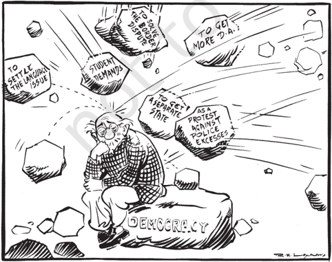
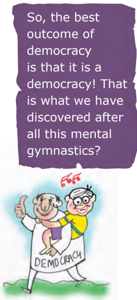
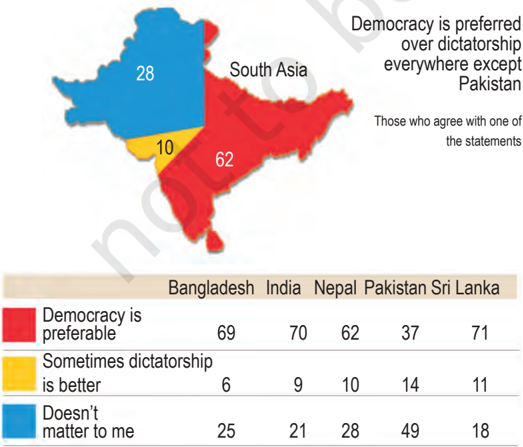
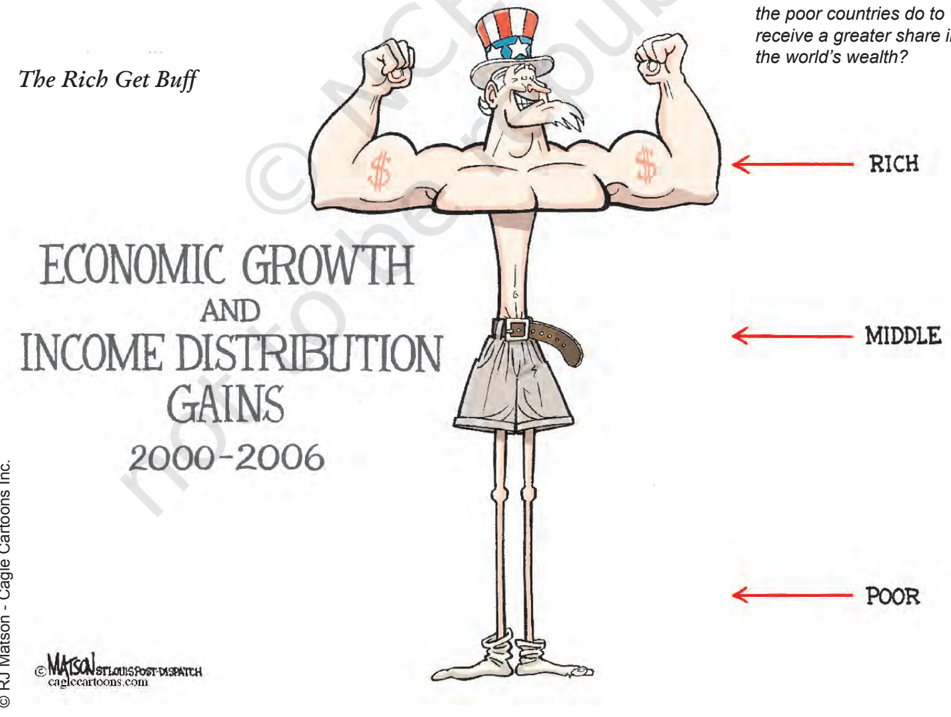
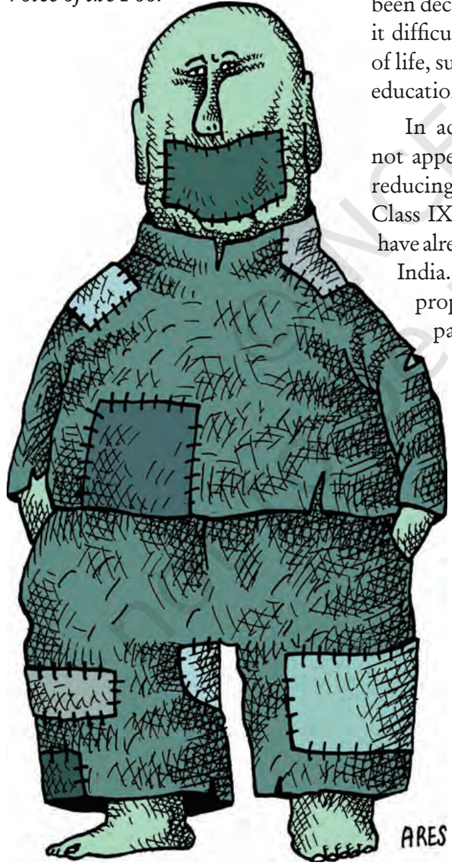
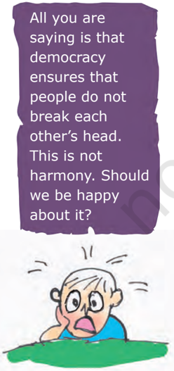
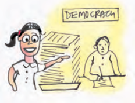
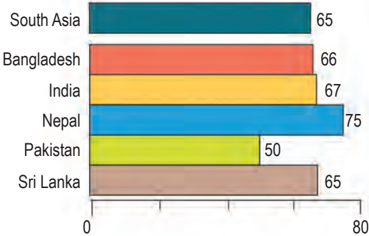
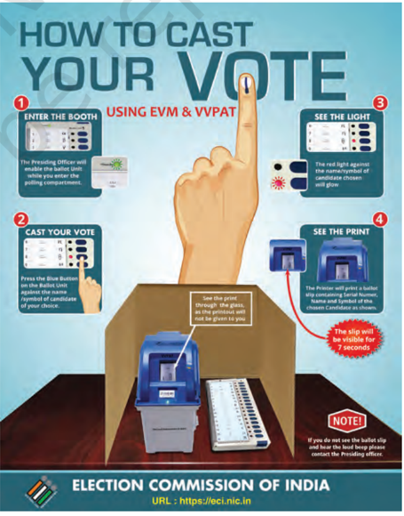

# PAGE 1

## Outcomes of Democracy

## Overview

As we begin to wind up our tour of democracy, it is time to move beyond our discussion of specific themes and ask a general set of questions: What does democracy do? Or, what outcomes can we reasonably expect of democracy? Also, does democracy fulfil these expectations in real life? We begin by thinking about how to assess the outcomes of democracy. After some clarity on how to think on this subject, we proceed to look at the expected and actual outcomes of democracy in various respects: quality of government, economic well-being, inequality, social differences and conflict and finally freedom and dignity.

# PAGE 2

Did we reach these conclusions in Madam Lyngdoh's class? I loved that class because students were not being dictated any conclusions.

© RK Laxman Brushing up the years

## How do we assess democracy's outcomes?

Do you remember how students in  Madam Lyngdoh's class argued about  democracy?  This  was  in Chapter 2 of  Class  IX  textbook. It  emerged from that conversation that democracy is a better form of government when compared with dictatorship or any other alternative. We felt that democracy was better because it:

-  Promotes equality among citizens;
-  Enhances the dignity of the individual;
-  Improves the quality of decision-making;
-  Provides a method to resolve conflicts; and
-  Allows room to correct mistakes.

Are these expectations realised under democracies? When we talk to people around us, most of them support  democracy  against  other alternatives, such as rule by a monarch or military or religious leaders. But not  so  many  of  them  would  be satisfied  with  the  democracy  in practice.  So  we  face  a  dilemma: democracy is  seen  to  be  good  in

Is  democracy  all  about  coping  with  multiple  pressures  and accommodating diverse demands?

principle, but felt to be not so good in its practice. This dilemma invites us to think hard about the outcomes of democracy. Do we prefer democracy only for moral reasons? Or are there some prudential reasons to support democracy too?

Over a  hundred  countries  of the world today claim and practice some kind of democratic politics: they have formal constitutions, they hold elections, they have parties and they  guarantee  rights  of  citizens. While these features are common to most of them, these democracies are very much different from each other in  terms  of  their  social  situations, their  economic  achievements  and their cultures. Clearly, what may be achieved or not achieved under each of  these  democracies  will  be  very different. But is there something that we can expect from every democracy, just because it is democracy?

Our interest in and fascination for democracy often pushes us into taking  a  position  that  democracy can address all socio-economic and political  problems.  If  some  of  our expectations are not met, we start blaming the idea of democracy. Or, we start doubting if we are living in a democracy. The first step towards thinking carefully about the outcomes of  democracy  is  to  recognise that  democracy  is  just  a  form of government. It  can  only  create conditions for achieving something. The citizens have to take advantage of  those  conditions  and  achieve those goals. Let us examine some of the things we can reasonably expect from democracy and examine the record of democracy.

# PAGE 3

## Accountable, responsive and legitimate government

There are some things that democracy must provide. In a democracy, we are  most  concerned with ensuring that  people  will  have  the  right to  choose  their  rulers  and  people will  have  control  over  the  rulers. Whenever possible and necessary, citizens should be able to participate in  decision  making,  that  affects them all. Therefore, the most basic outcome  of  democracy  should be  that  it  produces  a  government that  is  accountable  to  the  citizens, and  responsive  to  the  needs  and expectations of the citizens.

Before we go into this question, we face another common question: Is the democratic government efficient? Is it effective? Some people think that democracy produces less effective government. It is, of course, true that non-democratic rulers do not have to bother about deliberation in assemblies or worry about majorities and public opinion. So, they can be very quick and  efficient  in  decision  making and  implementation.  Democracy is  based  on  the  idea  of  deliberation and negotiation. So, some delay is bound to take place. Does that make democratic government inefficient?

Let us think in terms of costs. Imagine  a  government  that  may take decisions very fast. But it may take decisions that are not accepted by the  people  and  may  therefore face  problems.  In  contrast,  the democratic government will take more time to  follow  procedures before  arriving  at  a  decision.  But because it has followed procedures, its  decisions  may  be  both  more acceptable to the people and more effective.  So,  the  cost  of  time  that democracy pays is perhaps worth it.

Governmental Secrecy

Now look at the other side democracy ensures  that  decision making will be based on norms and procedures. So, a citizen who wants to  know  if  a  decision  was  taken through  the  correct  procedures can find this out. She has the right and  the  means  to  examine  the process  of  decision  making.  This is  known  as  transparency.  This factor  is  often  missing  from  a non-democratic  government. Therefore, when we are trying to find out the outcomes of democracy, it  is  right  to  expect  democracy  to produce a government that follows procedures and is accountable to the people. We can also expect that the democratic  government  develops mechanisms for  citizens  to  hold the  government  accountable  and mechanisms for citizens to take part in  decision  making whenever they think fit.

If  you  wanted  to  measure democracies  on  the  basis  of  this expected outcome, you would look for  the  following  practices  and institutions:  regular,  free  and  fair elections;  open  public  debate  on

Can you think of what and how the government knows about you and your family (for example ration cards and voter identity cards)? What are the sources of information for you about the government?

# PAGE 4

major  policies  and  legislations; and citizens'  right  to  information about  the  government  and  its functioning. The actual performance of  democracies  shows  a  mixed record  on  this.  Democracies  have had  greater  success  in  setting  up regular  and  free  elections  and  in setting  up  conditions  for  open public debate. But most democracies fall  short  of  elections  that  provide a  fair  chance  to  everyone  and  in subjecting every decision to public debate. Democratic governments do not have a very good record when it  comes  to  sharing  information with  citizens.  All  one  can  say  in favour  of  democratic  regimes  is that they are much better than any non-democratic  regime  in these respects.

In substantive terms, it may be reasonable to expect from democracy a government that is attentive to the needs  and  demands  of  the  people and  is  largely  free  of  corruption. The record of democracies is not impressive  on  these  two  counts. Democracies  often  frustrate  the needs of the people and often ignore the  demands  of  a  majority  of  its population.  The  routine  tales  of corruption are enough to convince us that democracy is not free of this evil. At the same time, there is nothing to  show  that  non-democracies  are less  corrupt  or  more  sensitive  to the people.

There is  one  respect  in  which democratic government is certainly better  than  its  alternatives:  democratic  government  is  legitimate government.  It  may  be  slow, less  efficient,  not  always  very responsive or clean. But a democratic government  is  people's  own government. That is why, there is an  overwhelming support for the idea of democracy all over the world. As the accompanying evidence from South  Asia  shows,  the  support exists in countries with democratic regimes as well as countries without democratic regimes. People wish to be ruled by representatives elected by  them.  They  also  believe  that democracy  is  suitable  for  their country.  Democracy's  ability  to generate its own support is itself an outcome that cannot be ignored.

|                                  |   Bangladesh |   India |   Nepal |   Pakistan Sri |   Lanka |
|----------------------------------|--------------|---------|---------|----------------|---------|
| Democracy is preferable          |           69 |      70 |      62 |             37 |      71 |
| Sometimes dictatorship is better |            6 |       9 |      10 |             14 |      11 |
| Doesn't matter to me             |           25 |      21 |      28 |             49 |      18 |

Source: SDSA Team, State of Democracy in South Asia , Delhi: Oxford University Press, 2007

# PAGE 5

## Economic growth and development

If  democracies  are  expected  to produce good governments, then is  it  not  fair  to  expect  that  they would also produce development? Evidence  shows  that  in  practice, many democracies did not fulfil this expectation.

If  you  consider  all  democracies and  all  dictatorships  for  the  fifty years  between  1950  and  2000, dictatorships have slightly higher rate of  economic growth. The inability of  democracy  to  achieve  higher economic development worries us. But  this  alone  cannot  be  reason to  reject  democracy.  As  you  have already  studied  in  economics, economic development depends on several factors: country's population size,  global  situation,  cooperation from  other  countries,  economic priorities  adopted  by  the  country, etc. However, the difference in the rates  of  economic  development between less  developed  countries with dictatorships and democracies is negligible. Overall, we cannot say that  democracy  is  a  guarantee  of economic development. But we can expect democracy not to lag behind dictatorships in this respect.

When we find such significant difference in the rates of economic growth between countries  under dictatorship  and  democracy,  it  is better to prefer democracy as it has several other positive outcomes.

Cartoon on this page and next three pages tell us about the disparities between the rich and poor.  Should the gains of economic growth be evenly distributed? How can the poor get a voice for a better share in a nation? What can the poor countries do to receive a greater share in the world's wealth?

# PAGE 6

## democracy Economic  outcomes of

Arguments about democracy tend to be very passionate. This is how it should be, for democracy appeals to some of our deep values. These debates cannot be resolved in a simple manner. But some debates about democracy can and should be resolved by referring to some facts and figures. The debate about the economic outcomes of democracy is one such debate. Over the years, many students of democracy have gathered careful evidence to see what the relationship of democracy with economic growth and economic inequalities is. The tables and the cartoon here present some of the evidences:

Poor Kids

-  Table 1 shows that on an average dictatorial regimes have had a slightly better record of economic growth. But when we compare their record only in poor countries, there is virtually no difference.
-  Table 2 shows that within democracies there can be very high degree of inequalities. In democratic countries like South Africa and Brazil, the top 20 per cent people take away more than 60 per cent of the national income, leaving less than 3 per cent for the bottom 20 per cent population. Countries like Denmark and Hungary are much better in this respect.
-  You can see in the cartoon, there is often inequality of opportunities available to the poorer sections.

What would be your verdict on democracy if you had to base it purely on economic performance of democratic regimes in terms of growth and equal distribution?

Table 2 Inequality of income in selected countries

| Name of the Countries   | % share of national income   | % share of national income   |
|-------------------------|------------------------------|------------------------------|
|                         | Top 20%                      | Bottom 20%                   |
| South Africa            | 64.8                         | 2.9                          |
| Brazil                  | 63.0                         | 2.6                          |
| Russia                  | 53.7                         | 4.4                          |
| USA                     | 50.0                         | 4.0                          |
| United Kingdom          | 45.0                         | 6.0                          |
| Denmark                 | 34.5                         | 9.6                          |
| Hungary                 | 34.4                         | 10.0                         |

Table 1

## Rates of economic growth for different countries, 1950 - 2000

| Type of regimes and countries     |   Growth Rate |
|-----------------------------------|---------------|
| All democratic regimes            |          3.95 |
| All dictatorial regimes           |          4.42 |
| Poor countries under dictatorship |          4.34 |
| Poor countries under democracy    |          4.28 |

Source: A Przeworski, M E Alvarez, J A Cheibub and F Limongi, Democracy and Development: Political Institutions and Well-Being in the World, 1950 -1990. Cambridge, Cambridge University Press, 2000.

# PAGE 7

© Ares Best of Latin America , Cagle Cartoons Inc.

## Reduction of inequality and poverty

Perhaps more than development, it is reasonable to expect democracies to reduce economic disparities. Even when a country achieves economic growth, will wealth be distributed in such a way that all citizens of the country will have a share and lead a  better  life?  Is  economic  growth in  democracies  accompanied  by increased  inequalities  among  the people?  Or  do  democracies  lead to  a  just  distribution  of  goods  and opportunities?

Voice of the Poor

Democracies are based on political equality. All individuals have equal weight in electing  representatives. Parallel  to  the  process  of  bringing individuals  into  the  political  arena on an equal footing, we find growing economic  inequalities.  A  small number of ultra-rich enjoy a highly disproportionate share of wealth and incomes. Not only that, their share in the total income of the country has  been  increasing.  Those  at  the bottom of the society have very little to depend upon. Their incomes have been declining. Sometimes they find it difficult to meet their basic needs of life, such as food, clothing, house, education and health.

In  actual  life,  democracies  do not appear to be very successful in reducing economic inequalities. In Class IX Economics textbook, you have already studied about poverty in India. The poor constitute a large proportion of our voters and no party  will  like  to  lose  their votes.  Yet  democratically elected  governments  do not appear to be as keen to  address  the  question of poverty as you would expect  them  to.  The situation  is  much  worse in  some other countries. In Bangladesh, more than half  of  its  population lives  in  poverty.  People in several poor countries are now dependent on the rich  countries  even  for food supplies.

Democracy is a rule of the majority. The poor are in majority. So democracy must be a rule of the poor. How can this not be the case?

# PAGE 8

© Manny Francisco The Phillippines, Cagle Cartoons Inc.

## Accommodation of social diversity

Do democracies lead to peaceful and harmonious life  among  citizens? It  will  be  a  fair  expectation  that democracy  should  produce  a harmonious social  life.  We  have seen  in  the  earlier  chapters  how democracies accommodate various social divisions. We saw in the first chapter how Belgium has successfully negotiated differences among ethnic populations.  Democracies  usually develop  a  procedure  to  conduct their  competition.  This  reduces the  possibility  of  these  tensions becoming explosive or violent.

No  society  can  fully  and permanently resolve conflicts among different groups. But we can certainly learn to respect these differences and we can also evolve mechanisms to negotiate the differences. Democracy is  best  suited  to  produce  this outcome. Non-democratic regimes often turn a blind eye to or suppress internal social differences. Ability to handle social  differences,  divisions and conflicts is thus a definite plus point  of  democratic  regimes.  But the  example of Sri Lanka reminds us that a democracy must fulfil two conditions in order to achieve this outcome:

-  It  is  necessary  to  understand that  democracy is not simply rule by majority opinion.  The majority always  needs  to  work  with  the minority  so  that  governments function  to  represent  the  general view.  Majority  and  minority opinions are not permanent.
-  It is also necessary that rule by majority does not become rule by majority  community in terms of religion or race or linguistic group, etc.  Rule by majority means that in case of every decision or in case of

# PAGE 9

every election, different persons and groups may and can form a majority. Democracy remains democracy only as long as every citizen has a chance of being in majority at some point of time. If someone is barred from being  in  majority  on  the  basis  of birth, then the democratic rule ceases to be accommodative for that person or group.

## Dignity and freedom of the citizens

Democracy stands much superior to  any  other  form  of  government in  promoting dignity and freedom of  the  individual.  Every  individual wants  to  receive  respect  from fellow beings. Often conflicts arise among individuals because some feel that  they  are  not  treated  with  due respect. The passion for respect and freedom are the basis of democracy. Democracies throughout the world have  recognised  this,  at  least  in principle.  This  has  been  achieved in  various  degrees  in  various democracies.  For  societies  which have been built for long on the basis of subordination and domination, it is not a simple matter to recognise that all individuals are equal.

Take  the  case  of  dignity  of women.  Most  societies  across the  world  were  historically  male dominated societies. Long struggles by  women  have  created  some sensitivity  today  that  respect  to and equal treatment of women are

# PAGE 10

I am anxious about my board exams. But democracy has so many exams. And millions of examiners!

necessary ingredients of a democratic society.  That  does  not  mean  that women are actually always treated with respect. But once the principle is  recognised, it becomes easier for women to wage a struggle against what is  now  unacceptable  legally and morally. In a non-democratic set  up,  this  unacceptability  would not  have  legal  basis  because  the principle of individual freedom and dignity would not have the legal and moral force there. The same is true of caste inequalities. Democracy in India has strengthened the claims of the disadvantaged and discriminated castes  for  equal  status  and  equal opportunity.  There  are  instances still  of  caste-based  inequalities  and atrocities, but these lack the moral and legal foundations. Perhaps, it is the recognition that makes ordinary citizens value their democratic rights.

Expectations  from  democracy also  function  as  the  criteria  for judging  any  democratic  country.

Rosa Parks Still Inspires

© Pat Bagley - Cagle Cartoons Inc.

What  is  most  distinctive  about democracy is that its examination never  gets  over.  As  democracy passes one test, it produces another test. As people get some benefits of democracy, they ask for more and want to make democracy even better. That is why, when we ask people about the way democracy functions, they will always come up with more expectations, and many complaints. The fact that people are complaining is itself a testimony to the success of democracy: it shows that people have developed awareness and the ability to  expect  and  to  look  critically  at power holders  and  the  high  and the mighty. A public expression of dissatisfaction with democracy shows the success of the democratic project: it transforms people from the status of  a  subject  into  that  of  a  citizen. Most individuals today believe that their vote makes a difference to the way the government is run and to their own self-interest.

Belief in the efficacy of vote is placed above the calculus of utility

Those who say that their vote makes a difference...

The above cartoon and graph illustrate a point made in this section (Dignity and freedom of the citizens). Underline the sentences from this section which connect to the cartoon or graph.

Source: SDSA Team, State of Democracy in South Asia , Delhi: Oxford University Press, 2007.

# PAGE 11

1.  How does democracy produce an accountable, responsive and legitimate government?
2.  What are the conditions under which democracies accommodate social diversities?
3. Give arguments to support or oppose the following assertions:
4.  Industrialised countries can afford democracy but the poor need dictatorship to become rich.
5.  Democracy can't reduce inequality of incomes between different citizens.
6.  Government in poor countries should spend less on poverty reduction, health, education and spend more on industries and infrastructure.
7.  In democracy all citizens have one vote, which means that there is absence of any domination and conflict.
4. Identify the challenges to democracy in the following descriptions. Also suggest policy/institutional mechanism to deepen democracy in the given situations:
9.  Following a High Court directive, a temple in Orissa that had separate entry doors for dalits and nondalits allowed entry for all from the same door.
10.  A large number of farmers are committing suicide in different states of India.
11.  Following an allegation of killing of three civilians in Gandwara in a fake encounter by Jammu and Kashmir police, an enquiry has been ordered.
5.   In the context of democracies, which of the following ideas is correctdemocracies have successfully eliminated:
- A.  conflicts among people
- B.  economic inequalities among people
- C.  differences of opinion about how marginalised sections are to be treated
- D.  the idea of political inequality
6.   In the context of assessing democracy, which among the following is the odd one out. Democracies need to ensure:
- A.  free and fair elections
- B.  dignity of the individual
- C.  majority rule
- D.  equal treatment before law
7. Studies on political and social inequalities in democracy show that:
- A.  democracy and development go together.
- B.  inequalities exist in democracies.
- C.  inequalities do not exist under dictatorship.
- D.  dictatorship is better than democracy.

## Exercises

# PAGE 12

## Exercises

## 8.   Read the passage below:

Nannu is a daily wage earner. He lives in Welcome Mazdoor Colony, a slum habitation in East Delhi. He lost his ration card and applied for a duplicate one in January 2004. He made several rounds to the local Food and Civil Supplies office for the next three months. But the clerks and officials would not even look at him, leave alone do his job or bother to tell him the status of his application. Ultimately, he filed an application under the Right to Information Act asking for the daily progress made on his application, names of the officials, who were supposed to act on his application and what action would be taken against these officials for their inaction. Within a week of filing application under the Right to Information Act, he was visited by an inspector from the Food Department, who informed him that the card had been made and he could collect it from the office. When Nannu went to collect his card next day, he was given a very warm treatment by the Food and Supply Officer (FSO), who is the head of a Circle. The FSO offered him tea and requested him to withdraw his application under the Right to Information, since his work had already been done.

What does Nannu's example show? What impact did Nannu's action have on officials? Ask your parents their experiences when they approach government officials to attend to their problems.

Source: Election Commission of India