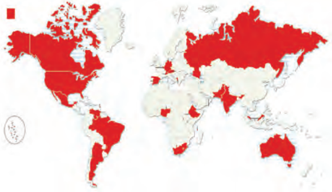

# PAGE 1

## Democratic Politics-ii

Textbook in Political Science for Class X

# PAGE 2

## 1072 - Democratic Politics-ii

Textbook for Class X

## First Edition

March 2007

Chaitra 1928

## Reprinted

,

February 2008 , January 2009 , January 2010 , January 2011 , January 2012 , November 2012 , December 2013 , December 2014 January 2016 , January 2017 , December 2017 , January 2019 , January 2020 , March 2021 and November 2021

## Revised Edition

May 2022 December 2022

Vaishakha 1944 Agrahayana 1944

## Reprinted

March 2024, Chaitra 1946 June 2024, Jyaishtha 1946 December 2024 Pausha 1946

## PD 200T BS

- © National Council of Educational Research and Training, 2007, 2022

` 65.00

## About the cover

The cartoons on the cover page are from Yesudasan, R. K. Laxman and Irfaan Khan.

Printed on 80 GSM paper with NCERT watermark

Published at the Publication Division by the Secretary,  National  Council  of  Educational Research  and  Training  Sri  Aurobindo Marg,  New  Delhi  110016  and  printed  at VK Global Digital, Plot  No.  928,  Sector-68, IMT Faridabad, Haryana-121004

## ISBN  81-7450-711-6

## ALL RIGHTS RESERVED

-  No part of this publication may be reproduced, stored in a retrieval system or transmitted, in any form or by any means, electronic, mechanical, photocopying, recording or otherwise without the prior permission of the publisher.
-  This book is sold subject to the condition that it shall not, by way of trade,  be lent,  re-sold, hired out or otherwise disposed of without the publisher's consent, in any form of binding or cover other than that in which it is published.
-  The correct price of this publication is the price printed on this page, Any revised price indicated by a rubber stamp or by a sticker or by any other means is incorrect and should be unacceptable.

## OFFICES OF THE PUBLICATION DIVISION, NCERT

NCERT Campus Sri Aurobindo Marg

New  Delhi 110 016

Phone :  011-26562708

108, 100 Feet Road Hosdakere Halli Extension Banashankari III Stage Bengaluru 560 085

Phone :  080-26725740

Navjivan Trust Building P.O.Navjivan

Ahmedabad 380 014

Phone :  079-27541446

CWC Campus Opp. Dhankal Bus Stop Panihati

Kolkata 700 114

Phone :  033-25530454

CWC Complex Maligaon

Guwahati 781 021

Phone :  0361-2674869

## Publication Team

Head, Publication : Division

M.V. Srinivasan

Chief Editor :

Bijnan Sutar

Chief Production : Officer (In charge)

Jahan Lal

Chief Business Manager

:

Amitabh Kumar

Assistant Editor :

Shashi Chaddha

Production Officer :

Sunil Sharma

## Cover

Layout

Illustrations

Fatma Nasir

Parthiv Shah with Irfaan Shroboni

# PAGE 3

## Foreword

The National Curriculum Framework (NCF), 2005, recommends that children's life at school must be linked to their life outside the school. This principle  marks  a  departure  from  the  legacy  of  bookish  learning  which continues to shape our system and causes a gap between the school, home and community. The syllabi and textbooks developed on the basis of NCF signify an attempt to implement this basic idea. They also attempt to discourage rote learning and the maintenance of sharp boundaries between different subject areas. We hope these measures will take us significantly further in the direction of a child-centred system of education outlined in the National Policy on Education (1986).

The success of this effort depends on the steps that school principals and teachers will take to encourage children to reflect on their own learning and to pursue imaginative activities and questions. We must recognise that given space,  time  and  freedom,  children  generate  new  knowledge  by  engaging with the information passed on to them by adults. Treating the prescribed textbook as the sole basis of examination is one of the key reasons why other resources and sites of learning are ignored. Inculcating creativity and initiative is possible if we perceive and treat children as participants in learning, not as receivers of a fixed body of knowledge.

These aims imply considerable change in school routines and mode of functioning. Flexibility in the daily timetable is as necessary as rigour in implementing the annual calendar so that the required number of teaching days is  actually  devoted  to  teaching.  The  methods  used  for  teaching  and evaluation will also determine how effective this textbook proves for making children's life at school a happy experience, rather than a source of stress or boredom. Syllabus designers have tried to address the problem of curricular burden by restructuring and reorienting knowledge at different stages with greater consideration for child psychology and the time available for teaching. The textbook attempts to enhance this endeavour by giving higher priority and space to opportunities for contemplation and wondering, discussion in small groups, and activities requiring hands-on experience.

The National Council of Educational Research and Training (NCERT) appreciates the hard work done by the textbook development committee responsible for this book. We wish to thank the Chairperson of the advisory group in Social Sciences, Professor Hari Vasudevan. We also wish to thank the  Chief  Advisors for this  book, Professors Yogendra Yadav and Suhas Palshikar along with Advisor for this book, Professor K. C. Suri for guiding the work of this committee. Several teachers contributed to the development of this textbook; we are grateful to their principals for making this possible. We are indebted to the institutions and organisations which have generously

# PAGE 4

permitted us to draw upon their resources, material and personnel. We are especially grateful to the members of the National Monitoring Committee, appointed by the Department of Secondary and Higher Education, Ministry of Human Resource Development under the Chairmanship of Professor Mrinal Miri and Professor G.P. Deshpande, for their valuable time and contribution. As an organisation committed to systemic reform and continuous improvement in the quality of its products, NCERT welcomes comments and suggestions which will enable us to undertake further revision and refinement.

New Delhi 20 November 2006

Director National Council of Educational Research and Training

# PAGE 5

## Rationalisation of Content in the Textbooks

In view of the COVID-19 pandemic, it is imperative to reduce content load on students. The National Education Policy 2020, also emphasises upon reducing the content load and providing opportunities for experiential learning with creative mindset. In this background, the NCERT has undertaken the exercise to rationalise the textbooks across all  classes.  Learning  Outcomes  already  developed  by  the  NCERT across classes have been taken into consideration in this exercise.

## Contents of the textbooks have been rationalised in view of the following

- Overlapping with similar content included in other subject areas in the same class
- Similar  content included in the lower or higher class in the same subject
- High difficulty level
- Content, which is easily accessible to students without much interventions  from  teachers  and  can  be  learned  by  children through self-learning or peer-learning.
- Content, which is not relevant in the present context or outdated.

This present edition, is a reformatted version after carrying out the changes given above.

# PAGE 6

## Dear students, teachers and parents,

Political  Science  textbooks  for  Class  IX  and  Class  X  together  form  an integrated  whole.  That  is  why  we  called  them  Democratic  Politics-I  and Democratic Politics-II. This book begins where the Political Science textbook stopped last year in Class IX. Last year, the tour of democracy introduced you mainly to some basic ideas, institutions and rules of democracy. This year, the focus shifts from the institutions to the process. The book introduces you to how democracy works in practice and what can be expected of it.

As a result of this shift, you would read much more directly about politics in this book. Politics is about how thinking human beings determine and change the way they live together. This involves ideas and ideals, cooperation and coordination. This also involves conflict and competition, self and collective interest. Therefore much of democratic politics is about power sharing.

This forms the subject matter of the first four chapters in this book. In these chapters, we explore various forms of sharing and shaping of power in a democracy. Chapters One and Two constitute the first unit that presents the idea of power sharing and elaborates it in the context of power sharing between different levels of government. The second unit is about power sharing and accommodation among different social groups. The next chapter tells us how different political organisations and movements are important in democratic politics. The fifth chapter takes up the larger questions with which we began our tour last year. Thus, what democracies have achieved and what is yet to be achieved is discussed in the fifth chapter on outcomes. Thus ends the tour of democracy we began last year. As we travel through the different chapters, the meaning of democracy expands.

This book is a continuation of the Class IX textbook in another sense as well. Last year, the textbook had introduced a different style and form. Since we have had a very positive feedback from many of you regarding these features, we continue the experiment this year as well. This book also interacts with the students with the help of stories, illustrations, puzzles and cartoons. This time we have increased the visual elements and introduced a new feature called 'Plus Box'. Do read about all the old and new features in the 'How to Use this Book'. Above all, this book does not seek to teach and preach about democracy. It seeks to engage in a conversation with you. You would agree that this is a democratic way of thinking about democracy.

We were fortunate this year as well that some of the leading political scientists of the country agreed to join the Textbook Development Committee. We would like to express our deep appreciation of the support we received in preparing this textbook from Professor Krishna Kumar and Professor Hari Vasudevan and the advice received from the National Monitoring Committee. We would like to thank Professor Satish Deshpande for reading specific chapters and giving comments. A group of teachers and educationists comprising Anuradha Sen, Suman Lata, Manish

# PAGE 7

Jain, Radhika Menon, Malini Ghose, Alex M. George and Pankaj Pushkar read the drafts and made valuable suggestions. We would like to make a special mention of the untiring efforts of Alex and Pankaj, the two 'super advisors' of this book, to ensure that what is presented in the book was accurate, interesting and communicative. Parthiv Shah and Shroboni gave the book its attractive look. Irfan Khan once again created new-look Unni and Munni for you. Ahmed Raza of ARK Grafix provided with informative and appealing graphics and maps. We are highly thankful to the Lokniti and Centre for the Study of Developing Societies (CSDS) for providing a congenial home for the textbook development committee, for sparing space and resources for this enterprise during the last two years.

At the end of this academic year, you will be taking the Board examinations. We wish you all the best in your examinations. We wish and hope that the tour of democracy undertaken in these two books will help you overcome two most common reactions: that Political Science is boring and that politics is disgusting. We hope you will continue to take interest in a critical and balanced understanding of democratic politics either by opting for Political Science as a subject or by acting as a responsible citizen in future.

K. C. Suri Advisor

Yogendra Yadav, SuhaS PalShiKar Chief Advisors

# PAGE 8

+

## How to Use this Book

This book retains several features with which you are familiar. These were introduced in your Political Science textbook for Class IX. This book also has some new features that you might wish to know about.

Overview comes at the beginning of every chapter. It tells you about the purpose of the chapter and what is covered in it. Please read the overview before and after reading the chapter.

Section and sub-section headings: Each chapter is divided into sections and sub-sections. A section heading spreads over both columns on the page. This indicates the beginning a major part of the chapter and often covers a topic specified in the syllabus. The sub-section heading in a column indicates one point under the section concerned.

Graphics, Collages, Photographs and Posters occupy more space in this textbook than they did in your textbook for Class IX. You would continue to find a wide range of political Cartoons . These images provide visual relief and some fun. But you should not merely 'see' these images and turn the page. You are expected to 'read' the meaning of these images. Very often politics is  carried  out  not  through  words  but  through  images.  The  captions  and questions that often accompany these images help you to read these images.

Munni and Unni are back with you. Like you, they have also grown up a little since you met them in Class IX. They keep popping up and asking questions that you may have wished to ask. Do stop to engage with their questions. And don't hesitate to ask similar questions to your teachers and parents.

Plus boxes contain supplementary information related to the theme of the chapter. Sometimes the plus box has a story that invites you to reflect on the dilemmas concerning our social and political life. You are supposed to read and discuss these. But you need not memorise the information and contents of the plus box. Nor is there a 'correct' answer to some of the moral questions posed there. These are just meant to help you think hard. Each plus box carries a special + sign.

# PAGE 9

## Exercises

Let us watch television, Let us listen to radio, Let us read newspaper, Let us debate, Let's find out or Let's do it give students some activity in or outside the  classroom. These activities become more meaningful when the students present their findings to the entire class and have the space for discussion. Where necessary, please feel free to substitute one type of media with another.

Glossary appears  at  the  margin  of  the  page  in  which  an  unfamiliar  word  or expression comes in the text. Such a word is highlighted in the text. Remember, you don't need to learn the definition by heart. You just need to understand the word.

Let us revise usually comes at the end of every section. The questions invite you to apply the points learnt in that section to a specific situation. Teachers can come up with more such in-text exercises and use these to check the progress that everyone has made.

Exercises come at the end of every chapter. You would notice that we have introduced some new kinds of exercises, particularly in multiple choice format, which require reasoning and application of mind. Once you become familiar with the format, you would enjoy the challenge.

Maps are essential not just for understanding geography but also for history and politics. That is why some of the information is presented by way of maps in this book. You are not expected to draw the maps, but understand the patterns depicted here.

# PAGE 10

## Textbook Development Committee

Chairperson, advisory Committee for textbooks at the seCondary LeveL Hari Vasudevan, Professor , Department History, University of Calcutta, Kolkata

## Chief advisors

Yogendra Yadav, Senior Fellow , Centre for the Study of Developing Societies, Delhi Suhas Palshikar, Professor , Department of Politics and Public Administration, University of Pune, Pune

## advisor

K.  C.  Suri, Professor ,  Department  of  Political  Science,  University  of  Hyderabad, Hyderabad

## Members

Sanjyot Apte, Senior Lecturer , Department of Politics, S. P. College, Pune

Rajeev Bhargava, Senior Fellow , Centre for the Study of Developing Societies, Delhi

Peter R. deSouza, Senior Fellow , Centre for the Study of Developing Societies, Delhi

Alex M. George, Independent Researcher , Eruvatty, District Kannur, Kerala

Malini Ghose, Nirantar, Center for Gender and Education, New Delhi

Manish Jain, Researcher , University of Delhi, Delhi

Suman Lata, Senior Lecturer, Department of Education, Gargi College, University of Delhi, Delhi

Pratap Bhanu Mehta, President and Chief Executive , Center for Policy Research, New Delhi

Nivedita Menon, Reader , Department of Political Science, Faculty of Arts, University of Delhi, Delhi

Radhika Menon, Lecturer , Department of Education, Mata Sunderi College, University of Delhi, Delhi

Sanjeeb Mukherjee, Senior Lecturer , Department of Political Science, Calcutta University, Kolkata

Priyavadan Patel, Professor , Department of Political Science, M. S. University, Vadodara

Malla V. S. V. Prasad, Lecturer

, DESSH, NCERT, New Delhi

Pankaj Pushkar, Senior Lecturer, Lokniti, Centre for the Study of Developing Societies, Delhi

Madan Lal Sawhney, PGT (Pol. Sc.), Govt. Sr. Sec. School, Sec. VII, R.K. Puram, New Delhi

Anuradha Sen, Principal , The Srijan School, Model Town III, Delhi

Meenakshi Tandon, PGT (Pol. Sc.), Sardar Patel Vidyalaya, Lodhi Road, New Delhi

## Coordinator

xi Sanjay Dubey, Reader , DESSH, NCERT, New Delhi

# PAGE 11

## Acknowledgements

Maps, photographs, posters, graphics and cartoons for this book are drawn from a variety of sources. We gratefully acknowledge the following institutions and persons (with their institutional affiliation) in this regard:

Wikipedia for the map on page 2 and for the photographs on pages 4 and 5, which are available under GNU license.

ARK Grafix for the maps on pages 3 and 14 and for the graphics on pages 35, 39 and 56. UNFPA for the map on page 33.

The Hindu for the photographs on pages 47 and 50.

Zuban for generous help in searching several precious posters, including the ones on pages 30 and 31.

Oxfam GB for the poster on page 34.

Oxford University Press and Raza/ARK for the graphics on pages 52, 66 and 72, which are taken from the Report on the State of Democracy in South Asia .

Ajit Ninan of Times of India for the cartoons on pages 21 and 42; Keshav of The Hindu for the cartoons on page 60; Kutty for the cartoon on page 21; Manjul of DNA for the one on page 59; Cagle Cartoons for the cartoons on pages 6, 8, 53, 57, 58, 65, 67-72; R.K. Laxman of Times of India for the cartoons on pages 48 and 64.

Irfaan Khan, Yesudasan and R.K. Laxman for the cartoons on the Cover page. Zuban, INSAF (Delhi),  SAHMAT, Street Art Workers.com, Oxfam GB, Aalochana (Pune), Chandralekha (Chennai), Nari Nirjatan Pratirodh Manch (West Bengal), Sakhi (Kerala), Institute of Development Communication (Chandigarh), Sahiyar (Gujarat), Sheba Chhachhi for the posters on back cover.

We thank Uttam Kumar and Ritu Sharma, DTP Operators, NCERT, for their sincere efforts in making this book error-free. We also thank Devyani Oniyal and Deepti Sharma of NCERT for copy-editing the book.

The Council acknowledges the valuable inputs for analysing syllabi, textbooks and the content, proposed to be rationalised for this edition by Kavita Jain, PGT Political Science, Maneesha Pandey, Associate Professor ,  Department of Political Science, Hindu College, Shankar Sharan, Professor , DESS, NCERT, Vanthangpui Khobung, Assistant Professor ,  RIE,  Bhopal and Sunita Kathuria, PGT Political Science, MLC Saraswati Bal Mandir, New Delhi.

## Request foR feedback

How did you like this textbook? What was your experience in reading or using this? What were the difficulties you faced? What changes would you like to see in the next version of this book?

Write to us on all these and any other matter related to this textbook. You could be a teacher, a parent, a student or just a general reader. We value any and every feedback.

Please write to:

Coordinator (Political Science)

Department of Education in Social Sciences (DESS)

NCERT

Sri Aurobindo Marg, New Delhi 110 016.

# PAGE 12

## Contents

| Foreword                                     | iii   |
|----------------------------------------------|-------|
| Rationalisation of Content in the Textbooks  | v     |
| A Letter for You                             | vii   |
| How to Use this Book                         | ix    |
| Unit I Chapter 1 Power-sharing               | 1     |
| Chapter 2 Federalism                         | 13    |
| Unit II Chapter 3 Gender, Religion and Caste | 29    |
| Unit III Chapter 4 Political Parties         | 46    |
| Unit IV Chapter 5 Outcomes of Democracy      | 63    |

xiii

# PAGE 13

