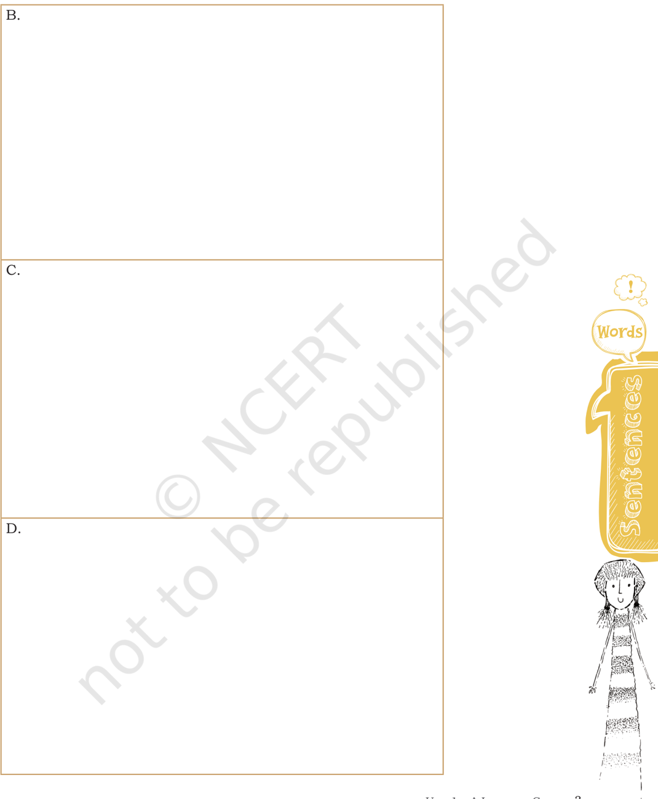
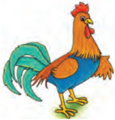

# PAGE 1

?

UNIT

1

## Let's Begin

1.  You have read about Lencho in 'A Letter to God', First Flight, textbook in English for Class X. How has the story of Lencho moved you? What do you think about Lencho's faith in God and his attitude towards the officials in the post office? Do you think he is right in asking God for support and then blaming the people at the post office? Discuss his actions with your friends. Why does he do so?
2.  The  summary  of  the  story  of  Lencho  is  given  below.  The sequence of the story is jumbled up.

Read the story again and rearrange the jumbled sentences to make a coherent story.

| Write the correct order in numbers in the column below   | Jumbled sentences                                                                                    |
|----------------------------------------------------------|------------------------------------------------------------------------------------------------------|
|                                                          | But it rained heavily and hailstorm thrashed his corn field and all the corn was destroyed.          |
|                                                          | He wrote 'To God' on the envelope and posted it.                                                     |
|                                                          | Lencho predicted it will rain and it did. He and his wife were happy.                                |
|                                                          | Lencho felt desperate but believed that God would help him.                                          |
|                                                          | Their corn field was longing for water.                                                              |
|                                                          | The postman andthe postmaster laughed at Lencho's letter but were surprised by the faith of the man. |

;

## A Letter to God

# PAGE 2

| He wrote a letter to God asking for a hundred pesos to sow his field again and to survive until the next crop came up.                                                                                                                                                |
|-----------------------------------------------------------------------------------------------------------------------------------------------------------------------------------------------------------------------------------------------------------------------|
| After some days, Lencho went to the post office to receive the money as the postmaster watched him.                                                                                                                                                                   |
| He immediately went to the counter and asked for a pen and paper, wrote a few lines and posted the letter.                                                                                                                                                            |
| Lencho, his wife, and their children lived in a lonely house in a valley.                                                                                                                                                                                             |
| When the postmaster opened the letter, it said 'Oh! Thanks for sending the money. But I have received only seventy pesos. Next time you please send the money directly to me. The people at the post office are a bunch of crooks. They have taken the thirty pesos.' |
| He opened the letter and was happy to find the money. He counted and found it was only seventy pesos.                                                                                                                                                                 |
| The postmaster collected about 70 pesos from his colleagues and sent it to Lencho.                                                                                                                                                                                    |

Create  a  graphic  description  based  on  the  given  summary  of 'A Letter to God'.

W ORDS AND EXPR E SSIONS 2 ă C LASS X

# PAGE 3

U NIT 1 ă A L ETTER TO  GOD

3

# PAGE 4

4

## Look Up and Understand

beguiling cordiality hamper snipping wagered

## Reading CompRehension text i

Given below is a story of the tailor who has been known for his skills in cheating and stealing. Read in groups of four or in pairs. You may discuss the events  and  incidences  of  the  story  with your friends and write them in a sequential manner.

## The Trader and the Tailor

There was a tailor who was known for beating others in the art of being light-fingered and thievery. A trader swore that even with a hundred attempts, the tailor would not be able to take a coil of thread from him without his knowledge.

The trader was told that many others, more intelligent than him,  had  been  beaten  by  the  tailor.  They  said  he  should  not imagine himself so great, for his ego would only give him worse troubles in competition with the tailor. Still, the trader became more competitive and made a wager that the tailor would not be able to rob him of anything.

He wagered an Arab horse with those who taunted him. If the  tailor  failed  to  steal,  then  they  would  have  to  give  him  a horse instead. That night, the trader lay awake troubled by the situation and could not sleep a wink.

In the morning, he put a piece of satin cloth under his arm and went to the bazaar and entered the shop and saluted the cunning rogue warmly. The tailor sprang up from his seat and welcomed the trader, inquiring about his health with cordiality exceeding  even  that  of  the  trader,  planting  in  his  heart  great feelings of affection for him. When the trader heard these songs of  sweetness  from  the  tailor,  he  flung  down  the  piece  of  silk saying, 'Cut this into a coat for me and make it wide below my navel so as not to hamper my legs and tight about it to show off my figure.'

The tailor answered, 'O! kindly man, I will do you a hundred services,' and accepted the order. He measured the satin and inspected  the working surface and all the time chatted away to the trader in idle gossip, about other amirs and of bounties and gifts he had received from them, and about misers and their mean ways, and made the trader laugh with hysterics. During this  beguiling  talk,  he  was  snipping  away  with  his  scissors rapidly, cutting as fast as his lips moved.

W ORDS AND EXPR E SSIONS 2 ă C LASS X

# PAGE 5

The trader was laughing, the tailor was cutting, the trader closed his eyes in joy, the tailor cut extra pieces, tucking them under his thighs, hidden away from all but God. From his delight at  the  tailor's  tales,  the  trader's  former  boast  went  out  of  his mind.  What  satin?  What  boast?  What  wager?  The  trader  was drunk on the jokes told by the tailor.

Then the tailor told such an incredible story that the trader fell over on his back with laughter. The tailor swiftly stitched a swatch of the satin to the hem of his underpants while the trader was paying no attention at all, greedily sucking with every guffaw at the jests the tailor told. The tailor continued to tell funnier and funnier tales and jokes until the trader was completely within his power.

With his eyes shut and his reason vanished, the bewildered and boastful trader was drunk with joy. And the tailor continued to cut, filching yet more of the beautiful cloth, with nothing to stop him now. And yet the trader begged for more.

You who becomes the slave of the jest, no story is more laughable than you yourself, think on this at the edge of your grave. How long will you listen to the lies of this world that leave your mind and spirit unhinged? The Universal Tailor will cut and stitch the hems of a hundred travellers, silly as children.

Eventually the tailor became bored with the whole story and told the trader that he better leave before another tale was told, 'For if I tell another one, the coat will be too tight for you, and you will stop laughing and weep tears of blood.'

Rumi (Abridged)

Did you enjoy the story of 'The Trader and the Tailor'? The  story  is  summarised  below.  Read  the  story  again with your friend and complete the paragraph using short sentences with the given hints.

Once there was a tailor who was known for  \_\_\_\_\_\_\_\_\_\_\_\_\_\_\_ \_\_\_\_\_\_\_\_\_\_\_\_\_\_\_\_\_\_\_\_\_\_\_\_\_\_\_\_  (cheat  and  thievery).  He  could cheat  anyone  with  his  cunning  way  of  deceiving  people.  A trader challenged that the tailor would not be able to cheat him. He  \_\_\_\_\_\_\_\_\_\_\_\_  (go) to the tailor with  \_\_\_\_\_\_\_\_\_\_\_\_\_\_\_\_\_\_\_\_

filching incredible swatch unhinged

# PAGE 6

## Using 'notice'

Thank you for noticing this notice.

Your noticing has been noted.

\_\_\_\_\_\_\_\_\_\_\_\_\_\_\_\_\_\_\_\_\_\_\_\_\_\_\_\_\_ (satin). The tailor  \_\_\_\_\_\_\_\_\_\_\_\_\_ \_\_\_\_\_\_\_\_\_\_\_\_\_\_\_\_\_  (welcome). The trader  \_\_\_\_\_\_\_\_\_\_\_\_\_\_\_\_\_\_\_\_\_ (please)  by  the  tailor's  praise.  He  told  the  tailor  to  make a coat for him. The tailor  \_\_\_\_\_\_\_\_\_\_\_\_\_\_\_\_\_  (praise) the trader \_\_\_\_\_\_\_\_\_\_\_\_\_\_ (maximum). The trader  \_\_\_\_\_\_\_\_\_\_\_\_\_\_\_\_\_  (joy). The tailor \_\_\_\_\_\_\_\_\_\_\_\_\_\_\_  (recount) funny tales and the trader forgot  \_\_\_\_\_\_\_\_\_\_\_\_\_\_\_\_\_\_\_\_  (bet).  The  tailor  started  snipping \_\_\_\_\_\_\_\_\_\_\_\_\_\_\_\_\_\_\_\_\_\_\_  and  \_\_\_\_\_\_\_\_\_\_\_\_\_\_\_\_\_\_\_\_\_\_\_\_\_\_\_\_\_\_\_\_ hide). Eyes of the trader  \_\_\_\_\_\_\_\_\_\_\_\_\_\_\_\_\_\_\_\_\_\_\_\_\_\_\_\_\_\_\_\_\_\_\_\_ (tears  and  joy)  and  yet  the  trader  kept  on  asking  for \_\_\_\_\_\_\_\_\_\_\_\_\_\_\_\_\_  (stories).  At  last,  the  tailor  told  the  trader that  \_\_\_\_\_\_\_\_\_\_\_\_\_\_\_\_\_\_\_\_\_\_\_\_\_\_\_\_\_  (tight) and \_\_\_\_\_\_\_\_\_\_\_\_\_\_\_ \_\_\_\_\_\_\_\_\_\_\_\_\_\_\_\_\_\_\_\_\_ (weep-blo od).

## VocabULary

1.  In  this story you have come across a word 'light-fingered' which means inclined to steal things. Some such words are given below. Use appropriate words and fill in the blanks.

light-headed, light year, light-hearted, light sleeper, light-duty

- (a)  Th e  \_\_\_\_\_\_\_\_\_\_\_\_\_\_\_\_\_\_\_\_\_\_  is a unit of distance used to measure distance in space.

- (b) The farmer bought a  \_\_\_\_\_\_\_\_\_\_\_\_\_\_\_\_\_\_\_\_\_\_  truck to transport their produce, as it uses less diesel.

- (c) We  had  a  fairly  \_\_\_\_\_\_\_\_\_\_\_\_\_\_\_\_\_\_\_\_\_\_  discussion  with our colleagues.

- (d) Rita felt dizzy and  \_\_\_\_\_\_\_\_\_\_\_\_\_\_\_\_\_\_\_\_\_\_  after skydiving.

- (e) He is a  \_\_\_\_\_\_\_\_\_\_\_\_\_\_\_\_\_\_\_\_, a slightest noise wakes him.

# PAGE 7

1.  You have come across Relative Clauses in the lesson 'A Letter to  God'.  Read  about  the  relative  clauses  again.  Complete the sentences given below in the table by adding the most suitable clause from the box and make it a relative clause. The first one has been done for you.

contains meaning of words stitches clothes

tell lies won the best actor award this year

hit a century is faithful

- (a) A tailor is a person who stitches clothes.

- (b)  A dictionary is a book  \_\_\_\_\_\_\_\_\_\_\_\_\_\_\_\_\_\_\_\_\_\_\_\_\_\_\_\_\_\_\_\_

- (c)  The book is about a scientist  \_\_\_\_\_\_\_\_\_\_\_\_\_\_\_\_\_\_\_\_\_\_\_\_\_\_\_

- (d) What   is    the    name    of    the    player  \_\_\_\_\_\_\_\_\_\_\_\_\_\_\_\_\_\_\_\_\_\_\_\_\_

- (e)  I don't like people  \_\_\_\_\_\_\_\_\_\_\_\_\_\_\_\_\_\_\_\_\_\_\_\_\_\_\_\_\_\_\_\_\_\_\_\_\_

- (f)  What is the name of the actor  \_\_\_\_\_\_\_\_\_\_\_\_\_\_\_\_\_\_\_\_\_\_\_\_\_\_ \_\_\_\_\_\_\_\_\_\_\_\_\_\_\_\_\_\_\_\_\_\_\_\_\_\_\_\_\_\_\_\_\_\_\_\_\_\_\_\_\_\_\_\_\_\_\_\_\_\_\_\_\_\_

- (g)  Students  \_\_\_\_\_\_\_\_\_\_\_\_\_\_\_\_\_\_\_\_\_\_\_\_\_\_\_\_\_\_\_\_\_\_\_\_\_\_\_\_\_\_\_\_\_ should meet the principal in her office.

- (h)  Friends of the trader thought the tailor  \_\_\_\_\_\_\_\_\_\_\_\_\_\_\_\_ and can cheat anyone.

- (i)  Lencho  \_\_\_\_\_\_\_\_\_\_\_\_\_\_\_\_\_\_\_\_\_\_\_  thought God would help him.

- (j)  Those  \_\_\_\_\_\_\_\_\_\_\_\_\_\_\_\_\_\_\_\_\_\_\_\_\_\_\_\_  will succeed.

- (k)  God helps those  \_\_\_\_\_\_\_\_\_\_\_\_\_\_\_\_\_\_\_\_\_\_\_\_\_\_\_\_\_\_

need to fill in the application is a crook help themselves won the nobel prize believe in hard work

## Proofreading marks

Editors have special symbols called proofreading marks to correct language.

Some are given below.

#  give space

- . put a full stop
- , ^     insert comma

insert new word 140-141 for more

See page nos such symbols.

# PAGE 8

## editinG

1.  Suppose Lencho gets a hundred pesos in his envelope. He writes a letter to God expressing his gratitude. However, he has missed a word in each line. Help him with those words so that his letter is complete.

Dear God! Thank for

- (a) sending a hundred pesos help.
- (b) I am very for this kind gesture.
- (c) You were my only and your
- (d) help has my faith in you.

Thank you for

\_\_\_\_\_\_\_\_\_\_\_\_\_\_\_

\_\_\_\_\_\_\_\_\_\_\_\_\_\_\_

\_\_\_\_\_\_\_\_\_\_\_\_\_\_\_

\_\_\_\_\_\_\_\_\_\_\_\_\_\_\_

- (e) This money will help me until the crop       \_\_\_\_\_\_\_\_\_\_\_\_\_\_\_
- (f) and I promise to hard in the future.         \_\_\_\_\_\_\_\_\_\_\_\_\_\_\_ Sincerely yours,

Lencho

## ListeninG

1.   Here is an interesting story. The story has been told in two ways. Story A has all the odd sentences (1,3,5,...) and story B has the even sentences (2,4,6,...). Working in pairs, one of you take up Story A and the other take up Story B. The person with Story A will read out the first sentence and the partner (person with story B) will write in the space provided. Then the person with Story B will read sentence two and the partner will write in the space for sentence two. Likewise complete the whole story. Once the story is completed, both of you will read out to each other to check whether you have listened carefully to your partner and written the complete story.

## Story A      The Race

1.  Every evening the animals of the Machlipatti  used  to  sit  under the banyan tree.

W ORDS AND EXPR E SSIONS 2 ă C LASS X

## Story B      The Race

\_\_\_\_\_\_\_\_\_\_\_\_\_\_\_\_\_\_\_\_\_\_\_\_\_\_\_\_\_\_\_

1.

\_\_\_\_\_\_\_\_\_\_\_\_\_\_\_\_\_\_\_\_\_\_\_\_\_\_\_\_\_\_\_

\_\_\_\_\_\_\_\_\_\_\_\_\_\_\_\_\_\_\_\_\_\_\_\_\_\_\_\_\_\_\_

2. \_\_\_\_\_\_\_\_\_\_\_\_\_\_\_\_\_\_\_\_\_\_\_\_\_\_\_\_\_\_\_ \_\_\_\_\_\_\_\_\_\_\_\_\_\_\_\_\_\_\_\_\_\_\_\_\_\_\_\_\_\_\_

2.    One day  Kho-Kho,  the  rabbit, was feeling bored.

3. He said, 'Let's run a race!' 'Who will run a race with you?

3.    \_\_\_\_\_\_\_\_\_\_\_\_\_\_\_\_\_\_\_\_\_\_\_\_\_\_\_\_\_\_\_ \_\_\_\_\_\_\_\_\_\_\_\_\_\_\_\_\_\_\_\_\_\_\_\_\_\_\_\_\_\_\_ \_\_\_\_\_\_\_\_\_\_\_\_\_\_\_\_\_\_\_\_\_\_\_\_\_\_\_\_\_\_\_

4. \_\_\_\_\_\_\_\_\_\_\_\_\_\_\_\_\_\_\_\_\_\_\_\_\_\_\_\_\_\_\_ \_\_\_\_\_\_\_\_\_\_\_\_\_\_\_\_\_\_\_\_\_\_\_\_\_\_\_\_\_\_\_ \_\_\_\_\_\_\_\_\_\_\_\_\_\_\_\_\_\_\_\_\_\_\_\_\_\_\_\_\_\_\_

4.    No one can run faster than you,' said  Bhalu,  the  bear,  eating  a mango.

5.    Choo -Choo,  the  rat,  shouted, 'No, he's not the fastest runner.

5.  \_\_\_\_\_\_\_\_\_\_\_\_\_\_\_\_\_\_\_\_\_\_\_\_\_\_\_\_\_\_\_

\_\_\_\_\_\_\_\_\_\_\_\_\_\_\_\_\_\_\_\_\_\_\_\_\_\_\_\_\_\_\_

\_\_\_\_\_\_\_\_\_\_\_\_\_\_\_\_\_\_\_\_\_\_\_\_\_\_\_\_\_\_\_

6.    \_\_\_\_\_\_\_\_\_\_\_\_\_\_\_\_\_\_\_\_\_\_\_\_\_\_\_\_\_\_\_

6. I can run faster than him.'

7.    Everyone laughed at him.

7.  \_\_\_\_\_\_\_\_\_\_\_\_\_\_\_\_\_\_\_\_\_\_\_\_\_\_\_\_\_\_\_

8.

\_\_\_\_\_\_\_\_\_\_\_\_\_\_\_\_\_\_\_\_\_\_\_\_\_\_\_\_\_\_\_

\_\_\_\_\_\_\_\_\_\_\_\_\_\_\_\_\_\_\_\_\_\_\_\_\_\_\_\_\_\_\_

\_\_\_\_\_\_\_\_\_\_\_\_\_\_\_\_\_\_\_\_\_\_\_\_\_\_\_\_\_\_\_

8.  Then  it  was  decided  to  have a  race  between  Kho-Kho  and Choo-Choo.

9.    The starting point was the peepul  tree  and  the  finishing point was the neem tree.

9. \_\_\_\_\_\_\_\_\_\_\_\_\_\_\_\_\_\_\_\_\_\_\_\_\_\_\_\_\_\_\_ \_\_\_\_\_\_\_\_\_\_\_\_\_\_\_\_\_\_\_\_\_\_\_\_\_\_\_\_\_\_\_ \_\_\_\_\_\_\_\_\_\_\_\_\_\_\_\_\_\_\_\_\_\_\_\_\_\_\_\_\_\_\_

10.    \_\_\_\_\_\_\_\_\_\_\_\_\_\_\_\_\_\_\_\_\_\_\_\_\_\_\_\_\_\_\_ \_\_\_\_\_\_\_\_\_\_\_\_\_\_\_\_\_\_\_\_\_\_\_\_\_\_\_\_\_\_\_

10. Coocku,  the  cock,  crowed  to start the race.

11.    Kho-Kho and Choo-Choo started running.

11. \_\_\_\_\_\_\_\_\_\_\_\_\_\_\_\_\_\_\_\_\_\_\_\_\_\_\_\_\_\_\_ \_\_\_\_\_\_\_\_\_\_\_\_\_\_\_\_\_\_\_\_\_\_\_\_\_\_\_\_\_\_\_

# PAGE 9

# PAGE 10

12.    \_\_\_\_\_\_\_\_\_\_\_\_\_\_\_\_\_\_\_\_\_\_\_\_\_\_\_\_\_\_\_ \_\_\_\_\_\_\_\_\_\_\_\_\_\_\_\_\_\_\_\_\_\_\_\_\_\_\_\_\_\_\_ \_\_\_\_\_\_\_\_\_\_\_\_\_\_\_\_\_\_\_\_\_\_\_\_\_\_\_\_\_\_\_

12.  After  running  half  the  distance, Kho-Kho looked back but Choo- Choo was nowhere to be seen.

13.  'He must be far behind.'

13.    \_\_\_\_\_\_\_\_\_\_\_\_\_\_\_\_\_\_\_\_\_\_\_\_\_\_\_\_\_\_\_

14. \_\_\_\_\_\_\_\_\_\_\_\_\_\_\_\_\_\_\_\_\_\_\_\_\_\_\_\_\_\_\_ \_\_\_\_\_\_\_\_\_\_\_\_\_\_\_\_\_\_\_\_\_\_\_\_\_\_\_\_\_\_\_ \_\_\_\_\_\_\_\_\_\_\_\_\_\_\_\_\_\_\_\_\_\_\_\_\_\_\_\_\_\_\_ \_\_\_\_\_\_\_\_\_\_\_\_\_\_\_\_\_\_\_\_\_\_\_\_\_\_\_\_\_\_\_

14.    When he was near the finishing point,  Choo-Choo  jumped  over Kho-Kho's shoulder and touched the neem tree first.

15. He shouted, 'I've won the race! I've won the race!'

15.    \_\_\_\_\_\_\_\_\_\_\_\_\_\_\_\_\_\_\_\_\_\_\_\_\_\_\_\_\_\_\_

\_\_\_\_\_\_\_\_\_\_\_\_\_\_\_\_\_\_\_\_\_\_\_\_\_\_\_\_\_\_\_

16.

\_\_\_\_\_\_\_\_\_\_\_\_\_\_\_\_\_\_\_\_\_\_\_\_\_\_\_\_\_\_\_

16.    Everyone cheered for Choo-Choo.

## speakinG

1.  Lencho,  the  main  character  in  the  story,  is  a  farmer. He  supports  his  family  through  farming.  The  conflict  in the  story  happens  when  a  hailstorm  strikes  the  field  and destroys his farm. All the hard work, for nothing! The entire land is wrecked by catastrophe. There is no one who can help. Lencho's complete faith in God is amazing during the calamity.

So,  one  type  of  conflict  dominating  in  the  story  is  man versus  nature.  Discuss  with  your  partner  the  natural  calamities that play havoc in the lives of people. Collect photographs and make a visual presentation to share in the class.

2.  Try writing a small poem on the topic man versus nature. Read aloud the poem with the required stress and intonation. Given below is a poem written by Norman Littleford, which may help you think and compose.

# PAGE 11

## Writing

1.  The tailor here is a cheat, but Lencho in the story, 'A Letter to God', is naive and simple. He has immense faith in God. How do you distinguish between Lencho and the tailor? What makes them different? Working in pairs, list the actions and qualities of Lencho and the tailor and draw their character sketches.

## Man vs Nature

The heavens roared with thunder as lightning filled the skies was this God getting angry or Nature's big surprise. Is Mother Nature telling us the best way that she can to stop the interference and abuse she gets from man. We marvel at her beauty each time we look around then dig up all her treasures from their natural burial ground. We forget that Nature gives us all that keeps us living we take it all and still want more but never think of giving. We build across the countryside progressing every day but Mother Nature can't progress for man is in the way.

Norman Littleford

# PAGE 12

Action: What does the person do?

What quality it reveals?

Lencho lost all his crops.

He  is helpless.  Prays  to God.

How does he manage the situation? \_\_\_\_\_\_\_\_\_\_\_\_\_\_\_

\_\_\_\_\_\_\_\_\_\_\_\_\_\_\_\_\_\_\_\_\_\_\_\_\_\_\_\_\_\_\_\_\_\_\_\_\_\_\_\_\_\_\_\_

\_\_\_\_\_\_\_\_\_\_\_\_\_\_\_\_\_\_\_\_\_\_\_\_\_\_\_\_\_\_\_\_\_\_\_\_\_\_\_\_\_\_\_\_

Does he harm anyone by his action? \_\_\_\_\_\_\_\_\_\_\_\_\_\_

\_\_\_\_\_\_\_\_\_\_\_\_\_\_\_\_\_\_\_\_\_\_\_\_\_\_\_\_\_\_\_\_\_\_\_\_\_\_\_\_\_\_\_\_

\_\_\_\_\_\_\_\_\_\_\_\_\_\_\_\_\_\_\_\_\_\_\_\_\_\_\_\_\_\_\_\_\_\_\_\_\_\_\_\_\_\_\_\_

How  do  others  think  of him? \_\_\_\_\_\_\_\_\_\_\_\_\_\_\_\_\_\_\_\_

\_\_\_\_\_\_\_\_\_\_\_\_\_\_\_\_\_\_\_\_\_\_\_\_\_\_\_\_\_\_\_\_\_\_\_\_\_\_\_\_\_\_\_\_

\_\_\_\_\_\_\_\_\_\_\_\_\_\_\_\_\_\_\_\_\_\_\_\_\_\_\_\_\_\_\_\_\_\_\_\_\_\_\_\_\_\_\_\_

What is your judgement of him? \_\_\_\_\_\_\_\_\_\_\_\_\_\_\_\_\_\_\_\_

\_\_\_\_\_\_\_\_\_\_\_\_\_\_\_\_\_\_\_\_\_\_\_\_\_\_\_\_\_\_\_\_\_\_\_\_\_\_\_\_\_\_\_\_

\_\_\_\_\_\_\_\_\_\_\_\_\_\_\_\_\_\_\_\_\_\_\_\_\_\_\_\_\_\_\_\_\_\_\_\_\_\_\_\_\_\_\_\_

He received 70 pesos and he thought 30 pesos had been stolen.

\_\_\_\_\_\_\_\_\_\_\_\_\_\_\_\_\_\_\_\_\_\_\_\_\_\_\_\_\_\_\_\_\_\_\_\_\_\_\_\_\_\_\_\_

\_\_\_\_\_\_\_\_\_\_\_\_\_\_\_\_\_\_\_\_\_\_\_\_\_\_\_\_\_\_\_\_\_\_\_\_\_\_\_\_\_\_\_\_

\_\_\_\_\_\_\_\_\_\_\_\_\_\_\_\_\_\_\_\_\_\_\_\_\_\_\_\_\_\_\_\_\_\_\_\_\_\_\_\_\_\_\_\_

\_\_\_\_\_\_\_\_\_\_\_\_\_\_\_\_\_\_\_\_\_\_\_\_\_\_\_\_\_\_\_\_\_\_\_\_\_\_\_\_\_\_\_\_

Now, write the character sketch of Lencho and the tailor.

Lencho

\_\_\_\_\_\_\_\_\_\_\_\_\_\_\_\_\_\_\_\_\_\_\_\_\_\_\_\_\_\_\_\_\_\_

\_\_\_\_\_\_\_\_\_\_\_\_\_\_\_\_\_\_\_\_\_\_\_\_\_\_\_\_\_\_\_\_\_\_

\_\_\_\_\_\_\_\_\_\_\_\_\_\_\_\_\_\_\_\_\_\_\_\_\_\_\_\_\_\_\_\_\_\_

\_\_\_\_\_\_\_\_\_\_\_\_\_\_\_\_\_\_\_\_\_\_\_\_\_\_\_\_\_\_\_\_\_\_

\_\_\_\_\_\_\_\_\_\_\_\_\_\_\_\_\_\_\_\_\_\_\_\_\_\_\_\_\_\_\_\_\_\_

\_\_\_\_\_\_\_\_\_\_\_\_\_\_\_\_\_\_\_\_\_\_\_\_\_\_\_\_\_\_\_\_\_\_

\_\_\_\_\_\_\_\_\_\_\_\_\_\_\_\_\_\_\_\_\_\_\_\_\_\_\_\_\_\_\_\_\_\_

\_\_\_\_\_\_\_\_\_\_\_\_\_\_\_\_\_\_\_\_\_\_\_\_\_\_\_\_\_\_\_\_\_\_

\_\_\_\_\_\_\_\_\_\_\_\_\_\_\_\_\_\_\_\_\_\_\_\_\_\_\_\_\_\_\_\_\_\_

The tailor

\_\_\_\_\_\_\_\_\_\_\_\_\_\_\_\_\_\_\_\_\_\_\_\_\_\_\_\_\_\_\_\_\_\_

\_\_\_\_\_\_\_\_\_\_\_\_\_\_\_\_\_\_\_\_\_\_\_\_\_\_\_\_\_\_\_\_\_\_

\_\_\_\_\_\_\_\_\_\_\_\_\_\_\_\_\_\_\_\_\_\_\_\_\_\_\_\_\_\_\_\_\_\_

\_\_\_\_\_\_\_\_\_\_\_\_\_\_\_\_\_\_\_\_\_\_\_\_\_\_\_\_\_\_\_\_\_\_

\_\_\_\_\_\_\_\_\_\_\_\_\_\_\_\_\_\_\_\_\_\_\_\_\_\_\_\_\_\_\_\_\_\_

\_\_\_\_\_\_\_\_\_\_\_\_\_\_\_\_\_\_\_\_\_\_\_\_\_\_\_\_\_\_\_\_\_

\_\_\_\_\_\_\_\_\_\_\_\_\_\_\_\_\_\_\_\_\_\_\_\_\_\_\_\_\_\_\_\_\_\_

\_\_\_\_\_\_\_\_\_\_\_\_\_\_\_\_\_\_\_\_\_\_\_\_\_\_\_\_\_\_\_\_\_\_

\_\_\_\_\_\_\_\_\_\_\_\_\_\_\_\_\_\_\_\_\_\_\_\_\_\_\_\_\_\_\_\_\_\_

# PAGE 13

## 2.  Writing a portrait or description of a person

Read the following description about two persons, Raavi and Mohini.

| Raavi                                                                  | Mohini                                                         |
|------------------------------------------------------------------------|----------------------------------------------------------------|
| A portrait or a picture of a handsome young man in full sleeves shirt. | A portrait or a picture of a middle aged lady who is a singer. |
| Raavi is an engineer in a manufacturing firm.                          | She studied music and became a playback singer.                |
| He likes to make, fix, and repair things.                              | She likes to be with people and participates in social         |
| He loves to watch television and goes to the movies thrice a month.    | functions. She loves music and reading books.                  |
| He is congenial and supportive.                                        | She is firm and a lady with a purpose.                         |
| He does not like to play, but goes for a morning walk everyday.        | She does not get time to exercise.                             |

Now, write a description of any one of the above based on the details given. You may follow the process approach to writing. First, you read the given information in the box and make a list of describable (adjectives) points used for each person, in your own words. Secondly, take the help of these points to develop an outline in sentence form. Thirdly, use the outline and prepare the first draft of the description of the person and then edit the draft. Prepare the final copy after making all changes. The table

# PAGE 14

below gives you ideas on how the Process Approach is helpful for improving your writing.

| Writing: The Process Approach   | Writing: The Process Approach                                                                                                       |
|---------------------------------|-------------------------------------------------------------------------------------------------------------------------------------|
| The processes                   | What do you do?                                                                                                                     |
| Brainstorming                   | Note down as manyideas as you can about a given topic. Then arrange the ideas in a sequence.                                        |
| Outlining                       | Create an outline of your writing- which ideas will go first, how will they be supported by evidence, will there be a picture, etc. |
| Drafting                        | Write the first draft; here the focus is on the content and not the form.                                                           |
| Revising                        | Revise the first draft, improve it. Add or delete ideas and improve the language.                                                   |
| Proofreading                    | Proofread the draft with the help of the teacher; here the focus is on the form and not the content.                                |
| Final draft                     | Write the final draft now.                                                                                                          |

Raavi  /  Mohini

\_\_\_\_\_\_\_\_\_\_\_\_\_\_\_\_\_\_\_\_\_\_\_\_\_\_\_\_\_\_\_\_\_\_\_\_\_\_\_\_\_\_\_\_\_\_\_\_\_\_\_\_\_\_\_\_\_\_\_\_\_\_\_\_\_\_\_\_\_\_\_\_

\_\_\_\_\_\_\_\_\_\_\_\_\_\_\_\_\_\_\_\_\_\_\_\_\_\_\_\_\_\_\_\_\_\_\_\_\_\_\_\_\_\_\_\_\_\_\_\_\_\_\_\_\_\_\_\_\_\_\_\_\_\_\_\_\_\_\_\_\_\_\_\_

\_\_\_\_\_\_\_\_\_\_\_\_\_\_\_\_\_\_\_\_\_\_\_\_\_\_\_\_\_\_\_\_\_\_\_\_\_\_\_\_\_\_\_\_\_\_\_\_\_\_\_\_\_\_\_\_\_\_\_\_\_\_\_\_\_\_\_\_\_\_\_\_

\_\_\_\_\_\_\_\_\_\_\_\_\_\_\_\_\_\_\_\_\_\_\_\_\_\_\_\_\_\_\_\_\_\_\_\_\_\_\_\_\_\_\_\_\_\_\_\_\_\_\_\_\_\_\_\_\_\_\_\_\_\_\_\_\_\_\_\_\_\_\_\_

\_\_\_\_\_\_\_\_\_\_\_\_\_\_\_\_\_\_\_\_\_\_\_\_\_\_\_\_\_\_\_\_\_\_\_\_\_\_\_\_\_\_\_\_\_\_\_\_\_\_\_\_\_\_\_\_\_\_\_\_\_\_\_\_\_\_\_\_\_\_\_\_

\_\_\_\_\_\_\_\_\_\_\_\_\_\_\_\_\_\_\_\_\_\_\_\_\_\_\_\_\_\_\_\_\_\_\_\_\_\_\_\_\_\_\_\_\_\_\_\_\_\_\_\_\_\_\_\_\_\_\_\_\_\_\_\_\_\_\_\_\_\_\_\_

\_\_\_\_\_\_\_\_\_\_\_\_\_\_\_\_\_\_\_\_\_\_\_\_\_\_\_\_\_\_\_\_\_\_\_\_\_\_\_\_\_\_\_\_\_\_\_\_\_\_\_\_\_\_\_\_\_\_\_\_\_\_\_\_\_\_\_\_\_\_\_\_

\_\_\_\_\_\_\_\_\_\_\_\_\_\_\_\_\_\_\_\_\_\_\_\_\_\_\_\_\_\_\_\_\_\_\_\_\_\_\_\_\_\_\_\_\_\_\_\_\_\_\_\_\_\_\_\_\_\_\_\_\_\_\_\_\_\_\_\_\_\_\_\_

# PAGE 15

1.  You may have come across some people in your neighbourhood  who  might  have  inspired  you  with  their actions. Talk to them about-
- their  childhood,  their  education,  job,  their  likes  and dislikes
- their  contribution  to  the  enrichment  of  their  village  or town, job, country, etc.
- their interesting features and characteristics

Request for their pictures. Based on the collected information, write  their  portraits  and  present  it  to  the  class.  You  may read on 'How to do project work?' given below.

## How to do project work in the English language classroom?

In addition to the textbook activities, project work could be used as an effective strategy to promote collaborative ways of language learning where we work together in groups to do an activity. We collect information, ideas; observe the language being  used;  use  language  in  real  life  situations;  exchange views and debate on ideas; write the ideas into a report; edit our writing and produce the report in a suitable form. This helps in constructing ideas and analysing critical judgments of the peers to arrive at a decision or conclusion.

It would be of much benefit to learners, if projects planned are of an interdisciplinary nature.

## Designing and managing projects

There are many ways students can be initiated to carry out projects.

- Read  books,  newspapers,  listen  to  the  radio,  watch TV, consult websites and encyclopedia, talk to people, observe events and  proceedings, interview people, record audio/ video, collect pictures and illustrations, interpret them, and report.
- Write  field  notes  to  remember  and  organise  the  data collected.

# PAGE 16

- Bring  your  own  ideas  to  the  class  and  have  a  class discussion.
- Use language meaningfully and precisely. If the meaning of learning is 'meaning making', the purpose is achieved fully while doing projects.
- Learners should do the projects in group independently. They should not ask their parents to do these or buy readymade products available in the market.
- They may seek information or some help from parents or elders.

## Planning, writing the draft and editing

Having collected  the  required  data,  information  and  ideas, plan and organise the data and interpret them to write the draft. It could be posters, a script of a play (enact and direct a  play),  songs,  essays,  etc.  Editing  is  an  important  part of  writing  the  report.  Students  should  be  made  aware  of process approach involved in writing a good piece of work. Then present it to the whole class or to the school during the assembly or on special occasions (in case of play, songs, etc.).