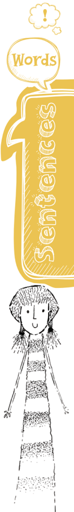
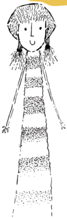
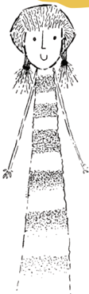
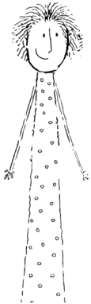
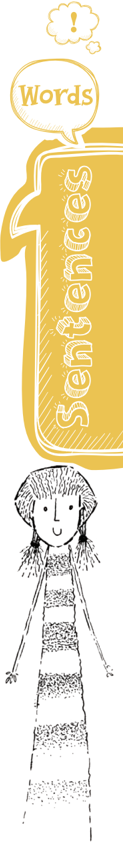
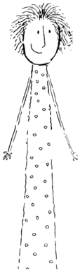
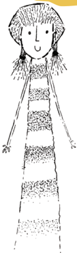
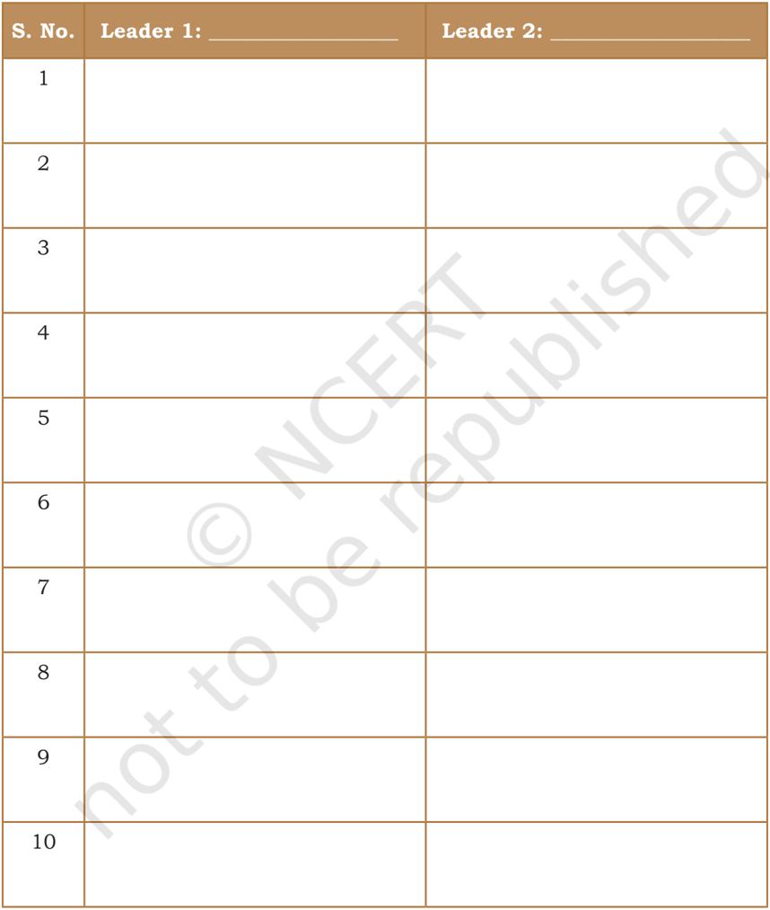

# PAGE 1

## Let's Begin

1.  You  have  read  the  story  about  Nelson  Mandela  in  your textbook, First Flight, and the struggle of the people of South Africa.  Mandela  draws  our  attention  to  the  meaning  and importance of freedom and leading a life with freedom.

He  states that freedom comes  with responsibilities. Discuss with your peers, how freedom and responsibilities go hand in hand.

\_\_\_\_\_\_\_\_\_\_\_\_\_\_\_\_\_\_\_\_\_\_\_\_\_\_\_\_\_\_\_\_\_\_\_\_\_\_\_\_\_\_\_\_\_\_\_\_\_\_\_\_\_\_\_\_\_

\_\_\_\_\_\_\_\_\_\_\_\_\_\_\_\_\_\_\_\_\_\_\_\_\_\_\_\_\_\_\_\_\_\_\_\_\_\_\_\_\_\_\_\_\_\_\_\_\_\_\_\_\_\_\_\_\_

\_\_\_\_\_\_\_\_\_\_\_\_\_\_\_\_\_\_\_\_\_\_\_\_\_\_\_\_\_\_\_\_\_\_\_\_\_\_\_\_\_\_\_\_\_\_\_\_\_\_\_\_\_\_\_\_\_

\_\_\_\_\_\_\_\_\_\_\_\_\_\_\_\_\_\_\_\_\_\_\_\_\_\_\_\_\_\_\_\_\_\_\_\_\_\_\_\_\_\_\_\_\_\_\_\_\_\_\_\_\_\_\_\_\_

\_\_\_\_\_\_\_\_\_\_\_\_\_\_\_\_\_\_\_\_\_\_\_\_\_\_\_\_\_\_\_\_\_\_\_\_\_\_\_\_\_\_\_\_\_\_\_\_\_\_\_\_\_\_\_\_\_

\_\_\_\_\_\_\_\_\_\_\_\_\_\_\_\_\_\_\_\_\_\_\_\_\_\_\_\_\_\_\_\_\_\_\_\_\_\_\_\_\_\_\_\_\_\_\_\_\_\_\_\_\_\_\_\_\_

## Reading CompRehension

## text i

Given below is a speech by Sardar Patel, one of the prominent figures of India's freedom struggle. This is one of the convocation speeches  delivered  by  him.  Read  the  speech  and  answer  the questions that follow.

## Sardar Patel's Call to Youth to build Character and be Disciplined

I must thank you for the affectionate and warm welcome which you have extended to me and for the love and regard which you

# PAGE 2

have shown me by conferring this honour to me. Gifts are of many kinds those achieved by one's own endeavour are good and  deserved,  but  no  gift  should  be  conferred  on  one  whose worthiness has not been tested. By selecting me without assuring yourself of my fitness for the gift, you have laid me under a heavy debt and, by your injunctions that I should continue to prove worthy of it throughout my life, you have imposed on me a very difficult obligation. At present, I cannot say anything because I

am bound by your love and affection; and, therefore, with your blessing and God's grace, I pray that I may prove worthy of it. Should I fail, the blame for my failure will be shared by you as well.

On  this  occasion,  I  wish  to  place  before  you  a  few thoughts  which  occur  to  my  mind  as  incidental  to  our hard-won freedom. We have now won our freedom. But just  as  I  am  doubtful,  if  I  deserved  the  honour  that you have done me, you have also to think whether you have done everything to deserve freedom that you have attained after such a bitter and sustained struggle.

There are people who think that having won freedom, there is nothing more to do about it. Freedom has come to  us  through  sacrifices.  Those  who  made  sacrifices tasted the fruit of their efforts and self-denials, but it is for those who are now enjoying freedom to taste its fruit. After the last World War, there is an all-round deterioration in human standards. People have become self-centered. They have forgotten or ignored the wider interests of the country. The essential and noteworthy features of our struggle were: sacrifice,  truth,  and  non-violence.  The  weapons  of  the

World  War  were:  violence,  brute  force,  political  and military moves, and counter moves. As a result of the churning of the ocean, the world has emitted poison.  That  poison  is  spreading  all  over  and there is none to swallow it. The countries which

were free have managed to digest it somewhat, but we, who have just attained our freedom, it is hard to do the same. Therefore, those who think that having attained freedom they have attained everything  have  really  attained  nothing!  The  freedom  that  we have won is yet to be consolidated.  The foundations of freedom have to be well and truly laid! This one-year old child has to be nursed and nourished, instructed and streng thened. It is for us to do it and we must do it.

# PAGE 3

In India today, there is no time for useless controversies and unnecessary  debates  and  disputes.  One  can  indulge  in  these pastimes when one has time and leisure. At present, we have to  occupy  ourselves  with  the  all  absorbing  task  of  making  the foundation of our freedom strong and unassailable. We have to reflect on our place in this broken and destructed world and what our duty and obligations are! If we fail to make the best use of our freedom to make it worthwhile and turn it to our advantage and advancements, future generations will heap curses on us. They will say that a spiritualist, a great soul gave us this precious boon, but we did not know how to retain it and lost it.

I should like to urge upon those who train citizens of tomorrow and to those citizens of tomorrow that we have yet to stand on our feet. We must concentrate on one thing alone, viz., how to make our country  strong  and  united.  We  can  make  it  strong when hearts are pure and when we fully appreciate our duty. Now that foreign rulers have gone, are we in a position to sustain the whole burden that has devolved on us? When we took over from  them,  the  administrative  fabric  was  in  tatters.  We  have to  mend and place it. This, in itself, is a heavy responsibility. It  is  for  our  universities to train young men to shoulder these responsibilities.

The great university of life is full of experiences, but to make full  use  of  those  experiences, all of us students, teachers and professors  -  have to be cautious and on guard.

The most essential requisite is character. If your character is lacking and you leave the precincts of the alma mater without your character fully developed, you will be wasting an opportunity of a lifetime.

You have to realise that India has to attain its rightful place in the comity of nations. The leadership of Asia would be hers if she conducts herself well and if her citizens make their fitting contribution to nation's resurgence. Whatever trials and troubles we  might  have  passed  through,  there  is  no  denying  the  fact that we have a precious inheritance and the teachings we have received from the departed leaders are great assets for us.

India abounds in the resources of nature and manpower. They are awaiting full use. That task must devolve on young men and women. We ourselves were trained in the school of experience. We fought for freedom and we have attained that prize for you. It is now up to you to prove yourself worthy of the same. This you can do only if you work with single-minded devotion to the cause of the country. It is only then that you can deserve this freedom and be proud of it.

Look Up and Understand conferring endeavour obligation precincts unassailable

# PAGE 4

Look Up and Understand comity of nations communalism inheritance resurgence

The real danger of India lies in our disunity. That poison of communalism was spread in the past. You should draw a curtain over it. Only then could we equip ourselves for the freedom that has come to us. There are still people in the country whose loyalty to India has not settled down. They should and will leave India.

This is the occasion for mutual help and mutual cooperation. We must know what our duty is as true citizens. Your teacher has to impart that duty. Unless we learn to shoulder our responsibility in the true spirit of discipline and citizenship we cannot go ahead. We must strengthen our shoulders and our legs so that we can stand erect and bear the burden that has devolved on us. Then alone would we secure the real objective of freedom.

(Source: The Collected Works of Sardar Vallabhbhai Patel Volume XIII [1 January 1948  -  31 December 1948],

Editor: P.N. Chopra, Konark  Publishers Pvt. Ltd., New Delhi)

Complete  the  sentences  given  below  by  choosing  the most appropriate word or phrase.

## Q.1. The occasion of the speech of Sardar Patel here is

\_\_\_\_\_\_\_\_\_\_\_\_\_\_\_\_\_\_\_\_\_\_\_\_\_\_\_\_\_\_\_\_\_\_\_\_\_\_\_\_\_\_\_\_\_\_\_\_\_\_\_\_.

- (a)  an address to a public gathering
- (b)  a convocation address at a university
- (c)  a speech in Indian Parliament
- (d)  a speech delivered to civil servants

## Q.2. Patel feels that future generations will heap curses on us if  \_\_\_\_\_\_\_\_\_\_\_\_\_\_\_\_\_\_\_\_\_\_\_\_\_\_\_\_\_\_\_\_\_\_\_\_\_\_\_\_\_\_\_\_.

- (a)  we fail to protect our freedom
- (b)  we fail to protect the corrupt people in public life
- (c)  we wage war against other nations
- (d)  we understand the need for peace

## Q.3. The	first	and	foremost	thing	Patel	stressed	to	be done is  \_\_\_\_\_\_\_\_\_\_\_\_\_\_\_\_\_\_\_\_\_\_\_\_\_\_\_\_\_\_\_\_\_\_\_\_\_\_\_\_\_\_\_\_\_.

- (a)  to make the country strong and united
- (b)  to give employment to everyone
- (c)  to fight a war against those who oppressed us
- (d)    to make every citizen feel happy

W ORDS AND EXPR E SSIONS 2 ă C LASS X 20

- Q.4. One major characteristic of university education, as Sardar Patel believes, is  \_\_\_\_\_\_\_\_\_\_\_\_\_\_\_\_\_.

- (a)  character

- (b)  duty

- (c)  knowledge

- (d)  power

- Q.5. What did Patel not mean when he said, 'You have to realise that India has to attain its rightful place in the comity of nations'? Tick the right answer.

- (a)  Friendly and cordial relationship with other nations

- (b)  Group of nations which wage war against other

- (c)  Community of people

- (d)  Nations from a continent

- Q.6. 'India  abounds  in  the  resources  of  nature  and manpower' means  \_\_\_\_\_\_\_\_\_\_\_\_\_\_\_\_\_\_\_\_\_\_\_\_\_\_\_\_\_\_\_\_\_.

- (a)  India has a vibrant economy

- (b)  India's  natural  resources  and  population  are  a great resource

- (c)  India's lack of manpower

- (d)  Indians are great resource for development

## Q.7. What  is  the  greatest  danger  for  India  as  Patel believes in his speech?

- (a)  India has a vibrant economy.

- (b)  India's  natural  resources  and  population  are  a great resource.

- (c)  India's lack of manpower.

- (d)  Indians are great resource for development.

- Q.8. Complete  the  following  statement  based  on  your understanding of Patel's speech.

The  first  and  foremost  duty  of  the  young  nation  is

\_\_\_\_\_\_\_\_\_\_\_\_\_\_\_\_\_\_\_\_\_\_\_\_\_\_\_\_\_\_\_\_\_\_\_\_\_\_\_\_\_\_\_\_\_\_\_\_\_\_\_\_\_

\_\_\_\_\_\_\_\_\_\_\_\_\_\_\_\_\_\_\_\_\_\_\_\_\_\_\_\_\_\_\_\_\_\_\_\_\_\_\_\_\_\_\_\_\_\_\_\_\_\_\_\_\_

\_\_\_\_\_\_\_\_\_\_\_\_\_\_\_\_\_\_\_\_\_\_\_\_\_\_\_\_\_\_\_\_\_\_\_\_\_\_\_\_\_\_\_\_\_\_\_\_\_\_\_\_\_

\_\_\_\_\_\_\_\_\_\_\_\_\_\_\_\_\_\_\_\_\_\_\_\_\_\_\_\_\_\_\_\_\_\_\_\_\_\_\_\_\_\_\_\_\_\_\_\_\_\_\_\_\_

# PAGE 5

# PAGE 6

\_\_\_\_\_\_\_\_\_\_\_\_\_\_\_\_\_\_\_\_\_\_\_\_\_\_\_\_\_\_\_\_\_\_\_\_\_\_\_\_\_\_\_\_\_\_\_\_\_\_\_\_\_

\_\_\_\_\_\_\_\_\_\_\_\_\_\_\_\_\_\_\_\_\_\_\_\_\_\_\_\_\_\_\_\_\_\_\_\_\_\_\_\_\_\_\_\_\_\_\_\_\_\_\_\_\_

\_\_\_\_\_\_\_\_\_\_\_\_\_\_\_\_\_\_\_\_\_\_\_\_\_\_\_\_\_\_\_\_\_\_\_\_\_\_\_\_\_\_\_\_\_\_\_\_\_\_\_\_\_

\_\_\_\_\_\_\_\_\_\_\_\_\_\_\_\_\_\_\_\_\_\_\_\_\_\_\_\_\_\_\_\_\_\_\_\_\_\_\_\_\_\_\_\_\_\_\_\_\_\_\_\_\_

FUn Facts

## IdIom

Break the ice: to end a conflict or commence a friendship

## Freedom

## Responsibility

\_\_\_\_\_\_\_\_\_\_\_\_\_\_\_\_\_\_\_\_\_\_\_\_\_\_\_\_\_\_\_\_\_\_

\_\_\_\_\_\_\_\_\_\_\_\_\_\_\_\_\_\_\_\_\_\_\_\_\_\_\_\_\_\_\_\_\_\_

\_\_\_\_\_\_\_\_\_\_\_\_\_\_\_\_\_\_\_\_\_\_\_\_\_\_\_\_\_\_\_\_\_\_

\_\_\_\_\_\_\_\_\_\_\_\_\_\_\_\_\_\_\_\_\_\_\_\_\_\_\_\_\_\_\_\_\_\_

\_\_\_\_\_\_\_\_\_\_\_\_\_\_\_\_\_\_\_\_\_\_\_\_\_\_\_\_\_\_\_\_\_\_

\_\_\_\_\_\_\_\_\_\_\_\_\_\_\_\_\_\_\_\_\_\_\_\_\_\_\_\_\_\_\_\_\_\_

\_\_\_\_\_\_\_\_\_\_\_\_\_\_\_\_\_\_\_\_\_\_\_\_\_\_\_\_\_\_\_\_\_\_

\_\_\_\_\_\_\_\_\_\_\_\_\_\_\_\_\_\_\_\_\_\_\_\_\_\_\_\_\_\_\_\_\_\_

\_\_\_\_\_\_\_\_\_\_\_\_\_\_\_\_\_\_\_\_\_\_\_\_\_\_\_\_\_\_\_\_\_\_

\_\_\_\_\_\_\_\_\_\_\_\_\_\_\_\_\_\_\_\_\_\_\_\_\_\_\_\_\_\_\_\_\_\_

\_\_\_\_\_\_\_\_\_\_\_\_\_\_\_\_\_\_\_\_\_\_\_\_\_\_\_\_\_\_\_\_\_\_

\_\_\_\_\_\_\_\_\_\_\_\_\_\_\_\_\_\_\_\_\_\_\_\_\_\_\_\_\_\_\_\_\_\_

## VocabULary

1.  Use the following words and phrases in your own sentences.

- (a)  Precincts  \_\_\_\_\_\_\_\_\_\_\_\_\_\_\_\_\_\_\_\_\_\_\_\_\_\_\_\_\_\_\_\_\_\_\_\_\_\_\_\_\_\_\_\_\_\_

\_\_\_\_\_\_\_\_\_\_\_\_\_\_\_\_\_\_\_\_\_\_\_\_\_\_\_\_\_\_\_\_\_\_\_\_\_\_\_\_\_\_\_\_\_\_\_\_\_\_\_\_\_

- (b)  Comity of nations  \_\_\_\_\_\_\_\_\_\_\_\_\_\_\_\_\_\_\_\_\_\_\_\_\_\_\_\_\_\_\_\_\_\_\_\_\_

\_\_\_\_\_\_\_\_\_\_\_\_\_\_\_\_\_\_\_\_\_\_\_\_\_\_\_\_\_\_\_\_\_\_\_\_\_\_\_\_\_\_\_\_\_\_\_\_\_\_\_\_\_

- (c)  Unassailable  \_\_\_\_\_\_\_\_\_\_\_\_\_\_\_\_\_\_\_\_\_\_\_\_\_\_\_\_\_\_\_\_\_\_\_\_\_\_\_\_\_\_

\_\_\_\_\_\_\_\_\_\_\_\_\_\_\_\_\_\_\_\_\_\_\_\_\_\_\_\_\_\_\_\_\_\_\_\_\_\_\_\_\_\_\_\_\_\_\_\_\_\_\_\_\_

- (d)  Mutual cooperation  \_\_\_\_\_\_\_\_\_\_\_\_\_\_\_\_\_\_\_\_\_\_\_\_\_\_\_\_\_\_\_\_\_\_\_

\_\_\_\_\_\_\_\_\_\_\_\_\_\_\_\_\_\_\_\_\_\_\_\_\_\_\_\_\_\_\_\_\_\_\_\_\_\_\_\_\_\_\_\_\_\_\_\_\_\_\_\_\_

2.  Sardar  Patel  called  upon  young  students  to  understand the  meaning  of  freedom  and  ways  to  sustain  it.  Here  are two  key  words  which  he  stressed  upon-'Freedom'  and 'Responsibility'.  Working  in  pairs,  find  words  and  phrases which convey the feeling of these words and write below.

\_\_\_\_\_\_\_\_\_\_\_\_\_\_\_\_\_\_\_\_\_\_\_\_\_\_\_\_\_\_\_\_\_\_

\_\_\_\_\_\_\_\_\_\_\_\_\_\_\_\_\_\_\_\_\_\_\_\_\_\_\_\_\_\_\_\_\_\_

\_\_\_\_\_\_\_\_\_\_\_\_\_\_\_\_\_\_\_\_\_\_\_\_\_\_\_\_\_\_

\_\_\_\_\_\_\_\_\_\_\_\_\_\_\_\_\_\_\_\_\_\_\_\_\_\_\_\_\_\_

# PAGE 7

You may have written above at least seven to eight words for each key word. Using the words write at least five sentences describing 'Freedom' and 'Responsibility'. One has been done for you.

Example: Freedom is not free.

\_\_\_\_\_\_\_\_\_\_\_\_\_\_\_\_\_\_\_\_\_\_\_\_\_\_\_\_\_\_\_\_\_\_\_\_\_\_\_\_\_\_\_\_\_\_\_\_\_\_\_\_\_\_\_\_\_\_\_\_\_\_\_\_\_\_\_\_\_\_

\_\_\_\_\_\_\_\_\_\_\_\_\_\_\_\_\_\_\_\_\_\_\_\_\_\_\_\_\_\_\_\_\_\_\_\_\_\_\_\_\_\_\_\_\_\_\_\_\_\_\_\_\_\_\_\_\_\_\_\_\_\_\_\_\_\_\_\_\_\_

\_\_\_\_\_\_\_\_\_\_\_\_\_\_\_\_\_\_\_\_\_\_\_\_\_\_\_\_\_\_\_\_\_\_\_\_\_\_\_\_\_\_\_\_\_\_\_\_\_\_\_\_\_\_\_\_\_\_\_\_\_\_\_\_\_\_\_\_\_\_

\_\_\_\_\_\_\_\_\_\_\_\_\_\_\_\_\_\_\_\_\_\_\_\_\_\_\_\_\_\_\_\_\_\_\_\_\_\_\_\_\_\_\_\_\_\_\_\_\_\_\_\_\_\_\_\_\_\_\_\_\_\_\_\_\_\_\_\_\_\_

\_\_\_\_\_\_\_\_\_\_\_\_\_\_\_\_\_\_\_\_\_\_\_\_\_\_\_\_\_\_\_\_\_\_\_\_\_\_\_\_\_\_\_\_\_\_\_\_\_\_\_\_\_\_\_\_\_\_\_\_\_\_\_\_\_\_\_\_\_\_

\_\_\_\_\_\_\_\_\_\_\_\_\_\_\_\_\_\_\_\_\_\_\_\_\_\_\_\_\_\_\_\_\_\_\_\_\_\_\_\_\_\_\_\_\_\_\_\_\_\_\_\_\_\_\_\_\_\_\_\_\_\_\_\_\_\_\_\_\_\_

\_\_\_\_\_\_\_\_\_\_\_\_\_\_\_\_\_\_\_\_\_\_\_\_\_\_\_\_\_\_\_\_\_\_\_\_\_\_\_\_\_\_\_\_\_\_\_\_\_\_\_\_\_\_\_\_\_\_\_\_\_\_\_\_\_\_\_\_\_\_

\_\_\_\_\_\_\_\_\_\_\_\_\_\_\_\_\_\_\_\_\_\_\_\_\_\_\_\_\_\_\_\_\_\_\_\_\_\_\_\_\_\_\_\_\_\_\_\_\_\_\_\_\_\_\_\_\_\_\_\_\_\_\_\_\_\_\_\_\_\_

\_\_\_\_\_\_\_\_\_\_\_\_\_\_\_\_\_\_\_\_\_\_\_\_\_\_\_\_\_\_\_\_\_\_\_\_\_\_\_\_\_\_\_\_\_\_\_\_\_\_\_\_\_\_\_\_\_\_\_\_\_\_\_\_\_\_\_\_\_\_

\_\_\_\_\_\_\_\_\_\_\_\_\_\_\_\_\_\_\_\_\_\_\_\_\_\_\_\_\_\_\_\_\_\_\_\_\_\_\_\_\_\_\_\_\_\_\_\_\_\_\_\_\_\_\_\_\_\_\_\_\_\_\_\_\_\_\_\_\_\_

## Use of Articles

1.  You have come across the use of articles 'a', 'an', and 'the' in the lesson. The tasks in the textbook give you the idea that the use of 'the' with proper noun carries a special meaning. Read the following paragraph from the speech you have read above. The articles are missing in the paragraph. With the help of your partner, fill in the blanks.

\_\_\_\_\_\_\_\_  weapons of  \_\_\_\_\_\_\_\_  world wa r were: violence, brute force,  political  and  military  moves,  and  counter  moves. As  \_\_\_\_\_\_\_\_  result of  \_\_\_\_\_\_\_\_  churning of the ocean,  \_\_\_\_\_\_\_\_ world has emitted poison. That poison is spreading all over

# PAGE 8

and  there  is  none  to  swallow  it.  \_\_\_\_\_\_\_\_  countries  which were free have managed to digest it somewhat, but we, who have just attained our freedom, it is hard to do  \_\_\_\_\_\_\_\_\_\_\_\_\_ same.  Therefore,  those  who  think  that  having  attained freedom they have attained everything, have really attained nothing!  \_\_\_\_\_\_\_\_\_\_\_\_  freedom that we have won is yet to be consolidated.

2.  Which article most frequently occurs in the passage? Why is it so? Can you replace it with some other article? Why  /  Why not? Discuss with your peers and make notes.

\_\_\_\_\_\_\_\_\_\_\_\_\_\_\_\_\_\_\_\_\_\_\_\_\_\_\_\_\_\_\_\_\_\_\_\_\_\_\_\_\_\_\_\_\_\_\_\_\_\_\_\_\_\_\_\_\_

\_\_\_\_\_\_\_\_\_\_\_\_\_\_\_\_\_\_\_\_\_\_\_\_\_\_\_\_\_\_\_\_\_\_\_\_\_\_\_\_\_\_\_\_\_\_\_\_\_\_\_\_\_\_\_\_\_

\_\_\_\_\_\_\_\_\_\_\_\_\_\_\_\_\_\_\_\_\_\_\_\_\_\_\_\_\_\_\_\_\_\_\_\_\_\_\_\_\_\_\_\_\_\_\_\_\_\_\_\_\_\_\_\_\_

\_\_\_\_\_\_\_\_\_\_\_\_\_\_\_\_\_\_\_\_\_\_\_\_\_\_\_\_\_\_\_\_\_\_\_\_\_\_\_\_\_\_\_\_\_\_\_\_\_\_\_\_\_\_\_\_\_

\_\_\_\_\_\_\_\_\_\_\_\_\_\_\_\_\_\_\_\_\_\_\_\_\_\_\_\_\_\_\_\_\_\_\_\_\_\_\_\_\_\_\_\_\_\_\_\_\_\_\_\_\_\_\_\_\_

\_\_\_\_\_\_\_\_\_\_\_\_\_\_\_\_\_\_\_\_\_\_\_\_\_\_\_\_\_\_\_\_\_\_\_\_\_\_\_\_\_\_\_\_\_\_\_\_\_\_\_\_\_\_\_\_\_

\_\_\_\_\_\_\_\_\_\_\_\_\_\_\_\_\_\_\_\_\_\_\_\_\_\_\_\_\_\_\_\_\_\_\_\_\_\_\_\_\_\_\_\_\_\_\_\_\_\_\_\_\_\_\_\_\_

\_\_\_\_\_\_\_\_\_\_\_\_\_\_\_\_\_\_\_\_\_\_\_\_\_\_\_\_\_\_\_\_\_\_\_\_\_\_\_\_\_\_\_\_\_\_\_\_\_\_\_\_\_\_\_\_\_

\_\_\_\_\_\_\_\_\_\_\_\_\_\_\_\_\_\_\_\_\_\_\_\_\_\_\_\_\_\_\_\_\_\_\_\_\_\_\_\_\_\_\_\_\_\_\_\_\_\_\_\_\_\_\_\_\_

\_\_\_\_\_\_\_\_\_\_\_\_\_\_\_\_\_\_\_\_\_\_\_\_\_\_\_\_\_\_\_\_\_\_\_\_\_\_\_\_\_\_\_\_\_\_\_\_\_\_\_\_\_\_\_\_\_

3.  Fill in the blanks with suitable articles.

- (a) \_\_\_\_\_\_  boy  and  \_\_\_\_\_\_  girl  were  shopping  in  a  market. \_\_\_\_\_\_  boy  was  from  Kerala  and  \_\_\_\_\_\_  girl  was  from Nagaland.

- (b) Can you turn off  \_\_\_\_\_\_  light?

- (c) He has taken  \_\_\_\_\_\_  taxi to  \_\_\_\_\_\_  station.

- (d) Is there  \_\_\_\_\_\_  police station nearby?

- (e) My sister works in  \_\_\_\_\_\_  bank.

- (f) He has been looking for  \_\_\_\_\_\_    job for the last seven years.

- (g) Would you like to eat  \_\_\_\_\_\_  apple?

- (h) He goes to the theatre once  \_\_\_\_\_\_  month.

FUn

Facts

## Comma

Comma can be used between

words in a series. coffee, tea, orange

I like to drink juice, and milk.

FUn

Facts

## Pronouns

When I was a kid, my English teacher looked my way and said, 'Name two pronouns.'

I said, 'Who, me?'

# PAGE 9

- (i)  This morning I bo ught  \_\_\_\_\_\_  newspaper and  \_\_\_\_\_\_ magazine.  \_\_\_\_\_\_  newspaper is on my table and I forgot where I have placed  \_\_\_\_\_\_  magazine.
- (j) We would like to have dinner at  \_\_\_\_\_\_  good restaurant.

## editinG

1.  The  following  passage  has  an  error  in  each  line.  Find  the error and write the correct word or words against the line.

I don't mean that some peoples are born clear headed

\_\_\_\_\_\_\_\_\_

and is therefore natural writers, whereas others \_\_\_\_\_\_\_\_\_ are naturally fuzzy and will never wrote well. \_\_\_\_\_\_\_\_\_ Thinking clearly was a conscious act that writers  \_\_\_\_\_\_\_\_\_ must forced on themselves, as if they were working \_\_\_\_\_\_\_\_\_ on any other project that requires logic: makes \_\_\_\_\_\_\_\_\_ shopping list or doing an algebra problems. \_\_\_\_\_\_\_\_\_

Good writing do not come naturally,

\_\_\_\_\_\_\_\_\_

though most people seems to think it does. Professional writer are constantly bearded by people who say they'd like to 'trying a little writing sometime'  -  meaned when they retire from their real profession.

\_\_\_\_\_\_\_\_\_

\_\_\_\_\_\_\_\_\_

\_\_\_\_\_\_\_\_\_

\_\_\_\_\_\_\_\_\_

\_\_\_\_\_\_\_\_\_

## ListeninG

1.  Your teacher or any one student will read out the text given below to the whole class. Listen carefully. Working in groups of  four,  note  down  in  short  the  important  points  as  you listen.  Discuss  in  your  group.  Recreate  and  write  the  text you have listened to. You need not write the exact text, but the meaning should be nearest to the actual text read out to you. Your teacher will read out the text again for all the

# PAGE 10

## Comma

Comma can be conjunction in a compound used before the sentence. She likes to read

poems, and she likes to read fiction.

groups so that you can check whether you have understood the text well.

## Text for listening

A few minutes ago, walking back from lunch, I started to cross the street when I heard the sound of a coin dropping. It wasn't much but, as I turned my eyes caught the heads of several other people turning too. A woman had dropped what appeared to be a one rupee coin. The tinkling sound of  a  coin  dropping  on  the  pavement  grabs  attention. Whatever  be  the  value  of  the  coin  no  one  can  ignore the sound of it. It got me thinking about sounds again.

## speakinG

1.  You have read the speeches of Nelson Mandela and Sardar Patel.  You  know  their  beliefs  and  ideas  on  freedom  and responsibilities  for  a  new  born  nation.  Discuss  with  your partner and put down your ideas on what freedom means to you. Prepare an outline.

\_\_\_\_\_\_\_\_\_\_\_\_\_\_\_\_\_\_\_\_\_\_\_\_\_\_\_\_\_\_\_\_\_\_\_\_\_\_\_\_\_\_\_\_\_\_\_\_\_\_\_\_\_\_\_\_\_

\_\_\_\_\_\_\_\_\_\_\_\_\_\_\_\_\_\_\_\_\_\_\_\_\_\_\_\_\_\_\_\_\_\_\_\_\_\_\_\_\_\_\_\_\_\_\_\_\_\_\_\_\_\_\_\_\_

\_\_\_\_\_\_\_\_\_\_\_\_\_\_\_\_\_\_\_\_\_\_\_\_\_\_\_\_\_\_\_\_\_\_\_\_\_\_\_\_\_\_\_\_\_\_\_\_\_\_\_\_\_\_\_\_\_

\_\_\_\_\_\_\_\_\_\_\_\_\_\_\_\_\_\_\_\_\_\_\_\_\_\_\_\_\_\_\_\_\_\_\_\_\_\_\_\_\_\_\_\_\_\_\_\_\_\_\_\_\_\_\_\_\_

\_\_\_\_\_\_\_\_\_\_\_\_\_\_\_\_\_\_\_\_\_\_\_\_\_\_\_\_\_\_\_\_\_\_\_\_\_\_\_\_\_\_\_\_\_\_\_\_\_\_\_\_\_\_\_\_\_

\_\_\_\_\_\_\_\_\_\_\_\_\_\_\_\_\_\_\_\_\_\_\_\_\_\_\_\_\_\_\_\_\_\_\_\_\_\_\_\_\_\_\_\_\_\_\_\_\_\_\_\_\_\_\_\_\_

\_\_\_\_\_\_\_\_\_\_\_\_\_\_\_\_\_\_\_\_\_\_\_\_\_\_\_\_\_\_\_\_\_\_\_\_\_\_\_\_\_\_\_\_\_\_\_\_\_\_\_\_\_\_\_\_\_

\_\_\_\_\_\_\_\_\_\_\_\_\_\_\_\_\_\_\_\_\_\_\_\_\_\_\_\_\_\_\_\_\_\_\_\_\_\_\_\_\_\_\_\_\_\_\_\_\_\_\_\_\_\_\_\_\_

\_\_\_\_\_\_\_\_\_\_\_\_\_\_\_\_\_\_\_\_\_\_\_\_\_\_\_\_\_\_\_\_\_\_\_\_\_\_\_\_\_\_\_\_\_\_\_\_\_\_\_\_\_\_\_\_\_

\_\_\_\_\_\_\_\_\_\_\_\_\_\_\_\_\_\_\_\_\_\_\_\_\_\_\_\_\_\_\_\_\_\_\_\_\_\_\_\_\_\_\_\_\_\_\_\_\_\_\_\_\_\_\_\_\_

2.  Prepare a speech for the morning assembly reflecting on the following questions.
2. (a)  How do you feel today about the country's freedom?
3. (b) Are we free and independent?
4. (c)  Are we serious about our responsibilities as citizens?

\_\_\_\_\_\_\_\_\_\_\_\_\_\_\_\_\_\_\_\_\_\_\_\_\_\_\_\_\_\_\_\_\_\_\_\_\_\_\_\_\_\_\_\_\_\_\_\_\_\_\_\_\_\_\_\_\_\_\_\_\_\_\_\_\_\_\_\_\_\_\_

\_\_\_\_\_\_\_\_\_\_\_\_\_\_\_\_\_\_\_\_\_\_\_\_\_\_\_\_\_\_\_\_\_\_\_\_\_\_\_\_\_\_\_\_\_\_\_\_\_\_\_\_\_\_\_\_\_\_\_\_\_\_\_\_\_\_\_\_\_\_\_

\_\_\_\_\_\_\_\_\_\_\_\_\_\_\_\_\_\_\_\_\_\_\_\_\_\_\_\_\_\_\_\_\_\_\_\_\_\_\_\_\_\_\_\_\_\_\_\_\_\_\_\_\_\_\_\_\_\_\_\_\_\_\_\_\_\_\_\_\_\_\_

\_\_\_\_\_\_\_\_\_\_\_\_\_\_\_\_\_\_\_\_\_\_\_\_\_\_\_\_\_\_\_\_\_\_\_\_\_\_\_\_\_\_\_\_\_\_\_\_\_\_\_\_\_\_\_\_\_\_\_\_\_\_\_\_\_\_\_\_\_\_\_

\_\_\_\_\_\_\_\_\_\_\_\_\_\_\_\_\_\_\_\_\_\_\_\_\_\_\_\_\_\_\_\_\_\_\_\_\_\_\_\_\_\_\_\_\_\_\_\_\_\_\_\_\_\_\_\_\_\_\_\_\_\_\_\_\_\_\_\_\_\_\_

\_\_\_\_\_\_\_\_\_\_\_\_\_\_\_\_\_\_\_\_\_\_\_\_\_\_\_\_\_\_\_\_\_\_\_\_\_\_\_\_\_\_\_\_\_\_\_\_\_\_\_\_\_\_\_\_\_\_\_\_\_\_\_\_\_\_\_\_\_\_\_

\_\_\_\_\_\_\_\_\_\_\_\_\_\_\_\_\_\_\_\_\_\_\_\_\_\_\_\_\_\_\_\_\_\_\_\_\_\_\_\_\_\_\_\_\_\_\_\_\_\_\_\_\_\_\_\_\_\_\_\_\_\_\_\_\_\_\_\_\_\_\_

\_\_\_\_\_\_\_\_\_\_\_\_\_\_\_\_\_\_\_\_\_\_\_\_\_\_\_\_\_\_\_\_\_\_\_\_\_\_\_\_\_\_\_\_\_\_\_\_\_\_\_\_\_\_\_\_\_\_\_\_\_\_\_\_\_\_\_\_\_\_\_

\_\_\_\_\_\_\_\_\_\_\_\_\_\_\_\_\_\_\_\_\_\_\_\_\_\_\_\_\_\_\_\_\_\_\_\_\_\_\_\_\_\_\_\_\_\_\_\_\_\_\_\_\_\_\_\_\_\_\_\_\_\_\_\_\_\_\_\_\_\_\_

\_\_\_\_\_\_\_\_\_\_\_\_\_\_\_\_\_\_\_\_\_\_\_\_\_\_\_\_\_\_\_\_\_\_\_\_\_\_\_\_\_\_\_\_\_\_\_\_\_\_\_\_\_\_\_\_\_\_\_\_\_\_\_\_\_\_\_\_\_\_\_

\_\_\_\_\_\_\_\_\_\_\_\_\_\_\_\_\_\_\_\_\_\_\_\_\_\_\_\_\_\_\_\_\_\_\_\_\_\_\_\_\_\_\_\_\_\_\_\_\_\_\_\_\_\_\_\_\_\_\_\_\_\_\_\_\_\_\_\_\_\_\_

\_\_\_\_\_\_\_\_\_\_\_\_\_\_\_\_\_\_\_\_\_\_\_\_\_\_\_\_\_\_\_\_\_\_\_\_\_\_\_\_\_\_\_\_\_\_\_\_\_\_\_\_\_\_\_\_\_\_\_\_\_\_\_\_\_\_\_\_\_\_\_

\_\_\_\_\_\_\_\_\_\_\_\_\_\_\_\_\_\_\_\_\_\_\_\_\_\_\_\_\_\_\_\_\_\_\_\_\_\_\_\_\_\_\_\_\_\_\_\_\_\_\_\_\_\_\_\_\_\_\_\_\_\_\_\_\_\_\_\_\_\_\_

\_\_\_\_\_\_\_\_\_\_\_\_\_\_\_\_\_\_\_\_\_\_\_\_\_\_\_\_\_\_\_\_\_\_\_\_\_\_\_\_\_\_\_\_\_\_\_\_\_\_\_\_\_\_\_\_\_\_\_\_\_\_\_\_\_\_\_\_\_\_\_

\_\_\_\_\_\_\_\_\_\_\_\_\_\_\_\_\_\_\_\_\_\_\_\_\_\_\_\_\_\_\_\_\_\_\_\_\_\_\_\_\_\_\_\_\_\_\_\_\_\_\_\_\_\_\_\_\_\_\_\_\_\_\_\_\_\_\_\_\_\_\_

# PAGE 11

## WritinG

1.  Make pairs. One of you takes the role of Nelson Mandela and the other becomes the interviewer.
2. (a)  The  interviewer  prepares  a  questionnaire  on  Nelson Mandela-Mandela as a person and his contributions to the removal of Apartheid.
3. (b)  The interviewee responds to them. The interviewer's task is to note down the answers also.
4. (c)  The interviewer, through the questions, tries to get an overview of Mandela's life.

# PAGE 12

## For interviewer

|   S. No. | Questions to be framed   |
|----------|--------------------------|
|        1 |                          |
|        2 |                          |
|        3 |                          |
|        4 |                          |
|        5 |                          |

## For interviewee

Words and ExprEssions 2 - C lass x 28

|   S. No. | Answers by the Interviewee   |
|----------|------------------------------|
|        1 |                              |
|        2 |                              |
|        3 |                              |
|        4 |                              |
|        5 |                              |

# PAGE 13

2.  M ake groups of four and find out the background information  on  Nelson  Mandela,  Mahatma  Gandhi,  and Martin Luther King. All three of them fought against all odds and used non-violence to achieve their aim. Choose any two of the above stated leaders and do a comparative study of their principles and lives.

|   S. No. | Leader 1: __________________   | Leader 2:   |
|----------|--------------------------------|-------------|
|        1 |                                |             |
|        2 |                                |             |
|        3 |                                |             |
|        4 |                                |             |
|        5 |                                |             |
|        6 |                                |             |
|        7 |                                |             |
|        8 |                                |             |
|        9 |                                |             |
|       10 |                                |             |

# PAGE 14

## project

1.  You  have  learnt  about  the  freedom  struggles  of  many nations after the Second World War and how many leaders spearheaded freedom movements in their countries. Based on  the  learning  from  history  and  political  science,  write about any two leaders from different nations. The following are prompts that can help you:
2. (a)  Their thoughts
3. (b)  Their uniqueness
4. (c) Honesty and integrity
5. (d)  Confidence and leadership qualities
6. (e)  Inspirational speeches
7. (f)  Contributions to free their countries

( Hints: You may develop their profiles in chronological order. You may visit the library. Consult social science teachers in your school and elders in your neighbourhood.)