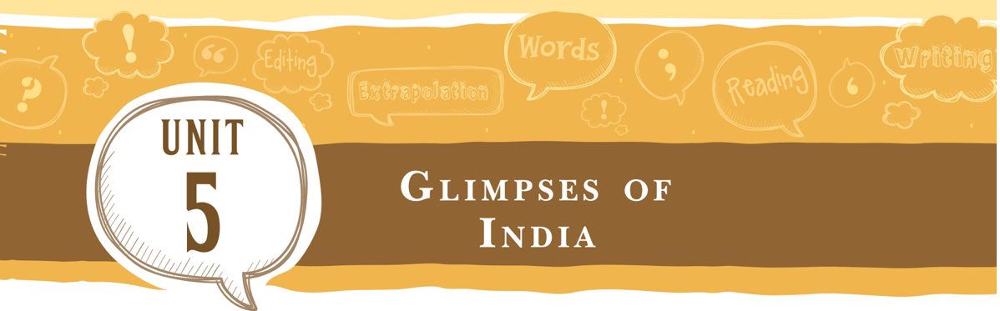
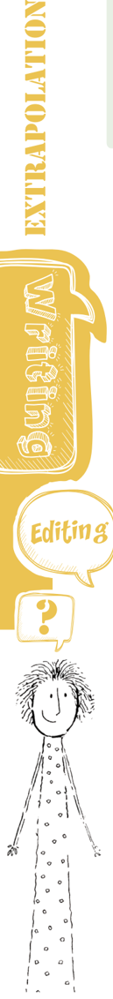
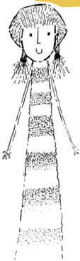
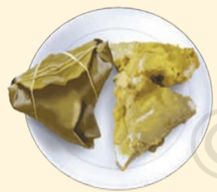
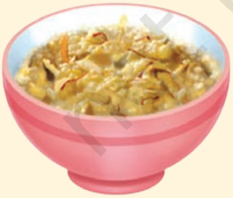
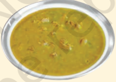
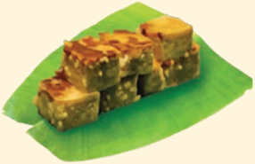
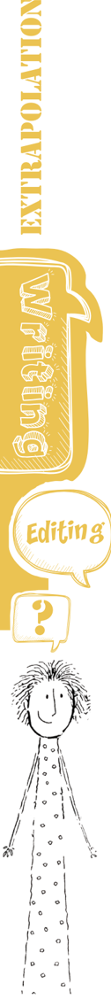
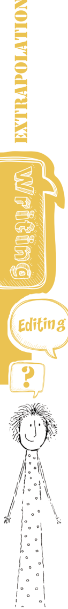
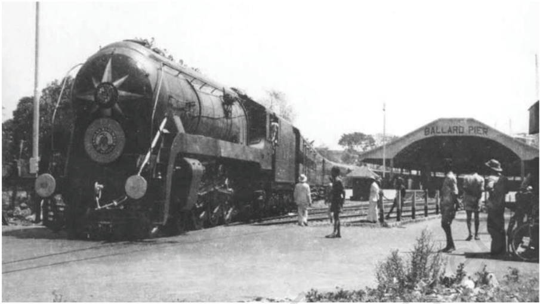

# PAGE 1

## Let's Begin

In the 'Glimpses of India' ( First Flight , Class X textbook, NCERT) you have read about interesting people and places. India is a place of diversity in terms of culture, language, food, traditions, etc. There are many stories unknown to us about the way of life of people. Work in groups of four and find out about the following in any five Indian states.

-  Their regional cuisine
-  Dance form and music
-  Art form
-  Any other information

Mark these five places on a map and represent the information highlighting the interesting facts.

## Reading CompRehension text i

The following is an excerpt about the Parsi community in India and their food.

Read the passage and answer the questions.

' Aavoji , aavo , aavo !  Welcome  to  Delhi!  Let  me  show  you  my beautiful  city.'  The  booming  voice  of  Nowrosji  Kapadia  could be heard across the length and breadth of the platform. It was Nowrosji's  favourite  pastime:  a  walk  to  the  Old  Delhi  railway station to greet the Frontier Mail as it chugged into Delhi from Mumbai to Peshawar. With this refrain, an eager Nowrosji would cajole Parsi visitors off the train and take them home for a meal and often persuade some to stay overnight or for a few days. He

# PAGE 2

Look Up and Understand cajole dainty extensive overruled vouch

E

would use this opportunity to tell them about the advantages of shifting to Delhi. Though his wife Jer Bai would occasionally object to unknown visitors, she was always overruled. This was the beginning of the community of Parsis in Delhi....

...Writing about Parsis in the Delhi of old is not easy. There are memories of my grandparents and parents  -  a collective memory of generations past and people long gone, yet here in spirit....

During  festive  gatherings,  the  women  went  to  town  with  the food; outside catering was unheard of. The poorer members of the community never knew who had paid for what. This tradition continued  in  the  northern  cities  of  Lucknow,  Kanpur,  and Allahabad well into the '70s. Sadly, that kind of life has almost gone forever.

Food preparations began two days in advance. Dar ni pori (rich pastry stuffed with sweetened lentils) and malido ( halwa )  were carried in big vatus (pots) and served with puris . Anyone who has made malido can vouch for the fact that you need strong biceps; it is an exhausting exercise. The first time I made it under my grandmother's supervision was also the last. I could hardly move my arms for the next two days! Since then, I gained a healthy respect for my dainty grandmother.

The menu was extensive. Breakfast would start with either sev -brown  vermicelli  cooked  in  milk  and  served  with  fresh cream-or ravo ,  semolina  pudding, Mithu  dahi or  sweetened curd made with full cream milk was an absolute must. This was followed  by bafellaeeda ,  hard-boiled  eggs,  and kheemo  kaleji , mutton mince with liver.  For  lunch,  there  was  almost  always smori dal  chawal and macchi no patio - white boiled rice with yellow dal offset by a tart and tangy fish curry.

Teatime was special at our home. My grandmother made it a point to dress for tea; I was made to do the same. Once we were ready, out came the treats: Parsi biscuits  batasa , nankhatai and flaky khari ; patrel , rolled, steamed arbi leaves stuffed with besan masala ; kumas ,  rich Parsi cake; and my favourite, bhakra , sweet deep fried doughnuts. That tradition has stayed with me. I certainly don't dress up, but I still need a snack with at least three cups of tea!...

(Source: 'Down Memory Lane with the Parsis of New Delhi' by Shernaz Italia, The Wire )

# PAGE 3

Sentences

## Q.1. Infer the meaning of the following expressions

- (a)  Nowrosji would cajole Parsi visitors off the train.

\_\_\_\_\_\_\_\_\_\_\_\_\_\_\_\_\_\_\_\_\_\_\_\_\_\_\_\_\_\_\_\_\_\_\_\_\_\_\_\_\_\_\_\_\_\_\_\_\_

\_\_\_\_\_\_\_\_\_\_\_\_\_\_\_\_\_\_\_\_\_\_\_\_\_\_\_\_\_\_\_\_\_\_\_\_\_\_\_\_\_\_\_\_\_\_\_\_\_

\_\_\_\_\_\_\_\_\_\_\_\_\_\_\_\_\_\_\_\_\_\_\_\_\_\_\_\_\_\_\_\_\_\_\_\_\_\_\_\_\_\_\_\_\_\_\_\_\_

- (b)  Jer  Bai  would  occasionally  object  to  unknown visitors, she was always overruled.

\_\_\_\_\_\_\_\_\_\_\_\_\_\_\_\_\_\_\_\_\_\_\_\_\_\_\_\_\_\_\_\_\_\_\_\_\_\_\_\_\_\_\_\_\_\_\_\_\_

\_\_\_\_\_\_\_\_\_\_\_\_\_\_\_\_\_\_\_\_\_\_\_\_\_\_\_\_\_\_\_\_\_\_\_\_\_\_\_\_\_\_\_\_\_\_\_\_\_

- (c)  ...outside catering was unheard of.

\_\_\_\_\_\_\_\_\_\_\_\_\_\_\_\_\_\_\_\_\_\_\_\_\_\_\_\_\_\_\_\_\_\_\_\_\_\_\_\_\_\_\_\_\_\_\_\_\_

\_\_\_\_\_\_\_\_\_\_\_\_\_\_\_\_\_\_\_\_\_\_\_\_\_\_\_\_\_\_\_\_\_\_\_\_\_\_\_\_\_\_\_\_\_\_\_\_\_

- (d)    I gained a healthy respect for my dainty grandmother.

\_\_\_\_\_\_\_\_\_\_\_\_\_\_\_\_\_\_\_\_\_\_\_\_\_\_\_\_\_\_\_\_\_\_\_\_\_\_\_\_\_\_\_\_\_\_\_\_\_

\_\_\_\_\_\_\_\_\_\_\_\_\_\_\_\_\_\_\_\_\_\_\_\_\_\_\_\_\_\_\_\_\_\_\_\_\_\_\_\_\_\_\_\_\_\_\_\_\_

## Q.2. Answer the following questions.

- (a)  ' Aavoji , aavo , aavo ! Welcome to Delhi! Let me show you my beautiful city.' Who said this and why?

\_\_\_\_\_\_\_\_\_\_\_\_\_\_\_\_\_\_\_\_\_\_\_\_\_\_\_\_\_\_\_\_\_\_\_\_\_\_\_\_\_\_\_\_\_\_\_\_\_

\_\_\_\_\_\_\_\_\_\_\_\_\_\_\_\_\_\_\_\_\_\_\_\_\_\_\_\_\_\_\_\_\_\_\_\_\_\_\_\_\_\_\_\_\_\_\_\_\_

\_\_\_\_\_\_\_\_\_\_\_\_\_\_\_\_\_\_\_\_\_\_\_\_\_\_\_\_\_\_\_\_\_\_\_\_\_\_\_\_\_\_\_\_\_\_\_\_\_

- (b)  Why were Jer Bai's arguments always overruled?

\_\_\_\_\_\_\_\_\_\_\_\_\_\_\_\_\_\_\_\_\_\_\_\_\_\_\_\_\_\_\_\_\_\_\_\_\_\_\_\_\_\_\_\_\_\_\_\_\_

\_\_\_\_\_\_\_\_\_\_\_\_\_\_\_\_\_\_\_\_\_\_\_\_\_\_\_\_\_\_\_\_\_\_\_\_\_\_\_\_\_\_\_\_\_\_\_\_\_

\_\_\_\_\_\_\_\_\_\_\_\_\_\_\_\_\_\_\_\_\_\_\_\_\_\_\_\_\_\_\_\_\_\_\_\_\_\_\_\_\_\_\_\_\_\_\_\_\_

- (c)  Why do you think outside catering was unheard of?

\_\_\_\_\_\_\_\_\_\_\_\_\_\_\_\_\_\_\_\_\_\_\_\_\_\_\_\_\_\_\_\_\_\_\_\_\_\_\_\_\_\_\_\_\_\_\_\_\_

\_\_\_\_\_\_\_\_\_\_\_\_\_\_\_\_\_\_\_\_\_\_\_\_\_\_\_\_\_\_\_\_\_\_\_\_\_\_\_\_\_\_\_\_\_\_\_\_\_

\_\_\_\_\_\_\_\_\_\_\_\_\_\_\_\_\_\_\_\_\_\_\_\_\_\_\_\_\_\_\_\_\_\_\_\_\_\_\_\_\_\_\_\_\_\_\_\_\_

- (d)  According to the writer what 'kind of life has almost gone forever'?

\_\_\_\_\_\_\_\_\_\_\_\_\_\_\_\_\_\_\_\_\_\_\_\_\_\_\_\_\_\_\_\_\_\_\_\_\_\_\_\_\_\_\_\_\_\_\_\_\_

\_\_\_\_\_\_\_\_\_\_\_\_\_\_\_\_\_\_\_\_\_\_\_\_\_\_\_\_\_\_\_\_\_\_\_\_\_\_\_\_\_\_\_\_\_\_\_\_\_

# PAGE 4

\_\_\_\_\_\_\_\_\_\_\_\_\_\_\_\_\_\_\_\_\_\_\_\_\_\_\_\_\_\_\_\_\_\_\_\_\_\_\_\_\_\_\_\_\_\_\_\_\_

- (e)  What has made the writer more respectful to her grandmother?

\_\_\_\_\_\_\_\_\_\_\_\_\_\_\_\_\_\_\_\_\_\_\_\_\_\_\_\_\_\_\_\_\_\_\_\_\_\_\_\_\_\_\_\_\_\_\_\_\_

\_\_\_\_\_\_\_\_\_\_\_\_\_\_\_\_\_\_\_\_\_\_\_\_\_\_\_\_\_\_\_\_\_\_\_\_\_\_\_\_\_\_\_\_\_\_\_\_\_

\_\_\_\_\_\_\_\_\_\_\_\_\_\_\_\_\_\_\_\_\_\_\_\_\_\_\_\_\_\_\_\_\_\_\_\_\_\_\_\_\_\_\_\_\_\_\_\_\_

- (f)  What was special about the tea time in the writer's home?

\_\_\_\_\_\_\_\_\_\_\_\_\_\_\_\_\_\_\_\_\_\_\_\_\_\_\_\_\_\_\_\_\_\_\_\_\_\_\_\_\_\_\_\_\_\_\_\_\_

\_\_\_\_\_\_\_\_\_\_\_\_\_\_\_\_\_\_\_\_\_\_\_\_\_\_\_\_\_\_\_\_\_\_\_\_\_\_\_\_\_\_\_\_\_\_\_\_\_

\_\_\_\_\_\_\_\_\_\_\_\_\_\_\_\_\_\_\_\_\_\_\_\_\_\_\_\_\_\_\_\_\_\_\_\_\_\_\_\_\_\_\_\_\_\_\_\_\_

\_\_\_\_\_\_\_\_\_\_\_\_\_\_\_\_\_\_\_\_\_\_\_\_\_\_\_\_\_\_\_\_\_\_\_\_\_\_\_\_\_\_\_\_\_\_\_\_\_

## Q.3. Tick the correct answer.

What is 'an exhausting exercise'?

- (a)  Preparing for the festival. (     )

- (b)  Travelling from Mumbai to Peshawar. (     )

- (c)  Writing about Parsis in old Delhi. (     )

- (d)  Cooking malido , the Parsi style halwa . (     )

Patara ni Machhi

Ravo

Dhansak

Parsi Malido

Lagan Nu Custard

Dar ni pori

- Q.4. Make a list of Parsi delicacies as mentioned in the passage. A few are given above. You can add more to the list. Find the words for Mithu dahi in your language.

\_\_\_\_\_\_\_\_\_\_\_\_\_\_\_\_\_\_\_\_\_\_\_\_\_\_\_\_\_\_\_\_\_\_\_\_\_\_\_\_\_\_\_\_\_\_\_\_\_\_\_\_\_\_\_\_\_\_\_\_\_\_\_\_\_\_\_\_\_\_\_\_\_\_\_

\_\_\_\_\_\_\_\_\_\_\_\_\_\_\_\_\_\_\_\_\_\_\_\_\_\_\_\_\_\_\_\_\_\_\_\_\_\_\_\_\_\_\_\_\_\_\_\_\_\_\_\_\_\_\_\_\_\_\_\_\_\_\_\_\_\_\_\_\_\_\_\_\_\_\_

\_\_\_\_\_\_\_\_\_\_\_\_\_\_\_\_\_\_\_\_\_\_\_\_\_\_\_\_\_\_\_\_\_\_\_\_\_\_\_\_\_\_\_\_\_\_\_\_\_\_\_\_\_\_\_\_\_\_\_\_\_\_\_\_\_\_\_\_\_\_\_\_\_\_\_

\_\_\_\_\_\_\_\_\_\_\_\_\_\_\_\_\_\_\_\_\_\_\_\_\_\_\_\_\_\_\_\_\_\_\_\_\_\_\_\_\_\_\_\_\_\_\_\_\_\_\_\_\_\_\_\_\_\_\_\_\_\_\_\_\_\_\_\_\_\_\_\_\_\_\_

\_\_\_\_\_\_\_\_\_\_\_\_\_\_\_\_\_\_\_\_\_\_\_\_\_\_\_\_\_\_\_\_\_\_\_\_\_\_\_\_\_\_\_\_\_\_\_\_\_\_\_\_\_\_\_\_\_\_\_\_\_\_\_\_\_\_\_\_\_\_\_\_\_\_\_

\_\_\_\_\_\_\_\_\_\_\_\_\_\_\_\_\_\_\_\_\_\_\_\_\_\_\_\_\_\_\_\_\_\_\_\_\_\_\_\_\_\_\_\_\_\_\_\_\_\_\_\_\_\_\_\_\_\_\_\_\_\_\_\_\_\_\_\_\_\_\_\_\_\_\_

\_\_\_\_\_\_\_\_\_\_\_\_\_\_\_\_\_\_\_\_\_\_\_\_\_\_\_\_\_\_\_\_\_\_\_\_\_\_\_\_\_\_\_\_\_\_\_\_\_\_\_\_\_\_\_\_\_\_\_\_\_\_\_\_\_\_\_\_\_\_\_\_\_\_\_

# PAGE 5

## text ii

You have read about Coorg, its rainforests, and coffee and tea from Assam in 'Glimpses of India' ( First Flight , Class X textbook, NCERT). The following extract is about the cultivation of coffee in  Araku valley in Andhra Pradesh. The story of Araku Valley traverses an unusual trajectory through Adivasi empowerment, hot-air balloons and some of the best coffee in the world.

Read the passage given below and answer the questions.

Located at about 1,200m above sea level, the valley, tucked away in the north-eastern corner of Andhra Pradesh, shares a border with Odisha. For guests and participants at the Araku Balloon Festival (ABF), held between 18-20 January every year, this is sightseeing like nothing else.

The drive to far-flung coffee estates takes us through the five northern  mandals  of  Anantha  giri,  Dumbriguda,  Hukumpeta, Munchingi  Puttu  and  Araku  valley.  The  name  Araku  for  the coffee was chosen simply because it sounded poetic. The view from the ground level is as impressive as the one from above the landscape changes from densely forested hills to sweeping valleys and terrace farms surrounding occasional village clusters. The journey of Araku Coffee from a livelihood initiative by the Naandi Foundation to a globally appreciated product has been in the making for over a decade. It is also intrinsically tied to the history of how coffee arrived in this valley. It was a British civil servant, N.S. Brodie, who introduced coffee to these hill tracts in 1898.

Look Up and Understand bio-dynamic entrepreneurs intrinsically mandals terroirs (ter'wa:) trajectory traverses tucked

# PAGE 6

E

Today, Araku coffee is a brand that works with 517 villages and 10,986 farmers, all of whom are estate owners and entrepreneurs with a stake in the business. The reason the coffee is of such high quality is that it follows the best practices of bio-dynamic farming by creating an interconnected and symbiotic ecosystem. The soil is  enriched  through  composting  and  a  variety  of  shade  trees are planted, including cash-yielding fruit trees like mango and jackfruit. Terroirs are assessed and careful standard operating procedures are put in place from 'sapling to savouring', which ensures healthier plants and sweeter cherries and eventually a far superior coffee aroma and flavour.

(Source: 'What's Brewing in Araku Valley?' by Diya Kohli, livemint , 23 February, 2019)

## Q.1. Infer the meaning of the following:

- (a)  traverses an unusual trajectory

\_\_\_\_\_\_\_\_\_\_\_\_\_\_\_\_\_\_\_\_\_\_\_\_\_\_\_\_\_\_\_\_\_\_\_\_\_\_\_\_\_\_\_\_\_\_\_\_\_

\_\_\_\_\_\_\_\_\_\_\_\_\_\_\_\_\_\_\_\_\_\_\_\_\_\_\_\_\_\_\_\_\_\_\_\_\_\_\_\_\_\_\_\_\_\_\_\_\_

- (b)  The drive to far-flung coffee estates

\_\_\_\_\_\_\_\_\_\_\_\_\_\_\_\_\_\_\_\_\_\_\_\_\_\_\_\_\_\_\_\_\_\_\_\_\_\_\_\_\_\_\_\_\_\_\_\_\_

\_\_\_\_\_\_\_\_\_\_\_\_\_\_\_\_\_\_\_\_\_\_\_\_\_\_\_\_\_\_\_\_\_\_\_\_\_\_\_\_\_\_\_\_\_\_\_\_\_

- (c)  densely forested hills

\_\_\_\_\_\_\_\_\_\_\_\_\_\_\_\_\_\_\_\_\_\_\_\_\_\_\_\_\_\_\_\_\_\_\_\_\_\_\_\_\_\_\_\_\_\_\_\_\_

\_\_\_\_\_\_\_\_\_\_\_\_\_\_\_\_\_\_\_\_\_\_\_\_\_\_\_\_\_\_\_\_\_\_\_\_\_\_\_\_\_\_\_\_\_\_\_\_\_

- (d)  village clusters

\_\_\_\_\_\_\_\_\_\_\_\_\_\_\_\_\_\_\_\_\_\_\_\_\_\_\_\_\_\_\_\_\_\_\_\_\_\_\_\_\_\_\_\_\_\_\_\_\_

\_\_\_\_\_\_\_\_\_\_\_\_\_\_\_\_\_\_\_\_\_\_\_\_\_\_\_\_\_\_\_\_\_\_\_\_\_\_\_\_\_\_\_\_\_\_\_\_\_

## Q.2. Find words from the text which mean the following:

- (a)  in a place that is hidden (paragraph one)

\_\_\_\_\_\_\_\_\_\_\_\_

- (b)  distant or remote

(paragraph two)

\_\_\_\_\_\_\_\_\_\_\_\_

- (c)  to  improve  the  quality  or  flavour  of  something (paragraph four) \_\_\_\_\_\_\_\_\_\_\_\_

- (d)  a smell specially a pleasant one (paragraph four)

\_\_\_\_\_\_\_\_\_\_\_\_

WORDS AND E XPR SSIONS 2 ă &amp; LASS X 62

## Q.3. Answer the following questions.

- (a)  What is unique about the Araku valley as stated in paragraph one?

\_\_\_\_\_\_\_\_\_\_\_\_\_\_\_\_\_\_\_\_\_\_\_\_\_\_\_\_\_\_\_\_\_\_\_\_\_\_\_\_\_\_\_\_\_\_\_\_\_

\_\_\_\_\_\_\_\_\_\_\_\_\_\_\_\_\_\_\_\_\_\_\_\_\_\_\_\_\_\_\_\_\_\_\_\_\_\_\_\_\_\_\_\_\_\_\_\_\_

\_\_\_\_\_\_\_\_\_\_\_\_\_\_\_\_\_\_\_\_\_\_\_\_\_\_\_\_\_\_\_\_\_\_\_\_\_\_\_\_\_\_\_\_\_\_\_\_\_

- (b)  Where is Araku valley?

\_\_\_\_\_\_\_\_\_\_\_\_\_\_\_\_\_\_\_\_\_\_\_\_\_\_\_\_\_\_\_\_\_\_\_\_\_\_\_\_\_\_\_\_\_\_\_\_\_

\_\_\_\_\_\_\_\_\_\_\_\_\_\_\_\_\_\_\_\_\_\_\_\_\_\_\_\_\_\_\_\_\_\_\_\_\_\_\_\_\_\_\_\_\_\_\_\_\_

\_\_\_\_\_\_\_\_\_\_\_\_\_\_\_\_\_\_\_\_\_\_\_\_\_\_\_\_\_\_\_\_\_\_\_\_\_\_\_\_\_\_\_\_\_\_\_\_\_

- (c)  Underline and write below the sentences, words, and expressions which indicate that Araku coffee has  moved  ahead  of  being  the  only  means  of livelihood.

\_\_\_\_\_\_\_\_\_\_\_\_\_\_\_\_\_\_\_\_\_\_\_\_\_\_\_\_\_\_\_\_\_\_\_\_\_\_\_\_\_\_\_\_\_\_\_\_\_

\_\_\_\_\_\_\_\_\_\_\_\_\_\_\_\_\_\_\_\_\_\_\_\_\_\_\_\_\_\_\_\_\_\_\_\_\_\_\_\_\_\_\_\_\_\_\_\_\_

\_\_\_\_\_\_\_\_\_\_\_\_\_\_\_\_\_\_\_\_\_\_\_\_\_\_\_\_\_\_\_\_\_\_\_\_\_\_\_\_\_\_\_\_\_\_\_\_\_

\_\_\_\_\_\_\_\_\_\_\_\_\_\_\_\_\_\_\_\_\_\_\_\_\_\_\_\_\_\_\_\_\_\_\_\_\_\_\_\_\_\_\_\_\_\_\_\_\_

- (d)  State a historical fact about the coffee in the valley?

\_\_\_\_\_\_\_\_\_\_\_\_\_\_\_\_\_\_\_\_\_\_\_\_\_\_\_\_\_\_\_\_\_\_\_\_\_\_\_\_\_\_\_\_\_\_\_\_\_

\_\_\_\_\_\_\_\_\_\_\_\_\_\_\_\_\_\_\_\_\_\_\_\_\_\_\_\_\_\_\_\_\_\_\_\_\_\_\_\_\_\_\_\_\_\_\_\_\_

- (e)  There are specific terms being used in the passage for  the  cultivation  of  coffee  for  example,  terrace farms,  biodynamic  farming,  etc.  Find  more  such terms and their meanings.

\_\_\_\_\_\_\_\_\_\_\_\_\_\_\_\_\_\_\_\_\_\_\_\_\_\_\_\_\_\_\_\_\_\_\_\_\_\_\_\_\_\_\_\_\_\_\_\_\_

\_\_\_\_\_\_\_\_\_\_\_\_\_\_\_\_\_\_\_\_\_\_\_\_\_\_\_\_\_\_\_\_\_\_\_\_\_\_\_\_\_\_\_\_\_\_\_\_\_

\_\_\_\_\_\_\_\_\_\_\_\_\_\_\_\_\_\_\_\_\_\_\_\_\_\_\_\_\_\_\_\_\_\_\_\_\_\_\_\_\_\_\_\_\_\_\_\_\_

- Q.4. The expression 'sapling to savouring' in paragraph four means: (Tick the right answer)

- (a)  Coffee plants are taken care of from the stage of plantation till its beans are ready for an enjoyable cup of coffee. (     )

- (b)  Coffee saplings are very delicate hence a lot of care is being taken of them. (     )

# PAGE 7

# PAGE 8

E

- (c)  The growth of coffee plants is dependent on shady trees. (     )
- (d)  Coffee plant can give a cup of enjoyable coffee.  (     )

## VocabULary

1.  Match the sounds in Column A with the appropriate words from Column B.

## Example: rustling of leaves

The meanings of some words are given below which will help you to find out the words.

|     | A         | B            |
|-----|-----------|--------------|
| (a) | shuffling | of chains    |
| (b) | striking  | of leaves    |
| (c) | puffing   | of feet      |
| (d) | clanking  | of a match   |
| (e) | sighing   | of the door  |
| (f) | rustling  | of the wind  |
| (g) | banging   | of an engine |
| (h) | gurgling  | of hyenas    |
| (i) | howling   | of water     |

## Grammar

1.  You have read about -ing and -ed adjectives in the textbook, the First Flight , page number 97. Read it agan to understand how these adjectives are used. These are also the present participles  (-ing  forms)  and  past  participles  (-ed  forms) of  verbs  and  are  used  as  adjectives.  Read  the  following sentences to know this.
-  Rita gave me a welcoming cup of coffee..
-  Her performance in the test was pleasing .
-  She appeared delighted with the gift.
-  The bored students became restless.

WORDS AND E XPR SSIONS 2 ă &amp; LASS X 64

Now fill in the blanks of the sentences with past participle from one of the following words.

(infect, take, quote, use, watch, frighten, propose)

- (a)  People demonstrated against the changes  \_\_\_\_\_\_\_\_\_\_\_\_\_\_

- (b)  The loud cheer went up from the students  \_\_\_\_\_\_\_\_\_\_\_\_\_\_

- (c)  After  the  editor  read  the  article,  she  checked  all  the examples  \_\_\_\_\_\_\_\_\_\_\_\_\_\_.

- (d)  Rub the antiseptic cream in the  \_\_\_\_\_\_\_\_\_\_\_\_\_\_  area.

- (e)  My wallet was among the things  \_\_\_\_\_\_\_\_\_\_\_\_\_\_.

- (f)  Cyclone Fani was a  \_\_\_\_\_\_\_\_\_\_\_\_\_\_  experience.

2.  Rewrite  in  the  past  tense  the  following  excerpt  from  the 'Glimpses of India' ( First Flight , Class X textbook) and check your answers with a partner.

Birds, bees, and butterflies are there to give you company. Macaques, Malabar squirrels, langurs, and slender loris keep a watchful eye from the tree canopy. I do, however, prefer to step aside for wild elephants. The climb to the Brahmagiri hills  brings  you  into  a  panoramic  view  of  the  entire  misty landscape of Coorg. A walk across the rope bridge leads to the  sixty-four  acre  island  of  Nisargadhama.  Running  into Buddhist monks from India's largest Tibetan settlement, at nearby Bylakuppe, is a bonus. The monks, in red, ochre, and yellow robes are amongst the many surprises that wait to be discovered by visitors searching for the heart and soul of India, right here in Coorg.

\_\_\_\_\_\_\_\_\_\_\_\_\_\_\_\_\_\_\_\_\_\_\_\_\_\_\_\_\_\_\_\_\_\_\_\_\_\_\_\_\_\_\_\_\_\_\_\_\_\_\_\_\_\_\_\_\_\_\_\_\_\_\_\_\_\_\_\_\_\_\_\_

\_\_\_\_\_\_\_\_\_\_\_\_\_\_\_\_\_\_\_\_\_\_\_\_\_\_\_\_\_\_\_\_\_\_\_\_\_\_\_\_\_\_\_\_\_\_\_\_\_\_\_\_\_\_\_\_\_\_\_\_\_\_\_\_\_\_\_\_\_\_\_\_

\_\_\_\_\_\_\_\_\_\_\_\_\_\_\_\_\_\_\_\_\_\_\_\_\_\_\_\_\_\_\_\_\_\_\_\_\_\_\_\_\_\_\_\_\_\_\_\_\_\_\_\_\_\_\_\_\_\_\_\_\_\_\_\_\_\_\_\_\_\_\_\_

\_\_\_\_\_\_\_\_\_\_\_\_\_\_\_\_\_\_\_\_\_\_\_\_\_\_\_\_\_\_\_\_\_\_\_\_\_\_\_\_\_\_\_\_\_\_\_\_\_\_\_\_\_\_\_\_\_\_\_\_\_\_\_\_\_\_\_\_\_\_\_\_

\_\_\_\_\_\_\_\_\_\_\_\_\_\_\_\_\_\_\_\_\_\_\_\_\_\_\_\_\_\_\_\_\_\_\_\_\_\_\_\_\_\_\_\_\_\_\_\_\_\_\_\_\_\_\_\_\_\_\_\_\_\_\_\_\_\_\_\_\_\_\_\_

\_\_\_\_\_\_\_\_\_\_\_\_\_\_\_\_\_\_\_\_\_\_\_\_\_\_\_\_\_\_\_\_\_\_\_\_\_\_\_\_\_\_\_\_\_\_\_\_\_\_\_\_\_\_\_\_\_\_\_\_\_\_\_\_\_\_\_\_\_\_\_\_

\_\_\_\_\_\_\_\_\_\_\_\_\_\_\_\_\_\_\_\_\_\_\_\_\_\_\_\_\_\_\_\_\_\_\_\_\_\_\_\_\_\_\_\_\_\_\_\_\_\_\_\_\_\_\_\_\_\_\_\_\_\_\_\_\_\_\_\_\_\_\_\_

\_\_\_\_\_\_\_\_\_\_\_\_\_\_\_\_\_\_\_\_\_\_\_\_\_\_\_\_\_\_\_\_\_\_\_\_\_\_\_\_\_\_\_\_\_\_\_\_\_\_\_\_\_\_\_\_\_\_\_\_\_\_\_\_\_\_\_\_\_\_\_\_

\_\_\_\_\_\_\_\_\_\_\_\_\_\_\_\_\_\_\_\_\_\_\_\_\_\_\_\_\_\_\_\_\_\_\_\_\_\_\_\_\_\_\_\_\_\_\_\_\_\_\_\_\_\_\_\_\_\_\_\_\_\_\_\_\_\_\_\_\_\_\_\_

# PAGE 9

# PAGE 10

\_\_\_\_\_\_\_\_\_\_\_\_\_\_\_\_\_\_\_\_\_\_\_\_\_\_\_\_\_\_\_\_\_\_\_\_\_\_\_\_\_\_\_\_\_\_\_\_\_\_\_\_\_\_\_\_\_\_\_\_\_\_\_\_\_\_\_\_\_\_\_\_

\_\_\_\_\_\_\_\_\_\_\_\_\_\_\_\_\_\_\_\_\_\_\_\_\_\_\_\_\_\_\_\_\_\_\_\_\_\_\_\_\_\_\_\_\_\_\_\_\_\_\_\_\_\_\_\_\_\_\_\_\_\_\_\_\_\_\_\_\_\_\_\_

\_\_\_\_\_\_\_\_\_\_\_\_\_\_\_\_\_\_\_\_\_\_\_\_\_\_\_\_\_\_\_\_\_\_\_\_\_\_\_\_\_\_\_\_\_\_\_\_\_\_\_\_\_\_\_\_\_\_\_\_\_\_\_\_\_\_\_\_\_\_\_\_

\_\_\_\_\_\_\_\_\_\_\_\_\_\_\_\_\_\_\_\_\_\_\_\_\_\_\_\_\_\_\_\_\_\_\_\_\_\_\_\_\_\_\_\_\_\_\_\_\_\_\_\_\_\_\_\_\_\_\_\_\_\_\_\_\_\_\_\_\_\_\_\_

\_\_\_\_\_\_\_\_\_\_\_\_\_\_\_\_\_\_\_\_\_\_\_\_\_\_\_\_\_\_\_\_\_\_\_\_\_\_\_\_\_\_\_\_\_\_\_\_\_\_\_\_\_\_\_\_\_\_\_\_\_\_\_\_\_\_\_\_\_\_\_\_

## editinG

1.  Some words have been wrongly spelt in the paragraph given below. Correct the words and read the paragraph aloud.

## The Valley of Flowers

The journey to the Valley of Flowers begins about 16 km away from Joshimath, at Govindghat (1,770 m) on the RishikeshBadrinath heightway. The Valley of Flowers is covered with a rich varity of magnifiscent plants.

Over the past few years, thousand of visitors have 'discovered' this idyll amidst the mountain. However, they live like marks only by way of empty cans, waste-paper and cigarete butts. Trakking in the area has resulted in the trampling of these delikate  plants  by  humans  and  ponies.  As  a  result,  the government of India was compeled to ban all mountainering, trekking, expeditions and livestock grasing in the area, with effect  from  February  20,  1983.  This  is  to  privent  further damage to one of our nation's unique repositories of natural beauty.

E

# PAGE 11

Ask your classmate or teacher to read aloud the following passage  from  the  text  'Glimpses  of  India'  ( First  Flight, Class  X  textbook).  Listen  carefully,  and  note  down  the keywords, main ideas and interesting expressions in your notebook while listening.

During our childhood in Goa, the baker used to be our friend, companion and guide. He used to come at least twice a day. Once, when he set out in the morning on his selling round, and then again, when he returned after emptying his huge basket. The jingling thud of his bamboo woke us up from sleep and we ran to meet and greet him. Why was it so? Was it for the love of the loaf? Not at all. The loaves were bought by some Paskine or Bastine, the maid-servant of the house! What we longed for were those bread -bangles which we chose carefully. Sometimes it was sweet bread of a special kind.

The  baker  made  his  musical  entry  on  the  scene  with the  'jhang,  jhang -sound  of  his  specially  made  bamboo staff. One hand supported the basket on his head and the other banged the bamboo on the ground. He would greet the lady of the house with a 'Good morning' and then place his basket  on  the  vertical  bamboo.  We  kids  would  be  pushed aside with a mild rebuke and the loaves would be delivered to the servant. But we would not give up. We would climb a bench or the parapet and peep into the basket, somehow. I can still recall the typical fragrance of those loaves; loaves for the elders and the bangles for the children. Then we did not even care to brush our teeth or wash our mouths properly. And why should we? Who would take the trouble of plucking the mango leaf for the toothbrush? And why was it necessary at all? The tiger never brushed his teeth. Hot tea could wash and clean up everything so nicely, after all!

Now summarise the paragraph using your notes.

\_\_\_\_\_\_\_\_\_\_\_\_\_\_\_\_\_\_\_\_\_\_\_\_\_\_\_\_\_\_\_\_\_\_\_\_\_\_\_\_\_\_\_\_\_\_\_\_\_\_\_\_\_\_\_\_\_\_\_\_\_\_\_\_\_\_\_\_\_\_\_\_

\_\_\_\_\_\_\_\_\_\_\_\_\_\_\_\_\_\_\_\_\_\_\_\_\_\_\_\_\_\_\_\_\_\_\_\_\_\_\_\_\_\_\_\_\_\_\_\_\_\_\_\_\_\_\_\_\_\_\_\_\_\_\_\_\_\_\_\_\_\_\_\_

\_\_\_\_\_\_\_\_\_\_\_\_\_\_\_\_\_\_\_\_\_\_\_\_\_\_\_\_\_\_\_\_\_\_\_\_\_\_\_\_\_\_\_\_\_\_\_\_\_\_\_\_\_\_\_\_\_\_\_\_\_\_\_\_\_\_\_\_\_\_\_\_

\_\_\_\_\_\_\_\_\_\_\_\_\_\_\_\_\_\_\_\_\_\_\_\_\_\_\_\_\_\_\_\_\_\_\_\_\_\_\_\_\_\_\_\_\_\_\_\_\_\_\_\_\_\_\_\_\_\_\_\_\_\_\_\_\_\_\_\_\_\_\_\_

# PAGE 12

\_\_\_\_\_\_\_\_\_\_\_\_\_\_\_\_\_\_\_\_\_\_\_\_\_\_\_\_\_\_\_\_\_\_\_\_\_\_\_\_\_\_\_\_\_\_\_\_\_\_\_\_\_\_\_\_\_\_\_\_\_\_\_\_\_\_\_\_\_\_\_\_

\_\_\_\_\_\_\_\_\_\_\_\_\_\_\_\_\_\_\_\_\_\_\_\_\_\_\_\_\_\_\_\_\_\_\_\_\_\_\_\_\_\_\_\_\_\_\_\_\_\_\_\_\_\_\_\_\_\_\_\_\_\_\_\_\_\_\_\_\_\_\_\_

\_\_\_\_\_\_\_\_\_\_\_\_\_\_\_\_\_\_\_\_\_\_\_\_\_\_\_\_\_\_\_\_\_\_\_\_\_\_\_\_\_\_\_\_\_\_\_\_\_\_\_\_\_\_\_\_\_\_\_\_\_\_\_\_\_\_\_\_\_\_\_\_

\_\_\_\_\_\_\_\_\_\_\_\_\_\_\_\_\_\_\_\_\_\_\_\_\_\_\_\_\_\_\_\_\_\_\_\_\_\_\_\_\_\_\_\_\_\_\_\_\_\_\_\_\_\_\_\_\_\_\_\_\_\_\_\_\_\_\_\_\_\_\_\_

\_\_\_\_\_\_\_\_\_\_\_\_\_\_\_\_\_\_\_\_\_\_\_\_\_\_\_\_\_\_\_\_\_\_\_\_\_\_\_\_\_\_\_\_\_\_\_\_\_\_\_\_\_\_\_\_\_\_\_\_\_\_\_\_\_\_\_\_\_\_\_\_

\_\_\_\_\_\_\_\_\_\_\_\_\_\_\_\_\_\_\_\_\_\_\_\_\_\_\_\_\_\_\_\_\_\_\_\_\_\_\_\_\_\_\_\_\_\_\_\_\_\_\_\_\_\_\_\_\_\_\_\_\_\_\_\_\_\_\_\_\_\_\_\_

## speakinG

1.  Excursions  give  opportunities  to  explore  nature,  places  of historical  interest,  etc.  Tourists  are  interested  in  meeting  people, understanding their culture, and enjoying the variety in food. The Indian Railways have recently introduced glass Vistadome coach in train to provide a delightful travelling experience to the picturesque valley of Araku in Vishakhapatnam.

In groups of four, discuss and plan a budget trip to Araku valley. You may keep the following in mind while planning. Add more points to the following as per your requirement.

-  Find out the location (look up the map) and accessibility to the places to be visited.
-  Calculate the cost of the stay.
-  Search for an economic and safe accommodation, perhaps a home stay.
-  Find out the modes of transport and booking.

Now, prepare an itinerary of your excursion to Araku valley and share with the class.

2.  Try repeating some of these tongue twisters:
2. (a) Pre shrunk shirts
3. (b) Six slim slick slender saplings
4. (c) The sixth sheikh's sixth sheep's sick
5. (d) Tie twine to three twigs
6. (e) Double bubble gum bubbles double

E

# PAGE 13

## WritinG

1.  Infer the meaning of the following expressions in the passage on Parsi community. ' Aavoji , aavo , aavo ! Welcome to Delhi.'
-  length and breadth
-  chugged into
-  vouch for
-  long gone
-  out came the treats

Now,  write  an  account  of  a  travel  by  train  using  these expressions.

Describe the journey by giving details of distance, booking of  tickets,  facilities  available,  and  suggestions  for improvement. You can add pictures of places, people, etc.

\_\_\_\_\_\_\_\_\_\_\_\_\_\_\_\_\_\_\_\_\_\_\_\_\_\_\_\_\_\_\_\_\_\_\_\_\_\_\_\_\_\_\_\_\_\_\_\_\_\_\_\_\_\_\_\_\_\_\_\_\_\_\_\_\_\_\_\_\_\_\_\_

\_\_\_\_\_\_\_\_\_\_\_\_\_\_\_\_\_\_\_\_\_\_\_\_\_\_\_\_\_\_\_\_\_\_\_\_\_\_\_\_\_\_\_\_\_\_\_\_\_\_\_\_\_\_\_\_\_\_\_\_\_\_\_\_\_\_\_\_\_\_\_\_

\_\_\_\_\_\_\_\_\_\_\_\_\_\_\_\_\_\_\_\_\_\_\_\_\_\_\_\_\_\_\_\_\_\_\_\_\_\_\_\_\_\_\_\_\_\_\_\_\_\_\_\_\_\_\_\_\_\_\_\_\_\_\_\_\_\_\_\_\_\_\_\_

\_\_\_\_\_\_\_\_\_\_\_\_\_\_\_\_\_\_\_\_\_\_\_\_\_\_\_\_\_\_\_\_\_\_\_\_\_\_\_\_\_\_\_\_\_\_\_\_\_\_\_\_\_\_\_\_\_\_\_\_\_\_\_\_\_\_\_\_\_\_\_\_

\_\_\_\_\_\_\_\_\_\_\_\_\_\_\_\_\_\_\_\_\_\_\_\_\_\_\_\_\_\_\_\_\_\_\_\_\_\_\_\_\_\_\_\_\_\_\_\_\_\_\_\_\_\_\_\_\_\_\_\_\_\_\_\_\_\_\_\_\_\_\_\_

\_\_\_\_\_\_\_\_\_\_\_\_\_\_\_\_\_\_\_\_\_\_\_\_\_\_\_\_\_\_\_\_\_\_\_\_\_\_\_\_\_\_\_\_\_\_\_\_\_\_\_\_\_\_\_\_\_\_\_\_\_\_\_\_\_\_\_\_\_\_\_\_

\_\_\_\_\_\_\_\_\_\_\_\_\_\_\_\_\_\_\_\_\_\_\_\_\_\_\_\_\_\_\_\_\_\_\_\_\_\_\_\_\_\_\_\_\_\_\_\_\_\_\_\_\_\_\_\_\_\_\_\_\_\_\_\_\_\_\_\_\_\_\_\_

\_\_\_\_\_\_\_\_\_\_\_\_\_\_\_\_\_\_\_\_\_\_\_\_\_\_\_\_\_\_\_\_\_\_\_\_\_\_\_\_\_\_\_\_\_\_\_\_\_\_\_\_\_\_\_\_\_\_\_\_\_\_\_\_\_\_\_\_\_\_\_\_

\_\_\_\_\_\_\_\_\_\_\_\_\_\_\_\_\_\_\_\_\_\_\_\_\_\_\_\_\_\_\_\_\_\_\_\_\_\_\_\_\_\_\_\_\_\_\_\_\_\_\_\_\_\_\_\_\_\_\_\_\_\_\_\_\_\_\_\_\_\_\_\_

\_\_\_\_\_\_\_\_\_\_\_\_\_\_\_\_\_\_\_\_\_\_\_\_\_\_\_\_\_\_\_\_\_\_\_\_\_\_\_\_\_\_\_\_\_\_\_\_\_\_\_\_\_\_\_\_\_\_\_\_\_\_\_\_\_\_\_\_\_\_\_\_

\_\_\_\_\_\_\_\_\_\_\_\_\_\_\_\_\_\_\_\_\_\_\_\_\_\_\_\_\_\_\_\_\_\_\_\_\_\_\_\_\_\_\_\_\_\_\_\_\_\_\_\_\_\_\_\_\_\_\_\_\_\_\_\_\_\_\_\_\_\_\_\_

\_\_\_\_\_\_\_\_\_\_\_\_\_\_\_\_\_\_\_\_\_\_\_\_\_\_\_\_\_\_\_\_\_\_\_\_\_\_\_\_\_\_\_\_\_\_\_\_\_\_\_\_\_\_\_\_\_\_\_\_\_\_\_\_\_\_\_\_\_\_\_\_

\_\_\_\_\_\_\_\_\_\_\_\_\_\_\_\_\_\_\_\_\_\_\_\_\_\_\_\_\_\_\_\_\_\_\_\_\_\_\_\_\_\_\_\_\_\_\_\_\_\_\_\_\_\_\_\_\_\_\_\_\_\_\_\_\_\_\_\_\_\_\_\_

\_\_\_\_\_\_\_\_\_\_\_\_\_\_\_\_\_\_\_\_\_\_\_\_\_\_\_\_\_\_\_\_\_\_\_\_\_\_\_\_\_\_\_\_\_\_\_\_\_\_\_\_\_\_\_\_\_\_\_\_\_\_\_\_\_\_\_\_\_\_\_\_

\_\_\_\_\_\_\_\_\_\_\_\_\_\_\_\_\_\_\_\_\_\_\_\_\_\_\_\_\_\_\_\_\_\_\_\_\_\_\_\_\_\_\_\_\_\_\_\_\_\_\_\_\_\_\_\_\_\_\_\_\_\_\_\_\_\_\_\_\_\_\_\_

# PAGE 14

## 2.  Write an advertisement for your favourite tea or coffee.

\_\_\_\_\_\_\_\_\_\_\_\_\_\_\_\_\_\_\_\_\_\_\_\_\_\_\_\_\_\_\_\_\_\_\_\_\_\_\_\_\_\_\_\_\_\_\_\_\_\_\_\_\_\_\_\_\_\_\_\_\_\_\_\_\_\_\_\_\_\_\_\_

\_\_\_\_\_\_\_\_\_\_\_\_\_\_\_\_\_\_\_\_\_\_\_\_\_\_\_\_\_\_\_\_\_\_\_\_\_\_\_\_\_\_\_\_\_\_\_\_\_\_\_\_\_\_\_\_\_\_\_\_\_\_\_\_\_\_\_\_\_\_\_\_

\_\_\_\_\_\_\_\_\_\_\_\_\_\_\_\_\_\_\_\_\_\_\_\_\_\_\_\_\_\_\_\_\_\_\_\_\_\_\_\_\_\_\_\_\_\_\_\_\_\_\_\_\_\_\_\_\_\_\_\_\_\_\_\_\_\_\_\_\_\_\_\_

\_\_\_\_\_\_\_\_\_\_\_\_\_\_\_\_\_\_\_\_\_\_\_\_\_\_\_\_\_\_\_\_\_\_\_\_\_\_\_\_\_\_\_\_\_\_\_\_\_\_\_\_\_\_\_\_\_\_\_\_\_\_\_\_\_\_\_\_\_\_\_\_

\_\_\_\_\_\_\_\_\_\_\_\_\_\_\_\_\_\_\_\_\_\_\_\_\_\_\_\_\_\_\_\_\_\_\_\_\_\_\_\_\_\_\_\_\_\_\_\_\_\_\_\_\_\_\_\_\_\_\_\_\_\_\_\_\_\_\_\_\_\_\_\_

\_\_\_\_\_\_\_\_\_\_\_\_\_\_\_\_\_\_\_\_\_\_\_\_\_\_\_\_\_\_\_\_\_\_\_\_\_\_\_\_\_\_\_\_\_\_\_\_\_\_\_\_\_\_\_\_\_\_\_\_\_\_\_\_\_\_\_\_\_\_\_\_

\_\_\_\_\_\_\_\_\_\_\_\_\_\_\_\_\_\_\_\_\_\_\_\_\_\_\_\_\_\_\_\_\_\_\_\_\_\_\_\_\_\_\_\_\_\_\_\_\_\_\_\_\_\_\_\_\_\_\_\_\_\_\_\_\_\_\_\_\_\_\_\_

\_\_\_\_\_\_\_\_\_\_\_\_\_\_\_\_\_\_\_\_\_\_\_\_\_\_\_\_\_\_\_\_\_\_\_\_\_\_\_\_\_\_\_\_\_\_\_\_\_\_\_\_\_\_\_\_\_\_\_\_\_\_\_\_\_\_\_\_\_\_\_\_

## 3.  You have read about breads and bakers in Goa. ( First Flight , Class X).

## Refuse as veRb and noun

The dump was so full that the workers had to refuse more refuse.

E

Traditional breads are famous in Kashmir as well. It is said that a Kashmiri's day starts with a cup of piping hot nun chai (salty pink tea) and a crisp, freshly baked bread from the Kandur (the traditional baker). In Kashmir, the Kandur shop isn't just a place where one goes to buy the morning and evening breads, it is a social hub. It is a place where you get to hear and participate in discussions that range from gossip to political discourses. The Kandur shop or Kandur waan as  it  is  called  in  Kashmiri  has  variety  of  breads  for different occasions that are baked in the Kandur's oven.

## Read about some of the Kashmiri breads:

Tsot-Girda

:  is a medium sized round everyday bread that is a must on every breakfast table in Kashmir.

Lavasa

:  is a puffy level bread made from maida .

Tsochwor

or

Tilvor :  is a bagel shaped, slightly hard bread with a sprinkling of sesame seeds on top. The baker prepares ' tsochwor '  at  noon  time  to  be enjoyed with the afternoon tea.

Kulcha

:  These are crispy palm-sized breads sprinkled with poppy seeds. These are - mith (sweet) and namkeen  (savoury).  The  bread  is  taken  with some traditional Dodh Kehva (milk Kehva ).

Sheermal

:  is  another  type  of  bread  from  Kashmir.  It  is mildly sweet.

Roath

:  The  sweet  bread  with  a  cake  like  texture  is baked in traditional tandoor and is topped with

WORDS AND E XPR SSIONS GLYPH&lt;c=21,font=/IKEYZN+BodoniMT&gt; ă &amp; LASS X

# PAGE 15

dry fruits. However, this one bread is made for grand occasions like weddings, child birth or engagements and served with Kehva .

-  Now,  collect  information  about  breads, parathas , rotis in different parts of the country.
-  You  can  talk  to  peers,  teachers,  parents,  grandparents, community members and make use of internet.
-  Make an interesting collage using pictures and write a few sentences about each bread based on the information you have gathered.

\_\_\_\_\_\_\_\_\_\_\_\_\_\_\_\_\_\_\_\_\_\_\_\_\_\_\_\_\_\_\_\_\_\_\_\_\_\_\_\_\_\_\_\_\_\_\_\_\_\_\_\_\_\_\_\_\_\_\_\_\_\_\_\_\_\_\_\_\_\_\_\_

\_\_\_\_\_\_\_\_\_\_\_\_\_\_\_\_\_\_\_\_\_\_\_\_\_\_\_\_\_\_\_\_\_\_\_\_\_\_\_\_\_\_\_\_\_\_\_\_\_\_\_\_\_\_\_\_\_\_\_\_\_\_\_\_\_\_\_\_\_\_\_\_

\_\_\_\_\_\_\_\_\_\_\_\_\_\_\_\_\_\_\_\_\_\_\_\_\_\_\_\_\_\_\_\_\_\_\_\_\_\_\_\_\_\_\_\_\_\_\_\_\_\_\_\_\_\_\_\_\_\_\_\_\_\_\_\_\_\_\_\_\_\_\_\_

\_\_\_\_\_\_\_\_\_\_\_\_\_\_\_\_\_\_\_\_\_\_\_\_\_\_\_\_\_\_\_\_\_\_\_\_\_\_\_\_\_\_\_\_\_\_\_\_\_\_\_\_\_\_\_\_\_\_\_\_\_\_\_\_\_\_\_\_\_\_\_\_

\_\_\_\_\_\_\_\_\_\_\_\_\_\_\_\_\_\_\_\_\_\_\_\_\_\_\_\_\_\_\_\_\_\_\_\_\_\_\_\_\_\_\_\_\_\_\_\_\_\_\_\_\_\_\_\_\_\_\_\_\_\_\_\_\_\_\_\_\_\_\_\_

\_\_\_\_\_\_\_\_\_\_\_\_\_\_\_\_\_\_\_\_\_\_\_\_\_\_\_\_\_\_\_\_\_\_\_\_\_\_\_\_\_\_\_\_\_\_\_\_\_\_\_\_\_\_\_\_\_\_\_\_\_\_\_\_\_\_\_\_\_\_\_\_

\_\_\_\_\_\_\_\_\_\_\_\_\_\_\_\_\_\_\_\_\_\_\_\_\_\_\_\_\_\_\_\_\_\_\_\_\_\_\_\_\_\_\_\_\_\_\_\_\_\_\_\_\_\_\_\_\_\_\_\_\_\_\_\_\_\_\_\_\_\_\_\_

\_\_\_\_\_\_\_\_\_\_\_\_\_\_\_\_\_\_\_\_\_\_\_\_\_\_\_\_\_\_\_\_\_\_\_\_\_\_\_\_\_\_\_\_\_\_\_\_\_\_\_\_\_\_\_\_\_\_\_\_\_\_\_\_\_\_\_\_\_\_\_\_

\_\_\_\_\_\_\_\_\_\_\_\_\_\_\_\_\_\_\_\_\_\_\_\_\_\_\_\_\_\_\_\_\_\_\_\_\_\_\_\_\_\_\_\_\_\_\_\_\_\_\_\_\_\_\_\_\_\_\_\_\_\_\_\_\_\_\_\_\_\_\_\_

\_\_\_\_\_\_\_\_\_\_\_\_\_\_\_\_\_\_\_\_\_\_\_\_\_\_\_\_\_\_\_\_\_\_\_\_\_\_\_\_\_\_\_\_\_\_\_\_\_\_\_\_\_\_\_\_\_\_\_\_\_\_\_\_\_\_\_\_\_\_\_\_

\_\_\_\_\_\_\_\_\_\_\_\_\_\_\_\_\_\_\_\_\_\_\_\_\_\_\_\_\_\_\_\_\_\_\_\_\_\_\_\_\_\_\_\_\_\_\_\_\_\_\_\_\_\_\_\_\_\_\_\_\_\_\_\_\_\_\_\_\_\_\_\_

\_\_\_\_\_\_\_\_\_\_\_\_\_\_\_\_\_\_\_\_\_\_\_\_\_\_\_\_\_\_\_\_\_\_\_\_\_\_\_\_\_\_\_\_\_\_\_\_\_\_\_\_\_\_\_\_\_\_\_\_\_\_\_\_\_\_\_\_\_\_\_\_

\_\_\_\_\_\_\_\_\_\_\_\_\_\_\_\_\_\_\_\_\_\_\_\_\_\_\_\_\_\_\_\_\_\_\_\_\_\_\_\_\_\_\_\_\_\_\_\_\_\_\_\_\_\_\_\_\_\_\_\_\_\_\_\_\_\_\_\_\_\_\_\_

\_\_\_\_\_\_\_\_\_\_\_\_\_\_\_\_\_\_\_\_\_\_\_\_\_\_\_\_\_\_\_\_\_\_\_\_\_\_\_\_\_\_\_\_\_\_\_\_\_\_\_\_\_\_\_\_\_\_\_\_\_\_\_\_\_\_\_\_\_\_\_\_

\_\_\_\_\_\_\_\_\_\_\_\_\_\_\_\_\_\_\_\_\_\_\_\_\_\_\_\_\_\_\_\_\_\_\_\_\_\_\_\_\_\_\_\_\_\_\_\_\_\_\_\_\_\_\_\_\_\_\_\_\_\_\_\_\_\_\_\_\_\_\_\_

## project

1.  The Frontier mail, the train mentioned in the passage on the Parsi  community  was  the  prestigious  and  luxurious  train which was flagged off in 1928 from Bombay to Peshawar. It was the fastest train known for its punctuality. It covered the distance of 2,335 kms in record time of seventy two hours.

# PAGE 16

(Source: From the collection of pictures by Shri Mukul Jain, Western Railways, Indian Railway's website)

The train used to depart from Ballard Pier Mall Station at Bombay harbour for passengers arriving from England by ship and for the collection of mail brought in from steamers from Europe. It was fashionable to travel by Frontier Mail in those days!

- Our  railways  have  undergone  magical  transformation since independence from electrification to high speed etc. Find more about Indian Railways and prepare a write up. You can add experiences of rail travel of the people.
- Collect the pictures and information about vintage, royal and luxury trains in India.

E