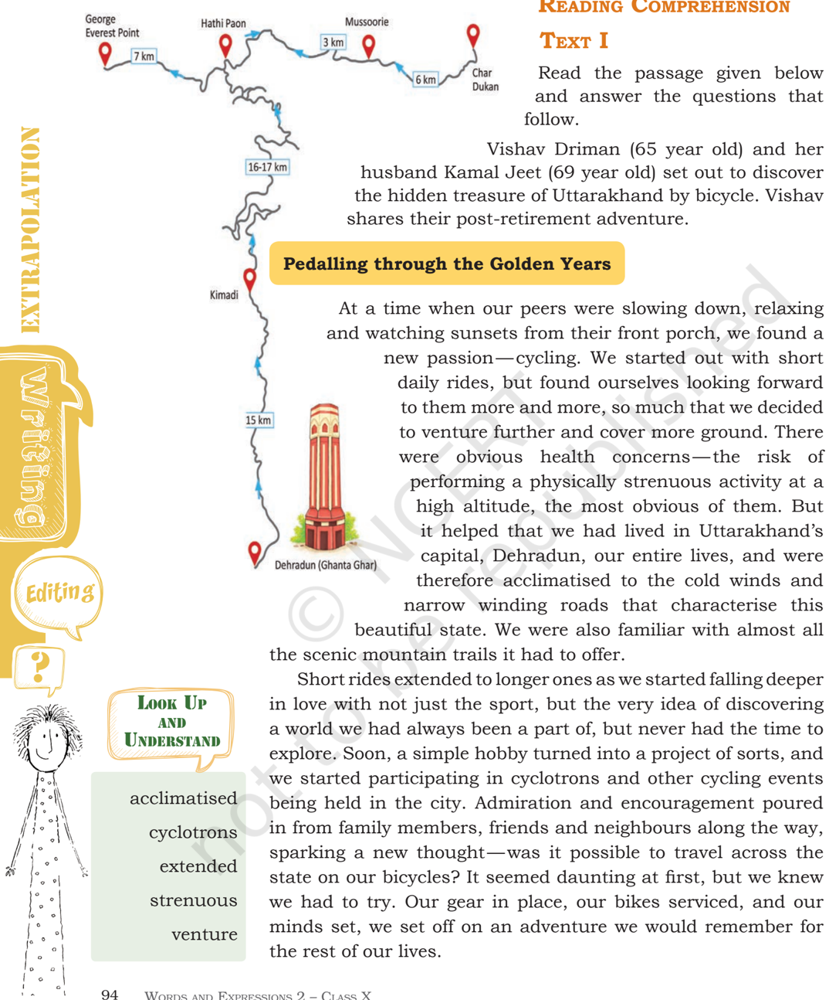
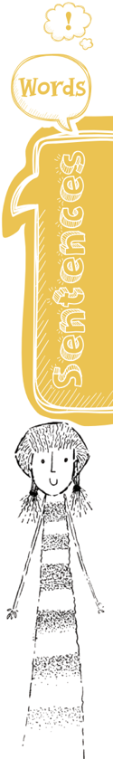
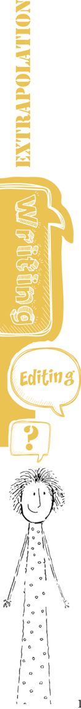
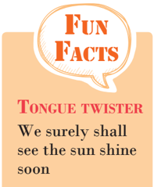
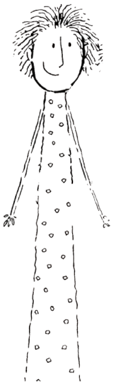
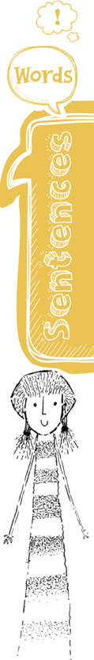
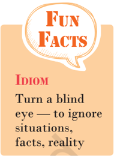
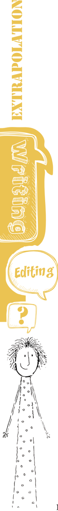

# PAGE 1

?

Unit 7

## Let's Begin

1. In the story 'Madam Rides the Bus', Valli took a bus ride on the bus that she wanted to for last several months. She knew that  she  had  to  buy  tickets  for  this.  So  she  saved  money suppressing all temptation to buy things like peppermints, toys, balloons, etc., and paid for the ticket.
-  What all exciting things did she see from the bus?
-  Was the excitement the same on her return journey?

Discuss with your classmate and write a paragraph based on your discussion on the above mentioned questions.

\_\_\_\_\_\_\_\_\_\_\_\_\_\_\_\_\_\_\_\_\_\_\_\_\_\_\_\_\_\_\_\_\_\_\_\_\_\_\_\_\_\_\_\_\_\_\_\_\_\_\_\_\_\_\_\_\_\_\_\_\_\_\_\_\_\_\_\_\_\_\_\_\_\_\_

\_\_\_\_\_\_\_\_\_\_\_\_\_\_\_\_\_\_\_\_\_\_\_\_\_\_\_\_\_\_\_\_\_\_\_\_\_\_\_\_\_\_\_\_\_\_\_\_\_\_\_\_\_\_\_\_\_\_\_\_\_\_\_\_\_\_\_\_\_\_\_\_\_\_\_

\_\_\_\_\_\_\_\_\_\_\_\_\_\_\_\_\_\_\_\_\_\_\_\_\_\_\_\_\_\_\_\_\_\_\_\_\_\_\_\_\_\_\_\_\_\_\_\_\_\_\_\_\_\_\_\_\_\_\_\_\_\_\_\_\_\_\_\_\_\_\_\_\_\_\_

\_\_\_\_\_\_\_\_\_\_\_\_\_\_\_\_\_\_\_\_\_\_\_\_\_\_\_\_\_\_\_\_\_\_\_\_\_\_\_\_\_\_\_\_\_\_\_\_\_\_\_\_\_\_\_\_\_\_\_\_\_\_\_\_\_\_\_\_\_\_\_\_\_\_\_

\_\_\_\_\_\_\_\_\_\_\_\_\_\_\_\_\_\_\_\_\_\_\_\_\_\_\_\_\_\_\_\_\_\_\_\_\_\_\_\_\_\_\_\_\_\_\_\_\_\_\_\_\_\_\_\_\_\_\_\_\_\_\_\_\_\_\_\_\_\_\_\_\_\_\_

\_\_\_\_\_\_\_\_\_\_\_\_\_\_\_\_\_\_\_\_\_\_\_\_\_\_\_\_\_\_\_\_\_\_\_\_\_\_\_\_\_\_\_\_\_\_\_\_\_\_\_\_\_\_\_\_\_\_\_\_\_\_\_\_\_\_\_\_\_\_\_\_\_\_\_

\_\_\_\_\_\_\_\_\_\_\_\_\_\_\_\_\_\_\_\_\_\_\_\_\_\_\_\_\_\_\_\_\_\_\_\_\_\_\_\_\_\_\_\_\_\_\_\_\_\_\_\_\_\_\_\_\_\_\_\_\_\_\_\_\_\_\_\_\_\_\_\_\_\_\_

\_\_\_\_\_\_\_\_\_\_\_\_\_\_\_\_\_\_\_\_\_\_\_\_\_\_\_\_\_\_\_\_\_\_\_\_\_\_\_\_\_\_\_\_\_\_\_\_\_\_\_\_\_\_\_\_\_\_\_\_\_\_\_\_\_\_\_\_\_\_\_\_\_\_\_

\_\_\_\_\_\_\_\_\_\_\_\_\_\_\_\_\_\_\_\_\_\_\_\_\_\_\_\_\_\_\_\_\_\_\_\_\_\_\_\_\_\_\_\_\_\_\_\_\_\_\_\_\_\_\_\_\_\_\_\_\_\_\_\_\_\_\_\_\_\_\_\_\_\_\_

\_\_\_\_\_\_\_\_\_\_\_\_\_\_\_\_\_\_\_\_\_\_\_\_\_\_\_\_\_\_\_\_\_\_\_\_\_\_\_\_\_\_\_\_\_\_\_\_\_\_\_\_\_\_\_\_\_\_\_\_\_\_\_\_\_\_\_\_\_\_\_\_\_\_\_

2. Have  you  undertaken  any  journey  by  bicycle,  boat,  bus, train, or on an elephant back? Share your experience with your friends in the class.

;

## MadaM rides the Bus

# PAGE 2

W

ORDS

AND

EXPR E SSIONS

LASS

GLYPH&lt;c=21,font=/PWIKIZ+BookmanOldStyle&gt;	ă	C

X

# PAGE 3

In my opinion, there are very few ways to enjoy and appreciate the beauty of Uttarakhand and cycling is the most thrilling of them all. Sunlight	filtering	through	the	trees	and	a	cool breeze gently caressing your faces as you ride, coupled with breathtaking views of sal forests spread  like  a  green  cover  on  the  mountains and  surrounding  valleys,  the  experience  of pedalling across the state is truly inexplicable. Of the many trails we navigated, there is one that occupies a special place in our hearts. It began  from Ghanta  Ghar ,  a  popular  tourist attraction  in  Dehradun,  it  took  us  through

some  of  the  most  picturesque  locations  of  the  state  such  as Kimadi, Hathi Paon, Mussoorie and Chaar Dukaan, right up to George Everest point. This 100km ride (approximately) is also one of the few routes in Uttarakhand that encapsulates all the element that one expects while cycling here  -  steep slopes, sharp curves, endless hills, lush forests, and off-road experiences.

(Source: by Vishav Driman, India Travel360 )

- Q.1. What is the meaning of the expression 'when our peers  were  slowing  down,  relaxing  and  watching sunsets from their front porch' and in what context has the author used this?

\_\_\_\_\_\_\_\_\_\_\_\_\_\_\_\_\_\_\_\_\_\_\_\_\_\_\_\_\_\_\_\_\_\_\_\_\_\_\_\_\_\_\_\_\_\_\_\_\_\_\_\_\_

\_\_\_\_\_\_\_\_\_\_\_\_\_\_\_\_\_\_\_\_\_\_\_\_\_\_\_\_\_\_\_\_\_\_\_\_\_\_\_\_\_\_\_\_\_\_\_\_\_\_\_\_\_

\_\_\_\_\_\_\_\_\_\_\_\_\_\_\_\_\_\_\_\_\_\_\_\_\_\_\_\_\_\_\_\_\_\_\_\_\_\_\_\_\_\_\_\_\_\_\_\_\_\_\_\_\_

- Q.2. What	made	Vishav	and	her	husband	confident	to venture into Uttarakhand on their bicycles?

\_\_\_\_\_\_\_\_\_\_\_\_\_\_\_\_\_\_\_\_\_\_\_\_\_\_\_\_\_\_\_\_\_\_\_\_\_\_\_\_\_\_\_\_\_\_\_\_\_\_\_\_\_

\_\_\_\_\_\_\_\_\_\_\_\_\_\_\_\_\_\_\_\_\_\_\_\_\_\_\_\_\_\_\_\_\_\_\_\_\_\_\_\_\_\_\_\_\_\_\_\_\_\_\_\_\_

\_\_\_\_\_\_\_\_\_\_\_\_\_\_\_\_\_\_\_\_\_\_\_\_\_\_\_\_\_\_\_\_\_\_\_\_\_\_\_\_\_\_\_\_\_\_\_\_\_\_\_\_\_

- Q.3. What  was  the  strong  passion  that  prompted  the retired couple to take up this adventurous journey?

Look Up and Understand caressing daunting encapsulates inexplicable picturesque

# PAGE 4

Look Up and Understand heedful poised slackens treadles vale

\_\_\_\_\_\_\_\_\_\_\_\_\_\_\_\_\_\_\_\_\_\_\_\_\_\_\_\_\_\_\_\_\_\_\_\_\_\_\_\_\_\_\_\_\_\_\_\_\_\_\_\_\_

\_\_\_\_\_\_\_\_\_\_\_\_\_\_\_\_\_\_\_\_\_\_\_\_\_\_\_\_\_\_\_\_\_\_\_\_\_\_\_\_\_\_\_\_\_\_\_\_\_\_\_\_\_

\_\_\_\_\_\_\_\_\_\_\_\_\_\_\_\_\_\_\_\_\_\_\_\_\_\_\_\_\_\_\_\_\_\_\_\_\_\_\_\_\_\_\_\_\_\_\_\_\_\_\_\_\_

- Q.4. What, according to the author, is the most thrilling way to enjoy and appreciate Uttarakhand? Why does she say so?

\_\_\_\_\_\_\_\_\_\_\_\_\_\_\_\_\_\_\_\_\_\_\_\_\_\_\_\_\_\_\_\_\_\_\_\_\_\_\_\_\_\_\_\_\_\_\_\_\_\_\_\_\_

\_\_\_\_\_\_\_\_\_\_\_\_\_\_\_\_\_\_\_\_\_\_\_\_\_\_\_\_\_\_\_\_\_\_\_\_\_\_\_\_\_\_\_\_\_\_\_\_\_\_\_\_\_

\_\_\_\_\_\_\_\_\_\_\_\_\_\_\_\_\_\_\_\_\_\_\_\_\_\_\_\_\_\_\_\_\_\_\_\_\_\_\_\_\_\_\_\_\_\_\_\_\_\_\_\_\_

- Q.5. Which trail occupies a special place in the couple's heart?

\_\_\_\_\_\_\_\_\_\_\_\_\_\_\_\_\_\_\_\_\_\_\_\_\_\_\_\_\_\_\_\_\_\_\_\_\_\_\_\_\_\_\_\_\_\_\_\_\_\_\_\_\_

\_\_\_\_\_\_\_\_\_\_\_\_\_\_\_\_\_\_\_\_\_\_\_\_\_\_\_\_\_\_\_\_\_\_\_\_\_\_\_\_\_\_\_\_\_\_\_\_\_\_\_\_\_

\_\_\_\_\_\_\_\_\_\_\_\_\_\_\_\_\_\_\_\_\_\_\_\_\_\_\_\_\_\_\_\_\_\_\_\_\_\_\_\_\_\_\_\_\_\_\_\_\_\_\_\_\_

- Q.6. What are the expectations  of  a  cyclist  from  such an  adventurous  trip  through  the  mountains?  Did Vishav and Kamal Jeet get these experiences from the 100 km ride?

\_\_\_\_\_\_\_\_\_\_\_\_\_\_\_\_\_\_\_\_\_\_\_\_\_\_\_\_\_\_\_\_\_\_\_\_\_\_\_\_\_\_\_\_\_\_\_\_\_\_\_\_\_

\_\_\_\_\_\_\_\_\_\_\_\_\_\_\_\_\_\_\_\_\_\_\_\_\_\_\_\_\_\_\_\_\_\_\_\_\_\_\_\_\_\_\_\_\_\_\_\_\_\_\_\_\_

\_\_\_\_\_\_\_\_\_\_\_\_\_\_\_\_\_\_\_\_\_\_\_\_\_\_\_\_\_\_\_\_\_\_\_\_\_\_\_\_\_\_\_\_\_\_\_\_\_\_\_\_\_

## text ii

Read the poem given below and answer the questions that follow.

## Going Down Hill on a Bicycle , A Boy's Song

With lifted feet, hands still, I am poised, and down the hill Dart, with heedful mind; The air goes by in a wind. Swifter and yet more swift, Till the heart with a mighty lift

# PAGE 5

Makes the lungs laugh, the throat cry:'O	bird,	see;	see,	bird,	I	fly.

'Is this, is this your joy? O bird, then I, though a boy, For a golden moment share Your feathery life in air!'

Say, heart, is there aught like this In a world that is full of bliss? 'Tis more than skating, bound Steel-shod to the level ground.

Speed	slackens	now,	I	float Awhile in my airy boat; Till, when the wheels scarce crawl, My feet to the treadles fall.

Alas, that the longest hill Must end in a vale; but still, Who climbs with toil, wheresoe'er, Shall	find	wings	waiting	there.

Henry Charles Beeching

- Q.1. The  poem  describes  the  \_\_\_\_\_\_\_\_\_\_\_\_\_\_\_\_\_\_\_\_\_\_\_\_  of going downhill on a bicycle.
- (a)  enjoyment
- (b)  happiness
- (c)  excitement
- (d)  satisfaction
- Q.2. Which line(s) depict the freedom like that of a bird that the poet enjoys?

\_\_\_\_\_\_\_\_\_\_\_\_\_\_\_\_\_\_\_\_\_\_\_\_\_\_\_\_\_\_\_\_\_\_\_\_\_\_\_\_\_\_\_\_\_\_\_\_\_\_\_\_\_

\_\_\_\_\_\_\_\_\_\_\_\_\_\_\_\_\_\_\_\_\_\_\_\_\_\_\_\_\_\_\_\_\_\_\_\_\_\_\_\_\_\_\_\_\_\_\_\_\_\_\_\_\_

\_\_\_\_\_\_\_\_\_\_\_\_\_\_\_\_\_\_\_\_\_\_\_\_\_\_\_\_\_\_\_\_\_\_\_\_\_\_\_\_\_\_\_\_\_\_\_\_\_\_\_\_\_

# PAGE 6

- Q.3. Which is the experience the boy is sharing with the bird? What is the golden moment he is referring to?

\_\_\_\_\_\_\_\_\_\_\_\_\_\_\_\_\_\_\_\_\_\_\_\_\_\_\_\_\_\_\_\_\_\_\_\_\_\_\_\_\_\_\_\_\_\_\_\_\_\_\_\_\_

\_\_\_\_\_\_\_\_\_\_\_\_\_\_\_\_\_\_\_\_\_\_\_\_\_\_\_\_\_\_\_\_\_\_\_\_\_\_\_\_\_\_\_\_\_\_\_\_\_\_\_\_\_

\_\_\_\_\_\_\_\_\_\_\_\_\_\_\_\_\_\_\_\_\_\_\_\_\_\_\_\_\_\_\_\_\_\_\_\_\_\_\_\_\_\_\_\_\_\_\_\_\_\_\_\_\_

- Q.4. What is the meaning of 'full of bliss' here? Can the boy	find	this	kind	of	bliss	in	the	world	where	he lives?

\_\_\_\_\_\_\_\_\_\_\_\_\_\_\_\_\_\_\_\_\_\_\_\_\_\_\_\_\_\_\_\_\_\_\_\_\_\_\_\_\_\_\_\_\_\_\_\_\_\_\_\_\_

\_\_\_\_\_\_\_\_\_\_\_\_\_\_\_\_\_\_\_\_\_\_\_\_\_\_\_\_\_\_\_\_\_\_\_\_\_\_\_\_\_\_\_\_\_\_\_\_\_\_\_\_\_

\_\_\_\_\_\_\_\_\_\_\_\_\_\_\_\_\_\_\_\_\_\_\_\_\_\_\_\_\_\_\_\_\_\_\_\_\_\_\_\_\_\_\_\_\_\_\_\_\_\_\_\_\_

- Q.5. There  is  a  comparison  in  the  third  stanza.  What is it?

\_\_\_\_\_\_\_\_\_\_\_\_\_\_\_\_\_\_\_\_\_\_\_\_\_\_\_\_\_\_\_\_\_\_\_\_\_\_\_\_\_\_\_\_\_\_\_\_\_\_\_\_\_

\_\_\_\_\_\_\_\_\_\_\_\_\_\_\_\_\_\_\_\_\_\_\_\_\_\_\_\_\_\_\_\_\_\_\_\_\_\_\_\_\_\_\_\_\_\_\_\_\_\_\_\_\_

- Q.6. What  is  the  meaning  of  the  last  two  lines  of  the poem? Does 'toil' mean dedication, determination, and will power to climb the hill? What is the reward here?

\_\_\_\_\_\_\_\_\_\_\_\_\_\_\_\_\_\_\_\_\_\_\_\_\_\_\_\_\_\_\_\_\_\_\_\_\_\_\_\_\_\_\_\_\_\_\_\_\_\_\_\_\_

\_\_\_\_\_\_\_\_\_\_\_\_\_\_\_\_\_\_\_\_\_\_\_\_\_\_\_\_\_\_\_\_\_\_\_\_\_\_\_\_\_\_\_\_\_\_\_\_\_\_\_\_\_

## VocabULary

1.  Find out the words from the text 'Madam rides the Bus' that match with the given meanings.

- (a)  inquisitive

\_\_\_\_\_\_\_\_\_\_\_\_\_\_\_\_\_\_\_\_\_\_\_\_\_\_\_\_\_\_\_\_\_\_

- (b)  intricate

\_\_\_\_\_\_\_\_\_\_\_\_\_\_\_\_\_\_\_\_\_\_\_\_\_\_\_\_\_\_\_\_\_\_

- (c)  mesmerizing

\_\_\_\_\_\_\_\_\_\_\_\_\_\_\_\_\_\_\_\_\_\_\_\_\_\_\_\_\_\_\_\_\_\_

- (d)  immense

\_\_\_\_\_\_\_\_\_\_\_\_\_\_\_\_\_\_\_\_\_\_\_\_\_\_\_\_\_\_\_\_\_\_

- (e)  hardly

\_\_\_\_\_\_\_\_\_\_\_\_\_\_\_\_\_\_\_\_\_\_\_\_\_\_\_\_\_\_\_\_\_\_

# PAGE 7

## Grammar

1.  Read the two sentences given below. The groups of words in italics are phrasal verbs.

This way she picked up various small details.

Valli said, 'I am the one to get on .'

The  verbs picked and get are  combined  with up and on respectively. Together they make phrasal verbs.

Now, complete each sentence using a verb from box A and a word from box B (by making a phrasal verb). Use the correct form of the verb wherever necessary.

A

break,	drive,	get,	fill,	wake, turn

B

out, down, off, on, in, up

- (a) It was evening. She  \_\_\_\_\_\_\_\_\_\_\_\_\_\_\_\_\_\_\_\_\_\_\_\_\_\_  the light.
- (b)  Do not  \_\_\_\_\_\_\_\_\_\_\_\_\_\_\_\_\_\_\_\_\_\_  Ramesh. He was studying late at night yesterday.
- (c)  The  school  bus  \_\_\_\_\_\_\_\_\_\_\_\_\_\_\_\_\_\_\_\_\_\_  and  had  to  be towed to the garage for repair.
- (d)  They got in the car and  \_\_\_\_\_\_\_\_\_\_\_\_\_\_\_\_\_\_\_\_\_\_\_\_\_.
- (e)  She hurt herself as she was  \_\_\_\_\_\_\_\_\_\_\_\_\_\_\_\_\_\_\_\_\_\_\_\_  of the car.
- (f)  You have to  \_\_\_\_\_\_\_\_\_\_\_\_\_\_\_\_\_\_\_\_\_\_\_\_\_\_  the form yourself.

## editinG

1.  Use  capital  letters  and  full  stops  wherever  necessary  and correct the spelling errors as well, in the following paragraph.

An  exciting  boat  journey  gliding  crosswise  the  river  from Godkhali jetty will take to a place of incredible mystic beauty of Nature.

The sundarbans a unesco World Heritage Site is located at the South eastern tip of the 24 Paraganas district about 110 km

# PAGE 8

from Kolkata it got its name from one of the mangrov plants known as Sundari (Heritiera Minor) Sundrbans are a part of the world's largest delta, formed by the mighty rivers ganga, brahmaputra and meghna  it is one of the most attractive and alluring places remaining on earth, a truly undiscovered paradise the Sundarbans is the largest singl block of tidal, halophytic  mangrove  forests  in  the  world.  It  is  the  largest tiger reserv and National Park apart from being a unique largest mangrove eco-system of the  world,  the  sundarbns  has  the  world's  largest  deltaic mangroove forests and is also home to one of India's most iconic  wildlife  species  -  the  royal  bengal  Ttger.  The  Sundarbans also serves as a crusial protective barrier for the inhabitents in	and	around	Kolkata	against	the	floods	that	result	from	the cyclones which are a regular occurrence. The Sundarbans have	also	been	enlisted	amongst	the	finalists	in	the	New	7 Wonders of Nature.

## ListeninG

1. Following is a passage on Mizoram and its people. When one visits this place, one is enchanted by its natural beauty and the vibrant culture of the state. Listen to the passage carefully and answer the questions that follow. You can listen to the recorded story or ask your teacher, sibling or friend to read the story aloud.

## Mizoram

Once a tourist remarked, 'I visited the Eastern States this time  -  where the people talk in songs and they always dance.'

# PAGE 9

The eastern region of India is no doubt charmingly novel in many of its features. Mizoram, literally the land of Mizos is an expanse of blue-green hills. Mizoram is broken up lenghwise into	five	major	mountain	ranges	gradually	descending	from the south to the north. The hills are rugged and their heights uneven. The name of the state Mizoram is made of two words. 'Mi' means human beings, 'Zo' means a hill. So, a 'Mizo' is a human dweller of a hill; Mizoram means the land of the hilldwellers. Aizawl is the capital town of the State built in tiers along the hill.

The Mizos have three main festivals  -  Mim Kut, Chapchar Kut and Pawl Kut. These festivals are associated with their agricultural activities during which they enjoy life by singing and dancing. The  Mizos, blessed as they are with a beautiful environment and rich culture, are a vibrant and social people. They love to dance as much as they love to sing. They boast a number of folk and community dances handed down from one generation to the other through the ages. The dances are expressions of the gay, carefree spirit of the Mizos. It should be noted here that these dances are not intended for stage performance, rather they have been evolved for community involvement and participation.

English with a Purpose A Textbook for Class XII (Core Course) NCERT, 2003

1. The land of Mizo is a large open area of  \_\_\_\_\_\_\_\_\_\_\_\_\_\_\_\_\_. The hills are  \_\_\_\_\_\_\_\_\_\_\_\_\_\_\_\_  and  \_\_\_\_\_\_\_\_\_\_\_\_\_\_\_\_.

2.  The state referred here is made of two names  -

- (a)  'Mi' means \_\_\_\_\_\_\_\_\_\_\_\_\_\_\_\_\_\_\_\_\_\_\_\_\_\_\_\_\_.

- (b)  'Zo' means

\_\_\_\_\_\_\_\_\_\_\_\_\_\_\_\_\_\_\_\_\_\_\_\_\_\_\_\_\_.

- (c)  and Mizoram means  \_\_\_\_\_\_\_\_\_\_\_\_\_\_\_\_\_\_\_\_\_\_\_\_\_\_\_\_\_.

3.  Which activities are associated with Mizo festivals? How do Mizos enjoy these festivals?

\_\_\_\_\_\_\_\_\_\_\_\_\_\_\_\_\_\_\_\_\_\_\_\_\_\_\_\_\_\_\_\_\_\_\_\_\_\_\_\_\_\_\_\_\_\_\_\_\_\_\_\_

\_\_\_\_\_\_\_\_\_\_\_\_\_\_\_\_\_\_\_\_\_\_\_\_\_\_\_\_\_\_\_\_\_\_\_\_\_\_\_\_\_\_\_\_\_\_\_\_\_\_\_\_

\_\_\_\_\_\_\_\_\_\_\_\_\_\_\_\_\_\_\_\_\_\_\_\_\_\_\_\_\_\_\_\_\_\_\_\_\_\_\_\_\_\_\_\_\_\_\_\_\_\_\_\_

# PAGE 10

4.  What are the special features of a Mizo dance?

\_\_\_\_\_\_\_\_\_\_\_\_\_\_\_\_\_\_\_\_\_\_\_\_\_\_\_\_\_\_\_\_\_\_\_\_\_\_\_\_\_\_\_\_\_\_\_\_\_\_\_\_

\_\_\_\_\_\_\_\_\_\_\_\_\_\_\_\_\_\_\_\_\_\_\_\_\_\_\_\_\_\_\_\_\_\_\_\_\_\_\_\_\_\_\_\_\_\_\_\_\_\_\_\_

\_\_\_\_\_\_\_\_\_\_\_\_\_\_\_\_\_\_\_\_\_\_\_\_\_\_\_\_\_\_\_\_\_\_\_\_\_\_\_\_\_\_\_\_\_\_\_\_\_\_\_\_

5.  The following statements characterise Mizo people. Tick the one which is not true.

(a)  Mizos have a beautiful culture. (     )

(b)  They live in a beautiful natural environment. (     )

(c)  They are a protective people. (     )

(d)  They are a vibrant people. (     )

(e)  They love to dance and not so much to sing.  (     )

- (f)  They have a number of community and folk dances.

(     )

- (g)  The  community  involvement  and  participation  is always there. (     )

## speakinG

1.  Read  Part  II  of  the  story  'Madam  Rides  the  Bus'.  There are many conversations between Valli, the conductor, and some elderly people in the bus. Convert the conversations into  dialogues  between  the  characters.  Many  words  like commandingly, haughtily, loudly (shouted), smilingly, irritably, curtly etc. have been used in this part. These are the different ways in which the characters have spoken. These show the mood, emotion, and intention of the characters.

Now, write the dialogues and then in groups of three, enact it as a skit in the class.

It	was	a	fine	spring	afternoon.	The	bus	was	just	on	the	verge of leaving the village. Valli, a small eight year old girl, wanted to go on a bus ride.

Valli (loudly):  Stop the bus! Stop the bus!

Conductor (without looking up): Who is it? Hurry then!

Valli (loudly): It's me, I am the one who has to get on the bus.

Conductor (smilingly): Oh. really!  \_\_\_\_\_\_\_\_\_\_\_\_\_\_\_\_\_\_\_\_\_\_\_\_\_

Valli (commandingly): I have to  \_\_\_\_\_\_\_\_\_\_\_\_\_\_\_\_\_\_\_\_\_\_\_\_\_

Here is  \_\_\_\_\_\_\_\_\_\_\_\_\_\_\_\_\_\_\_\_\_\_\_\_\_\_\_\_\_\_\_\_\_\_\_\_\_\_\_\_\_\_\_\_\_\_\_\_.

(Conductor stretched out his hand to help her up.)

Valli (smartly): I can  \_\_\_\_\_\_\_\_\_\_\_\_\_\_\_\_\_\_\_\_\_\_\_\_\_\_\_\_\_\_\_\_\_\_\_\_\_

Conductor (jokingly): Oh, please  \_\_\_\_\_\_\_\_\_\_\_\_\_\_\_\_\_\_\_\_ \_\_\_\_\_\_

(The bus started to move forward with a roar. Valli stood up on the seat to see the outside world clearly.)

A voice (anxiously): Listen, child  \_\_\_\_\_\_\_\_\_\_\_\_\_\_\_\_\_\_\_\_\_\_\_\_\_

Valli (haughtily): There is nobody  \_\_\_\_\_\_\_\_\_\_\_\_\_\_\_\_\_\_\_\_\_\_\_\_

Conductor (smilingly): Oh, sir  \_\_\_\_\_\_\_\_\_\_\_\_\_\_\_\_\_\_\_\_\_\_\_\_\_\_\_ \_

Valli (angrily): I am   \_\_\_\_\_\_\_\_\_\_\_\_\_\_\_\_\_\_\_\_\_\_\_\_\_\_\_\_\_\_\_\_\_\_\_\_ \_\_

Conductor (mimicking her):  \_\_\_\_\_\_\_\_\_\_\_\_\_\_\_\_\_\_\_\_\_\_\_\_\_\_\_\_\_\_

Valli (steadfastly): Because I  \_\_\_\_\_\_\_\_\_\_\_\_\_\_\_\_\_\_\_\_\_\_\_\_\_\_\_ \_\_\_

A voice (with concern): If you  \_\_\_\_\_\_\_\_\_\_\_\_\_\_\_\_\_\_\_\_\_\_\_\_\_\_ \_\_\_

Valli (irritably): I'm not  \_\_\_\_\_\_\_\_\_\_\_\_\_\_\_\_\_\_\_\_\_\_\_\_\_\_\_\_\_\_\_\_\_\_\_

# PAGE 11

2.  Two  communicative  tasks  are  given  below.  Practice  with your partner.

## Communicative Task I

(Offering, accepting and refusing help)

## Role Play

Chaman :

Hello Prem. You look tired. Is there anything I can do to help you?

Prem :

Thank you very much. I think I can manage. I am preparing a chart on Children's Rights.

Chaman :

It's a lot of work. Let me help you.

Prem :

Thank you. But I've already collected all the necessary information.

Chaman :

I can help you in illustrating some of the rights.

Prem :

Oh, can you? That sounds wonderful.

Chaman :

Could you tell me the themes to be illustrated?

Prem :

Here you are. I'm really thankful to you.

Chaman :

What about children's duties?

# PAGE 12

- Prem : Oh, yes.  It's  a  good  suggestion.  I'll  list  their duties also.

Chaman : Thank you.

## Pair or Group Work

Write conversations like the one above imagining you are in the classroom. Use the clues given below.

-  Excuse me...
-  Yes?
-  I wonder if you could lend me our dictionary. I'm doing my class work.
-  I'm sorry. I'm using it right now. May be later.
-  That's okay. Thanks anyway.

Write similar conversations imagining you are in the following situations: in the kitchen; at the railway station; asking somebody to open the door; in a hospital; in the playground.

## Communicative Task II

(Asking for information, indirect questions and question tags)

## Role Play

- Vineet : Could you get me some warm clothes from the cupboard, please?
- Ashima  : Are you feeling cold?
- Vineet : It's cold today, isn't it?
- Ashima	 : Yes,	it	is.	I	shall	have	to	light	the	fire	soon.
- Vineet : Oh,	you	have	coal-fires,	do	you?
- Ashima  : Yes. We don't have a room heater. You have room heaters, don't you?
- Veneet : Yes.	We	do.	But	coal-fires	are	nice.	They	are	more comforting than a radiator, aren't they?
- Ashima  : Yes,  but  there  is  a  lot  more  work  than  just switching  on  a  heater.  We  keep  talking  about getting room heaters.
- Vineet : I	 suppose	coal-fires	aren't	very	convenient,	are they?
- Ashima  : They certainly aren't.

W ORDS AND EXPR E SSIONS GLYPH&lt;c=21,font=/PWIKIZ+BookmanOldStyle&gt;	ă	C LASS X 104

# PAGE 13

## Pair or Group work

Using  the  above  piece  as  a  model,  ask  for  information,  make requests	and	give	your	opinion	regarding	 -	 the	floods	in	Chennai, 'Cyberabad' (Hyderabad), a celebration in your school, a landslide during the Amarnath yatra, etc.

## WritinG

1.  In the text, seeing Valli travelling alone in the bus, some of the characters showed concerns.

An elderly woman asked, 'Are you alone, dear?'

The Conductor questioned, 'Won't your mother be looking for you?'

The old woman continued asking, 'Is it proper for such a young person to travel alone? Do you exactly know where you're going in town? What's the street? What's the house number?'

Do you think that the concerns of the elderly lady and the  conductor  are  apt  and  genuine?  Will  you  say  that  it is  applicable  to  young  boys  as  well?  Discuss  in  groups, make note and then arrange a debate competition. You can consider the following points for discussion or debate. Then write  a  paragraph  considering  these  issues  and  give  your opinion as well.

-  Girls and boys of Valli's age can travel alone in a bus or auto rickshaw, etc.
-  Freedom should be given to them to move around.
-  Safety of the young children is of utmost concern.
-  What type of education should be given to them?
-  This is a vulnerable age and children are innocent.

\_\_\_\_\_\_\_\_\_\_\_\_\_\_\_\_\_\_\_\_\_\_\_\_\_\_\_\_\_\_\_\_\_\_\_\_\_\_\_\_\_\_\_\_\_\_\_\_\_\_\_\_\_\_\_\_\_\_\_\_\_\_\_\_\_\_\_\_\_\_\_\_\_\_\_

\_\_\_\_\_\_\_\_\_\_\_\_\_\_\_\_\_\_\_\_\_\_\_\_\_\_\_\_\_\_\_\_\_\_\_\_\_\_\_\_\_\_\_\_\_\_\_\_\_\_\_\_\_\_\_\_\_\_\_\_\_\_\_\_\_\_\_\_\_\_\_\_\_\_\_

\_\_\_\_\_\_\_\_\_\_\_\_\_\_\_\_\_\_\_\_\_\_\_\_\_\_\_\_\_\_\_\_\_\_\_\_\_\_\_\_\_\_\_\_\_\_\_\_\_\_\_\_\_\_\_\_\_\_\_\_\_\_\_\_\_\_\_\_\_\_\_\_\_\_\_

\_\_\_\_\_\_\_\_\_\_\_\_\_\_\_\_\_\_\_\_\_\_\_\_\_\_\_\_\_\_\_\_\_\_\_\_\_\_\_\_\_\_\_\_\_\_\_\_\_\_\_\_\_\_\_\_\_\_\_\_\_\_\_\_\_\_\_\_\_\_\_\_\_\_\_

\_\_\_\_\_\_\_\_\_\_\_\_\_\_\_\_\_\_\_\_\_\_\_\_\_\_\_\_\_\_\_\_\_\_\_\_\_\_\_\_\_\_\_\_\_\_\_\_\_\_\_\_\_\_\_\_\_\_\_\_\_\_\_\_\_\_\_\_\_\_\_\_\_\_\_

# PAGE 14

\_\_\_\_\_\_\_\_\_\_\_\_\_\_\_\_\_\_\_\_\_\_\_\_\_\_\_\_\_\_\_\_\_\_\_\_\_\_\_\_\_\_\_\_\_\_\_\_\_\_\_\_\_\_\_\_\_\_\_\_\_\_\_\_\_\_\_\_\_\_\_\_

\_\_\_\_\_\_\_\_\_\_\_\_\_\_\_\_\_\_\_\_\_\_\_\_\_\_\_\_\_\_\_\_\_\_\_\_\_\_\_\_\_\_\_\_\_\_\_\_\_\_\_\_\_\_\_\_\_\_\_\_\_\_\_\_\_\_\_\_\_\_\_\_

\_\_\_\_\_\_\_\_\_\_\_\_\_\_\_\_\_\_\_\_\_\_\_\_\_\_\_\_\_\_\_\_\_\_\_\_\_\_\_\_\_\_\_\_\_\_\_\_\_\_\_\_\_\_\_\_\_\_\_\_\_\_\_\_\_\_\_\_\_\_\_\_

\_\_\_\_\_\_\_\_\_\_\_\_\_\_\_\_\_\_\_\_\_\_\_\_\_\_\_\_\_\_\_\_\_\_\_\_\_\_\_\_\_\_\_\_\_\_\_\_\_\_\_\_\_\_\_\_\_\_\_\_\_\_\_\_\_\_\_\_\_\_\_\_

\_\_\_\_\_\_\_\_\_\_\_\_\_\_\_\_\_\_\_\_\_\_\_\_\_\_\_\_\_\_\_\_\_\_\_\_\_\_\_\_\_\_\_\_\_\_\_\_\_\_\_\_\_\_\_\_\_\_\_\_\_\_\_\_\_\_\_\_\_\_\_\_

\_\_\_\_\_\_\_\_\_\_\_\_\_\_\_\_\_\_\_\_\_\_\_\_\_\_\_\_\_\_\_\_\_\_\_\_\_\_\_\_\_\_\_\_\_\_\_\_\_\_\_\_\_\_\_\_\_\_\_\_\_\_\_\_\_\_\_\_\_\_\_\_

\_\_\_\_\_\_\_\_\_\_\_\_\_\_\_\_\_\_\_\_\_\_\_\_\_\_\_\_\_\_\_\_\_\_\_\_\_\_\_\_\_\_\_\_\_\_\_\_\_\_\_\_\_\_\_\_\_\_\_\_\_\_\_\_\_\_\_\_\_\_\_\_

\_\_\_\_\_\_\_\_\_\_\_\_\_\_\_\_\_\_\_\_\_\_\_\_\_\_\_\_\_\_\_\_\_\_\_\_\_\_\_\_\_\_\_\_\_\_\_\_\_\_\_\_\_\_\_\_\_\_\_\_\_\_\_\_\_\_\_\_\_\_\_\_

\_\_\_\_\_\_\_\_\_\_\_\_\_\_\_\_\_\_\_\_\_\_\_\_\_\_\_\_\_\_\_\_\_\_\_\_\_\_\_\_\_\_\_\_\_\_\_\_\_\_\_\_\_\_\_\_\_\_\_\_\_\_\_\_\_\_\_\_\_\_\_\_

\_\_\_\_\_\_\_\_\_\_\_\_\_\_\_\_\_\_\_\_\_\_\_\_\_\_\_\_\_\_\_\_\_\_\_\_\_\_\_\_\_\_\_\_\_\_\_\_\_\_\_\_\_\_\_\_\_\_\_\_\_\_\_\_\_\_\_\_\_\_\_\_

2.  You  have  read  that  on  her  return  journey,  Valli  saw  the young cow lying dead by the roadside. This young cow was running  very  fast  in  front  of  the  bus  and  had  given  Valli unbound happiness when she was travelling to the town.

Now, write a paragraph on 'Should the domestic animals be let loose to walk on the roads freely' where the vehicles are plying? Who is responsible for the death of the young cow?

\_\_\_\_\_\_\_\_\_\_\_\_\_\_\_\_\_\_\_\_\_\_\_\_\_\_\_\_\_\_\_\_\_\_\_\_\_\_\_\_\_\_\_\_\_\_\_\_\_\_\_\_\_\_\_\_\_\_\_\_\_\_\_\_\_\_\_\_\_\_\_\_

\_\_\_\_\_\_\_\_\_\_\_\_\_\_\_\_\_\_\_\_\_\_\_\_\_\_\_\_\_\_\_\_\_\_\_\_\_\_\_\_\_\_\_\_\_\_\_\_\_\_\_\_\_\_\_\_\_\_\_\_\_\_\_\_\_\_\_\_\_\_\_\_

\_\_\_\_\_\_\_\_\_\_\_\_\_\_\_\_\_\_\_\_\_\_\_\_\_\_\_\_\_\_\_\_\_\_\_\_\_\_\_\_\_\_\_\_\_\_\_\_\_\_\_\_\_\_\_\_\_\_\_\_\_\_\_\_\_\_\_\_\_\_\_\_

\_\_\_\_\_\_\_\_\_\_\_\_\_\_\_\_\_\_\_\_\_\_\_\_\_\_\_\_\_\_\_\_\_\_\_\_\_\_\_\_\_\_\_\_\_\_\_\_\_\_\_\_\_\_\_\_\_\_\_\_\_\_\_\_\_\_\_\_\_\_\_\_

\_\_\_\_\_\_\_\_\_\_\_\_\_\_\_\_\_\_\_\_\_\_\_\_\_\_\_\_\_\_\_\_\_\_\_\_\_\_\_\_\_\_\_\_\_\_\_\_\_\_\_\_\_\_\_\_\_\_\_\_\_\_\_\_\_\_\_\_\_\_\_\_

\_\_\_\_\_\_\_\_\_\_\_\_\_\_\_\_\_\_\_\_\_\_\_\_\_\_\_\_\_\_\_\_\_\_\_\_\_\_\_\_\_\_\_\_\_\_\_\_\_\_\_\_\_\_\_\_\_\_\_\_\_\_\_\_\_\_\_\_\_\_\_\_

\_\_\_\_\_\_\_\_\_\_\_\_\_\_\_\_\_\_\_\_\_\_\_\_\_\_\_\_\_\_\_\_\_\_\_\_\_\_\_\_\_\_\_\_\_\_\_\_\_\_\_\_\_\_\_\_\_\_\_\_\_\_\_\_\_\_\_\_\_\_\_\_

\_\_\_\_\_\_\_\_\_\_\_\_\_\_\_\_\_\_\_\_\_\_\_\_\_\_\_\_\_\_\_\_\_\_\_\_\_\_\_\_\_\_\_\_\_\_\_\_\_\_\_\_\_\_\_\_\_\_\_\_\_\_\_\_\_\_\_\_\_\_\_\_

\_\_\_\_\_\_\_\_\_\_\_\_\_\_\_\_\_\_\_\_\_\_\_\_\_\_\_\_\_\_\_\_\_\_\_\_\_\_\_\_\_\_\_\_\_\_\_\_\_\_\_\_\_\_\_\_\_\_\_\_\_\_\_\_\_\_\_\_\_\_\_\_

\_\_\_\_\_\_\_\_\_\_\_\_\_\_\_\_\_\_\_\_\_\_\_\_\_\_\_\_\_\_\_\_\_\_\_\_\_\_\_\_\_\_\_\_\_\_\_\_\_\_\_\_\_\_\_\_\_\_\_\_\_\_\_\_\_\_\_\_\_\_\_\_

\_\_\_\_\_\_\_\_\_\_\_\_\_\_\_\_\_\_\_\_\_\_\_\_\_\_\_\_\_\_\_\_\_\_\_\_\_\_\_\_\_\_\_\_\_\_\_\_\_\_\_\_\_\_\_\_\_\_\_\_\_\_\_\_\_\_\_\_\_\_\_\_

\_\_\_\_\_\_\_\_\_\_\_\_\_\_\_\_\_\_\_\_\_\_\_\_\_\_\_\_\_\_\_\_\_\_\_\_\_\_\_\_\_\_\_\_\_\_\_\_\_\_\_\_\_\_\_\_\_\_\_\_\_\_\_\_\_\_\_\_\_\_\_\_

\_\_\_\_\_\_\_\_\_\_\_\_\_\_\_\_\_\_\_\_\_\_\_\_\_\_\_\_\_\_\_\_\_\_\_\_\_\_\_\_\_\_\_\_\_\_\_\_\_\_\_\_\_\_\_\_\_\_\_\_\_\_\_\_\_\_\_\_\_\_\_\_

\_\_\_\_\_\_\_\_\_\_\_\_\_\_\_\_\_\_\_\_\_\_\_\_\_\_\_\_\_\_\_\_\_\_\_\_\_\_\_\_\_\_\_\_\_\_\_\_\_\_\_\_\_\_\_\_\_\_\_\_\_\_\_\_\_\_\_\_\_\_\_\_

\_\_\_\_\_\_\_\_\_\_\_\_\_\_\_\_\_\_\_\_\_\_\_\_\_\_\_\_\_\_\_\_\_\_\_\_\_\_\_\_\_\_\_\_\_\_\_\_\_\_\_\_\_\_\_\_\_\_\_\_\_\_\_\_\_\_\_\_\_\_\_\_

Words and ExprEssions 2 - C lass x 106

# PAGE 15

## 1.  Read the quick tips for travelling by a bike given below.

When you travel by a bike, Vishav says that the frame and tyres of the bike should be according to the rider's height. One should carry a hand pump, extra tubes, and a puncture kit  for  emergency  situations.  Right  accessories  such  as sweat-resistant gloves, helmets, knee and elbow pads, and a pair of shoes is of utmost importance. It is also necessary to carry essentials like dry food, water, and Oral Rehydration Salts	(ORS).	A	first-aid	kit	with	pain	killers,	muscle	relaxing balms, and band-aids are also advisable.

Now, prepare a list of things that you would like to suggest to people who want to travel by:

- (a)  a train
- (b)  a bus
- (c)  a boat
- (d)  a motorbike
- (e)  on foot (for example a trek)
2.  A. Copies of some tickets are given here. Collect some more train	tickets,	bus	tickets,	flight	tickets,	platform	tickets,	entry tickets for the zoo, cinema hall, metro rail etc.

# PAGE 16

-  Make a collage.
-  Study the information given in these tickets.
-  Draw a table to enter the information like PNR number, time	of	departure,	time	of	arrival,	confirmed	ticket,	waitlisted  ticket,  RAC  status  in  train,  seat  number,  food preferences, price of the ticket, number of passengers, etc.
-  How are these tickets different from each other?

B. Write a paragraph on 'Why it is essential to travel with a ticket?

\_\_\_\_\_\_\_\_\_\_\_\_\_\_\_\_\_\_\_\_\_\_\_\_\_\_\_\_\_\_\_\_\_\_\_\_\_\_\_\_\_\_\_\_\_\_\_\_\_\_\_\_\_\_\_\_\_\_\_\_\_\_\_\_\_\_\_\_\_\_\_\_

\_\_\_\_\_\_\_\_\_\_\_\_\_\_\_\_\_\_\_\_\_\_\_\_\_\_\_\_\_\_\_\_\_\_\_\_\_\_\_\_\_\_\_\_\_\_\_\_\_\_\_\_\_\_\_\_\_\_\_\_\_\_\_\_\_\_\_\_\_\_\_\_

\_\_\_\_\_\_\_\_\_\_\_\_\_\_\_\_\_\_\_\_\_\_\_\_\_\_\_\_\_\_\_\_\_\_\_\_\_\_\_\_\_\_\_\_\_\_\_\_\_\_\_\_\_\_\_\_\_\_\_\_\_\_\_\_\_\_\_\_\_\_\_\_

\_\_\_\_\_\_\_\_\_\_\_\_\_\_\_\_\_\_\_\_\_\_\_\_\_\_\_\_\_\_\_\_\_\_\_\_\_\_\_\_\_\_\_\_\_\_\_\_\_\_\_\_\_\_\_\_\_\_\_\_\_\_\_\_\_\_\_\_\_\_\_\_

\_\_\_\_\_\_\_\_\_\_\_\_\_\_\_\_\_\_\_\_\_\_\_\_\_\_\_\_\_\_\_\_\_\_\_\_\_\_\_\_\_\_\_\_\_\_\_\_\_\_\_\_\_\_\_\_\_\_\_\_\_\_\_\_\_\_\_\_\_\_\_\_

\_\_\_\_\_\_\_\_\_\_\_\_\_\_\_\_\_\_\_\_\_\_\_\_\_\_\_\_\_\_\_\_\_\_\_\_\_\_\_\_\_\_\_\_\_\_\_\_\_\_\_\_\_\_\_\_\_\_\_\_\_\_\_\_\_\_\_\_\_\_\_\_

\_\_\_\_\_\_\_\_\_\_\_\_\_\_\_\_\_\_\_\_\_\_\_\_\_\_\_\_\_\_\_\_\_\_\_\_\_\_\_\_\_\_\_\_\_\_\_\_\_\_\_\_\_\_\_\_\_\_\_\_\_\_\_\_\_\_\_\_\_\_\_\_

\_\_\_\_\_\_\_\_\_\_\_\_\_\_\_\_\_\_\_\_\_\_\_\_\_\_\_\_\_\_\_\_\_\_\_\_\_\_\_\_\_\_\_\_\_\_\_\_\_\_\_\_\_\_\_\_\_\_\_\_\_\_\_\_\_\_\_\_\_\_\_\_

\_\_\_\_\_\_\_\_\_\_\_\_\_\_\_\_\_\_\_\_\_\_\_\_\_\_\_\_\_\_\_\_\_\_\_\_\_\_\_\_\_\_\_\_\_\_\_\_\_\_\_\_\_\_\_\_\_\_\_\_\_\_\_\_\_\_\_\_\_\_\_\_

\_\_\_\_\_\_\_\_\_\_\_\_\_\_\_\_\_\_\_\_\_\_\_\_\_\_\_\_\_\_\_\_\_\_\_\_\_\_\_\_\_\_\_\_\_\_\_\_\_\_\_\_\_\_\_\_\_\_\_\_\_\_\_\_\_\_\_\_\_\_\_\_